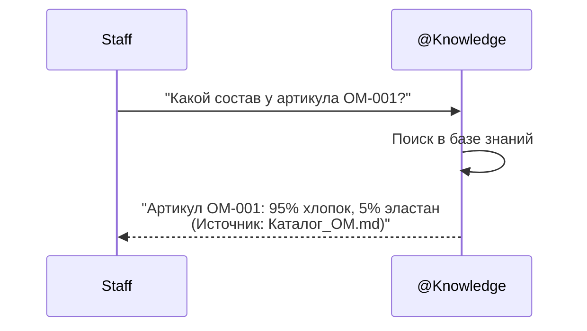
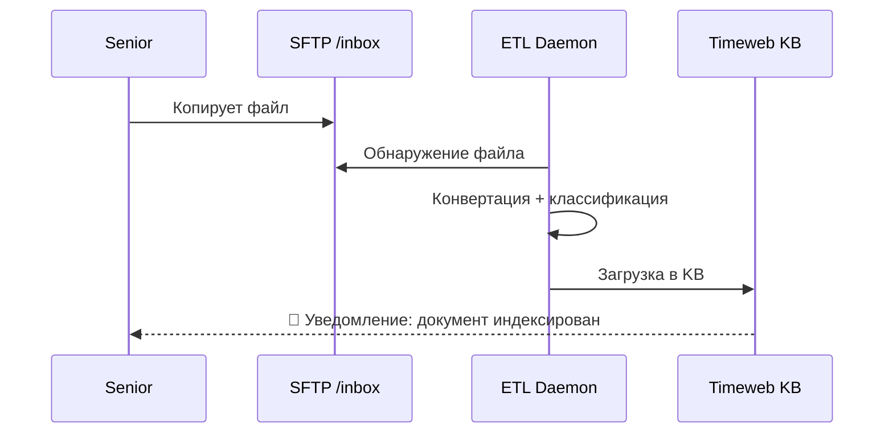

**Проект:** Корпоративная база знаний с RAG  
**Модуль:** Knowledge / User Scenarios  
**Версия:** 1.1  
**Дата:** Январь 2026

---

## 6.1. Обзор сценариев

### Матрица сценариев по ролям

| Сценарий | Staff | Manager | Senior | Director |
|----------|:-----:|:-------:|:------:|:--------:|
| Поиск информации о товаре | ✅ | ✅ | ✅ | ✅ |
| Поиск регламентов | ✅ | ✅ | ✅ | ✅ |
| Просмотр договоров | ❌ | ✅* | ✅ | ✅ |
| Финансовые отчёты | ❌ | ❌ | ✅* | ✅ |
| Загрузка документов | ❌ | ❌ | ✅ | ✅ |
| Модерация документов | ❌ | ❌ | ✅ | ✅ |

\* — в рамках своего бренда

---

## 6.2. Сценарий: Поиск информации о товаре

### Описание

Сотрудник ищет характеристики товара для ответа покупателю.

### Диаграмма



### Пример диалога

```
Сотрудник: Какой состав у артикула OM-001?

@Knowledge: Артикул OM-001 (Платье летнее) имеет следующий состав:
- 95% хлопок
- 5% эластан

Рекомендации по уходу: стирка при 30°, не отбеливать.

📄 Источник: Каталог_Охана_Маркет_2026.md
```

---

## 6.3. Сценарий: Поиск регламента

### Описание

Сотрудник ищет актуальный регламент для выполнения процедуры.

### Пример диалога

```
Сотрудник: Как оформить возврат товара?

@Knowledge: Согласно "Регламенту обработки возвратов":

1. Проверьте срок возврата (14 дней с момента получения)
2. Убедитесь в сохранности товарного вида
3. Оформите заявку в системе WMS
4. Передайте товар на склад возвратов

Подробная инструкция:
- При браке — отметьте причину "Брак производства"
- При несоответствии размеру — отметьте "Не подошёл размер"

📄 Источник: Регламент_возвратов_v3.md
```

---

## 6.4. Сценарий: Размерная сетка

### Описание

Консультант помогает клиенту выбрать размер.

### Пример диалога

```
Консультант: Подскажи размерную сетку для платьев Охана Маркет

@Knowledge: Размерная сетка платьев Охана Маркет:

| Размер | Обхват груди | Обхват талии | Обхват бёдер |
|--------|--------------|--------------|--------------|
| 42 | 84 см | 64 см | 92 см |
| 44 | 88 см | 68 см | 96 см |
| 46 | 92 см | 72 см | 100 см |
| 48 | 96 см | 76 см | 104 см |
| 50 | 100 см | 80 см | 108 см |

⚠️ Обратите внимание: модели оверсайз могут большемерить на 1 размер.

📄 Источник: Размерная_сетка_ОМ_2026.md
```

---

## 6.5. Сценарий: Поиск договора (Manager)

### Описание

Менеджер ищет условия договора с поставщиком.

### Пример диалога

```
Менеджер: Какие условия оплаты у поставщика Текстиль-Про?

@Knowledge: Условия договора с "Текстиль-Про" (договор №ТП-2025/08):

Условия оплаты:
- Предоплата: 30%
- Оплата по факту поставки: 70%
- Срок оплаты: 14 календарных дней

Минимальная партия: 100 единиц
Срок поставки: 21 рабочий день

📄 Источник: Договор_Текстиль_Про_2025.md
```

---

## 6.6. Сценарий: Финансовый отчёт (Director)

### Описание

Директор запрашивает финансовые показатели.

### Пример диалога

```
Директор: Покажи маржинальность по категориям за Q3

@Knowledge: Маржинальность по категориям Q3 2025:

| Категория | Выручка | Себестоимость | Маржа |
|-----------|---------|---------------|-------|
| Платья | 12.5 млн ₽ | 6.2 млн ₽ | 50.4% |
| Блузки | 8.3 млн ₽ | 4.5 млн ₽ | 45.8% |
| Брюки | 5.1 млн ₽ | 2.9 млн ₽ | 43.1% |
| Аксессуары | 2.8 млн ₽ | 1.1 млн ₽ | 60.7% |

Средняя маржинальность: 48.2%

📄 Источник: PnL_Q3_2025.md
```

---

## 6.7. Сценарий: Загрузка документа (Senior)

### Описание

Senior загружает новый документ в базу знаний.

### Диаграмма



### Шаги

1. Подключиться к SFTP
2. Перейти в `/inbox`
3. Загрузить файл (PDF, DOCX, XLSX)
4. Дождаться уведомления об индексации

---

## 6.8. Сценарий: Модерация документа (Senior)

### Описание

Senior проверяет и одобряет документ перед публикацией.

### Пример диалога

```
Senior: Покажи документы на модерацию

@Knowledge: Документы, ожидающие модерации:

1. 📄 Договор_Логистика_2026.pdf
   - Категория: contract
   - Уровень: senior
   - Загрузил: admin (01.01.2026)

2. 📄 KPI_отдела_продаж.xlsx
   - Категория: analytics
   - Уровень: senior
   - Загрузил: manager_01 (01.01.2026)

Senior: Одобри документ 1

@Knowledge: ✅ Документ "Договор_Логистика_2026.pdf" одобрен 
и будет проиндексирован в течение 5 минут.
```

---

## 6.9. Сценарий: Информация не найдена

### Описание

Запрос на информацию, которой нет в базе знаний.

### Пример диалога

```
Сотрудник: Какая зарплата у директора?

@Knowledge: К сожалению, информация о заработной плате 
сотрудников не найдена в доступных мне документах.

Рекомендую обратиться:
- В отдел кадров — по вопросам заработной платы
- К непосредственному руководителю — по вопросам KPI и премий
```

---

## 6.10. Сценарий: Нет доступа

### Описание

Запрос на информацию, к которой нет прав доступа.

### Пример диалога

```
Staff: Покажи P&L отчёт за квартал

@Knowledge: Информация по финансовым отчётам недоступна 
в рамках вашего уровня доступа.

Для получения финансовой информации обратитесь 
к руководителю отдела или финансовому директору.
```

---

## Приложение А: Типичные запросы по ролям

### Staff

- Какой состав у артикула X?
- Как оформить возврат?
- Размерная сетка бренда
- Правила работы с клиентами

### Manager

- Условия договора с поставщиком
- Регламент работы с браком
- KPI отдела
- Процедуры согласования

### Senior

- Аналитика продаж
- Отчёты по поставщикам
- Условия контрактов
- Модерация документов

### Director

- P&L отчёты
- Маржинальность
- Стратегические документы
- Полная аналитика

---

**Документ подготовлен:** Январь 2026  
**Версия:** 1.1  
**Статус:** Согласовано
