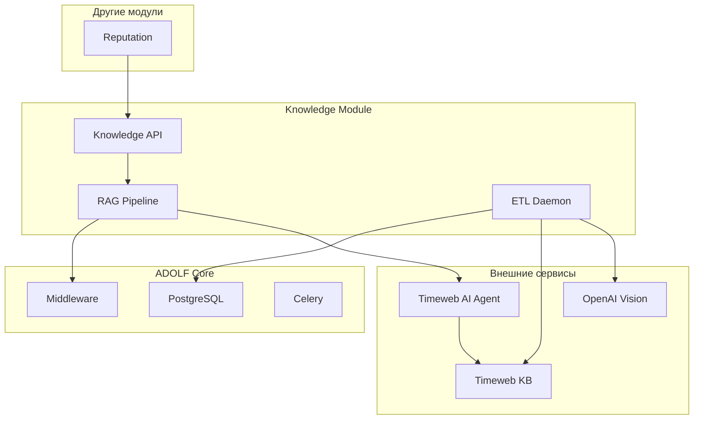

**Проект:** Корпоративная база знаний с RAG  
**Модуль:** Knowledge / Integrations  
**Версия:** 1.1  
**Дата:** Январь 2026

---

## 7.1. Обзор интеграций

### Схема интеграций



---

## 7.2. Интеграция с ADOLF Core

### Middleware

| Компонент | Использование |
|-----------|---------------|
| Авторизация | Получение роли и brand_id пользователя |
| Роутинг | Endpoints `/api/v1/knowledge/*` |
| Аудит | Логирование запросов в `audit_log` |

### PostgreSQL

| Таблица | Использование |
|---------|---------------|
| `users` | Роль, brand_id для фильтрации |
| `documents` | Метаданные загруженных документов |
| `audit_log` | История запросов |
| `quarantine` | Документы с ошибками |
| `settings` | Настройки модуля |

### Celery

| Задача | Описание |
|--------|----------|
| `etl.process_document` | Обработка нового документа |
| `etl.cleanup_archive` | Очистка старых файлов |
| `knowledge.reindex` | Переиндексация документов |

---

## 7.3. Интеграция с Timeweb KB

### Описание

Timeweb KB — managed-сервис для хранения и поиска документов.

### API Endpoints

| Операция | Endpoint | Метод |
|----------|----------|-------|
| Загрузка файла | `/api/knowledge/upload` | POST |
| Удаление | `/api/knowledge/files/{id}` | DELETE |
| Список файлов | `/api/knowledge/files` | GET |
| Поиск | `/api/knowledge/search` | POST |

### Пример загрузки

```python
async def upload_document(file_path: str) -> str:
    """Загрузка документа в Timeweb KB."""
    
    async with aiohttp.ClientSession() as session:
        data = aiohttp.FormData()
        data.add_field('file', 
                       open(file_path, 'rb'),
                       filename=os.path.basename(file_path))
        
        async with session.post(
            f"{TIMEWEB_KB_URL}/api/knowledge/upload",
            data=data,
            headers={"Authorization": f"Bearer {TIMEWEB_API_KEY}"}
        ) as response:
            result = await response.json()
            return result['file_id']
```

### Пример поиска

```python
async def search_knowledge(query: str, filters: dict) -> list:
    """Поиск в базе знаний."""
    
    payload = {
        "query": query,
        "top_k": 3,
        "filters": filters
    }
    
    async with aiohttp.ClientSession() as session:
        async with session.post(
            f"{TIMEWEB_KB_URL}/api/knowledge/search",
            json=payload,
            headers={"Authorization": f"Bearer {TIMEWEB_API_KEY}"}
        ) as response:
            result = await response.json()
            return result['results']
```

---

## 7.4. Интеграция с Timeweb AI Agent

### Описание

Timeweb AI Agent предоставляет LLM для генерации ответов.

### API

```python
async def generate_answer(
    system_prompt: str,
    user_query: str,
    context_chunks: list
) -> str:
    """Генерация ответа через AI Agent."""
    
    messages = [
        {"role": "system", "content": system_prompt},
        {"role": "user", "content": f"""
Контекст из базы знаний:
{format_chunks(context_chunks)}

Вопрос: {user_query}

Ответь на основе контекста. Укажи источник.
"""}
    ]
    
    response = await ai_client.chat_completion(
        model="gpt-5-mini",
        messages=messages,
        temperature=0.3,
        max_tokens=1000
    )
    
    return response.content
```

---

## 7.5. Интеграция с OpenAI Vision (OCR)

### Описание

OpenAI Vision используется для распознавания текста в сканированных PDF.

### API

```python
async def ocr_image(image_base64: str) -> str:
    """OCR изображения через OpenAI Vision."""
    
    response = await openai_client.chat_completion(
        model="gpt-4o",
        messages=[
            {
                "role": "user",
                "content": [
                    {
                        "type": "text",
                        "text": "Извлеки весь текст с изображения. Сохрани форматирование."
                    },
                    {
                        "type": "image_url",
                        "image_url": {
                            "url": f"data:image/png;base64,{image_base64}"
                        }
                    }
                ]
            }
        ],
        max_tokens=4000
    )
    
    return response.content
```

---

## 7.6. Интеграция с Reputation

### Описание

Модуль Reputation использует Knowledge API для получения данных о товарах при генерации ответов.

### API Endpoint

```python
# GET /api/v1/knowledge/product/{sku}
async def get_product_info(sku: str, brand_id: str) -> dict:
    """Получение информации о товаре для Reputation."""
    
    # Поиск в KB
    results = await search_knowledge(
        query=f"артикул {sku} состав размер характеристики",
        filters={"brand_id": [brand_id, "all"]}
    )
    
    if not results:
        return {"found": False}
    
    return {
        "found": True,
        "sku": sku,
        "composition": extract_composition(results),
        "sizing": extract_sizing(results),
        "care": extract_care_instructions(results)
    }
```

### Использование в Reputation

```python
# В ResponseGenerator
product_context = await knowledge_api.get_product_info(
    sku=item.sku,
    brand_id=item.brand_id
)

if product_context["found"]:
    context += f"""
Информация о товаре:
- Состав: {product_context['composition']}
- Размерная сетка: {product_context['sizing']}
"""
```

---

## 7.7. REST API Knowledge

### Endpoints

| Endpoint | Метод | Описание | Роли |
|----------|-------|----------|------|
| `/api/v1/knowledge/search` | POST | Поиск в KB | Все |
| `/api/v1/knowledge/documents` | GET | Список документов | Senior+ |
| `/api/v1/knowledge/documents/{id}` | GET | Детали документа | Senior+ |
| `/api/v1/knowledge/documents/{id}/approve` | POST | Одобрить документ | Senior+ |
| `/api/v1/knowledge/documents/{id}/reject` | POST | Отклонить документ | Senior+ |
| `/api/v1/knowledge/product/{sku}` | GET | Информация о товаре | Internal |
| `/api/v1/knowledge/stats` | GET | Статистика KB | Senior+ |

### Пример запроса поиска

```bash
curl -X POST "https://adolf.su/api/v1/knowledge/search" \
  -H "Authorization: Bearer $TOKEN" \
  -H "Content-Type: application/json" \
  -d '{
    "query": "состав артикула OM-001",
    "top_k": 3
  }'
```

### Пример ответа

```json
{
    "results": [
        {
            "document": "Каталог_ОМ_2026.md",
            "chunk": "Артикул OM-001: Платье летнее. Состав: 95% хлопок, 5% эластан.",
            "score": 0.92
        }
    ],
    "answer": "Артикул OM-001 имеет состав: 95% хлопок, 5% эластан.",
    "sources": ["Каталог_ОМ_2026.md"]
}
```

---

## 7.8. Обработка ошибок

### Единая политика (Core)

| Параметр | Значение |
|----------|----------|
| Timeout | 30 секунд |
| Retry | Exponential backoff: 1с → 2с → 4с |
| Максимум попыток | 3 |

### Fallback стратегии

| Ошибка | Действие |
|--------|----------|
| Timeweb KB недоступен | Ответ "Сервис временно недоступен" |
| AI Agent timeout | Retry с backoff |
| Нет результатов поиска | Ответ "Информация не найдена" |

---

**Документ подготовлен:** Январь 2026  
**Версия:** 1.1  
**Статус:** Согласовано
