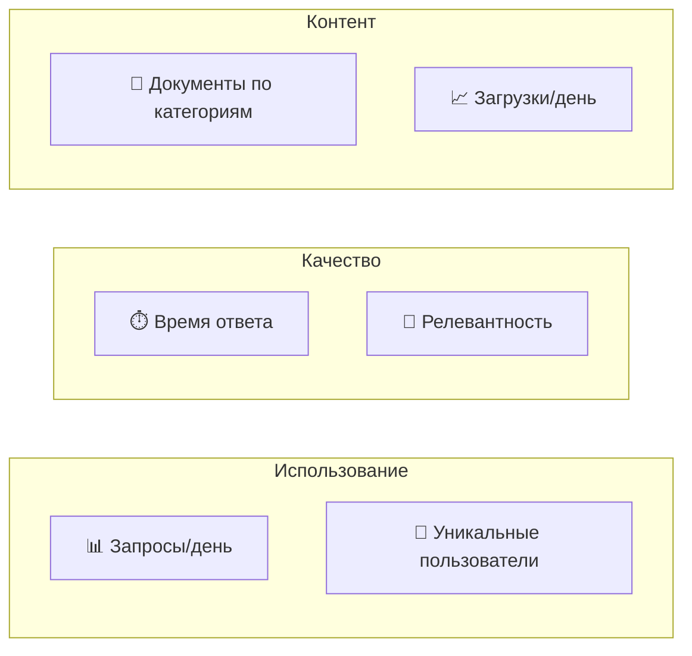

# ADOLF KNOWLEDGE — Раздел 8: Аналитика

**Проект:** Корпоративная база знаний с RAG  
**Модуль:** Knowledge / Analytics  
**Версия:** 1.1  
**Дата:** Январь 2026

---

## 8.1. Обзор аналитики

### Метрики Knowledge

| Категория | Метрики |
|-----------|---------|
| Использование | Количество запросов, уникальные пользователи |
| Качество | Время ответа, релевантность результатов |
| Контент | Количество документов, категории, покрытие |
| Операции | Загрузки, модерации, ошибки |

---

## 8.2. Метрики использования

### Запросы к базе знаний

```sql
-- Количество запросов за период
SELECT 
    DATE(created_at) as date,
    COUNT(*) as queries,
    COUNT(DISTINCT user_id) as unique_users
FROM audit_log
WHERE action = 'knowledge_query'
  AND created_at > NOW() - INTERVAL '30 days'
GROUP BY DATE(created_at)
ORDER BY date;
```

### Топ запросов

```sql
-- Популярные запросы
SELECT 
    details->>'query' as query,
    COUNT(*) as count
FROM audit_log
WHERE action = 'knowledge_query'
  AND created_at > NOW() - INTERVAL '7 days'
GROUP BY details->>'query'
ORDER BY count DESC
LIMIT 20;
```

### Запросы по ролям

```sql
-- Распределение по ролям
SELECT 
    details->>'user_role' as role,
    COUNT(*) as queries
FROM audit_log
WHERE action = 'knowledge_query'
  AND created_at > NOW() - INTERVAL '30 days'
GROUP BY details->>'user_role';
```

---

## 8.3. Метрики качества

### Время ответа

```sql
-- Среднее время ответа
SELECT 
    DATE(created_at) as date,
    AVG((details->>'response_time_ms')::int) as avg_ms,
    PERCENTILE_CONT(0.95) WITHIN GROUP (
        ORDER BY (details->>'response_time_ms')::int
    ) as p95_ms
FROM audit_log
WHERE action = 'knowledge_query'
  AND created_at > NOW() - INTERVAL '7 days'
GROUP BY DATE(created_at);
```

### Релевантность результатов

```sql
-- Распределение по релевантности
SELECT 
    CASE 
        WHEN (details->>'top_score')::float >= 0.85 THEN 'high'
        WHEN (details->>'top_score')::float >= 0.70 THEN 'medium'
        ELSE 'low'
    END as relevance,
    COUNT(*) as count
FROM audit_log
WHERE action = 'knowledge_query'
  AND details->>'top_score' IS NOT NULL
  AND created_at > NOW() - INTERVAL '30 days'
GROUP BY relevance;
```

### Запросы без результатов

```sql
-- Запросы, не нашедшие информацию
SELECT 
    details->>'query' as query,
    COUNT(*) as count
FROM audit_log
WHERE action = 'knowledge_query'
  AND (details->>'chunks_retrieved')::int = 0
  AND created_at > NOW() - INTERVAL '7 days'
GROUP BY details->>'query'
ORDER BY count DESC
LIMIT 20;
```

---

## 8.4. Метрики контента

### Статистика документов

```sql
-- Документы по категориям
SELECT 
    category,
    COUNT(*) as count,
    SUM(file_size_bytes) / 1024 / 1024 as total_mb
FROM documents
WHERE status = 'indexed'
GROUP BY category
ORDER BY count DESC;
```

### Документы по уровням доступа

```sql
-- Документы по access_level
SELECT 
    access_level,
    COUNT(*) as count
FROM documents
WHERE status = 'indexed'
GROUP BY access_level;
```

### Документы по брендам

```sql
-- Документы по brand_id
SELECT 
    brand_id,
    COUNT(*) as count
FROM documents
WHERE status = 'indexed'
GROUP BY brand_id;
```

---

## 8.5. Метрики операций

### Загрузки документов

```sql
-- Загрузки за период
SELECT 
    DATE(created_at) as date,
    COUNT(*) as uploads,
    COUNT(*) FILTER (WHERE status = 'indexed') as indexed,
    COUNT(*) FILTER (WHERE status = 'quarantine') as quarantined
FROM documents
WHERE created_at > NOW() - INTERVAL '30 days'
GROUP BY DATE(created_at);
```

### Модерация

```sql
-- Статистика модерации
SELECT 
    DATE(moderated_at) as date,
    COUNT(*) FILTER (WHERE status = 'approved') as approved,
    COUNT(*) FILTER (WHERE status = 'rejected') as rejected
FROM documents
WHERE moderated_at > NOW() - INTERVAL '30 days'
GROUP BY DATE(moderated_at);
```

### Карантин

```sql
-- Причины попадания в карантин
SELECT 
    error_type,
    COUNT(*) as count
FROM quarantine
WHERE created_at > NOW() - INTERVAL '30 days'
GROUP BY error_type
ORDER BY count DESC;
```

---

## 8.6. Dashboard

### Ключевые показатели

| Показатель | Запрос |
|------------|--------|
| Всего документов | `SELECT COUNT(*) FROM documents WHERE status = 'indexed'` |
| Запросов сегодня | `SELECT COUNT(*) FROM audit_log WHERE action = 'knowledge_query' AND DATE(created_at) = CURRENT_DATE` |
| Среднее время ответа | `AVG(response_time_ms)` |
| На модерации | `SELECT COUNT(*) FROM documents WHERE status = 'pending'` |
| В карантине | `SELECT COUNT(*) FROM quarantine WHERE resolved_at IS NULL` |

### Графики



---

## 8.7. Отчёты

### Еженедельный отчёт

```
📊 Knowledge Analytics — Неделя 02/2026

ИСПОЛЬЗОВАНИЕ:
- Всего запросов: 1,234
- Уникальных пользователей: 18
- Запросов в день: 176 (среднее)

КАЧЕСТВО:
- Среднее время ответа: 1.8 сек
- P95 время ответа: 3.2 сек
- Высокая релевантность: 78%

КОНТЕНТ:
- Всего документов: 156
- Загружено за неделю: 12
- На модерации: 3
- В карантине: 1

ТОП ЗАПРОСЫ:
1. "размерная сетка" — 89
2. "состав ткани" — 67
3. "регламент возврата" — 45
```

### Ежемесячный отчёт

Включает:
- Динамика использования
- Тренды запросов
- Анализ качества ответов
- Рекомендации по улучшению контента

---

## 8.8. Alerts

### Настройка алертов

| Условие | Уровень | Действие |
|---------|---------|----------|
| Время ответа > 10 сек | Warning | Уведомление Admin |
| Документов на модерации > 10 | Info | Уведомление Senior |
| В карантине > 5 | Warning | Уведомление Admin |
| Запросов без результатов > 20% | Warning | Анализ контента |

---

**Документ подготовлен:** Январь 2026  
**Версия:** 1.1  
**Статус:** Согласовано
