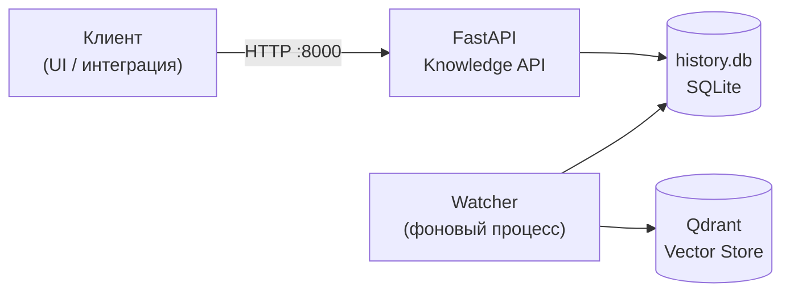

**Проект:** ADOLF — AI-Driven Operations Layer Framework
**Модуль:** Knowledge Base / REST API
**Версия:** 1.0
**Дата:** Февраль 2026

---

## 1. Обзор

Knowledge Base API предоставляет HTTP-доступ к базе знаний документов: загрузка файлов, просмотр статусов обработки, поиск и статистика. Работает как часть Doc Converter Service.

| Компонент | Файл | Процесс | Порт |
|-----------|------|---------|:----:|
| REST API | `src/api/` | `src.main serve` | 8000 |
| Database | `src/database.py` | внутри API | — |



---

## 2. Общие характеристики

| Параметр | Значение |
|----------|----------|
| Фреймворк | FastAPI (Python) |
| Формат | JSON |
| Базовый путь | `/api/v1/knowledge` |
| CORS | `Access-Control-Allow-Origin: *` |
| Макс. размер файла | 50 МБ (настраивается, 1–100 МБ) |
| Аутентификация | Нет |
| Документация | Swagger UI `/api/docs`, ReDoc `/api/redoc`, OpenAPI `/api/openapi.json` |

---

## 3. Эндпоинты

### Системные

| Метод | Путь | Query params | Описание |
|:-----:|------|:------------:|----------|
| GET | `/health` | — | Проверка состояния сервиса и БД |
| GET | `/api/v1/knowledge/stats` | — | Агрегированная статистика базы знаний |

#### Формат ответа /health

```json
{
  "status": "healthy",
  "version": "1.1.17",
  "database": "/path/to/history.db"
}
```

#### Формат ответа /stats

```json
{
  "total_documents": 142,
  "total_categories": 8,
  "documents_today": 5,
  "moderating": 0,
  "by_category": {"product": 45, "legal": 12},
  "by_status": {"indexed": 130, "failed": 2},
  "by_extension": {".pdf": 80, ".docx": 40},
  "by_brand": {"ohana_market": 90, "ohana_kids": 52},
  "success": 140,
  "indexed": 130,
  "failed": 2,
  "skipped": 0,
  "total_tokens": 125000,
  "avg_processing_seconds": 3.4
}
```

### Документы

| Метод | Путь | Query params | Описание |
|:-----:|------|:------------:|----------|
| GET | `/api/v1/knowledge/documents` | `status`, `category` | Список документов с фильтрацией |
| GET | `/api/v1/knowledge/documents/search` | `q` (**обяз.**), `status`, `category` | Поиск документов по имени файла |
| GET | `/api/v1/knowledge/documents/category-counts` | — | Количество документов по категориям |
| POST | `/api/v1/knowledge/documents/upload` | — | Загрузка одного файла (202) |
| POST | `/api/v1/knowledge/documents/upload-batch` | — | Пакетная загрузка файлов, макс. 20 (202) |
| GET | `/api/v1/knowledge/documents/{doc_id}` | — | Получение документа по ID |

#### Query-параметры фильтрации

| Параметр | Тип | Описание |
|----------|-----|----------|
| `status` | string | `success`, `indexed`, `failed`, `skipped` |
| `category` | string | Одна из категорий (см. [Перечисления](#5-перечисления-enums)) |
| `q` | string | Поисковый запрос — подстрока имени файла (SQLite LIKE) |

#### POST /upload — `multipart/form-data`

| Поле | Тип | Обязательный | Описание |
|------|-----|:------------:|----------|
| `file` | file | **Да** | Загружаемый файл |

Поддерживаемые расширения: `.csv`, `.xlsx`, `.xls`, `.xlsm`, `.xlsb`, `.docx`, `.pdf`, `.html`, `.htm`, `.rtf`, `.odt`, `.txt`, `.md`, `.xml`, `.png`, `.jpg`, `.jpeg`

```json
{
  "filename": "report_1.pdf",
  "original_filename": "report.pdf",
  "size_bytes": 245760,
  "status": "accepted",
  "message": "File accepted for processing"
}
```

#### POST /upload-batch — `multipart/form-data`

| Поле | Тип | Обязательный | Описание |
|------|-----|:------------:|----------|
| `files` | file[] | **Да** | Список файлов (макс. 20) |

```json
{
  "uploaded": [
    {
      "filename": "report.pdf",
      "original_filename": "report.pdf",
      "size_bytes": 245760,
      "status": "accepted",
      "message": "File accepted for processing"
    }
  ],
  "failed": [
    {
      "filename": "broken.exe",
      "error": "Unsupported file extension: .exe"
    }
  ],
  "total_accepted": 4,
  "total_failed": 1
}
```

#### Формат ответа /documents/{doc_id}

```json
{
  "id": "abc123",
  "original_filename": "report.pdf",
  "extension": ".pdf",
  "file_hash": "sha256...",
  "file_size": 245760,
  "output_path": "./output/report.md",
  "archive_path": "./archive/product/ohana_market/report.pdf",
  "title": "Product Catalog Q1 2025",
  "category": "product",
  "brand_id": "ohana_market",
  "access_level": "staff",
  "confidence": 0.95,
  "classified_by": "claude",
  "kb_file_id": null,
  "status": "indexed",
  "error_message": null,
  "processing_seconds": 4.2,
  "tokens_used": 1500,
  "detected_at": "2025-01-15T10:30:00",
  "created_at": "2025-01-15T10:30:05",
  "indexed_at": "2025-01-15T10:30:09"
}
```

### Модели ответов

#### DocumentResponse

Основная модель документа, используемая во всех эндпоинтах, возвращающих документы.

| Поле | Тип | Описание |
|------|-----|----------|
| `id` | string | Уникальный ID документа |
| `original_filename` | string | Исходное имя загруженного файла |
| `extension` | string | Расширение файла (`.pdf`, `.docx` и т.д.) |
| `file_hash` | string? | SHA-256 хеш файла |
| `file_size` | int? | Размер файла в байтах |
| `output_path` | string? | Путь к сконвертированному markdown |
| `archive_path` | string? | Путь в директории архива |
| `title` | string? | Извлечённый/классифицированный заголовок |
| `category` | string? | Категория документа |
| `brand_id` | string? | `ohana_market`, `ohana_kids` или `all` |
| `access_level` | string? | `staff`, `manager`, `senior` или `director` |
| `confidence` | float? | Уверенность классификации (0–1) |
| `classified_by` | string? | Источник классификации |
| `kb_file_id` | string? | Ссылка на внешний файл в KB |
| `status` | string | `success`, `indexed`, `failed`, `skipped` |
| `error_message` | string? | Детали ошибки при сбое |
| `processing_seconds` | float? | Время обработки |
| `tokens_used` | int | Использовано токенов |
| `detected_at` | datetime | Когда файл обнаружен |
| `created_at` | datetime? | Когда запись создана |
| `indexed_at` | datetime? | Когда проиндексирован в векторное хранилище |

#### Вспомогательные модели

**DocumentListResponse** — обёртка списка документов.

| Поле | Тип | Описание |
|------|-----|----------|
| `items` | DocumentResponse[] | Список документов |
| `total` | int | Общее количество |

**StatsResponse** — агрегированная статистика.

| Поле | Тип | Описание |
|------|-----|----------|
| `total_documents` | int | Общее количество документов |
| `total_categories` | int | Количество уникальных категорий |
| `documents_today` | int | Документов обработано сегодня |
| `moderating` | int | Документов на модерации |
| `by_category` | dict[str, int] | Количество по категориям |
| `by_status` | dict[str, int] | Количество по статусам |
| `by_extension` | dict[str, int] | Количество по расширениям файлов |
| `by_brand` | dict[str, int] | Количество по брендам |
| `success` | int | Успешно сконвертировано |
| `indexed` | int | Проиндексировано в векторном хранилище |
| `failed` | int | Ошибка обработки |
| `skipped` | int | Пропущено (дубликат и т.д.) |
| `total_tokens` | int | Всего использовано токенов |
| `avg_processing_seconds` | float | Среднее время обработки |

**HealthResponse** — состояние сервиса.

| Поле | Тип | Описание |
|------|-----|----------|
| `status` | string | `"healthy"` |
| `version` | string | Версия API |
| `database` | string | Путь к БД или `"unavailable"` |

**CategoryCountsResponse** — количество по категориям.

| Поле | Тип | Описание |
|------|-----|----------|
| `categories` | dict[str, int] | Количество документов по категориям |

**FileUploadResponse** — результат загрузки файла.

| Поле | Тип | Описание |
|------|-----|----------|
| `filename` | string | Сохранённое имя файла (может содержать суффикс для дедупликации) |
| `original_filename` | string | Исходное имя файла от клиента |
| `size_bytes` | int | Размер файла |
| `status` | string | Всегда `"accepted"` |
| `message` | string | `"File accepted for processing"` |

**BatchUploadResponse** — результат пакетной загрузки.

| Поле | Тип | Описание |
|------|-----|----------|
| `uploaded` | FileUploadResponse[] | Успешно загруженные файлы |
| `failed` | FileUploadErrorDetail[] | Файлы, не прошедшие валидацию |
| `total_accepted` | int | Количество принятых файлов |
| `total_failed` | int | Количество отклонённых файлов |

**FileUploadErrorDetail** — детали ошибки загрузки.

| Поле | Тип | Описание |
|------|-----|----------|
| `filename` | string | Имя отклонённого файла |
| `error` | string | Описание ошибки |

---

## 4. Коды ответов

| Код | Ситуация |
|:---:|----------|
| 200 | Успех |
| 202 | Файл принят для обработки (upload) |
| 400 | Ошибка валидации (неподдерживаемое расширение, пустой файл, слишком большой файл, >20 файлов в batch) |
| 404 | Документ не найден |
| 422 | Ошибка валидации параметров запроса (FastAPI) |
| 500 | Внутренняя ошибка |

---

## 5. Перечисления (Enums)

| Перечисление | Значения |
|--------------|----------|
| DocumentStatus | `success`, `indexed`, `failed`, `skipped` |
| Category | `product`, `regulation`, `contract`, `finance`, `analytics`, `hr`, `logistics`, `marketing`, `technical`, `correspondence`, `legal`, `other` |
| BrandId | `ohana_market`, `ohana_kids`, `all` |
| AccessLevel | `staff`, `manager`, `senior`, `director` |

---

**Документ подготовлен:** Февраль 2026
**Версия:** 1.0
**Статус:** Актуальный
