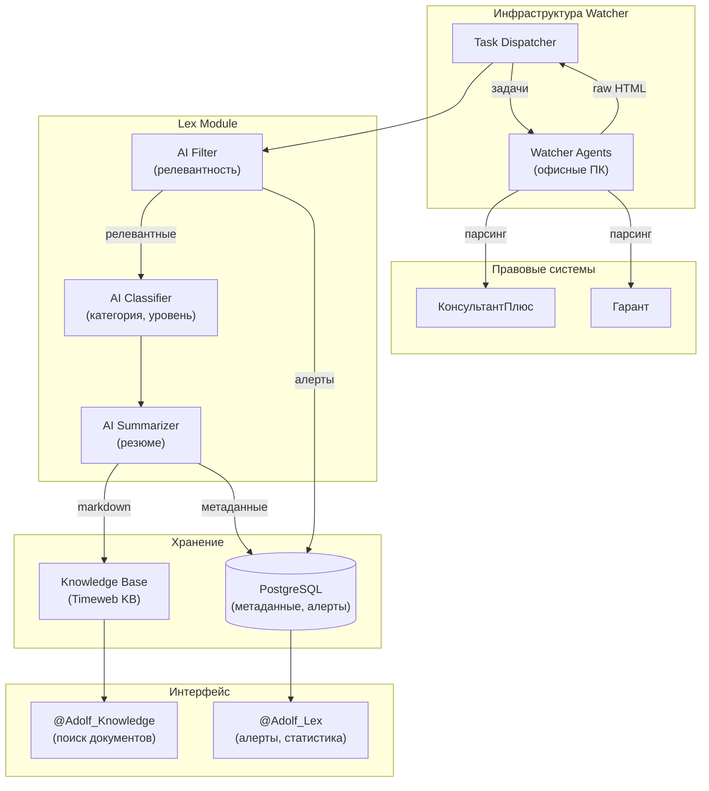
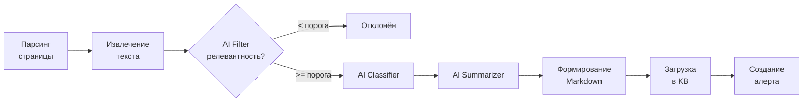

**Проект:** Автоматизированный правовой мониторинг для e-commerce  
**Модуль:** Lex  
**Версия:** 1.0  
**Дата:** Январь 2026

---

## 0.1 Назначение модуля

### Описание

Lex — модуль системы ADOLF, предназначенный для автоматизированного сбора, обработки и индексации правовых документов, релевантных для e-commerce бизнеса в сфере fashion retail. Модуль использует инфраструктуру Watcher (агенты, Task Dispatcher) для парсинга правовых систем и загружает обработанные документы в Knowledge Base.

### Бизнес-цели

| Цель | Описание |
|------|----------|
| Правовой мониторинг | Отслеживание изменений в законодательстве, затрагивающих e-commerce |
| Снижение рисков | Своевременное информирование о новых требованиях и ограничениях |
| Единая база | Консолидация правовой информации в корпоративной базе знаний |
| Оперативность | Автоматические алерты о важных изменениях |
| Экспертиза | AI-резюме документов с оценкой влияния на бизнес |

### Ключевая особенность

Lex работает на инфраструктуре Watcher, но с другими целями:

| Параметр | Watcher | Lex |
|----------|---------|-----|
| Цели парсинга | WB, Ozon, YM | КонсультантПлюс, Гарант |
| Тип данных | Цены, остатки, рейтинги | Правовые документы |
| Output | JSON → PostgreSQL | Markdown → Knowledge Base |
| Cookies | Требуются (менеджера МП) | Не требуются (публичный доступ) |
| AI-обработка | Извлечение структурированных данных | Резюме + классификация релевантности |

Задачи Lex добавляются в общую очередь Watcher и выполняются агентами в ночное время (21:00–07:00).

---

## 0.2 Поддерживаемые источники

### MVP (v1.0)

| Приоритет | Источник | Тип контента |
|:---------:|----------|--------------|
| 1 | КонсультантПлюс | НПА, судебная практика, разъяснения |
| 2 | Гарант | НПА, судебная практика, разъяснения |

### v2.0 (планы)

| Источник | Тип контента |
|----------|--------------|
| Российская газета | Официальные публикации законов |
| pravo.gov.ru | Официальный портал правовой информации |
| ФНС (nalog.gov.ru) | Разъяснения, письма по налогам |
| Роспотребнадзор | Разъяснения по защите прав потребителей |
| Росаккредитация | Маркировка, сертификация |
| Честный ЗНАК | Новости системы маркировки |

---

## 0.3 Тематики мониторинга

### Категории документов

| Категория | Код | Описание |
|-----------|-----|----------|
| Торговля | `trade` | Дистанционная торговля, маркетплейсы, розница, опт |
| Маркировка | `marking` | Маркировка товаров, Честный ЗНАК, лёгкая промышленность |
| Права потребителей | `consumer_rights` | Возврат, гарантия, претензии |
| Реклама | `advertising` | Интернет-реклама, таргетинг, маркетинг |
| Налоги | `tax` | НДС, УСН, налог на прибыль |
| Труд | `labor` | Трудовые отношения, удалённая работа, ГПХ |
| Персональные данные | `personal_data` | Обработка ПДн, согласия |

### Типы документов

| Тип | Код | Примеры |
|-----|-----|---------|
| Федеральный закон | `federal_law` | ФЗ о защите прав потребителей, ФЗ о торговле |
| Изменение НПА | `amendment` | Поправки в существующие законы |
| Постановление | `decree` | Постановления Правительства РФ |
| Судебное решение | `court_decision` | Решения по спорам с маркетплейсами |
| Разъяснение | `clarification` | Письма ФНС, Минпромторга, Роспотребнадзора |
| Стандарт | `standard` | ГОСТы на текстильную продукцию |

---

## 0.4 Архитектура высокого уровня



### Компоненты системы

| Компонент | Расположение | Назначение |
|-----------|--------------|------------|
| Task Dispatcher | VPS (Watcher) | Формирование задач парсинга, распределение по агентам |
| Watcher Agents | Офисные ПК | Парсинг страниц КонсультантПлюс/Гарант |
| AI Filter | VPS | Оценка релевантности документа (GPT-5 mini) |
| AI Classifier | VPS | Определение категории и уровня релевантности |
| AI Summarizer | VPS | Генерация резюме документа |
| Knowledge Base | Timeweb KB | Хранение полных текстов и резюме |
| PostgreSQL | VPS | Метаданные, алерты, настройки, статистика |

---

## 0.5 Обработка документов

### Pipeline обработки



### AI-фильтрация

Каждый документ оценивается на релевантность для fashion e-commerce:

| Оценка | Действие |
|--------|----------|
| &lt; порога (настраиваемый) | Документ отклоняется, не попадает в KB |
| &gt;= порога | Документ проходит классификацию и индексацию |

### AI-классификация

| Уровень релевантности | Код | Описание |
|-----------------------|-----|----------|
| Высокая | `high` | Напрямую влияет на бизнес (маркетплейсы, маркировка одежды) |
| Средняя | `medium` | Косвенно влияет (общие нормы торговли, налоги) |
| Низкая | `low` | Потенциально релевантно (смежные отрасли) |

---

## 0.6 Ролевая модель

### Матрица доступа

| Функция | Manager | Senior | Director | Admin |
|---------|:-------:|:------:|:--------:|:-----:|
| Поиск документов (через Knowledge) | ✅ | ✅ | ✅ | ✅ |
| Просмотр алертов Lex | ✅ | ✅ | ✅ | ✅ |
| Просмотр статистики | ✅ | ✅ | ✅ | ✅ |
| Запрос «Что нового в законодательстве?» | ✅ | ✅ | ✅ | ✅ |
| Ручное добавление документа | ❌ | ✅ | ✅ | ✅ |
| Редактирование ключевых слов | ❌ | ❌ | ❌ | ✅ |
| Настройка порога релевантности | ❌ | ❌ | ❌ | ✅ |
| Управление источниками | ❌ | ❌ | ❌ | ✅ |

### Получатели алертов

Все алерты Lex отправляются ролям Manager и выше:

| Роль | Получает алерты |
|------|:---------------:|
| Staff | ❌ |
| Manager | ✅ |
| Senior | ✅ |
| Director | ✅ |
| Administrator | ✅ |

---

## 0.7 Алерты и уведомления

### Типы алертов

| Событие | Уровень | Описание |
|---------|---------|----------|
| Новый закон/постановление | `info` | Обнаружен новый НПА по отслеживаемым тематикам |
| Изменение существующего НПА | `warning` | Внесены поправки в действующий закон |
| Новое судебное решение | `info` | Решение по спору, связанному с e-commerce |
| Разъяснение госоргана | `info` | Письмо ФНС, Минпромторга и др. |
| Приближение срока вступления в силу | `warning` | Документ вступает в силу в ближайшее время |
| Упоминание маркетплейса | `info` | Документ содержит упоминание WB, Ozon, YM |

### Формат алерта

```
📜 [Lex] Новый федеральный закон
   ФЗ-XXX «О внесении изменений в закон о защите прав потребителей»
   Категория: Права потребителей | Релевантность: Высокая
   Вступает в силу: 01.03.2026
   
   Резюме: Новые правила возврата товаров, купленных на маркетплейсах...
```

---

## 0.8 Ключевые слова для фильтрации

### Базовый список (редактируемый)

| Категория | Ключевые слова |
|-----------|----------------|
| Торговля | маркетплейс, дистанционная торговля, интернет-магазин, розничная торговля, оптовая торговля, электронная коммерция |
| Маркировка | маркировка товаров, Честный ЗНАК, товары лёгкой промышленности, одежда, текстиль, обувь |
| Права потребителей | возврат товара, защита прав потребителей, гарантия, претензия, недостаток товара |
| Реклама | реклама в интернете, таргетированная реклама, маркетинг, рекламная деятельность |
| Налоги | НДС, УСН, налог на прибыль, самозанятые, индивидуальный предприниматель |
| Труд | трудовой договор, удалённая работа, дистанционная работа, ГПХ, гражданско-правовой договор |
| Персональные данные | персональные данные, обработка ПДн, согласие на обработку, оператор ПДн |
| Платформы | Wildberries, Ozon, Яндекс.Маркет, Яндекс Маркет, маркетплейс |

Администратор может редактировать список через настройки модуля.

---

## 0.9 Формат документа в Knowledge Base

### YAML-заголовок

```yaml
---
source: consultant_plus | garant
document_type: federal_law | amendment | decree | court_decision | clarification | standard
document_number: "ФЗ-381"
document_date: 2025-12-15
effective_date: 2026-03-01
category: trade | marking | consumer_rights | advertising | tax | labor | personal_data
relevance: high | medium | low
brand_id: shared
access_level: manager
indexed_at: 2026-01-20
original_url: "https://..."
---
```

### Структура документа

```markdown
---
[YAML-заголовок]
---

## Резюме

**Название:** [Полное название документа]
**Суть:** [Краткое описание в 1-2 предложениях]
**На кого распространяется:** [Субъекты регулирования]
**Срок вступления в силу:** [Дата]
**Ключевые положения:**
- Положение 1
- Положение 2
- Положение 3

**Влияние на бизнес:** [Оценка влияния на fashion e-commerce]

---

## Полный текст

[Текст документа]
```

---

## 0.10 Интеграции

### Зависимости от ADOLF Core

| Компонент Core | Использование в Lex |
|----------------|---------------------|
| Middleware | Авторизация, роутинг API, проверка ролей |
| PostgreSQL | Метаданные документов, алерты, настройки, статистика |
| Celery | Фоновые задачи (не используются напрямую — через Watcher) |
| Redis | Очередь задач Watcher |
| Notifications | Отправка алертов пользователям |
| Open WebUI | Pipeline `@Adolf_Lex`, Tools |

### Зависимости от ADOLF Watcher

| Компонент Watcher | Использование в Lex |
|-------------------|---------------------|
| Task Dispatcher | Формирование и распределение задач парсинга |
| Watcher Agents | Выполнение парсинга страниц |
| AI Parser | Базовое извлечение текста (расширено для Lex) |

### Зависимости от ADOLF Knowledge

| Компонент Knowledge | Использование в Lex |
|---------------------|---------------------|
| Timeweb KB | Хранение документов (полный текст + резюме) |
| RAG Pipeline | Поиск по правовым документам |
| ETL | Индексация документов |

### Интеграции v2.0 (планы)

| Модуль | Интеграция |
|--------|------------|
| Reputation | Подсказка релевантных статей закона при ответе на претензию |
| Content Factory | Проверка описаний на соответствие требованиям |
| CFO | Алерты об изменениях налогового законодательства |

---

## 0.11 Технологический стек

### Серверная часть

| Компонент | Технология |
|-----------|------------|
| API | FastAPI (Python 3.11) |
| База данных | PostgreSQL 15 |
| Очередь | Redis (через Watcher) |
| AI (фильтрация, классификация) | GPT-5 mini |
| AI (резюме) | GPT-5 mini |
| Knowledge Base | Timeweb KB |

### Клиентская часть

| Компонент | Технология |
|-----------|------------|
| Парсинг | Watcher Agents (Playwright) |
| Интерфейс | Open WebUI |

---

## 0.12 Структура документации

| Раздел | Содержание |
|--------|------------|
| **0. Introduction** | Обзор, роли, быстрый старт (этот документ) |
| **1. Architecture** | Компоненты, зависимости, интеграция с Watcher |
| **2. Data Sources** | Парсинг КонсультантПлюс, Гарант, форматы данных |
| **3. AI Pipeline** | Фильтрация, классификация, генерация резюме |
| **4. Open WebUI** | Pipeline `@Adolf_Lex`, Tools, интерфейс |
| **5. Database** | Схема таблиц (метаданные, алерты, настройки) |
| **6. Scenarios** | Пользовательские сценарии |
| **7. Celery** | Фоновые задачи |

---

## 0.13 Быстрый старт

### Для менеджера

1. Откройте Open WebUI
2. Для поиска правовой информации используйте `@Adolf_Knowledge`:
   - «Какие требования к возврату товаров на маркетплейсах?»
   - «Найди закон о маркировке одежды»
3. Для просмотра последних изменений используйте `@Adolf_Lex`:
   - «Что нового в законодательстве за неделю?»
   - «Покажи алерты»
4. Для детализации: «Расскажи подробнее про ФЗ-XXX»

### Для Senior / Director

1. Все возможности менеджера
2. Ручное добавление документа:
   - «Добавь документ https://...»
   - Или загрузите файл (PDF, DOCX) через интерфейс
3. Запрос аналитики:
   - «Сколько документов по категории маркировка?»
   - «Какие законы вступают в силу в этом месяце?»

### Для Administrator

1. Настройте ключевые слова для фильтрации:
   - Open WebUI → Настройки → Lex → Ключевые слова
2. Настройте порог релевантности:
   - По умолчанию: 60%
3. Проверьте интеграцию с Watcher:
   - Задачи Lex должны появляться в очереди Watcher
4. Мониторьте статистику:
   - «Статистика Lex за месяц»

---

## 0.14 Способы добавления документов

### Автоматический сбор (основной)

| Параметр | Значение |
|----------|----------|
| Расписание | Ежедневно 21:00–07:00 (синхронно с Watcher) |
| Источники | КонсультантПлюс, Гарант |
| Триггер | Новые документы, изменения в отслеживаемых |

### Ручное добавление (Senior+)

| Способ | Описание |
|--------|----------|
| По URL | Вставка ссылки на документ в КонсультантПлюс/Гарант |
| Загрузка файла | PDF или DOCX через интерфейс Open WebUI |

---

## 0.15 Хранение данных

### Сроки хранения

| Тип данных | Срок хранения |
|------------|---------------|
| Документы в KB | Бессрочно |
| Метаданные в PostgreSQL | Бессрочно |
| Алерты (прочитанные) | 1 год |
| Логи парсинга | 90 дней |

### Объём данных (оценка)

| Параметр | Значение |
|----------|----------|
| Новых документов в день | ~10-50 |
| Средний размер документа | ~50 КБ |
| Прирост KB в месяц | ~50-150 МБ |

---

## 0.16 Разграничение MVP и v2.0

### MVP (v1.0)

| Функция | Статус |
|---------|:------:|
| Парсинг КонсультантПлюс | ✅ |
| Парсинг Гарант | ✅ |
| AI-фильтрация по релевантности | ✅ |
| AI-классификация (категория, уровень) | ✅ |
| AI-резюме | ✅ |
| Индексация в Knowledge Base | ✅ |
| Алерты (все типы) | ✅ |
| Pipeline `@Adolf_Lex` | ✅ |
| Ручное добавление документов | ✅ |
| Редактирование ключевых слов | ✅ |

### v2.0 (планы)

| Функция | Статус |
|---------|:------:|
| Дополнительные источники (6 шт.) | 🔜 |
| Напоминания о сроках вступления в силу | 🔜 |
| Интеграция с Reputation | 🔜 |
| Интеграция с Content Factory | 🔜 |
| Интеграция с CFO | 🔜 |
| Дайджест изменений (еженедельный отчёт) | 🔜 |
| Сравнение версий документа | 🔜 |

---

## 0.17 Типичные сценарии использования

| Сценарий | Pipeline | Пример запроса |
|----------|----------|----------------|
| Поиск правовой информации | `@Adolf_Knowledge` | «Какие штрафы за отсутствие маркировки?» |
| Последние изменения | `@Adolf_Lex` | «Что нового в законодательстве за неделю?» |
| По категории | `@Adolf_Lex` | «Покажи новые документы по маркировке» |
| Алерты | `@Adolf_Lex` | «Покажи непрочитанные алерты» |
| Конкретный документ | `@Adolf_Lex` | «Расскажи про ФЗ-381» |
| Срок вступления | `@Adolf_Lex` | «Какие законы вступают в силу в феврале?» |
| Влияние на бизнес | `@Adolf_Lex` | «Как новый закон о маркировке влияет на нас?» |
| Статистика | `@Adolf_Lex` | «Сколько документов собрано по категориям?» |

---

## 0.18 Контакты и ответственные

| Область | Ответственный |
|---------|---------------|
| Техническая поддержка | Administrator |
| Настройка ключевых слов | Administrator |
| Ручное добавление документов | Senior+ |
| Интерпретация правовых норм | Director (+ внешний юрист) |

---

**Документ подготовлен:** Январь 2026  
**Версия:** 1.0  
**Статус:** Черновик
