```mermaid
sequenceDiagram
    participant USER as Senior/Director
    participant API as Lex API
    participant FETCH as URL Fetcher
    participant PARSE as Text Extractor
    participant AI as AI Pipeline

    USER->>API: POST /upload {url: "..."}
    
    API->>API: Validate URL (whitelist)
    
    alt URL не в whitelist
        API-->>USER: 400 Bad Request
    else URL валиден
        API->>FETCH: fetch(url)
        FETCH-->>API: HTML content
        
        API->>PARSE: extract_text(html)
        PARSE-->>API: raw_text + metadata
        
        API->>AI: process_document(text)
        Note over AI: Filter → Classify → Summarize
        
        AI-->>API: processed_document
        API-->>USER: 200 OK {document_id}
    end
```

```mermaid
sequenceDiagram
    participant USER as Senior/Director
    participant API as Lex API
    participant PARSE as File Parser
    participant AI as AI Pipeline
    participant KB as Knowledge Base

    USER->>API: POST /upload (multipart/form-data)
    Note over USER,API: file: document.pdf

    API->>API: Validate file (format, size)
    
    alt Невалидный файл
        API-->>USER: 400 Bad Request
    else Файл валиден
        API->>PARSE: parse_file(file)
        
        alt PDF
            PARSE->>PARSE: PyMuPDF extract
            alt Скан (no text layer)
                PARSE->>PARSE: OCR (GPT-5 mini Vision)
            end
        else DOCX
            PARSE->>PARSE: python-docx extract
        end
        
        PARSE-->>API: raw_text + file_metadata
        
        API->>AI: process_document(text)
        AI-->>API: processed_document
        
        API->>KB: upload_document(markdown)
        KB-->>API: kb_document_id
        
        API-->>USER: 200 OK {document_id}
    end
```

**Проект:** Автоматизированный правовой мониторинг для e-commerce  
**Модуль:** Lex / Data Sources  
**Версия:** 1.0  
**Дата:** Январь 2026

---

## 2.1 Обзор источников данных

### Карта источников

```mermaid
graph TB
    subgraph LEX["Lex Module"]
        TASK_GEN["Task Generator"]
        ADAPTERS["Source Adapters"]
        UPLOAD["Manual Upload"]
    end

    subgraph AUTO["Автоматический сбор (MVP)"]
        CP["КонсультантПлюс"]
        GR["Гарант"]
    end

    subgraph AUTO_V2["Автоматический сбор (v2.0)"]
        RG["Российская газета"]
        PRAVO["pravo.gov.ru"]
        FNS["ФНС"]
        RPN["Роспотребнадзор"]
        RA["Росаккредитация"]
        CZ["Честный ЗНАК"]
    end

    subgraph MANUAL["Ручная загрузка"]
        URL["URL документа"]
        FILE["PDF / DOCX"]
    end

    TASK_GEN --> ADAPTERS
    ADAPTERS --> CP & GR
    ADAPTERS -.->|v2.0| RG & PRAVO & FNS & RPN & RA & CZ

    UPLOAD --> URL & FILE
```



### Сводная таблица источников

| Источник | Тип | Метод | Версия | Приоритет | Обязательность |
|----------|-----|-------|--------|:---------:|:--------------:|
| КонсультантПлюс | Правовая система | Парсинг | MVP | 1 | ✅ Обязательно |
| Гарант | Правовая система | Парсинг | MVP | 2 | ✅ Обязательно |
| Ручная загрузка (URL) | Пользовательский ввод | HTTP Fetch | MVP | — | ✅ Обязательно |
| Ручная загрузка (файл) | Пользовательский ввод | File Parse | MVP | — | ✅ Обязательно |
| Российская газета | Официальное издание | Парсинг | v2.0 | 3 | Желательно |
| pravo.gov.ru | Портал правовой информации | API/Парсинг | v2.0 | 4 | Желательно |
| ФНС (nalog.gov.ru) | Госорган | Парсинг | v2.0 | 5 | Опционально |
| Роспотребнадзор | Госорган | Парсинг | v2.0 | 6 | Опционально |
| Росаккредитация | Госорган | Парсинг | v2.0 | 7 | Опционально |
| Честный ЗНАК | Система маркировки | Парсинг | v2.0 | 8 | Опционально |

### Типы собираемых документов

| Тип документа | Код | Источники | Описание |
|---------------|-----|-----------|----------|
| Федеральный закон | `federal_law` | КонсультантПлюс, Гарант | ФЗ, принятые Госдумой |
| Изменение НПА | `amendment` | КонсультантПлюс, Гарант | Поправки в действующие законы |
| Постановление | `decree` | КонсультантПлюс, Гарант | Постановления Правительства РФ |
| Судебное решение | `court_decision` | КонсультантПлюс, Гарант | Решения судов по e-commerce |
| Разъяснение | `clarification` | КонсультантПлюс, Гарант | Письма ФНС, Минпромторга |
| Стандарт | `standard` | КонсультантПлюс, Гарант | ГОСТы, технические регламенты |

---

## 2.2 КонсультантПлюс

### 2.2.1 Общая информация

| Параметр | Значение |
|----------|----------|
| Название | КонсультантПлюс |
| URL | `https://www.consultant.ru` |
| Тип доступа | Публичный (бесплатные разделы) |
| Метод сбора | Парсинг через Watcher Agents |
| Частота | Ежедневно (21:00–07:00) |

### 2.2.2 Структура сайта

```mermaid
graph TB
    subgraph CONSULTANT["consultant.ru"]
        MAIN["Главная"]
        
        subgraph LAW["Законодательство"]
            FZ["Федеральные законы"]
            PP["Постановления Правительства"]
            UKAZ["Указы Президента"]
        end
        
        subgraph PRACTICE["Судебная практика"]
            VS["Верховный суд"]
            AS["Арбитражные суды"]
        end
        
        subgraph CONSULT["Консультации"]
            FNS_C["ФНС"]
            MINFIN["Минфин"]
            MINTRUD["Минтруд"]
        end
        
        subgraph NEWS["Новости"]
            HOT["Горячие документы"]
            NEW_DOCS["Новые документы"]
        end
    end
    
    MAIN --> LAW & PRACTICE & CONSULT & NEWS
```



### 2.2.3 Точки входа для парсинга

| Раздел | URL | Частота обновления | Приоритет |
|--------|-----|-------------------|:---------:|
| Горячие документы | `/hotdocs/` | Ежедневно | 1 |
| Новые документы | `/new/` | Ежедневно | 2 |
| Федеральные законы | `/document/cons_doc_LAW/` | По событию | 3 |
| Судебная практика | `/cons/cgi/online.cgi?req=card` | Еженедельно | 4 |
| Письма ФНС | `/document/cons_doc_QUEST/` | Еженедельно | 5 |

### 2.2.4 Селекторы для извлечения данных

```python
# consultant_plus_selectors.py

SELECTORS = {
    # Список документов (страница новостей)
    "document_list": {
        "container": "div.news-list, div.hot-docs-list",
        "item": "div.news-item, div.hot-doc-item",
        "title": "a.title, h3 a",
        "date": "span.date, div.doc-date",
        "link": "a.title::attr(href), h3 a::attr(href)"
    },
    
    # Карточка документа
    "document_card": {
        "title": "h1.document-title, div.doc-header h1",
        "number": "div.doc-number, span.requisites",
        "date": "div.doc-date, span.doc-date",
        "effective_date": "div.entry-into-force, span.effective-date",
        "status": "div.doc-status, span.status",
        "category": "div.doc-rubric, span.category",
        "text_container": "div.document-text, div.doc-body",
        "related_docs": "div.related-documents a"
    },
    
    # Метаданные
    "metadata": {
        "issuer": "div.issuer, span.organ",
        "doc_type": "div.doc-type, span.type",
        "keywords": "div.keywords, meta[name='keywords']::attr(content)"
    }
}
```

### 2.2.5 Пример задачи парсинга

```json
{
  "task_id": "lex_cp_001",
  "task_type": "lex_parse",
  "source": "consultant_plus",
  "url": "https://www.consultant.ru/document/cons_doc_LAW_XXX/",
  "created_at": "2026-01-20T20:30:00Z",
  "priority": 2,
  "metadata": {
    "entry_point": "hot_docs",
    "expected_type": "federal_law"
  }
}
```

### 2.2.6 Пример результата парсинга

```json
{
  "task_id": "lex_cp_001",
  "status": "completed",
  "source": "consultant_plus",
  "url": "https://www.consultant.ru/document/cons_doc_LAW_XXX/",
  "parsed_at": "2026-01-20T23:45:00Z",
  
  "raw_data": {
    "title": "Федеральный закон от 15.12.2025 N 500-ФЗ \"О внесении изменений в Закон Российской Федерации \"О защите прав потребителей\"",
    "number": "500-ФЗ",
    "date": "2025-12-15",
    "effective_date": "2026-03-01",
    "status": "Действующий",
    "issuer": "Государственная Дума",
    "doc_type": "Федеральный закон",
    "category": "Защита прав потребителей",
    
    "text": "[Полный текст документа...]",
    "text_length": 45230,
    
    "related_docs": [
      {
        "title": "Закон РФ \"О защите прав потребителей\"",
        "url": "https://www.consultant.ru/document/cons_doc_LAW_305/"
      }
    ],
    
    "keywords": ["защита прав потребителей", "возврат товара", "маркетплейс"]
  },
  
  "extraction_metadata": {
    "parser_version": "1.0",
    "extraction_time_ms": 1250,
    "selectors_used": ["document_card", "metadata"]
  }
}
```

---

## 2.3 Гарант

### 2.3.1 Общая информация

| Параметр | Значение |
|----------|----------|
| Название | Гарант |
| URL | `https://www.garant.ru` |
| Тип доступа | Публичный (бесплатные разделы) |
| Метод сбора | Парсинг через Watcher Agents |
| Частота | Ежедневно (21:00–07:00) |

### 2.3.2 Структура сайта

```mermaid
graph TB
    subgraph GARANT["garant.ru"]
        MAIN["Главная"]
        
        subgraph LAW["Правовая база"]
            FEDERAL["Федеральное законодательство"]
            REGIONAL["Региональное"]
            INTERNATIONAL["Международное"]
        end
        
        subgraph PRACTICE["Судебная практика"]
            COURT["Судебные решения"]
            REVIEWS["Обзоры практики"]
        end
        
        subgraph NEWS["Новости"]
            TODAY["Сегодня"]
            WEEK["На этой неделе"]
            CALENDAR["Календарь"]
        end
        
        subgraph ARTICLES["Статьи"]
            ANALYTICS["Аналитика"]
            COMMENTS["Комментарии"]
        end
    end
    
    MAIN --> LAW & PRACTICE & NEWS & ARTICLES
```



### 2.3.3 Точки входа для парсинга

| Раздел | URL | Частота обновления | Приоритет |
|--------|-----|-------------------|:---------:|
| Новости права | `/news/` | Ежедневно | 1 |
| Горячие темы | `/hot/` | Ежедневно | 2 |
| Федеральные законы | `/products/ipo/prime/doc/` | По событию | 3 |
| Судебная практика | `/products/ipo/prime/doc/court/` | Еженедельно | 4 |

### 2.3.4 Селекторы для извлечения данных

```python
# garant_selectors.py

SELECTORS = {
    # Список документов
    "document_list": {
        "container": "div.news-list, ul.document-list",
        "item": "li.news-item, div.doc-item",
        "title": "a.doc-title, h3 a",
        "date": "span.pub-date, div.date",
        "link": "a.doc-title::attr(href)"
    },
    
    # Карточка документа
    "document_card": {
        "title": "h1.doc-title, div.document-header h1",
        "number": "div.doc-requisites span.number",
        "date": "div.doc-requisites span.date",
        "effective_date": "div.effective-info span.date",
        "status": "div.doc-status span",
        "category": "div.doc-category a",
        "text_container": "div.document-content, div.doc-text",
        "source_org": "div.source-organization"
    },
    
    # Метаданные
    "metadata": {
        "issuer": "div.issuing-authority",
        "doc_type": "div.document-type",
        "tags": "div.doc-tags a"
    }
}
```

### 2.3.5 Пример задачи парсинга

```json
{
  "task_id": "lex_gr_001",
  "task_type": "lex_parse",
  "source": "garant",
  "url": "https://www.garant.ru/products/ipo/prime/doc/XXXXXXX/",
  "created_at": "2026-01-20T20:30:00Z",
  "priority": 2,
  "metadata": {
    "entry_point": "news",
    "expected_type": "clarification"
  }
}
```

### 2.3.6 Пример результата парсинга

```json
{
  "task_id": "lex_gr_001",
  "status": "completed",
  "source": "garant",
  "url": "https://www.garant.ru/products/ipo/prime/doc/XXXXXXX/",
  "parsed_at": "2026-01-20T23:50:00Z",
  
  "raw_data": {
    "title": "Письмо ФНС России от 10.01.2026 N БС-4-11/123@ \"О налогообложении доходов от продаж на маркетплейсах\"",
    "number": "БС-4-11/123@",
    "date": "2026-01-10",
    "effective_date": null,
    "status": "Действующий",
    "issuer": "ФНС России",
    "doc_type": "Письмо",
    "category": "Налогообложение",
    
    "text": "[Полный текст документа...]",
    "text_length": 12500,
    
    "tags": ["налоги", "маркетплейс", "НДФЛ", "УСН"]
  },
  
  "extraction_metadata": {
    "parser_version": "1.0",
    "extraction_time_ms": 980,
    "selectors_used": ["document_card", "metadata"]
  }
}
```

---

## 2.4 Ручная загрузка документов

### 2.4.1 Загрузка по URL

**Поддерживаемые домены (whitelist):**

| Домен | Источник |
|-------|----------|
| `consultant.ru` | КонсультантПлюс |
| `www.consultant.ru` | КонсультантПлюс |
| `garant.ru` | Гарант |
| `www.garant.ru` | Гарант |
| `pravo.gov.ru` | Официальный портал (v2.0) |
| `publication.pravo.gov.ru` | Официальное опубликование (v2.0) |

**Процесс загрузки:**



**Пример запроса:**

```http
POST /api/v1/lex/upload
Authorization: Bearer {token}
Content-Type: application/json

{
  "url": "https://www.consultant.ru/document/cons_doc_LAW_XXX/"
}
```

**Пример ответа:**

```json
{
  "success": true,
  "document_id": 456,
  "source": "consultant_plus",
  "title": "Федеральный закон от 15.12.2025 N 500-ФЗ",
  "relevance_score": 0.87,
  "relevance_level": "high",
  "category": "consumer_rights",
  "summary": "Закон вносит изменения в правила возврата товаров..."
}
```

### 2.4.2 Загрузка файла

**Поддерживаемые форматы:**

| Формат | MIME Type | Максимальный размер | Метод парсинга |
|--------|-----------|---------------------|----------------|
| PDF | `application/pdf` | 10 MB | PyMuPDF + OCR (при необходимости) |
| DOCX | `application/vnd.openxmlformats-officedocument.wordprocessingml.document` | 10 MB | python-docx |
| DOC | `application/msword` | 10 MB | antiword / LibreOffice |
| TXT | `text/plain` | 5 MB | Прямое чтение |
| RTF | `application/rtf` | 10 MB | striprtf |

**Процесс загрузки:**



**Пример запроса:**

```http
POST /api/v1/lex/upload
Authorization: Bearer {token}
Content-Type: multipart/form-data

------WebKitFormBoundary
Content-Disposition: form-data; name="file"; filename="law_500fz.pdf"
Content-Type: application/pdf

[Binary PDF content]
------WebKitFormBoundary--
```

**Пример ответа:**

```json
{
  "success": true,
  "document_id": 457,
  "source": "manual_upload",
  "filename": "law_500fz.pdf",
  "title": "О внесении изменений в Закон о защите прав потребителей",
  "relevance_score": 0.92,
  "relevance_level": "high",
  "category": "consumer_rights",
  "summary": "Документ устанавливает новые правила...",
  "file_metadata": {
    "pages": 15,
    "size_bytes": 245780,
    "has_ocr": false
  }
}
```

---

## 2.5 Адаптеры источников

### 2.5.1 Базовый класс адаптера

```python
# adapters/base.py

from abc import ABC, abstractmethod
from typing import List, Dict, Optional
from dataclasses import dataclass
from datetime import datetime


@dataclass
class RawDocument:
    """Сырой документ после парсинга."""
    source: str
    url: str
    title: str
    number: Optional[str]
    date: Optional[datetime]
    effective_date: Optional[datetime]
    status: str
    issuer: Optional[str]
    doc_type: str
    category: Optional[str]
    text: str
    text_length: int
    related_docs: List[Dict]
    keywords: List[str]
    raw_html: str
    parsed_at: datetime


@dataclass
class TaskDefinition:
    """Определение задачи для парсинга."""
    task_type: str = "lex_parse"
    source: str = ""
    url: str = ""
    priority: int = 5
    metadata: Dict = None


class BaseSourceAdapter(ABC):
    """Базовый класс адаптера источника данных."""
    
    source_name: str = ""
    base_url: str = ""
    
    @abstractmethod
    async def generate_tasks(self) -> List[TaskDefinition]:
        """Генерация задач для парсинга новых документов."""
        pass
    
    @abstractmethod
    async def parse_document(self, html: str, url: str) -> RawDocument:
        """Парсинг HTML-страницы документа."""
        pass
    
    @abstractmethod
    def get_entry_points(self) -> List[Dict]:
        """Получение точек входа для мониторинга."""
        pass
    
    async def fetch_entry_point(self, entry_point: Dict) -> List[str]:
        """Получение списка URL документов с точки входа."""
        # Реализуется в конкретных адаптерах
        pass
```

### 2.5.2 Адаптер КонсультантПлюс

```python
# adapters/consultant_plus.py

from .base import BaseSourceAdapter, RawDocument, TaskDefinition
from .selectors import CONSULTANT_SELECTORS
from typing import List, Dict
from bs4 import BeautifulSoup
from datetime import datetime
import re


class ConsultantPlusAdapter(BaseSourceAdapter):
    """Адаптер для КонсультантПлюс."""
    
    source_name = "consultant_plus"
    base_url = "https://www.consultant.ru"
    
    def get_entry_points(self) -> List[Dict]:
        """Точки входа для мониторинга."""
        return [
            {
                "name": "hot_docs",
                "url": f"{self.base_url}/hotdocs/",
                "priority": 1,
                "frequency": "daily"
            },
            {
                "name": "new_docs",
                "url": f"{self.base_url}/new/",
                "priority": 2,
                "frequency": "daily"
            },
            {
                "name": "fns_letters",
                "url": f"{self.base_url}/document/cons_doc_QUEST/",
                "priority": 3,
                "frequency": "weekly"
            }
        ]
    
    async def generate_tasks(self) -> List[TaskDefinition]:
        """Генерация задач на основе точек входа."""
        tasks = []
        
        for entry_point in self.get_entry_points():
            # Задача на парсинг точки входа (получение списка документов)
            tasks.append(TaskDefinition(
                source=self.source_name,
                url=entry_point["url"],
                priority=entry_point["priority"],
                metadata={
                    "task_subtype": "list_documents",
                    "entry_point": entry_point["name"]
                }
            ))
        
        return tasks
    
    async def parse_document_list(self, html: str) -> List[str]:
        """Парсинг списка документов с точки входа."""
        soup = BeautifulSoup(html, 'lxml')
        urls = []
        
        selectors = CONSULTANT_SELECTORS["document_list"]
        container = soup.select_one(selectors["container"])
        
        if container:
            items = container.select(selectors["item"])
            for item in items:
                link = item.select_one(selectors["link"])
                if link and link.get("href"):
                    url = link["href"]
                    if not url.startswith("http"):
                        url = f"{self.base_url}{url}"
                    urls.append(url)
        
        return urls
    
    async def parse_document(self, html: str, url: str) -> RawDocument:
        """Парсинг страницы документа."""
        soup = BeautifulSoup(html, 'lxml')
        selectors = CONSULTANT_SELECTORS["document_card"]
        meta_selectors = CONSULTANT_SELECTORS["metadata"]
        
        # Извлечение основных полей
        title = self._extract_text(soup, selectors["title"])
        number = self._extract_text(soup, selectors["number"])
        date_str = self._extract_text(soup, selectors["date"])
        effective_date_str = self._extract_text(soup, selectors["effective_date"])
        status = self._extract_text(soup, selectors["status"]) or "Действующий"
        category = self._extract_text(soup, selectors["category"])
        
        # Извлечение метаданных
        issuer = self._extract_text(soup, meta_selectors["issuer"])
        doc_type = self._extract_text(soup, meta_selectors["doc_type"]) or self._detect_doc_type(title)
        keywords = self._extract_keywords(soup, meta_selectors["keywords"])
        
        # Извлечение текста документа
        text_container = soup.select_one(selectors["text_container"])
        text = text_container.get_text(separator="\n", strip=True) if text_container else ""
        
        # Связанные документы
        related_docs = self._extract_related_docs(soup, selectors.get("related_docs"))
        
        return RawDocument(
            source=self.source_name,
            url=url,
            title=title,
            number=number,
            date=self._parse_date(date_str),
            effective_date=self._parse_date(effective_date_str),
            status=status,
            issuer=issuer,
            doc_type=doc_type,
            category=category,
            text=text,
            text_length=len(text),
            related_docs=related_docs,
            keywords=keywords,
            raw_html=html,
            parsed_at=datetime.utcnow()
        )
    
    def _extract_text(self, soup: BeautifulSoup, selector: str) -> str:
        """Извлечение текста по селектору."""
        if not selector:
            return ""
        
        for sel in selector.split(", "):
            element = soup.select_one(sel)
            if element:
                return element.get_text(strip=True)
        return ""
    
    def _parse_date(self, date_str: str) -> datetime:
        """Парсинг даты из строки."""
        if not date_str:
            return None
        
        patterns = [
            r"(\d{2})\.(\d{2})\.(\d{4})",  # DD.MM.YYYY
            r"(\d{4})-(\d{2})-(\d{2})",     # YYYY-MM-DD
        ]
        
        for pattern in patterns:
            match = re.search(pattern, date_str)
            if match:
                groups = match.groups()
                if len(groups[0]) == 4:  # YYYY-MM-DD
                    return datetime(int(groups[0]), int(groups[1]), int(groups[2]))
                else:  # DD.MM.YYYY
                    return datetime(int(groups[2]), int(groups[1]), int(groups[0]))
        
        return None
    
    def _detect_doc_type(self, title: str) -> str:
        """Определение типа документа по заголовку."""
        title_lower = title.lower()
        
        if "федеральный закон" in title_lower:
            return "federal_law"
        elif "постановление" in title_lower:
            return "decree"
        elif "письмо" in title_lower:
            return "clarification"
        elif "решение" in title_lower and ("суд" in title_lower or "арбитраж" in title_lower):
            return "court_decision"
        elif "гост" in title_lower or "стандарт" in title_lower:
            return "standard"
        elif "изменени" in title_lower:
            return "amendment"
        
        return "other"
    
    def _extract_keywords(self, soup: BeautifulSoup, selector: str) -> List[str]:
        """Извлечение ключевых слов."""
        keywords = []
        
        if selector:
            for sel in selector.split(", "):
                if "::attr" in sel:
                    base_sel, attr = sel.split("::attr(")
                    attr = attr.rstrip(")")
                    element = soup.select_one(base_sel)
                    if element and element.get(attr):
                        keywords.extend([k.strip() for k in element[attr].split(",")])
                else:
                    elements = soup.select(sel)
                    for el in elements:
                        keywords.append(el.get_text(strip=True))
        
        return list(set(keywords))
    
    def _extract_related_docs(self, soup: BeautifulSoup, selector: str) -> List[Dict]:
        """Извлечение связанных документов."""
        related = []
        
        if selector:
            elements = soup.select(selector)
            for el in elements[:10]:  # Ограничение до 10
                href = el.get("href", "")
                if not href.startswith("http"):
                    href = f"{self.base_url}{href}"
                related.append({
                    "title": el.get_text(strip=True),
                    "url": href
                })
        
        return related
```

### 2.5.3 Адаптер Гарант

```python
# adapters/garant.py

from .base import BaseSourceAdapter, RawDocument, TaskDefinition
from .selectors import GARANT_SELECTORS
from typing import List, Dict
from bs4 import BeautifulSoup
from datetime import datetime


class GarantAdapter(BaseSourceAdapter):
    """Адаптер для Гарант."""
    
    source_name = "garant"
    base_url = "https://www.garant.ru"
    
    def get_entry_points(self) -> List[Dict]:
        """Точки входа для мониторинга."""
        return [
            {
                "name": "news",
                "url": f"{self.base_url}/news/",
                "priority": 1,
                "frequency": "daily"
            },
            {
                "name": "hot",
                "url": f"{self.base_url}/hot/",
                "priority": 2,
                "frequency": "daily"
            },
            {
                "name": "federal_law",
                "url": f"{self.base_url}/products/ipo/prime/doc/",
                "priority": 3,
                "frequency": "weekly"
            }
        ]
    
    async def generate_tasks(self) -> List[TaskDefinition]:
        """Генерация задач на основе точек входа."""
        tasks = []
        
        for entry_point in self.get_entry_points():
            tasks.append(TaskDefinition(
                source=self.source_name,
                url=entry_point["url"],
                priority=entry_point["priority"],
                metadata={
                    "task_subtype": "list_documents",
                    "entry_point": entry_point["name"]
                }
            ))
        
        return tasks
    
    async def parse_document(self, html: str, url: str) -> RawDocument:
        """Парсинг страницы документа."""
        soup = BeautifulSoup(html, 'lxml')
        selectors = GARANT_SELECTORS["document_card"]
        meta_selectors = GARANT_SELECTORS["metadata"]
        
        title = self._extract_text(soup, selectors["title"])
        number = self._extract_text(soup, selectors["number"])
        date_str = self._extract_text(soup, selectors["date"])
        effective_date_str = self._extract_text(soup, selectors["effective_date"])
        status = self._extract_text(soup, selectors["status"]) or "Действующий"
        category = self._extract_text(soup, selectors["category"])
        
        issuer = self._extract_text(soup, meta_selectors["issuer"])
        doc_type = self._extract_text(soup, meta_selectors["doc_type"]) or self._detect_doc_type(title)
        keywords = self._extract_tags(soup, meta_selectors["tags"])
        
        text_container = soup.select_one(selectors["text_container"])
        text = text_container.get_text(separator="\n", strip=True) if text_container else ""
        
        return RawDocument(
            source=self.source_name,
            url=url,
            title=title,
            number=number,
            date=self._parse_date(date_str),
            effective_date=self._parse_date(effective_date_str),
            status=status,
            issuer=issuer,
            doc_type=doc_type,
            category=category,
            text=text,
            text_length=len(text),
            related_docs=[],
            keywords=keywords,
            raw_html=html,
            parsed_at=datetime.utcnow()
        )
    
    # ... аналогичные вспомогательные методы
```

---

## 2.6 Генерация задач

### 2.6.1 Процесс генерации

```mermaid
sequenceDiagram
    participant BEAT as Celery Beat
    participant GEN as Task Generator
    participant ADAPTERS as Source Adapters
    participant DB as PostgreSQL
    participant REDIS as Redis Queue

    Note over BEAT: 20:30 - Триггер генерации

    BEAT->>GEN: generate_lex_tasks()
    
    GEN->>DB: SELECT * FROM lex_sources WHERE enabled = true
    DB-->>GEN: sources[]
    
    loop Для каждого источника
        GEN->>ADAPTERS: adapter.generate_tasks()
        ADAPTERS-->>GEN: task_definitions[]
        
        loop Для каждой задачи
            GEN->>DB: Check if URL already processed today
            
            alt Новый URL
                GEN->>REDIS: RPUSH task_queue:lex {task}
                GEN->>DB: INSERT INTO lex_task_log
            else Уже обработан
                Note over GEN: Skip
            end
        end
    end
    
    GEN-->>BEAT: {tasks_created: 45}
```



### 2.6.2 Код генератора задач

```python
# services/task_generator.py

from typing import List, Dict
from datetime import datetime, timedelta
from adapters import ConsultantPlusAdapter, GarantAdapter
from models import LexSource, LexTaskLog
from core.redis import redis_client
from core.database import db_session
import json


class LexTaskGenerator:
    """Генератор задач для парсинга правовых источников."""
    
    ADAPTERS = {
        "consultant_plus": ConsultantPlusAdapter,
        "garant": GarantAdapter
    }
    
    QUEUE_NAME = "task_queue:lex"
    
    async def generate_tasks(self) -> Dict:
        """Генерация всех задач на текущую ночь."""
        stats = {
            "sources_processed": 0,
            "tasks_created": 0,
            "tasks_skipped": 0,
            "errors": []
        }
        
        # Получение активных источников
        sources = await self._get_enabled_sources()
        
        for source in sources:
            try:
                adapter_class = self.ADAPTERS.get(source.adapter_name)
                if not adapter_class:
                    stats["errors"].append(f"Unknown adapter: {source.adapter_name}")
                    continue
                
                adapter = adapter_class()
                tasks = await adapter.generate_tasks()
                
                for task in tasks:
                    if await self._should_process(task.url):
                        await self._enqueue_task(task)
                        stats["tasks_created"] += 1
                    else:
                        stats["tasks_skipped"] += 1
                
                stats["sources_processed"] += 1
                
            except Exception as e:
                stats["errors"].append(f"{source.name}: {str(e)}")
        
        return stats
    
    async def _get_enabled_sources(self) -> List[LexSource]:
        """Получение активных источников."""
        async with db_session() as session:
            result = await session.execute(
                "SELECT * FROM lex_sources WHERE enabled = true ORDER BY priority"
            )
            return result.fetchall()
    
    async def _should_process(self, url: str) -> bool:
        """Проверка, нужно ли обрабатывать URL."""
        today = datetime.utcnow().date()
        
        async with db_session() as session:
            result = await session.execute(
                """
                SELECT COUNT(*) FROM lex_task_log 
                WHERE url = :url 
                AND DATE(created_at) = :today
                AND status IN ('completed', 'in_progress')
                """,
                {"url": url, "today": today}
            )
            count = result.scalar()
            return count == 0
    
    async def _enqueue_task(self, task) -> None:
        """Добавление задачи в очередь."""
        task_data = {
            "task_id": f"lex_{task.source}_{datetime.utcnow().timestamp()}",
            "task_type": task.task_type,
            "source": task.source,
            "url": task.url,
            "priority": task.priority,
            "metadata": task.metadata or {},
            "created_at": datetime.utcnow().isoformat()
        }
        
        await redis_client.rpush(self.QUEUE_NAME, json.dumps(task_data))
        
        # Логирование
        async with db_session() as session:
            await session.execute(
                """
                INSERT INTO lex_task_log (task_id, source, url, status, created_at)
                VALUES (:task_id, :source, :url, 'queued', :created_at)
                """,
                {
                    "task_id": task_data["task_id"],
                    "source": task.source,
                    "url": task.url,
                    "created_at": datetime.utcnow()
                }
            )
            await session.commit()
```

---

## 2.7 Обработка результатов парсинга

### 2.7.1 Pipeline обработки

```mermaid
flowchart TB
    subgraph INPUT["Входные данные"]
        RAW["Raw HTML от агента"]
    end

    subgraph PARSE["Парсинг"]
        ADAPTER["Source Adapter"]
        EXTRACT["Извлечение текста и метаданных"]
    end

    subgraph VALIDATE["Валидация"]
        CHECK_TEXT["Проверка наличия текста"]
        CHECK_META["Проверка метаданных"]
        DEDUP["Проверка дубликатов"]
    end

    subgraph AI["AI Pipeline"]
        FILTER["AI Filter"]
        CLASSIFY["AI Classifier"]
        SUMMARIZE["AI Summarizer"]
    end

    subgraph OUTPUT["Результат"]
        SUCCESS["Документ в KB + алерт"]
        REJECT["Отклонён (низкая релевантность)"]
        ERROR["Ошибка (карантин)"]
    end

    RAW --> ADAPTER
    ADAPTER --> EXTRACT
    EXTRACT --> CHECK_TEXT
    
    CHECK_TEXT -->|Пусто| ERROR
    CHECK_TEXT -->|OK| CHECK_META
    
    CHECK_META -->|Невалидно| ERROR
    CHECK_META -->|OK| DEDUP
    
    DEDUP -->|Дубликат| REJECT
    DEDUP -->|Уникален| FILTER
    
    FILTER -->|< порога| REJECT
    FILTER -->|>= порога| CLASSIFY
    
    CLASSIFY --> SUMMARIZE
    SUMMARIZE --> SUCCESS
```



### 2.7.2 Код обработчика результатов

```python
# services/result_processor.py

from typing import Optional, Dict
from dataclasses import dataclass
from adapters.base import RawDocument
from services.ai_filter import AIFilter
from services.ai_classifier import AIClassifier
from services.ai_summarizer import AISummarizer
from services.document_formatter import DocumentFormatter
from services.alert_engine import AlertEngine
from core.knowledge_base import kb_client
from core.database import db_session
from models import LexDocument, LexAlert


@dataclass
class ProcessingResult:
    """Результат обработки документа."""
    success: bool
    document_id: Optional[int] = None
    reject_reason: Optional[str] = None
    error: Optional[str] = None


class ResultProcessor:
    """Обработчик результатов парсинга."""
    
    def __init__(self):
        self.ai_filter = AIFilter()
        self.ai_classifier = AIClassifier()
        self.ai_summarizer = AISummarizer()
        self.formatter = DocumentFormatter()
        self.alert_engine = AlertEngine()
    
    async def process(self, raw_document: RawDocument) -> ProcessingResult:
        """Обработка спарсенного документа."""
        
        # 1. Валидация
        validation_error = self._validate(raw_document)
        if validation_error:
            return ProcessingResult(success=False, error=validation_error)
        
        # 2. Проверка дубликатов
        if await self._is_duplicate(raw_document):
            return ProcessingResult(success=False, reject_reason="duplicate")
        
        # 3. AI-фильтрация
        relevance = await self.ai_filter.evaluate(raw_document.text)
        if not relevance.is_relevant:
            await self._log_rejected(raw_document, relevance.score)
            return ProcessingResult(
                success=False, 
                reject_reason=f"low_relevance ({relevance.score:.2f})"
            )
        
        # 4. AI-классификация
        classification = await self.ai_classifier.classify(
            raw_document.text,
            raw_document.title
        )
        
        # 5. AI-резюмирование
        summary = await self.ai_summarizer.summarize(
            raw_document.text,
            raw_document.title,
            classification.category
        )
        
        # 6. Формирование Markdown
        markdown = self.formatter.format(
            raw_document=raw_document,
            classification=classification,
            summary=summary,
            relevance_score=relevance.score
        )
        
        # 7. Загрузка в Knowledge Base
        kb_id = await kb_client.upload(
            content=markdown,
            metadata={
                "source": raw_document.source,
                "category": classification.category,
                "access_level": "manager",
                "brand_id": "shared"
            }
        )
        
        # 8. Сохранение метаданных
        document_id = await self._save_document(
            raw_document=raw_document,
            classification=classification,
            summary=summary,
            relevance_score=relevance.score,
            kb_id=kb_id
        )
        
        # 9. Создание алерта
        await self.alert_engine.create_alert(
            document_id=document_id,
            title=raw_document.title,
            category=classification.category,
            relevance=classification.relevance_level,
            summary=summary.short_summary
        )
        
        return ProcessingResult(success=True, document_id=document_id)
    
    def _validate(self, doc: RawDocument) -> Optional[str]:
        """Валидация документа."""
        if not doc.text or len(doc.text) < 100:
            return "Text too short or empty"
        
        if not doc.title:
            return "Title is missing"
        
        if len(doc.text) > 1_000_000:
            return "Text too long (>1MB)"
        
        return None
    
    async def _is_duplicate(self, doc: RawDocument) -> bool:
        """Проверка на дубликат."""
        async with db_session() as session:
            result = await session.execute(
                """
                SELECT COUNT(*) FROM lex_documents 
                WHERE (url = :url OR document_number = :number)
                AND source = :source
                """,
                {
                    "url": doc.url,
                    "number": doc.number,
                    "source": doc.source
                }
            )
            return result.scalar() > 0
    
    async def _log_rejected(self, doc: RawDocument, score: float) -> None:
        """Логирование отклонённого документа."""
        async with db_session() as session:
            await session.execute(
                """
                INSERT INTO lex_statistics 
                (date, source, action, count, metadata)
                VALUES (CURRENT_DATE, :source, 'rejected', 1, :metadata)
                ON CONFLICT (date, source, action) 
                DO UPDATE SET count = lex_statistics.count + 1
                """,
                {
                    "source": doc.source,
                    "metadata": {"url": doc.url, "score": score}
                }
            )
            await session.commit()
    
    async def _save_document(self, **kwargs) -> int:
        """Сохранение документа в БД."""
        async with db_session() as session:
            result = await session.execute(
                """
                INSERT INTO lex_documents (
                    source, url, title, document_number, document_date,
                    effective_date, doc_type, category, relevance_level,
                    relevance_score, summary, kb_id, created_at
                ) VALUES (
                    :source, :url, :title, :number, :date,
                    :effective_date, :doc_type, :category, :relevance_level,
                    :relevance_score, :summary, :kb_id, :created_at
                ) RETURNING id
                """,
                {
                    "source": kwargs["raw_document"].source,
                    "url": kwargs["raw_document"].url,
                    "title": kwargs["raw_document"].title,
                    "number": kwargs["raw_document"].number,
                    "date": kwargs["raw_document"].date,
                    "effective_date": kwargs["raw_document"].effective_date,
                    "doc_type": kwargs["classification"].doc_type,
                    "category": kwargs["classification"].category,
                    "relevance_level": kwargs["classification"].relevance_level,
                    "relevance_score": kwargs["relevance_score"],
                    "summary": kwargs["summary"].full_summary,
                    "kb_id": kwargs["kb_id"],
                    "created_at": kwargs["raw_document"].parsed_at
                }
            )
            await session.commit()
            return result.scalar()
```

---

## 2.8 Источники v2.0 (планы)

### 2.8.1 Российская газета

| Параметр | Значение |
|----------|----------|
| URL | `https://rg.ru` |
| Раздел | `/official-documents/` |
| Тип | Официальные публикации |
| Частота | Ежедневно |

### 2.8.2 pravo.gov.ru

| Параметр | Значение |
|----------|----------|
| URL | `http://pravo.gov.ru`, `http://publication.pravo.gov.ru` |
| API | Возможно наличие API |
| Тип | Официальное опубликование |
| Частота | Ежедневно |

### 2.8.3 Сайты госорганов

| Источник | URL | Разделы |
|----------|-----|---------|
| ФНС | `nalog.gov.ru` | Письма, разъяснения |
| Роспотребнадзор | `rospotrebnadzor.ru` | Информация для потребителей |
| Росаккредитация | `fsa.gov.ru` | Маркировка, сертификация |
| Честный ЗНАК | `честныйзнак.рф` | Новости системы маркировки |

---

## 2.9 Мониторинг источников

### 2.9.1 Health Checks

| Проверка | Интервал | Действие при сбое |
|----------|----------|-------------------|
| Доступность КонсультантПлюс | 1 час | Алерт Admin |
| Доступность Гарант | 1 час | Алерт Admin |
| Успешность парсинга > 90% | После цикла | Алерт Admin |
| Количество документов > 0 | После цикла | Warning Admin |

### 2.9.2 Метрики

| Метрика | Описание |
|---------|----------|
| `lex.source.{name}.tasks_created` | Создано задач |
| `lex.source.{name}.tasks_completed` | Успешно обработано |
| `lex.source.{name}.tasks_failed` | Ошибки парсинга |
| `lex.source.{name}.documents_accepted` | Принято документов |
| `lex.source.{name}.documents_rejected` | Отклонено документов |
| `lex.source.{name}.avg_parse_time` | Среднее время парсинга |

---

## Приложение А: Контрольные точки Data Sources

| Критерий | Проверка |
|----------|----------|
| Адаптеры загружаются | Импорт без ошибок |
| Точки входа корректны | URL возвращают 200 |
| Селекторы работают | Парсинг тестовых страниц успешен |
| Задачи генерируются | > 0 задач в 20:30 |
| Результаты обрабатываются | Документы появляются в KB |
| Алерты создаются | Уведомления доставляются |

---

**Документ подготовлен:** Январь 2026  
**Версия:** 1.0  
**Статус:** Черновик
