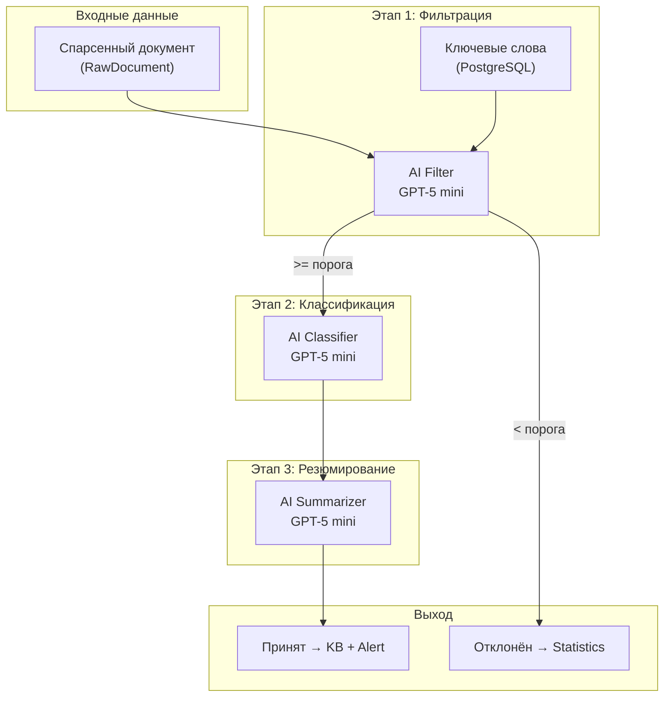
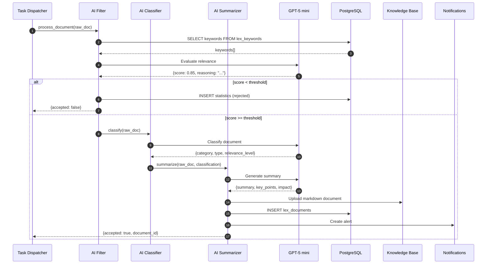

**Проект:** Автоматизированный правовой мониторинг для e-commerce  
**Модуль:** Lex / AI Pipeline  
**Версия:** 1.0  
**Дата:** Январь 2026

---

## 3.1 Назначение и архитектура

### Назначение

AI Pipeline — компонент модуля Lex, отвечающий за интеллектуальную обработку правовых документов:

| Этап | Функция | Описание | AI-модель |
|------|---------|----------|-----------|
| 1 | Фильтрация | Оценка релевантности документа для fashion e-commerce | GPT-5 mini |
| 2 | Классификация | Определение категории, типа и уровня релевантности | GPT-5 mini |
| 3 | Резюмирование | Генерация краткого изложения и ключевых положений | GPT-5 mini |

### Архитектура Pipeline



### Последовательность обработки



---

## 3.2 Конфигурация AI

### Настройки модели

| Параметр | Значение | Описание |
|----------|----------|----------|
| Модель | `gpt-5-mini` | Timeweb AI |
| Temperature (фильтрация) | 0.1 | Минимальная вариативность |
| Temperature (классификация) | 0.2 | Низкая вариативность |
| Temperature (резюме) | 0.4 | Умеренная вариативность |
| Max tokens (фильтрация) | 500 | Короткий ответ |
| Max tokens (классификация) | 800 | Средний ответ |
| Max tokens (резюме) | 2000 | Развёрнутый ответ |

### Environment Variables

```bash
# Timeweb AI
TIMEWEB_AI_URL=https://api.timeweb.cloud/ai/v1
TIMEWEB_AI_KEY=xxx

# AI Pipeline настройки
LEX_AI_FILTER_MODEL=gpt-5-mini
LEX_AI_FILTER_TEMPERATURE=0.1
LEX_AI_FILTER_MAX_TOKENS=500

LEX_AI_CLASSIFIER_MODEL=gpt-5-mini
LEX_AI_CLASSIFIER_TEMPERATURE=0.2
LEX_AI_CLASSIFIER_MAX_TOKENS=800

LEX_AI_SUMMARIZER_MODEL=gpt-5-mini
LEX_AI_SUMMARIZER_TEMPERATURE=0.4
LEX_AI_SUMMARIZER_MAX_TOKENS=2000

# Порог релевантности
LEX_RELEVANCE_THRESHOLD=0.60
```

---

## 3.3 AI Filter (Фильтрация)

### 3.3.1 Назначение

AI Filter оценивает релевантность документа для fashion e-commerce бизнеса:

| Задача | Описание |
|--------|----------|
| Оценка релевантности | Определение, насколько документ связан с e-commerce, маркетплейсами, fashion |
| Порог отсечения | Отклонение документов ниже настраиваемого порога (по умолчанию 60%) |
| Объяснение | Генерация reasoning для аудита решений |

### 3.3.2 Промпт фильтрации

```python
# prompts/filter_prompt.py

FILTER_SYSTEM_PROMPT = """
Ты — эксперт по правовому анализу для e-commerce бизнеса в сфере fashion retail.

Твоя задача — оценить релевантность правового документа для компании, которая:
- Продаёт женскую и детскую одежду
- Работает на маркетплейсах: Wildberries, Ozon, Яндекс.Маркет
- Занимается дистанционной торговлей
- Имеет ~100 сотрудников
- Работает с маркировкой товаров (Честный ЗНАК)

Критерии высокой релевантности:
- Документ напрямую регулирует деятельность маркетплейсов
- Документ касается маркировки товаров лёгкой промышленности
- Документ регулирует дистанционную торговлю
- Документ касается защиты прав потребителей в онлайн-торговле
- Документ содержит изменения в налогообложении для e-commerce

Критерии средней релевантности:
- Документ касается общих норм торговли (не специфичных для e-commerce)
- Документ регулирует трудовые отношения (применимо к любому бизнесу)
- Документ касается персональных данных (применимо к онлайн-бизнесу)

Критерии низкой релевантности:
- Документ не связан с торговлей
- Документ касается других отраслей (строительство, медицина и т.д.)
- Документ имеет очень узкую специфику, не применимую к fashion retail
"""

FILTER_USER_PROMPT = """
Оцени релевантность следующего документа:

## Заголовок
{title}

## Метаданные
- Источник: {source}
- Тип документа: {doc_type}
- Дата: {date}
- Издатель: {issuer}

## Текст документа (фрагмент)
{text_excerpt}

## Ключевые слова для фильтрации
{keywords}

---

Ответь в формате JSON:
```json
{{
    "relevance_score": 0.XX,
    "is_relevant": true/false,
    "reasoning": "Краткое объяснение оценки (1-2 предложения)",
    "matched_keywords": ["список", "найденных", "ключевых", "слов"],
    "relevance_factors": {{
        "e_commerce": 0.X,
        "marketplaces": 0.X,
        "fashion_retail": 0.X,
        "consumer_rights": 0.X,
        "taxation": 0.X
    }}
}}
```

Где:
- relevance_score: число от 0.0 до 1.0
- is_relevant: true если score >= {threshold}
- relevance_factors: оценка по каждому фактору (0.0-1.0)
"""
```

### 3.3.3 Реализация AI Filter

```python
# services/ai_filter.py

from dataclasses import dataclass
from typing import List, Dict, Optional
import json
from core.ai_client import ai_client
from core.database import db_session
from prompts.filter_prompt import FILTER_SYSTEM_PROMPT, FILTER_USER_PROMPT
from config import settings


@dataclass
class FilterResult:
    """Результат фильтрации документа."""
    relevance_score: float
    is_relevant: bool
    reasoning: str
    matched_keywords: List[str]
    relevance_factors: Dict[str, float]


class AIFilter:
    """Сервис AI-фильтрации документов."""
    
    def __init__(self):
        self.model = settings.LEX_AI_FILTER_MODEL
        self.temperature = settings.LEX_AI_FILTER_TEMPERATURE
        self.max_tokens = settings.LEX_AI_FILTER_MAX_TOKENS
        self.threshold = settings.LEX_RELEVANCE_THRESHOLD
    
    async def evaluate(self, raw_document) -> FilterResult:
        """Оценка релевантности документа."""
        
        # Загрузка ключевых слов
        keywords = await self._load_keywords()
        
        # Подготовка текста (ограничение до 5000 символов)
        text_excerpt = self._prepare_text_excerpt(raw_document.text, 5000)
        
        # Формирование промпта
        user_prompt = FILTER_USER_PROMPT.format(
            title=raw_document.title,
            source=raw_document.source,
            doc_type=raw_document.doc_type,
            date=raw_document.date.strftime("%d.%m.%Y") if raw_document.date else "н/д",
            issuer=raw_document.issuer or "н/д",
            text_excerpt=text_excerpt,
            keywords=self._format_keywords(keywords),
            threshold=self.threshold
        )
        
        # Вызов AI
        response = await ai_client.chat_completion(
            model=self.model,
            messages=[
                {"role": "system", "content": FILTER_SYSTEM_PROMPT},
                {"role": "user", "content": user_prompt}
            ],
            temperature=self.temperature,
            max_tokens=self.max_tokens
        )
        
        # Парсинг ответа
        result = self._parse_response(response.content)
        
        return result
    
    async def _load_keywords(self) -> Dict[str, List[str]]:
        """Загрузка ключевых слов из БД."""
        async with db_session() as session:
            result = await session.execute(
                "SELECT category, keywords FROM lex_keywords WHERE enabled = true"
            )
            rows = result.fetchall()
            
            keywords = {}
            for row in rows:
                keywords[row.category] = json.loads(row.keywords)
            
            return keywords
    
    def _prepare_text_excerpt(self, text: str, max_length: int) -> str:
        """Подготовка фрагмента текста."""
        if len(text) <= max_length:
            return text
        
        # Берём начало и конец текста
        half = max_length // 2 - 50
        return f"{text[:half]}\n\n[...текст сокращён...]\n\n{text[-half:]}"
    
    def _format_keywords(self, keywords: Dict[str, List[str]]) -> str:
        """Форматирование ключевых слов для промпта."""
        lines = []
        for category, words in keywords.items():
            lines.append(f"- {category}: {', '.join(words)}")
        return "\n".join(lines)
    
    def _parse_response(self, content: str) -> FilterResult:
        """Парсинг ответа AI."""
        # Извлечение JSON из ответа
        json_str = self._extract_json(content)
        data = json.loads(json_str)
        
        return FilterResult(
            relevance_score=float(data["relevance_score"]),
            is_relevant=data["is_relevant"],
            reasoning=data["reasoning"],
            matched_keywords=data.get("matched_keywords", []),
            relevance_factors=data.get("relevance_factors", {})
        )
    
    def _extract_json(self, content: str) -> str:
        """Извлечение JSON из текста."""
        # Поиск JSON-блока
        start = content.find("{")
        end = content.rfind("}") + 1
        
        if start == -1 or end == 0:
            raise ValueError("JSON not found in response")
        
        return content[start:end]
```

### 3.3.4 Пример работы фильтра

**Входные данные:**

```json
{
  "title": "Федеральный закон от 15.12.2025 N 500-ФЗ «О внесении изменений в Закон о защите прав потребителей»",
  "source": "consultant_plus",
  "doc_type": "federal_law",
  "text_excerpt": "Статья 26.1 дополняется пунктом 5 следующего содержания: «При дистанционном способе продажи товара через агрегатор информации о товарах (маркетплейс)...»"
}
```

**Результат:**

```json
{
  "relevance_score": 0.92,
  "is_relevant": true,
  "reasoning": "Документ напрямую регулирует продажу товаров через маркетплейсы и дистанционную торговлю, что является основной деятельностью компании.",
  "matched_keywords": ["маркетплейс", "дистанционная торговля", "защита прав потребителей"],
  "relevance_factors": {
    "e_commerce": 0.95,
    "marketplaces": 0.98,
    "fashion_retail": 0.70,
    "consumer_rights": 0.95,
    "taxation": 0.20
  }
}
```

---

## 3.4 AI Classifier (Классификация)

### 3.4.1 Назначение

AI Classifier определяет:

| Параметр | Описание | Значения |
|----------|----------|----------|
| Категория | Тематическая область документа | trade, marking, consumer_rights, advertising, tax, labor, personal_data |
| Тип документа | Юридический тип | federal_law, amendment, decree, court_decision, clarification, standard |
| Уровень релевантности | Важность для бизнеса | high, medium, low |

### 3.4.2 Промпт классификации

```python
# prompts/classifier_prompt.py

CLASSIFIER_SYSTEM_PROMPT = """
Ты — эксперт по классификации правовых документов для e-commerce бизнеса.

Твоя задача — определить категорию, тип и уровень релевантности документа.

## Категории документов

| Категория | Код | Описание |
|-----------|-----|----------|
| Торговля | trade | Дистанционная торговля, маркетплейсы, розница, опт |
| Маркировка | marking | Маркировка товаров, Честный ЗНАК, лёгкая промышленность |
| Права потребителей | consumer_rights | Возврат, гарантия, претензии |
| Реклама | advertising | Интернет-реклама, таргетинг, маркетинг |
| Налоги | tax | НДС, УСН, налог на прибыль, самозанятые |
| Труд | labor | Трудовые отношения, удалённая работа, ГПХ |
| Персональные данные | personal_data | Обработка ПДн, согласия |

## Типы документов

| Тип | Код | Признаки |
|-----|-----|----------|
| Федеральный закон | federal_law | "Федеральный закон", "ФЗ", принят Госдумой |
| Изменение НПА | amendment | "О внесении изменений", поправки |
| Постановление | decree | "Постановление Правительства" |
| Судебное решение | court_decision | "Решение суда", "Определение", арбитраж |
| Разъяснение | clarification | "Письмо", разъяснение госоргана |
| Стандарт | standard | ГОСТ, технический регламент |

## Уровни релевантности

| Уровень | Код | Критерии |
|---------|-----|----------|
| Высокая | high | Напрямую влияет на бизнес, требует немедленных действий |
| Средняя | medium | Косвенно влияет, полезно знать |
| Низкая | low | Потенциально применимо, общая информация |
"""

CLASSIFIER_USER_PROMPT = """
Классифицируй следующий документ:

## Заголовок
{title}

## Метаданные
- Источник: {source}
- Предполагаемый тип: {doc_type}
- Дата: {date}
- Издатель: {issuer}
- Оценка релевантности AI Filter: {relevance_score}

## Текст документа (фрагмент)
{text_excerpt}

---

Ответь в формате JSON:
```json
{{
    "category": "код_категории",
    "secondary_categories": ["другие", "категории"],
    "doc_type": "код_типа",
    "relevance_level": "high/medium/low",
    "reasoning": "Объяснение классификации (1-2 предложения)",
    "subjects": ["субъекты", "регулирования"],
    "effective_scope": "На кого распространяется документ"
}}
```
"""
```

### 3.4.3 Реализация AI Classifier

```python
# services/ai_classifier.py

from dataclasses import dataclass
from typing import List, Optional
import json
from core.ai_client import ai_client
from prompts.classifier_prompt import CLASSIFIER_SYSTEM_PROMPT, CLASSIFIER_USER_PROMPT
from config import settings


@dataclass
class ClassificationResult:
    """Результат классификации документа."""
    category: str
    secondary_categories: List[str]
    doc_type: str
    relevance_level: str
    reasoning: str
    subjects: List[str]
    effective_scope: str


class AIClassifier:
    """Сервис AI-классификации документов."""
    
    VALID_CATEGORIES = [
        "trade", "marking", "consumer_rights", 
        "advertising", "tax", "labor", "personal_data"
    ]
    
    VALID_DOC_TYPES = [
        "federal_law", "amendment", "decree",
        "court_decision", "clarification", "standard", "other"
    ]
    
    VALID_RELEVANCE_LEVELS = ["high", "medium", "low"]
    
    def __init__(self):
        self.model = settings.LEX_AI_CLASSIFIER_MODEL
        self.temperature = settings.LEX_AI_CLASSIFIER_TEMPERATURE
        self.max_tokens = settings.LEX_AI_CLASSIFIER_MAX_TOKENS
    
    async def classify(
        self, 
        raw_document,
        relevance_score: float
    ) -> ClassificationResult:
        """Классификация документа."""
        
        # Подготовка текста
        text_excerpt = self._prepare_text_excerpt(raw_document.text, 4000)
        
        # Формирование промпта
        user_prompt = CLASSIFIER_USER_PROMPT.format(
            title=raw_document.title,
            source=raw_document.source,
            doc_type=raw_document.doc_type or "unknown",
            date=raw_document.date.strftime("%d.%m.%Y") if raw_document.date else "н/д",
            issuer=raw_document.issuer or "н/д",
            relevance_score=f"{relevance_score:.2f}",
            text_excerpt=text_excerpt
        )
        
        # Вызов AI
        response = await ai_client.chat_completion(
            model=self.model,
            messages=[
                {"role": "system", "content": CLASSIFIER_SYSTEM_PROMPT},
                {"role": "user", "content": user_prompt}
            ],
            temperature=self.temperature,
            max_tokens=self.max_tokens
        )
        
        # Парсинг и валидация
        result = self._parse_and_validate(response.content)
        
        return result
    
    def _prepare_text_excerpt(self, text: str, max_length: int) -> str:
        """Подготовка фрагмента текста."""
        if len(text) <= max_length:
            return text
        
        half = max_length // 2 - 50
        return f"{text[:half]}\n\n[...]\n\n{text[-half:]}"
    
    def _parse_and_validate(self, content: str) -> ClassificationResult:
        """Парсинг и валидация ответа."""
        json_str = self._extract_json(content)
        data = json.loads(json_str)
        
        # Валидация категории
        category = data["category"]
        if category not in self.VALID_CATEGORIES:
            category = self._find_closest_category(category)
        
        # Валидация типа
        doc_type = data["doc_type"]
        if doc_type not in self.VALID_DOC_TYPES:
            doc_type = "other"
        
        # Валидация уровня
        relevance_level = data["relevance_level"]
        if relevance_level not in self.VALID_RELEVANCE_LEVELS:
            relevance_level = "medium"
        
        return ClassificationResult(
            category=category,
            secondary_categories=data.get("secondary_categories", []),
            doc_type=doc_type,
            relevance_level=relevance_level,
            reasoning=data["reasoning"],
            subjects=data.get("subjects", []),
            effective_scope=data.get("effective_scope", "")
        )
    
    def _find_closest_category(self, category: str) -> str:
        """Поиск ближайшей валидной категории."""
        category_lower = category.lower()
        
        mapping = {
            "торговля": "trade",
            "маркировка": "marking",
            "потребител": "consumer_rights",
            "реклама": "advertising",
            "налог": "tax",
            "труд": "labor",
            "персонал": "personal_data"
        }
        
        for key, value in mapping.items():
            if key in category_lower:
                return value
        
        return "trade"  # По умолчанию
    
    def _extract_json(self, content: str) -> str:
        """Извлечение JSON из текста."""
        start = content.find("{")
        end = content.rfind("}") + 1
        
        if start == -1 or end == 0:
            raise ValueError("JSON not found in response")
        
        return content[start:end]
```

### 3.4.4 Пример работы классификатора

**Входные данные:**

```json
{
  "title": "Письмо ФНС России от 10.01.2026 N БС-4-11/123@",
  "source": "garant",
  "doc_type": "clarification",
  "text_excerpt": "О налогообложении доходов индивидуальных предпринимателей, осуществляющих продажу товаров через маркетплейсы..."
}
```

**Результат:**

```json
{
  "category": "tax",
  "secondary_categories": ["trade"],
  "doc_type": "clarification",
  "relevance_level": "medium",
  "reasoning": "Разъяснение ФНС касается налогообложения ИП на маркетплейсах. Применимо к компании при работе с самозанятыми или ИП-поставщиками.",
  "subjects": ["ИП", "продавцы на маркетплейсах"],
  "effective_scope": "Индивидуальные предприниматели, осуществляющие торговлю через маркетплейсы"
}
```

---

## 3.5 AI Summarizer (Резюмирование)

### 3.5.1 Назначение

AI Summarizer генерирует:

| Компонент | Описание |
|-----------|----------|
| Краткое изложение | Суть документа в 2-3 предложениях |
| Ключевые положения | Список основных норм (3-5 пунктов) |
| Влияние на бизнес | Оценка практического влияния |
| Рекомендуемые действия | Что нужно сделать (если применимо) |

### 3.5.2 Промпт резюмирования

```python
# prompts/summarizer_prompt.py

SUMMARIZER_SYSTEM_PROMPT = """
Ты — юрист-аналитик, специализирующийся на e-commerce законодательстве.

Твоя задача — создать структурированное резюме правового документа для бизнеса, который:
- Продаёт женскую и детскую одежду на маркетплейсах
- Работает на Wildberries, Ozon, Яндекс.Маркет
- Занимается маркировкой товаров через Честный ЗНАК

Правила:
1. Пиши понятным языком без юридического жаргона
2. Фокусируйся на практическом применении
3. Выделяй сроки и даты вступления в силу
4. Указывай возможные штрафы и последствия
5. Давай конкретные рекомендации по действиям
"""

SUMMARIZER_USER_PROMPT = """
Создай резюме следующего документа:

## Заголовок
{title}

## Классификация
- Категория: {category}
- Тип документа: {doc_type}
- Уровень релевантности: {relevance_level}
- Субъекты регулирования: {subjects}

## Метаданные
- Дата документа: {date}
- Дата вступления в силу: {effective_date}
- Издатель: {issuer}

## Полный текст документа
{full_text}

---

Создай резюме в формате JSON:
```json
{{
    "short_summary": "Краткое изложение в 2-3 предложениях",
    "key_points": [
        "Ключевое положение 1",
        "Ключевое положение 2",
        "Ключевое положение 3"
    ],
    "business_impact": {{
        "level": "high/medium/low",
        "description": "Описание влияния на бизнес"
    }},
    "deadlines": [
        {{
            "date": "YYYY-MM-DD или null",
            "description": "Описание дедлайна"
        }}
    ],
    "penalties": [
        {{
            "amount": "Сумма или диапазон",
            "condition": "За что штраф"
        }}
    ],
    "recommended_actions": [
        "Рекомендация 1",
        "Рекомендация 2"
    ],
    "related_topics": ["тема1", "тема2"]
}}
```

Если какой-то раздел не применим, оставь пустой массив [].
"""
```

### 3.5.3 Реализация AI Summarizer

```python
# services/ai_summarizer.py

from dataclasses import dataclass
from typing import List, Dict, Optional
import json
from core.ai_client import ai_client
from prompts.summarizer_prompt import SUMMARIZER_SYSTEM_PROMPT, SUMMARIZER_USER_PROMPT
from config import settings


@dataclass
class Deadline:
    """Дедлайн из документа."""
    date: Optional[str]
    description: str


@dataclass
class Penalty:
    """Штраф из документа."""
    amount: str
    condition: str


@dataclass
class BusinessImpact:
    """Влияние на бизнес."""
    level: str
    description: str


@dataclass
class SummaryResult:
    """Результат резюмирования документа."""
    short_summary: str
    key_points: List[str]
    business_impact: BusinessImpact
    deadlines: List[Deadline]
    penalties: List[Penalty]
    recommended_actions: List[str]
    related_topics: List[str]
    full_summary: str  # Полное резюме для KB


class AISummarizer:
    """Сервис AI-резюмирования документов."""
    
    def __init__(self):
        self.model = settings.LEX_AI_SUMMARIZER_MODEL
        self.temperature = settings.LEX_AI_SUMMARIZER_TEMPERATURE
        self.max_tokens = settings.LEX_AI_SUMMARIZER_MAX_TOKENS
    
    async def summarize(
        self,
        raw_document,
        classification
    ) -> SummaryResult:
        """Генерация резюме документа."""
        
        # Формирование промпта
        user_prompt = SUMMARIZER_USER_PROMPT.format(
            title=raw_document.title,
            category=classification.category,
            doc_type=classification.doc_type,
            relevance_level=classification.relevance_level,
            subjects=", ".join(classification.subjects),
            date=raw_document.date.strftime("%d.%m.%Y") if raw_document.date else "н/д",
            effective_date=raw_document.effective_date.strftime("%d.%m.%Y") if raw_document.effective_date else "не указана",
            issuer=raw_document.issuer or "н/д",
            full_text=self._truncate_text(raw_document.text, 15000)
        )
        
        # Вызов AI
        response = await ai_client.chat_completion(
            model=self.model,
            messages=[
                {"role": "system", "content": SUMMARIZER_SYSTEM_PROMPT},
                {"role": "user", "content": user_prompt}
            ],
            temperature=self.temperature,
            max_tokens=self.max_tokens
        )
        
        # Парсинг ответа
        result = self._parse_response(response.content, raw_document, classification)
        
        return result
    
    def _truncate_text(self, text: str, max_length: int) -> str:
        """Усечение текста с сохранением структуры."""
        if len(text) <= max_length:
            return text
        
        # Сохраняем начало (2/3) и конец (1/3)
        start_len = int(max_length * 0.66)
        end_len = max_length - start_len - 100
        
        return f"{text[:start_len]}\n\n[...документ сокращён для обработки...]\n\n{text[-end_len:]}"
    
    def _parse_response(
        self, 
        content: str, 
        raw_document,
        classification
    ) -> SummaryResult:
        """Парсинг ответа AI."""
        json_str = self._extract_json(content)
        data = json.loads(json_str)
        
        # Парсинг вложенных объектов
        business_impact = BusinessImpact(
            level=data.get("business_impact", {}).get("level", "medium"),
            description=data.get("business_impact", {}).get("description", "")
        )
        
        deadlines = [
            Deadline(date=d.get("date"), description=d["description"])
            for d in data.get("deadlines", [])
        ]
        
        penalties = [
            Penalty(amount=p["amount"], condition=p["condition"])
            for p in data.get("penalties", [])
        ]
        
        # Формирование полного резюме для KB
        full_summary = self._build_full_summary(
            data=data,
            raw_document=raw_document,
            classification=classification,
            business_impact=business_impact,
            deadlines=deadlines,
            penalties=penalties
        )
        
        return SummaryResult(
            short_summary=data["short_summary"],
            key_points=data.get("key_points", []),
            business_impact=business_impact,
            deadlines=deadlines,
            penalties=penalties,
            recommended_actions=data.get("recommended_actions", []),
            related_topics=data.get("related_topics", []),
            full_summary=full_summary
        )
    
    def _build_full_summary(
        self,
        data: Dict,
        raw_document,
        classification,
        business_impact: BusinessImpact,
        deadlines: List[Deadline],
        penalties: List[Penalty]
    ) -> str:
        """Формирование полного резюме для KB."""
        
        lines = [
            f"**Название:** {raw_document.title}",
            f"**Суть:** {data['short_summary']}",
            f"**На кого распространяется:** {classification.effective_scope or ', '.join(classification.subjects)}",
        ]
        
        if raw_document.effective_date:
            lines.append(f"**Срок вступления в силу:** {raw_document.effective_date.strftime('%d.%m.%Y')}")
        
        if data.get("key_points"):
            lines.append("\n**Ключевые положения:**")
            for point in data["key_points"]:
                lines.append(f"- {point}")
        
        if deadlines:
            lines.append("\n**Сроки:**")
            for dl in deadlines:
                date_str = dl.date if dl.date else "не указана"
                lines.append(f"- {date_str}: {dl.description}")
        
        if penalties:
            lines.append("\n**Штрафы:**")
            for pen in penalties:
                lines.append(f"- {pen.amount}: {pen.condition}")
        
        lines.append(f"\n**Влияние на бизнес:** {business_impact.level.upper()}")
        lines.append(business_impact.description)
        
        if data.get("recommended_actions"):
            lines.append("\n**Рекомендуемые действия:**")
            for action in data["recommended_actions"]:
                lines.append(f"- {action}")
        
        return "\n".join(lines)
    
    def _extract_json(self, content: str) -> str:
        """Извлечение JSON из текста."""
        start = content.find("{")
        end = content.rfind("}") + 1
        
        if start == -1 or end == 0:
            raise ValueError("JSON not found in response")
        
        return content[start:end]
```

### 3.5.4 Пример работы резюмирования

**Входные данные:**

```json
{
  "title": "Федеральный закон от 15.12.2025 N 500-ФЗ",
  "category": "consumer_rights",
  "doc_type": "federal_law",
  "relevance_level": "high",
  "effective_date": "2026-03-01",
  "text": "[Полный текст закона...]"
}
```

**Результат:**

```json
{
  "short_summary": "Закон увеличивает срок возврата товаров, купленных на маркетплейсах, до 30 дней и устанавливает солидарную ответственность маркетплейса и продавца перед покупателем.",
  "key_points": [
    "Срок возврата товаров, купленных дистанционно на маркетплейсах, увеличен с 7 до 30 дней",
    "Маркетплейс несёт солидарную ответственность с продавцом за качество товара",
    "Новые требования к информированию покупателя о продавце и характеристиках товара",
    "Обязательное наличие кнопки «Отказаться от товара» в личном кабинете покупателя"
  ],
  "business_impact": {
    "level": "high",
    "description": "Необходимо пересмотреть политику возврата, обновить карточки товаров и скорректировать расчёт юнит-экономики с учётом увеличения возвратов."
  },
  "deadlines": [
    {
      "date": "2026-03-01",
      "description": "Вступление закона в силу"
    },
    {
      "date": "2026-02-01",
      "description": "Рекомендуемый срок обновления политики возврата"
    }
  ],
  "penalties": [
    {
      "amount": "10 000 - 30 000 руб.",
      "condition": "Нарушение требований к информированию покупателя"
    },
    {
      "amount": "50 000 - 100 000 руб.",
      "condition": "Отказ в возврате в установленный срок"
    }
  ],
  "recommended_actions": [
    "Обновить политику возврата на карточках товаров до 01.03.2026",
    "Уведомить менеджеров о новых сроках возврата",
    "Пересчитать юнит-экономику с учётом потенциального роста возвратов",
    "Проверить соответствие карточек новым требованиям к информированию"
  ],
  "related_topics": ["возврат товаров", "маркетплейсы", "права потребителей", "дистанционная торговля"]
}
```

---

## 3.6 Document Formatter

### 3.6.1 Назначение

Document Formatter формирует финальный Markdown-документ для загрузки в Knowledge Base.

### 3.6.2 Структура документа

```markdown
---
source: consultant_plus
document_type: federal_law
document_number: "500-ФЗ"
document_date: 2025-12-15
effective_date: 2026-03-01
category: consumer_rights
relevance: high
relevance_score: 0.92
brand_id: shared
access_level: manager
indexed_at: 2026-01-20T10:30:00Z
original_url: "https://www.consultant.ru/document/..."
---

## Резюме

**Название:** Федеральный закон от 15.12.2025 N 500-ФЗ «О внесении изменений...»
**Суть:** Закон увеличивает срок возврата товаров...
**На кого распространяется:** Продавцы, маркетплейсы, покупатели
**Срок вступления в силу:** 01.03.2026

**Ключевые положения:**
- Срок возврата увеличен до 30 дней
- Солидарная ответственность маркетплейса
- Новые требования к информированию

**Влияние на бизнес:** HIGH
Необходимо пересмотреть политику возврата...

**Рекомендуемые действия:**
- Обновить политику возврата
- Уведомить менеджеров
- Пересчитать юнит-экономику

---

## Полный текст

[Полный текст документа]
```

### 3.6.3 Реализация Document Formatter

```python
# services/document_formatter.py

from datetime import datetime
from typing import Optional
import yaml


class DocumentFormatter:
    """Форматтер документов для Knowledge Base."""
    
    def format(
        self,
        raw_document,
        classification,
        summary,
        relevance_score: float
    ) -> str:
        """Формирование Markdown-документа."""
        
        # YAML-заголовок
        yaml_header = self._build_yaml_header(
            raw_document=raw_document,
            classification=classification,
            relevance_score=relevance_score
        )
        
        # Резюме
        summary_section = self._build_summary_section(
            raw_document=raw_document,
            classification=classification,
            summary=summary
        )
        
        # Полный текст
        full_text_section = self._build_full_text_section(raw_document.text)
        
        # Сборка документа
        document = f"""---
{yaml_header}---

## Резюме

{summary_section}

---

## Полный текст

{full_text_section}
"""
        
        return document
    
    def _build_yaml_header(
        self,
        raw_document,
        classification,
        relevance_score: float
    ) -> str:
        """Формирование YAML-заголовка."""
        
        header = {
            "source": raw_document.source,
            "document_type": classification.doc_type,
            "document_number": raw_document.number,
            "document_date": raw_document.date.strftime("%Y-%m-%d") if raw_document.date else None,
            "effective_date": raw_document.effective_date.strftime("%Y-%m-%d") if raw_document.effective_date else None,
            "category": classification.category,
            "secondary_categories": classification.secondary_categories,
            "relevance": classification.relevance_level,
            "relevance_score": round(relevance_score, 2),
            "brand_id": "shared",
            "access_level": "manager",
            "indexed_at": datetime.utcnow().strftime("%Y-%m-%dT%H:%M:%SZ"),
            "original_url": raw_document.url,
            "issuer": raw_document.issuer,
            "keywords": raw_document.keywords[:10] if raw_document.keywords else []
        }
        
        # Удаление None-значений
        header = {k: v for k, v in header.items() if v is not None}
        
        return yaml.dump(header, allow_unicode=True, default_flow_style=False)
    
    def _build_summary_section(
        self,
        raw_document,
        classification,
        summary
    ) -> str:
        """Формирование секции резюме."""
        
        return summary.full_summary
    
    def _build_full_text_section(self, text: str) -> str:
        """Формирование секции полного текста."""
        
        # Очистка текста
        text = text.strip()
        
        # Добавление отступов для читаемости
        paragraphs = text.split("\n\n")
        formatted_paragraphs = [p.strip() for p in paragraphs if p.strip()]
        
        return "\n\n".join(formatted_paragraphs)
```

---

## 3.7 Обработка ошибок

### 3.7.1 Стратегия повторных попыток

```python
# services/ai_pipeline.py

from tenacity import retry, stop_after_attempt, wait_exponential


class AIPipeline:
    """Orchestrator AI Pipeline."""
    
    @retry(
        stop=stop_after_attempt(3),
        wait=wait_exponential(multiplier=1, min=4, max=60)
    )
    async def process_with_retry(self, raw_document):
        """Обработка с повторными попытками."""
        return await self._process(raw_document)
    
    async def _process(self, raw_document):
        """Основная логика обработки."""
        try:
            # 1. Фильтрация
            filter_result = await self.filter.evaluate(raw_document)
            
            if not filter_result.is_relevant:
                return ProcessingResult(
                    success=False,
                    reject_reason=f"low_relevance ({filter_result.relevance_score:.2f})"
                )
            
            # 2. Классификация
            classification = await self.classifier.classify(
                raw_document, 
                filter_result.relevance_score
            )
            
            # 3. Резюмирование
            summary = await self.summarizer.summarize(
                raw_document, 
                classification
            )
            
            # 4. Форматирование
            markdown = self.formatter.format(
                raw_document, 
                classification, 
                summary,
                filter_result.relevance_score
            )
            
            return ProcessingResult(
                success=True,
                markdown=markdown,
                classification=classification,
                summary=summary
            )
            
        except json.JSONDecodeError as e:
            raise AIParsingError(f"Failed to parse AI response: {e}")
        
        except Exception as e:
            raise AIProcessingError(f"AI Pipeline error: {e}")
```

### 3.7.2 Типы ошибок

| Ошибка | Описание | Действие |
|--------|----------|----------|
| `AIParsingError` | Не удалось распарсить JSON | Retry (до 3 раз) |
| `AITimeoutError` | Превышено время ответа AI | Retry с увеличением timeout |
| `AIRateLimitError` | Превышен лимит запросов | Wait + Retry |
| `AIProcessingError` | Общая ошибка обработки | Log + Skip document |

### 3.7.3 Логирование

```python
import structlog

logger = structlog.get_logger(__name__)

# Пример логирования
logger.info(
    "document_processed",
    document_id=doc_id,
    source=raw_document.source,
    relevance_score=filter_result.relevance_score,
    category=classification.category,
    processing_time_ms=elapsed_ms
)

logger.warning(
    "document_rejected",
    document_id=doc_id,
    source=raw_document.source,
    relevance_score=filter_result.relevance_score,
    reason="below_threshold"
)

logger.error(
    "ai_pipeline_error",
    document_id=doc_id,
    error=str(e),
    traceback=traceback.format_exc()
)
```

---

## 3.8 Метрики и мониторинг

### 3.8.1 Метрики AI Pipeline

| Метрика | Описание | Тип |
|---------|----------|-----|
| `lex.ai.filter.requests` | Запросов к фильтру | Counter |
| `lex.ai.filter.latency_ms` | Время ответа фильтра | Histogram |
| `lex.ai.filter.acceptance_rate` | % принятых документов | Gauge |
| `lex.ai.classifier.requests` | Запросов к классификатору | Counter |
| `lex.ai.classifier.latency_ms` | Время ответа классификатора | Histogram |
| `lex.ai.summarizer.requests` | Запросов к резюмированию | Counter |
| `lex.ai.summarizer.latency_ms` | Время ответа резюмирования | Histogram |
| `lex.ai.errors` | Ошибки AI (по типу) | Counter |
| `lex.ai.retries` | Повторные попытки | Counter |

### 3.8.2 Алерты

| Условие | Уровень | Действие |
|---------|---------|----------|
| Error rate > 10% за 15 мин | `warning` | Алерт Admin |
| Error rate > 30% за 15 мин | `critical` | Алерт Admin, пауза pipeline |
| Latency p95 > 30 сек | `warning` | Алерт Admin |
| Acceptance rate < 20% | `info` | Проверить ключевые слова |

---

## 3.9 Оптимизация

### 3.9.1 Кэширование ключевых слов

```python
# Кэширование ключевых слов на 5 минут
@cached(ttl=300)
async def get_keywords() -> Dict[str, List[str]]:
    async with db_session() as session:
        result = await session.execute(
            "SELECT category, keywords FROM lex_keywords WHERE enabled = true"
        )
        return {row.category: json.loads(row.keywords) for row in result}
```

### 3.9.2 Batch Processing

```python
# Пакетная обработка для снижения нагрузки на AI
async def process_batch(documents: List[RawDocument], batch_size: int = 5):
    """Обработка документов пакетами."""
    
    for i in range(0, len(documents), batch_size):
        batch = documents[i:i + batch_size]
        
        # Параллельная обработка пакета
        tasks = [process_document(doc) for doc in batch]
        results = await asyncio.gather(*tasks, return_exceptions=True)
        
        # Пауза между пакетами для соблюдения rate limit
        await asyncio.sleep(1)
        
        yield results
```

### 3.9.3 Усечение текста

| Этап | Максимальная длина | Причина |
|------|-------------------|---------|
| Фильтрация | 5 000 символов | Быстрая оценка |
| Классификация | 4 000 символов | Достаточно для определения категории |
| Резюмирование | 15 000 символов | Полный контекст для резюме |

---

## Приложение А: Контрольные точки AI Pipeline

| Критерий | Проверка |
|----------|----------|
| AI Filter отвечает | Время ответа < 10 сек |
| AI Classifier отвечает | Время ответа < 10 сек |
| AI Summarizer отвечает | Время ответа < 30 сек |
| JSON парсится корректно | Нет JSONDecodeError в логах |
| Ключевые слова загружаются | > 0 категорий в кэше |
| Acceptance rate нормальный | 30-70% для новых документов |
| Документы форматируются | YAML-заголовок валиден |

---

**Документ подготовлен:** Январь 2026  
**Версия:** 1.0  
**Статус:** Черновик
