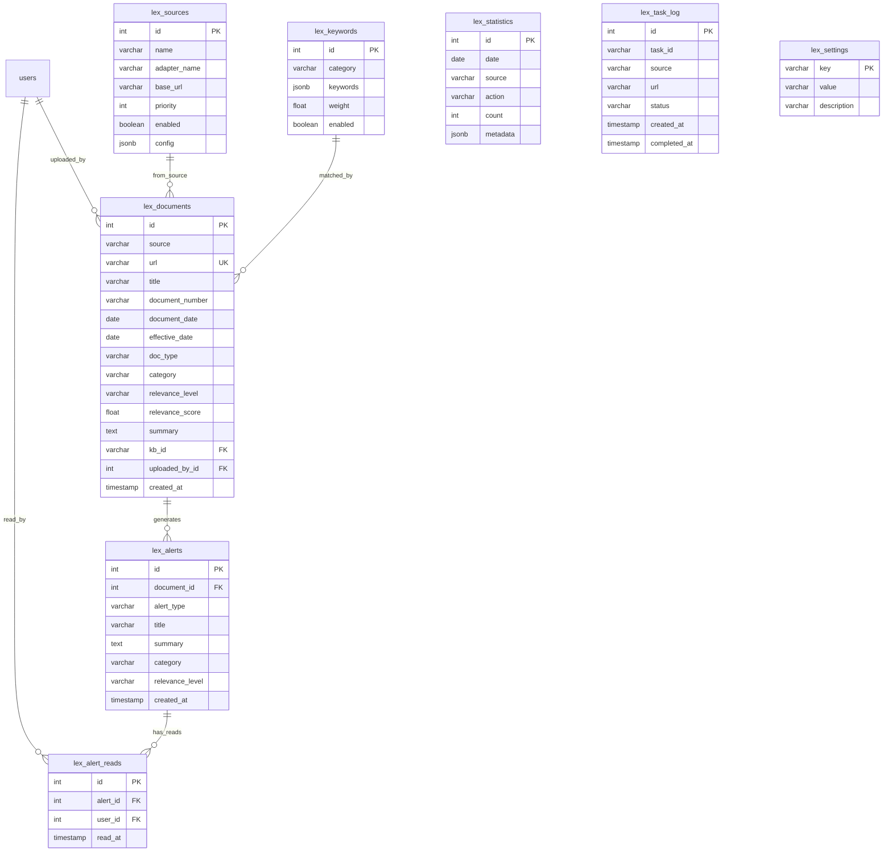

# ADOLF LEX — Раздел 5: Database Schema

**Проект:** Автоматизированный правовой мониторинг для e-commerce  
**Модуль:** Lex / Database  
**Версия:** 1.0  
**Дата:** Январь 2026

---

## 5.1 Обзор схемы

### Назначение

База данных модуля Lex хранит:
- Метаданные правовых документов
- Алерты о новых документах
- Ключевые слова для фильтрации
- Настройки источников данных
- Статистику сбора и обработки

### Связь с ADOLF Core

Модуль Lex использует общую базу данных PostgreSQL с Core и расширяет её дополнительными таблицами.

| Таблица Core | Использование в Lex |
|--------------|---------------------|
| `users` | FK для uploaded_by_id, read_by_id |
| `audit_log` | Логирование действий пользователей |
| `notifications` | Создание уведомлений о документах |

### Связь с ADOLF Knowledge

Полные тексты документов хранятся в Knowledge Base (Timeweb KB). В PostgreSQL хранятся только метаданные и ссылка на KB.

| Компонент | Хранилище | Данные |
|-----------|-----------|--------|
| Полный текст | Knowledge Base | Markdown с YAML-заголовком |
| Метаданные | PostgreSQL | Структурированные поля |
| Резюме | PostgreSQL | Краткое изложение для алертов |
| Поиск | Knowledge Base | RAG-индекс |

### ER-диаграмма модуля



### Стратегия хранения данных

| Таблица | Retention | Стратегия |
|---------|-----------|-----------|
| `lex_documents` | Бессрочно | Документы сохраняются всегда |
| `lex_alerts` | 12 месяцев | Архивация старых алертов |
| `lex_alert_reads` | 12 месяцев | Вместе с alerts |
| `lex_statistics` | 24 месяца | Агрегация + очистка |
| `lex_task_log` | 30 дней | Очистка старых записей |
| `lex_sources` | Бессрочно | Справочник |
| `lex_keywords` | Бессрочно | Справочник |
| `lex_settings` | Бессрочно | Справочник |

---

## 5.2 Таблица lex_documents

### Назначение

Хранение метаданных правовых документов. Полный текст хранится в Knowledge Base.

### DDL

```sql
CREATE TABLE lex_documents (
    -- Первичный ключ
    id SERIAL PRIMARY KEY,
    
    -- Идентификация источника
    source VARCHAR(50) NOT NULL
        CHECK (source IN ('consultant_plus', 'garant', 'manual_upload')),
    url VARCHAR(500) NOT NULL,
    
    -- Основные реквизиты
    title VARCHAR(500) NOT NULL,
    document_number VARCHAR(100),
    document_date DATE,
    effective_date DATE,
    issuer VARCHAR(200),
    
    -- Классификация
    doc_type VARCHAR(50) NOT NULL
        CHECK (doc_type IN (
            'federal_law',      -- Федеральный закон
            'amendment',        -- Изменение НПА
            'decree',           -- Постановление
            'court_decision',   -- Судебное решение
            'clarification',    -- Разъяснение
            'standard',         -- Стандарт (ГОСТ)
            'other'             -- Прочее
        )),
    category VARCHAR(50) NOT NULL
        CHECK (category IN (
            'trade',            -- Торговля
            'marking',          -- Маркировка
            'consumer_rights',  -- Права потребителей
            'advertising',      -- Реклама
            'tax',              -- Налоги
            'labor',            -- Труд
            'personal_data'     -- Персональные данные
        )),
    secondary_categories VARCHAR(50)[] DEFAULT '{}',
    
    -- Релевантность
    relevance_level VARCHAR(20) NOT NULL
        CHECK (relevance_level IN ('high', 'medium', 'low')),
    relevance_score FLOAT CHECK (relevance_score BETWEEN 0 AND 1),
    
    -- AI-обработка
    summary TEXT,
    key_points JSONB DEFAULT '[]'::jsonb,
    business_impact JSONB DEFAULT '{}'::jsonb,
    /*
    Структура business_impact:
    {
        "level": "high|medium|low",
        "description": "Описание влияния"
    }
    */
    recommended_actions JSONB DEFAULT '[]'::jsonb,
    deadlines JSONB DEFAULT '[]'::jsonb,
    /*
    Структура deadlines:
    [
        {"date": "2026-03-01", "description": "Вступление в силу"}
    ]
    */
    penalties JSONB DEFAULT '[]'::jsonb,
    /*
    Структура penalties:
    [
        {"amount": "10 000 - 30 000 руб.", "condition": "Нарушение требований"}
    ]
    */
    
    -- Связь с Knowledge Base
    kb_id VARCHAR(100),
    
    -- Ключевые слова (найденные при фильтрации)
    matched_keywords VARCHAR(100)[] DEFAULT '{}',
    
    -- Загрузка
    uploaded_by_id INT REFERENCES users(id),
    upload_type VARCHAR(20) DEFAULT 'automatic'
        CHECK (upload_type IN ('automatic', 'manual_url', 'manual_file')),
    
    -- Метаданные
    original_url VARCHAR(500),
    raw_metadata JSONB DEFAULT '{}'::jsonb,
    
    -- Timestamps
    created_at TIMESTAMP WITH TIME ZONE DEFAULT NOW(),
    updated_at TIMESTAMP WITH TIME ZONE DEFAULT NOW(),
    
    -- Уникальность по URL
    CONSTRAINT uq_lex_documents_url UNIQUE (url)
);

-- Комментарии
COMMENT ON TABLE lex_documents IS 'Метаданные правовых документов';
COMMENT ON COLUMN lex_documents.kb_id IS 'ID документа в Knowledge Base';
COMMENT ON COLUMN lex_documents.summary IS 'AI-сгенерированное резюме';
COMMENT ON COLUMN lex_documents.matched_keywords IS 'Ключевые слова, по которым документ прошёл фильтр';
```

### Индексы

```sql
-- Основные индексы для фильтрации
CREATE INDEX idx_lex_documents_source 
    ON lex_documents(source);

CREATE INDEX idx_lex_documents_doc_type 
    ON lex_documents(doc_type);

CREATE INDEX idx_lex_documents_category 
    ON lex_documents(category);

CREATE INDEX idx_lex_documents_relevance_level 
    ON lex_documents(relevance_level);

-- Индекс для поиска по дате
CREATE INDEX idx_lex_documents_document_date 
    ON lex_documents(document_date DESC);

-- Индекс для поиска по дате вступления в силу
CREATE INDEX idx_lex_documents_effective_date 
    ON lex_documents(effective_date)
    WHERE effective_date IS NOT NULL;

-- Индекс для последних документов
CREATE INDEX idx_lex_documents_created_at 
    ON lex_documents(created_at DESC);

-- Композитный индекс для типичного запроса
CREATE INDEX idx_lex_documents_category_date 
    ON lex_documents(category, created_at DESC);

-- Индекс для поиска по номеру документа
CREATE INDEX idx_lex_documents_number 
    ON lex_documents(document_number)
    WHERE document_number IS NOT NULL;

-- GIN индекс для поиска по массиву ключевых слов
CREATE INDEX idx_lex_documents_keywords 
    ON lex_documents USING GIN (matched_keywords);

-- GIN индекс для поиска по вторичным категориям
CREATE INDEX idx_lex_documents_secondary_categories 
    ON lex_documents USING GIN (secondary_categories);

-- Полнотекстовый поиск по заголовку
CREATE INDEX idx_lex_documents_title_fts 
    ON lex_documents USING GIN (to_tsvector('russian', title));
```

### Триггер updated_at

```sql
CREATE OR REPLACE FUNCTION update_updated_at()
RETURNS TRIGGER AS $$
BEGIN
    NEW.updated_at = NOW();
    RETURN NEW;
END;
$$ LANGUAGE plpgsql;

CREATE TRIGGER trigger_lex_documents_updated_at
    BEFORE UPDATE ON lex_documents
    FOR EACH ROW
    EXECUTE FUNCTION update_updated_at();
```

### Примеры данных

```sql
INSERT INTO lex_documents (
    source, url, title, document_number, document_date, effective_date,
    issuer, doc_type, category, relevance_level, relevance_score,
    summary, kb_id
) VALUES (
    'consultant_plus',
    'https://www.consultant.ru/document/cons_doc_LAW_500/',
    'Федеральный закон от 15.12.2025 N 500-ФЗ "О внесении изменений в Закон РФ "О защите прав потребителей"',
    '500-ФЗ',
    '2025-12-15',
    '2026-03-01',
    'Государственная Дума',
    'federal_law',
    'consumer_rights',
    'high',
    0.92,
    'Закон увеличивает срок возврата товаров, купленных на маркетплейсах, до 30 дней...',
    'kb_doc_12345'
);
```

---

## 5.3 Таблица lex_alerts

### Назначение

Хранение алертов о новых документах для пользователей.

### DDL

```sql
CREATE TABLE lex_alerts (
    -- Первичный ключ
    id SERIAL PRIMARY KEY,
    
    -- Связь с документом
    document_id INT NOT NULL REFERENCES lex_documents(id) ON DELETE CASCADE,
    
    -- Тип алерта
    alert_type VARCHAR(50) NOT NULL
        CHECK (alert_type IN (
            'new_law',           -- Новый закон/постановление
            'amendment',         -- Изменение существующего НПА
            'court_decision',    -- Новое судебное решение
            'clarification',     -- Разъяснение госоргана
            'effective_soon',    -- Приближение срока вступления в силу
            'marketplace_mention' -- Документ с упоминанием маркетплейсов
        )),
    
    -- Контент алерта
    title VARCHAR(300) NOT NULL,
    summary TEXT,
    
    -- Классификация
    category VARCHAR(50) NOT NULL,
    relevance_level VARCHAR(20) NOT NULL,
    
    -- Метаданные
    metadata JSONB DEFAULT '{}'::jsonb,
    /*
    Структура metadata:
    {
        "effective_date": "2026-03-01",
        "days_until_effective": 30,
        "marketplace_mentions": ["Wildberries", "Ozon"]
    }
    */
    
    -- Timestamps
    created_at TIMESTAMP WITH TIME ZONE DEFAULT NOW(),
    
    -- Один алерт на документ (но может быть несколько типов)
    CONSTRAINT uq_lex_alerts_document_type UNIQUE (document_id, alert_type)
);

-- Комментарии
COMMENT ON TABLE lex_alerts IS 'Алерты о новых правовых документах';
COMMENT ON COLUMN lex_alerts.alert_type IS 'Тип события, вызвавшего алерт';
```

### Индексы

```sql
-- Индекс для связи с документом
CREATE INDEX idx_lex_alerts_document_id 
    ON lex_alerts(document_id);

-- Индекс для фильтрации по типу
CREATE INDEX idx_lex_alerts_type 
    ON lex_alerts(alert_type);

-- Индекс для фильтрации по категории
CREATE INDEX idx_lex_alerts_category 
    ON lex_alerts(category);

-- Индекс для сортировки по дате
CREATE INDEX idx_lex_alerts_created_at 
    ON lex_alerts(created_at DESC);

-- Композитный индекс для типичного запроса
CREATE INDEX idx_lex_alerts_category_date 
    ON lex_alerts(category, created_at DESC);
```

---

## 5.4 Таблица lex_alert_reads

### Назначение

Отслеживание прочтения алертов пользователями (многие-ко-многим).

### DDL

```sql
CREATE TABLE lex_alert_reads (
    -- Первичный ключ
    id SERIAL PRIMARY KEY,
    
    -- Связи
    alert_id INT NOT NULL REFERENCES lex_alerts(id) ON DELETE CASCADE,
    user_id INT NOT NULL REFERENCES users(id) ON DELETE CASCADE,
    
    -- Timestamp
    read_at TIMESTAMP WITH TIME ZONE DEFAULT NOW(),
    
    -- Уникальность: один пользователь читает алерт один раз
    CONSTRAINT uq_lex_alert_reads UNIQUE (alert_id, user_id)
);

-- Комментарии
COMMENT ON TABLE lex_alert_reads IS 'Прочтение алертов пользователями';
```

### Индексы

```sql
-- Индекс для получения непрочитанных алертов пользователя
CREATE INDEX idx_lex_alert_reads_user_id 
    ON lex_alert_reads(user_id);

-- Индекс для проверки прочтения
CREATE INDEX idx_lex_alert_reads_alert_id 
    ON lex_alert_reads(alert_id);
```

### View для удобного доступа

```sql
-- Представление для получения статуса алертов по пользователю
CREATE OR REPLACE VIEW lex_alerts_with_status AS
SELECT 
    a.*,
    CASE WHEN ar.id IS NOT NULL THEN 'read' ELSE 'unread' END AS status,
    ar.read_at
FROM lex_alerts a
LEFT JOIN lex_alert_reads ar ON a.id = ar.alert_id;

-- Функция для получения непрочитанных алертов пользователя
CREATE OR REPLACE FUNCTION get_unread_lex_alerts(p_user_id INT)
RETURNS TABLE (
    alert_id INT,
    document_id INT,
    alert_type VARCHAR,
    title VARCHAR,
    category VARCHAR,
    relevance_level VARCHAR,
    created_at TIMESTAMP WITH TIME ZONE
) AS $$
BEGIN
    RETURN QUERY
    SELECT 
        a.id,
        a.document_id,
        a.alert_type,
        a.title,
        a.category,
        a.relevance_level,
        a.created_at
    FROM lex_alerts a
    WHERE NOT EXISTS (
        SELECT 1 FROM lex_alert_reads ar 
        WHERE ar.alert_id = a.id AND ar.user_id = p_user_id
    )
    ORDER BY a.created_at DESC;
END;
$$ LANGUAGE plpgsql;
```

---

## 5.5 Таблица lex_sources

### Назначение

Справочник источников данных для парсинга.

### DDL

```sql
CREATE TABLE lex_sources (
    -- Первичный ключ
    id SERIAL PRIMARY KEY,
    
    -- Идентификация
    name VARCHAR(100) NOT NULL,
    adapter_name VARCHAR(50) NOT NULL,
    
    -- URL
    base_url VARCHAR(300) NOT NULL,
    
    -- Приоритет и статус
    priority INT DEFAULT 5,
    enabled BOOLEAN DEFAULT TRUE,
    
    -- Конфигурация адаптера
    config JSONB DEFAULT '{}'::jsonb,
    /*
    Структура config:
    {
        "entry_points": [
            {"name": "hot_docs", "url": "/hotdocs/", "frequency": "daily"}
        ],
        "selectors": {...},
        "rate_limit": 100,
        "timeout": 30
    }
    */
    
    -- Статистика
    last_success_at TIMESTAMP WITH TIME ZONE,
    last_error_at TIMESTAMP WITH TIME ZONE,
    last_error_message TEXT,
    consecutive_errors INT DEFAULT 0,
    
    -- Timestamps
    created_at TIMESTAMP WITH TIME ZONE DEFAULT NOW(),
    updated_at TIMESTAMP WITH TIME ZONE DEFAULT NOW(),
    
    -- Уникальность
    CONSTRAINT uq_lex_sources_name UNIQUE (name)
);

-- Комментарии
COMMENT ON TABLE lex_sources IS 'Источники правовых документов';
COMMENT ON COLUMN lex_sources.adapter_name IS 'Имя класса адаптера';
COMMENT ON COLUMN lex_sources.config IS 'Конфигурация парсинга';
```

### Начальные данные

```sql
INSERT INTO lex_sources (name, adapter_name, base_url, priority, config) VALUES
(
    'КонсультантПлюс',
    'consultant_plus',
    'https://www.consultant.ru',
    1,
    '{
        "entry_points": [
            {"name": "hot_docs", "url": "/hotdocs/", "priority": 1, "frequency": "daily"},
            {"name": "new_docs", "url": "/new/", "priority": 2, "frequency": "daily"},
            {"name": "fns_letters", "url": "/document/cons_doc_QUEST/", "priority": 3, "frequency": "weekly"}
        ],
        "rate_limit": 60,
        "timeout": 30
    }'::jsonb
),
(
    'Гарант',
    'garant',
    'https://www.garant.ru',
    2,
    '{
        "entry_points": [
            {"name": "news", "url": "/news/", "priority": 1, "frequency": "daily"},
            {"name": "hot", "url": "/hot/", "priority": 2, "frequency": "daily"}
        ],
        "rate_limit": 60,
        "timeout": 30
    }'::jsonb
);
```

---

## 5.6 Таблица lex_keywords

### Назначение

Хранение ключевых слов для AI-фильтрации по категориям.

### DDL

```sql
CREATE TABLE lex_keywords (
    -- Первичный ключ
    id SERIAL PRIMARY KEY,
    
    -- Категория
    category VARCHAR(50) NOT NULL
        CHECK (category IN (
            'trade', 'marking', 'consumer_rights', 
            'advertising', 'tax', 'labor', 'personal_data',
            'platforms'  -- Специальная категория для маркетплейсов
        )),
    
    -- Ключевые слова
    keywords JSONB NOT NULL DEFAULT '[]'::jsonb,
    
    -- Вес категории при оценке релевантности
    weight FLOAT DEFAULT 1.0,
    
    -- Статус
    enabled BOOLEAN DEFAULT TRUE,
    
    -- Timestamps
    created_at TIMESTAMP WITH TIME ZONE DEFAULT NOW(),
    updated_at TIMESTAMP WITH TIME ZONE DEFAULT NOW(),
    
    -- Уникальность
    CONSTRAINT uq_lex_keywords_category UNIQUE (category)
);

-- Комментарии
COMMENT ON TABLE lex_keywords IS 'Ключевые слова для фильтрации документов';
COMMENT ON COLUMN lex_keywords.weight IS 'Множитель веса при расчёте релевантности';
```

### Начальные данные

```sql
INSERT INTO lex_keywords (category, keywords, weight) VALUES
(
    'trade',
    '["маркетплейс", "дистанционная торговля", "интернет-магазин", "розничная торговля", "оптовая торговля", "электронная коммерция", "онлайн-торговля", "удалённая торговля"]'::jsonb,
    1.0
),
(
    'marking',
    '["маркировка товаров", "Честный ЗНАК", "товары лёгкой промышленности", "одежда", "текстиль", "обувь", "ЦРПТ", "DataMatrix", "средства идентификации"]'::jsonb,
    1.2
),
(
    'consumer_rights',
    '["защита прав потребителей", "возврат товара", "гарантия", "претензия", "недостаток товара", "некачественный товар", "обмен товара", "права покупателя"]'::jsonb,
    1.1
),
(
    'advertising',
    '["реклама в интернете", "таргетированная реклама", "маркетинг", "рекламная деятельность", "рекламодатель", "рекламораспространитель"]'::jsonb,
    0.9
),
(
    'tax',
    '["НДС", "УСН", "налог на прибыль", "самозанятые", "индивидуальный предприниматель", "налоговая декларация", "НДФЛ", "ЕНП"]'::jsonb,
    1.0
),
(
    'labor',
    '["трудовой договор", "удалённая работа", "дистанционная работа", "ГПХ", "гражданско-правовой договор", "трудовой кодекс", "увольнение", "отпуск"]'::jsonb,
    0.8
),
(
    'personal_data',
    '["персональные данные", "обработка ПДн", "согласие на обработку", "оператор ПДн", "Роскомнадзор", "152-ФЗ"]'::jsonb,
    0.9
),
(
    'platforms',
    '["Wildberries", "Ozon", "Яндекс.Маркет", "Яндекс Маркет", "агрегатор", "владелец агрегатора", "оператор торговой площадки"]'::jsonb,
    1.5
);
```

---

## 5.7 Таблица lex_statistics

### Назначение

Хранение статистики сбора и обработки документов.

### DDL

```sql
CREATE TABLE lex_statistics (
    -- Первичный ключ
    id SERIAL PRIMARY KEY,
    
    -- Измерения
    date DATE NOT NULL,
    source VARCHAR(50) NOT NULL,
    action VARCHAR(50) NOT NULL
        CHECK (action IN (
            'tasks_created',     -- Задач создано
            'tasks_completed',   -- Задач выполнено
            'tasks_failed',      -- Задач с ошибкой
            'documents_accepted', -- Документов принято
            'documents_rejected', -- Документов отклонено
            'alerts_created',    -- Алертов создано
            'alerts_read'        -- Алертов прочитано
        )),
    
    -- Значение
    count INT DEFAULT 0,
    
    -- Дополнительные метаданные
    metadata JSONB DEFAULT '{}'::jsonb,
    
    -- Уникальность
    CONSTRAINT uq_lex_statistics UNIQUE (date, source, action)
);

-- Комментарии
COMMENT ON TABLE lex_statistics IS 'Ежедневная статистика модуля Lex';
```

### Индексы

```sql
-- Индекс для агрегации по периодам
CREATE INDEX idx_lex_statistics_date 
    ON lex_statistics(date DESC);

-- Индекс для фильтрации по источнику
CREATE INDEX idx_lex_statistics_source 
    ON lex_statistics(source);

-- Индекс для фильтрации по действию
CREATE INDEX idx_lex_statistics_action 
    ON lex_statistics(action);
```

### Функции агрегации

```sql
-- Функция для получения статистики за период
CREATE OR REPLACE FUNCTION get_lex_statistics(
    p_period VARCHAR,  -- 'today', 'week', 'month'
    p_source VARCHAR DEFAULT NULL
)
RETURNS TABLE (
    source VARCHAR,
    action VARCHAR,
    total_count BIGINT
) AS $$
DECLARE
    v_start_date DATE;
BEGIN
    -- Определение начальной даты
    CASE p_period
        WHEN 'today' THEN v_start_date := CURRENT_DATE;
        WHEN 'week' THEN v_start_date := CURRENT_DATE - INTERVAL '7 days';
        WHEN 'month' THEN v_start_date := CURRENT_DATE - INTERVAL '30 days';
        ELSE v_start_date := CURRENT_DATE - INTERVAL '7 days';
    END CASE;
    
    RETURN QUERY
    SELECT 
        s.source::VARCHAR,
        s.action::VARCHAR,
        SUM(s.count)::BIGINT AS total_count
    FROM lex_statistics s
    WHERE s.date >= v_start_date
      AND (p_source IS NULL OR s.source = p_source)
    GROUP BY s.source, s.action
    ORDER BY s.source, s.action;
END;
$$ LANGUAGE plpgsql;

-- Функция для инкремента статистики
CREATE OR REPLACE FUNCTION increment_lex_statistic(
    p_source VARCHAR,
    p_action VARCHAR,
    p_count INT DEFAULT 1,
    p_metadata JSONB DEFAULT '{}'::jsonb
)
RETURNS VOID AS $$
BEGIN
    INSERT INTO lex_statistics (date, source, action, count, metadata)
    VALUES (CURRENT_DATE, p_source, p_action, p_count, p_metadata)
    ON CONFLICT (date, source, action)
    DO UPDATE SET 
        count = lex_statistics.count + p_count,
        metadata = lex_statistics.metadata || p_metadata;
END;
$$ LANGUAGE plpgsql;
```

---

## 5.8 Таблица lex_task_log

### Назначение

Логирование задач парсинга для отслеживания и дедупликации.

### DDL

```sql
CREATE TABLE lex_task_log (
    -- Первичный ключ
    id SERIAL PRIMARY KEY,
    
    -- Идентификация задачи
    task_id VARCHAR(100) NOT NULL,
    source VARCHAR(50) NOT NULL,
    url VARCHAR(500) NOT NULL,
    
    -- Статус
    status VARCHAR(30) NOT NULL DEFAULT 'queued'
        CHECK (status IN (
            'queued',       -- В очереди
            'in_progress',  -- Выполняется
            'completed',    -- Завершена успешно
            'rejected',     -- Отклонена (низкая релевантность)
            'failed',       -- Ошибка
            'duplicate'     -- Дубликат
        )),
    
    -- Результат
    document_id INT REFERENCES lex_documents(id),
    error_message TEXT,
    relevance_score FLOAT,
    
    -- Timestamps
    created_at TIMESTAMP WITH TIME ZONE DEFAULT NOW(),
    started_at TIMESTAMP WITH TIME ZONE,
    completed_at TIMESTAMP WITH TIME ZONE,
    
    -- Уникальность задачи
    CONSTRAINT uq_lex_task_log_task_id UNIQUE (task_id)
);

-- Комментарии
COMMENT ON TABLE lex_task_log IS 'Лог задач парсинга';
COMMENT ON COLUMN lex_task_log.task_id IS 'Уникальный ID задачи';
```

### Индексы

```sql
-- Индекс для проверки обработанных URL
CREATE INDEX idx_lex_task_log_url_date 
    ON lex_task_log(url, DATE(created_at));

-- Индекс для мониторинга статусов
CREATE INDEX idx_lex_task_log_status 
    ON lex_task_log(status);

-- Индекс для очистки старых записей
CREATE INDEX idx_lex_task_log_created_at 
    ON lex_task_log(created_at);

-- Частичный индекс для активных задач
CREATE INDEX idx_lex_task_log_active 
    ON lex_task_log(status, created_at)
    WHERE status IN ('queued', 'in_progress');
```

---

## 5.9 Таблица lex_settings

### Назначение

Хранение настроек модуля.

### DDL

```sql
CREATE TABLE lex_settings (
    -- Первичный ключ
    key VARCHAR(100) PRIMARY KEY,
    
    -- Значение
    value VARCHAR(500) NOT NULL,
    
    -- Описание
    description TEXT,
    
    -- Timestamps
    updated_at TIMESTAMP WITH TIME ZONE DEFAULT NOW()
);

-- Комментарии
COMMENT ON TABLE lex_settings IS 'Настройки модуля Lex';
```

### Начальные данные

```sql
INSERT INTO lex_settings (key, value, description) VALUES
('relevance_threshold', '0.60', 'Минимальный порог релевантности (0-1)'),
('max_documents_per_day', '100', 'Максимум документов в день'),
('alert_on_high_relevance_only', 'false', 'Алерт только для высокой релевантности'),
('enabled_categories', '["trade","marking","consumer_rights","advertising","tax","labor","personal_data"]', 'Активные категории (JSON)'),
('effective_soon_days', '30', 'За сколько дней предупреждать о вступлении в силу'),
('task_generation_time', '20:30', 'Время генерации задач парсинга'),
('task_log_retention_days', '30', 'Срок хранения логов задач (дней)');
```

---

## 5.10 Миграции

### Создание всех таблиц

```sql
-- migrations/001_create_lex_tables.sql

BEGIN;

-- Создание таблиц
-- (все DDL из разделов выше)

-- Создание индексов
-- (все индексы из разделов выше)

-- Начальные данные
-- (все INSERT из разделов выше)

COMMIT;
```

### Очистка старых данных

```sql
-- migrations/cron_cleanup_lex.sql
-- Запускается ежедневно в 04:00

BEGIN;

-- Очистка старых логов задач
DELETE FROM lex_task_log 
WHERE created_at < NOW() - INTERVAL '30 days';

-- Архивация старых алертов (старше 12 месяцев)
-- В MVP: просто удаление
DELETE FROM lex_alert_reads 
WHERE alert_id IN (
    SELECT id FROM lex_alerts 
    WHERE created_at < NOW() - INTERVAL '12 months'
);

DELETE FROM lex_alerts 
WHERE created_at < NOW() - INTERVAL '12 months';

-- Агрегация старой статистики (старше 24 месяцев)
DELETE FROM lex_statistics 
WHERE date < NOW() - INTERVAL '24 months';

COMMIT;
```

---

## 5.11 Запросы

### Получение последних документов

```sql
SELECT 
    d.id,
    d.title,
    d.doc_type,
    d.category,
    d.relevance_level,
    d.document_date,
    d.effective_date,
    d.summary,
    d.created_at
FROM lex_documents d
WHERE d.created_at >= NOW() - INTERVAL '7 days'
  AND (d.category = 'marking' OR 'marking' = 'all')
ORDER BY d.created_at DESC
LIMIT 10;
```

### Получение непрочитанных алертов

```sql
SELECT 
    a.id,
    a.alert_type,
    a.title,
    a.category,
    a.relevance_level,
    a.created_at,
    d.id AS document_id,
    d.effective_date
FROM lex_alerts a
JOIN lex_documents d ON a.document_id = d.id
WHERE NOT EXISTS (
    SELECT 1 FROM lex_alert_reads ar 
    WHERE ar.alert_id = a.id AND ar.user_id = :user_id
)
ORDER BY a.created_at DESC
LIMIT :limit;
```

### Документы, вступающие в силу

```sql
SELECT 
    d.*,
    (d.effective_date - CURRENT_DATE) AS days_until_effective
FROM lex_documents d
WHERE d.effective_date IS NOT NULL
  AND d.effective_date > CURRENT_DATE
  AND d.effective_date <= CURRENT_DATE + INTERVAL '30 days'
ORDER BY d.effective_date ASC;
```

### Статистика по категориям

```sql
SELECT 
    d.category,
    COUNT(*) AS total_count,
    COUNT(*) FILTER (WHERE d.relevance_level = 'high') AS high_count,
    COUNT(*) FILTER (WHERE d.relevance_level = 'medium') AS medium_count,
    COUNT(*) FILTER (WHERE d.relevance_level = 'low') AS low_count
FROM lex_documents d
GROUP BY d.category
ORDER BY total_count DESC;
```

### Проверка дубликатов перед добавлением

```sql
SELECT EXISTS (
    SELECT 1 FROM lex_documents 
    WHERE url = :url 
       OR (document_number = :number AND source = :source)
) AS is_duplicate;
```

---

## 5.12 Резервное копирование

### Стратегия

| Компонент | Метод | Частота | Retention |
|-----------|-------|---------|-----------|
| Все таблицы Lex | pg_dump | Ежедневно | 30 дней |
| lex_documents | pg_dump | Еженедельно | 90 дней |
| Knowledge Base | Timeweb backup | Ежедневно | 30 дней |

### Скрипт бэкапа

```bash
#!/bin/bash
# backup_lex.sh

DATE=$(date +%Y%m%d)
BACKUP_DIR=/backups/lex

# Бэкап таблиц Lex
pg_dump -h localhost -U adolf -d adolf \
    -t lex_documents \
    -t lex_alerts \
    -t lex_alert_reads \
    -t lex_sources \
    -t lex_keywords \
    -t lex_settings \
    -t lex_statistics \
    -F c -f $BACKUP_DIR/lex_$DATE.dump

# Сжатие
gzip $BACKUP_DIR/lex_$DATE.dump

# Очистка старых бэкапов (>30 дней)
find $BACKUP_DIR -name "lex_*.dump.gz" -mtime +30 -delete
```

---

## Приложение А: Контрольные точки Database

| Критерий | Проверка |
|----------|----------|
| Таблицы созданы | `\dt lex_*` показывает 8 таблиц |
| Индексы созданы | `\di lex_*` показывает индексы |
| FK работают | INSERT с невалидным FK отклоняется |
| Уникальность работает | Дубликат URL отклоняется |
| Начальные данные | sources и keywords заполнены |
| Функции работают | `SELECT * FROM get_unread_lex_alerts(1)` |
| Триггеры работают | UPDATE меняет updated_at |

---

**Документ подготовлен:** Январь 2026  
**Версия:** 1.0  
**Статус:** Черновик
