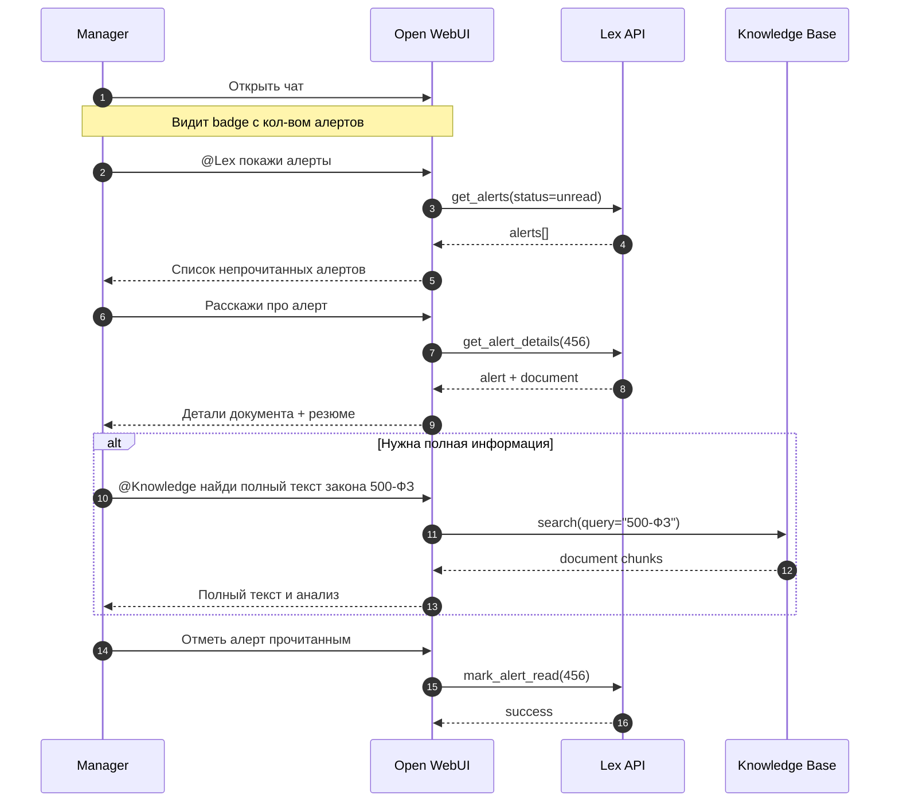
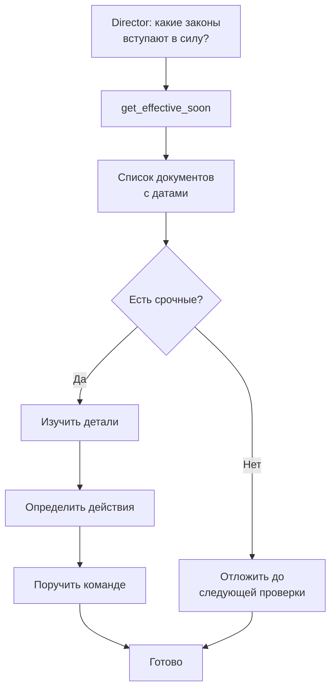
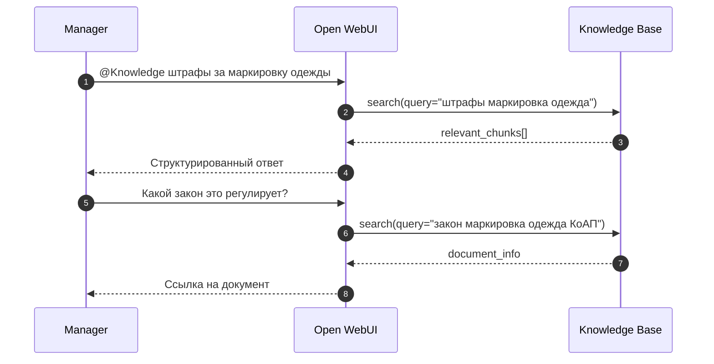
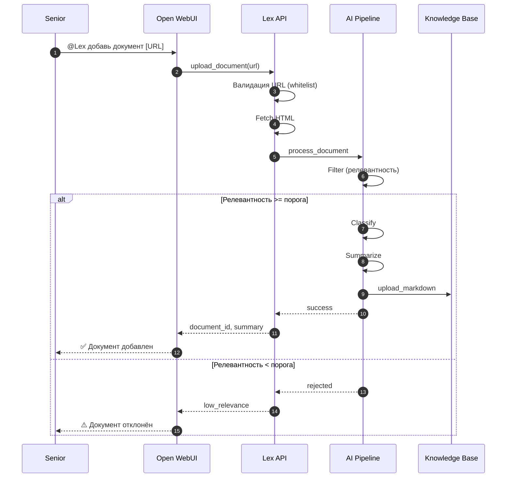
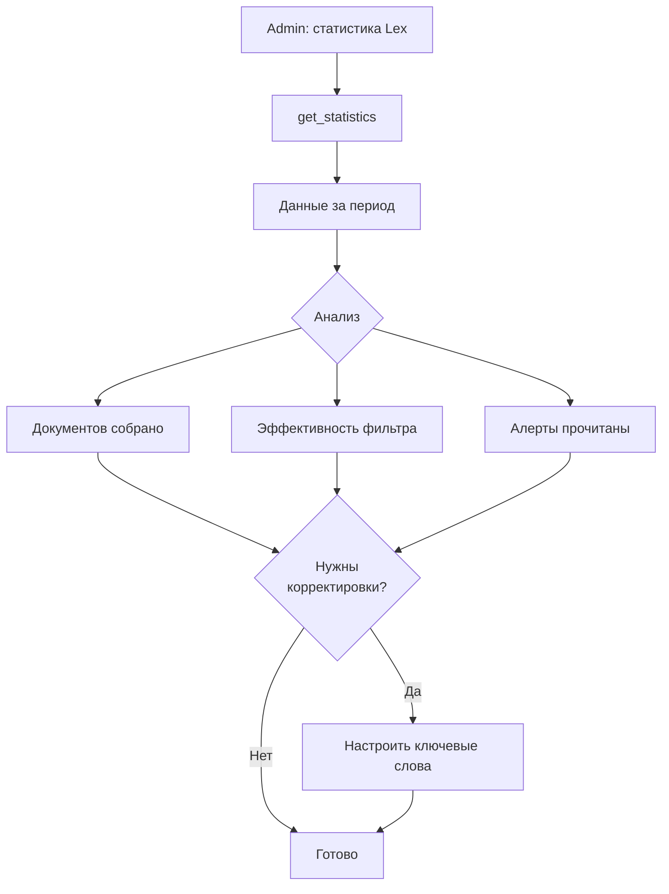
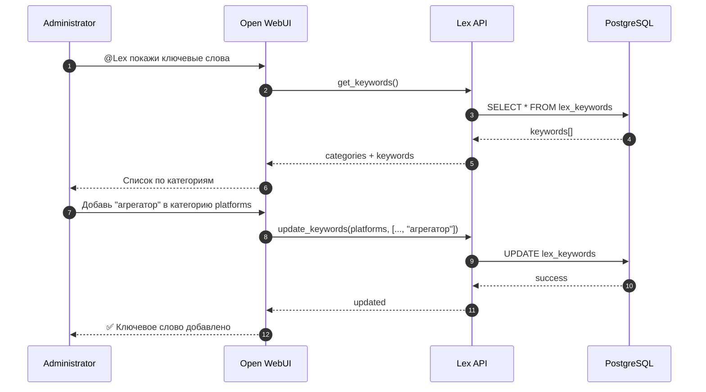
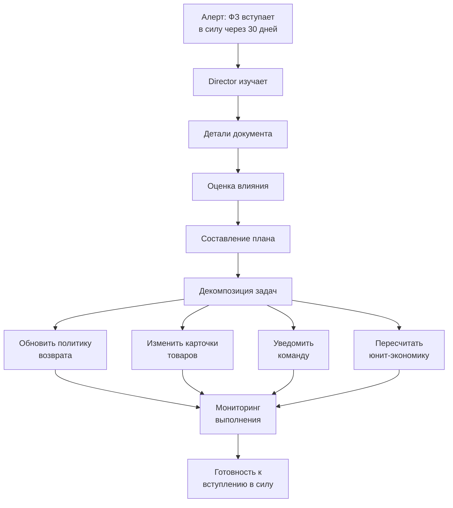
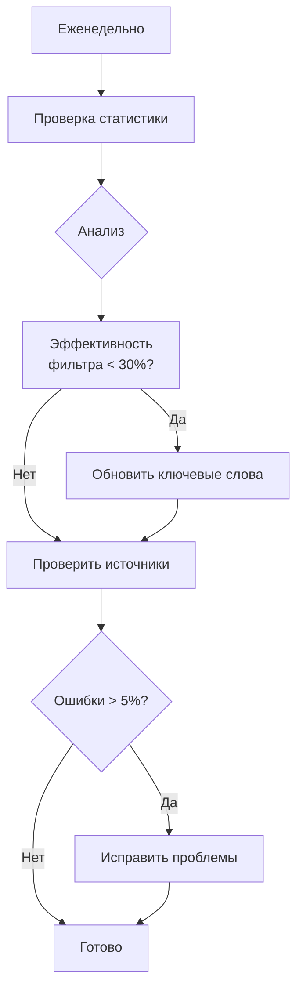

**Проект:** Автоматизированный правовой мониторинг для e-commerce  
**Модуль:** Lex / Scenarios  
**Версия:** 1.0  
**Дата:** Январь 2026

---

## 6.1 Обзор сценариев

### Матрица сценариев по ролям

| Сценарий | Manager | Senior | Director | Admin |
|----------|:-------:|:------:|:--------:|:-----:|
| Просмотр алертов | ✅ | ✅ | ✅ | ✅ |
| Просмотр документов | ✅ | ✅ | ✅ | ✅ |
| Поиск документов | ✅ | ✅ | ✅ | ✅ |
| Отметка прочитанным | ✅ | ✅ | ✅ | ✅ |
| Ручная загрузка (URL) | ❌ | ✅ | ✅ | ✅ |
| Ручная загрузка (файл) | ❌ | ✅ | ✅ | ✅ |
| Просмотр статистики | ✅ | ✅ | ✅ | ✅ |
| Управление ключевыми словами | ❌ | ❌ | ❌ | ✅ |
| Настройки модуля | ❌ | ❌ | ❌ | ✅ |

### Типы пользователей

| Роль | Основные задачи в Lex |
|------|----------------------|
| Manager | Отслеживание алертов, изучение документов по своему направлению |
| Senior | + Добавление найденных документов, анализ для команды |
| Director | + Стратегические решения на основе правовых изменений |
| Administrator | + Настройка фильтров, управление источниками |

---

## 6.2 Сценарий: Утренняя проверка алертов

### Описание

Manager начинает рабочий день с проверки новых алертов о правовых изменениях.

### Диаграмма



### Пример диалога

```
Manager: Покажи непрочитанные алерты

@Adolf_Lex: 📬 У вас 4 непрочитанных алерта:

1. #456 | 📜 Новый закон | 🔴 Высокая
   "ФЗ-500 о защите прав потребителей (маркетплейсы)"
   Категория: Права потребителей
   Вступает в силу: 01.03.2026
   
2. #457 | ⏰ Вступает в силу | 🔴 Высокая
   "Требования к маркировке одежды"
   Категория: Маркировка
   Через: 9 дней
   
3. #458 | 📋 Разъяснение | 🟡 Средняя
   "Письмо ФНС о налогообложении на маркетплейсах"
   Категория: Налоги
   
4. #459 | ⚖️ Судебное решение | 🟡 Средняя
   "ВС РФ о возврате товаров ненадлежащего качества"
   Категория: Права потребителей

Показать детали какого-либо алерта?
```

```
Manager: Расскажи подробнее про первый

@Adolf_Lex: 📜 **Федеральный закон от 15.12.2025 N 500-ФЗ**

📊 **Классификация:**
- Тип: Федеральный закон  
- Категория: Права потребителей
- Релевантность: 🔴 Высокая (92%)

📅 **Даты:**
- Принят: 15.12.2025
- Вступает в силу: 01.03.2026 (через 37 дней)

📝 **Резюме:**
Закон увеличивает срок возврата товаров, купленных на маркетплейсах, 
до 30 дней и устанавливает солидарную ответственность маркетплейса 
и продавца перед покупателем.

**Ключевые положения:**
• Срок возврата увеличен с 7 до 30 дней для маркетплейсов
• Маркетплейс несёт солидарную ответственность с продавцом
• Обязательное информирование о реальном продавце

⚠️ **Влияние на бизнес:** ВЫСОКОЕ
Необходимо пересмотреть политику возврата и обновить карточки товаров.

**Рекомендуемые действия:**
• Обновить политику возврата до 01.03.2026
• Уведомить менеджеров о новых сроках
• Пересчитать юнит-экономику с учётом роста возвратов

🔗 Источник: КонсультантПлюс

Отметить как прочитанный?
```

```
Manager: Да, отметь прочитанным

@Adolf_Lex: ✅ Алерт #456 отмечен как прочитанный.

Осталось 3 непрочитанных алерта.
```

---

## 6.3 Сценарий: Мониторинг сроков вступления в силу

### Описание

Director еженедельно проверяет, какие законы вступают в силу в ближайшее время.

### Диаграмма



### Пример диалога

```
Director: Какие законы вступают в силу в этом месяце?

@Adolf_Lex: ⏰ В ближайшие 30 дней вступают в силу 5 документов:

🔴 **СРОЧНО (до 7 дней):**

1. **01.02.2026** (через 9 дней)
   📜 Требования к маркировке одежды (Честный ЗНАК)
   Категория: Маркировка | Релевантность: Высокая
   ⚠️ Штраф: 50 000 - 300 000 руб. за несоблюдение

🟡 **СКОРО (8-30 дней):**

2. **15.02.2026** (через 23 дня)
   📝 Изменения в закон о рекламе в интернете
   Категория: Реклама | Релевантность: Средняя

3. **20.02.2026** (через 28 дней)
   📋 Новые требования к информированию покупателей
   Категория: Права потребителей | Релевантность: Средняя

4. **28.02.2026** (через 36 дней)
   📜 Изменения в НК РФ (УСН для маркетплейсов)
   Категория: Налоги | Релевантность: Средняя

5. **01.03.2026** (через 37 дней)
   📜 ФЗ-500 о защите прав потребителей
   Категория: Права потребителей | Релевантность: Высокая

⚠️ Рекомендую обратить особое внимание на п.1 — осталось меньше 10 дней!

Показать подробности?
```

---

## 6.4 Сценарий: Поиск информации по конкретной теме

### Описание

Manager ищет информацию о штрафах за отсутствие маркировки.

### Диаграмма



### Пример диалога

```
Manager: @Adolf_Knowledge Какие штрафы за отсутствие маркировки одежды?

@Adolf_Knowledge: По данным из базы правовых документов:

**Штрафы за отсутствие маркировки товаров лёгкой промышленности**
(КоАП РФ, ст. 15.12):

| Субъект | Штраф |
|---------|-------|
| ИП | 5 000 - 10 000 руб. |
| Юридическое лицо | 50 000 - 300 000 руб. |
| Повторное нарушение | до 500 000 руб. |

**Дополнительные последствия:**
• Конфискация товара без маркировки
• Приостановка деятельности до 90 суток (при грубых нарушениях)

📄 Источники:
- ФЗ-487 от 31.12.2017 "О маркировке"
- КоАП РФ, статья 15.12
- Постановление Правительства №1956

⚠️ Внимание: С 01.02.2026 вступают в силу новые требования 
к маркировке одежды — см. алерт #457.

Нужна дополнительная информация?
```

---

## 6.5 Сценарий: Ручная загрузка документа

### Описание

Senior нашёл важный документ на сайте КонсультантПлюс и хочет добавить его в базу.

### Диаграмма



### Пример диалога (успешная загрузка)

```
Senior: @Adolf_Lex добавь документ 
https://www.consultant.ru/document/cons_doc_LAW_XXX/

@Adolf_Lex: 🔄 Загружаю документ...

✅ **Документ успешно добавлен!**

**ID:** 789
**Название:** Приказ Минпромторга от 20.01.2026 N 45
**Тема:** О порядке маркировки текстильных изделий

📊 **Классификация:**
- Категория: Маркировка
- Тип: Приказ (ведомственный акт)
- Релевантность: 🟡 Средняя (76%)

📝 **Резюме:**
Приказ устанавливает новые правила нанесения DataMatrix кодов 
на текстильные изделия с 01.04.2026.

Документ проиндексирован и доступен для поиска через @Adolf_Knowledge.
```

### Пример диалога (отклонение)

```
Senior: @Adolf_Lex добавь документ 
https://www.consultant.ru/document/cons_doc_LAW_YYY/

@Adolf_Lex: 🔄 Загружаю документ...

⚠️ **Документ отклонён**

**Причина:** Низкая релевантность (38%)
**Название:** Постановление о правилах строительства...

Документ не относится к e-commerce, торговле или смежным темам.

Если вы считаете, что документ релевантен — обратитесь к Administrator 
для корректировки ключевых слов фильтрации.
```

---

## 6.6 Сценарий: Просмотр статистики модуля

### Описание

Administrator проверяет эффективность работы модуля Lex.

### Диаграмма



### Пример диалога

```
Administrator: @Adolf_Lex покажи статистику за месяц

@Adolf_Lex: 📊 **Статистика Lex за последние 30 дней:**

**Сбор документов:**
- Проверено документов: 312
- Принято: 127 (41%)
- Отклонено: 185 (59%)

**По источникам:**
| Источник | Собрано | Принято | % |
|----------|---------|---------|---|
| КонсультантПлюс | 198 | 85 | 43% |
| Гарант | 114 | 42 | 37% |

**По категориям:**
| Категория | Кол-во | Доля |
|-----------|--------|------|
| Маркировка | 35 | 28% |
| Торговля | 28 | 22% |
| Права потребителей | 24 | 19% |
| Налоги | 18 | 14% |
| Реклама | 12 | 9% |
| Труд | 7 | 6% |
| Персональные данные | 3 | 2% |

**По релевантности:**
- 🔴 Высокая: 23 (18%)
- 🟡 Средняя: 67 (53%)
- 🟢 Низкая: 37 (29%)

**Алерты:**
- Создано: 127
- Прочитано: 98 (77%)
- Непрочитано: 29

**Здоровье системы:**
- Ошибок парсинга: 3 (< 1%)
- Среднее время AI: 8.2 сек
- Источники доступны: ✅ все

💡 Рекомендация: Доля прочитанных алертов 77% — хороший показатель.
```

---

## 6.7 Сценарий: Управление ключевыми словами

### Описание

Administrator добавляет новые ключевые слова для улучшения фильтрации.

### Диаграмма



### Пример диалога

```
Administrator: @Adolf_Lex покажи ключевые слова

@Adolf_Lex: 📋 **Ключевые слова для фильтрации:**

**trade** (вес: 1.0):
маркетплейс, дистанционная торговля, интернет-магазин, 
розничная торговля, электронная коммерция, онлайн-торговля

**marking** (вес: 1.2):
маркировка товаров, Честный ЗНАК, товары лёгкой промышленности, 
одежда, текстиль, ЦРПТ, DataMatrix

**consumer_rights** (вес: 1.1):
защита прав потребителей, возврат товара, гарантия, претензия, 
недостаток товара, права покупателя

**platforms** (вес: 1.5):
Wildberries, Ozon, Яндекс.Маркет, агрегатор, 
владелец агрегатора, оператор торговой площадки

...

Всего: 8 категорий, 64 ключевых слова.

Для изменения: "обнови ключевые слова {категория} {слова через запятую}"
```

```
Administrator: Добавь "e-commerce" и "омниканальность" в категорию trade

@Adolf_Lex: ✅ Ключевые слова обновлены!

**trade** (вес: 1.0):
маркетплейс, дистанционная торговля, интернет-магазин, 
розничная торговля, электронная коммерция, онлайн-торговля,
**e-commerce**, **омниканальность**

Изменения вступят в силу при следующем цикле сбора (20:30).
```

---

## 6.8 Сценарий: Подготовка к внедрению нового закона

### Описание

Комплексный сценарий подготовки команды к вступлению в силу важного закона.

### Диаграмма



### Пример использования

```
Director: @Adolf_Lex что нового по защите прав потребителей?

@Adolf_Lex: По категории "Права потребителей" за последние 30 дней:

📜 **Документы высокой релевантности (3):**

1. ФЗ-500 от 15.12.2025 — Возврат на маркетплейсах 30 дней
   ⏰ Вступает: 01.03.2026 | Влияние: ВЫСОКОЕ

2. Решение ВС РФ — Солидарная ответственность МП
   ✅ Действует | Влияние: ВЫСОКОЕ

3. Постановление Правительства — Информирование покупателей
   ⏰ Вступает: 20.02.2026 | Влияние: СРЕДНЕЕ

Показать детальный план подготовки к ФЗ-500?
```

```
Director: Да, покажи план

@Adolf_Lex: 📋 **План подготовки к ФЗ-500 (вступление 01.03.2026):**

**Срок: 37 дней**

**Этап 1: Анализ (до 25.01.2026)**
☐ Изучить полный текст закона
☐ Определить затрагиваемые процессы
☐ Оценить финансовое влияние (рост возвратов)

**Этап 2: Документы (до 10.02.2026)**
☐ Обновить политику возврата
☐ Подготовить новые шаблоны ответов на отзывы
☐ Изменить информацию на карточках товаров

**Этап 3: Команда (до 20.02.2026)**
☐ Провести обучение менеджеров
☐ Обновить скрипты для службы поддержки
☐ Уведомить бухгалтерию о возможных изменениях

**Этап 4: Системы (до 28.02.2026)**
☐ Настроить автоматизацию возвратов
☐ Обновить интеграции с маркетплейсами
☐ Протестировать процессы

**Потенциальные риски:**
⚠️ Рост возвратов на 15-25%
⚠️ Увеличение нагрузки на службу поддержки

Экспортировать план в документ?
```

---

## 6.9 Типичный рабочий день с модулем Lex

### Для Manager

```mermaid
flowchart TD
    START[Начало дня] --> CHECK[Проверка алертов<br/>badge в Open WebUI]
    CHECK --> URGENT{Есть срочные?}
    URGENT -->|🔴 Высокая| READ_URGENT[Изучить срочные]
    URGENT -->|Нет| READ_ALL[Просмотреть все]
    READ_URGENT --> MARK[Отметить прочитанными]
    READ_ALL --> MARK
    MARK --> QUESTION{Вопросы по<br/>документам?}
    QUESTION -->|Да| SEARCH[@Knowledge поиск]
    QUESTION -->|Нет| END[Продолжить работу]
    SEARCH --> END
```

### Для Senior

```mermaid
flowchart TD
    START[Обнаружен важный<br/>документ] --> CHECK{Есть в базе?}
    CHECK -->|Да| USE[Использовать существующий]
    CHECK -->|Нет| UPLOAD[@Lex загрузить]
    UPLOAD --> RESULT{Результат}
    RESULT -->|✅ Принят| SHARE[Поделиться с командой]
    RESULT -->|⚠️ Отклонён| REVIEW[Пересмотреть<br/>необходимость]
    SHARE --> END[Готово]
    USE --> END
    REVIEW --> END
```

### Для Administrator



---

## 6.10 Интеграция с другими модулями

### Lex → Knowledge

| Событие в Lex | Действие в Knowledge |
|---------------|---------------------|
| Новый документ принят | Загрузка в KB с индексацией |
| Документ обновлён | Обновление в KB |
| Поиск пользователя | RAG-поиск по документам Lex |

### Lex → Core (Notifications)

| Событие в Lex | Уведомление |
|---------------|-------------|
| Новый закон (high) | Push + Badge |
| Изменение НПА (medium) | Badge |
| Вступает в силу &lt; 7 дней | Push + Badge |
| Ошибка парсинга | Алерт Admin |

---

## Приложение А: Чек-лист по ролям

### Manager

| Действие | Частота |
|----------|---------|
| Проверить алерты | Ежедневно утром |
| Изучить документы высокой релевантности | При получении |
| Отметить алерты прочитанными | После изучения |
| Поиск по Knowledge при вопросах | По необходимости |

### Senior

| Действие | Частота |
|----------|---------|
| Все действия Manager | — |
| Загрузить найденные документы | По мере обнаружения |
| Анализ для команды | Еженедельно |

### Administrator

| Действие | Частота |
|----------|---------|
| Проверить статистику модуля | Еженедельно |
| Обновить ключевые слова | По необходимости |
| Проверить здоровье источников | Еженедельно |
| Настроить пороги релевантности | По необходимости |

---

**Документ подготовлен:** Январь 2026  
**Версия:** 1.0  
**Статус:** Черновик
