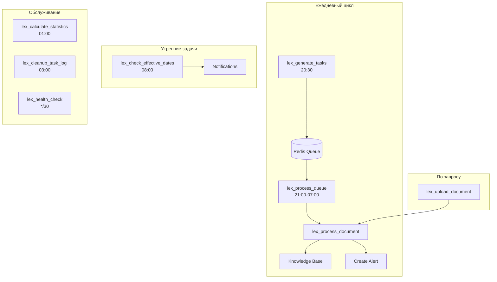
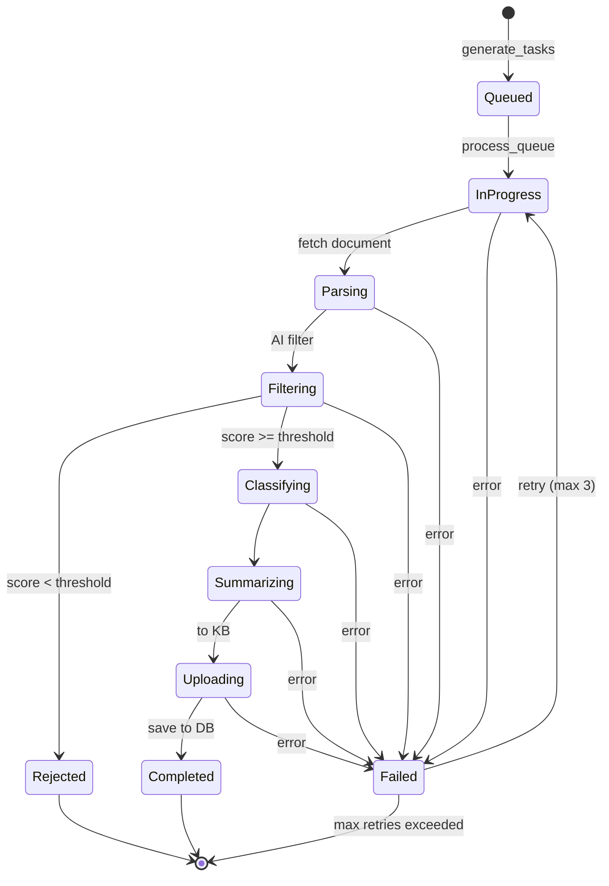

**Проект:** Автоматизированный правовой мониторинг для e-commerce  
**Модуль:** Lex / Celery  
**Версия:** 1.0  
**Дата:** Январь 2026

---

## 7.1 Обзор задач

### Реестр задач модуля Lex

| Задача | Тип | Очередь | Периодичность | Описание |
|--------|-----|---------|---------------|----------|
| `lex_generate_tasks` | periodic | lex | 20:30 ежедневно | Генерация задач парсинга |
| `lex_process_queue` | periodic | lex | 21:00–07:00 */10 | Обработка очереди задач |
| `lex_process_document` | async | lex | По событию | Обработка одного документа |
| `lex_upload_document` | async | lex | По запросу | Ручная загрузка документа |
| `lex_check_effective_dates` | periodic | lex | 08:00 ежедневно | Проверка сроков вступления в силу |
| `lex_calculate_statistics` | periodic | lex | 01:00 ежедневно | Расчёт статистики |
| `lex_cleanup_task_log` | periodic | lex | 03:00 ежедневно | Очистка логов задач |
| `lex_health_check` | periodic | lex | */30 | Проверка здоровья источников |

### Диаграмма потоков задач



---

## 7.2 Celery Beat Schedule

```python
# celery_config.py
from celery.schedules import crontab

beat_schedule = {
    # ===== ОСНОВНОЙ ЦИКЛ СБОРА =====
    
    # Генерация задач парсинга (20:30 ежедневно)
    "lex-generate-tasks": {
        "task": "tasks.lex_tasks.lex_generate_tasks",
        "schedule": crontab(hour=20, minute=30),
        "options": {"queue": "lex"}
    },
    
    # Обработка очереди задач (21:00-07:00, каждые 10 минут)
    "lex-process-queue": {
        "task": "tasks.lex_tasks.lex_process_queue",
        "schedule": crontab(minute="*/10", hour="21-23,0-7"),
        "options": {"queue": "lex"}
    },
    
    # ===== УТРЕННИЕ ЗАДАЧИ =====
    
    # Проверка сроков вступления в силу (08:00 ежедневно)
    "lex-check-effective-dates": {
        "task": "tasks.lex_tasks.lex_check_effective_dates",
        "schedule": crontab(hour=8, minute=0),
        "options": {"queue": "lex"}
    },
    
    # ===== ОБСЛУЖИВАНИЕ =====
    
    # Расчёт статистики (01:00 ежедневно)
    "lex-calculate-statistics": {
        "task": "tasks.lex_tasks.lex_calculate_statistics",
        "schedule": crontab(hour=1, minute=0),
        "options": {"queue": "lex"}
    },
    
    # Очистка логов задач (03:00 ежедневно)
    "lex-cleanup-task-log": {
        "task": "tasks.lex_tasks.lex_cleanup_task_log",
        "schedule": crontab(hour=3, minute=0),
        "options": {"queue": "lex"}
    },
    
    # Проверка здоровья источников (каждые 30 минут)
    "lex-health-check": {
        "task": "tasks.lex_tasks.lex_health_check",
        "schedule": crontab(minute="*/30"),
        "options": {"queue": "lex"}
    },
}
```

---

## 7.3 Реализация задач

### 7.3.1 Генерация задач парсинга

```python
# tasks/lex_tasks.py
from celery import shared_task
from datetime import datetime
import redis
import json
from core.database import db_session
from services.adapters import ConsultantPlusAdapter, GarantAdapter

# Адаптеры источников
ADAPTERS = {
    "consultant_plus": ConsultantPlusAdapter,
    "garant": GarantAdapter
}

QUEUE_NAME = "task_queue:lex"


@shared_task(name="tasks.lex_tasks.lex_generate_tasks")
def lex_generate_tasks():
    """
    Генерация задач парсинга для всех активных источников.
    Запускается ежедневно в 20:30.
    """
    redis_client = redis.from_url(settings.REDIS_URL)
    
    with db_session() as session:
        # Получение активных источников
        sources = session.execute(
            "SELECT name, adapter_name, config FROM lex_sources WHERE enabled = true"
        ).fetchall()
        
        total_tasks = 0
        
        for source in sources:
            adapter_class = ADAPTERS.get(source.adapter_name)
            if not adapter_class:
                continue
            
            adapter = adapter_class()
            tasks = adapter.generate_tasks()
            
            for task in tasks:
                # Проверка, не обрабатывался ли URL сегодня
                if _is_processed_today(session, task.url):
                    continue
                
                # Добавление в очередь Redis
                task_data = {
                    "task_id": f"lex_{datetime.utcnow().strftime('%Y%m%d')}_{total_tasks}",
                    "source": source.name,
                    "adapter_name": source.adapter_name,
                    "url": task.url,
                    "task_type": task.task_type,
                    "priority": task.priority,
                    "created_at": datetime.utcnow().isoformat()
                }
                
                redis_client.rpush(QUEUE_NAME, json.dumps(task_data))
                
                # Логирование в БД
                session.execute(
                    """
                    INSERT INTO lex_task_log (task_id, source, url, status, created_at)
                    VALUES (:task_id, :source, :url, 'queued', NOW())
                    """,
                    {
                        "task_id": task_data["task_id"],
                        "source": source.name,
                        "url": task.url
                    }
                )
                
                total_tasks += 1
        
        session.commit()
        
        # Обновление статистики
        _increment_statistic(session, "all", "tasks_created", total_tasks)
        session.commit()
        
        return {
            "status": "success",
            "tasks_created": total_tasks,
            "sources_processed": len(sources)
        }


def _is_processed_today(session, url: str) -> bool:
    """Проверка, обрабатывался ли URL сегодня."""
    result = session.execute(
        """
        SELECT COUNT(*) FROM lex_task_log 
        WHERE url = :url 
          AND DATE(created_at) = CURRENT_DATE
          AND status IN ('completed', 'in_progress')
        """,
        {"url": url}
    ).scalar()
    return result > 0
```

### 7.3.2 Обработка очереди задач

```python
@shared_task(name="tasks.lex_tasks.lex_process_queue")
def lex_process_queue():
    """
    Обработка очереди задач парсинга.
    Запускается каждые 10 минут с 21:00 до 07:00.
    """
    redis_client = redis.from_url(settings.REDIS_URL)
    
    # Получение настроек
    max_tasks_per_run = int(settings.LEX_MAX_TASKS_PER_RUN or 20)
    processed = 0
    
    while processed < max_tasks_per_run:
        # Извлечение задачи из очереди
        task_data_raw = redis_client.lpop(QUEUE_NAME)
        if not task_data_raw:
            break
        
        task_data = json.loads(task_data_raw)
        
        # Запуск обработки документа
        lex_process_document.delay(
            task_id=task_data["task_id"],
            source=task_data["source"],
            adapter_name=task_data["adapter_name"],
            url=task_data["url"],
            task_type=task_data["task_type"]
        )
        
        processed += 1
    
    queue_length = redis_client.llen(QUEUE_NAME)
    
    return {
        "status": "success",
        "tasks_dispatched": processed,
        "queue_remaining": queue_length
    }
```

### 7.3.3 Обработка одного документа

```python
@shared_task(
    name="tasks.lex_tasks.lex_process_document",
    bind=True,
    max_retries=3,
    soft_time_limit=120,
    time_limit=180
)
def lex_process_document(
    self,
    task_id: str,
    source: str,
    adapter_name: str,
    url: str,
    task_type: str
):
    """
    Полный цикл обработки документа:
    1. Парсинг
    2. AI-фильтрация
    3. AI-классификация
    4. AI-резюмирование
    5. Загрузка в Knowledge Base
    6. Создание алерта
    """
    from services.adapters import ADAPTERS
    from services.ai_pipeline import AIPipeline
    from services.knowledge_uploader import KnowledgeUploader
    from services.alert_service import AlertService
    
    with db_session() as session:
        # Обновление статуса задачи
        session.execute(
            """
            UPDATE lex_task_log 
            SET status = 'in_progress', started_at = NOW()
            WHERE task_id = :task_id
            """,
            {"task_id": task_id}
        )
        session.commit()
        
        try:
            # 1. Парсинг документа
            adapter_class = ADAPTERS.get(adapter_name)
            adapter = adapter_class()
            
            if task_type == "document_list":
                # Парсинг списка → добавление URL в очередь
                urls = adapter.parse_document_list(url)
                for doc_url in urls:
                    _enqueue_document(session, source, adapter_name, doc_url)
                
                _complete_task(session, task_id, "completed")
                return {"status": "list_parsed", "urls_found": len(urls)}
            
            # Парсинг одного документа
            raw_document = adapter.parse_document(url)
            
            # 2. Проверка дубликатов
            if _is_duplicate(session, raw_document):
                _complete_task(session, task_id, "duplicate")
                return {"status": "duplicate", "url": url}
            
            # 3. AI Pipeline
            pipeline = AIPipeline()
            result = await pipeline.process(raw_document)
            
            if not result.success:
                # Документ отклонён по релевантности
                _complete_task(
                    session, task_id, "rejected",
                    relevance_score=result.relevance_score
                )
                _increment_statistic(session, source, "documents_rejected")
                return {"status": "rejected", "score": result.relevance_score}
            
            # 4. Загрузка в Knowledge Base
            uploader = KnowledgeUploader()
            kb_id = uploader.upload(
                markdown=result.markdown,
                metadata={
                    "source": source,
                    "category": result.classification.category,
                    "relevance": result.classification.relevance_level
                }
            )
            
            # 5. Сохранение в PostgreSQL
            document_id = _save_document(
                session=session,
                raw_document=raw_document,
                classification=result.classification,
                summary=result.summary,
                relevance_score=result.relevance_score,
                kb_id=kb_id
            )
            
            # 6. Создание алерта
            alert_service = AlertService()
            alert_service.create_alert(
                document_id=document_id,
                classification=result.classification,
                summary=result.summary
            )
            
            # 7. Завершение задачи
            _complete_task(
                session, task_id, "completed",
                document_id=document_id,
                relevance_score=result.relevance_score
            )
            _increment_statistic(session, source, "documents_accepted")
            _increment_statistic(session, source, "alerts_created")
            
            session.commit()
            
            return {
                "status": "success",
                "document_id": document_id,
                "kb_id": kb_id,
                "category": result.classification.category,
                "relevance": result.classification.relevance_level
            }
            
        except Exception as e:
            session.rollback()
            
            _complete_task(session, task_id, "failed", error=str(e))
            _increment_statistic(session, source, "tasks_failed")
            session.commit()
            
            raise self.retry(exc=e, countdown=120)


def _save_document(session, raw_document, classification, summary, relevance_score, kb_id):
    """Сохранение документа в PostgreSQL."""
    result = session.execute(
        """
        INSERT INTO lex_documents (
            source, url, title, document_number, document_date, effective_date,
            issuer, doc_type, category, secondary_categories,
            relevance_level, relevance_score, summary, key_points,
            business_impact, recommended_actions, deadlines, penalties,
            kb_id, matched_keywords, upload_type, created_at
        ) VALUES (
            :source, :url, :title, :number, :date, :effective_date,
            :issuer, :doc_type, :category, :secondary_categories,
            :relevance_level, :relevance_score, :summary, :key_points,
            :business_impact, :recommended_actions, :deadlines, :penalties,
            :kb_id, :keywords, 'automatic', NOW()
        )
        RETURNING id
        """,
        {
            "source": raw_document.source,
            "url": raw_document.url,
            "title": raw_document.title,
            "number": raw_document.number,
            "date": raw_document.date,
            "effective_date": raw_document.effective_date,
            "issuer": raw_document.issuer,
            "doc_type": classification.doc_type,
            "category": classification.category,
            "secondary_categories": classification.secondary_categories,
            "relevance_level": classification.relevance_level,
            "relevance_score": relevance_score,
            "summary": summary.short_summary,
            "key_points": json.dumps(summary.key_points),
            "business_impact": json.dumps({
                "level": summary.business_impact.level,
                "description": summary.business_impact.description
            }),
            "recommended_actions": json.dumps(summary.recommended_actions),
            "deadlines": json.dumps([
                {"date": d.date, "description": d.description}
                for d in summary.deadlines
            ]),
            "penalties": json.dumps([
                {"amount": p.amount, "condition": p.condition}
                for p in summary.penalties
            ]),
            "kb_id": kb_id,
            "keywords": raw_document.keywords or []
        }
    )
    return result.scalar()


def _complete_task(session, task_id, status, **kwargs):
    """Завершение задачи."""
    update_fields = ["status = :status", "completed_at = NOW()"]
    params = {"task_id": task_id, "status": status}
    
    if "document_id" in kwargs:
        update_fields.append("document_id = :document_id")
        params["document_id"] = kwargs["document_id"]
    
    if "relevance_score" in kwargs:
        update_fields.append("relevance_score = :relevance_score")
        params["relevance_score"] = kwargs["relevance_score"]
    
    if "error" in kwargs:
        update_fields.append("error_message = :error")
        params["error"] = kwargs["error"]
    
    session.execute(
        f"UPDATE lex_task_log SET {', '.join(update_fields)} WHERE task_id = :task_id",
        params
    )
```

### 7.3.4 Ручная загрузка документа

```python
@shared_task(
    name="tasks.lex_tasks.lex_upload_document",
    bind=True,
    max_retries=2,
    soft_time_limit=90,
    time_limit=120
)
def lex_upload_document(self, url: str, user_id: int):
    """
    Ручная загрузка документа по URL.
    Доступно для Senior+.
    """
    from services.url_validator import validate_url
    from services.document_fetcher import DocumentFetcher
    from services.ai_pipeline import AIPipeline
    from services.knowledge_uploader import KnowledgeUploader
    from services.alert_service import AlertService
    
    # Валидация URL
    validation = validate_url(url)
    if not validation.is_valid:
        return {
            "success": False,
            "reason": validation.error
        }
    
    with db_session() as session:
        try:
            # Проверка дубликатов
            existing = session.execute(
                "SELECT id FROM lex_documents WHERE url = :url",
                {"url": url}
            ).scalar()
            
            if existing:
                return {
                    "success": False,
                    "reason": "duplicate",
                    "existing_id": existing
                }
            
            # Загрузка и парсинг
            fetcher = DocumentFetcher()
            raw_document = fetcher.fetch_and_parse(url, source="manual_upload")
            
            # AI Pipeline
            pipeline = AIPipeline()
            result = await pipeline.process(raw_document)
            
            if not result.success:
                return {
                    "success": False,
                    "reason": "low_relevance",
                    "relevance_score": result.relevance_score,
                    "title": raw_document.title
                }
            
            # Загрузка в Knowledge Base
            uploader = KnowledgeUploader()
            kb_id = uploader.upload(
                markdown=result.markdown,
                metadata={
                    "source": "manual_upload",
                    "category": result.classification.category,
                    "uploaded_by": user_id
                }
            )
            
            # Сохранение
            document_id = _save_document(
                session=session,
                raw_document=raw_document,
                classification=result.classification,
                summary=result.summary,
                relevance_score=result.relevance_score,
                kb_id=kb_id
            )
            
            # Обновление uploaded_by
            session.execute(
                "UPDATE lex_documents SET uploaded_by_id = :user_id WHERE id = :id",
                {"user_id": user_id, "id": document_id}
            )
            
            # Создание алерта
            alert_service = AlertService()
            alert_service.create_alert(
                document_id=document_id,
                classification=result.classification,
                summary=result.summary
            )
            
            session.commit()
            
            return {
                "success": True,
                "document_id": document_id,
                "title": raw_document.title,
                "category": result.classification.category,
                "relevance_score": result.relevance_score,
                "relevance_level": result.classification.relevance_level
            }
            
        except Exception as e:
            session.rollback()
            raise self.retry(exc=e, countdown=60)
```

### 7.3.5 Проверка сроков вступления в силу

```python
@shared_task(name="tasks.lex_tasks.lex_check_effective_dates")
def lex_check_effective_dates():
    """
    Проверка документов, вступающих в силу.
    Создаёт алерты типа 'effective_soon'.
    Запускается ежедневно в 08:00.
    """
    from services.alert_service import AlertService
    
    with db_session() as session:
        # Документы, вступающие в силу в ближайшие N дней
        threshold_days = int(
            session.execute(
                "SELECT value FROM lex_settings WHERE key = 'effective_soon_days'"
            ).scalar() or 30
        )
        
        documents = session.execute(
            """
            SELECT d.id, d.title, d.category, d.relevance_level, 
                   d.effective_date, (d.effective_date - CURRENT_DATE) AS days_until
            FROM lex_documents d
            WHERE d.effective_date IS NOT NULL
              AND d.effective_date > CURRENT_DATE
              AND d.effective_date <= CURRENT_DATE + :threshold * INTERVAL '1 day'
              AND NOT EXISTS (
                  SELECT 1 FROM lex_alerts a 
                  WHERE a.document_id = d.id 
                    AND a.alert_type = 'effective_soon'
                    AND a.created_at > CURRENT_DATE - INTERVAL '7 days'
              )
            ORDER BY d.effective_date ASC
            """,
            {"threshold": threshold_days}
        ).fetchall()
        
        alert_service = AlertService()
        alerts_created = 0
        
        for doc in documents:
            # Создание алерта только если осталось < 7 дней или кратно 7
            days_until = doc.days_until
            if days_until <= 7 or days_until % 7 == 0:
                alert_service.create_effective_soon_alert(
                    document_id=doc.id,
                    title=doc.title,
                    category=doc.category,
                    relevance_level=doc.relevance_level,
                    effective_date=doc.effective_date,
                    days_until=days_until
                )
                alerts_created += 1
        
        return {
            "status": "success",
            "documents_checked": len(documents),
            "alerts_created": alerts_created
        }
```

### 7.3.6 Расчёт статистики

```python
@shared_task(name="tasks.lex_tasks.lex_calculate_statistics")
def lex_calculate_statistics():
    """
    Расчёт ежедневной статистики.
    Запускается в 01:00.
    """
    from datetime import date, timedelta
    
    with db_session() as session:
        yesterday = date.today() - timedelta(days=1)
        
        # Статистика по источникам
        for source in ["consultant_plus", "garant", "manual_upload"]:
            stats = session.execute(
                """
                SELECT 
                    COUNT(*) FILTER (WHERE status = 'completed') AS completed,
                    COUNT(*) FILTER (WHERE status = 'rejected') AS rejected,
                    COUNT(*) FILTER (WHERE status = 'failed') AS failed
                FROM lex_task_log
                WHERE DATE(created_at) = :date
                  AND source = :source
                """,
                {"date": yesterday, "source": source}
            ).first()
            
            if stats.completed or stats.rejected or stats.failed:
                _save_daily_stats(session, yesterday, source, {
                    "tasks_completed": stats.completed or 0,
                    "documents_rejected": stats.rejected or 0,
                    "tasks_failed": stats.failed or 0
                })
        
        # Статистика по документам
        doc_stats = session.execute(
            """
            SELECT 
                source,
                category,
                relevance_level,
                COUNT(*) AS count
            FROM lex_documents
            WHERE DATE(created_at) = :date
            GROUP BY source, category, relevance_level
            """,
            {"date": yesterday}
        ).fetchall()
        
        # Статистика по алертам
        alert_stats = session.execute(
            """
            SELECT COUNT(*) AS created,
                   COUNT(*) FILTER (WHERE ar.id IS NOT NULL) AS read
            FROM lex_alerts a
            LEFT JOIN lex_alert_reads ar ON a.id = ar.alert_id
            WHERE DATE(a.created_at) = :date
            """,
            {"date": yesterday}
        ).first()
        
        _save_daily_stats(session, yesterday, "all", {
            "alerts_created": alert_stats.created or 0,
            "alerts_read": alert_stats.read or 0
        })
        
        session.commit()
        
        return {
            "status": "success",
            "date": str(yesterday),
            "documents_stats": len(doc_stats),
            "alerts_created": alert_stats.created
        }


def _save_daily_stats(session, date, source, stats: dict):
    """Сохранение статистики за день."""
    for action, count in stats.items():
        if count > 0:
            session.execute(
                """
                INSERT INTO lex_statistics (date, source, action, count)
                VALUES (:date, :source, :action, :count)
                ON CONFLICT (date, source, action)
                DO UPDATE SET count = lex_statistics.count + :count
                """,
                {"date": date, "source": source, "action": action, "count": count}
            )
```

### 7.3.7 Очистка логов задач

```python
@shared_task(name="tasks.lex_tasks.lex_cleanup_task_log")
def lex_cleanup_task_log():
    """
    Очистка старых записей в lex_task_log.
    Запускается ежедневно в 03:00.
    """
    with db_session() as session:
        retention_days = int(
            session.execute(
                "SELECT value FROM lex_settings WHERE key = 'task_log_retention_days'"
            ).scalar() or 30
        )
        
        result = session.execute(
            """
            DELETE FROM lex_task_log
            WHERE created_at < NOW() - :days * INTERVAL '1 day'
            """,
            {"days": retention_days}
        )
        
        deleted = result.rowcount
        session.commit()
        
        return {
            "status": "success",
            "deleted_records": deleted,
            "retention_days": retention_days
        }
```

### 7.3.8 Проверка здоровья источников

```python
@shared_task(name="tasks.lex_tasks.lex_health_check")
def lex_health_check():
    """
    Проверка доступности источников.
    Запускается каждые 30 минут.
    """
    import httpx
    
    with db_session() as session:
        sources = session.execute(
            "SELECT id, name, base_url FROM lex_sources WHERE enabled = true"
        ).fetchall()
        
        results = []
        
        for source in sources:
            try:
                async with httpx.AsyncClient(timeout=10) as client:
                    response = await client.head(source.base_url)
                    is_healthy = response.status_code < 400
                    
                    if is_healthy:
                        session.execute(
                            """
                            UPDATE lex_sources 
                            SET last_success_at = NOW(), consecutive_errors = 0
                            WHERE id = :id
                            """,
                            {"id": source.id}
                        )
                    else:
                        _record_source_error(
                            session, source.id, 
                            f"HTTP {response.status_code}"
                        )
                    
                    results.append({
                        "source": source.name,
                        "healthy": is_healthy,
                        "status_code": response.status_code
                    })
                    
            except Exception as e:
                _record_source_error(session, source.id, str(e))
                results.append({
                    "source": source.name,
                    "healthy": False,
                    "error": str(e)
                })
        
        session.commit()
        
        # Алерт если источник недоступен > 3 раз подряд
        unhealthy = session.execute(
            """
            SELECT name FROM lex_sources 
            WHERE consecutive_errors >= 3 AND enabled = true
            """
        ).fetchall()
        
        if unhealthy:
            _send_admin_alert(
                f"Источники недоступны: {', '.join(s.name for s in unhealthy)}"
            )
        
        return {
            "status": "success",
            "sources_checked": len(sources),
            "healthy": sum(1 for r in results if r.get("healthy")),
            "unhealthy": sum(1 for r in results if not r.get("healthy"))
        }


def _record_source_error(session, source_id: int, error: str):
    """Запись ошибки источника."""
    session.execute(
        """
        UPDATE lex_sources 
        SET last_error_at = NOW(), 
            last_error_message = :error,
            consecutive_errors = consecutive_errors + 1
        WHERE id = :id
        """,
        {"id": source_id, "error": error}
    )
```

---

## 7.4 Конфигурация

### Celery Config

```python
# celery_config.py
import os

# Брокер и бэкенд
broker_url = os.getenv("REDIS_URL", "redis://localhost:6379/0")
result_backend = os.getenv("REDIS_URL", "redis://localhost:6379/0")

# Сериализация
task_serializer = "json"
result_serializer = "json"
accept_content = ["json"]

# Таймауты
task_soft_time_limit = 120  # 2 минуты soft limit
task_time_limit = 180       # 3 минуты hard limit

# Retry
task_default_retry_delay = 120
task_max_retries = 3

# Prefetch
worker_prefetch_multiplier = 1

# Очереди
task_queues = {
    "lex": {
        "exchange": "lex",
        "routing_key": "lex"
    }
}

task_routes = {
    "tasks.lex_tasks.*": {"queue": "lex"},
}

# Таймзона
timezone = "Europe/Moscow"
enable_utc = False
```

### Environment Variables

```bash
# Redis
REDIS_URL=redis://localhost:6379/0

# Lex Celery
LEX_MAX_TASKS_PER_RUN=20
LEX_WORKER_CONCURRENCY=2

# Таймауты
LEX_TASK_SOFT_LIMIT=120
LEX_TASK_HARD_LIMIT=180
```

---

## 7.5 Запуск Workers

### Docker Compose

```yaml
# docker-compose.yml
services:
  celery-lex-worker:
    build: .
    command: celery -A app worker -Q lex -c 2 --loglevel=info
    environment:
      - REDIS_URL=redis://redis:6379/0
      - DATABASE_URL=postgresql://...
    depends_on:
      - redis
      - postgres
    restart: unless-stopped

  celery-lex-beat:
    build: .
    command: celery -A app beat --loglevel=info
    environment:
      - REDIS_URL=redis://redis:6379/0
    depends_on:
      - redis
    restart: unless-stopped
```

### Systemd Service

```ini
# /etc/systemd/system/celery-lex-worker.service
[Unit]
Description=Celery Lex Worker
After=network.target redis.service postgresql.service

[Service]
Type=simple
User=adolf
WorkingDirectory=/opt/adolf
ExecStart=/opt/adolf/venv/bin/celery -A app worker -Q lex -c 2 --loglevel=info
Restart=always
RestartSec=10

[Install]
WantedBy=multi-user.target
```

---

## 7.6 Мониторинг

### Flower Dashboard

```bash
celery -A app flower --port=5555 --url_prefix=flower
```

### Ключевые метрики

| Метрика | Описание | Алерт |
|---------|----------|-------|
| `lex.tasks.created` | Задач создано | — |
| `lex.tasks.completed` | Задач выполнено | — |
| `lex.tasks.failed` | Задач с ошибкой | &gt; 10% |
| `lex.documents.accepted` | Документов принято | — |
| `lex.documents.rejected` | Документов отклонено | — |
| `lex.queue.length` | Длина очереди | &gt; 100 |
| `lex.ai.latency` | Время AI обработки | &gt; 30 сек |
| `lex.sources.healthy` | Здоровых источников | &lt; 100% |

### Prometheus Metrics

```python
# metrics.py
from prometheus_client import Counter, Histogram, Gauge

lex_tasks_total = Counter(
    'lex_tasks_total',
    'Total Lex tasks',
    ['status']
)

lex_documents_total = Counter(
    'lex_documents_total',
    'Total documents processed',
    ['source', 'status']
)

lex_ai_duration = Histogram(
    'lex_ai_duration_seconds',
    'AI processing duration',
    buckets=[1, 2, 5, 10, 20, 30, 60]
)

lex_queue_length = Gauge(
    'lex_queue_length',
    'Current queue length'
)
```

---

## 7.7 Диаграмма жизненного цикла задачи



---

## Приложение А: Контрольные точки

| Критерий | Проверка |
|----------|----------|
| Beat запущен | `celery -A app beat --loglevel=info` показывает schedule |
| Worker запущен | `celery -A app worker -Q lex --loglevel=info` |
| Очередь работает | `redis-cli LLEN task_queue:lex` |
| Задачи генерируются | Логи в 20:30 показывают tasks_created &gt; 0 |
| Документы обрабатываются | Записи в lex_documents появляются |
| Алерты создаются | Записи в lex_alerts появляются |
| Статистика считается | Записи в lex_statistics за вчера |

---

## Приложение Б: Troubleshooting

| Проблема | Диагностика | Решение |
|----------|-------------|---------|
| Задачи не генерируются | `celery inspect scheduled` | Проверить beat |
| Очередь растёт | `redis-cli LLEN task_queue:lex` | Увеличить workers |
| AI timeout | Логи workers | Увеличить soft_time_limit |
| Источник недоступен | `lex_sources.consecutive_errors` | Проверить URL |
| Дубликаты документов | `lex_task_log` | Проверить дедупликацию |

---

**Документ подготовлен:** Январь 2026  
**Версия:** 1.0  
**Статус:** Черновик
