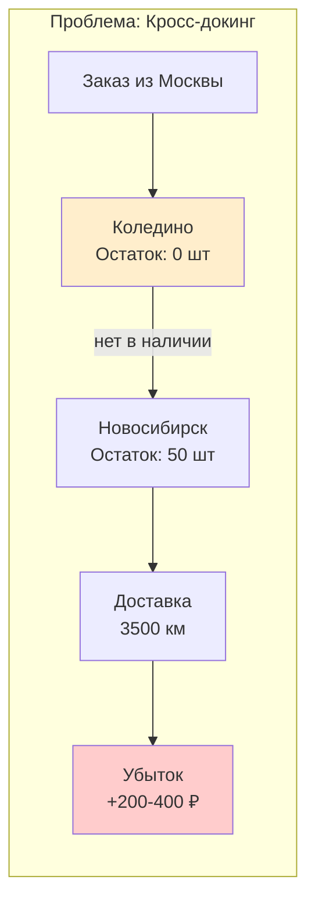
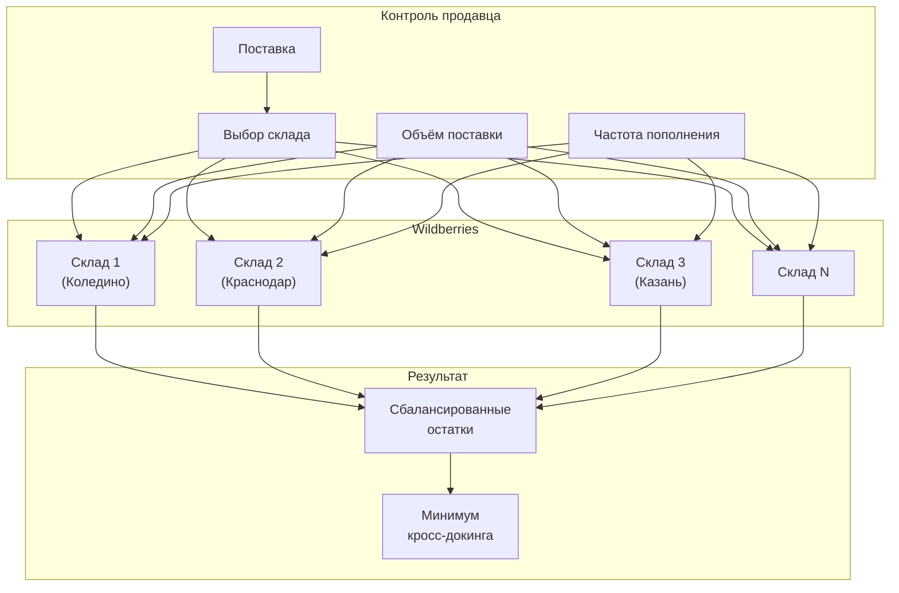
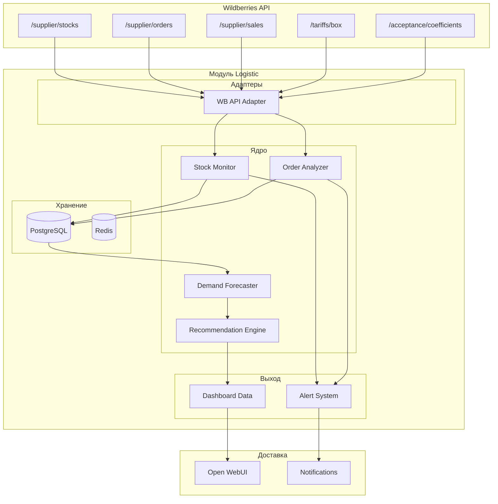
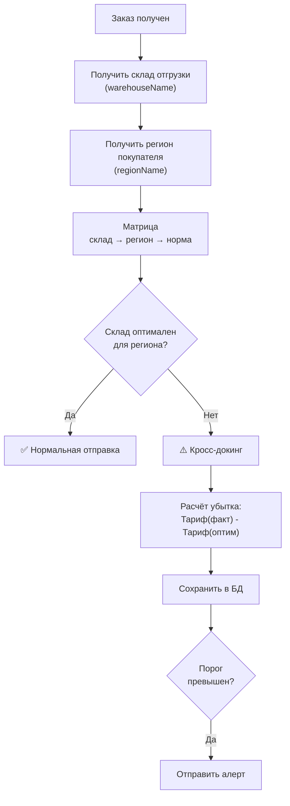

# ADOLF LOGISTIC — Раздел 0: Introduction

**Проект:** Интеллектуальная система управления логистикой маркетплейсов  
**Модуль:** Logistic  
**Версия:** 1.0  
**Дата:** Январь 2026

---

## 0.1 Назначение модуля

### Описание

Logistic — модуль системы ADOLF, предназначенный для оптимизации распределения товаров по складам маркетплейсов и минимизации логистических издержек. Модуль решает критическую проблему кросс-докинга — ситуации, когда товар отправляется покупателю с удалённого склада из-за отсутствия на ближайшем, что приводит к значительным дополнительным затратам.

### Проблематика



| Сценарий | Стоимость логистики | Разница |
|----------|---------------------|---------|
| Отправка с ближайшего склада (Коледино → Москва) | ~50 ₽ | — |
| Кросс-докинг (Новосибирск → Москва) | ~250-450 ₽ | +200-400 ₽ |

При 50 таких заказах в месяц дополнительные издержки составляют **10 000 — 20 000 ₽**.

### Бизнес-цели

| Цель | Описание | Метрика |
|------|----------|---------|
| Минимизация кросс-докинга | Не допускать отправку с удалённых складов | < 5% заказов |
| Снижение логистических издержек | Оптимальное распределение по складам | -30% затрат на логистику |
| Проактивное управление | Алерты до обнуления остатков | За 3-5 дней до проблемы |
| Оптимизация поставок | Рекомендации куда и сколько везти | Автоматический расчёт |

---

## 0.2 Ключевые функции

### Аналитика

| Функция | Описание |
|---------|----------|
| Dashboard остатков | Текущие остатки по всем складам WB в разрезе SKU |
| Отчёт по кросс-докингу | Выявление заказов, отправленных с удалённых складов |
| Расчёт убытков | Сумма дополнительных затрат за период |
| История поставок | Анализ эффективности прошлых поставок |

### Оповещения

| Алерт | Триггер | Приоритет |
|-------|---------|-----------|
| Критический остаток | Остаток < порога на ключевом складе | 🔴 Высокий |
| Прогноз обнуления | Прогноз: остаток = 0 через N дней | 🟡 Средний |
| Кросс-докинг обнаружен | Заказ отправлен с удалённого склада | 🟡 Средний |
| Дисбаланс остатков | Перекос распределения между складами | 🟢 Низкий |

### Рекомендации

| Функция | Описание |
|---------|----------|
| Распределение поставки | Куда и сколько единиц везти |
| Выбор склада | Оптимальный склад с учётом коэффициентов приёмки |
| Приоритизация SKU | Какие товары требуют срочного пополнения |

---

## 0.3 Модель работы

### FBW (Fulfillment by Wildberries)

Модуль ориентирован на продавцов, использующих модель FBW:

- Товар хранится на складах Wildberries
- WB самостоятельно распределяет товар между складами
- Продавец влияет на распределение через выбор склада при поставке

### Рычаги влияния продавца



---

## 0.4 Параметры мониторинга

### Объём данных

| Параметр | Значение |
|----------|----------|
| SKU (артикул + размер) | до 1 000 |
| Склады WB | ~15-20 активных |
| География продаж | Вся Россия (равномерно) |
| Маркетплейс | Wildberries (MVP) |

### Частота обновления

| Данные | Источник | Частота |
|--------|----------|---------|
| Остатки по складам | WB API `/supplier/stocks` | Каждые 30 мин |
| Заказы | WB API `/supplier/orders` | Каждые 30 мин |
| Продажи | WB API `/supplier/sales` | Ежедневно |
| Тарифы логистики | WB API `/tariffs/box` | Еженедельно |
| Коэффициенты приёмки | WB API `/acceptance/coefficients` | При планировании |

---

## 0.5 Архитектура высокого уровня



### Компоненты системы

| Компонент | Назначение |
|-----------|------------|
| **WB API Adapter** | Интеграция с API Wildberries, обработка лимитов |
| **Stock Monitor** | Отслеживание остатков, детекция критических уровней |
| **Order Analyzer** | Анализ заказов, выявление кросс-докинга, расчёт убытков |
| **Demand Forecaster** | Прогноз спроса по регионам на основе истории |
| **Recommendation Engine** | Формирование рекомендаций по поставкам |
| **Alert System** | Генерация и маршрутизация алертов |

---

## 0.6 Ролевая модель

### Матрица доступа

| Функция | Manager | Senior | Director | Admin |
|---------|:-------:|:------:|:--------:|:-----:|
| Просмотр остатков по SKU | ✅ | ✅ | ✅ | ✅ |
| Просмотр алертов | ✅ | ✅ | ✅ | ✅ |
| Отчёт по кросс-докингу | ✅ | ✅ | ✅ | ✅ |
| Рекомендации по поставкам | ✅ | ✅ | ✅ | ✅ |
| Настройка порогов алертов | ❌ | ✅ | ✅ | ✅ |
| Просмотр сводной аналитики | ❌ | ✅ | ✅ | ✅ |
| Настройка параметров прогноза | ❌ | ❌ | ✅ | ✅ |
| Управление интеграцией WB API | ❌ | ❌ | ❌ | ✅ |

### Фильтрация по брендам

| Роль | brand_id | Видимость данных |
|------|----------|------------------|
| Manager | ohana_market | Только данные Охана Маркет |
| Manager | ohana_kids | Только данные Охана Кидс |
| Manager | all | Данные всех брендов |
| Senior+ | — | Данные всех брендов |

---

## 0.7 Интеграции

### Зависимости от ADOLF Core

| Компонент Core | Использование в Logistic |
|----------------|--------------------------|
| Middleware | Авторизация, роутинг API, prompt-инъекция |
| PostgreSQL | Хранение: остатки, заказы, история, алерты |
| Celery | Фоновые задачи: синхронизация, расчёты, алерты |
| Redis | Кэширование, очереди задач |
| Notifications | Алерты о критических остатках, кросс-докинге |
| Open WebUI | Интерфейс пользователя (Pipeline, Tools) |

### Взаимодействие с другими модулями

| Модуль | Направление | Данные |
|--------|-------------|--------|
| **CFO** | Logistic → CFO | Данные о логистических издержках для P&L |
| **Scout** | Scout → Logistic | Прогнозы продаж для планирования |
| **Watcher** | — | Независимые модули |

### Внешние интеграции

| Система | Тип | Назначение |
|---------|-----|------------|
| Wildberries API | REST API | Источник данных об остатках, заказах, тарифах |

---

## 0.8 Пользовательские сценарии (MVP)

### Сценарий 1: Мониторинг остатков

**Запрос:** «Покажи остатки по артикулу OM-12345»

**Ответ:**
```
📦 Остатки OM-12345 (Платье летнее, размер 44)

| Склад | Остаток | Статус |
|-------|---------|--------|
| Коледино | 45 шт | ✅ Норма |
| Краснодар | 12 шт | ⚠️ Низкий |
| Казань | 0 шт | 🔴 Нет |
| Новосибирск | 8 шт | ⚠️ Низкий |

⚠️ Рекомендация: пополнить Казань и Краснодар
```

### Сценарий 2: Отчёт по кросс-докингу

**Запрос:** «Покажи отчёт по кросс-докингу за январь»

**Ответ:**
```
📊 Отчёт по кросс-докингу: Январь 2026

Всего заказов: 1 247
Кросс-докинг: 47 (3.8%)
Дополнительные издержки: 12 400 ₽

Топ-5 проблемных SKU:
1. OM-12345 — 12 случаев, 3 200 ₽
2. OM-67890 — 8 случаев, 2 100 ₽
3. OK-11111 — 7 случаев, 1 850 ₽
...
```

### Сценарий 3: Рекомендация по поставке

**Запрос:** «Сформируй рекомендацию для поставки 500 единиц OM-12345»

**Ответ:**
```
📦 Рекомендация по распределению: OM-12345

Общий объём: 500 шт

| Склад | Рекомендовано | Обоснование |
|-------|---------------|-------------|
| Коледино | 200 шт (40%) | Основной спрос ЦФО |
| Краснодар | 120 шт (24%) | Высокий спрос ЮФО |
| Казань | 100 шт (20%) | Покрытие ПФО |
| Новосибирск | 80 шт (16%) | Покрытие СФО/УФО |

📈 Прогноз: при таком распределении кросс-докинг < 2%

⚠️ Коэффициенты приёмки на сегодня:
- Коледино: 0 (бесплатно) ✅
- Краснодар: 1.5x ⚠️
- Казань: 0 (бесплатно) ✅
- Новосибирск: 2x ⚠️
```

### Сценарий 4: Алерт о критическом остатке

**Автоматическое уведомление:**
```
🔴 АЛЕРТ: Критический остаток

SKU: OM-12345 (Платье летнее, 44)
Склад: Коледино
Текущий остаток: 3 шт
Средние продажи: 8 шт/день
Прогноз обнуления: через 9 часов

⚡ Рекомендуемое действие:
Срочная поставка или перемещение со склада Новосибирск (остаток 45 шт)
```

---

## 0.9 Алгоритм определения кросс-докинга

### Логика выявления



### Матрица оптимальности

| Регион покупателя | Оптимальные склады | Допустимые | Кросс-докинг |
|-------------------|-------------------|------------|--------------|
| Москва, МО | Коледино, Подольск | Тула, Электросталь | Все остальные |
| Санкт-Петербург, ЛО | СПб | — | Все остальные |
| Краснодарский край | Краснодар | — | Все остальные |
| Татарстан | Казань | — | Все остальные |
| Новосибирская обл. | Новосибирск | — | Все остальные |
| ... | ... | ... | ... |

---

## 0.10 Разграничение MVP и v2.0

### MVP (v1.0)

| Функция | Статус |
|---------|:------:|
| Мониторинг остатков по складам WB | ✅ |
| Выявление кросс-докинга в заказах | ✅ |
| Расчёт дополнительных издержек | ✅ |
| Алерты о критических остатках | ✅ |
| Базовые рекомендации по распределению | ✅ |
| История поставок и их эффективность | ✅ |
| Dashboard в Open WebUI | ✅ |
| Интеграция только с Wildberries | ✅ |

### v2.0

| Функция | Статус |
|---------|:------:|
| ML-прогнозирование спроса | 🔜 |
| Учёт сезонности в рекомендациях | 🔜 |
| Интеграция с Ozon, Yandex.Market | 🔜 |
| Автоматическое создание заявок на поставку | 🔜 |
| Оптимизация с учётом стоимости хранения | 🔜 |
| A/B тестирование стратегий распределения | 🔜 |
| Push-уведомления (Telegram) | 🔜 |

---

## 0.11 Технологический стек

### Серверная часть

| Компонент | Технология |
|-----------|------------|
| API | FastAPI (Python 3.11) |
| База данных | PostgreSQL 15 |
| Кэш/Очереди | Redis |
| Фоновые задачи | Celery |
| AI (прогнозы v2.0) | GPT-5 mini / Claude Opus 4.5 |

### Интеграции

| API | Домен | Назначение |
|-----|-------|------------|
| Statistics API | statistics-api.wildberries.ru | Остатки, заказы, продажи |
| Common API | common-api.wildberries.ru | Тарифы |
| Supplies API | supplies-api.wildberries.ru | Коэффициенты приёмки |

---

## 0.12 Структура документации

| Раздел | Содержание |
|--------|------------|
| **0. Introduction** | Обзор, цели, scope (этот документ) |
| **1. Architecture** | Компоненты, потоки данных, интеграции |
| **2. WB Integration** | API Wildberries: endpoints, адаптеры, лимиты |
| **3. Stock Monitor** | Мониторинг остатков, пороги, алерты |
| **4. Order Analyzer** | Анализ заказов, детекция кросс-докинга |
| **5. Recommendation Engine** | Алгоритмы рекомендаций, прогнозирование |
| **6. Database** | Схема базы данных |
| **7. Open WebUI** | Pipeline, Tools, интерфейс |
| **8. Celery** | Фоновые задачи |

---

## 0.13 Метрики успеха

| Метрика | Текущее | Целевое (3 мес.) | Целевое (6 мес.) |
|---------|---------|------------------|------------------|
| Доля кросс-докинга | ~10-15% | < 5% | < 3% |
| Дополнительные издержки | ~15-20K ₽/мес | < 7K ₽/мес | < 4K ₽/мес |
| Время реакции на алерт | — | < 4 часов | < 2 часов |
| Точность прогноза (v2.0) | — | — | > 80% |

---

## 0.14 Быстрый старт

### Для менеджера

1. Откройте Open WebUI
2. Выберите Pipeline `@Adolf_Logistic`
3. Напишите: «Покажи остатки по артикулу OM-12345»
4. Для отчёта: «Отчёт по кросс-докингу за январь»
5. Для рекомендаций: «Рекомендация по поставке 500 шт OM-12345»

### Для администратора

1. Настройте API-ключ Wildberries в конфигурации
2. Запустите начальную синхронизацию остатков
3. Настройте пороги алертов (по умолчанию: 10 шт)
4. Проверьте корректность матрицы склад-регион
5. Настройте получателей алертов по ролям

---

## 0.15 Контакты и ответственные

| Область | Ответственный |
|---------|---------------|
| Техническая поддержка | Administrator |
| Настройка интеграции WB | Administrator |
| Настройка порогов | Senior+ |
| Анализ рекомендаций | Manager+ |

---

**Документ подготовлен:** Январь 2026  
**Версия:** 1.0  
**Статус:** Черновик
