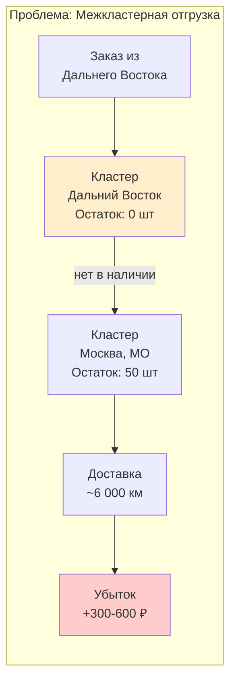
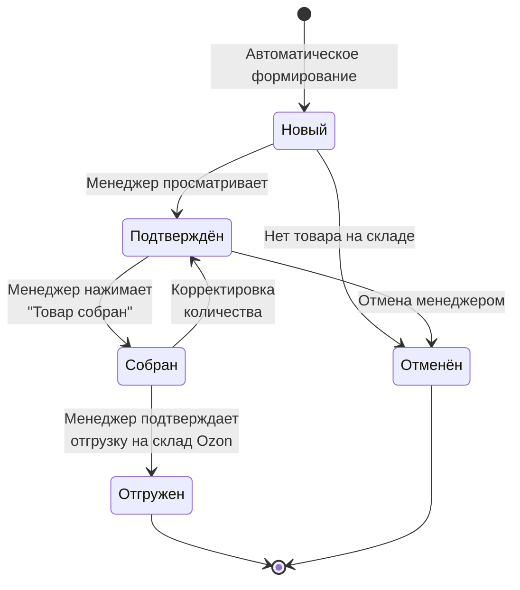
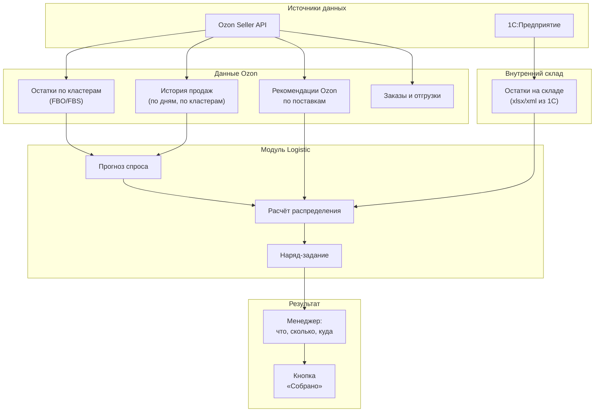
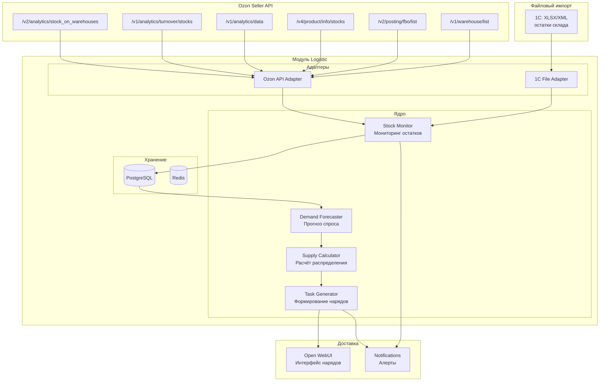
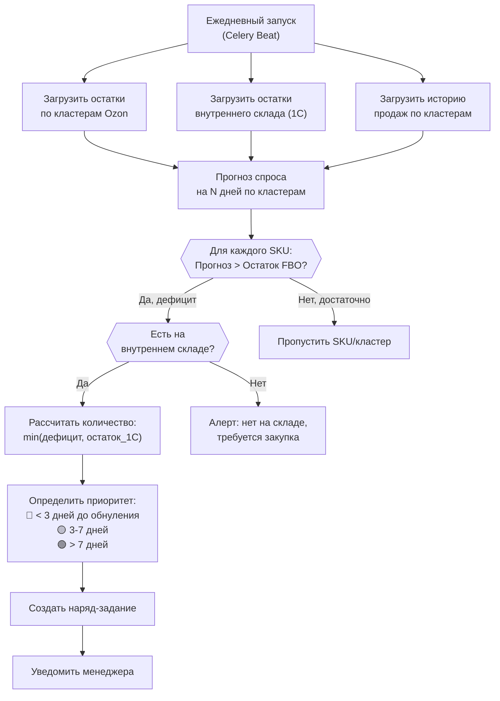

# ADOLF LOGISTIC — Раздел 0: Introduction

**Проект:** Интеллектуальная система управления логистикой маркетплейсов  
**Модуль:** Logistic  
**Версия:** 2.0  
**Дата:** Февраль 2026  
**Заменяет:** adolf_logistic_0_introduction_v1_0.md

---

## 0.1 Назначение модуля

### Описание

Logistic — модуль системы ADOLF, предназначенный для оптимизации распределения товаров по кластерам/складам Ozon и минимизации логистических издержек, вызванных межкластерной отгрузкой. Основной артефакт модуля — **наряд-задание** для менеджера: что, сколько и на какой кластер отгрузить сегодня.

### Проблематика



| Сценарий | Стоимость логистики | Разница |
|----------|---------------------|---------|
| Отправка с ближайшего кластера (Дальний Восток → Владивосток) | ~80 ₽ | — |
| Межкластерная (Москва → Владивосток) | ~400-700 ₽ | +300-600 ₽ |

При 50 таких заказах в месяц дополнительные издержки составляют **15 000 — 30 000 ₽**.

### Бизнес-цели

| Цель | Описание | Метрика |
|------|----------|---------|
| Минимизация межкластерной отгрузки | Не допускать отправку с удалённых кластеров | < 5% заказов |
| Снижение логистических издержек | Оптимальное распределение по кластерам | -30% затрат на логистику |
| Проактивное управление | Наряд-задания до обнуления остатков | За 3-7 дней до проблемы |
| Прогнозирование спроса | Учёт истории и трендов при формировании нарядов | Точность > 75% |
| Учёт реального наличия | Формирование нарядов на основе остатков внутреннего склада (1С) | 100% проверка наличия |

---

## 0.2 Ключевые функции

### Наряд-задание (основной артефакт)

| Поле | Описание |
|------|----------|
| SKU / Артикул | Идентификатор товара |
| Название товара | Человекочитаемое наименование |
| Целевой кластер | Куда отгружать (напр. «Дальний Восток») |
| Количество, шт | Расчётное количество для отгрузки |
| Приоритет | 🔴 Срочно / 🟡 Плановый / 🟢 Рекомендуемый |
| Обоснование | Прогноз спроса, текущий остаток, дней до обнуления |
| Статус | Новый → Подтверждён → Собран → Отгружен |

**Workflow наряд-задания:**



### Аналитика

| Функция | Описание |
|---------|----------|
| Dashboard остатков | Текущие остатки FBO по кластерам Ozon в разрезе SKU |
| Отчёт по межкластерным отгрузкам | Выявление потенциальных убытков от неоптимальной логистики |
| Расчёт убытков | Сумма дополнительных затрат за период |
| Прогноз спроса | Прогнозирование продаж по кластерам на основе истории |

### Оповещения

| Алерт | Триггер | Приоритет |
|-------|---------|-----------|
| Критический остаток | Остаток < порога на кластере | 🔴 Высокий |
| Прогноз обнуления | Прогноз: остаток = 0 через N дней | 🟡 Средний |
| Дисбаланс остатков | Перекос распределения между кластерами | 🟢 Низкий |
| Наряд-задание сформировано | Новый наряд ожидает подтверждения | 🟡 Средний |

---

## 0.3 Модель работы

### FBO (Fulfillment by Ozon)

Модуль ориентирован на продавцов, использующих модель FBO:

- Товар хранится на складах Ozon, сгруппированных в **кластеры**
- Ozon самостоятельно распределяет товар внутри кластера
- Продавец влияет на распределение через выбор кластера при поставке
- При отсутствии товара на ближайшем кластере Ozon отгружает с другого (межкластерная отгрузка за счёт продавца)

### Кластеры Ozon

Ozon оперирует **кластерами** — логическими группами складов, объединёнными по географическому принципу:

| Группа | Кластеры |
|--------|----------|
| Центр | Москва МО и Дальние регионы, Тверь, Ярославль |
| Северо-Запад | Санкт-Петербург и СЗО, Калининград |
| Юг | Краснодар, Невинномысск, Ростов, Махачкала |
| Поволжье | Казань, Самара, Саратов, Оренбург, Уфа |
| Урал | Екатеринбург, Пермь, Тюмень |
| Сибирь | Новосибирск, Красноярск, Омск |
| Восток | Дальний Восток |
| Центр. Россия | Воронеж |
| СНГ | Беларусь, Казахстан (Алматы, Астана), Кыргызстан, Узбекистан, Армения, Азербайджан, Грузия |

> **Примечание:** Полный список из 31 кластера. Перечень может изменяться Ozon.

### Источники данных



---

## 0.4 Интеграция с 1С

### Файловый обмен

| Параметр | Значение |
|----------|----------|
| Источник | 1С:Предприятие (выгрузка остатков) |
| Формат | XLSX или XML |
| Способ доставки | Общая сетевая папка / SFTP / загрузка в Open WebUI |
| Расписание | По расписанию (настраивается, рекомендуется 1-2 раза в день) |
| Содержание | Артикул, наименование, остаток на внутреннем складе |

### Ожидаемая структура файла 1С

| Поле | Тип | Описание |
|------|-----|----------|
| Артикул | string | Внутренний артикул товара (маппинг с Ozon SKU) |
| Наименование | string | Название товара |
| Остаток | int | Количество на внутреннем складе |
| Единица | string | Единица измерения (шт) |

> **MVP:** Файловый обмен. В v2.0 — прямая интеграция через REST API 1С.

---

## 0.5 Параметры мониторинга

### Объём данных

| Параметр | Значение |
|----------|----------|
| SKU (артикул + размер) | ~2 400 |
| Кластеры Ozon | 31 |
| Схемы продаж | FBO (MVP), FBS (v2.0) |
| География продаж | Россия + СНГ |
| Маркетплейс | Ozon (MVP), Wildberries (v2.0) |

### Частота обновления

| Данные | Источник | Частота |
|--------|----------|---------|
| Остатки FBO по кластерам | Ozon API `/v2/analytics/stock_on_warehouses` | Каждые 30 мин |
| Оборачиваемость | Ozon API `/v1/analytics/turnover/stocks` | Ежедневно |
| Аналитика продаж | Ozon API `/v1/analytics/data` | Ежедневно |
| Остатки по товарам | Ozon API `/v4/product/info/stocks` | Каждые 30 мин |
| FBO-заказы | Ozon API `/v2/posting/fbo/list` | Каждые 30 мин |
| Список складов | Ozon API `/v1/warehouse/list` | Еженедельно |
| Остатки внутреннего склада | 1С (файловый обмен XLSX/XML) | 1-2 раза в день |

---

## 0.6 Архитектура высокого уровня



### Компоненты системы

| Компонент | Назначение |
|-----------|------------|
| **Ozon API Adapter** | Интеграция с Ozon Seller API, обработка лимитов и пагинации |
| **1С File Adapter** | Парсинг XLSX/XML файлов с остатками внутреннего склада |
| **Stock Monitor** | Отслеживание остатков FBO по кластерам, детекция критических уровней |
| **Demand Forecaster** | Прогноз спроса по кластерам на основе истории продаж |
| **Supply Calculator** | Расчёт оптимального распределения с учётом наличия на внутреннем складе |
| **Task Generator** | Формирование наряд-заданий для менеджеров |

---

## 0.7 Алгоритм формирования наряд-задания

### Логика



### Формула расчёта

```
Дефицит(SKU, Кластер) = Прогноз_продаж(N дней) - Текущий_остаток_FBO - Товары_в_пути

Если Дефицит > 0:
    Отгрузка = min(Дефицит × Коэфф_запаса, Остаток_1С)
    
    Приоритет:
      🔴 Срочно     — дней до обнуления < 3
      🟡 Плановый   — дней до обнуления 3-7
      🟢 Рекомендуемый — дней до обнуления > 7
```

---

## 0.8 Ролевая модель

### Матрица доступа

| Функция | Manager | Senior | Director | Admin |
|---------|:-------:|:------:|:--------:|:-----:|
| Просмотр наряд-заданий | ✅ | ✅ | ✅ | ✅ |
| Подтверждение «Собрано» | ✅ | ✅ | ✅ | ✅ |
| Подтверждение «Отгружено» | ✅ | ✅ | ✅ | ✅ |
| Просмотр остатков по кластерам | ✅ | ✅ | ✅ | ✅ |
| Просмотр алертов | ✅ | ✅ | ✅ | ✅ |
| Настройка порогов алертов | ❌ | ✅ | ✅ | ✅ |
| Просмотр сводной аналитики | ❌ | ✅ | ✅ | ✅ |
| Настройка параметров прогноза | ❌ | ❌ | ✅ | ✅ |
| Управление интеграцией Ozon API | ❌ | ❌ | ❌ | ✅ |
| Настройка импорта 1С | ❌ | ❌ | ❌ | ✅ |

### Фильтрация по брендам

| Роль | brand_id | Видимость данных |
|------|----------|------------------|
| Manager | ohana_market | Только данные Охана Маркет |
| Manager | ohana_kids | Только данные Охана Кидс |
| Manager | all | Данные всех брендов |
| Senior+ | — | Данные всех брендов |

---

## 0.9 Пользовательские сценарии (MVP)

### Сценарий 1: Просмотр наряд-задания

**Запрос:** «Покажи наряд-задания на сегодня»

**Ответ:**
```
📋 Наряд-задания на 06.02.2026

🔴 СРОЧНО (3 позиции):

| SKU | Артикул | Название | Кластер | Кол-во | Обнуление через |
|-----|---------|----------|---------|--------|-----------------|
| 924771727 | 51005/54 | Шорты Стильно и модно | Дальний Восток | 68 шт | 0 дней |
| 924771727 | 51005/54 | Шорты Стильно и модно | Москва, МО | 45 шт | 1 день |
| 2804779750 | 66100/50 | Утепленные брюки муж | Краснодар | 30 шт | 2 дня |

🟡 ПЛАНОВЫЙ (5 позиций):
...

🟢 РЕКОМЕНДУЕМЫЙ (12 позиций):
...

Всего: 20 позиций | На складе 1С: достаточно для 18 из 20
```

### Сценарий 2: Подтверждение сборки

**Запрос:** Менеджер нажимает кнопку «✅ Собрано» на наряд-задании

**Ответ:**
```
✅ Наряд #2026-02-06-003 подтверждён

Товар: Шорты Стильно и модно (51005/54)
Кластер: Дальний Восток  
Количество: 68 шт
Статус: Собрано → Готово к отгрузке

⏳ Подтвердите отгрузку после передачи на склад Ozon
```

### Сценарий 3: Просмотр остатков по кластерам

**Запрос:** «Покажи остатки по артикулу 51005/54»

**Ответ:**
```
📦 Остатки 51005/54 (Шорты Стильно и модно)

| Кластер | FBO | Ср.продажи/день | Дней до обнуления | Статус |
|---------|-----|-----------------|-------------------|--------|
| Москва, МО | 12 шт | 5.2 шт | 2 дня | 🔴 Критический |
| Краснодар | 45 шт | 3.1 шт | 14 дней | ✅ Норма |
| Казань | 8 шт | 2.0 шт | 4 дня | 🟡 Низкий |
| Дальний Восток | 0 шт | 2.4 шт | 0 дней | 🔴 Нет |
| Новосибирск | 22 шт | 1.8 шт | 12 дней | ✅ Норма |
| ... | ... | ... | ... | ... |

📦 Остаток на внутреннем складе (1С): 340 шт
```

### Сценарий 4: Алерт о формировании наряда

**Автоматическое уведомление:**
```
📋 Сформировано новое наряд-задание

Дата: 06.02.2026
Позиций: 20
  🔴 Срочных: 3
  🟡 Плановых: 5
  🟢 Рекомендуемых: 12

Общее количество к отгрузке: 847 шт
На внутреннем складе: достаточно для 756 шт

⚡ Откройте @Adolf_Logistic для просмотра
```

---

## 0.10 Разграничение MVP и v2.0

### MVP (v1.0)

| Функция | Статус |
|---------|:------:|
| Мониторинг остатков FBO по кластерам Ozon | ✅ |
| Прогнозирование спроса по кластерам | ✅ |
| Импорт остатков внутреннего склада из 1С (XLSX/XML) | ✅ |
| Формирование наряд-заданий | ✅ |
| Кнопка подтверждения «Собрано / Отгружено» | ✅ |
| Алерты о критических остатках | ✅ |
| Dashboard остатков в Open WebUI | ✅ |
| Интеграция только с Ozon | ✅ |

### v2.0

| Функция | Статус |
|---------|:------:|
| Интеграция с Wildberries | 🔜 |
| Прямая интеграция с 1С через REST API | 🔜 |
| ML-прогнозирование спроса (сезонность, тренды) | 🔜 |
| Учёт коэффициентов приёмки складов | 🔜 |
| Автоматическое создание заявок на поставку в Ozon | 🔜 |
| Оптимизация с учётом стоимости хранения | 🔜 |
| FBS-схема (Fulfillment by Seller) | 🔜 |
| Push-уведомления (Telegram) | 🔜 |
| Интеграция с CFO (логистические издержки) | 🔜 |

---

## 0.11 Технологический стек

### Серверная часть

| Компонент | Технология |
|-----------|------------|
| API | FastAPI (Python 3.11) |
| База данных | PostgreSQL 15 |
| Кэш/Очереди | Redis |
| Фоновые задачи | Celery |
| AI (прогноз спроса) | GPT-5 mini / Claude Opus 4.5 |

### Интеграции

| Система | Тип | Назначение |
|---------|-----|------------|
| Ozon Seller API | REST API | Остатки, аналитика, заказы |
| 1С:Предприятие | Файловый обмен (XLSX/XML) | Остатки внутреннего склада |

### Ozon Seller API — используемые endpoints

| Endpoint | Method | Назначение |
|----------|--------|------------|
| `/v2/analytics/stock_on_warehouses` | POST | Остатки и движение на складах Ozon |
| `/v1/analytics/turnover/stocks` | POST | Оборачиваемость товара, дней до обнуления |
| `/v1/analytics/data` | POST | Аналитика продаж (воронка, среднесуточные) |
| `/v4/product/info/stocks` | POST | Остатки по товарам (FBO/FBS) |
| `/v2/posting/fbo/list` | POST | Список FBO-заказов |
| `/v1/warehouse/list` | POST | Список складов/кластеров продавца |
| `/v1/report/warehouse/stock` | POST | Отчёт по складским остаткам |

---

## 0.12 Интеграции

### Зависимости от ADOLF Core

| Компонент Core | Использование в Logistic |
|----------------|--------------------------|
| Middleware | Авторизация, роутинг API, prompt-инъекция |
| PostgreSQL | Хранение: остатки, наряды, история, алерты |
| Celery | Фоновые задачи: синхронизация, прогнозы, генерация нарядов |
| Redis | Кэширование, очереди задач |
| Notifications | Алерты о критических остатках, новые наряд-задания |
| Open WebUI | Интерфейс пользователя (Pipeline, Tools) |

### Взаимодействие с другими модулями

| Модуль | Направление | Данные |
|--------|-------------|--------|
| **CFO** | Logistic → CFO | Данные о логистических издержках для P&L |
| **Scout** | Scout → Logistic | Прогнозы продаж для планирования |

### Внешние интеграции

| Система | Тип | Назначение |
|---------|-----|------------|
| Ozon Seller API | REST API | Источник данных об остатках, заказах, аналитике |
| 1С:Предприятие | Файловый обмен | Источник данных об остатках внутреннего склада |

---

## 0.13 Структура документации

| Раздел | Содержание |
|--------|------------|
| **0. Introduction** | Обзор, цели, scope (этот документ) |
| **1. Architecture** | Компоненты, потоки данных, интеграции |
| **2. Ozon Integration** | Ozon Seller API: endpoints, адаптеры, лимиты |
| **3. Stock Monitor** | Мониторинг остатков, пороги, алерты |
| **4. Supply Task Engine** | Формирование наряд-заданий, прогнозирование |
| **5. 1С Integration** | Файловый импорт, маппинг, валидация |
| **6. Database** | Схема базы данных |
| **7. Open WebUI** | Pipeline, Tools, интерфейс |
| **8. Celery** | Фоновые задачи |

---

## 0.14 Метрики успеха

| Метрика | Текущее | Целевое (3 мес.) | Целевое (6 мес.) |
|---------|---------|------------------|------------------|
| Доля межкластерных отгрузок | ~10-15% | < 5% | < 3% |
| Дополнительные издержки | ~20-30K ₽/мес | < 10K ₽/мес | < 5K ₽/мес |
| Время реакции на наряд | — | < 4 часов | < 2 часов |
| Точность прогноза спроса | — | > 70% | > 80% |
| Покрытие кластеров | — | ТОП-10 | Все 31 |

---

## 0.15 Быстрый старт

### Для менеджера

1. Откройте Open WebUI
2. Выберите Pipeline `@Adolf_Logistic`
3. Проверьте: «Покажи наряд-задания на сегодня»
4. Просмотрите список, подтвердите кнопкой «✅ Собрано»
5. После передачи на склад Ozon — «✅ Отгружено»
6. Для аналитики: «Остатки по артикулу 51005/54»

### Для администратора

1. Настройте Ozon API-ключ (Client-Id + Api-Key) в конфигурации
2. Настройте импорт файлов 1С (путь, расписание)
3. Запустите начальную синхронизацию остатков
4. Настройте пороги алертов (по умолчанию: 10 шт / 3 дня)
5. Настройте получателей алертов и наряд-заданий по ролям

---

## 0.16 Контакты и ответственные

| Область | Ответственный |
|---------|---------------|
| Техническая поддержка | Administrator |
| Настройка интеграции Ozon | Administrator |
| Настройка импорта 1С | Administrator |
| Настройка порогов | Senior+ |
| Работа с наряд-заданиями | Manager+ |

---

**Документ подготовлен:** Февраль 2026  
**Версия:** 2.0  
**Статус:** Черновик  
**Заменяет:** adolf_logistic_0_introduction_v1_0.md
