**Проект:** Интеллектуальная система управления логистикой маркетплейсов  
**Модуль:** Logistic / Architecture  
**Версия:** 2.1  
**Дата:** Февраль 2026  
**Заменяет:** Раздел 1 v2.0

---

## 1.1 Обзор архитектуры

### Принципы проектирования

| Принцип | Описание |
|---------|----------|
| **Модульность** | Независимые компоненты с чёткими интерфейсами |
| **Отказоустойчивость** | Graceful degradation при недоступности Ozon API или файла 1С |
| **Кэширование** | Минимизация запросов к API через Redis |
| **Асинхронность** | Фоновая синхронизация через Celery |
| **Dual-source** | Два независимых источника данных: Ozon API + PostgreSQL `1C_*` таблицы (из 1С) |
| **Расширяемость** | Подготовка к Wildberries / Yandex.Market в v2.0 |

### Архитектурная диаграмма

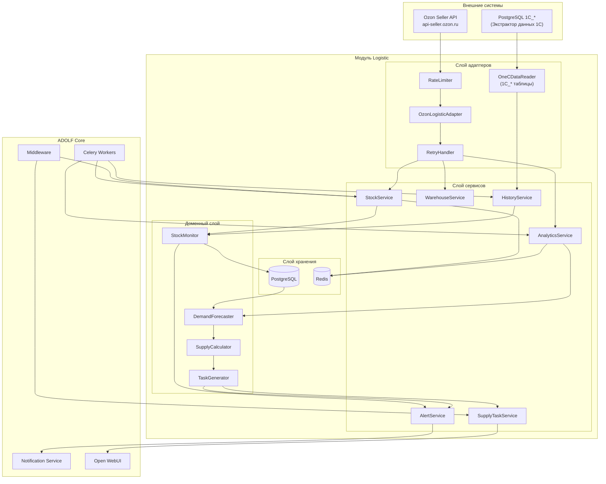

---

## 1.2 Компоненты системы

### Слой адаптеров

| Компонент | Назначение | Технология |
|-----------|------------|------------|
| **OzonLogisticAdapter** | Единая точка интеграции с Ozon Seller API | aiohttp |
| **OneCDataReader** | Чтение данных из 1C_* таблиц PostgreSQL | SQL |
| **RateLimiter** | Контроль частоты запросов к Ozon API | Redis + asyncio |
| **RetryHandler** | Повторные попытки при ошибках | tenacity |

### Слой сервисов

| Сервис | Назначение | Входные данные | Выходные данные |
|--------|------------|----------------|-----------------|
| **StockService** | Получение и кэширование остатков FBO по кластерам | Ozon API | ClusterStock[] |
| **AnalyticsService** | Получение аналитики продаж и оборачиваемости | Ozon API | SalesData[], Turnover[] |
| **WarehouseService** | Управление списком кластеров/складов | Ozon API | Warehouse[] |
| **SupplyTaskService** | CRUD наряд-заданий, workflow статусов | Domain models | SupplyTask[] |
| **AlertService** | Генерация и отправка алертов | Domain events | Alert[] |
| **HistoryService** | Синхронизация и история остатков из 1C_* | OneCDataReader | WarehouseStock[] |

### Доменный слой

| Компонент | Назначение | Логика |
|-----------|------------|--------|
| **StockMonitor** | Отслеживание уровня остатков по кластерам | Сравнение с порогами, расчёт дней до обнуления |
| **DemandForecaster** | Прогноз спроса по кластерам | Weighted moving average, тренды, сезонность |
| **SupplyCalculator** | Расчёт оптимального распределения | Дефицит = Прогноз − Остаток FBO − В пути |
| **TaskGenerator** | Формирование наряд-заданий | Приоритизация, проверка наличия на складе 1С |

---

## 1.3 Потоки данных

### Поток 1: Синхронизация остатков Ozon

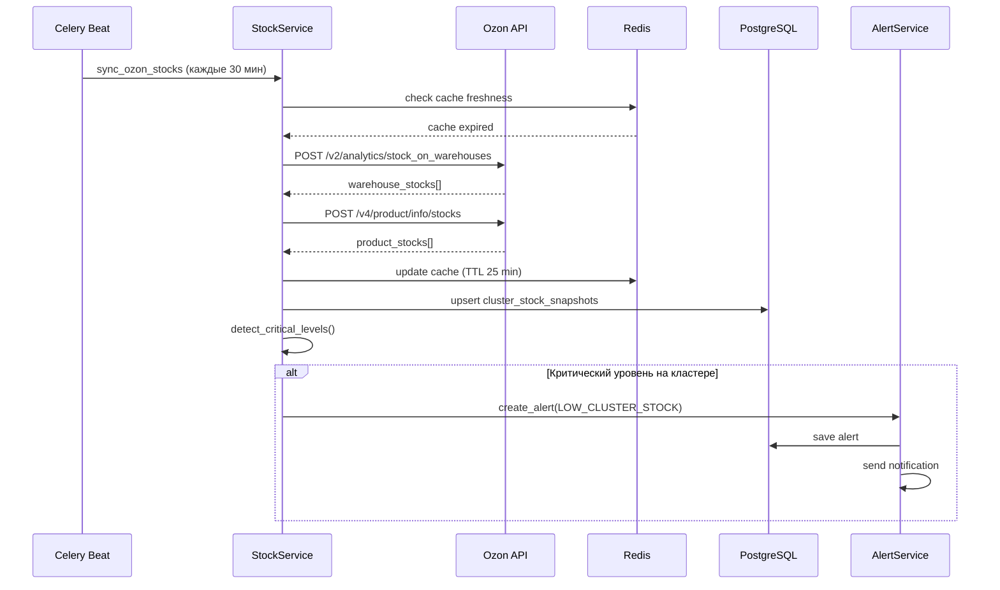

### Поток 2: Синхронизация остатков из 1C_*

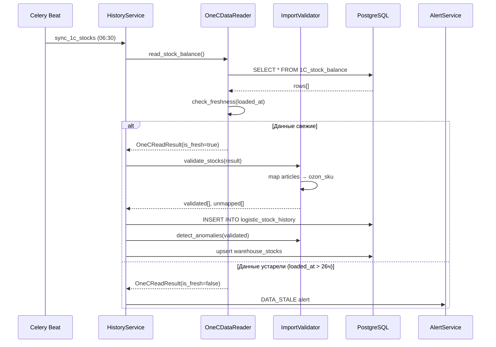

### Поток 3: Формирование наряд-заданий

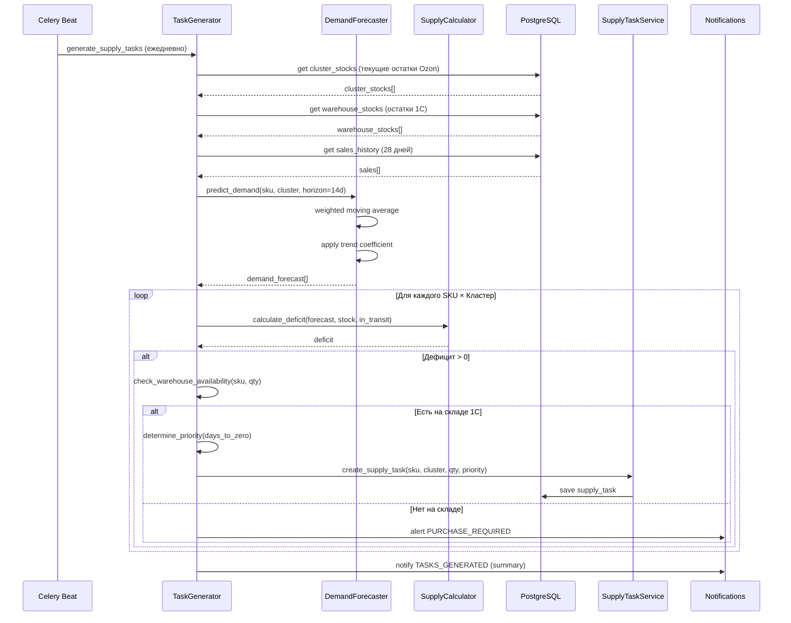

### Поток 4: Workflow наряд-задания

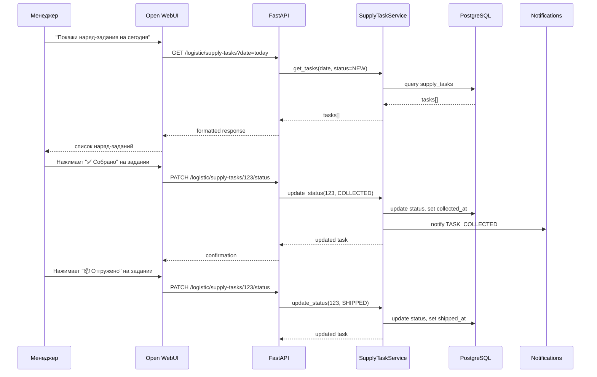

---

## 1.4 Интеграция с ADOLF Core

### Используемые компоненты Core

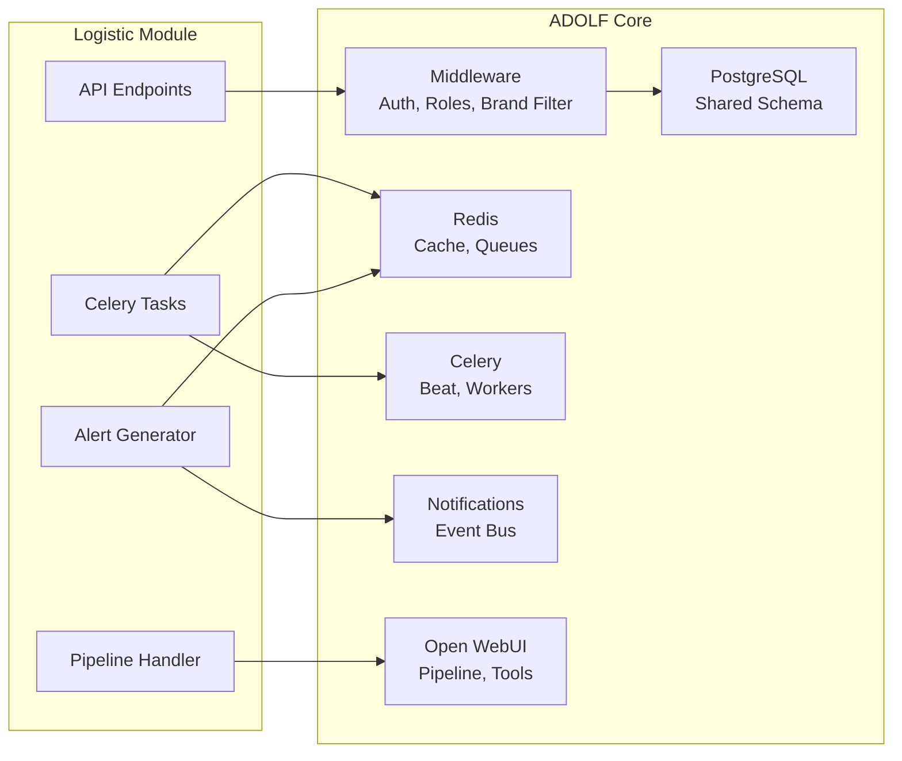

### Middleware интеграция

| Middleware | Использование |
|------------|---------------|
| `AuthMiddleware` | Валидация JWT/API Key |
| `RoleMiddleware` | Проверка прав доступа |
| `BrandFilterMiddleware` | Фильтрация данных по brand_id |
| `PromptInjectionMiddleware` | Добавление контекста для AI |

### Shared PostgreSQL схема

Модуль Logistic использует:
- **Собственные таблицы** с префиксом `logistic_*`
- **Общие таблицы** Core: `users`, `brands`, `notifications`
- **FK связи** с другими модулями минимизированы

---

## 1.5 Структура кодовой базы

```
adolf/
├── modules/
│   └── logistic/
│       ├── __init__.py
│       ├── config.py                 # Конфигурация модуля
│       │
│       ├── adapters/                 # Слой адаптеров
│       │   ├── __init__.py
│       │   ├── ozon_adapter.py       # OzonLogisticAdapter
│       │   ├── 1c_data_reader.py    # OneCDataReader (1C_* таблицы)
│       │   ├── rate_limiter.py       # RateLimiter
│       │   └── retry_handler.py      # RetryHandler
│       │
│       ├── services/                 # Слой сервисов
│       │   ├── __init__.py
│       │   ├── stock_service.py      # StockService
│       │   ├── analytics_service.py  # AnalyticsService
│       │   ├── warehouse_service.py  # WarehouseService
│       │   ├── supply_task_service.py # SupplyTaskService
│       │   ├── alert_service.py      # AlertService
│       │   └── import_service.py     # ImportService (1С)
│       │
│       ├── domain/                   # Доменный слой
│       │   ├── __init__.py
│       │   ├── models.py             # Pydantic models
│       │   ├── stock_monitor.py      # StockMonitor
│       │   ├── demand_forecaster.py  # DemandForecaster
│       │   ├── supply_calculator.py  # SupplyCalculator
│       │   └── task_generator.py     # TaskGenerator
│       │
│       ├── api/                      # FastAPI endpoints
│       │   ├── __init__.py
│       │   ├── router.py             # Main router
│       │   ├── stocks.py             # /stocks endpoints
│       │   ├── supply_tasks.py       # /supply-tasks endpoints
│       │   ├── analytics.py          # /analytics endpoints
│       │   ├── imports.py            # /imports endpoints
│       │   ├── alerts.py             # /alerts endpoints
│       │   └── schemas.py            # Request/Response schemas
│       │
│       ├── tasks/                    # Celery tasks
│       │   ├── __init__.py
│       │   ├── sync_ozon_stocks.py   # Синхронизация остатков Ozon
│       │   ├── sync_ozon_analytics.py # Синхронизация аналитики
│       │   ├── sync_1c_stocks.py    # Синхронизация 1C_*
│       │   ├── generate_supply_tasks.py # Генерация наряд-заданий
│       │   └── generate_alerts.py    # Генерация алертов
│       │
│       ├── db/                       # Database
│       │   ├── __init__.py
│       │   ├── models.py             # SQLAlchemy models
│       │   └── repositories.py       # Data access
│       │
│       └── owui/                     # Open WebUI integration
│           ├── __init__.py
│           ├── pipeline.py           # Pipeline handler
│           └── tools.py              # Function tools
```

---

## 1.6 Конфигурация

### Переменные окружения

```python
# config.py
from pydantic_settings import BaseSettings
from pathlib import Path

class LogisticSettings(BaseSettings):
    """Настройки модуля Logistic."""
    
    # Ozon API
    ozon_client_id: str
    ozon_api_key: str
    ozon_api_url: str = "https://api-seller.ozon.ru"
    
    # 1C_* синхронизация
    1c_freshness_threshold_hours: int = 26
    1c_sync_schedule_cron: str = "30 6 * * *"  # 06:30
    
    # Rate limits (requests per second)
    ozon_rps: int = 5  # Ozon default
    
    # Sync intervals (minutes)
    sync_stocks_interval: int = 30
    sync_analytics_interval: int = 1440  # daily
    sync_warehouses_interval: int = 10080  # weekly
    
    # Alert thresholds
    critical_days_threshold: int = 3      # дней до обнуления
    warning_days_threshold: int = 7
    min_stock_threshold: int = 5          # минимальный остаток шт
    
    # Forecast settings
    forecast_window_days: int = 28        # окно анализа
    forecast_horizon_days: int = 14       # горизонт прогноза
    forecast_safety_factor: float = 1.2   # коэффициент запаса
    
    # Supply task settings
    task_generation_cron: str = "0 7 * * *"  # ежедневно в 07:00
    task_auto_cancel_hours: int = 48      # автоотмена неподтверждённых
    
    # Cache TTL (seconds)
    cache_stocks_ttl: int = 1500      # 25 min
    cache_analytics_ttl: int = 3600   # 1 hour
    cache_warehouses_ttl: int = 604800  # 7 days
    
    class Config:
        env_prefix = "LOGISTIC_"
```

### Пример .env

```bash
# Ozon API
LOGISTIC_OZON_CLIENT_ID=your_client_id
LOGISTIC_OZON_API_KEY=your_api_key

# 1С Import
LOGISTIC_IMPORT_1C_PATH=/data/imports/1c
LOGISTIC_IMPORT_1C_SCHEDULE_CRON=0 8,14 * * *

# Thresholds
LOGISTIC_CRITICAL_DAYS_THRESHOLD=3
LOGISTIC_WARNING_DAYS_THRESHOLD=7
LOGISTIC_MIN_STOCK_THRESHOLD=5

# Forecast
LOGISTIC_FORECAST_WINDOW_DAYS=28
LOGISTIC_FORECAST_SAFETY_FACTOR=1.2
```

---

## 1.7 Кэширование

### Стратегия кэширования

| Данные | Хранилище | TTL | Ключ Redis |
|--------|-----------|-----|------------|
| Остатки FBO по кластерам | Redis | 25 мин | `logistic:ozon:stocks:{date}` |
| Аналитика продаж | Redis | 1 час | `logistic:ozon:analytics:{date}` |
| Оборачиваемость | Redis | 1 час | `logistic:ozon:turnover:{date}` |
| Список кластеров | Redis | 7 дней | `logistic:ozon:warehouses` |
| Остатки 1С | Redis | до след. sync | `logistic:brain:stocks:latest` |

### Структура кэша остатков по кластерам

```python
# Redis key: logistic:ozon:stocks:2026-02-06
{
    "updated_at": "2026-02-06T10:30:00Z",
    "source": "ozon_api",
    "clusters": [
        {
            "cluster_name": "Москва, МО и Дальние регионы",
            "items": [
                {
                    "sku": 924771727,
                    "article": "51005/54",
                    "product_name": "Шорты Ohana market Стильно и модно",
                    "fbo_stock": 12,
                    "fbs_stock": 0,
                    "in_transit": 0,
                    "avg_daily_sales": 5.2,
                    "days_to_zero": 2
                }
            ]
        }
    ]
}
```

### Структура кэша остатков 1С

```python
# Redis key: logistic:1c:stocks:imp_20260206_0800
{
    "import_id": "imp_20260206_0800",
    "imported_at": "2026-02-06T08:00:00Z",
    "source": "1C_stock_balance",
    "items": [
        {
            "article": "51005/54",
            "product_name": "Шорты Стильно и модно",
            "warehouse_stock": 340,
            "unit": "шт"
        }
    ]
}
```

### Cache-aside pattern

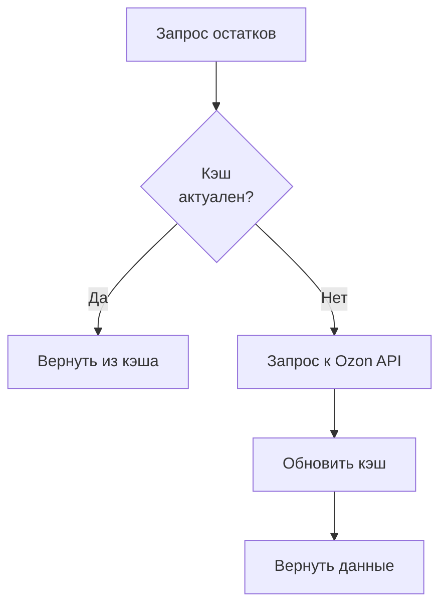

---

## 1.8 Обработка ошибок

### Типы ошибок

| Ошибка | Источник | Код | Обработка |
|--------|----------|-----|-----------|
| `OzonAPIError` | Ozon API | 500 | Retry с exponential backoff |
| `OzonRateLimitError` | Ozon API | 429 | Ожидание, затем retry |
| `OzonAuthError` | Ozon API | 401/403 | Алерт администратору |
| `OneCDataStaleError` | 1C_* таблицы | — | Алерт, повтор через 1 час |
| `OneCDataEmptyError` | 1C_* таблицы | — | Алерт администратору |
| `SKUMappingError` | Маппинг | — | Логирование, пропуск записи |
| `DataValidationError` | Любой | 422 | Логирование, пропуск записи |
| `CacheError` | Redis | — | Fallback на прямой запрос |

### Retry стратегия

```python
from tenacity import retry, stop_after_attempt, wait_exponential

@retry(
    stop=stop_after_attempt(3),
    wait=wait_exponential(multiplier=1, min=4, max=60),
    retry=retry_if_exception_type(OzonAPIError)
)
async def fetch_stocks(self) -> list[ClusterStock]:
    """Получение остатков с retry."""
    ...
```

### Circuit Breaker

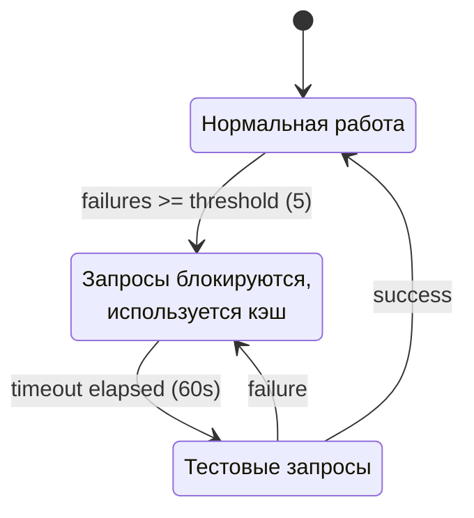

### Обработка ошибок синхронизации 1C_*

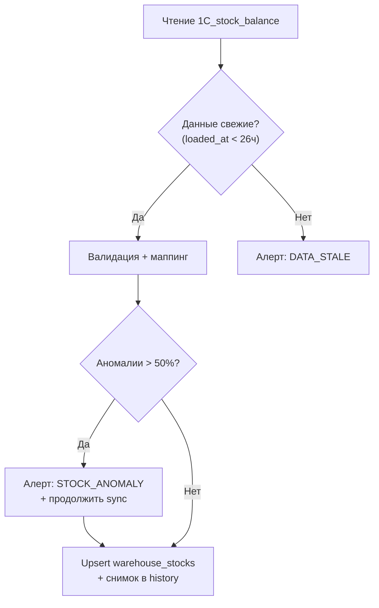

---

## 1.9 Мониторинг и логирование

### Метрики (Prometheus)

| Метрика | Тип | Описание |
|---------|-----|----------|
| `logistic_ozon_api_requests_total` | Counter | Общее число запросов к Ozon API |
| `logistic_ozon_api_errors_total` | Counter | Ошибки Ozon API |
| `logistic_ozon_api_latency_seconds` | Histogram | Латентность запросов |
| `logistic_stocks_sync_duration_seconds` | Histogram | Время синхронизации остатков |
| `logistic_1c_sync_total` | Counter | Количество синхронизаций 1C_* |
| `logistic_1c_stale_total` | Counter | Устаревшие данные 1C_* |
| `logistic_supply_tasks_generated_total` | Counter | Сгенерированные наряд-задания |
| `logistic_supply_tasks_completed_total` | Counter | Выполненные наряд-задания |
| `logistic_alerts_generated_total` | Counter | Сгенерированные алерты |
| `logistic_cluster_deficit_total` | Gauge | Текущий дефицит по кластерам |

### Структурированное логирование

```python
import structlog

logger = structlog.get_logger("logistic")

# Пример: синхронизация остатков
logger.info(
    "ozon_stocks_synced",
    sku_count=2400,
    cluster_count=31,
    duration_ms=4200,
    cache_updated=True
)

# Пример: синхронизация 1C_*
logger.info(
    "1c_sync_completed",
    source="1C_stock_balance",
    records_validated=2380,
    records_unmapped=20,
    anomalies=3,
    duration_ms=800
)

# Пример: наряд-задание
logger.info(
    "supply_tasks_generated",
    date="2026-02-06",
    tasks_total=20,
    priority_urgent=3,
    priority_planned=5,
    priority_recommended=12,
    total_quantity=847
)
```

---

## 1.10 Безопасность

### API ключи Ozon

| Аспект | Реализация |
|--------|------------|
| Хранение | Переменные окружения / Vault |
| Формат | Client-Id + Api-Key (два параметра) |
| Передача | HTTP заголовки `Client-Id`, `Api-Key` |
| Ротация | Поддержка hot-reload конфигурации |
| Аудит | Логирование всех API-вызовов |

### Безопасность синхронизации 1C_*

| Аспект | Реализация |
|--------|------------|
| Директория импорта | Ограниченные права доступа (0750) |
| Валидация данных | Проверка свежести loaded_at, маппинг артикулов |
| Максимальный размер | 50 МБ |
| Карантин | Некорректные файлы перемещаются в `/quarantine` |
| Архивирование | Обработанные файлы → `/archive` с timestamp |

### Доступ к данным

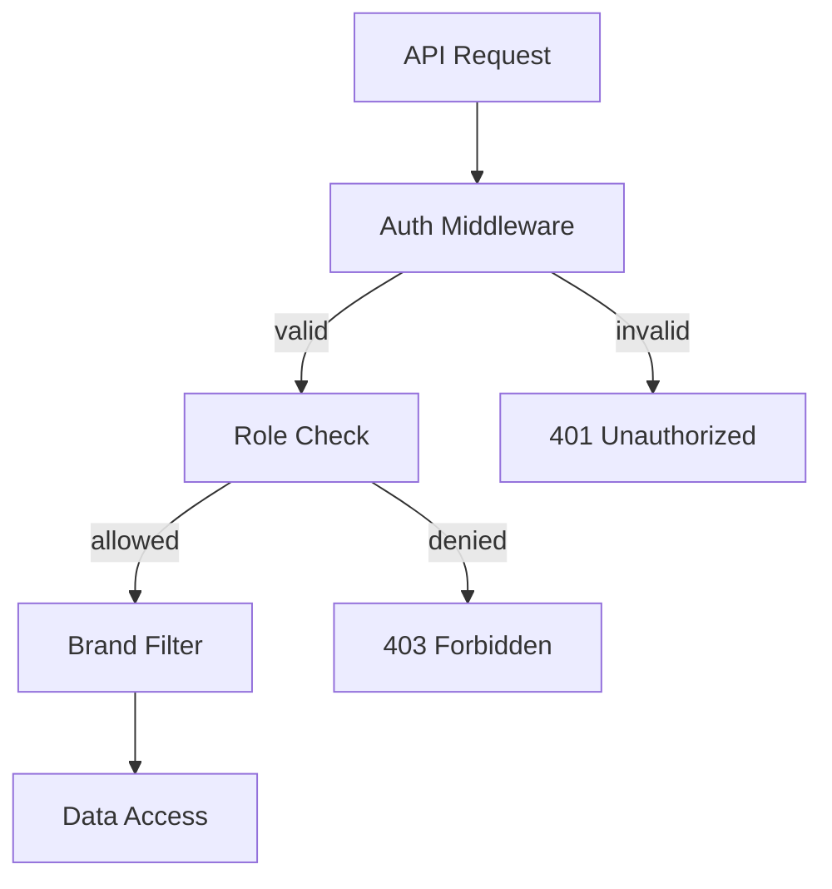

---

## 1.11 Масштабирование

### Горизонтальное масштабирование

| Компонент | Стратегия |
|-----------|-----------|
| API | Stateless, несколько инстансов за LB |
| Celery Workers | Увеличение числа воркеров |
| Redis | Cluster mode (при необходимости) |
| PostgreSQL | Read replicas (v2.0) |
| 1C_* синхронизация | Один обработчик, последовательное чтение |

### Ограничения Ozon API

| Аспект | Значение | Стратегия |
|--------|----------|-----------|
| Rate limit | ~5 RPS (базовый) | Регулируемый RateLimiter |
| Premium rate limit | Расширенный | Настройка при наличии Premium |
| Пагинация | offset/limit, cursor | Автоматическая обработка |
| Размер ответа | До 1000 записей | Пагинация с аккумуляцией |

---

## 1.12 Диаграмма развёртывания

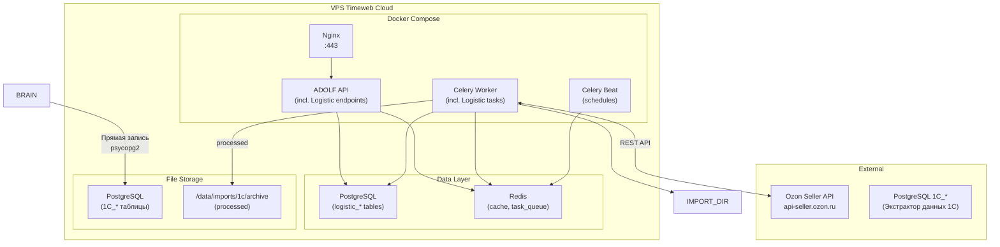

---

## 1.13 Зависимости

### Python пакеты

```txt
# requirements-logistic.txt
aiohttp>=3.9.0
tenacity>=8.2.0
redis>=5.0.0
celery>=5.3.0
structlog>=24.1.0
pydantic>=2.5.0
sqlalchemy>=2.0.0
# openpyxl, lxml — больше не требуются (файловый импорт удалён)
numpy>=1.26.0         # Demand forecasting
```

### Внутренние зависимости

| Модуль | Зависимость | Тип |
|--------|-------------|-----|
| Core | Middleware, PostgreSQL, Redis, Celery, Notifications | Hard |
| CFO | Отправка данных о логистических издержках | Soft (v2.0) |
| Scout | Получение прогнозов продаж | Soft (v2.0) |

---

## 1.14 Структура файлов модуля

```
/app/modules/logistic/
├── __init__.py
├── config.py
├── adapters/
│   ├── __init__.py
│   ├── ozon_adapter.py
│   ├── 1c_data_reader.py
│   ├── rate_limiter.py
│   └── retry_handler.py
├── services/
│   ├── __init__.py
│   ├── stock_service.py
│   ├── analytics_service.py
│   ├── warehouse_service.py
│   ├── supply_task_service.py
│   ├── alert_service.py
│   └── import_service.py
├── domain/
│   ├── __init__.py
│   ├── models.py
│   ├── stock_monitor.py
│   ├── demand_forecaster.py
│   ├── supply_calculator.py
│   └── task_generator.py
├── api/
│   ├── __init__.py
│   ├── router.py
│   ├── stocks.py
│   ├── supply_tasks.py
│   ├── analytics.py
│   ├── imports.py
│   ├── alerts.py
│   └── schemas.py
├── tasks/
│   ├── __init__.py
│   ├── sync_ozon_stocks.py
│   ├── sync_ozon_analytics.py
│   ├── import_1c_stocks.py
│   ├── generate_supply_tasks.py
│   └── generate_alerts.py
├── db/
│   ├── __init__.py
│   ├── models.py
│   └── repositories.py
└── owui/
    ├── __init__.py
    ├── pipeline.py
    └── tools.py
```

---

**Документ подготовлен:** Февраль 2026  
**Версия:** 2.0  
**Статус:** Черновик  
**Заменяет:** adolf_logistic_1_architecture_v1_0.md

