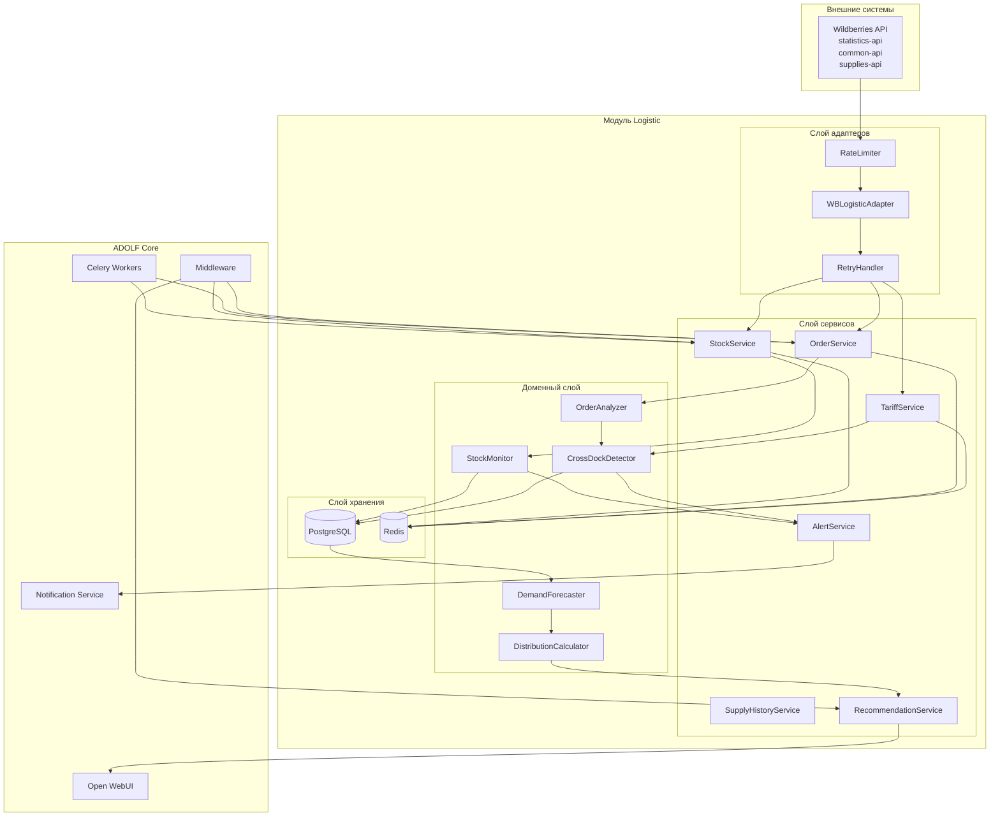
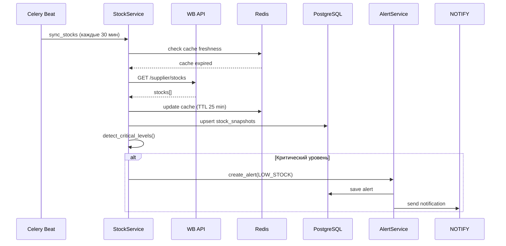
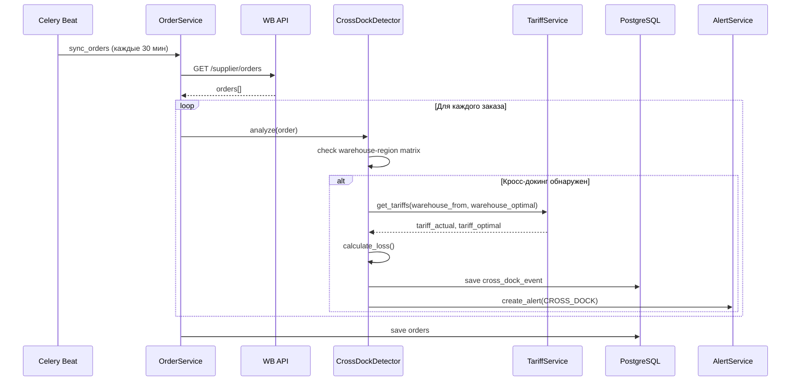
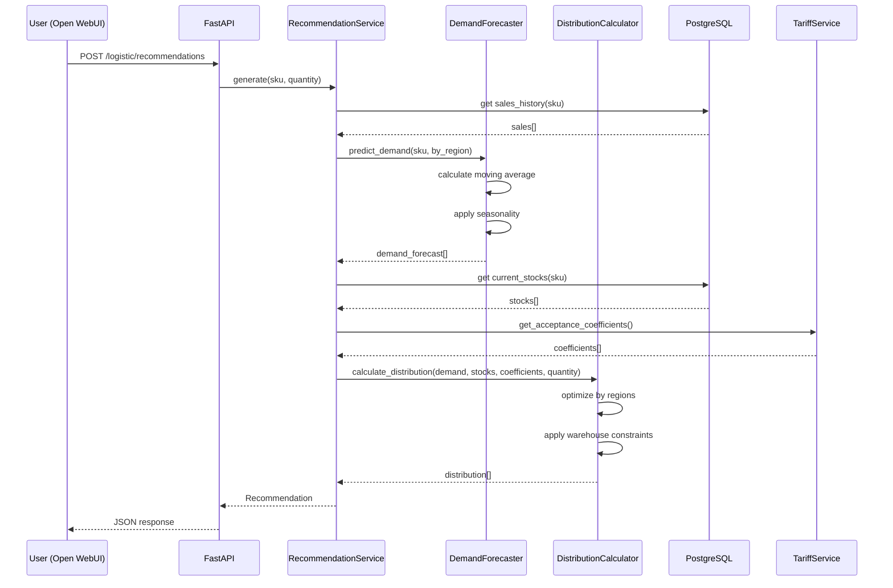
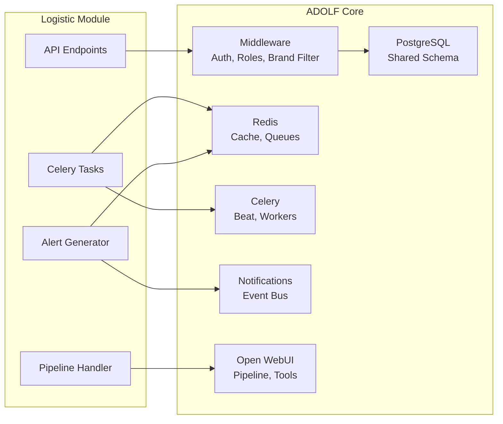
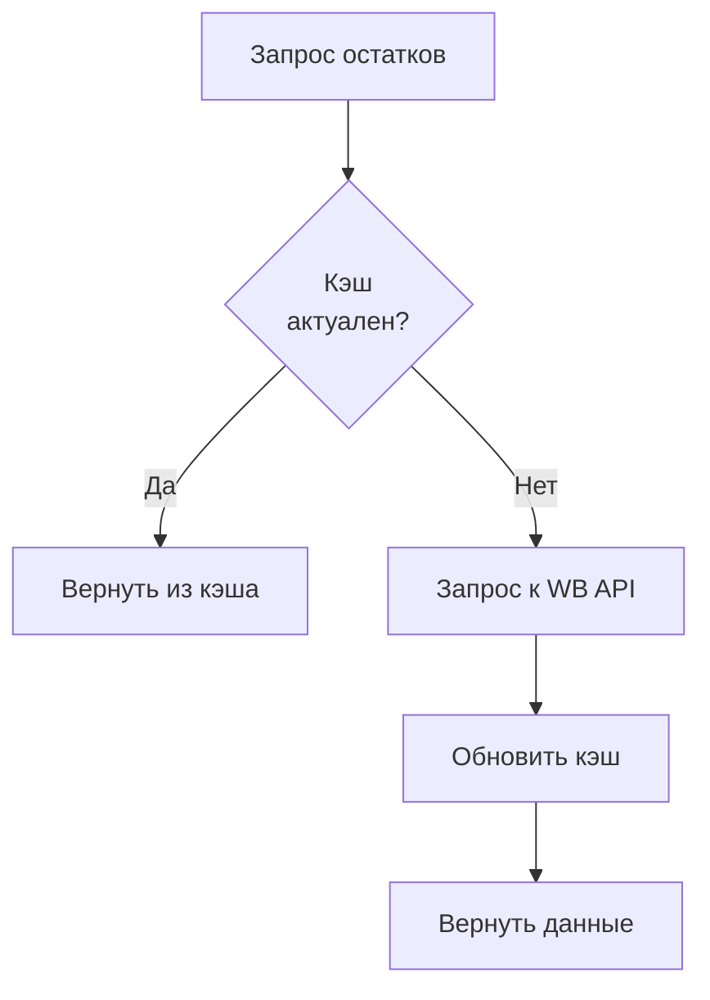
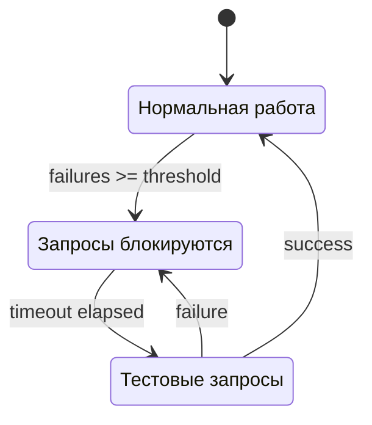
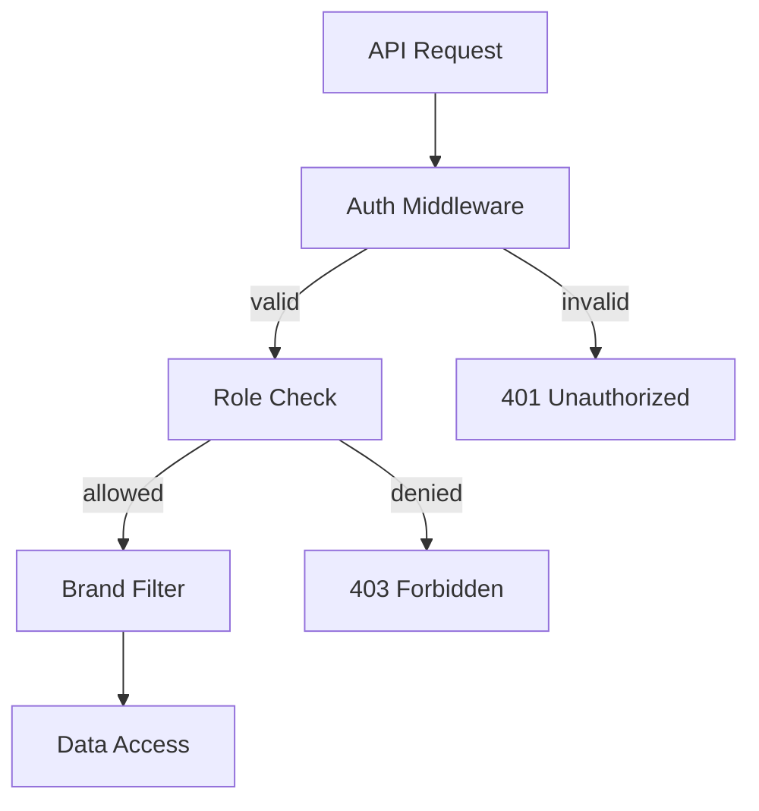

# ADOLF LOGISTIC — Раздел 1: Architecture

**Проект:** Интеллектуальная система управления логистикой маркетплейсов  
**Модуль:** Logistic / Architecture  
**Версия:** 1.0  
**Дата:** Январь 2026

---

## 1.1 Обзор архитектуры

### Принципы проектирования

| Принцип | Описание |
|---------|----------|
| **Модульность** | Независимые компоненты с чёткими интерфейсами |
| **Отказоустойчивость** | Graceful degradation при недоступности WB API |
| **Кэширование** | Минимизация запросов к API через Redis |
| **Асинхронность** | Фоновая синхронизация через Celery |
| **Расширяемость** | Подготовка к Ozon/YM в v2.0 |

### Архитектурная диаграмма



---

## 1.2 Компоненты системы

### Слой адаптеров

| Компонент | Назначение | Технология |
|-----------|------------|------------|
| **WBLogisticAdapter** | Единая точка интеграции с WB API | aiohttp |
| **RateLimiter** | Контроль частоты запросов к API | Redis + asyncio |
| **RetryHandler** | Повторные попытки при ошибках | tenacity |

### Слой сервисов

| Сервис | Назначение | Входные данные | Выходные данные |
|--------|------------|----------------|-----------------|
| **StockService** | Получение и кэширование остатков | WB API | Stock[] |
| **OrderService** | Получение и обработка заказов | WB API | Order[] |
| **TariffService** | Получение тарифов логистики | WB API | Tariff[] |
| **SupplyHistoryService** | История поставок | PostgreSQL | Supply[] |
| **RecommendationService** | Формирование рекомендаций | Domain models | Recommendation |
| **AlertService** | Генерация и отправка алертов | Domain events | Alert[] |

### Доменный слой

| Компонент | Назначение | Логика |
|-----------|------------|--------|
| **StockMonitor** | Отслеживание уровня остатков | Сравнение с порогами, тренды |
| **OrderAnalyzer** | Анализ структуры заказов | Статистика по регионам/складам |
| **CrossDockDetector** | Выявление кросс-докинга | Матрица склад-регион |
| **DemandForecaster** | Прогноз спроса | Moving average, сезонность |
| **DistributionCalculator** | Расчёт распределения | Оптимизация по регионам |

---

## 1.3 Потоки данных

### Поток синхронизации остатков



### Поток анализа заказов



### Поток генерации рекомендаций



---

## 1.4 Интеграция с ADOLF Core

### Используемые компоненты Core



### Middleware интеграция

| Middleware | Использование |
|------------|---------------|
| `AuthMiddleware` | Валидация JWT/API Key |
| `RoleMiddleware` | Проверка прав доступа |
| `BrandFilterMiddleware` | Фильтрация данных по brand_id |
| `PromptInjectionMiddleware` | Добавление контекста для AI |

### Shared PostgreSQL схема

Модуль Logistic использует:
- **Собственные таблицы** с префиксом `logistic_*`
- **Общие таблицы** Core: `users`, `brands`, `notifications`
- **FK связи** с другими модулями минимизированы

---

## 1.5 Структура кодовой базы

```
adolf/
├── modules/
│   └── logistic/
│       ├── __init__.py
│       ├── config.py                 # Конфигурация модуля
│       │
│       ├── adapters/                 # Слой адаптеров
│       │   ├── __init__.py
│       │   ├── wb_adapter.py         # WBLogisticAdapter
│       │   ├── rate_limiter.py       # RateLimiter
│       │   └── retry_handler.py      # RetryHandler
│       │
│       ├── services/                 # Слой сервисов
│       │   ├── __init__.py
│       │   ├── stock_service.py      # StockService
│       │   ├── order_service.py      # OrderService
│       │   ├── tariff_service.py     # TariffService
│       │   ├── supply_service.py     # SupplyHistoryService
│       │   ├── recommendation_service.py
│       │   └── alert_service.py      # AlertService
│       │
│       ├── domain/                   # Доменный слой
│       │   ├── __init__.py
│       │   ├── models.py             # Pydantic models
│       │   ├── stock_monitor.py      # StockMonitor
│       │   ├── order_analyzer.py     # OrderAnalyzer
│       │   ├── cross_dock_detector.py
│       │   ├── demand_forecaster.py  # DemandForecaster
│       │   └── distribution_calculator.py
│       │
│       ├── api/                      # FastAPI endpoints
│       │   ├── __init__.py
│       │   ├── router.py             # Main router
│       │   ├── stocks.py             # /stocks endpoints
│       │   ├── orders.py             # /orders endpoints
│       │   ├── recommendations.py    # /recommendations endpoints
│       │   ├── alerts.py             # /alerts endpoints
│       │   └── schemas.py            # Request/Response schemas
│       │
│       ├── tasks/                    # Celery tasks
│       │   ├── __init__.py
│       │   ├── sync_stocks.py
│       │   ├── sync_orders.py
│       │   ├── sync_tariffs.py
│       │   └── generate_alerts.py
│       │
│       ├── db/                       # Database
│       │   ├── __init__.py
│       │   ├── models.py             # SQLAlchemy models
│       │   └── repositories.py       # Data access
│       │
│       └── owui/                     # Open WebUI integration
│           ├── __init__.py
│           ├── pipeline.py           # Pipeline handler
│           └── tools.py              # Function tools
```

---

## 1.6 Конфигурация

### Переменные окружения

```python
# config.py
from pydantic_settings import BaseSettings

class LogisticSettings(BaseSettings):
    """Настройки модуля Logistic."""
    
    # WB API
    wb_api_key: str
    wb_statistics_url: str = "https://statistics-api.wildberries.ru"
    wb_common_url: str = "https://common-api.wildberries.ru"
    wb_supplies_url: str = "https://supplies-api.wildberries.ru"
    
    # Rate limits (requests per minute)
    wb_stocks_rpm: int = 1
    wb_orders_rpm: int = 1
    wb_tariffs_rpm: int = 60
    
    # Sync intervals (minutes)
    sync_stocks_interval: int = 30
    sync_orders_interval: int = 30
    sync_tariffs_interval: int = 1440  # daily
    
    # Alert thresholds
    critical_stock_threshold: int = 10
    warning_stock_threshold: int = 30
    cross_dock_alert_min_loss: float = 100.0
    
    # Forecast settings
    forecast_window_days: int = 30
    forecast_horizon_days: int = 14
    
    # Cache TTL (seconds)
    cache_stocks_ttl: int = 1500  # 25 min
    cache_tariffs_ttl: int = 86400  # 24 hours
    
    class Config:
        env_prefix = "LOGISTIC_"
```

### Пример .env

```bash
# Wildberries API
LOGISTIC_WB_API_KEY=your_api_key_here

# Thresholds
LOGISTIC_CRITICAL_STOCK_THRESHOLD=5
LOGISTIC_WARNING_STOCK_THRESHOLD=20
LOGISTIC_CROSS_DOCK_ALERT_MIN_LOSS=50.0

# Intervals
LOGISTIC_SYNC_STOCKS_INTERVAL=30
LOGISTIC_SYNC_ORDERS_INTERVAL=30
```

---

## 1.7 Кэширование

### Стратегия кэширования

| Данные | Хранилище | TTL | Ключ |
|--------|-----------|-----|------|
| Остатки по складам | Redis | 25 мин | `logistic:stocks:{date}` |
| Тарифы | Redis | 24 часа | `logistic:tariffs:{date}` |
| Коэффициенты приёмки | Redis | 1 час | `logistic:acceptance:{date}` |
| Матрица склад-регион | Redis | 7 дней | `logistic:warehouse_matrix` |
| Список складов | Redis | 7 дней | `logistic:warehouses` |

### Структура кэша остатков

```python
# Redis key: logistic:stocks:2026-01-31
{
    "updated_at": "2026-01-31T10:30:00Z",
    "stocks": [
        {
            "sku": "OM-12345",
            "barcode": "2000000000001",
            "warehouse_name": "Коледино",
            "warehouse_id": 507,
            "quantity": 45,
            "in_way_to_client": 3,
            "in_way_from_client": 1
        },
        ...
    ]
}
```

### Cache-aside pattern



---

## 1.8 Обработка ошибок

### Типы ошибок

| Ошибка | Код | Обработка |
|--------|-----|-----------|
| `WBAPIError` | 500 | Retry с exponential backoff |
| `RateLimitError` | 429 | Ожидание, затем retry |
| `AuthenticationError` | 401 | Алерт администратору |
| `DataValidationError` | 422 | Логирование, пропуск записи |
| `CacheError` | — | Fallback на прямой запрос |

### Retry стратегия

```python
from tenacity import retry, stop_after_attempt, wait_exponential

@retry(
    stop=stop_after_attempt(3),
    wait=wait_exponential(multiplier=1, min=4, max=60),
    retry=retry_if_exception_type(WBAPIError)
)
async def fetch_stocks(self) -> list[Stock]:
    """Получение остатков с retry."""
    ...
```

### Circuit Breaker



---

## 1.9 Мониторинг и логирование

### Метрики (Prometheus)

| Метрика | Тип | Описание |
|---------|-----|----------|
| `logistic_wb_api_requests_total` | Counter | Общее число запросов к WB API |
| `logistic_wb_api_errors_total` | Counter | Ошибки WB API |
| `logistic_wb_api_latency_seconds` | Histogram | Латентность запросов |
| `logistic_stocks_sync_duration_seconds` | Histogram | Время синхронизации остатков |
| `logistic_cross_dock_events_total` | Counter | Выявленные кросс-докинги |
| `logistic_alerts_generated_total` | Counter | Сгенерированные алерты |

### Структурированное логирование

```python
import structlog

logger = structlog.get_logger("logistic")

# Пример лога
logger.info(
    "stocks_synced",
    sku_count=1000,
    warehouse_count=15,
    duration_ms=2340,
    cache_updated=True
)
```

### Формат лога

```json
{
    "timestamp": "2026-01-31T10:30:00.123Z",
    "level": "info",
    "logger": "logistic",
    "event": "stocks_synced",
    "sku_count": 1000,
    "warehouse_count": 15,
    "duration_ms": 2340,
    "cache_updated": true,
    "trace_id": "abc123"
}
```

---

## 1.10 Безопасность

### API ключи WB

| Аспект | Реализация |
|--------|------------|
| Хранение | Vault / переменные окружения |
| Ротация | Поддержка hot-reload конфигурации |
| Аудит | Логирование всех API-вызовов |

### Доступ к данным



---

## 1.11 Масштабирование

### Горизонтальное масштабирование

| Компонент | Стратегия |
|-----------|-----------|
| API | Stateless, несколько инстансов за LB |
| Celery Workers | Увеличение числа воркеров |
| Redis | Cluster mode (при необходимости) |
| PostgreSQL | Read replicas (v2.0) |

### Ограничения WB API

| Endpoint | Лимит | Стратегия |
|----------|-------|-----------|
| `/supplier/stocks` | 1 req/min | Кэширование, batch requests |
| `/supplier/orders` | 1 req/min | Инкрементальная синхронизация |
| `/tariffs/box` | 60 req/min | Агрессивное кэширование |

---

## 1.12 Зависимости

### Python пакеты

```txt
# requirements-logistic.txt
aiohttp>=3.9.0
tenacity>=8.2.0
redis>=5.0.0
celery>=5.3.0
structlog>=24.1.0
pydantic>=2.5.0
sqlalchemy>=2.0.0
```

### Внутренние зависимости

| Модуль | Зависимость | Тип |
|--------|-------------|-----|
| Core | Middleware, PostgreSQL, Redis, Celery, Notifications | Hard |
| CFO | Отправка данных о логистических издержках | Soft |
| Scout | Получение прогнозов продаж | Soft (v2.0) |

---

**Документ подготовлен:** Январь 2026  
**Версия:** 1.0  
**Статус:** Черновик
