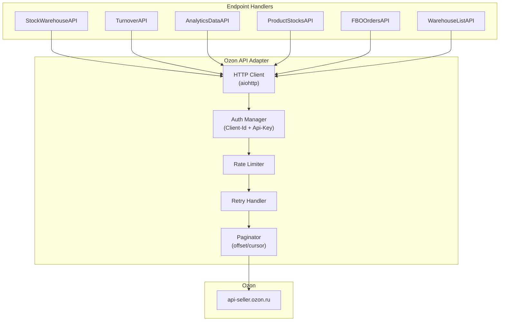
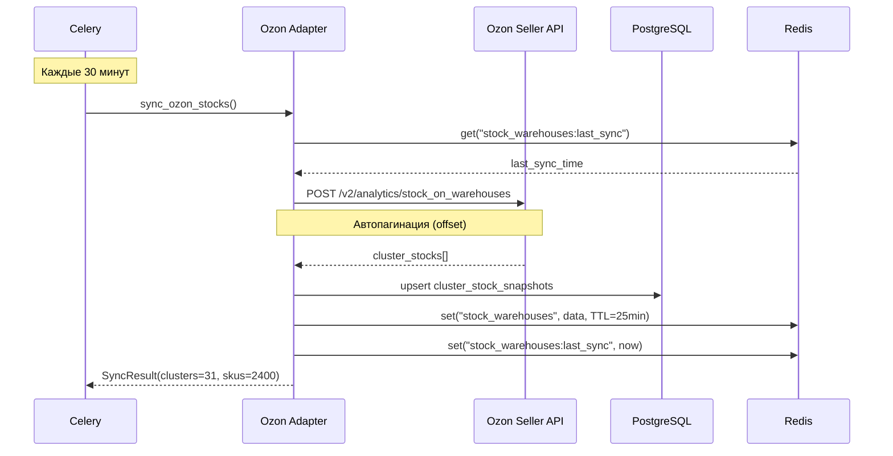

# ADOLF LOGISTIC — Раздел 2: Ozon Integration

**Модуль:** Logistic  
**Компонент:** Ozon Seller API Integration  
**Версия:** 2.0  
**Дата:** Февраль 2026  
**Заменяет:** adolf_logistic_2_wb_integration_v1_0.md

---

## 2.1 Обзор интеграции

### Назначение

Компонент Ozon Integration обеспечивает взаимодействие модуля Logistic с Ozon Seller API для получения данных об остатках по кластерам, аналитике продаж, оборачиваемости и FBO-заказах.

### Используемые API

| Группа | Base URL | Назначение |
|--------|----------|------------|
| Ozon Seller API | `https://api-seller.ozon.ru` | Все методы (единый URL) |

### Документация Ozon

Официальная документация: [docs.ozon.ru/api/seller](https://docs.ozon.ru/api/seller/)

---

## 2.2 Авторизация

### Формат запроса

Ozon использует двухпараметрическую авторизацию через HTTP-заголовки:

```http
POST /v2/analytics/stock_on_warehouses
Host: api-seller.ozon.ru
Client-Id: {CLIENT_ID}
Api-Key: {API_KEY}
Content-Type: application/json
```

| Заголовок | Описание |
|-----------|----------|
| `Client-Id` | Числовой идентификатор клиента (seller) |
| `Api-Key` | API-ключ, генерируется в ЛК продавца |

> **Получение ключей:** Личный кабинет продавца → Настройки → API-ключи (`seller.ozon.ru/app/settings/api-keys`)

### Конфигурация

```python
# config/ozon_api.py
from pydantic_settings import BaseSettings

class OzonAPISettings(BaseSettings):
    """Настройки Ozon Seller API"""
    
    client_id: str
    api_key: str
    base_url: str = "https://api-seller.ozon.ru"
    
    # Таймауты
    request_timeout: int = 30
    
    # Retry политика
    max_retries: int = 3
    retry_delay: float = 1.0
    
    # Rate limits
    rps_limit: int = 5  # requests per second (базовый)
    
    class Config:
        env_prefix = "OZON_"
```

---

## 2.3 Endpoints

### 2.3.1 Остатки на складах Ozon

**Endpoint:** `POST /v2/analytics/stock_on_warehouses`

**Назначение:** Отчёт по остаткам и движению товаров на складах Ozon (FBO)

**Rate Limit:** Базовый (без Premium — ограничения)

**Пример запроса:**

```http
POST /v2/analytics/stock_on_warehouses
Host: api-seller.ozon.ru
Client-Id: 123456
Api-Key: your-api-key
Content-Type: application/json

{
    "limit": 1000,
    "offset": 0,
    "warehouse_type": "ALL"
}
```

**Параметры запроса:**

| Параметр | Тип | Обязательный | Описание |
|----------|-----|:------------:|----------|
| limit | integer | ❌ | Количество записей (макс. 1000) |
| offset | integer | ❌ | Смещение для пагинации |
| warehouse_type | string | ❌ | Тип склада: `ALL`, `EXPRESS`, `NOT_EXPRESS` |

**Пример ответа:**

```json
{
    "result": {
        "rows": [
            {
                "sku": 924771727,
                "item_code": "51005/54",
                "item_name": "Шорты Ohana market Стильно и модно",
                "free_to_sell_amount": 12,
                "promised_amount": 3,
                "reserved_amount": 2,
                "warehouse_name": "Москва, МО и Дальние регионы",
                "idc": "MSK"
            }
        ]
    }
}
```

**Ключевые поля ответа:**

| Поле | Тип | Описание |
|------|-----|----------|
| sku | integer | SKU товара в системе Ozon |
| item_code | string | Артикул продавца (offer_id) |
| item_name | string | Наименование товара |
| free_to_sell_amount | integer | Доступно для продажи |
| promised_amount | integer | Товары в пути / зарезервированные |
| reserved_amount | integer | Зарезервировано под заказы |
| warehouse_name | string | Название кластера Ozon |

---

### 2.3.2 Оборачиваемость товара

**Endpoint:** `POST /v1/analytics/turnover/stocks`

**Назначение:** Оборачиваемость товара, количество дней до окончания остатка

**Пример запроса:**

```http
POST /v1/analytics/turnover/stocks
Host: api-seller.ozon.ru
Client-Id: 123456
Api-Key: your-api-key
Content-Type: application/json

{
    "sku": [924771727, 2804779750],
    "limit": 100,
    "offset": 0
}
```

**Параметры запроса:**

| Параметр | Тип | Обязательный | Описание |
|----------|-----|:------------:|----------|
| sku | integer[] | ❌ | Список SKU (фильтр) |
| limit | integer | ❌ | Лимит записей |
| offset | integer | ❌ | Смещение |

**Пример ответа:**

```json
{
    "result": {
        "items": [
            {
                "sku": 924771727,
                "offer_id": "51005/54",
                "product_name": "Шорты Ohana market Стильно и модно",
                "days_without_stock_percent": 14.3,
                "stock_coverage_days": 5,
                "avg_daily_demand": 4.2,
                "current_stock": 21,
                "in_transit": 0,
                "turnover_days": 18.5
            }
        ]
    }
}
```

**Ключевые поля:**

| Поле | Тип | Описание |
|------|-----|----------|
| sku | integer | SKU товара |
| offer_id | string | Артикул продавца |
| days_without_stock_percent | float | % дней без остатка за период |
| stock_coverage_days | integer | На сколько дней хватит текущего остатка |
| avg_daily_demand | float | Среднесуточный спрос (шт) |
| current_stock | integer | Текущий остаток |
| in_transit | integer | В пути на склад |
| turnover_days | float | Оборачиваемость (дни) |

---

### 2.3.3 Аналитика продаж

**Endpoint:** `POST /v1/analytics/data`

**Назначение:** Агрегированная аналитика продаж: воронка, ABC, среднесуточные показатели

**Пример запроса:**

```http
POST /v1/analytics/data
Host: api-seller.ozon.ru
Client-Id: 123456
Api-Key: your-api-key
Content-Type: application/json

{
    "date_from": "2026-01-09T00:00:00Z",
    "date_to": "2026-02-06T00:00:00Z",
    "metrics": [
        "revenue",
        "ordered_units",
        "returns",
        "delivered_units",
        "session_view",
        "conv_tocart_pdp",
        "cancellations"
    ],
    "dimension": ["sku", "day"],
    "filters": [],
    "sort": [{"key": "revenue", "order": "DESC"}],
    "limit": 1000,
    "offset": 0
}
```

**Параметры запроса:**

| Параметр | Тип | Обязательный | Описание |
|----------|-----|:------------:|----------|
| date_from | string | ✅ | Начало периода (RFC3339) |
| date_to | string | ✅ | Конец периода (RFC3339) |
| metrics | string[] | ✅ | Список метрик |
| dimension | string[] | ✅ | Измерения: `sku`, `day`, `category` |
| filters | object[] | ❌ | Фильтры |
| sort | object[] | ❌ | Сортировка |
| limit | integer | ❌ | Лимит (макс. 1000) |
| offset | integer | ❌ | Смещение |

**Доступные метрики:**

| Метрика | Описание |
|---------|----------|
| `revenue` | Выручка (₽) |
| `ordered_units` | Заказано (шт) |
| `delivered_units` | Доставлено (шт) |
| `returns` | Возвраты (шт) |
| `cancellations` | Отмены (шт) |
| `session_view` | Просмотры карточки |
| `conv_tocart_pdp` | Конверсия в корзину |

**Пример ответа:**

```json
{
    "result": {
        "data": [
            {
                "dimensions": [
                    {"id": "924771727", "name": "Шорты Ohana market Стильно и модно"},
                    {"id": "2026-02-05", "name": "2026-02-05"}
                ],
                "metrics": [12500.0, 5, 0, 4, 320, 0.08, 1]
            }
        ],
        "totals": [850000.0, 340, 12, 310, 45000, 0.065, 30]
    }
}
```

---

### 2.3.4 Остатки по товарам

**Endpoint:** `POST /v4/product/info/stocks`

**Назначение:** Текущие остатки по товарам (FBO + FBS), агрегированные

**Пример запроса:**

```http
POST /v4/product/info/stocks
Host: api-seller.ozon.ru
Client-Id: 123456
Api-Key: your-api-key
Content-Type: application/json

{
    "filter": {
        "offer_id": ["51005/54"],
        "product_id": [],
        "visibility": "ALL"
    },
    "last_id": "",
    "limit": 100
}
```

**Параметры запроса:**

| Параметр | Тип | Обязательный | Описание |
|----------|-----|:------------:|----------|
| filter.offer_id | string[] | ❌ | Фильтр по артикулам |
| filter.product_id | integer[] | ❌ | Фильтр по product_id |
| filter.visibility | string | ❌ | `ALL`, `VISIBLE`, `INVISIBLE`, `EMPTY_STOCK` |
| last_id | string | ❌ | Курсор пагинации |
| limit | integer | ❌ | Лимит (макс. 1000) |

**Пример ответа:**

```json
{
    "result": {
        "items": [
            {
                "product_id": 123456789,
                "offer_id": "51005/54",
                "stocks": [
                    {
                        "type": "fbo",
                        "present": 45,
                        "reserved": 3
                    },
                    {
                        "type": "fbs",
                        "present": 0,
                        "reserved": 0
                    }
                ]
            }
        ],
        "last_id": "abc123",
        "total": 2400
    }
}
```

---

### 2.3.5 FBO-заказы

**Endpoint:** `POST /v2/posting/fbo/list`

**Назначение:** Список FBO-отправлений для анализа паттернов продаж

**Пример запроса:**

```http
POST /v2/posting/fbo/list
Host: api-seller.ozon.ru
Client-Id: 123456
Api-Key: your-api-key
Content-Type: application/json

{
    "dir": "ASC",
    "filter": {
        "since": "2026-01-09T00:00:00Z",
        "to": "2026-02-06T23:59:59Z",
        "status": "delivered"
    },
    "limit": 1000,
    "offset": 0,
    "with": {
        "analytics_data": true,
        "financial_data": false
    }
}
```

**Параметры запроса:**

| Параметр | Тип | Обязательный | Описание |
|----------|-----|:------------:|----------|
| dir | string | ❌ | `ASC` / `DESC` |
| filter.since | string | ✅ | Начало периода (RFC3339) |
| filter.to | string | ✅ | Конец периода (RFC3339) |
| filter.status | string | ❌ | Статус отправления |
| limit | integer | ❌ | Лимит (макс. 1000) |
| offset | integer | ❌ | Смещение |
| with.analytics_data | boolean | ❌ | Включить аналитические данные |

**Статусы FBO-отправлений:**

| Статус | Описание |
|--------|----------|
| `awaiting_packaging` | Ожидает упаковки |
| `awaiting_deliver` | Ожидает доставки |
| `delivering` | Доставляется |
| `delivered` | Доставлен |
| `cancelled` | Отменён |

**Пример ответа:**

```json
{
    "result": {
        "postings": [
            {
                "posting_number": "0195812345-0001-1",
                "status": "delivered",
                "created_at": "2026-02-05T10:15:00Z",
                "in_process_at": "2026-02-05T10:20:00Z",
                "products": [
                    {
                        "sku": 924771727,
                        "name": "Шорты Ohana market Стильно и модно",
                        "quantity": 1,
                        "offer_id": "51005/54",
                        "price": "2500.00"
                    }
                ],
                "analytics_data": {
                    "region": "Приморский край",
                    "city": "Владивосток",
                    "warehouse_name": "Дальний Восток",
                    "warehouse_id": 22536890,
                    "delivery_type": "fbo"
                }
            }
        ],
        "has_next": true
    }
}
```

> **Важно:** Поля `analytics_data.city` и `analytics_data.region` были deprecated в Ноябре 2024. Их доступность может варьироваться. Основной идентификатор географии — `warehouse_name` (кластер).

---

### 2.3.6 Список складов продавца

**Endpoint:** `POST /v1/warehouse/list`

**Назначение:** Справочник складов/кластеров Ozon, доступных продавцу

**Пример запроса:**

```http
POST /v1/warehouse/list
Host: api-seller.ozon.ru
Client-Id: 123456
Api-Key: your-api-key
Content-Type: application/json

{}
```

**Пример ответа:**

```json
{
    "result": [
        {
            "warehouse_id": 22536890,
            "name": "Дальний Восток",
            "is_rfbs": false,
            "status": "created",
            "has_entrusted_acceptance": false
        },
        {
            "warehouse_id": 22536891,
            "name": "Москва, МО и Дальние регионы",
            "is_rfbs": false,
            "status": "created",
            "has_entrusted_acceptance": true
        }
    ]
}
```

---

### 2.3.7 Отчёт по складским остаткам

**Endpoint:** `POST /v1/report/warehouse/stock`

**Назначение:** Асинхронная генерация отчёта по складским остаткам (CSV)

**Пример запроса:**

```http
POST /v1/report/warehouse/stock
Host: api-seller.ozon.ru
Client-Id: 123456
Api-Key: your-api-key
Content-Type: application/json

{
    "language": "DEFAULT"
}
```

**Пример ответа:**

```json
{
    "result": {
        "code": "report-uuid-12345"
    }
}
```

> **Асинхронный endpoint:** Возвращает `code` для последующей проверки статуса и скачивания через `POST /v1/report/info`.

---

## 2.4 Архитектура адаптера

### Диаграмма компонентов



### Структура модуля

```
logistic/
└── adapters/
    └── ozon/
        ├── __init__.py
        ├── client.py            # HTTP клиент с rate limiting
        ├── auth.py              # Управление Client-Id / Api-Key
        ├── paginator.py         # Обработка пагинации (offset/cursor)
        ├── endpoints/
        │   ├── __init__.py
        │   ├── stock_warehouses.py   # /v2/analytics/stock_on_warehouses
        │   ├── turnover.py           # /v1/analytics/turnover/stocks
        │   ├── analytics_data.py     # /v1/analytics/data
        │   ├── product_stocks.py     # /v4/product/info/stocks
        │   ├── fbo_orders.py         # /v2/posting/fbo/list
        │   └── warehouses.py         # /v1/warehouse/list
        ├── models/
        │   ├── __init__.py
        │   ├── stock.py          # Модели остатков по кластерам
        │   ├── turnover.py       # Модели оборачиваемости
        │   ├── analytics.py      # Модели аналитики
        │   ├── order.py          # Модели FBO-заказов
        │   └── warehouse.py      # Модели складов/кластеров
        └── exceptions.py         # Кастомные исключения
```

---

## 2.5 Rate Limiting

### Лимиты Ozon API

Ozon применяет rate limiting на уровне аккаунта. Лимиты зависят от наличия Premium-подписки:

| Подписка | Базовый лимит | Примечание |
|----------|---------------|------------|
| Без Premium | ~5 RPS | Ограничения на аналитические методы |
| Premium | Расширенный | Более высокие лимиты |

### Лимиты по endpoints

| Endpoint | Примерный лимит | Стратегия |
|----------|-----------------|-----------|
| `/v2/analytics/stock_on_warehouses` | 5/мин (без Premium) | Кэширование 25 мин |
| `/v1/analytics/turnover/stocks` | 5/мин | Ежедневная синхронизация |
| `/v1/analytics/data` | 10/мин | Ежедневная синхронизация |
| `/v4/product/info/stocks` | 50/мин | Кэширование 25 мин |
| `/v2/posting/fbo/list` | 50/мин | Инкрементальная загрузка |
| `/v1/warehouse/list` | 50/мин | Кэширование 7 дней |

### Реализация Rate Limiter

```python
# adapters/ozon/client.py
import asyncio
import time
from collections import defaultdict

class OzonRateLimiter:
    """Rate limiter для Ozon Seller API"""
    
    def __init__(self, rps: int = 5):
        self._rps = rps
        self._min_interval = 1.0 / rps
        self._last_request_time: float = 0
        self._lock = asyncio.Lock()
    
    async def acquire(self) -> None:
        """Ожидание до возможности выполнить запрос"""
        async with self._lock:
            now = time.monotonic()
            elapsed = now - self._last_request_time
            if elapsed < self._min_interval:
                await asyncio.sleep(self._min_interval - elapsed)
            self._last_request_time = time.monotonic()
```

---

## 2.6 Пагинация

Ozon использует два типа пагинации:

### Offset-based (большинство endpoints)

```python
# adapters/ozon/paginator.py

class OffsetPaginator:
    """Offset-based пагинация для Ozon API"""
    
    def __init__(self, endpoint_handler, limit: int = 1000):
        self._handler = endpoint_handler
        self._limit = limit
    
    async def fetch_all(self, **params) -> list:
        """Получить все записи с автоматической пагинацией"""
        all_items = []
        offset = 0
        
        while True:
            result = await self._handler(
                limit=self._limit,
                offset=offset,
                **params
            )
            
            items = result.get("rows") or result.get("items") or []
            all_items.extend(items)
            
            if len(items) < self._limit:
                break
            
            offset += self._limit
        
        return all_items
```

### Cursor-based (`/v4/product/info/stocks`)

```python
class CursorPaginator:
    """Cursor-based пагинация (last_id)"""
    
    async def fetch_all(self, **params) -> list:
        all_items = []
        last_id = ""
        
        while True:
            result = await self._handler(
                last_id=last_id,
                limit=self._limit,
                **params
            )
            
            items = result.get("items", [])
            all_items.extend(items)
            
            new_last_id = result.get("last_id", "")
            if not items or new_last_id == last_id:
                break
            
            last_id = new_last_id
        
        return all_items
```

---

## 2.7 Обработка ошибок

### Коды ошибок Ozon API

| HTTP Code | Описание | Действие |
|-----------|----------|----------|
| 200 | Успех | Обработать ответ |
| 400 | Неверный запрос | Логировать, не повторять |
| 401 | Client-Id / Api-Key невалидны | Алерт администратору |
| 403 | Нет доступа (Premium required) | Алерт, fallback на альтернативный endpoint |
| 429 | Too Many Requests | Ждать и повторить |
| 500 | Ошибка сервера Ozon | Retry с backoff |
| 503 | Сервис недоступен | Retry с backoff |

### Retry стратегия

```python
# adapters/ozon/client.py
from tenacity import retry, stop_after_attempt, wait_exponential, retry_if_exception_type

class OzonAPIClient:
    """HTTP клиент для Ozon Seller API"""
    
    @retry(
        stop=stop_after_attempt(3),
        wait=wait_exponential(multiplier=1, min=2, max=60),
        retry=retry_if_exception_type((OzonServerError, OzonRateLimitError))
    )
    async def _request(
        self,
        method: str,
        endpoint: str,
        body: dict | None = None,
    ) -> dict:
        """Выполнение HTTP запроса с retry"""
        headers = {
            "Client-Id": self._client_id,
            "Api-Key": self._api_key,
            "Content-Type": "application/json",
        }
        
        await self._rate_limiter.acquire()
        
        async with aiohttp.ClientSession() as session:
            async with session.request(
                method,
                f"{self._base_url}{endpoint}",
                headers=headers,
                json=body,
                timeout=aiohttp.ClientTimeout(total=30)
            ) as response:
                if response.status == 429:
                    raise OzonRateLimitError()
                
                if response.status in (401, 403):
                    raise OzonAuthError(status_code=response.status)
                
                if response.status >= 500:
                    raise OzonServerError(status_code=response.status)
                
                data = await response.json()
                return data
```

### Кастомные исключения

```python
# adapters/ozon/exceptions.py

class OzonAPIError(Exception):
    """Базовое исключение Ozon API"""
    pass

class OzonAuthError(OzonAPIError):
    """Ошибка авторизации (401/403)"""
    def __init__(self, status_code: int):
        self.status_code = status_code
        super().__init__(f"Ozon auth error: {status_code}")

class OzonRateLimitError(OzonAPIError):
    """Превышен лимит запросов (429)"""
    pass

class OzonServerError(OzonAPIError):
    """Ошибка сервера Ozon (5xx)"""
    def __init__(self, status_code: int):
        self.status_code = status_code
        super().__init__(f"Ozon server error: {status_code}")

class OzonDataError(OzonAPIError):
    """Ошибка в данных ответа"""
    pass

class OzonPaginationError(OzonAPIError):
    """Ошибка пагинации (бесконечный цикл, etc.)"""
    pass
```

---

## 2.8 Кэширование

### TTL по типам данных

| Данные | TTL | Обоснование |
|--------|-----|-------------|
| Остатки по кластерам | 25 мин | Частые изменения, синхронизация каждые 30 мин |
| Оборачиваемость | 1 час | Агрегированные данные |
| Аналитика продаж | 1 час | Ежедневная детализация |
| Остатки по товарам | 25 мин | Частые изменения |
| FBO-заказы | 30 мин | Новые заказы |
| Список кластеров | 7 дней | Стабильный справочник |

### Реализация кэша

```python
# adapters/ozon/cache.py
import json
from datetime import timedelta
from redis.asyncio import Redis

class OzonCache:
    """Кэш для данных Ozon API"""
    
    TTL = {
        "stock_warehouses": timedelta(minutes=25),
        "turnover": timedelta(hours=1),
        "analytics": timedelta(hours=1),
        "product_stocks": timedelta(minutes=25),
        "fbo_orders": timedelta(minutes=30),
        "warehouses": timedelta(days=7),
    }
    
    def __init__(self, redis: Redis):
        self._redis = redis
        self._prefix = "logistic:ozon:"
    
    async def get(self, data_type: str, key: str = "default") -> dict | None:
        """Получить данные из кэша"""
        cache_key = f"{self._prefix}{data_type}:{key}"
        data = await self._redis.get(cache_key)
        return json.loads(data) if data else None
    
    async def set(self, data_type: str, data: dict, key: str = "default") -> None:
        """Сохранить данные в кэш"""
        cache_key = f"{self._prefix}{data_type}:{key}"
        ttl = self.TTL.get(data_type, timedelta(hours=1))
        await self._redis.setex(cache_key, int(ttl.total_seconds()), json.dumps(data, default=str))
    
    async def invalidate(self, data_type: str, key: str = "*") -> None:
        """Инвалидировать кэш"""
        pattern = f"{self._prefix}{data_type}:{key}"
        async for k in self._redis.scan_iter(match=pattern):
            await self._redis.delete(k)
```

---

## 2.9 Pydantic модели

### Модель остатков по кластерам

```python
# adapters/ozon/models/stock.py
from pydantic import BaseModel, Field

class OzonClusterStock(BaseModel):
    """Остаток товара на кластере Ozon"""
    
    sku: int
    item_code: str                    # offer_id / артикул
    item_name: str
    free_to_sell_amount: int          # доступно для продажи
    promised_amount: int = 0          # в пути
    reserved_amount: int = 0          # зарезервировано
    warehouse_name: str               # название кластера
    
    @property
    def total_stock(self) -> int:
        """Полный остаток"""
        return self.free_to_sell_amount + self.reserved_amount
    
    @property
    def available_stock(self) -> int:
        """Доступный остаток"""
        return self.free_to_sell_amount
```

### Модель оборачиваемости

```python
# adapters/ozon/models/turnover.py
from pydantic import BaseModel

class OzonTurnover(BaseModel):
    """Оборачиваемость товара"""
    
    sku: int
    offer_id: str
    product_name: str
    days_without_stock_percent: float
    stock_coverage_days: int          # дней до обнуления
    avg_daily_demand: float           # среднесуточный спрос (шт)
    current_stock: int
    in_transit: int
    turnover_days: float
```

### Модель FBO-заказа

```python
# adapters/ozon/models/order.py
from datetime import datetime
from pydantic import BaseModel

class OzonFBOProduct(BaseModel):
    """Товар в FBO-отправлении"""
    sku: int
    name: str
    quantity: int
    offer_id: str
    price: str

class OzonFBOAnalytics(BaseModel):
    """Аналитические данные FBO-заказа"""
    region: str = ""
    city: str = ""
    warehouse_name: str             # кластер отгрузки
    warehouse_id: int
    delivery_type: str = "fbo"

class OzonFBOOrder(BaseModel):
    """FBO-отправление Ozon"""
    posting_number: str
    status: str
    created_at: datetime
    in_process_at: datetime | None = None
    products: list[OzonFBOProduct]
    analytics_data: OzonFBOAnalytics | None = None
```

### Модель склада/кластера

```python
# adapters/ozon/models/warehouse.py
from pydantic import BaseModel

class OzonWarehouse(BaseModel):
    """Склад/кластер Ozon"""
    warehouse_id: int
    name: str
    is_rfbs: bool = False
    status: str = "created"
    has_entrusted_acceptance: bool = False
```

---

## 2.10 Endpoint Handlers

### StockWarehouseAPI

```python
# adapters/ozon/endpoints/stock_warehouses.py
from ..client import OzonAPIClient
from ..models.stock import OzonClusterStock
from ..cache import OzonCache

class StockWarehouseAPI:
    """API для остатков по кластерам"""
    
    ENDPOINT = "/v2/analytics/stock_on_warehouses"
    
    def __init__(self, client: OzonAPIClient, cache: OzonCache):
        self._client = client
        self._cache = cache
    
    async def get_all(self, use_cache: bool = True) -> list[OzonClusterStock]:
        """Получить все остатки по кластерам"""
        if use_cache:
            cached = await self._cache.get("stock_warehouses")
            if cached:
                return [OzonClusterStock(**item) for item in cached]
        
        all_items = []
        offset = 0
        limit = 1000
        
        while True:
            data = await self._client.post(
                self.ENDPOINT,
                body={"limit": limit, "offset": offset, "warehouse_type": "ALL"}
            )
            
            rows = data.get("result", {}).get("rows", [])
            all_items.extend(rows)
            
            if len(rows) < limit:
                break
            offset += limit
        
        await self._cache.set("stock_warehouses", all_items)
        return [OzonClusterStock(**item) for item in all_items]
    
    async def get_by_cluster(self, cluster_name: str) -> list[OzonClusterStock]:
        """Остатки по конкретному кластеру"""
        all_stocks = await self.get_all()
        return [s for s in all_stocks if s.warehouse_name == cluster_name]
    
    async def get_by_article(self, article: str) -> list[OzonClusterStock]:
        """Остатки по артикулу (все кластеры)"""
        all_stocks = await self.get_all()
        return [s for s in all_stocks if s.item_code == article]
```

---

## 2.11 Синхронизация данных

### Стратегия синхронизации



### Маппинг Ozon SKU ↔ Внутренний артикул

Ozon использует `sku` (числовой) и `offer_id` (строковый артикул продавца). Маппинг:

| Поле Ozon | Поле ADOLF | Описание |
|-----------|------------|----------|
| `sku` | `ozon_sku` | Числовой SKU в системе Ozon |
| `offer_id` / `item_code` | `article` | Артикул продавца (совпадает с 1С) |
| `product_id` | `ozon_product_id` | ID товара Ozon |

> **Связь с 1С:** Поле `offer_id` (Ozon) = `Артикул` (1С). Это ключевое поле для маппинга между двумя источниками данных.

---

## 2.12 Мониторинг и логирование

### Метрики

| Метрика | Тип | Описание |
|---------|-----|----------|
| `ozon_api_requests_total` | Counter | Всего запросов к Ozon API |
| `ozon_api_errors_total` | Counter | Ошибки по типам |
| `ozon_api_latency_seconds` | Histogram | Время ответа API |
| `ozon_api_rate_limit_hits` | Counter | Срабатывания rate limit |
| `ozon_sync_duration_seconds` | Histogram | Время синхронизации |
| `ozon_sync_records_count` | Gauge | Количество записей |

### Структура логов

```python
# Успешный запрос
logger.info(
    "ozon_api_request_completed",
    endpoint="/v2/analytics/stock_on_warehouses",
    status_code=200,
    duration_ms=2100,
    records_count=2400,
    pages_fetched=3
)

# Ошибка
logger.error(
    "ozon_api_request_failed",
    endpoint="/v1/analytics/turnover/stocks",
    status_code=429,
    error="Rate limit exceeded",
    retry_attempt=2
)
```

---

## 2.13 Тестирование

### Mock-сервер для тестов

```python
# tests/mocks/ozon_api.py
from fastapi import FastAPI, Header, HTTPException

mock_ozon_app = FastAPI()

MOCK_CLUSTER_STOCKS = {
    "result": {
        "rows": [
            {
                "sku": 924771727,
                "item_code": "51005/54",
                "item_name": "Шорты Ohana market Стильно и модно",
                "free_to_sell_amount": 12,
                "promised_amount": 3,
                "reserved_amount": 2,
                "warehouse_name": "Москва, МО и Дальние регионы"
            },
            {
                "sku": 924771727,
                "item_code": "51005/54",
                "item_name": "Шорты Ohana market Стильно и модно",
                "free_to_sell_amount": 0,
                "promised_amount": 0,
                "reserved_amount": 0,
                "warehouse_name": "Дальний Восток"
            }
        ]
    }
}

@mock_ozon_app.post("/v2/analytics/stock_on_warehouses")
async def stock_on_warehouses(
    client_id: str = Header(alias="Client-Id"),
    api_key: str = Header(alias="Api-Key")
):
    if client_id != "123456" or api_key != "test-key":
        raise HTTPException(status_code=401, detail="Unauthorized")
    return MOCK_CLUSTER_STOCKS
```

---

## 2.14 Промпт для Claude Code

Для реализации Ozon API адаптера:

```
Реализуй Ozon Seller API адаптер для модуля Logistic согласно документации 
adolf_logistic_2_ozon_integration_v2_0.md

Требования:
1. Структура: logistic/adapters/ozon/
2. HTTP клиент на aiohttp с async/await
3. Авторизация: Client-Id + Api-Key в HTTP заголовках
4. Rate limiting: настраиваемый RPS (по умолчанию 5)
5. Retry с exponential backoff (tenacity): 3 попытки
6. Автоматическая пагинация: offset-based + cursor-based (last_id)
7. Кэширование в Redis с TTL по типам данных
8. Pydantic модели: OzonClusterStock, OzonTurnover, OzonFBOOrder, OzonWarehouse
9. Endpoint handlers: StockWarehouseAPI, TurnoverAPI, AnalyticsDataAPI, 
   ProductStocksAPI, FBOOrdersAPI, WarehouseListAPI
10. Логирование: structlog, все запросы и ошибки

Endpoints (все POST, base_url = https://api-seller.ozon.ru):
- /v2/analytics/stock_on_warehouses — остатки FBO по кластерам
- /v1/analytics/turnover/stocks — оборачиваемость
- /v1/analytics/data — аналитика продаж
- /v4/product/info/stocks — остатки по товарам
- /v2/posting/fbo/list — FBO-заказы
- /v1/warehouse/list — список кластеров

Тесты: pytest + mock-сервер FastAPI
```

---

## 2.15 Ссылки

| Ресурс | URL |
|--------|-----|
| Ozon Seller API Документация | https://docs.ozon.ru/api/seller/ |
| Ozon for Dev (сообщество) | https://dev.ozon.ru/ |
| Генерация API-ключей | https://seller.ozon.ru/app/settings/api-keys |
| Postman Collection | https://www.postman.com/googlesheets/ozon-seller-api |

---

**Документ подготовлен:** Февраль 2026  
**Версия:** 2.0  
**Статус:** Черновик  
**Заменяет:** adolf_logistic_2_wb_integration_v1_0.md
