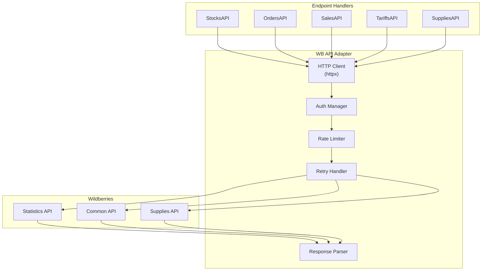
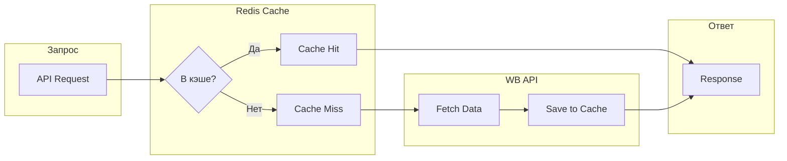
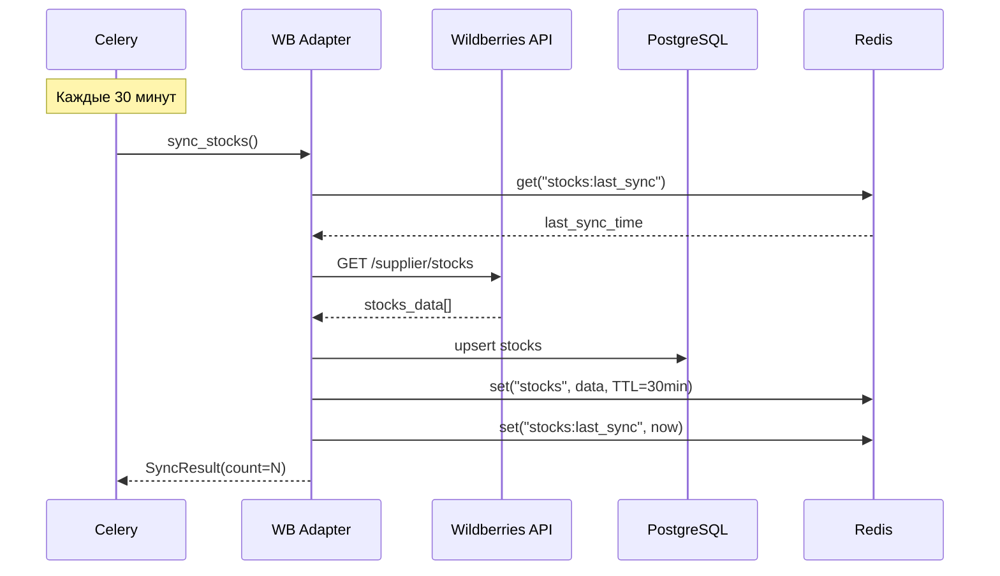

# ADOLF LOGISTIC — Раздел 2: WB Integration

**Модуль:** Logistic  
**Компонент:** Wildberries API Integration  
**Версия:** 1.0  
**Дата:** Январь 2026

---

## 2.1 Обзор интеграции

### Назначение

Компонент WB Integration обеспечивает взаимодействие модуля Logistic с API Wildberries для получения данных об остатках, заказах, продажах и тарифах логистики.

### Используемые API

| API | Base URL | Назначение |
|-----|----------|------------|
| Statistics API | `https://statistics-api.wildberries.ru` | Остатки, заказы, продажи |
| Common API | `https://common-api.wildberries.ru` | Тарифы логистики |
| Supplies API | `https://supplies-api.wildberries.ru` | Коэффициенты приёмки, склады |

### Документация WB

Официальная документация: [dev.wildberries.ru/openapi](https://dev.wildberries.ru/openapi)

---

## 2.2 Авторизация

### Формат запроса

```http
GET /api/v1/supplier/stocks
Host: statistics-api.wildberries.ru
Authorization: {API_KEY}
Content-Type: application/json
```

### Конфигурация

```python
# config/wb_api.py
from pydantic_settings import BaseSettings

class WBAPISettings(BaseSettings):
    """Настройки API Wildberries"""
    
    # API ключи (разные для разных API)
    statistics_api_key: str
    supplies_api_key: str
    common_api_key: str
    
    # Base URLs
    statistics_base_url: str = "https://statistics-api.wildberries.ru"
    supplies_base_url: str = "https://supplies-api.wildberries.ru"
    common_base_url: str = "https://common-api.wildberries.ru"
    
    # Таймауты
    request_timeout: int = 30
    
    # Retry политика
    max_retries: int = 3
    retry_delay: float = 1.0
    
    class Config:
        env_prefix = "WB_"
```

---

## 2.3 Endpoints

### 2.3.1 Остатки (Stocks)

**Endpoint:** `GET /api/v1/supplier/stocks`

**Назначение:** Текущие остатки товаров на складах WB

**Параметры:**

| Параметр | Тип | Обязательный | Описание |
|----------|-----|:------------:|----------|
| dateFrom | string | ✅ | Дата в формате RFC3339 |

**Rate Limit:** 1 запрос/минуту

**Максимум записей:** 60 000

**Пример запроса:**

```http
GET /api/v1/supplier/stocks?dateFrom=2026-01-01T00:00:00Z
Authorization: {API_KEY}
```

**Пример ответа:**

```json
[
  {
    "lastChangeDate": "2026-01-30T14:25:00",
    "warehouseName": "Коледино",
    "supplierArticle": "OM-12345",
    "nmId": 123456789,
    "barcode": "2000000000001",
    "quantity": 45,
    "inWayToClient": 3,
    "inWayFromClient": 1,
    "quantityFull": 49,
    "category": "Платья",
    "subject": "Платье летнее",
    "brand": "Охана Маркет",
    "techSize": "44",
    "Price": 2500,
    "Discount": 15,
    "isSupply": true,
    "isRealization": false,
    "SCCode": "SC123456"
  }
]
```

**Ключевые поля:**

| Поле | Тип | Описание |
|------|-----|----------|
| warehouseName | string | Название склада WB |
| supplierArticle | string | Артикул продавца |
| nmId | integer | Номенклатура WB |
| barcode | string | Штрихкод |
| quantity | integer | Доступный остаток |
| inWayToClient | integer | В пути к покупателю |
| inWayFromClient | integer | Возвраты в пути |
| quantityFull | integer | Полный остаток |
| techSize | string | Размер |

---

### 2.3.2 Заказы (Orders)

**Endpoint:** `GET /api/v1/supplier/orders`

**Назначение:** Информация о заказах с данными о складе отгрузки

**Параметры:**

| Параметр | Тип | Обязательный | Описание |
|----------|-----|:------------:|----------|
| dateFrom | string | ✅ | Начальная дата (RFC3339) |
| flag | integer | ❌ | 0 — все, 1 — только изменения |

**Rate Limit:** 1 запрос/минуту

**Максимум записей:** 80 000

**Хранение данных:** 90 дней

**Пример ответа:**

```json
[
  {
    "date": "2026-01-30T10:15:00",
    "lastChangeDate": "2026-01-30T14:30:00",
    "warehouseName": "Коледино",
    "warehouseType": "Склад WB",
    "countryName": "Россия",
    "oblastOkrugName": "Центральный федеральный округ",
    "regionName": "Московская область",
    "supplierArticle": "OM-12345",
    "nmId": 123456789,
    "barcode": "2000000000001",
    "category": "Платья",
    "subject": "Платье летнее",
    "brand": "Охана Маркет",
    "techSize": "44",
    "incomeID": 12345678,
    "isSupply": true,
    "isRealization": false,
    "totalPrice": 2500,
    "discountPercent": 15,
    "spp": 10,
    "finishedPrice": 1912,
    "priceWithDisc": 2125,
    "isCancel": false,
    "cancelDate": null,
    "orderType": "Клиентский",
    "sticker": "AB123456",
    "gNumber": "G123456789",
    "srid": "abc123def456"
  }
]
```

**Ключевые поля для логистики:**

| Поле | Тип | Описание |
|------|-----|----------|
| srid | string | Уникальный ID заказа |
| warehouseName | string | Склад отгрузки |
| warehouseType | string | "Склад WB" / "Склад продавца" |
| regionName | string | Регион покупателя |
| oblastOkrugName | string | Федеральный округ |
| supplierArticle | string | Артикул продавца |
| nmId | integer | Номенклатура WB |
| techSize | string | Размер |
| isCancel | boolean | Отмена заказа |

---

### 2.3.3 Продажи (Sales)

**Endpoint:** `GET /api/v1/supplier/sales`

**Назначение:** Данные о продажах для аналитики спроса

**Параметры:**

| Параметр | Тип | Обязательный | Описание |
|----------|-----|:------------:|----------|
| dateFrom | string | ✅ | Начальная дата (RFC3339) |
| flag | integer | ❌ | 0 — все, 1 — только изменения |

**Rate Limit:** 1 запрос/минуту

**Максимум записей:** 80 000

**Пример ответа:**

```json
[
  {
    "date": "2026-01-30T12:00:00",
    "lastChangeDate": "2026-01-30T12:05:00",
    "warehouseName": "Коледино",
    "countryName": "Россия",
    "oblastOkrugName": "Центральный федеральный округ",
    "regionName": "Москва",
    "supplierArticle": "OM-12345",
    "nmId": 123456789,
    "barcode": "2000000000001",
    "category": "Платья",
    "subject": "Платье летнее",
    "brand": "Охана Маркет",
    "techSize": "44",
    "totalPrice": 2500,
    "discountPercent": 15,
    "isSupply": true,
    "isRealization": false,
    "promoCodeDiscount": 0,
    "spp": 10,
    "forPay": 1720,
    "finishedPrice": 1912,
    "priceWithDisc": 2125,
    "saleID": "S123456789",
    "orderType": "Клиентский",
    "sticker": "AB123456",
    "gNumber": "G123456789",
    "srid": "abc123def456"
  }
]
```

---

### 2.3.4 Тарифы логистики (Tariffs)

**Endpoint:** `GET /api/v1/tariffs/box`

**Base URL:** `https://common-api.wildberries.ru`

**Назначение:** Тарифы доставки по складам

**Rate Limit:** 60 запросов/минуту

**Параметры:**

| Параметр | Тип | Обязательный | Описание |
|----------|-----|:------------:|----------|
| date | string | ❌ | Дата тарифа (YYYY-MM-DD) |

**Пример ответа:**

```json
{
  "response": {
    "data": {
      "dtNextBox": "2026-02-01",
      "dtTillMax": "2026-01-31",
      "warehouseList": [
        {
          "warehouseName": "Коледино",
          "boxDeliveryAndStorageExpr": "150",
          "boxDeliveryBase": "50",
          "boxDeliveryLiter": "5",
          "boxStorageBase": "0.5",
          "boxStorageLiter": "0.05"
        },
        {
          "warehouseName": "Краснодар",
          "boxDeliveryAndStorageExpr": "180",
          "boxDeliveryBase": "60",
          "boxDeliveryLiter": "6",
          "boxStorageBase": "0.6",
          "boxStorageLiter": "0.06"
        }
      ]
    }
  }
}
```

**Ключевые поля:**

| Поле | Тип | Описание |
|------|-----|----------|
| warehouseName | string | Название склада |
| boxDeliveryBase | string | Базовая стоимость доставки (₽) |
| boxDeliveryLiter | string | Стоимость за доп. литр (₽) |
| boxStorageBase | string | Базовая стоимость хранения (₽/день) |
| boxStorageLiter | string | Хранение за доп. литр (₽/день) |

---

### 2.3.5 Коэффициенты приёмки

**Endpoint:** `GET /api/v1/acceptance/coefficients`

**Base URL:** `https://supplies-api.wildberries.ru`

**Назначение:** Коэффициенты приёмки товаров на склады

**Параметры:**

| Параметр | Тип | Обязательный | Описание |
|----------|-----|:------------:|----------|
| warehouseIDs | array | ❌ | Фильтр по ID складов |

**Пример ответа:**

```json
[
  {
    "date": "2026-02-01",
    "coefficient": 0,
    "warehouseID": 507,
    "warehouseName": "Коледино",
    "allowUnload": true,
    "storageCoef": 1.0,
    "boxTypeName": "Короба",
    "boxTypeID": 2
  },
  {
    "date": "2026-02-01",
    "coefficient": 1.5,
    "warehouseID": 117501,
    "warehouseName": "Краснодар",
    "allowUnload": true,
    "storageCoef": 1.2,
    "boxTypeName": "Короба",
    "boxTypeID": 2
  }
]
```

**Ключевые поля:**

| Поле | Тип | Описание |
|------|-----|----------|
| warehouseID | integer | ID склада |
| warehouseName | string | Название склада |
| coefficient | float | Коэффициент приёмки (0 = бесплатно) |
| allowUnload | boolean | Приёмка разрешена |
| storageCoef | float | Коэффициент хранения |

---

### 2.3.6 Список складов WB

**Endpoint:** `GET /api/v1/warehouses`

**Base URL:** `https://supplies-api.wildberries.ru`

**Назначение:** Справочник складов Wildberries

**Пример ответа:**

```json
[
  {
    "ID": 507,
    "name": "Коледино",
    "city": "Подольск",
    "address": "Московская обл., г. Подольск",
    "longitude": 37.5,
    "latitude": 55.4,
    "cargoType": 1,
    "deliveryType": 1,
    "selected": true
  }
]
```

---

## 2.4 Архитектура адаптера

### Диаграмма компонентов



### Структура модуля

```
logistic/
└── adapters/
    └── wildberries/
        ├── __init__.py
        ├── client.py          # HTTP клиент с rate limiting
        ├── auth.py            # Управление API ключами
        ├── endpoints/
        │   ├── __init__.py
        │   ├── stocks.py      # /supplier/stocks
        │   ├── orders.py      # /supplier/orders
        │   ├── sales.py       # /supplier/sales
        │   ├── tariffs.py     # /tariffs/box
        │   └── supplies.py    # /acceptance/coefficients, /warehouses
        ├── models/
        │   ├── __init__.py
        │   ├── stock.py       # Pydantic модели остатков
        │   ├── order.py       # Модели заказов
        │   ├── sale.py        # Модели продаж
        │   ├── tariff.py      # Модели тарифов
        │   └── warehouse.py   # Модели складов
        └── exceptions.py      # Кастомные исключения
```

---

## 2.5 Rate Limiting

### Лимиты по endpoints

| Endpoint | Rate Limit | Стратегия |
|----------|------------|-----------|
| /supplier/stocks | 1/мин | Кэширование 30 мин |
| /supplier/orders | 1/мин | Инкрементальная загрузка |
| /supplier/sales | 1/мин | Ежедневная синхронизация |
| /tariffs/box | 60/мин | Кэширование 1 неделя |
| /acceptance/coefficients | 10/мин | Кэширование 1 день |
| /warehouses | 10/мин | Кэширование 1 неделя |

### Реализация Rate Limiter

```python
# adapters/wildberries/client.py
import asyncio
from datetime import datetime, timedelta
from collections import defaultdict

class RateLimiter:
    """Rate limiter для WB API"""
    
    def __init__(self):
        self._locks: dict[str, asyncio.Lock] = defaultdict(asyncio.Lock)
        self._last_request: dict[str, datetime] = {}
        
        # Лимиты: endpoint -> (requests, per_seconds)
        self._limits = {
            "/supplier/stocks": (1, 60),
            "/supplier/orders": (1, 60),
            "/supplier/sales": (1, 60),
            "/tariffs/box": (60, 60),
            "/acceptance/coefficients": (10, 60),
            "/warehouses": (10, 60),
        }
    
    async def acquire(self, endpoint: str) -> None:
        """Ожидание до возможности выполнить запрос"""
        async with self._locks[endpoint]:
            limit = self._limits.get(endpoint, (60, 60))
            requests_per_period, period_seconds = limit
            
            min_interval = period_seconds / requests_per_period
            
            if endpoint in self._last_request:
                elapsed = (datetime.now() - self._last_request[endpoint]).total_seconds()
                if elapsed < min_interval:
                    await asyncio.sleep(min_interval - elapsed)
            
            self._last_request[endpoint] = datetime.now()
```

---

## 2.6 Обработка ошибок

### Коды ошибок WB API

| HTTP Code | Описание | Действие |
|-----------|----------|----------|
| 200 | Успех | Обработать ответ |
| 400 | Неверный запрос | Логировать, не повторять |
| 401 | Не авторизован | Проверить API ключ |
| 429 | Too Many Requests | Ждать и повторить |
| 500 | Ошибка сервера | Retry с backoff |
| 503 | Сервис недоступен | Retry с backoff |

### Retry стратегия

```python
# adapters/wildberries/client.py
from tenacity import retry, stop_after_attempt, wait_exponential, retry_if_exception_type

class WBAPIClient:
    """HTTP клиент для Wildberries API"""
    
    @retry(
        stop=stop_after_attempt(3),
        wait=wait_exponential(multiplier=1, min=2, max=60),
        retry=retry_if_exception_type((httpx.TimeoutException, WBServerError))
    )
    async def _request(
        self,
        method: str,
        url: str,
        **kwargs
    ) -> dict:
        """Выполнение HTTP запроса с retry"""
        async with httpx.AsyncClient(timeout=30) as client:
            response = await client.request(method, url, **kwargs)
            
            if response.status_code == 429:
                retry_after = int(response.headers.get("Retry-After", 60))
                raise WBRateLimitError(retry_after=retry_after)
            
            if response.status_code >= 500:
                raise WBServerError(status_code=response.status_code)
            
            response.raise_for_status()
            return response.json()
```

### Кастомные исключения

```python
# adapters/wildberries/exceptions.py

class WBAPIError(Exception):
    """Базовое исключение WB API"""
    pass

class WBAuthError(WBAPIError):
    """Ошибка авторизации"""
    pass

class WBRateLimitError(WBAPIError):
    """Превышен лимит запросов"""
    def __init__(self, retry_after: int = 60):
        self.retry_after = retry_after
        super().__init__(f"Rate limit exceeded. Retry after {retry_after}s")

class WBServerError(WBAPIError):
    """Ошибка сервера WB"""
    def __init__(self, status_code: int):
        self.status_code = status_code
        super().__init__(f"WB server error: {status_code}")

class WBDataError(WBAPIError):
    """Ошибка в данных ответа"""
    pass
```

---

## 2.7 Кэширование

### Стратегия кэширования



### TTL по типам данных

| Данные | TTL | Обоснование |
|--------|-----|-------------|
| Остатки (stocks) | 30 мин | Частые изменения |
| Заказы (orders) | 30 мин | Новые заказы |
| Продажи (sales) | 24 часа | Ежедневный отчёт |
| Тарифы (tariffs) | 7 дней | Редкие изменения |
| Коэффициенты приёмки | 24 часа | Ежедневные изменения |
| Список складов | 7 дней | Стабильный справочник |

### Реализация кэша

```python
# adapters/wildberries/cache.py
import json
from datetime import timedelta
from redis.asyncio import Redis

class WBCache:
    """Кэш для данных WB API"""
    
    TTL = {
        "stocks": timedelta(minutes=30),
        "orders": timedelta(minutes=30),
        "sales": timedelta(hours=24),
        "tariffs": timedelta(days=7),
        "coefficients": timedelta(hours=24),
        "warehouses": timedelta(days=7),
    }
    
    def __init__(self, redis: Redis):
        self._redis = redis
        self._prefix = "logistic:wb:"
    
    async def get(self, data_type: str, key: str = "default") -> dict | None:
        """Получить данные из кэша"""
        cache_key = f"{self._prefix}{data_type}:{key}"
        data = await self._redis.get(cache_key)
        return json.loads(data) if data else None
    
    async def set(self, data_type: str, data: dict, key: str = "default") -> None:
        """Сохранить данные в кэш"""
        cache_key = f"{self._prefix}{data_type}:{key}"
        ttl = self.TTL.get(data_type, timedelta(hours=1))
        await self._redis.setex(cache_key, ttl, json.dumps(data))
    
    async def invalidate(self, data_type: str, key: str = "*") -> None:
        """Инвалидировать кэш"""
        pattern = f"{self._prefix}{data_type}:{key}"
        keys = await self._redis.keys(pattern)
        if keys:
            await self._redis.delete(*keys)
```

---

## 2.8 Pydantic модели

### Модель остатков

```python
# adapters/wildberries/models/stock.py
from datetime import datetime
from pydantic import BaseModel, Field

class WBStock(BaseModel):
    """Остаток товара на складе WB"""
    
    last_change_date: datetime = Field(alias="lastChangeDate")
    warehouse_name: str = Field(alias="warehouseName")
    supplier_article: str = Field(alias="supplierArticle")
    nm_id: int = Field(alias="nmId")
    barcode: str
    quantity: int
    in_way_to_client: int = Field(alias="inWayToClient")
    in_way_from_client: int = Field(alias="inWayFromClient")
    quantity_full: int = Field(alias="quantityFull")
    category: str
    subject: str
    brand: str
    tech_size: str = Field(alias="techSize")
    price: float = Field(alias="Price")
    discount: int = Field(alias="Discount")
    
    class Config:
        populate_by_name = True
```

### Модель заказа

```python
# adapters/wildberries/models/order.py
from datetime import datetime
from pydantic import BaseModel, Field

class WBOrder(BaseModel):
    """Заказ WB"""
    
    date: datetime
    last_change_date: datetime = Field(alias="lastChangeDate")
    warehouse_name: str = Field(alias="warehouseName")
    warehouse_type: str = Field(alias="warehouseType")
    country_name: str = Field(alias="countryName")
    oblast_okrug_name: str = Field(alias="oblastOkrugName")
    region_name: str = Field(alias="regionName")
    supplier_article: str = Field(alias="supplierArticle")
    nm_id: int = Field(alias="nmId")
    barcode: str
    category: str
    subject: str
    brand: str
    tech_size: str = Field(alias="techSize")
    total_price: float = Field(alias="totalPrice")
    discount_percent: int = Field(alias="discountPercent")
    spp: float
    finished_price: float = Field(alias="finishedPrice")
    price_with_disc: float = Field(alias="priceWithDisc")
    is_cancel: bool = Field(alias="isCancel")
    cancel_date: datetime | None = Field(alias="cancelDate", default=None)
    order_type: str = Field(alias="orderType")
    g_number: str = Field(alias="gNumber")
    srid: str
    
    class Config:
        populate_by_name = True
```

### Модель тарифа

```python
# adapters/wildberries/models/tariff.py
from pydantic import BaseModel, Field

class WBTariff(BaseModel):
    """Тариф логистики склада WB"""
    
    warehouse_name: str = Field(alias="warehouseName")
    box_delivery_base: float = Field(alias="boxDeliveryBase")
    box_delivery_liter: float = Field(alias="boxDeliveryLiter")
    box_storage_base: float = Field(alias="boxStorageBase")
    box_storage_liter: float = Field(alias="boxStorageLiter")
    
    class Config:
        populate_by_name = True
    
    def calculate_delivery_cost(self, volume_liters: float) -> float:
        """Расчёт стоимости доставки"""
        if volume_liters <= 1:
            return self.box_delivery_base
        return self.box_delivery_base + (volume_liters - 1) * self.box_delivery_liter
```

---

## 2.9 Endpoint Handlers

### StocksAPI

```python
# adapters/wildberries/endpoints/stocks.py
from datetime import datetime
from ..client import WBAPIClient
from ..models.stock import WBStock
from ..cache import WBCache

class StocksAPI:
    """API для работы с остатками"""
    
    ENDPOINT = "/api/v1/supplier/stocks"
    
    def __init__(self, client: WBAPIClient, cache: WBCache):
        self._client = client
        self._cache = cache
    
    async def get_all(self, use_cache: bool = True) -> list[WBStock]:
        """Получить все остатки"""
        if use_cache:
            cached = await self._cache.get("stocks")
            if cached:
                return [WBStock(**item) for item in cached]
        
        # dateFrom — обязательный, но можно указать старую дату для получения всех
        params = {"dateFrom": "2020-01-01T00:00:00Z"}
        
        data = await self._client.get(
            base_url="statistics",
            endpoint=self.ENDPOINT,
            params=params
        )
        
        await self._cache.set("stocks", data)
        return [WBStock(**item) for item in data]
    
    async def get_by_warehouse(self, warehouse_name: str) -> list[WBStock]:
        """Остатки по конкретному складу"""
        all_stocks = await self.get_all()
        return [s for s in all_stocks if s.warehouse_name == warehouse_name]
    
    async def get_by_article(self, supplier_article: str) -> list[WBStock]:
        """Остатки по артикулу (все склады)"""
        all_stocks = await self.get_all()
        return [s for s in all_stocks if s.supplier_article == supplier_article]
```

### OrdersAPI

```python
# adapters/wildberries/endpoints/orders.py
from datetime import datetime, timedelta
from ..client import WBAPIClient
from ..models.order import WBOrder

class OrdersAPI:
    """API для работы с заказами"""
    
    ENDPOINT = "/api/v1/supplier/orders"
    
    def __init__(self, client: WBAPIClient):
        self._client = client
    
    async def get_orders(
        self,
        date_from: datetime,
        flag: int = 0
    ) -> list[WBOrder]:
        """Получить заказы за период"""
        params = {
            "dateFrom": date_from.strftime("%Y-%m-%dT%H:%M:%SZ"),
            "flag": flag
        }
        
        data = await self._client.get(
            base_url="statistics",
            endpoint=self.ENDPOINT,
            params=params
        )
        
        return [WBOrder(**item) for item in data]
    
    async def get_recent(self, days: int = 7) -> list[WBOrder]:
        """Заказы за последние N дней"""
        date_from = datetime.utcnow() - timedelta(days=days)
        return await self.get_orders(date_from)
```

---

## 2.10 Синхронизация данных

### Стратегия синхронизации



### Инкрементальная загрузка заказов

```python
# services/sync.py
from datetime import datetime, timedelta

class WBSyncService:
    """Сервис синхронизации данных WB"""
    
    async def sync_orders_incremental(self) -> int:
        """Инкрементальная синхронизация заказов"""
        # Получаем время последней синхронизации
        last_sync = await self._get_last_sync("orders")
        
        if last_sync is None:
            # Первая синхронизация — берём 90 дней (максимум WB)
            date_from = datetime.utcnow() - timedelta(days=90)
        else:
            # Инкрементально — с последней синхронизации
            date_from = last_sync - timedelta(hours=1)  # перекрытие для надёжности
        
        orders = await self._orders_api.get_orders(date_from, flag=0)
        
        # Upsert в БД
        count = await self._repository.upsert_orders(orders)
        
        # Обновляем время синхронизации
        await self._set_last_sync("orders", datetime.utcnow())
        
        return count
```

---

## 2.11 Мониторинг и логирование

### Метрики

| Метрика | Тип | Описание |
|---------|-----|----------|
| `wb_api_requests_total` | Counter | Всего запросов к WB API |
| `wb_api_errors_total` | Counter | Ошибки по типам |
| `wb_api_latency_seconds` | Histogram | Время ответа API |
| `wb_api_rate_limit_hits` | Counter | Срабатывания rate limit |
| `wb_sync_duration_seconds` | Histogram | Время синхронизации |
| `wb_sync_records_count` | Gauge | Количество записей |

### Структура логов

```python
# Успешный запрос
{
    "level": "INFO",
    "message": "WB API request completed",
    "endpoint": "/supplier/stocks",
    "status_code": 200,
    "duration_ms": 1250,
    "records_count": 1500,
    "timestamp": "2026-01-30T14:30:00Z"
}

# Ошибка
{
    "level": "ERROR",
    "message": "WB API request failed",
    "endpoint": "/supplier/orders",
    "status_code": 429,
    "error": "Rate limit exceeded",
    "retry_after": 60,
    "timestamp": "2026-01-30T14:31:00Z"
}
```

---

## 2.12 Тестирование

### Mock-сервер для тестов

```python
# tests/mocks/wb_api.py
from fastapi import FastAPI, Header, HTTPException
from datetime import datetime

mock_wb_app = FastAPI()

MOCK_STOCKS = [
    {
        "lastChangeDate": "2026-01-30T14:25:00",
        "warehouseName": "Коледино",
        "supplierArticle": "OM-12345",
        "nmId": 123456789,
        "barcode": "2000000000001",
        "quantity": 45,
        "inWayToClient": 3,
        "inWayFromClient": 1,
        "quantityFull": 49,
        "category": "Платья",
        "subject": "Платье летнее",
        "brand": "Охана Маркет",
        "techSize": "44",
        "Price": 2500,
        "Discount": 15,
        "isSupply": True,
        "isRealization": False,
        "SCCode": "SC123456"
    }
]

@mock_wb_app.get("/api/v1/supplier/stocks")
async def get_stocks(
    dateFrom: str,
    authorization: str = Header(...)
):
    if authorization != "test_api_key":
        raise HTTPException(status_code=401, detail="Unauthorized")
    return MOCK_STOCKS
```

### Пример теста

```python
# tests/test_wb_adapter.py
import pytest
from httpx import AsyncClient
from adapters.wildberries.endpoints.stocks import StocksAPI

@pytest.mark.asyncio
async def test_get_stocks():
    """Тест получения остатков"""
    async with AsyncClient(base_url="http://test") as client:
        api = StocksAPI(client)
        stocks = await api.get_all()
        
        assert len(stocks) > 0
        assert stocks[0].warehouse_name == "Коледино"
        assert stocks[0].quantity == 45
```

---

## 2.13 Промпт для Claude Code

Для реализации WB API адаптера:

```
Реализуй WB API адаптер для модуля Logistic согласно документации 
adolf_logistic_2_wb_integration_v1_0.md

Требования:
1. Структура: logistic/adapters/wildberries/
2. HTTP клиент на httpx с async/await
3. Rate limiting согласно лимитам WB (1 req/min для stocks/orders/sales)
4. Retry с exponential backoff (tenacity)
5. Кэширование в Redis с TTL по типам данных
6. Pydantic модели для всех ответов API
7. Endpoint handlers: StocksAPI, OrdersAPI, SalesAPI, TariffsAPI, SuppliesAPI
8. Логирование всех запросов и ошибок

Endpoints:
- Statistics API: stocks, orders, sales
- Common API: tariffs/box
- Supplies API: acceptance/coefficients, warehouses

Тесты: pytest + mock-сервер FastAPI
```

---

## 2.14 Ссылки

| Ресурс | URL |
|--------|-----|
| WB API Документация | https://dev.wildberries.ru/openapi |
| Statistics API | https://dev.wildberries.ru/openapi/statistics |
| Supplies API | https://dev.wildberries.ru/openapi/supplies |
| Common API | https://dev.wildberries.ru/openapi/common |

---

**Документ подготовлен:** Январь 2026  
**Версия:** 1.0  
**Статус:** Черновик
