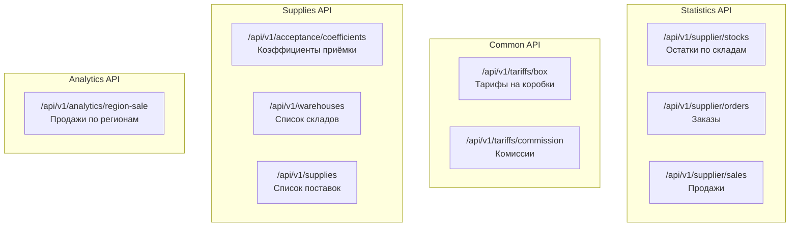

# ADOLF LOGISTIC — Раздел 2: WB Integration

**Проект:** Интеллектуальная система управления логистикой маркетплейсов  
**Модуль:** Logistic / WB Integration  
**Версия:** 1.0  
**Дата:** Январь 2026

---

## 2.1 Обзор API Wildberries

### Используемые API домены

| Домен | Назначение | Токен |
|-------|------------|-------|
| `statistics-api.wildberries.ru` | Остатки, заказы, продажи | Statistics |
| `common-api.wildberries.ru` | Тарифы логистики | Любой |
| `supplies-api.wildberries.ru` | Коэффициенты приёмки, склады | Supplies |
| `seller-analytics-api.wildberries.ru` | Аналитика по регионам | Analytics |

### Карта endpoints



---

## 2.2 Endpoint: Остатки по складам

### Спецификация

| Параметр | Значение |
|----------|----------|
| URL | `https://statistics-api.wildberries.ru/api/v1/supplier/stocks` |
| Method | GET |
| Auth | Header `Authorization: {API_KEY}` |
| Rate Limit | 1 запрос/минуту |
| Данные | Обновляются каждые 30 минут |

### Параметры запроса

| Параметр | Тип | Обязательный | Описание |
|----------|-----|:------------:|----------|
| `dateFrom` | string | ✅ | Дата изменения (RFC3339). Для полного списка: `2019-01-01` |

### Структура ответа

```json
[
  {
    "lastChangeDate": "2026-01-31T10:15:00",
    "warehouseName": "Коледино",
    "supplierArticle": "OM-12345",
    "nmId": 12345678,
    "barcode": "2000000000001",
    "quantity": 45,
    "inWayToClient": 3,
    "inWayFromClient": 1,
    "quantityFull": 49,
    "category": "Одежда",
    "subject": "Платья",
    "brand": "Охана Маркет",
    "techSize": "44",
    "Price": 3500,
    "Discount": 15,
    "isSupply": true,
    "isRealization": true,
    "SCCode": "Tech"
  }
]
```

### Маппинг полей

| Поле WB API | Поле Logistic | Описание |
|-------------|---------------|----------|
| `supplierArticle` | `sku` | Артикул продавца |
| `nmId` | `nm_id` | Номенклатура WB |
| `barcode` | `barcode` | Штрихкод |
| `warehouseName` | `warehouse_name` | Название склада |
| `quantity` | `quantity` | Доступный остаток |
| `inWayToClient` | `in_way_to_client` | В пути к клиенту |
| `inWayFromClient` | `in_way_from_client` | Возвраты в пути |
| `quantityFull` | `quantity_full` | Полный остаток |
| `techSize` | `size` | Размер |
| `lastChangeDate` | `updated_at` | Время обновления |

### Реализация адаптера

```python
from dataclasses import dataclass
from datetime import datetime
from typing import Optional
import aiohttp

@dataclass
class Stock:
    """Остаток товара на складе."""
    sku: str
    nm_id: int
    barcode: str
    warehouse_name: str
    quantity: int
    in_way_to_client: int
    in_way_from_client: int
    quantity_full: int
    size: str
    category: str
    brand: str
    updated_at: datetime


class WBStocksAdapter:
    """Адаптер для получения остатков с WB API."""
    
    BASE_URL = "https://statistics-api.wildberries.ru"
    ENDPOINT = "/api/v1/supplier/stocks"
    
    def __init__(self, api_key: str):
        self.api_key = api_key
        self.headers = {"Authorization": api_key}
    
    async def fetch_stocks(self, date_from: str = "2019-01-01") -> list[Stock]:
        """
        Получение всех остатков.
        
        Лимит: 60,000 записей за запрос.
        При превышении — пагинация по lastChangeDate.
        """
        all_stocks = []
        current_date = date_from
        
        async with aiohttp.ClientSession() as session:
            while True:
                batch = await self._fetch_batch(session, current_date)
                
                if not batch:
                    break
                
                all_stocks.extend(batch)
                
                if len(batch) < 60000:
                    break
                
                # Пагинация: берём lastChangeDate последней записи
                current_date = batch[-1]["lastChangeDate"]
        
        return [self._map_stock(s) for s in all_stocks]
    
    async def _fetch_batch(
        self, 
        session: aiohttp.ClientSession,
        date_from: str
    ) -> list[dict]:
        """Получение пакета данных."""
        url = f"{self.BASE_URL}{self.ENDPOINT}"
        params = {"dateFrom": date_from}
        
        async with session.get(url, params=params, headers=self.headers) as resp:
            if resp.status == 429:
                raise RateLimitError("Stocks API rate limit exceeded")
            if resp.status == 401:
                raise AuthenticationError("Invalid API key")
            if resp.status != 200:
                raise WBAPIError(f"Stocks API error: {resp.status}")
            
            return await resp.json()
    
    def _map_stock(self, raw: dict) -> Stock:
        """Маппинг сырых данных в модель."""
        return Stock(
            sku=raw.get("supplierArticle", ""),
            nm_id=raw.get("nmId", 0),
            barcode=raw.get("barcode", ""),
            warehouse_name=raw.get("warehouseName", ""),
            quantity=raw.get("quantity", 0),
            in_way_to_client=raw.get("inWayToClient", 0),
            in_way_from_client=raw.get("inWayFromClient", 0),
            quantity_full=raw.get("quantityFull", 0),
            size=raw.get("techSize", ""),
            category=raw.get("category", ""),
            brand=raw.get("brand", ""),
            updated_at=datetime.fromisoformat(
                raw.get("lastChangeDate", "").replace("Z", "+00:00")
            ) if raw.get("lastChangeDate") else datetime.now()
        )
```

---

## 2.3 Endpoint: Заказы

### Спецификация

| Параметр | Значение |
|----------|----------|
| URL | `https://statistics-api.wildberries.ru/api/v1/supplier/orders` |
| Method | GET |
| Auth | Header `Authorization: {API_KEY}` |
| Rate Limit | 1 запрос/минуту |
| Хранение данных | 90 дней |

### Параметры запроса

| Параметр | Тип | Обязательный | Описание |
|----------|-----|:------------:|----------|
| `dateFrom` | string | ✅ | Дата изменения (RFC3339) |
| `flag` | int | ❌ | 0 = инкрементально, 1 = за конкретную дату |

### Структура ответа

```json
[
  {
    "date": "2026-01-31T14:30:00",
    "lastChangeDate": "2026-01-31T15:00:00",
    "warehouseName": "Коледино",
    "warehouseType": "Склад WB",
    "countryName": "Россия",
    "oblastOkrugName": "Центральный федеральный округ",
    "regionName": "Московская",
    "supplierArticle": "OM-12345",
    "nmId": 12345678,
    "barcode": "2000000000001",
    "category": "Одежда",
    "subject": "Платья",
    "brand": "Охана Маркет",
    "techSize": "44",
    "incomeID": 56735459,
    "isSupply": false,
    "isRealization": true,
    "totalPrice": 3500,
    "discountPercent": 15,
    "spp": 20,
    "finishedPrice": 2380,
    "priceWithDisc": 2975,
    "isCancel": false,
    "cancelDate": null,
    "sticker": "926912515",
    "gNumber": "34343462218572569531",
    "srid": "11.rf9ef11fce1684117b0nhj96222982382.3.0"
  }
]
```

### Ключевые поля для логистики

| Поле | Назначение | Использование |
|------|------------|---------------|
| `warehouseName` | Склад отгрузки | Определение источника |
| `warehouseType` | Тип склада | FBW vs FBS |
| `regionName` | Регион покупателя | Определение кросс-докинга |
| `oblastOkrugName` | Федеральный округ | Группировка по округам |
| `srid` | Уникальный ID заказа | Дедупликация |
| `isCancel` | Отменён ли заказ | Фильтрация |

### Реализация адаптера

```python
@dataclass
class Order:
    """Заказ с информацией для логистики."""
    srid: str
    order_date: datetime
    sku: str
    nm_id: int
    barcode: str
    size: str
    warehouse_name: str
    warehouse_type: str
    region_name: str
    oblast_okrug_name: str
    country_name: str
    total_price: float
    price_with_disc: float
    is_cancel: bool
    updated_at: datetime


class WBOrdersAdapter:
    """Адаптер для получения заказов с WB API."""
    
    BASE_URL = "https://statistics-api.wildberries.ru"
    ENDPOINT = "/api/v1/supplier/orders"
    
    def __init__(self, api_key: str):
        self.api_key = api_key
        self.headers = {"Authorization": api_key}
    
    async def fetch_orders(
        self, 
        date_from: datetime,
        flag: int = 0
    ) -> list[Order]:
        """
        Получение заказов.
        
        flag=0: инкрементальная загрузка (по lastChangeDate)
        flag=1: все заказы за конкретную дату
        """
        all_orders = []
        current_date = date_from.isoformat()
        
        async with aiohttp.ClientSession() as session:
            while True:
                batch = await self._fetch_batch(session, current_date, flag)
                
                if not batch:
                    break
                
                all_orders.extend(batch)
                
                if len(batch) < 80000:
                    break
                
                current_date = batch[-1]["lastChangeDate"]
        
        return [self._map_order(o) for o in all_orders]
    
    async def _fetch_batch(
        self,
        session: aiohttp.ClientSession,
        date_from: str,
        flag: int
    ) -> list[dict]:
        """Получение пакета заказов."""
        url = f"{self.BASE_URL}{self.ENDPOINT}"
        params = {"dateFrom": date_from}
        if flag:
            params["flag"] = flag
        
        async with session.get(url, params=params, headers=self.headers) as resp:
            if resp.status == 429:
                raise RateLimitError("Orders API rate limit exceeded")
            if resp.status != 200:
                raise WBAPIError(f"Orders API error: {resp.status}")
            
            return await resp.json()
    
    def _map_order(self, raw: dict) -> Order:
        """Маппинг сырых данных в модель."""
        return Order(
            srid=raw.get("srid", ""),
            order_date=datetime.fromisoformat(
                raw.get("date", "").replace("Z", "+00:00")
            ) if raw.get("date") else datetime.now(),
            sku=raw.get("supplierArticle", ""),
            nm_id=raw.get("nmId", 0),
            barcode=raw.get("barcode", ""),
            size=raw.get("techSize", ""),
            warehouse_name=raw.get("warehouseName", ""),
            warehouse_type=raw.get("warehouseType", ""),
            region_name=raw.get("regionName", ""),
            oblast_okrug_name=raw.get("oblastOkrugName", ""),
            country_name=raw.get("countryName", ""),
            total_price=float(raw.get("totalPrice", 0)),
            price_with_disc=float(raw.get("priceWithDisc", 0)),
            is_cancel=raw.get("isCancel", False),
            updated_at=datetime.fromisoformat(
                raw.get("lastChangeDate", "").replace("Z", "+00:00")
            ) if raw.get("lastChangeDate") else datetime.now()
        )
```

---

## 2.4 Endpoint: Продажи

### Спецификация

| Параметр | Значение |
|----------|----------|
| URL | `https://statistics-api.wildberries.ru/api/v1/supplier/sales` |
| Method | GET |
| Auth | Header `Authorization: {API_KEY}` |
| Rate Limit | 1 запрос/минуту |
| Хранение данных | 90 дней |

### Структура ответа

```json
[
  {
    "date": "2026-01-31T16:00:00",
    "lastChangeDate": "2026-01-31T16:30:00",
    "warehouseName": "Коледино",
    "warehouseType": "Склад WB",
    "countryName": "Россия",
    "oblastOkrugName": "Центральный федеральный округ",
    "regionName": "Московская",
    "supplierArticle": "OM-12345",
    "nmId": 12345678,
    "barcode": "2000000000001",
    "category": "Одежда",
    "subject": "Платья",
    "brand": "Охана Маркет",
    "techSize": "44",
    "totalPrice": 3500,
    "discountPercent": 15,
    "spp": 20,
    "paymentSaleAmount": 93,
    "forPay": 2428.87,
    "finishedPrice": 2380,
    "priceWithDisc": 2975,
    "saleID": "S9993700024",
    "sticker": "926912515",
    "gNumber": "34343462218572569531",
    "srid": "11.rf9ef11fce1684117b0nhj96222982382.3.0"
  }
]
```

### Использование в Logistic

Продажи используются для:
- Построения истории спроса по регионам
- Расчёта скорости продаж (velocity)
- Прогнозирования будущего спроса

---

## 2.5 Endpoint: Тарифы на логистику

### Спецификация

| Параметр | Значение |
|----------|----------|
| URL | `https://common-api.wildberries.ru/api/v1/tariffs/box` |
| Method | GET |
| Auth | Header `Authorization: {API_KEY}` (любой токен) |
| Rate Limit | 60 запросов/минуту |

### Параметры запроса

| Параметр | Тип | Обязательный | Описание |
|----------|-----|:------------:|----------|
| `date` | string | ❌ | Дата тарифов (по умолчанию: сегодня) |

### Структура ответа

```json
{
  "response": {
    "data": {
      "dtNextBox": "2026-02-01",
      "dtTillMax": "2026-02-28",
      "warehouseList": [
        {
          "warehouseName": "Коледино",
          "boxDeliveryAndStorageExpr": "100",
          "boxDeliveryBase": "50",
          "boxDeliveryLiter": "5",
          "boxStorageBase": "0.5",
          "boxStorageLiter": "0.05"
        },
        {
          "warehouseName": "Краснодар",
          "boxDeliveryAndStorageExpr": "120",
          "boxDeliveryBase": "60",
          "boxDeliveryLiter": "6",
          "boxStorageBase": "0.6",
          "boxStorageLiter": "0.06"
        }
      ]
    }
  }
}
```

### Маппинг полей

| Поле WB API | Описание | Использование |
|-------------|----------|---------------|
| `warehouseName` | Название склада | Идентификация |
| `boxDeliveryBase` | Базовая стоимость доставки (₽) | Расчёт издержек |
| `boxDeliveryLiter` | Стоимость за доп. литр (₽) | Расчёт издержек |
| `boxStorageBase` | Базовая стоимость хранения | Аналитика v2.0 |
| `boxStorageLiter` | Хранение за доп. литр | Аналитика v2.0 |

### Реализация адаптера

```python
@dataclass
class WarehouseTariff:
    """Тарифы склада."""
    warehouse_name: str
    delivery_base: float
    delivery_per_liter: float
    storage_base: float
    storage_per_liter: float


class WBTariffAdapter:
    """Адаптер для получения тарифов."""
    
    BASE_URL = "https://common-api.wildberries.ru"
    ENDPOINT = "/api/v1/tariffs/box"
    
    def __init__(self, api_key: str):
        self.api_key = api_key
        self.headers = {"Authorization": api_key}
    
    async def fetch_tariffs(self, date: Optional[str] = None) -> list[WarehouseTariff]:
        """Получение тарифов по всем складам."""
        async with aiohttp.ClientSession() as session:
            url = f"{self.BASE_URL}{self.ENDPOINT}"
            params = {}
            if date:
                params["date"] = date
            
            async with session.get(url, params=params, headers=self.headers) as resp:
                if resp.status != 200:
                    raise WBAPIError(f"Tariffs API error: {resp.status}")
                
                data = await resp.json()
                warehouse_list = data.get("response", {}).get("data", {}).get("warehouseList", [])
                
                return [self._map_tariff(t) for t in warehouse_list]
    
    def _map_tariff(self, raw: dict) -> WarehouseTariff:
        """Маппинг тарифа."""
        return WarehouseTariff(
            warehouse_name=raw.get("warehouseName", ""),
            delivery_base=float(raw.get("boxDeliveryBase", 0) or 0),
            delivery_per_liter=float(raw.get("boxDeliveryLiter", 0) or 0),
            storage_base=float(raw.get("boxStorageBase", 0) or 0),
            storage_per_liter=float(raw.get("boxStorageLiter", 0) or 0)
        )
```

---

## 2.6 Endpoint: Коэффициенты приёмки

### Спецификация

| Параметр | Значение |
|----------|----------|
| URL | `https://common-api.wildberries.ru/api/tariffs/v1/acceptance/coefficients` |
| Method | GET |
| Auth | Header `Authorization: {API_KEY}` (любой токен) |
| Rate Limit | 6 запросов/минуту |

### Структура ответа

```json
[
  {
    "date": "2026-02-01T00:00:00Z",
    "coefficient": 0,
    "warehouseID": 507,
    "warehouseName": "Коледино",
    "allowUnload": true,
    "boxTypeID": 5,
    "storageCoef": 1.0,
    "deliveryCoef": 1.0,
    "isSortingCenter": false
  },
  {
    "date": "2026-02-01T00:00:00Z",
    "coefficient": 1.5,
    "warehouseID": 1234,
    "warehouseName": "Краснодар",
    "allowUnload": true,
    "boxTypeID": 5,
    "storageCoef": 1.2,
    "deliveryCoef": 1.3,
    "isSortingCenter": false
  }
]
```

### Важные поля

| Поле | Описание | Значения |
|------|----------|----------|
| `coefficient` | Коэффициент платной приёмки | 0 = бесплатно, 1+ = платно |
| `allowUnload` | Разрешена ли выгрузка | true/false |
| `storageCoef` | Коэффициент хранения | Множитель к тарифу |
| `deliveryCoef` | Коэффициент логистики | Множитель к тарифу |

### Использование в рекомендациях

```python
@dataclass
class AcceptanceInfo:
    """Информация о приёмке склада."""
    warehouse_id: int
    warehouse_name: str
    date: datetime
    coefficient: float
    allow_unload: bool
    storage_coef: float
    delivery_coef: float


def calculate_acceptance_cost(
    quantity: int,
    coefficient: float,
    base_rate: float = 50.0  # базовая ставка за единицу
) -> float:
    """
    Расчёт стоимости приёмки.
    
    coefficient = 0: бесплатно
    coefficient = 1: базовая ставка
    coefficient > 1: базовая ставка * coefficient
    """
    if coefficient <= 0:
        return 0.0
    return quantity * base_rate * coefficient
```

---

## 2.7 Endpoint: Список складов

### Спецификация

| Параметр | Значение |
|----------|----------|
| URL | `https://supplies-api.wildberries.ru/api/v1/warehouses` |
| Method | GET |
| Auth | Header `Authorization: {API_KEY}` (Supplies token) |
| Rate Limit | 6 запросов/минуту |

### Структура ответа

```json
[
  {
    "ID": 507,
    "name": "Коледино",
    "address": "Московская область, г.о. Подольск, д. Коледино",
    "workTime": "24/7",
    "isActive": true,
    "isTransitActive": false
  },
  {
    "ID": 1234,
    "name": "Краснодар",
    "address": "Краснодарский край, г. Краснодар",
    "workTime": "24/7",
    "isActive": true,
    "isTransitActive": true
  }
]
```

---

## 2.8 Endpoint: Продажи по регионам

### Спецификация

| Параметр | Значение |
|----------|----------|
| URL | `https://seller-analytics-api.wildberries.ru/api/v1/analytics/region-sale` |
| Method | GET |
| Auth | Header `Authorization: {API_KEY}` (Analytics token) |
| Rate Limit | 1 запрос/10 секунд |
| Период | До 31 дня |

### Параметры запроса

| Параметр | Тип | Обязательный | Описание |
|----------|-----|:------------:|----------|
| `dateFrom` | string | ✅ | Начало периода (YYYY-MM-DD) |
| `dateTo` | string | ✅ | Конец периода (YYYY-MM-DD) |

### Структура ответа

```json
{
  "report": [
    {
      "cityName": "Москва",
      "countryName": "Россия",
      "foName": "Центральный федеральный округ",
      "nmID": 12345678,
      "regionName": "Московская область",
      "sa": "OM-12345",
      "saleInvoiceCostPrice": 2975.00,
      "saleInvoiceCostPricePerc": 45.5,
      "saleItemInvoiceQty": 150
    }
  ]
}
```

### Использование

Данные используются для:
- Определения топ-регионов по продажам
- Построения матрицы спроса регион → SKU
- Оптимизации распределения поставок

---

## 2.9 Rate Limiter

### Конфигурация лимитов

```python
from dataclasses import dataclass
from enum import Enum

class WBEndpoint(Enum):
    STOCKS = "stocks"
    ORDERS = "orders"
    SALES = "sales"
    TARIFFS = "tariffs"
    ACCEPTANCE = "acceptance"
    WAREHOUSES = "warehouses"
    REGION_SALES = "region_sales"


@dataclass
class RateLimitConfig:
    """Конфигурация лимитов для endpoint."""
    requests_per_minute: int
    min_interval_seconds: float


RATE_LIMITS: dict[WBEndpoint, RateLimitConfig] = {
    WBEndpoint.STOCKS: RateLimitConfig(1, 60),
    WBEndpoint.ORDERS: RateLimitConfig(1, 60),
    WBEndpoint.SALES: RateLimitConfig(1, 60),
    WBEndpoint.TARIFFS: RateLimitConfig(60, 1),
    WBEndpoint.ACCEPTANCE: RateLimitConfig(6, 10),
    WBEndpoint.WAREHOUSES: RateLimitConfig(6, 10),
    WBEndpoint.REGION_SALES: RateLimitConfig(6, 10),
}
```

### Реализация Rate Limiter

```python
import asyncio
from datetime import datetime
import redis.asyncio as redis

class WBRateLimiter:
    """Rate limiter для WB API на базе Redis."""
    
    def __init__(self, redis_client: redis.Redis):
        self.redis = redis_client
        self.key_prefix = "logistic:ratelimit"
    
    async def acquire(self, endpoint: WBEndpoint) -> bool:
        """
        Попытка получить разрешение на запрос.
        
        Returns:
            True если можно выполнить запрос
            False если нужно подождать
        """
        config = RATE_LIMITS[endpoint]
        key = f"{self.key_prefix}:{endpoint.value}"
        
        now = datetime.now().timestamp()
        window_start = now - 60  # окно 1 минута
        
        # Удаляем устаревшие записи
        await self.redis.zremrangebyscore(key, 0, window_start)
        
        # Считаем текущее количество запросов
        current_count = await self.redis.zcard(key)
        
        if current_count >= config.requests_per_minute:
            return False
        
        # Добавляем новый запрос
        await self.redis.zadd(key, {str(now): now})
        await self.redis.expire(key, 120)  # TTL 2 минуты
        
        return True
    
    async def wait_and_acquire(self, endpoint: WBEndpoint) -> None:
        """Ожидание и получение разрешения."""
        config = RATE_LIMITS[endpoint]
        
        while not await self.acquire(endpoint):
            await asyncio.sleep(config.min_interval_seconds)
```

---

## 2.10 Unified WB Adapter

### Объединённый адаптер

```python
class WBLogisticAdapter:
    """
    Единый адаптер для всех WB API endpoints.
    
    Инкапсулирует:
    - Rate limiting
    - Retry logic
    - Error handling
    - Caching
    """
    
    def __init__(
        self,
        api_key: str,
        redis_client: redis.Redis,
        cache_ttl: dict[str, int] = None
    ):
        self.api_key = api_key
        self.rate_limiter = WBRateLimiter(redis_client)
        self.redis = redis_client
        self.cache_ttl = cache_ttl or {
            "stocks": 1500,      # 25 min
            "tariffs": 86400,    # 24 hours
            "warehouses": 604800 # 7 days
        }
        
        # Sub-adapters
        self._stocks = WBStocksAdapter(api_key)
        self._orders = WBOrdersAdapter(api_key)
        self._tariffs = WBTariffAdapter(api_key)
    
    async def get_stocks(self, use_cache: bool = True) -> list[Stock]:
        """Получение остатков с кэшированием."""
        cache_key = "logistic:cache:stocks"
        
        if use_cache:
            cached = await self.redis.get(cache_key)
            if cached:
                return self._deserialize_stocks(cached)
        
        await self.rate_limiter.wait_and_acquire(WBEndpoint.STOCKS)
        stocks = await self._stocks.fetch_stocks()
        
        # Сохраняем в кэш
        await self.redis.setex(
            cache_key,
            self.cache_ttl["stocks"],
            self._serialize_stocks(stocks)
        )
        
        return stocks
    
    async def get_orders(
        self,
        date_from: datetime,
        flag: int = 0
    ) -> list[Order]:
        """Получение заказов (без кэширования)."""
        await self.rate_limiter.wait_and_acquire(WBEndpoint.ORDERS)
        return await self._orders.fetch_orders(date_from, flag)
    
    async def get_tariffs(self, use_cache: bool = True) -> list[WarehouseTariff]:
        """Получение тарифов с кэшированием."""
        cache_key = "logistic:cache:tariffs"
        
        if use_cache:
            cached = await self.redis.get(cache_key)
            if cached:
                return self._deserialize_tariffs(cached)
        
        await self.rate_limiter.wait_and_acquire(WBEndpoint.TARIFFS)
        tariffs = await self._tariffs.fetch_tariffs()
        
        await self.redis.setex(
            cache_key,
            self.cache_ttl["tariffs"],
            self._serialize_tariffs(tariffs)
        )
        
        return tariffs
    
    def _serialize_stocks(self, stocks: list[Stock]) -> str:
        """Сериализация для кэша."""
        import json
        return json.dumps([asdict(s) for s in stocks], default=str)
    
    def _deserialize_stocks(self, data: str) -> list[Stock]:
        """Десериализация из кэша."""
        import json
        raw_list = json.loads(data)
        return [Stock(**item) for item in raw_list]
```

---

## 2.11 Матрица склад-регион

### Статическая матрица оптимальности

```python
# Матрица: регион -> список оптимальных складов (в порядке приоритета)
WAREHOUSE_REGION_MATRIX: dict[str, list[str]] = {
    # Центральный федеральный округ
    "Московская": ["Коледино", "Подольск", "Электросталь"],
    "Москва": ["Коледино", "Подольск", "Электросталь"],
    "Тульская": ["Коледино", "Тула"],
    "Калужская": ["Коледино", "Калуга"],
    "Владимирская": ["Коледино", "Электросталь"],
    
    # Северо-Западный федеральный округ
    "Санкт-Петербург": ["Санкт-Петербург"],
    "Ленинградская": ["Санкт-Петербург"],
    
    # Южный федеральный округ
    "Краснодарский край": ["Краснодар"],
    "Ростовская": ["Краснодар"],
    
    # Приволжский федеральный округ
    "Татарстан": ["Казань"],
    "Самарская": ["Казань"],
    "Нижегородская": ["Казань", "Коледино"],
    
    # Уральский федеральный округ
    "Свердловская": ["Екатеринбург"],
    "Челябинская": ["Екатеринбург"],
    
    # Сибирский федеральный округ
    "Новосибирская": ["Новосибирск"],
    "Красноярский край": ["Новосибирск", "Красноярск"],
    
    # Дальневосточный федеральный округ
    "Приморский край": ["Хабаровск"],
    "Хабаровский край": ["Хабаровск"],
}

# Дефолтные склады по федеральным округам
DEFAULT_WAREHOUSES_BY_OKRUG: dict[str, str] = {
    "Центральный федеральный округ": "Коледино",
    "Северо-Западный федеральный округ": "Санкт-Петербург",
    "Южный федеральный округ": "Краснодар",
    "Приволжский федеральный округ": "Казань",
    "Уральский федеральный округ": "Екатеринбург",
    "Сибирский федеральный округ": "Новосибирск",
    "Дальневосточный федеральный округ": "Хабаровск",
}


def is_cross_dock(
    warehouse_name: str,
    region_name: str,
    oblast_okrug_name: str
) -> bool:
    """
    Определение, является ли отправка кросс-докингом.
    
    Returns:
        True если товар отправлен с неоптимального склада
    """
    # Получаем оптимальные склады для региона
    optimal_warehouses = WAREHOUSE_REGION_MATRIX.get(region_name, [])
    
    if not optimal_warehouses:
        # Если регион не найден, используем дефолт по округу
        default_warehouse = DEFAULT_WAREHOUSES_BY_OKRUG.get(oblast_okrug_name)
        if default_warehouse:
            optimal_warehouses = [default_warehouse]
    
    # Если склад отгрузки не в списке оптимальных — это кросс-докинг
    return warehouse_name not in optimal_warehouses
```

---

## 2.12 Обработка ошибок API

### Типы ошибок

```python
class WBAPIError(Exception):
    """Базовая ошибка WB API."""
    pass

class RateLimitError(WBAPIError):
    """Превышен лимит запросов (429)."""
    pass

class AuthenticationError(WBAPIError):
    """Ошибка аутентификации (401)."""
    pass

class NotFoundError(WBAPIError):
    """Ресурс не найден (404)."""
    pass

class ServerError(WBAPIError):
    """Ошибка сервера WB (5xx)."""
    pass
```

### Стратегия обработки

| Код | Ошибка | Действие |
|-----|--------|----------|
| 200 | OK | Обработка данных |
| 400 | Bad Request | Логирование, прекращение |
| 401 | Unauthorized | Алерт администратору |
| 403 | Forbidden | Проверка прав токена |
| 404 | Not Found | Логирование, пропуск |
| 429 | Rate Limit | Ожидание, retry |
| 500+ | Server Error | Retry с backoff |

---

**Документ подготовлен:** Январь 2026  
**Версия:** 1.0  
**Статус:** Черновик
