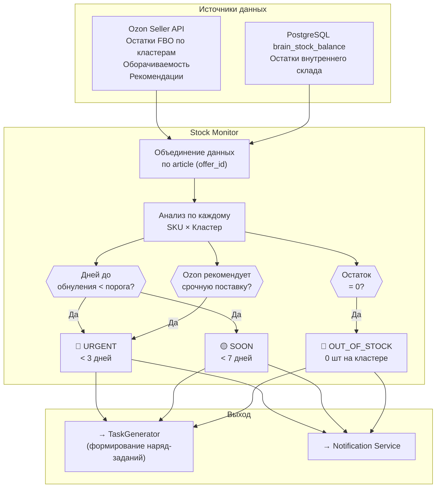
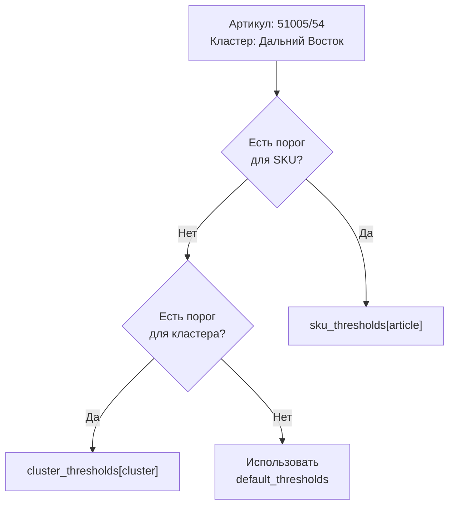
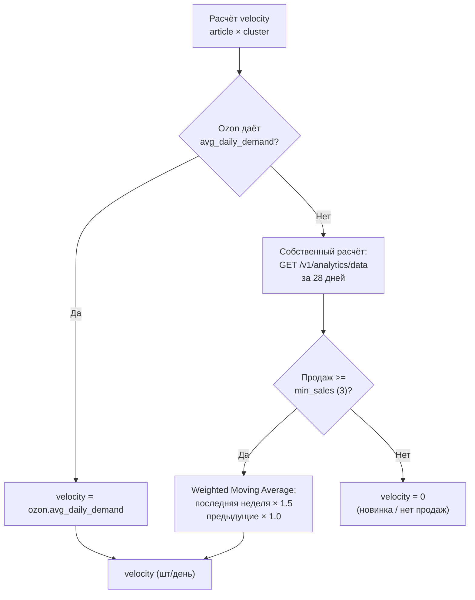

**Проект:** Интеллектуальная система управления логистикой маркетплейсов  
**Модуль:** Logistic / Stock Monitor  
**Версия:** 2.1  
**Дата:** Февраль 2026  
**Заменяет:** Раздел 3 v2.0

---

## 3.1 Назначение

### Описание

Stock Monitor — компонент модуля Logistic, отвечающий за:
- Отслеживание остатков FBO по 31 кластеру Ozon
- Отслеживание остатков внутреннего склада (из `brain_stock_balance`)
- Детекцию дефицита: дни до обнуления &lt; порога
- Сопоставление рекомендаций Ozon с внутренним прогнозом
- Генерацию алертов при достижении порогов
- Расчёт velocity (скорости продаж) по кластерам

### Dual-source мониторинг



---

## 3.2 Конфигурация порогов

### Уровни алертов

В v2.0 пороги основаны на **днях до обнуления**, а не на количестве штук — это учитывает скорость продаж конкретного SKU на конкретном кластере.

| Уровень | Порог (дней до 0) | Ozon-аналог | Описание |
|---------|-------------------|-------------|----------|
| 🔴 **Urgent** | &lt; 3 дней | «Срочно поставить» | Немедленная отгрузка |
| 🟡 **Soon** | &lt; 7 дней | «Скоро поставить» | Плановая отгрузка |
| 🟢 **Enough** | ≥ 7 дней | «Пока хватает» | Мониторинг |
| ⚪ **Skip** | Нет продаж | «Не поставлять» | Не требует поставки |

### Настраиваемые параметры

```python
@dataclass
class ClusterThresholds:
    """Пороги для кластера или SKU."""
    urgent_days: int = 3       # дней до обнуления → URGENT
    soon_days: int = 7         # дней до обнуления → SOON
    min_stock: int = 5         # абсолютный минимум (шт)
    safety_factor: float = 1.2 # коэффициент запаса


@dataclass
class StockMonitorConfig:
    """Конфигурация Stock Monitor v2.0."""
    
    # Глобальные пороги
    default_thresholds: ClusterThresholds = field(
        default_factory=ClusterThresholds
    )
    
    # Пороги по кластерам (опционально)
    cluster_thresholds: dict[str, ClusterThresholds] = field(
        default_factory=dict
    )
    
    # Пороги по SKU (высший приоритет)
    sku_thresholds: dict[str, ClusterThresholds] = field(
        default_factory=dict
    )
    
    # Приоритетные кластеры (основные регионы продаж)
    priority_clusters: list[str] = field(
        default_factory=lambda: [
            "Москва, МО и Дальние регионы",
            "Дальний Восток",
            "Урал и Западная Сибирь",
            "Юг",
            "Поволжье",
        ]
    )
    
    # Velocity
    velocity_window_days: int = 28     # период анализа
    min_sales_for_velocity: int = 3    # мин. продаж для расчёта
    
    # Использование рекомендаций Ozon
    use_ozon_recommendations: bool = True
    
    # Интеграция с 1С
    check_warehouse_availability: bool = True
```

### Иерархия порогов



---

## 3.3 Модель данных

### Cluster Stock Snapshot (Ozon)

```python
@dataclass
class ClusterStockSnapshot:
    """Снимок остатков FBO на кластере Ozon."""
    id: UUID
    snapshot_date: datetime
    ozon_sku: int
    article: str                   # offer_id = артикул 1С
    product_name: str
    cluster_name: str              # название кластера Ozon
    fbo_stock: int                 # доступно для продажи
    reserved: int                  # зарезервировано
    in_transit: int                # в пути на кластер
    avg_daily_sales: float | None  # среднесуточные продажи (из Ozon)
    days_to_zero: int | None       # дней до обнуления (из Ozon)
    ozon_recommendation: str | None  # рекомендация Ozon
    brand_id: str
    created_at: datetime


@dataclass
class WarehouseStockSnapshot:
    """Снимок остатков внутреннего склада (из brain_stock_balance)."""
    id: UUID
    article: str                   # артикул = offer_id Ozon
    product_name: str
    warehouse_stock: int           # остаток на складе (шт)
    balance_date: datetime         # дата остатка из brain_*
    brain_loaded_at: datetime      # время загрузки Экстрактором
    brand_id: str
```

### Stock Level (объединённый)

```python
@dataclass
class ClusterStockLevel:
    """Текущий уровень остатков с аналитикой (один SKU × один кластер)."""
    article: str
    ozon_sku: int
    product_name: str
    cluster_name: str
    
    # Остатки Ozon FBO
    fbo_stock: int
    reserved: int
    in_transit: int
    
    # Остатки 1С (внутренний склад)
    warehouse_stock: int | None
    
    # Аналитика
    velocity_per_day: float | None    # среднесуточные продажи
    days_until_zero: int | None       # дней до обнуления
    ozon_recommendation: str | None   # рекомендация Ozon
    
    # Расчётные поля
    status: str                       # urgent / soon / enough / skip / out_of_stock
    deficit: int                      # расчётный дефицит (шт)
    
    # Тренд
    stock_change_7d: int | None       # изменение FBO за 7 дней
    trend: str                        # up / down / stable


@dataclass
class ClusterSummary:
    """Сводка по кластеру."""
    cluster_name: str
    total_sku: int
    total_fbo_stock: int
    urgent_sku: int            # 🔴 < 3 дней
    soon_sku: int              # 🟡 < 7 дней
    enough_sku: int            # 🟢 норма
    out_of_stock_sku: int      # ⚫ 0 шт
```

---

## 3.4 Сервис Stock Monitor

### Основной класс

```python
import structlog
from typing import Optional
from datetime import datetime, timedelta
from uuid import uuid4, UUID

logger = structlog.get_logger("logistic.stock_monitor")


class StockMonitorService:
    """Сервис мониторинга остатков v2.1 (Ozon + brain_stock_balance)."""
    
    def __init__(
        self,
        ozon_adapter: OzonLogisticAdapter,
        stock_repo: StockRepository,
        brain_reader: BrainDataReader,
        analytics_repo: AnalyticsRepository,
        alert_service: AlertService,
        config: StockMonitorConfig
    ):
        self.ozon = ozon_adapter
        self.stock_repo = stock_repo
        self.import_repo = import_repo
        self.analytics_repo = analytics_repo
        self.alert_service = alert_service
        self.config = config
    
    async def sync_ozon_stocks(self) -> SyncResult:
        """
        Синхронизация остатков FBO с Ozon API.
        Вызывается Celery task каждые 30 минут.
        """
        logger.info("ozon_stock_sync_started")
        
        try:
            # 1. Получаем остатки по кластерам
            cluster_stocks = await self.ozon.stock_warehouses.get_all()
            
            # 2. Получаем оборачиваемость (дополнительные данные)
            turnover_data = await self.ozon.turnover.get_all()
            turnover_map = {t.sku: t for t in turnover_data}
            
            # 3. Обогащаем данными оборачиваемости
            snapshots = []
            for cs in cluster_stocks:
                turnover = turnover_map.get(cs.sku)
                snapshots.append(ClusterStockSnapshot(
                    id=uuid4(),
                    snapshot_date=datetime.now(),
                    ozon_sku=cs.sku,
                    article=cs.item_code,
                    product_name=cs.item_name,
                    cluster_name=cs.warehouse_name,
                    fbo_stock=cs.free_to_sell_amount,
                    reserved=cs.reserved_amount,
                    in_transit=cs.promised_amount,
                    avg_daily_sales=turnover.avg_daily_demand if turnover else None,
                    days_to_zero=turnover.stock_coverage_days if turnover else None,
                    ozon_recommendation=self._map_ozon_recommendation(turnover),
                    brand_id=self._detect_brand(cs.item_code),
                    created_at=datetime.now()
                ))
            
            # 4. Сохраняем snapshot
            await self.stock_repo.bulk_upsert_cluster_snapshots(snapshots)
            
            # 5. Анализируем и генерируем алерты
            alerts = await self._analyze_cluster_levels(snapshots)
            for alert in alerts:
                await self.alert_service.create_alert(alert)
            
            logger.info(
                "ozon_stock_sync_completed",
                clusters=len(set(s.cluster_name for s in snapshots)),
                sku_count=len(set(s.article for s in snapshots)),
                alerts_count=len(alerts)
            )
            
            return SyncResult(
                success=True,
                records_count=len(snapshots),
                alerts_count=len(alerts)
            )
            
        except Exception as e:
            logger.error("ozon_stock_sync_failed", error=str(e))
            raise
    
    def _map_ozon_recommendation(self, turnover: OzonTurnover | None) -> str | None:
        """Маппинг данных оборачиваемости в категорию рекомендации."""
        if not turnover:
            return None
        if turnover.stock_coverage_days <= 3:
            return "Срочно поставить"
        elif turnover.stock_coverage_days <= 7:
            return "Скоро поставить"
        elif turnover.avg_daily_demand > 0:
            return "Пока хватает"
        else:
            return "Не поставлять"
    
    async def _analyze_cluster_levels(
        self, snapshots: list[ClusterStockSnapshot]
    ) -> list[StockAlert]:
        """Анализ уровней остатков по кластерам."""
        alerts = []
        
        for snap in snapshots:
            # Фильтр: только приоритетные кластеры (если настроено)
            if (self.config.priority_clusters and
                snap.cluster_name not in self.config.priority_clusters):
                continue
            
            thresholds = self._get_thresholds(snap.article, snap.cluster_name)
            
            # Определяем статус
            days = snap.days_to_zero
            
            if snap.fbo_stock == 0:
                alerts.append(self._create_alert(
                    snap, AlertType.OUT_OF_STOCK, AlertSeverity.HIGH,
                    f"Товар закончился на кластере {snap.cluster_name}"
                ))
            elif days is not None and days < thresholds.urgent_days:
                alerts.append(self._create_alert(
                    snap, AlertType.URGENT_STOCK, AlertSeverity.HIGH,
                    f"Остаток на {days} дн. (порог: {thresholds.urgent_days}), "
                    f"кластер {snap.cluster_name}"
                ))
            elif days is not None and days < thresholds.soon_days:
                alerts.append(self._create_alert(
                    snap, AlertType.LOW_STOCK, AlertSeverity.MEDIUM,
                    f"Остаток на {days} дн. (порог: {thresholds.soon_days}), "
                    f"кластер {snap.cluster_name}"
                ))
            
            # Кросс-проверка с рекомендацией Ozon
            if (self.config.use_ozon_recommendations and
                snap.ozon_recommendation == "Срочно поставить" and
                days is not None and days >= thresholds.urgent_days):
                alerts.append(self._create_alert(
                    snap, AlertType.OZON_URGENT, AlertSeverity.MEDIUM,
                    f"Ozon рекомендует срочную поставку, "
                    f"наш расчёт: {days} дн. — проверить"
                ))
        
        return alerts
    
    def _get_thresholds(
        self, article: str, cluster_name: str
    ) -> ClusterThresholds:
        """Получение порогов с учётом иерархии."""
        if article in self.config.sku_thresholds:
            return self.config.sku_thresholds[article]
        if cluster_name in self.config.cluster_thresholds:
            return self.config.cluster_thresholds[cluster_name]
        return self.config.default_thresholds
    
    def _create_alert(
        self,
        snap: ClusterStockSnapshot,
        alert_type: AlertType,
        severity: AlertSeverity,
        message: str
    ) -> StockAlert:
        """Создание алерта."""
        return StockAlert(
            id=uuid4(),
            type=alert_type,
            severity=severity,
            article=snap.article,
            ozon_sku=snap.ozon_sku,
            cluster_name=snap.cluster_name,
            message=message,
            details={
                "fbo_stock": snap.fbo_stock,
                "days_to_zero": snap.days_to_zero,
                "avg_daily_sales": snap.avg_daily_sales,
                "ozon_recommendation": snap.ozon_recommendation,
                "cluster": snap.cluster_name
            },
            brand_id=snap.brand_id,
            created_at=datetime.now()
        )
```

---

## 3.5 Расчёт Velocity по кластерам

### Алгоритм



### Реализация

```python
@dataclass
class ClusterVelocity:
    """Скорость продаж на кластере."""
    article: str
    cluster_name: str
    velocity_per_day: float
    source: str                  # "ozon" | "calculated" | "none"
    sales_count: int | None
    period_days: int
    confidence: str              # high / medium / low


class VelocityCalculator:
    """Калькулятор скорости продаж v2.0."""
    
    def __init__(
        self,
        analytics_repo: AnalyticsRepository,
        config: StockMonitorConfig
    ):
        self.analytics_repo = analytics_repo
        self.config = config
    
    async def calculate(
        self,
        article: str,
        cluster_name: str,
        ozon_avg_daily: float | None = None
    ) -> ClusterVelocity:
        """
        Расчёт velocity с приоритетом данных Ozon.
        
        Приоритет: Ozon avg_daily_demand → собственный WMA → 0.
        """
        # Приоритет 1: данные Ozon
        if ozon_avg_daily is not None and ozon_avg_daily > 0:
            return ClusterVelocity(
                article=article,
                cluster_name=cluster_name,
                velocity_per_day=ozon_avg_daily,
                source="ozon",
                sales_count=None,
                period_days=self.config.velocity_window_days,
                confidence="high"
            )
        
        # Приоритет 2: собственный расчёт
        date_from = datetime.now() - timedelta(
            days=self.config.velocity_window_days
        )
        
        daily_sales = await self.analytics_repo.get_daily_sales(
            article=article,
            cluster_name=cluster_name,
            date_from=date_from
        )
        
        total_sales = sum(daily_sales.values()) if daily_sales else 0
        
        if total_sales < self.config.min_sales_for_velocity:
            return ClusterVelocity(
                article=article,
                cluster_name=cluster_name,
                velocity_per_day=0.0,
                source="none",
                sales_count=total_sales,
                period_days=self.config.velocity_window_days,
                confidence="none"
            )
        
        # Weighted Moving Average: последние 7 дней × 1.5
        velocity = self._weighted_moving_average(daily_sales)
        confidence = self._calc_confidence(total_sales)
        
        return ClusterVelocity(
            article=article,
            cluster_name=cluster_name,
            velocity_per_day=velocity,
            source="calculated",
            sales_count=total_sales,
            period_days=self.config.velocity_window_days,
            confidence=confidence
        )
    
    def _weighted_moving_average(
        self, daily_sales: dict[str, int]
    ) -> float:
        """WMA: последняя неделя весит в 1.5 раза больше."""
        if not daily_sales:
            return 0.0
        
        now = datetime.now().date()
        weighted_sum = 0.0
        weight_sum = 0.0
        
        for date_str, count in daily_sales.items():
            date = datetime.strptime(date_str, "%Y-%m-%d").date()
            days_ago = (now - date).days
            weight = 1.5 if days_ago <= 7 else 1.0
            weighted_sum += count * weight
            weight_sum += weight
        
        return weighted_sum / weight_sum if weight_sum > 0 else 0.0
    
    def _calc_confidence(self, total_sales: int) -> str:
        if total_sales >= 50:
            return "high"
        elif total_sales >= 15:
            return "medium"
        else:
            return "low"
    
    async def calculate_all_clusters(
        self, article: str
    ) -> dict[str, ClusterVelocity]:
        """Velocity по всем кластерам для одного артикула."""
        cluster_velocities = {}
        
        snapshots = await self.analytics_repo.get_latest_by_article(article)
        
        for snap in snapshots:
            vel = await self.calculate(
                article=article,
                cluster_name=snap.cluster_name,
                ozon_avg_daily=snap.avg_daily_sales
            )
            cluster_velocities[snap.cluster_name] = vel
        
        return cluster_velocities
```

---

## 3.6 Прогноз обнуления

### Модель прогноза

```python
@dataclass
class ClusterStockForecast:
    """Прогноз по остаткам на кластере."""
    article: str
    ozon_sku: int
    cluster_name: str
    current_fbo_stock: int
    in_transit: int
    velocity_per_day: float
    days_until_zero: float
    forecast_date_zero: datetime
    confidence: str
    ozon_recommendation: str | None
    warehouse_available: int | None   # доступно на складе 1С
    priority: str                     # urgent / soon / enough / skip


class StockForecaster:
    """Прогнозирование обнуления с учётом двух источников."""
    
    def __init__(
        self,
        velocity_calculator: VelocityCalculator,
        stock_repo: StockRepository
    ):
        self.velocity = velocity_calculator
        self.stock_repo = stock_repo
    
    async def forecast(
        self,
        article: str,
        ozon_sku: int,
        cluster_name: str,
        fbo_stock: int,
        in_transit: int = 0,
        ozon_avg_daily: float | None = None,
        ozon_recommendation: str | None = None
    ) -> ClusterStockForecast:
        """Прогноз с учётом наличия на складе 1С."""
        
        vel = await self.velocity.calculate(
            article, cluster_name, ozon_avg_daily
        )
        
        effective_stock = fbo_stock + in_transit
        
        if vel.velocity_per_day > 0:
            days = effective_stock / vel.velocity_per_day
        else:
            days = float('inf')
        
        forecast_date = (
            datetime.now() + timedelta(days=days)
            if days != float('inf')
            else None
        )
        
        # Проверяем наличие на внутреннем складе (из brain_stock_balance)
        warehouse_stock = await self.stock_repo.get_latest_stock(article)
        
        priority = self._determine_priority(days, ozon_recommendation)
        
        return ClusterStockForecast(
            article=article,
            ozon_sku=ozon_sku,
            cluster_name=cluster_name,
            current_fbo_stock=fbo_stock,
            in_transit=in_transit,
            velocity_per_day=vel.velocity_per_day,
            days_until_zero=days if days != float('inf') else -1,
            forecast_date_zero=forecast_date,
            confidence=vel.confidence,
            ozon_recommendation=ozon_recommendation,
            warehouse_available=warehouse_stock,
            priority=priority
        )
    
    def _determine_priority(
        self, days: float, ozon_rec: str | None
    ) -> str:
        """Определение приоритета с учётом рекомендации Ozon."""
        if days == float('inf') or days < 0:
            return "skip"
        
        # Ozon говорит «Срочно» → urgent
        if ozon_rec == "Срочно поставить" and days < 7:
            return "urgent"
        
        if days < 3:
            return "urgent"
        elif days < 7:
            return "soon"
        else:
            return "enough"
```

---

## 3.7 Агрегация по кластерам

### Сводка остатков

```python
@dataclass
class MonitoringSummary:
    """Общая сводка мониторинга (Ozon + 1С)."""
    timestamp: datetime
    
    # Ozon FBO
    total_sku: int
    total_clusters: int
    total_fbo_stock: int
    clusters: list[ClusterSummary]
    
    # 1С склад
    warehouse_total_sku: int
    warehouse_total_stock: int
    warehouse_last_import: datetime | None
    
    # Алерты
    urgent_count: int
    soon_count: int
    out_of_stock_count: int


class StockAggregator:
    """Агрегация остатков для dashboard v2.1."""
    
    def __init__(
        self,
        stock_repo: StockRepository,
        config: StockMonitorConfig
    ):
        self.stock_repo = stock_repo
        self.config = config
    
    async def get_summary(
        self, brand_id: str | None = None
    ) -> MonitoringSummary:
        """Получение сводки по всем кластерам + складу."""
        
        # Ozon FBO остатки
        cluster_stocks = await self.stock_repo.get_latest_cluster_stocks(
            brand_id=brand_id
        )
        
        # Остатки внутреннего склада (из brain_stock_balance)
        warehouse_stocks = await self.stock_repo.get_latest_stocks(
            brand_id=brand_id
        )
        last_sync = await self.stock_repo.get_last_sync_date()
        
        # Группируем по кластерам
        by_cluster: dict[str, list] = {}
        for cs in cluster_stocks:
            by_cluster.setdefault(cs.cluster_name, []).append(cs)
        
        cluster_summaries = []
        total_urgent = 0
        total_soon = 0
        total_oos = 0
        
        for cluster_name, stocks in by_cluster.items():
            urgent = sum(1 for s in stocks
                        if s.days_to_zero is not None and s.days_to_zero < 3)
            soon = sum(1 for s in stocks
                      if s.days_to_zero is not None and 3 <= s.days_to_zero < 7)
            oos = sum(1 for s in stocks if s.fbo_stock == 0)
            enough = len(stocks) - urgent - soon - oos
            
            total_urgent += urgent
            total_soon += soon
            total_oos += oos
            
            cluster_summaries.append(ClusterSummary(
                cluster_name=cluster_name,
                total_sku=len(stocks),
                total_fbo_stock=sum(s.fbo_stock for s in stocks),
                urgent_sku=urgent,
                soon_sku=soon,
                enough_sku=enough,
                out_of_stock_sku=oos
            ))
        
        # Сортируем: больше urgent → выше
        cluster_summaries.sort(
            key=lambda c: (c.urgent_sku, c.soon_sku),
            reverse=True
        )
        
        return MonitoringSummary(
            timestamp=datetime.now(),
            total_sku=len(set(s.article for s in cluster_stocks)),
            total_clusters=len(by_cluster),
            total_fbo_stock=sum(s.fbo_stock for s in cluster_stocks),
            clusters=cluster_summaries,
            warehouse_total_sku=len(warehouse_stocks),
            warehouse_total_stock=sum(
                s.warehouse_stock for s in warehouse_stocks
            ),
            warehouse_last_import=last_import,
            urgent_count=total_urgent,
            soon_count=total_soon,
            out_of_stock_count=total_oos
        )
    
    async def get_article_details(
        self, article: str
    ) -> list[ClusterStockLevel]:
        """Детализация остатков по артикулу (все кластеры)."""
        cluster_stocks = await self.stock_repo.get_by_article(article)
        warehouse_stock = await self.import_repo.get_latest_stock(article)
        
        results = []
        for cs in cluster_stocks:
            change_7d = await self.stock_repo.get_stock_change(
                article, cs.cluster_name, days=7
            )
            
            status = self._determine_status(cs)
            deficit = self._calc_deficit(cs)
            trend = self._determine_trend(change_7d)
            
            results.append(ClusterStockLevel(
                article=article,
                ozon_sku=cs.ozon_sku,
                product_name=cs.product_name,
                cluster_name=cs.cluster_name,
                fbo_stock=cs.fbo_stock,
                reserved=cs.reserved,
                in_transit=cs.in_transit,
                warehouse_stock=warehouse_stock,
                velocity_per_day=cs.avg_daily_sales,
                days_until_zero=cs.days_to_zero,
                ozon_recommendation=cs.ozon_recommendation,
                status=status,
                deficit=deficit,
                stock_change_7d=change_7d,
                trend=trend
            ))
        
        return sorted(results, key=lambda r: r.days_until_zero or 999)
    
    def _determine_status(self, snap: ClusterStockSnapshot) -> str:
        if snap.fbo_stock == 0:
            return "out_of_stock"
        if snap.days_to_zero is not None:
            if snap.days_to_zero < 3:
                return "urgent"
            elif snap.days_to_zero < 7:
                return "soon"
        if snap.ozon_recommendation == "Срочно поставить":
            return "urgent"
        return "enough"
    
    def _calc_deficit(self, snap: ClusterStockSnapshot) -> int:
        """Дефицит = (velocity × 14 дней) − FBO − в_пути."""
        if not snap.avg_daily_sales or snap.avg_daily_sales <= 0:
            return 0
        target = int(snap.avg_daily_sales * 14 * 1.2)  # safety factor
        available = snap.fbo_stock + snap.in_transit
        return max(0, target - available)
    
    def _determine_trend(self, change: int | None) -> str:
        if change is None:
            return "unknown"
        if change > 5:
            return "up"
        elif change < -5:
            return "down"
        return "stable"
```

---

## 3.8 Алерты

### Типы алертов Stock Monitor v2.0

| Тип | Severity | Триггер | Описание |
|-----|----------|---------|----------|
| `URGENT_STOCK` | HIGH | days_to_zero &lt; 3 | Критически мало, &lt; 3 дней |
| `LOW_STOCK` | MEDIUM | days_to_zero &lt; 7 | Скоро закончится, &lt; 7 дней |
| `OUT_OF_STOCK` | HIGH | fbo_stock = 0 | Товар закончился на кластере |
| `OZON_URGENT` | MEDIUM | Ozon: «Срочно», наш расчёт ≥ 7 | Расхождение с Ozon — проверить |
| `STOCK_RECOVERED` | LOW | был urgent → стал enough | Остаток восстановлен |
| `WAREHOUSE_LOW` | MEDIUM | warehouse_stock &lt; sum(deficit) | Недостаточно на складе 1С |

### Структура алерта

```python
class AlertType(Enum):
    URGENT_STOCK = "urgent_stock"
    LOW_STOCK = "low_stock"
    OUT_OF_STOCK = "out_of_stock"
    OZON_URGENT = "ozon_urgent"
    STOCK_RECOVERED = "stock_recovered"
    WAREHOUSE_LOW = "warehouse_low"


@dataclass
class StockAlert:
    """Алерт об остатках v2.0."""
    id: UUID
    type: AlertType
    severity: AlertSeverity
    article: str
    ozon_sku: int | None
    cluster_name: str
    message: str
    details: dict
    brand_id: str
    is_read: bool = False
    created_at: datetime = field(default_factory=datetime.now)
```

### Дедупликация алертов

```python
class AlertDeduplicator:
    """Предотвращение дублирования алертов."""
    
    def __init__(self, redis_client: redis.Redis, ttl_hours: int = 12):
        self.redis = redis_client
        self.ttl = ttl_hours * 3600
    
    async def should_create_alert(self, alert: StockAlert) -> bool:
        key = f"logistic:alert_dedup:{alert.type.value}:{alert.article}:{alert.cluster_name}"
        
        if await self.redis.exists(key):
            return False
        
        await self.redis.setex(key, self.ttl, "1")
        return True
```

---

## 3.9 API Endpoints

### REST API

```python
from fastapi import APIRouter, Depends, Query

router = APIRouter(prefix="/logistic/stocks", tags=["Logistic Stocks"])


@router.get("/summary")
async def get_stocks_summary(
    brand_id: str | None = Query(None),
    aggregator: StockAggregator = Depends(get_stock_aggregator),
    current_user: User = Depends(get_current_user)
) -> MonitoringSummary:
    """Сводка: все кластеры + склад 1С."""
    effective_brand = brand_id or current_user.brand_id
    return await aggregator.get_summary(brand_id=effective_brand)


@router.get("/by-article/{article}")
async def get_stock_by_article(
    article: str,
    aggregator: StockAggregator = Depends(get_stock_aggregator)
) -> list[ClusterStockLevel]:
    """Остатки артикула по всем кластерам."""
    return await aggregator.get_article_details(article)


@router.get("/by-cluster/{cluster_name}")
async def get_stock_by_cluster(
    cluster_name: str,
    status: str | None = Query(None),
    limit: int = Query(100, le=1000),
    offset: int = Query(0),
    repo: StockRepository = Depends(get_stock_repo),
    current_user: User = Depends(get_current_user)
) -> list[ClusterStockLevel]:
    """Все SKU на кластере."""
    return await repo.get_by_cluster(
        cluster_name=cluster_name,
        status=status,
        brand_id=current_user.brand_id,
        limit=limit, offset=offset
    )


@router.get("/urgent")
async def get_urgent_stocks(
    brand_id: str | None = Query(None),
    aggregator: StockAggregator = Depends(get_stock_aggregator),
    current_user: User = Depends(get_current_user)
) -> list[ClusterStockLevel]:
    """Все SKU со статусом urgent + out_of_stock."""
    effective_brand = brand_id or current_user.brand_id
    return await aggregator.get_by_status(
        statuses=["urgent", "out_of_stock"],
        brand_id=effective_brand
    )


@router.get("/forecast/{article}")
async def get_stock_forecast(
    article: str,
    forecaster: StockForecaster = Depends(get_forecaster),
    repo: StockRepository = Depends(get_stock_repo)
) -> list[ClusterStockForecast]:
    """Прогноз обнуления по всем кластерам."""
    stocks = await repo.get_by_article(article)
    
    forecasts = []
    for s in stocks:
        f = await forecaster.forecast(
            article=s.article,
            ozon_sku=s.ozon_sku,
            cluster_name=s.cluster_name,
            fbo_stock=s.fbo_stock,
            in_transit=s.in_transit,
            ozon_avg_daily=s.avg_daily_sales,
            ozon_recommendation=s.ozon_recommendation
        )
        forecasts.append(f)
    
    return sorted(forecasts, key=lambda f: f.days_until_zero)


@router.get("/warehouse")
async def get_warehouse_stocks(
    brand_id: str | None = Query(None),
    stock_repo: StockRepository = Depends(get_stock_repo),
    current_user: User = Depends(get_current_user)
) -> list[WarehouseStockSnapshot]:
    """Текущие остатки на внутреннем складе (из brain_stock_balance)."""
    effective_brand = brand_id or current_user.brand_id
    return await stock_repo.get_latest_stocks(brand_id=effective_brand)
```

---

## 3.10 Celery Tasks

### Периодические задачи

```python
from celery import shared_task
from celery.schedules import crontab

CELERY_BEAT_SCHEDULE = {
    "sync-ozon-stocks-every-30-min": {
        "task": "logistic.tasks.sync_ozon_stocks",
        "schedule": crontab(minute="*/30"),
    },
    "cleanup-old-snapshots-daily": {
        "task": "logistic.tasks.cleanup_snapshots",
        "schedule": crontab(hour=3, minute=0),
    },
}


@shared_task(
    bind=True,
    max_retries=3,
    default_retry_delay=300,
    autoretry_for=(OzonAPIError,)
)
def sync_ozon_stocks(self):
    """
    Синхронизация остатков FBO с Ozon API.
    Каждые 30 минут.
    """
    import asyncio
    from .dependencies import get_stock_monitor_service
    
    async def _sync():
        service = get_stock_monitor_service()
        return await service.sync_ozon_stocks()
    
    result = asyncio.run(_sync())
    
    return {
        "success": result.success,
        "records_count": result.records_count,
        "alerts_count": result.alerts_count
    }


@shared_task
def cleanup_snapshots(days_to_keep: int = 90):
    """Очистка старых снимков. Ежедневно 03:00."""
    import asyncio
    from .dependencies import get_stock_repo
    
    async def _cleanup():
        repo = get_stock_repo()
        cutoff = datetime.now() - timedelta(days=days_to_keep)
        return await repo.delete_snapshots_before(cutoff)
    
    return {"deleted_count": asyncio.run(_cleanup())}
```

---

## 3.11 Промпт для Claude Code

```
Реализуй Stock Monitor Service для модуля Logistic согласно 
adolf_logistic_3_stock_monitor_v2_0.md

Требования:
1. StockMonitorService: sync_ozon_stocks() — получает остатки FBO по кластерам + 
   оборачиваемость, сохраняет snapshots, генерирует алерты
2. VelocityCalculator: приоритет — Ozon avg_daily_demand, fallback — WMA 28 дней
3. StockForecaster: прогноз с учётом наличия на складе (из brain_stock_balance)
4. StockAggregator: сводка по кластерам + внутренний склад, детализация по артикулу
5. Пороги: days-based (urgent < 3, soon < 7), иерархия SKU → cluster → default
6. Алерты: дедупликация Redis, типы URGENT/LOW/OOS/OZON_URGENT/WAREHOUSE_LOW
7. API: /summary, /by-article/{article}, /by-cluster/{cluster}, /urgent, 
   /forecast/{article}, /warehouse
8. Celery: sync каждые 30 мин, cleanup ежедневно

Зависимости: OzonLogisticAdapter (из раздела 2), BrainDataReader (из раздела 5 v3.0),
StockRepository, AnalyticsRepository
```

---

**Документ подготовлен:** Февраль 2026  
**Версия:** 2.1  
**Статус:** Черновик  
**Заменяет:** Раздел 3 v2.0

