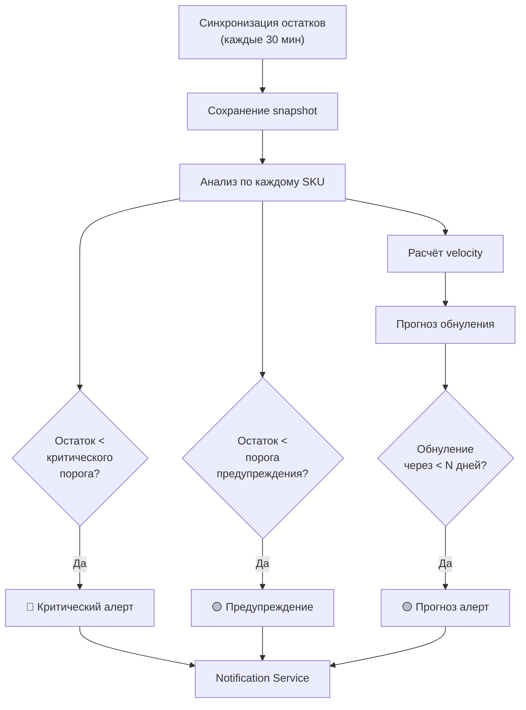
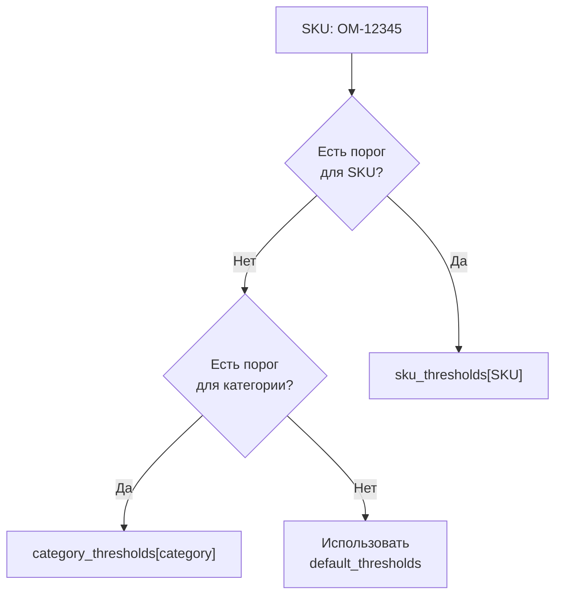
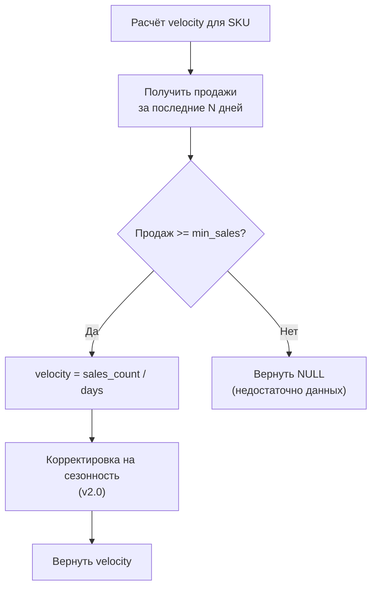

# ADOLF LOGISTIC — Раздел 3: Stock Monitor

**Проект:** Интеллектуальная система управления логистикой маркетплейсов  
**Модуль:** Logistic / Stock Monitor  
**Версия:** 1.0  
**Дата:** Январь 2026

---

## 3.1 Назначение

### Описание

Stock Monitor — компонент модуля Logistic, отвечающий за:
- Отслеживание остатков по всем складам WB
- Детекцию критических уровней запасов
- Генерацию алертов при достижении порогов
- Расчёт velocity (скорости продаж)
- Прогноз времени до обнуления

### Бизнес-логика



---

## 3.2 Конфигурация порогов

### Уровни алертов

| Уровень | Порог по умолчанию | Описание |
|---------|-------------------|----------|
| 🔴 **Critical** | < 10 шт | Срочное пополнение |
| 🟡 **Warning** | < 30 шт | Плановое пополнение |
| 🟢 **Normal** | ≥ 30 шт | Норма |

### Настраиваемые параметры

```python
@dataclass
class StockThresholds:
    """Пороги для SKU или группы."""
    critical: int = 10
    warning: int = 30
    forecast_days: int = 7  # алерт если обнуление через N дней


@dataclass 
class StockMonitorConfig:
    """Конфигурация Stock Monitor."""
    
    # Глобальные пороги
    default_thresholds: StockThresholds = field(
        default_factory=StockThresholds
    )
    
    # Пороги по категориям (опционально)
    category_thresholds: dict[str, StockThresholds] = field(
        default_factory=dict
    )
    
    # Пороги по SKU (опционально, высший приоритет)
    sku_thresholds: dict[str, StockThresholds] = field(
        default_factory=dict
    )
    
    # Ключевые склады для мониторинга
    priority_warehouses: list[str] = field(
        default_factory=lambda: [
            "Коледино", "Краснодар", "Казань", 
            "Екатеринбург", "Новосибирск"
        ]
    )
    
    # Минимальный объём продаж для расчёта velocity
    min_sales_for_velocity: int = 5
    
    # Период для расчёта velocity (дни)
    velocity_window_days: int = 14
```

### Иерархия порогов



---

## 3.3 Модель данных

### Stock Snapshot

```python
@dataclass
class StockSnapshot:
    """Снимок остатков на момент времени."""
    id: UUID
    snapshot_date: datetime
    sku: str
    nm_id: int
    barcode: str
    size: str
    warehouse_name: str
    warehouse_id: Optional[int]
    quantity: int
    in_way_to_client: int
    in_way_from_client: int
    quantity_full: int
    brand_id: str
    created_at: datetime


@dataclass
class StockLevel:
    """Текущий уровень остатков с аналитикой."""
    sku: str
    size: str
    warehouse_name: str
    quantity: int
    quantity_full: int
    
    # Расчётные поля
    velocity_per_day: Optional[float]  # продаж в день
    days_until_zero: Optional[int]     # прогноз обнуления
    status: str                         # critical/warning/normal
    
    # Тренд
    quantity_change_7d: Optional[int]   # изменение за 7 дней
    trend: str                          # up/down/stable


@dataclass
class WarehouseStock:
    """Остатки по складу."""
    warehouse_name: str
    warehouse_id: Optional[int]
    total_quantity: int
    sku_count: int
    critical_count: int
    warning_count: int
    stocks: list[StockLevel]
```

---

## 3.4 Сервис Stock Monitor

### Основной класс

```python
from typing import Optional
from datetime import datetime, timedelta
from uuid import UUID
import structlog

logger = structlog.get_logger("logistic.stock_monitor")


class StockMonitorService:
    """Сервис мониторинга остатков."""
    
    def __init__(
        self,
        wb_adapter: WBLogisticAdapter,
        stock_repo: StockRepository,
        sales_repo: SalesRepository,
        alert_service: AlertService,
        config: StockMonitorConfig
    ):
        self.wb_adapter = wb_adapter
        self.stock_repo = stock_repo
        self.sales_repo = sales_repo
        self.alert_service = alert_service
        self.config = config
    
    async def sync_stocks(self) -> SyncResult:
        """
        Синхронизация остатков с WB API.
        
        Вызывается Celery task каждые 30 минут.
        """
        logger.info("stock_sync_started")
        
        try:
            # 1. Получаем остатки из WB
            stocks = await self.wb_adapter.get_stocks()
            
            # 2. Сохраняем snapshot
            snapshot_id = await self._save_snapshot(stocks)
            
            # 3. Анализируем уровни
            alerts = await self._analyze_levels(stocks)
            
            # 4. Отправляем алерты
            for alert in alerts:
                await self.alert_service.create_alert(alert)
            
            logger.info(
                "stock_sync_completed",
                stocks_count=len(stocks),
                alerts_count=len(alerts),
                snapshot_id=str(snapshot_id)
            )
            
            return SyncResult(
                success=True,
                stocks_count=len(stocks),
                alerts_count=len(alerts)
            )
            
        except Exception as e:
            logger.error("stock_sync_failed", error=str(e))
            raise
    
    async def _save_snapshot(self, stocks: list[Stock]) -> UUID:
        """Сохранение снимка остатков."""
        snapshot_date = datetime.now()
        
        snapshots = [
            StockSnapshot(
                id=uuid4(),
                snapshot_date=snapshot_date,
                sku=s.sku,
                nm_id=s.nm_id,
                barcode=s.barcode,
                size=s.size,
                warehouse_name=s.warehouse_name,
                warehouse_id=None,  # заполняется из справочника
                quantity=s.quantity,
                in_way_to_client=s.in_way_to_client,
                in_way_from_client=s.in_way_from_client,
                quantity_full=s.quantity_full,
                brand_id=self._detect_brand(s.brand),
                created_at=datetime.now()
            )
            for s in stocks
        ]
        
        await self.stock_repo.bulk_insert_snapshots(snapshots)
        
        return snapshots[0].id if snapshots else None
    
    async def _analyze_levels(self, stocks: list[Stock]) -> list[Alert]:
        """Анализ уровней остатков и генерация алертов."""
        alerts = []
        
        # Группируем по SKU + size
        grouped = self._group_by_sku_size(stocks)
        
        for (sku, size), warehouse_stocks in grouped.items():
            for ws in warehouse_stocks:
                # Пропускаем неприоритетные склады
                if ws.warehouse_name not in self.config.priority_warehouses:
                    continue
                
                # Получаем пороги
                thresholds = self._get_thresholds(sku, ws.category)
                
                # Проверяем критический уровень
                if ws.quantity < thresholds.critical:
                    alert = await self._create_critical_alert(
                        sku, size, ws, thresholds
                    )
                    alerts.append(alert)
                
                # Проверяем предупреждение
                elif ws.quantity < thresholds.warning:
                    alert = await self._create_warning_alert(
                        sku, size, ws, thresholds
                    )
                    alerts.append(alert)
                
                # Проверяем прогноз обнуления
                velocity = await self._calculate_velocity(sku, size)
                if velocity and velocity > 0:
                    days_until_zero = ws.quantity / velocity
                    
                    if days_until_zero < thresholds.forecast_days:
                        alert = await self._create_forecast_alert(
                            sku, size, ws, days_until_zero, velocity
                        )
                        alerts.append(alert)
        
        return alerts
    
    async def _calculate_velocity(
        self, 
        sku: str, 
        size: str
    ) -> Optional[float]:
        """
        Расчёт скорости продаж (единиц в день).
        
        Использует данные продаж за последние N дней.
        """
        date_from = datetime.now() - timedelta(
            days=self.config.velocity_window_days
        )
        
        sales = await self.sales_repo.get_sales_count(
            sku=sku,
            size=size,
            date_from=date_from
        )
        
        if sales < self.config.min_sales_for_velocity:
            return None
        
        return sales / self.config.velocity_window_days
    
    def _get_thresholds(
        self, 
        sku: str, 
        category: Optional[str]
    ) -> StockThresholds:
        """Получение порогов с учётом иерархии."""
        # Приоритет 1: SKU-specific
        if sku in self.config.sku_thresholds:
            return self.config.sku_thresholds[sku]
        
        # Приоритет 2: Category-specific
        if category and category in self.config.category_thresholds:
            return self.config.category_thresholds[category]
        
        # Приоритет 3: Default
        return self.config.default_thresholds
    
    async def _create_critical_alert(
        self,
        sku: str,
        size: str,
        stock: Stock,
        thresholds: StockThresholds
    ) -> Alert:
        """Создание критического алерта."""
        return Alert(
            id=uuid4(),
            type=AlertType.CRITICAL_STOCK,
            severity=AlertSeverity.HIGH,
            sku=sku,
            size=size,
            warehouse_name=stock.warehouse_name,
            message=f"Критический остаток: {stock.quantity} шт (порог: {thresholds.critical})",
            details={
                "quantity": stock.quantity,
                "threshold": thresholds.critical,
                "warehouse": stock.warehouse_name
            },
            brand_id=self._detect_brand(stock.brand),
            created_at=datetime.now()
        )
```

---

## 3.5 Расчёт Velocity

### Алгоритм



### Реализация

```python
@dataclass
class VelocityResult:
    """Результат расчёта velocity."""
    sku: str
    size: str
    velocity_per_day: float
    sales_count: int
    period_days: int
    confidence: str  # high/medium/low
    
    @property
    def velocity_per_week(self) -> float:
        return self.velocity_per_day * 7


class VelocityCalculator:
    """Калькулятор скорости продаж."""
    
    def __init__(
        self,
        sales_repo: SalesRepository,
        config: StockMonitorConfig
    ):
        self.sales_repo = sales_repo
        self.config = config
    
    async def calculate(
        self,
        sku: str,
        size: str,
        warehouse_name: Optional[str] = None
    ) -> Optional[VelocityResult]:
        """
        Расчёт velocity с учётом confidence.
        
        Args:
            sku: Артикул
            size: Размер
            warehouse_name: Склад (опционально, для региональной velocity)
        """
        date_from = datetime.now() - timedelta(
            days=self.config.velocity_window_days
        )
        
        sales_count = await self.sales_repo.get_sales_count(
            sku=sku,
            size=size,
            warehouse_name=warehouse_name,
            date_from=date_from
        )
        
        if sales_count < self.config.min_sales_for_velocity:
            return None
        
        velocity = sales_count / self.config.velocity_window_days
        
        # Определяем confidence
        confidence = self._calculate_confidence(sales_count)
        
        return VelocityResult(
            sku=sku,
            size=size,
            velocity_per_day=velocity,
            sales_count=sales_count,
            period_days=self.config.velocity_window_days,
            confidence=confidence
        )
    
    def _calculate_confidence(self, sales_count: int) -> str:
        """Определение уровня уверенности."""
        if sales_count >= 50:
            return "high"
        elif sales_count >= 20:
            return "medium"
        else:
            return "low"
    
    async def calculate_by_region(
        self,
        sku: str,
        size: str
    ) -> dict[str, VelocityResult]:
        """Расчёт velocity в разрезе регионов."""
        # Получаем продажи с группировкой по регионам
        regional_sales = await self.sales_repo.get_sales_by_region(
            sku=sku,
            size=size,
            date_from=datetime.now() - timedelta(
                days=self.config.velocity_window_days
            )
        )
        
        results = {}
        for region, count in regional_sales.items():
            if count >= self.config.min_sales_for_velocity:
                velocity = count / self.config.velocity_window_days
                results[region] = VelocityResult(
                    sku=sku,
                    size=size,
                    velocity_per_day=velocity,
                    sales_count=count,
                    period_days=self.config.velocity_window_days,
                    confidence=self._calculate_confidence(count)
                )
        
        return results
```

---

## 3.6 Прогноз обнуления

### Модель прогноза

```python
@dataclass
class StockForecast:
    """Прогноз по остаткам."""
    sku: str
    size: str
    warehouse_name: str
    current_quantity: int
    velocity_per_day: float
    days_until_zero: float
    forecast_date_zero: datetime
    confidence: str
    recommendation: str


class StockForecaster:
    """Прогнозирование обнуления остатков."""
    
    def __init__(self, velocity_calculator: VelocityCalculator):
        self.velocity_calculator = velocity_calculator
    
    async def forecast(
        self,
        sku: str,
        size: str,
        warehouse_name: str,
        current_quantity: int
    ) -> Optional[StockForecast]:
        """Прогноз времени до обнуления."""
        velocity = await self.velocity_calculator.calculate(
            sku, size, warehouse_name
        )
        
        if not velocity or velocity.velocity_per_day <= 0:
            return None
        
        days_until_zero = current_quantity / velocity.velocity_per_day
        forecast_date = datetime.now() + timedelta(days=days_until_zero)
        
        recommendation = self._generate_recommendation(
            days_until_zero, velocity.confidence
        )
        
        return StockForecast(
            sku=sku,
            size=size,
            warehouse_name=warehouse_name,
            current_quantity=current_quantity,
            velocity_per_day=velocity.velocity_per_day,
            days_until_zero=days_until_zero,
            forecast_date_zero=forecast_date,
            confidence=velocity.confidence,
            recommendation=recommendation
        )
    
    def _generate_recommendation(
        self,
        days_until_zero: float,
        confidence: str
    ) -> str:
        """Генерация рекомендации."""
        if days_until_zero < 3:
            return "URGENT: Срочная поставка требуется в течение 1-2 дней"
        elif days_until_zero < 7:
            return "HIGH: Запланируйте поставку на ближайшую неделю"
        elif days_until_zero < 14:
            return "MEDIUM: Рекомендуется пополнение в течение 2 недель"
        else:
            return "LOW: Запас достаточен, мониторинг продолжается"
```

---

## 3.7 Агрегация по складам

### Сводка остатков

```python
@dataclass
class WarehouseSummary:
    """Сводка по складу."""
    warehouse_name: str
    total_sku: int
    total_quantity: int
    critical_sku: int
    warning_sku: int
    normal_sku: int
    out_of_stock_sku: int


@dataclass
class StockSummary:
    """Общая сводка по остаткам."""
    timestamp: datetime
    total_sku: int
    total_quantity: int
    warehouses: list[WarehouseSummary]
    critical_alerts: int
    warning_alerts: int


class StockAggregator:
    """Агрегация остатков для dashboard."""
    
    def __init__(
        self,
        stock_repo: StockRepository,
        config: StockMonitorConfig
    ):
        self.stock_repo = stock_repo
        self.config = config
    
    async def get_summary(self, brand_id: Optional[str] = None) -> StockSummary:
        """Получение сводки по остаткам."""
        stocks = await self.stock_repo.get_latest_stocks(brand_id=brand_id)
        
        # Группируем по складам
        by_warehouse: dict[str, list[Stock]] = {}
        for stock in stocks:
            wh = stock.warehouse_name
            if wh not in by_warehouse:
                by_warehouse[wh] = []
            by_warehouse[wh].append(stock)
        
        warehouse_summaries = []
        total_critical = 0
        total_warning = 0
        
        for warehouse_name, wh_stocks in by_warehouse.items():
            critical = 0
            warning = 0
            normal = 0
            out_of_stock = 0
            
            for s in wh_stocks:
                thresholds = self._get_thresholds(s.sku, s.category)
                
                if s.quantity == 0:
                    out_of_stock += 1
                elif s.quantity < thresholds.critical:
                    critical += 1
                elif s.quantity < thresholds.warning:
                    warning += 1
                else:
                    normal += 1
            
            total_critical += critical
            total_warning += warning
            
            warehouse_summaries.append(WarehouseSummary(
                warehouse_name=warehouse_name,
                total_sku=len(wh_stocks),
                total_quantity=sum(s.quantity for s in wh_stocks),
                critical_sku=critical,
                warning_sku=warning,
                normal_sku=normal,
                out_of_stock_sku=out_of_stock
            ))
        
        return StockSummary(
            timestamp=datetime.now(),
            total_sku=len(set((s.sku, s.size) for s in stocks)),
            total_quantity=sum(s.quantity for s in stocks),
            warehouses=warehouse_summaries,
            critical_alerts=total_critical,
            warning_alerts=total_warning
        )
    
    async def get_sku_details(
        self,
        sku: str,
        size: Optional[str] = None
    ) -> list[StockLevel]:
        """Детализация остатков по SKU."""
        stocks = await self.stock_repo.get_stocks_by_sku(sku, size)
        
        results = []
        for s in stocks:
            velocity = await self._get_velocity(s.sku, s.size)
            days_until_zero = None
            
            if velocity and velocity > 0:
                days_until_zero = int(s.quantity / velocity)
            
            thresholds = self._get_thresholds(s.sku, s.category)
            status = self._determine_status(s.quantity, thresholds)
            
            # Получаем тренд
            change_7d = await self._get_quantity_change(s.sku, s.size, s.warehouse_name, 7)
            trend = self._determine_trend(change_7d)
            
            results.append(StockLevel(
                sku=s.sku,
                size=s.size,
                warehouse_name=s.warehouse_name,
                quantity=s.quantity,
                quantity_full=s.quantity_full,
                velocity_per_day=velocity,
                days_until_zero=days_until_zero,
                status=status,
                quantity_change_7d=change_7d,
                trend=trend
            ))
        
        return results
    
    def _determine_status(
        self,
        quantity: int,
        thresholds: StockThresholds
    ) -> str:
        """Определение статуса остатка."""
        if quantity == 0:
            return "out_of_stock"
        elif quantity < thresholds.critical:
            return "critical"
        elif quantity < thresholds.warning:
            return "warning"
        else:
            return "normal"
    
    def _determine_trend(self, change: Optional[int]) -> str:
        """Определение тренда."""
        if change is None:
            return "unknown"
        elif change > 5:
            return "up"
        elif change < -5:
            return "down"
        else:
            return "stable"
```

---

## 3.8 Алерты

### Типы алертов Stock Monitor

| Тип | Severity | Триггер | Сообщение |
|-----|----------|---------|-----------|
| `CRITICAL_STOCK` | HIGH | quantity < critical | Критический остаток на складе |
| `LOW_STOCK` | MEDIUM | quantity < warning | Низкий остаток на складе |
| `FORECAST_ZERO` | MEDIUM | days_until_zero < N | Прогноз обнуления через N дней |
| `OUT_OF_STOCK` | HIGH | quantity = 0 | Товар закончился на складе |
| `STOCK_RECOVERED` | LOW | был critical → стал normal | Остаток восстановлен |

### Структура алерта

```python
class AlertType(Enum):
    CRITICAL_STOCK = "critical_stock"
    LOW_STOCK = "low_stock"
    FORECAST_ZERO = "forecast_zero"
    OUT_OF_STOCK = "out_of_stock"
    STOCK_RECOVERED = "stock_recovered"


class AlertSeverity(Enum):
    HIGH = "high"
    MEDIUM = "medium"
    LOW = "low"


@dataclass
class StockAlert:
    """Алерт об остатках."""
    id: UUID
    type: AlertType
    severity: AlertSeverity
    sku: str
    size: str
    warehouse_name: str
    message: str
    details: dict
    brand_id: str
    is_read: bool = False
    created_at: datetime = field(default_factory=datetime.now)
```

### Дедупликация алертов

```python
class AlertDeduplicator:
    """Предотвращение дублирования алертов."""
    
    def __init__(self, redis_client: redis.Redis, ttl_hours: int = 24):
        self.redis = redis_client
        self.ttl = ttl_hours * 3600
    
    async def should_create_alert(self, alert: StockAlert) -> bool:
        """Проверка, нужно ли создавать алерт."""
        key = self._make_key(alert)
        
        exists = await self.redis.exists(key)
        if exists:
            return False
        
        # Устанавливаем флаг
        await self.redis.setex(key, self.ttl, "1")
        return True
    
    def _make_key(self, alert: StockAlert) -> str:
        """Формирование ключа для дедупликации."""
        return f"logistic:alert_dedup:{alert.type.value}:{alert.sku}:{alert.size}:{alert.warehouse_name}"
```

---

## 3.9 API Endpoints

### REST API

```python
from fastapi import APIRouter, Depends, Query
from typing import Optional

router = APIRouter(prefix="/logistic/stocks", tags=["Logistic Stocks"])


@router.get("/summary")
async def get_stocks_summary(
    brand_id: Optional[str] = Query(None, description="Фильтр по бренду"),
    aggregator: StockAggregator = Depends(get_stock_aggregator),
    current_user: User = Depends(get_current_user)
) -> StockSummary:
    """
    Сводка по остаткам.
    
    Возвращает агрегированную информацию по всем складам.
    """
    # Применяем фильтр бренда из middleware
    effective_brand = brand_id or current_user.brand_id
    
    return await aggregator.get_summary(brand_id=effective_brand)


@router.get("/by-sku/{sku}")
async def get_stock_by_sku(
    sku: str,
    size: Optional[str] = Query(None, description="Фильтр по размеру"),
    aggregator: StockAggregator = Depends(get_stock_aggregator),
    current_user: User = Depends(get_current_user)
) -> list[StockLevel]:
    """
    Остатки по SKU.
    
    Возвращает остатки по всем складам для указанного артикула.
    """
    return await aggregator.get_sku_details(sku, size)


@router.get("/by-warehouse/{warehouse_name}")
async def get_stock_by_warehouse(
    warehouse_name: str,
    status: Optional[str] = Query(None, description="Фильтр по статусу"),
    limit: int = Query(100, le=1000),
    offset: int = Query(0),
    repo: StockRepository = Depends(get_stock_repo),
    current_user: User = Depends(get_current_user)
) -> list[StockLevel]:
    """
    Остатки по складу.
    
    Возвращает все SKU на указанном складе.
    """
    return await repo.get_stocks_by_warehouse(
        warehouse_name=warehouse_name,
        status=status,
        brand_id=current_user.brand_id,
        limit=limit,
        offset=offset
    )


@router.get("/critical")
async def get_critical_stocks(
    brand_id: Optional[str] = Query(None),
    aggregator: StockAggregator = Depends(get_stock_aggregator),
    current_user: User = Depends(get_current_user)
) -> list[StockLevel]:
    """
    Критические остатки.
    
    Возвращает все SKU с критическим уровнем остатков.
    """
    effective_brand = brand_id or current_user.brand_id
    
    summary = await aggregator.get_summary(brand_id=effective_brand)
    
    critical_stocks = []
    for wh in summary.warehouses:
        stocks = await aggregator.get_stocks_by_warehouse_and_status(
            warehouse_name=wh.warehouse_name,
            status="critical",
            brand_id=effective_brand
        )
        critical_stocks.extend(stocks)
    
    return critical_stocks


@router.get("/forecast/{sku}")
async def get_stock_forecast(
    sku: str,
    size: Optional[str] = Query(None),
    forecaster: StockForecaster = Depends(get_forecaster),
    repo: StockRepository = Depends(get_stock_repo)
) -> list[StockForecast]:
    """
    Прогноз обнуления.
    
    Возвращает прогноз для указанного SKU по всем складам.
    """
    stocks = await repo.get_stocks_by_sku(sku, size)
    
    forecasts = []
    for stock in stocks:
        forecast = await forecaster.forecast(
            sku=stock.sku,
            size=stock.size,
            warehouse_name=stock.warehouse_name,
            current_quantity=stock.quantity
        )
        if forecast:
            forecasts.append(forecast)
    
    return sorted(forecasts, key=lambda f: f.days_until_zero)
```

---

## 3.10 Celery Tasks

### Периодические задачи

```python
from celery import shared_task
from celery.schedules import crontab

# Регистрация в celery beat
CELERY_BEAT_SCHEDULE = {
    "sync-stocks-every-30-min": {
        "task": "logistic.tasks.sync_stocks",
        "schedule": crontab(minute="*/30"),
    },
    "cleanup-old-snapshots-daily": {
        "task": "logistic.tasks.cleanup_snapshots",
        "schedule": crontab(hour=3, minute=0),
    },
}


@shared_task(
    bind=True,
    max_retries=3,
    default_retry_delay=300,
    autoretry_for=(WBAPIError,)
)
def sync_stocks(self):
    """
    Синхронизация остатков с WB API.
    
    Запускается каждые 30 минут.
    """
    import asyncio
    from .dependencies import get_stock_monitor_service
    
    async def _sync():
        service = get_stock_monitor_service()
        return await service.sync_stocks()
    
    result = asyncio.run(_sync())
    
    return {
        "success": result.success,
        "stocks_count": result.stocks_count,
        "alerts_count": result.alerts_count
    }


@shared_task
def cleanup_snapshots(days_to_keep: int = 90):
    """
    Очистка старых снимков остатков.
    
    Запускается ежедневно в 03:00.
    """
    import asyncio
    from .dependencies import get_stock_repo
    
    async def _cleanup():
        repo = get_stock_repo()
        cutoff = datetime.now() - timedelta(days=days_to_keep)
        deleted = await repo.delete_snapshots_before(cutoff)
        return deleted
    
    deleted_count = asyncio.run(_cleanup())
    
    return {"deleted_count": deleted_count}
```

---

**Документ подготовлен:** Январь 2026  
**Версия:** 1.0  
**Статус:** Черновик
