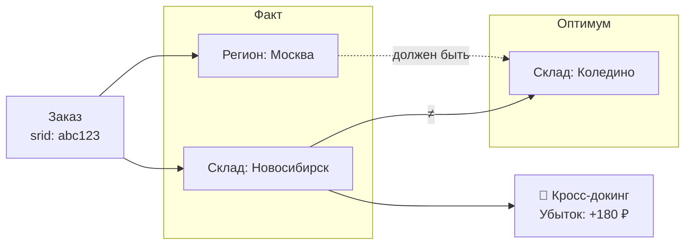
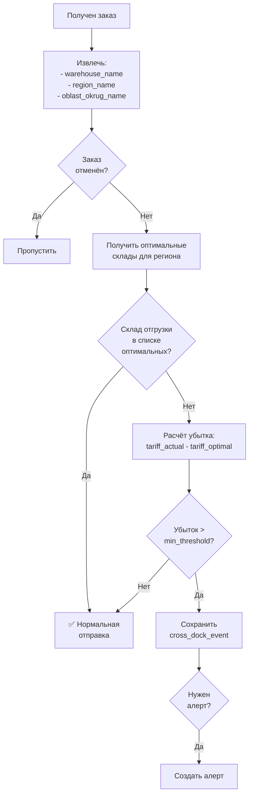

# ADOLF LOGISTIC — Раздел 4: Order Analyzer

**Проект:** Интеллектуальная система управления логистикой маркетплейсов  
**Модуль:** Logistic / Order Analyzer  
**Версия:** 1.0  
**Дата:** Январь 2026

---

## 4.1 Назначение

### Описание

Order Analyzer — компонент модуля Logistic, отвечающий за:
- Анализ структуры заказов по регионам и складам
- Выявление кросс-докинга (отправка с неоптимального склада)
- Расчёт дополнительных логистических издержек
- Формирование аналитических отчётов

### Ключевая задача



---

## 4.2 Алгоритм определения кросс-докинга

### Логика детекции



### Матрица оптимальности

```python
from dataclasses import dataclass
from typing import Optional

@dataclass
class RegionWarehouseMapping:
    """Маппинг регион → оптимальные склады."""
    region_name: str
    oblast_okrug_name: str
    optimal_warehouses: list[str]  # в порядке приоритета
    acceptable_warehouses: list[str]  # допустимые, но не оптимальные


# Конфигурация матрицы
REGION_WAREHOUSE_MATRIX: dict[str, RegionWarehouseMapping] = {
    # Центральный федеральный округ
    "Московская": RegionWarehouseMapping(
        region_name="Московская",
        oblast_okrug_name="Центральный федеральный округ",
        optimal_warehouses=["Коледино", "Подольск", "Электросталь"],
        acceptable_warehouses=["Тула"]
    ),
    "Москва": RegionWarehouseMapping(
        region_name="Москва",
        oblast_okrug_name="Центральный федеральный округ",
        optimal_warehouses=["Коледино", "Подольск", "Электросталь"],
        acceptable_warehouses=["Тула"]
    ),
    
    # Северо-Западный федеральный округ
    "Санкт-Петербург": RegionWarehouseMapping(
        region_name="Санкт-Петербург",
        oblast_okrug_name="Северо-Западный федеральный округ",
        optimal_warehouses=["Санкт-Петербург", "СПб Шушары"],
        acceptable_warehouses=[]
    ),
    "Ленинградская": RegionWarehouseMapping(
        region_name="Ленинградская",
        oblast_okrug_name="Северо-Западный федеральный округ",
        optimal_warehouses=["Санкт-Петербург", "СПб Шушары"],
        acceptable_warehouses=[]
    ),
    
    # Южный федеральный округ
    "Краснодарский край": RegionWarehouseMapping(
        region_name="Краснодарский край",
        oblast_okrug_name="Южный федеральный округ",
        optimal_warehouses=["Краснодар"],
        acceptable_warehouses=["Ростов-на-Дону"]
    ),
    "Ростовская": RegionWarehouseMapping(
        region_name="Ростовская",
        oblast_okrug_name="Южный федеральный округ",
        optimal_warehouses=["Ростов-на-Дону", "Краснодар"],
        acceptable_warehouses=[]
    ),
    
    # Приволжский федеральный округ
    "Татарстан": RegionWarehouseMapping(
        region_name="Татарстан",
        oblast_okrug_name="Приволжский федеральный округ",
        optimal_warehouses=["Казань"],
        acceptable_warehouses=["Екатеринбург"]
    ),
    "Самарская": RegionWarehouseMapping(
        region_name="Самарская",
        oblast_okrug_name="Приволжский федеральный округ",
        optimal_warehouses=["Казань"],
        acceptable_warehouses=[]
    ),
    "Нижегородская": RegionWarehouseMapping(
        region_name="Нижегородская",
        oblast_okrug_name="Приволжский федеральный округ",
        optimal_warehouses=["Казань", "Коледино"],
        acceptable_warehouses=[]
    ),
    
    # Уральский федеральный округ
    "Свердловская": RegionWarehouseMapping(
        region_name="Свердловская",
        oblast_okrug_name="Уральский федеральный округ",
        optimal_warehouses=["Екатеринбург"],
        acceptable_warehouses=["Казань"]
    ),
    "Челябинская": RegionWarehouseMapping(
        region_name="Челябинская",
        oblast_okrug_name="Уральский федеральный округ",
        optimal_warehouses=["Екатеринбург"],
        acceptable_warehouses=[]
    ),
    
    # Сибирский федеральный округ
    "Новосибирская": RegionWarehouseMapping(
        region_name="Новосибирская",
        oblast_okrug_name="Сибирский федеральный округ",
        optimal_warehouses=["Новосибирск"],
        acceptable_warehouses=["Красноярск"]
    ),
    "Красноярский край": RegionWarehouseMapping(
        region_name="Красноярский край",
        oblast_okrug_name="Сибирский федеральный округ",
        optimal_warehouses=["Красноярск", "Новосибирск"],
        acceptable_warehouses=[]
    ),
    
    # Дальневосточный федеральный округ
    "Приморский край": RegionWarehouseMapping(
        region_name="Приморский край",
        oblast_okrug_name="Дальневосточный федеральный округ",
        optimal_warehouses=["Хабаровск", "Владивосток"],
        acceptable_warehouses=[]
    ),
}

# Дефолтные склады по федеральным округам
DEFAULT_BY_OKRUG: dict[str, list[str]] = {
    "Центральный федеральный округ": ["Коледино"],
    "Северо-Западный федеральный округ": ["Санкт-Петербург"],
    "Южный федеральный округ": ["Краснодар"],
    "Северо-Кавказский федеральный округ": ["Краснодар"],
    "Приволжский федеральный округ": ["Казань"],
    "Уральский федеральный округ": ["Екатеринбург"],
    "Сибирский федеральный округ": ["Новосибирск"],
    "Дальневосточный федеральный округ": ["Хабаровск"],
}
```

---

## 4.3 Модель данных

### Сущности

```python
from dataclasses import dataclass, field
from datetime import datetime
from typing import Optional
from uuid import UUID
from enum import Enum


class CrossDockSeverity(Enum):
    """Степень серьёзности кросс-докинга."""
    LOW = "low"        # acceptable → optimal
    MEDIUM = "medium"  # другой округ, но соседний
    HIGH = "high"      # противоположный конец страны


@dataclass
class OrderRecord:
    """Запись о заказе для анализа."""
    srid: str
    order_date: datetime
    sku: str
    nm_id: int
    barcode: str
    size: str
    warehouse_name: str
    warehouse_type: str
    region_name: str
    oblast_okrug_name: str
    country_name: str
    total_price: float
    price_with_disc: float
    is_cancel: bool
    brand_id: str
    synced_at: datetime


@dataclass
class CrossDockEvent:
    """Событие кросс-докинга."""
    id: UUID
    srid: str
    order_date: datetime
    sku: str
    size: str
    brand_id: str
    
    # Фактические данные
    actual_warehouse: str
    buyer_region: str
    buyer_okrug: str
    
    # Оптимальные данные
    optimal_warehouse: str
    
    # Расчёт убытка
    tariff_actual: float
    tariff_optimal: float
    loss_amount: float
    
    # Метаданные
    severity: CrossDockSeverity
    created_at: datetime = field(default_factory=datetime.now)


@dataclass
class CrossDockSummary:
    """Сводка по кросс-докингу за период."""
    period_start: datetime
    period_end: datetime
    total_orders: int
    cross_dock_orders: int
    cross_dock_percent: float
    total_loss: float
    by_sku: dict[str, int]  # SKU → количество
    by_warehouse: dict[str, int]  # Склад отгрузки → количество
    by_region: dict[str, int]  # Регион покупателя → количество
```

---

## 4.4 Сервис Cross Dock Detector

### Основной класс

```python
import structlog
from uuid import uuid4

logger = structlog.get_logger("logistic.cross_dock")


class CrossDockDetector:
    """Детектор кросс-докинга."""
    
    def __init__(
        self,
        tariff_service: TariffService,
        config: CrossDockConfig
    ):
        self.tariff_service = tariff_service
        self.config = config
        self.matrix = REGION_WAREHOUSE_MATRIX
        self.default_by_okrug = DEFAULT_BY_OKRUG
    
    def detect(self, order: OrderRecord) -> Optional[CrossDockEvent]:
        """
        Определение кросс-докинга для заказа.
        
        Returns:
            CrossDockEvent если обнаружен кросс-докинг, иначе None
        """
        # Пропускаем отменённые заказы
        if order.is_cancel:
            return None
        
        # Получаем оптимальные склады
        optimal_warehouses = self._get_optimal_warehouses(
            order.region_name,
            order.oblast_okrug_name
        )
        
        if not optimal_warehouses:
            logger.warning(
                "no_optimal_warehouse_found",
                region=order.region_name,
                okrug=order.oblast_okrug_name
            )
            return None
        
        # Проверяем, оптимален ли склад отгрузки
        if order.warehouse_name in optimal_warehouses:
            return None  # Нормальная отправка
        
        # Проверяем допустимые склады
        acceptable = self._get_acceptable_warehouses(
            order.region_name,
            order.oblast_okrug_name
        )
        
        if order.warehouse_name in acceptable:
            severity = CrossDockSeverity.LOW
        else:
            severity = self._calculate_severity(
                order.warehouse_name,
                optimal_warehouses[0],
                order.oblast_okrug_name
            )
        
        # Расчёт убытка
        optimal_warehouse = optimal_warehouses[0]
        tariff_actual = self._get_tariff(order.warehouse_name)
        tariff_optimal = self._get_tariff(optimal_warehouse)
        loss = tariff_actual - tariff_optimal
        
        # Проверяем порог
        if loss < self.config.min_loss_threshold:
            return None
        
        return CrossDockEvent(
            id=uuid4(),
            srid=order.srid,
            order_date=order.order_date,
            sku=order.sku,
            size=order.size,
            brand_id=order.brand_id,
            actual_warehouse=order.warehouse_name,
            buyer_region=order.region_name,
            buyer_okrug=order.oblast_okrug_name,
            optimal_warehouse=optimal_warehouse,
            tariff_actual=tariff_actual,
            tariff_optimal=tariff_optimal,
            loss_amount=loss,
            severity=severity
        )
    
    def _get_optimal_warehouses(
        self,
        region_name: str,
        oblast_okrug_name: str
    ) -> list[str]:
        """Получение списка оптимальных складов."""
        mapping = self.matrix.get(region_name)
        
        if mapping:
            return mapping.optimal_warehouses
        
        # Fallback на округ
        return self.default_by_okrug.get(oblast_okrug_name, [])
    
    def _get_acceptable_warehouses(
        self,
        region_name: str,
        oblast_okrug_name: str
    ) -> list[str]:
        """Получение списка допустимых складов."""
        mapping = self.matrix.get(region_name)
        
        if mapping:
            return mapping.acceptable_warehouses
        
        return []
    
    def _calculate_severity(
        self,
        actual_warehouse: str,
        optimal_warehouse: str,
        buyer_okrug: str
    ) -> CrossDockSeverity:
        """Расчёт степени серьёзности."""
        # Определяем округ склада отгрузки
        actual_okrug = self._get_warehouse_okrug(actual_warehouse)
        optimal_okrug = self._get_warehouse_okrug(optimal_warehouse)
        
        if actual_okrug == buyer_okrug:
            # Тот же округ, но не оптимальный склад
            return CrossDockSeverity.LOW
        
        # Проверяем соседние округа
        if self._are_adjacent_okrugs(actual_okrug, buyer_okrug):
            return CrossDockSeverity.MEDIUM
        
        # Противоположные части страны
        return CrossDockSeverity.HIGH
    
    def _get_tariff(self, warehouse_name: str) -> float:
        """Получение тарифа для склада."""
        tariffs = self.tariff_service.get_cached_tariffs()
        
        for t in tariffs:
            if t.warehouse_name == warehouse_name:
                # Упрощённый расчёт: базовая ставка + средний объём
                return t.delivery_base + t.delivery_per_liter * 5  # ~5 литров
        
        return self.config.default_tariff
    
    def _get_warehouse_okrug(self, warehouse_name: str) -> str:
        """Определение округа склада."""
        # Маппинг складов на округа
        warehouse_okrug_map = {
            "Коледино": "Центральный федеральный округ",
            "Подольск": "Центральный федеральный округ",
            "Электросталь": "Центральный федеральный округ",
            "Санкт-Петербург": "Северо-Западный федеральный округ",
            "Краснодар": "Южный федеральный округ",
            "Казань": "Приволжский федеральный округ",
            "Екатеринбург": "Уральский федеральный округ",
            "Новосибирск": "Сибирский федеральный округ",
            "Хабаровск": "Дальневосточный федеральный округ",
            # ... дополнить
        }
        return warehouse_okrug_map.get(
            warehouse_name, 
            "Центральный федеральный округ"
        )
    
    def _are_adjacent_okrugs(self, okrug1: str, okrug2: str) -> bool:
        """Проверка, являются ли округа соседними."""
        adjacency = {
            "Центральный федеральный округ": [
                "Северо-Западный федеральный округ",
                "Южный федеральный округ",
                "Приволжский федеральный округ"
            ],
            "Северо-Западный федеральный округ": [
                "Центральный федеральный округ",
                "Приволжский федеральный округ"
            ],
            "Южный федеральный округ": [
                "Центральный федеральный округ",
                "Северо-Кавказский федеральный округ",
                "Приволжский федеральный округ"
            ],
            "Приволжский федеральный округ": [
                "Центральный федеральный округ",
                "Южный федеральный округ",
                "Уральский федеральный округ"
            ],
            "Уральский федеральный округ": [
                "Приволжский федеральный округ",
                "Сибирский федеральный округ"
            ],
            "Сибирский федеральный округ": [
                "Уральский федеральный округ",
                "Дальневосточный федеральный округ"
            ],
            "Дальневосточный федеральный округ": [
                "Сибирский федеральный округ"
            ],
        }
        
        return okrug2 in adjacency.get(okrug1, [])
```

---

## 4.5 Сервис Order Analyzer

### Основной класс

```python
class OrderAnalyzerService:
    """Сервис анализа заказов."""
    
    def __init__(
        self,
        wb_adapter: WBLogisticAdapter,
        order_repo: OrderRepository,
        cross_dock_repo: CrossDockRepository,
        detector: CrossDockDetector,
        alert_service: AlertService,
        config: OrderAnalyzerConfig
    ):
        self.wb_adapter = wb_adapter
        self.order_repo = order_repo
        self.cross_dock_repo = cross_dock_repo
        self.detector = detector
        self.alert_service = alert_service
        self.config = config
    
    async def sync_orders(self) -> SyncResult:
        """
        Синхронизация заказов с WB API.
        
        Вызывается Celery task каждые 30 минут.
        """
        logger.info("order_sync_started")
        
        try:
            # Получаем последнюю дату синхронизации
            last_sync = await self.order_repo.get_last_sync_date()
            date_from = last_sync or (datetime.now() - timedelta(days=1))
            
            # Загружаем заказы
            orders = await self.wb_adapter.get_orders(date_from)
            
            # Фильтруем уже обработанные
            new_orders = await self._filter_existing(orders)
            
            # Сохраняем заказы
            await self.order_repo.bulk_insert(new_orders)
            
            # Анализируем на кросс-докинг
            cross_dock_events = []
            for order in new_orders:
                event = self.detector.detect(order)
                if event:
                    cross_dock_events.append(event)
            
            # Сохраняем события кросс-докинга
            if cross_dock_events:
                await self.cross_dock_repo.bulk_insert(cross_dock_events)
                
                # Генерируем алерты
                await self._generate_alerts(cross_dock_events)
            
            logger.info(
                "order_sync_completed",
                orders_count=len(new_orders),
                cross_dock_count=len(cross_dock_events)
            )
            
            return SyncResult(
                success=True,
                orders_count=len(new_orders),
                cross_dock_count=len(cross_dock_events)
            )
            
        except Exception as e:
            logger.error("order_sync_failed", error=str(e))
            raise
    
    async def _filter_existing(
        self, 
        orders: list[Order]
    ) -> list[OrderRecord]:
        """Фильтрация уже существующих заказов."""
        srids = [o.srid for o in orders]
        existing = await self.order_repo.get_existing_srids(srids)
        existing_set = set(existing)
        
        return [
            self._to_record(o)
            for o in orders
            if o.srid not in existing_set
        ]
    
    def _to_record(self, order: Order) -> OrderRecord:
        """Преобразование в запись."""
        return OrderRecord(
            srid=order.srid,
            order_date=order.order_date,
            sku=order.sku,
            nm_id=order.nm_id,
            barcode=order.barcode,
            size=order.size,
            warehouse_name=order.warehouse_name,
            warehouse_type=order.warehouse_type,
            region_name=order.region_name,
            oblast_okrug_name=order.oblast_okrug_name,
            country_name=order.country_name,
            total_price=order.total_price,
            price_with_disc=order.price_with_disc,
            is_cancel=order.is_cancel,
            brand_id=self._detect_brand(order.brand),
            synced_at=datetime.now()
        )
    
    async def _generate_alerts(
        self, 
        events: list[CrossDockEvent]
    ) -> None:
        """Генерация алертов для событий кросс-докинга."""
        for event in events:
            # Агрегируем алерты по SKU, чтобы не спамить
            if event.severity in (CrossDockSeverity.MEDIUM, CrossDockSeverity.HIGH):
                alert = Alert(
                    id=uuid4(),
                    type=AlertType.CROSS_DOCK_DETECTED,
                    severity=AlertSeverity.MEDIUM if event.severity == CrossDockSeverity.MEDIUM else AlertSeverity.HIGH,
                    sku=event.sku,
                    size=event.size,
                    warehouse_name=event.actual_warehouse,
                    message=f"Кросс-докинг: {event.actual_warehouse} → {event.buyer_region}. Убыток: {event.loss_amount:.0f} ₽",
                    details={
                        "srid": event.srid,
                        "actual_warehouse": event.actual_warehouse,
                        "optimal_warehouse": event.optimal_warehouse,
                        "buyer_region": event.buyer_region,
                        "loss_amount": event.loss_amount,
                        "severity": event.severity.value
                    },
                    brand_id=event.brand_id
                )
                await self.alert_service.create_alert(alert)
```

---

## 4.6 Аналитика и отчёты

### Сервис отчётов

```python
class CrossDockReportService:
    """Сервис формирования отчётов по кросс-докингу."""
    
    def __init__(
        self,
        cross_dock_repo: CrossDockRepository,
        order_repo: OrderRepository
    ):
        self.cross_dock_repo = cross_dock_repo
        self.order_repo = order_repo
    
    async def get_summary(
        self,
        date_from: datetime,
        date_to: datetime,
        brand_id: Optional[str] = None
    ) -> CrossDockSummary:
        """Сводка по кросс-докингу за период."""
        # Общее количество заказов
        total_orders = await self.order_repo.count_orders(
            date_from=date_from,
            date_to=date_to,
            brand_id=brand_id
        )
        
        # События кросс-докинга
        events = await self.cross_dock_repo.get_events(
            date_from=date_from,
            date_to=date_to,
            brand_id=brand_id
        )
        
        # Агрегация
        by_sku: dict[str, int] = {}
        by_warehouse: dict[str, int] = {}
        by_region: dict[str, int] = {}
        total_loss = 0.0
        
        for event in events:
            # По SKU
            key_sku = f"{event.sku}:{event.size}"
            by_sku[key_sku] = by_sku.get(key_sku, 0) + 1
            
            # По складу
            by_warehouse[event.actual_warehouse] = \
                by_warehouse.get(event.actual_warehouse, 0) + 1
            
            # По региону
            by_region[event.buyer_region] = \
                by_region.get(event.buyer_region, 0) + 1
            
            # Общий убыток
            total_loss += event.loss_amount
        
        cross_dock_count = len(events)
        cross_dock_percent = (
            (cross_dock_count / total_orders * 100)
            if total_orders > 0 else 0
        )
        
        return CrossDockSummary(
            period_start=date_from,
            period_end=date_to,
            total_orders=total_orders,
            cross_dock_orders=cross_dock_count,
            cross_dock_percent=round(cross_dock_percent, 2),
            total_loss=round(total_loss, 2),
            by_sku=dict(sorted(
                by_sku.items(), 
                key=lambda x: x[1], 
                reverse=True
            )[:10]),  # Top 10
            by_warehouse=by_warehouse,
            by_region=dict(sorted(
                by_region.items(),
                key=lambda x: x[1],
                reverse=True
            )[:10])
        )
    
    async def get_detailed_report(
        self,
        date_from: datetime,
        date_to: datetime,
        brand_id: Optional[str] = None,
        sku: Optional[str] = None,
        limit: int = 100,
        offset: int = 0
    ) -> list[CrossDockEvent]:
        """Детализированный отчёт по событиям."""
        return await self.cross_dock_repo.get_events(
            date_from=date_from,
            date_to=date_to,
            brand_id=brand_id,
            sku=sku,
            limit=limit,
            offset=offset
        )
    
    async def get_sku_analysis(
        self,
        sku: str,
        size: Optional[str] = None,
        days: int = 30
    ) -> dict:
        """Анализ кросс-докинга для конкретного SKU."""
        date_from = datetime.now() - timedelta(days=days)
        
        events = await self.cross_dock_repo.get_events(
            date_from=date_from,
            sku=sku,
            size=size
        )
        
        total_orders = await self.order_repo.count_orders(
            date_from=date_from,
            sku=sku,
            size=size
        )
        
        # Группируем по маршрутам
        routes: dict[str, dict] = {}
        for event in events:
            route = f"{event.actual_warehouse} → {event.buyer_region}"
            if route not in routes:
                routes[route] = {
                    "count": 0,
                    "total_loss": 0,
                    "avg_loss": 0
                }
            routes[route]["count"] += 1
            routes[route]["total_loss"] += event.loss_amount
        
        # Рассчитываем средний убыток
        for route in routes.values():
            route["avg_loss"] = route["total_loss"] / route["count"]
        
        return {
            "sku": sku,
            "size": size,
            "period_days": days,
            "total_orders": total_orders,
            "cross_dock_orders": len(events),
            "cross_dock_percent": len(events) / total_orders * 100 if total_orders else 0,
            "total_loss": sum(e.loss_amount for e in events),
            "routes": routes,
            "recommendation": self._generate_recommendation(events, total_orders)
        }
    
    def _generate_recommendation(
        self,
        events: list[CrossDockEvent],
        total_orders: int
    ) -> str:
        """Генерация рекомендации на основе анализа."""
        if not events:
            return "Кросс-докинг не обнаружен. Распределение оптимально."
        
        percent = len(events) / total_orders * 100 if total_orders else 0
        
        # Находим проблемные регионы
        region_counts: dict[str, int] = {}
        for e in events:
            region_counts[e.buyer_region] = region_counts.get(e.buyer_region, 0) + 1
        
        top_regions = sorted(
            region_counts.items(),
            key=lambda x: x[1],
            reverse=True
        )[:3]
        
        if percent > 10:
            regions_str = ", ".join(r[0] for r in top_regions)
            return f"КРИТИЧНО: {percent:.1f}% заказов с кросс-докингом. Рекомендуется срочно пополнить склады для регионов: {regions_str}"
        elif percent > 5:
            return f"ВНИМАНИЕ: {percent:.1f}% заказов с кросс-докингом. Рекомендуется пересмотреть распределение остатков."
        else:
            return f"Уровень кросс-докинга ({percent:.1f}%) в пределах нормы."
```

---

## 4.7 API Endpoints

### REST API

```python
router = APIRouter(prefix="/logistic/orders", tags=["Logistic Orders"])


@router.get("/cross-dock/summary")
async def get_cross_dock_summary(
    date_from: datetime = Query(..., description="Начало периода"),
    date_to: datetime = Query(..., description="Конец периода"),
    brand_id: Optional[str] = Query(None),
    report_service: CrossDockReportService = Depends(get_report_service),
    current_user: User = Depends(get_current_user)
) -> CrossDockSummary:
    """
    Сводка по кросс-докингу.
    
    Возвращает агрегированную статистику за период.
    """
    effective_brand = brand_id or current_user.brand_id
    
    return await report_service.get_summary(
        date_from=date_from,
        date_to=date_to,
        brand_id=effective_brand
    )


@router.get("/cross-dock/events")
async def get_cross_dock_events(
    date_from: datetime = Query(...),
    date_to: datetime = Query(...),
    sku: Optional[str] = Query(None),
    brand_id: Optional[str] = Query(None),
    limit: int = Query(100, le=1000),
    offset: int = Query(0),
    report_service: CrossDockReportService = Depends(get_report_service),
    current_user: User = Depends(get_current_user)
) -> list[CrossDockEvent]:
    """
    Детализация событий кросс-докинга.
    
    Возвращает список событий с пагинацией.
    """
    return await report_service.get_detailed_report(
        date_from=date_from,
        date_to=date_to,
        brand_id=brand_id or current_user.brand_id,
        sku=sku,
        limit=limit,
        offset=offset
    )


@router.get("/cross-dock/sku/{sku}")
async def get_sku_cross_dock_analysis(
    sku: str,
    size: Optional[str] = Query(None),
    days: int = Query(30, le=90),
    report_service: CrossDockReportService = Depends(get_report_service)
) -> dict:
    """
    Анализ кросс-докинга по SKU.
    
    Детальный анализ с рекомендациями.
    """
    return await report_service.get_sku_analysis(sku, size, days)


@router.get("/statistics")
async def get_order_statistics(
    date_from: datetime = Query(...),
    date_to: datetime = Query(...),
    group_by: str = Query("day", regex="^(day|week|month)$"),
    order_repo: OrderRepository = Depends(get_order_repo),
    current_user: User = Depends(get_current_user)
) -> list[dict]:
    """
    Статистика заказов.
    
    Агрегация по периодам.
    """
    return await order_repo.get_statistics(
        date_from=date_from,
        date_to=date_to,
        group_by=group_by,
        brand_id=current_user.brand_id
    )
```

---

## 4.8 Celery Tasks

### Периодические задачи

```python
@shared_task(
    bind=True,
    max_retries=3,
    default_retry_delay=300
)
def sync_orders(self):
    """
    Синхронизация заказов с WB API.
    
    Запускается каждые 30 минут.
    """
    import asyncio
    
    async def _sync():
        service = get_order_analyzer_service()
        return await service.sync_orders()
    
    result = asyncio.run(_sync())
    
    return {
        "success": result.success,
        "orders_count": result.orders_count,
        "cross_dock_count": result.cross_dock_count
    }


@shared_task
def generate_daily_cross_dock_report():
    """
    Генерация ежедневного отчёта.
    
    Запускается в 08:00.
    """
    import asyncio
    
    async def _generate():
        report_service = get_report_service()
        
        yesterday = datetime.now() - timedelta(days=1)
        date_from = yesterday.replace(hour=0, minute=0, second=0)
        date_to = yesterday.replace(hour=23, minute=59, second=59)
        
        summary = await report_service.get_summary(date_from, date_to)
        
        # Если кросс-докинг > порога, отправляем уведомление
        if summary.cross_dock_percent > 5:
            await send_daily_report_notification(summary)
        
        return summary
    
    return asyncio.run(_generate())
```

---

**Документ подготовлен:** Январь 2026  
**Версия:** 1.0  
**Статус:** Черновик
