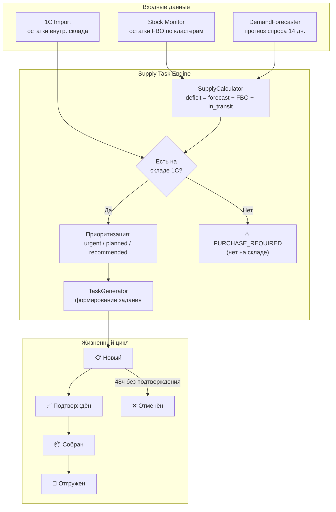
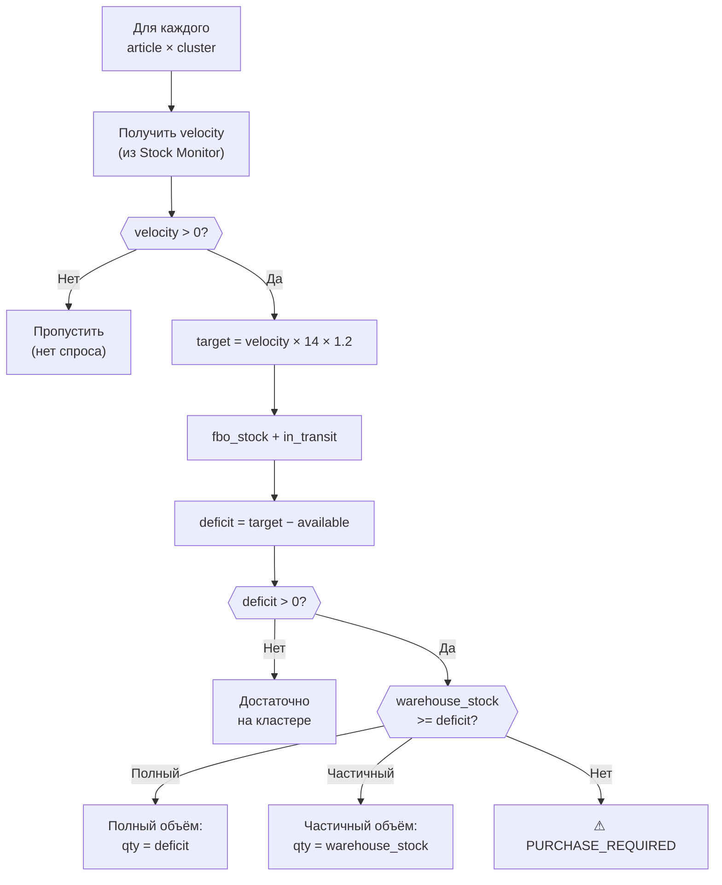
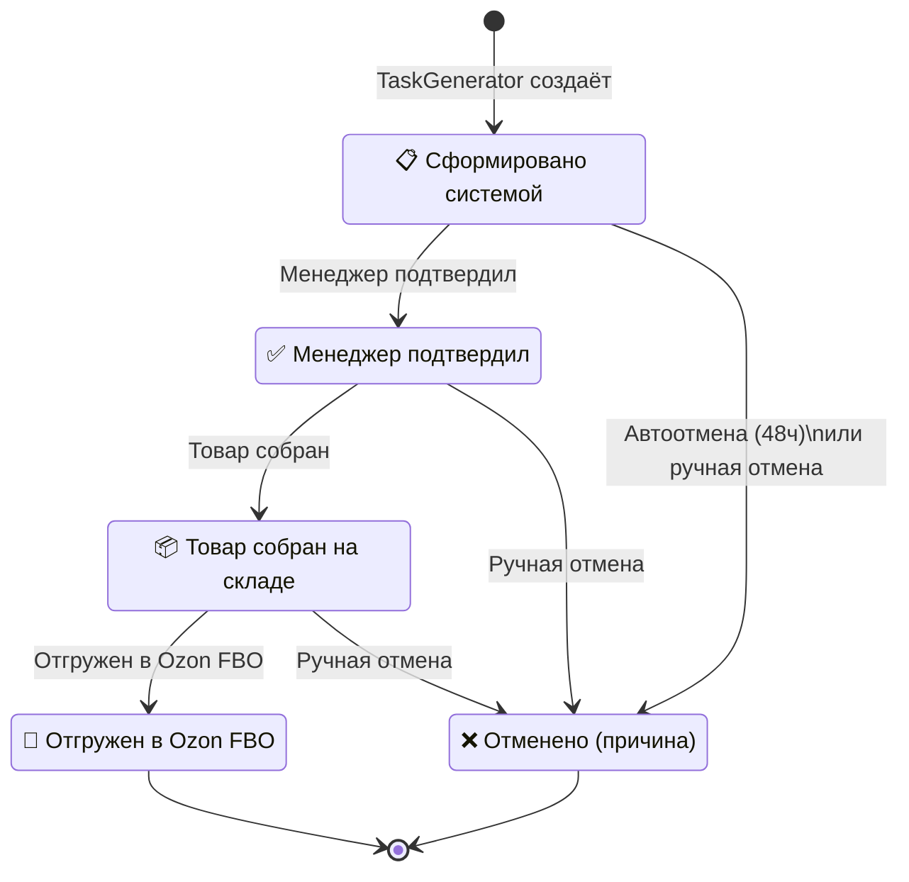

**Проект:** Интеллектуальная система управления логистикой маркетплейсов  
**Модуль:** Logistic / Supply Task Engine  
**Версия:** 2.0  
**Дата:** Февраль 2026  
**Заменяет:** adolf_logistic_4_order_analyzer_v1_0.md

---

## 4.1 Назначение

### Описание

Supply Task Engine — компонент модуля Logistic, отвечающий за:
- Расчёт дефицита по каждому SKU × кластер Ozon
- Формирование наряд-заданий на отгрузку FBO
- Управление жизненным циклом заданий (Новый → Подтверждён → Собран → Отгружен)
- Проверку наличия товара на внутреннем складе (1С)
- Приоритизацию отгрузок по критичности

### Отличие от Order Analyzer v1.0

| Параметр | v1.0 (Order Analyzer) | v2.0 (Supply Task Engine) |
|----------|----------------------|--------------------------|
| Задача | Постфактум-анализ кросс-докинга WB | Превентивное формирование заданий на отгрузку |
| Вход | Заказы WB (уже отправленные) | Остатки FBO + прогноз + 1С |
| Выход | Отчёт по убыткам | Исполняемое наряд-задание |
| Подход | Реактивный (обнаружил → алерт) | Проактивный (спрогнозировал → задание) |
| Маркетплейс | Wildberries | Ozon (31 кластер FBO) |

### Общий поток



---

## 4.2 Расчёт дефицита (SupplyCalculator)

### Формула

```
deficit = max(0, target_stock − fbo_stock − in_transit)

target_stock = avg_daily_demand × horizon_days × safety_factor
```

Где:
- `avg_daily_demand` — средний спрос из Stock Monitor (Ozon или WMA)
- `horizon_days` — горизонт прогноза (default: 14 дней)
- `safety_factor` — коэффициент запаса (default: 1.2)
- `fbo_stock` — текущий остаток FBO на кластере
- `in_transit` — товар в пути на кластер

### Алгоритм



### Реализация

```python
@dataclass
class DeficitResult:
    """Результат расчёта дефицита для SKU × кластер."""
    article: str
    ozon_sku: int
    product_name: str
    cluster_name: str
    
    # Входные данные
    velocity_per_day: float
    fbo_stock: int
    in_transit: int
    days_to_zero: float | None
    
    # Расчёт
    target_stock: int       # целевой запас
    available: int           # FBO + в пути
    deficit: int             # дефицит (шт)
    
    # Склад 1С
    warehouse_stock: int     # наличие на складе
    supply_qty: int          # сколько реально отгрузить
    supply_coverage: str     # full / partial / none


class SupplyCalculator:
    """Расчёт дефицита и объёма поставки."""
    
    def __init__(self, config: LogisticSettings):
        self.horizon = config.forecast_horizon_days   # 14
        self.safety = config.forecast_safety_factor    # 1.2
        self.min_stock = config.min_stock_threshold    # 5
    
    def calculate(
        self,
        article: str,
        ozon_sku: int,
        product_name: str,
        cluster_name: str,
        velocity_per_day: float,
        fbo_stock: int,
        in_transit: int,
        warehouse_stock: int,
        days_to_zero: float | None = None
    ) -> DeficitResult | None:
        """Расчёт дефицита для одного SKU × кластер."""
        
        if velocity_per_day <= 0:
            return None
        
        target = int(velocity_per_day * self.horizon * self.safety)
        target = max(target, self.min_stock)
        
        available = fbo_stock + in_transit
        deficit = max(0, target - available)
        
        if deficit == 0:
            return None
        
        # Определяем, сколько можно отгрузить
        if warehouse_stock >= deficit:
            supply_qty = deficit
            coverage = "full"
        elif warehouse_stock > 0:
            supply_qty = warehouse_stock
            coverage = "partial"
        else:
            supply_qty = 0
            coverage = "none"
        
        return DeficitResult(
            article=article,
            ozon_sku=ozon_sku,
            product_name=product_name,
            cluster_name=cluster_name,
            velocity_per_day=velocity_per_day,
            fbo_stock=fbo_stock,
            in_transit=in_transit,
            days_to_zero=days_to_zero,
            target_stock=target,
            available=available,
            deficit=deficit,
            warehouse_stock=warehouse_stock,
            supply_qty=supply_qty,
            supply_coverage=coverage
        )
```

---

## 4.3 Модель данных

### Наряд-задание (SupplyTask)

```python
class TaskStatus(Enum):
    NEW = "new"                # Сформировано системой
    CONFIRMED = "confirmed"    # Менеджер подтвердил
    COLLECTED = "collected"    # Товар собран на складе
    SHIPPED = "shipped"        # Отгружен в Ozon FBO
    CANCELLED = "cancelled"    # Отменено


class TaskPriority(Enum):
    URGENT = "urgent"          # days_to_zero < 3
    PLANNED = "planned"        # days_to_zero < 7
    RECOMMENDED = "recommended" # days_to_zero >= 7


@dataclass
class SupplyTask:
    """Наряд-задание на отгрузку FBO."""
    id: UUID
    task_number: str            # LG-2026-02-06-001
    
    # Что отгрузить
    article: str
    ozon_sku: int
    product_name: str
    quantity: int               # объём отгрузки (шт)
    
    # Куда
    cluster_name: str
    
    # Аналитика
    deficit: int                # расчётный дефицит
    velocity_per_day: float     # скорость продаж
    days_to_zero: float | None  # дней до обнуления
    fbo_stock: int              # текущий FBO
    warehouse_stock: int        # остаток на складе 1С
    supply_coverage: str        # full / partial
    
    # Workflow
    status: TaskStatus
    priority: TaskPriority
    brand_id: str
    
    # Timestamps
    created_at: datetime
    confirmed_at: datetime | None = None
    confirmed_by: str | None = None
    collected_at: datetime | None = None
    collected_by: str | None = None
    shipped_at: datetime | None = None
    shipped_by: str | None = None
    cancelled_at: datetime | None = None
    cancel_reason: str | None = None


@dataclass
class SupplyTaskBatch:
    """Пакет наряд-заданий (одна генерация)."""
    batch_id: str               # batch_20260206_0700
    generated_at: datetime
    tasks: list[SupplyTask]
    
    # Агрегация
    total_tasks: int
    total_quantity: int
    urgent_count: int
    planned_count: int
    recommended_count: int
    purchase_required_count: int  # дефицит без наличия на складе
```

### Жизненный цикл



---

## 4.4 Генератор заданий (TaskGenerator)

### Основной класс

```python
import structlog
from uuid import uuid4
from datetime import datetime, timedelta
from itertools import count

logger = structlog.get_logger("logistic.task_generator")


class TaskGenerator:
    """Генерация наряд-заданий на отгрузку FBO."""
    
    def __init__(
        self,
        calculator: SupplyCalculator,
        stock_repo: StockRepository,
        import_repo: ImportRepository,
        task_repo: SupplyTaskRepository,
        alert_service: AlertService,
        config: LogisticSettings
    ):
        self.calculator = calculator
        self.stock_repo = stock_repo
        self.import_repo = import_repo
        self.task_repo = task_repo
        self.alert_service = alert_service
        self.config = config
    
    async def generate_daily_tasks(self) -> SupplyTaskBatch:
        """
        Ежедневная генерация наряд-заданий.
        Celery task: 07:00.
        """
        logger.info("task_generation_started")
        
        # 1. Получаем текущие остатки FBO по кластерам
        cluster_stocks = await self.stock_repo.get_latest_cluster_stocks()
        
        # 2. Получаем остатки внутреннего склада (1С)
        warehouse_stocks = await self.import_repo.get_latest_stocks()
        wh_map = {ws.article: ws.warehouse_stock for ws in warehouse_stocks}
        
        # 3. Вычитаем уже зарезервированное активными заданиями
        reserved = await self.task_repo.get_reserved_quantities()
        
        # 4. Расчёт дефицитов
        deficits: list[DeficitResult] = []
        purchase_required: list[dict] = []
        
        for cs in cluster_stocks:
            available_wh = wh_map.get(cs.article, 0) - reserved.get(cs.article, 0)
            available_wh = max(0, available_wh)
            
            result = self.calculator.calculate(
                article=cs.article,
                ozon_sku=cs.ozon_sku,
                product_name=cs.product_name,
                cluster_name=cs.cluster_name,
                velocity_per_day=cs.avg_daily_sales or 0,
                fbo_stock=cs.fbo_stock,
                in_transit=cs.in_transit,
                warehouse_stock=available_wh,
                days_to_zero=cs.days_to_zero
            )
            
            if result is None:
                continue
            
            if result.supply_coverage == "none":
                purchase_required.append({
                    "article": result.article,
                    "cluster": result.cluster_name,
                    "deficit": result.deficit
                })
            else:
                deficits.append(result)
        
        # 5. Формируем наряд-задания
        tasks = self._create_tasks(deficits)
        
        # 6. Сохраняем
        if tasks:
            await self.task_repo.bulk_insert(tasks)
        
        # 7. Алерты на закупку
        if purchase_required:
            await self._alert_purchase_required(purchase_required)
        
        batch = SupplyTaskBatch(
            batch_id=f"batch_{datetime.now().strftime('%Y%m%d_%H%M')}",
            generated_at=datetime.now(),
            tasks=tasks,
            total_tasks=len(tasks),
            total_quantity=sum(t.quantity for t in tasks),
            urgent_count=sum(1 for t in tasks if t.priority == TaskPriority.URGENT),
            planned_count=sum(1 for t in tasks if t.priority == TaskPriority.PLANNED),
            recommended_count=sum(1 for t in tasks if t.priority == TaskPriority.RECOMMENDED),
            purchase_required_count=len(purchase_required)
        )
        
        logger.info(
            "task_generation_completed",
            total_tasks=batch.total_tasks,
            total_qty=batch.total_quantity,
            urgent=batch.urgent_count,
            planned=batch.planned_count,
            recommended=batch.recommended_count,
            purchase_required=batch.purchase_required_count
        )
        
        return batch
    
    def _create_tasks(
        self, deficits: list[DeficitResult]
    ) -> list[SupplyTask]:
        """Формирование заданий из дефицитов."""
        tasks = []
        date_str = datetime.now().strftime("%Y-%m-%d")
        counter = count(1)
        
        # Сортируем: urgent первые, потом по дефициту
        deficits.sort(key=lambda d: (
            d.days_to_zero if d.days_to_zero else 999,
            -d.deficit
        ))
        
        for deficit in deficits:
            priority = self._determine_priority(deficit.days_to_zero)
            num = next(counter)
            
            task = SupplyTask(
                id=uuid4(),
                task_number=f"LG-{date_str}-{num:03d}",
                article=deficit.article,
                ozon_sku=deficit.ozon_sku,
                product_name=deficit.product_name,
                quantity=deficit.supply_qty,
                cluster_name=deficit.cluster_name,
                deficit=deficit.deficit,
                velocity_per_day=deficit.velocity_per_day,
                days_to_zero=deficit.days_to_zero,
                fbo_stock=deficit.fbo_stock,
                warehouse_stock=deficit.warehouse_stock,
                supply_coverage=deficit.supply_coverage,
                status=TaskStatus.NEW,
                priority=priority,
                brand_id=self._detect_brand(deficit.article),
                created_at=datetime.now()
            )
            tasks.append(task)
        
        return tasks
    
    def _determine_priority(self, days_to_zero: float | None) -> TaskPriority:
        if days_to_zero is None:
            return TaskPriority.RECOMMENDED
        if days_to_zero < self.config.critical_days_threshold:
            return TaskPriority.URGENT
        elif days_to_zero < self.config.warning_days_threshold:
            return TaskPriority.PLANNED
        return TaskPriority.RECOMMENDED
    
    async def _alert_purchase_required(self, items: list[dict]) -> None:
        """Алерт: товара нет на складе, нужна закупка."""
        # Группируем по артикулу
        by_article: dict[str, int] = {}
        for item in items:
            by_article[item["article"]] = (
                by_article.get(item["article"], 0) + item["deficit"]
            )
        
        for article, total_deficit in by_article.items():
            await self.alert_service.create_alert(StockAlert(
                id=uuid4(),
                type=AlertType.WAREHOUSE_LOW,
                severity=AlertSeverity.HIGH,
                article=article,
                ozon_sku=None,
                cluster_name="ALL",
                message=f"Нет на складе: {article}, "
                        f"суммарный дефицит {total_deficit} шт",
                details={
                    "article": article,
                    "total_deficit": total_deficit,
                    "clusters": [i["cluster"] for i in items
                                 if i["article"] == article]
                },
                brand_id=self._detect_brand(article),
                created_at=datetime.now()
            ))
    
    def _detect_brand(self, article: str) -> str:
        """Определение бренда по артикулу."""
        # Конвенция: Kids-артикулы начинаются с 'K'
        return "ohana_kids" if article.startswith("K") else "ohana_market"
```

---

## 4.5 Сервис управления заданиями (SupplyTaskService)

### CRUD + Workflow

```python
class SupplyTaskService:
    """CRUD и workflow наряд-заданий."""
    
    def __init__(
        self,
        task_repo: SupplyTaskRepository,
        notify_service: NotificationService,
        config: LogisticSettings
    ):
        self.repo = task_repo
        self.notify = notify_service
        self.auto_cancel_hours = config.task_auto_cancel_hours  # 48
    
    # === Запросы ===
    
    async def get_tasks(
        self,
        date: datetime | None = None,
        status: TaskStatus | None = None,
        priority: TaskPriority | None = None,
        brand_id: str | None = None,
        limit: int = 100,
        offset: int = 0
    ) -> list[SupplyTask]:
        """Получение заданий с фильтрами."""
        return await self.repo.get_tasks(
            date=date, status=status, priority=priority,
            brand_id=brand_id, limit=limit, offset=offset
        )
    
    async def get_task(self, task_id: UUID) -> SupplyTask:
        """Получение задания по ID."""
        task = await self.repo.get_by_id(task_id)
        if not task:
            raise TaskNotFoundError(task_id)
        return task
    
    async def get_daily_summary(
        self, date: datetime | None = None, brand_id: str | None = None
    ) -> dict:
        """Сводка за день."""
        target_date = date or datetime.now()
        tasks = await self.repo.get_tasks(date=target_date, brand_id=brand_id)
        
        return {
            "date": target_date.date().isoformat(),
            "total": len(tasks),
            "by_status": self._count_by(tasks, "status"),
            "by_priority": self._count_by(tasks, "priority"),
            "total_quantity": sum(t.quantity for t in tasks),
            "clusters": len(set(t.cluster_name for t in tasks)),
            "articles": len(set(t.article for t in tasks))
        }
    
    # === Переходы статусов ===
    
    VALID_TRANSITIONS: dict[TaskStatus, list[TaskStatus]] = {
        TaskStatus.NEW: [TaskStatus.CONFIRMED, TaskStatus.CANCELLED],
        TaskStatus.CONFIRMED: [TaskStatus.COLLECTED, TaskStatus.CANCELLED],
        TaskStatus.COLLECTED: [TaskStatus.SHIPPED, TaskStatus.CANCELLED],
        TaskStatus.SHIPPED: [],
        TaskStatus.CANCELLED: [],
    }
    
    async def confirm(self, task_id: UUID, user_id: str) -> SupplyTask:
        """Менеджер подтверждает задание."""
        task = await self.get_task(task_id)
        self._validate_transition(task.status, TaskStatus.CONFIRMED)
        
        task.status = TaskStatus.CONFIRMED
        task.confirmed_at = datetime.now()
        task.confirmed_by = user_id
        
        await self.repo.update(task)
        return task
    
    async def mark_collected(self, task_id: UUID, user_id: str) -> SupplyTask:
        """Товар собран на складе."""
        task = await self.get_task(task_id)
        self._validate_transition(task.status, TaskStatus.COLLECTED)
        
        task.status = TaskStatus.COLLECTED
        task.collected_at = datetime.now()
        task.collected_by = user_id
        
        await self.repo.update(task)
        return task
    
    async def mark_shipped(self, task_id: UUID, user_id: str) -> SupplyTask:
        """Отгружен в Ozon FBO."""
        task = await self.get_task(task_id)
        self._validate_transition(task.status, TaskStatus.SHIPPED)
        
        task.status = TaskStatus.SHIPPED
        task.shipped_at = datetime.now()
        task.shipped_by = user_id
        
        await self.repo.update(task)
        await self.notify.send(
            f"✅ Задание {task.task_number} отгружено: "
            f"{task.product_name} × {task.quantity} шт → {task.cluster_name}"
        )
        return task
    
    async def cancel(
        self, task_id: UUID, reason: str, user_id: str | None = None
    ) -> SupplyTask:
        """Отмена задания."""
        task = await self.get_task(task_id)
        self._validate_transition(task.status, TaskStatus.CANCELLED)
        
        task.status = TaskStatus.CANCELLED
        task.cancelled_at = datetime.now()
        task.cancel_reason = reason
        
        await self.repo.update(task)
        return task
    
    async def auto_cancel_expired(self) -> int:
        """Автоотмена неподтверждённых заданий (> 48ч)."""
        cutoff = datetime.now() - timedelta(hours=self.auto_cancel_hours)
        expired = await self.repo.get_expired_new_tasks(cutoff)
        
        for task in expired:
            task.status = TaskStatus.CANCELLED
            task.cancelled_at = datetime.now()
            task.cancel_reason = f"Автоотмена: не подтверждено за {self.auto_cancel_hours}ч"
            await self.repo.update(task)
        
        if expired:
            logger.info("tasks_auto_cancelled", count=len(expired))
        
        return len(expired)
    
    def _validate_transition(
        self, current: TaskStatus, target: TaskStatus
    ) -> None:
        allowed = self.VALID_TRANSITIONS.get(current, [])
        if target not in allowed:
            raise InvalidStatusTransition(
                f"Переход {current.value} → {target.value} невозможен. "
                f"Допустимо: {[s.value for s in allowed]}"
            )
    
    def _count_by(self, tasks: list[SupplyTask], field: str) -> dict:
        result: dict[str, int] = {}
        for t in tasks:
            key = getattr(t, field)
            key = key.value if hasattr(key, 'value') else str(key)
            result[key] = result.get(key, 0) + 1
        return result
```

---

## 4.6 Агрегация и учёт резерва

### Резервирование складских остатков

При формировании заданий необходимо учитывать товар, уже зарезервированный активными заданиями, чтобы не создать двойные задания.

```python
class SupplyTaskRepository:
    """Репозиторий наряд-заданий (фрагмент)."""
    
    async def get_reserved_quantities(self) -> dict[str, int]:
        """
        Суммарный зарезервированный объём по артикулам.
        
        Учитываются задания в статусах: NEW, CONFIRMED, COLLECTED.
        """
        query = """
            SELECT article, SUM(quantity) as reserved
            FROM supply_tasks
            WHERE status IN ('new', 'confirmed', 'collected')
            GROUP BY article
        """
        rows = await self.db.fetch_all(query)
        return {row["article"]: row["reserved"] for row in rows}
    
    async def get_expired_new_tasks(
        self, cutoff: datetime
    ) -> list[SupplyTask]:
        """Незавтверждённые задания старше cutoff."""
        query = """
            SELECT * FROM supply_tasks
            WHERE status = 'new' AND created_at < :cutoff
        """
        return await self.db.fetch_all(query, {"cutoff": cutoff})
```

### Формула доступного остатка

```
available_warehouse = warehouse_stock_1c − reserved_by_active_tasks

reserved = SUM(quantity) WHERE status IN (NEW, CONFIRMED, COLLECTED)
```

---

## 4.7 Алерты

### Типы алертов Supply Task Engine

| Тип | Severity | Триггер | Описание |
|-----|----------|---------|----------|
| `TASKS_GENERATED` | LOW | Ежедневная генерация | N заданий сформировано |
| `WAREHOUSE_LOW` | HIGH | warehouse_stock = 0 для дефицитных SKU | Нет товара на складе, нужна закупка |
| `TASK_OVERDUE` | MEDIUM | NEW > 48ч | Задание не подтверждено, автоотмена |
| `PARTIAL_SUPPLY` | MEDIUM | coverage = partial | Частичная отгрузка (недостаточно на складе) |

---

## 4.8 API Endpoints

### REST API

```python
router = APIRouter(prefix="/logistic/supply-tasks", tags=["Supply Tasks"])


@router.get("/")
async def list_supply_tasks(
    date: datetime | None = Query(None),
    status: str | None = Query(None),
    priority: str | None = Query(None),
    brand_id: str | None = Query(None),
    limit: int = Query(100, le=500),
    offset: int = Query(0),
    service: SupplyTaskService = Depends(get_task_service),
    current_user: User = Depends(get_current_user)
) -> list[SupplyTask]:
    """Список наряд-заданий с фильтрами."""
    return await service.get_tasks(
        date=date,
        status=TaskStatus(status) if status else None,
        priority=TaskPriority(priority) if priority else None,
        brand_id=brand_id or current_user.brand_id,
        limit=limit, offset=offset
    )


@router.get("/summary")
async def get_daily_summary(
    date: datetime | None = Query(None),
    brand_id: str | None = Query(None),
    service: SupplyTaskService = Depends(get_task_service),
    current_user: User = Depends(get_current_user)
) -> dict:
    """Сводка за день: по статусам, приоритетам, объёмам."""
    return await service.get_daily_summary(
        date=date,
        brand_id=brand_id or current_user.brand_id
    )


@router.get("/{task_id}")
async def get_supply_task(
    task_id: UUID,
    service: SupplyTaskService = Depends(get_task_service)
) -> SupplyTask:
    """Детали наряд-задания."""
    return await service.get_task(task_id)


@router.patch("/{task_id}/confirm")
async def confirm_task(
    task_id: UUID,
    service: SupplyTaskService = Depends(get_task_service),
    current_user: User = Depends(get_current_user)
) -> SupplyTask:
    """Подтвердить задание (NEW → CONFIRMED)."""
    return await service.confirm(task_id, current_user.id)


@router.patch("/{task_id}/collected")
async def mark_collected(
    task_id: UUID,
    service: SupplyTaskService = Depends(get_task_service),
    current_user: User = Depends(get_current_user)
) -> SupplyTask:
    """Товар собран (CONFIRMED → COLLECTED)."""
    return await service.mark_collected(task_id, current_user.id)


@router.patch("/{task_id}/shipped")
async def mark_shipped(
    task_id: UUID,
    service: SupplyTaskService = Depends(get_task_service),
    current_user: User = Depends(get_current_user)
) -> SupplyTask:
    """Отгружен (COLLECTED → SHIPPED)."""
    return await service.mark_shipped(task_id, current_user.id)


@router.patch("/{task_id}/cancel")
async def cancel_task(
    task_id: UUID,
    reason: str = Query(..., min_length=3),
    service: SupplyTaskService = Depends(get_task_service),
    current_user: User = Depends(get_current_user)
) -> SupplyTask:
    """Отменить задание (любой активный → CANCELLED)."""
    return await service.cancel(task_id, reason, current_user.id)


@router.post("/generate")
async def trigger_generation(
    service: SupplyTaskService = Depends(get_task_service),
    generator: TaskGenerator = Depends(get_task_generator),
    current_user: User = Depends(get_current_user)
) -> SupplyTaskBatch:
    """Ручной запуск генерации (вне расписания)."""
    return await generator.generate_daily_tasks()
```

---

## 4.9 Celery Tasks

### Периодические задачи

```python
CELERY_BEAT_SCHEDULE = {
    "generate-supply-tasks-daily": {
        "task": "logistic.tasks.generate_supply_tasks",
        "schedule": crontab(hour=7, minute=0),
    },
    "auto-cancel-expired-tasks": {
        "task": "logistic.tasks.auto_cancel_expired",
        "schedule": crontab(hour="*/6"),  # каждые 6 часов
    },
}


@shared_task(bind=True, max_retries=2, default_retry_delay=600)
def generate_supply_tasks(self):
    """Ежедневная генерация наряд-заданий (07:00)."""
    import asyncio
    
    async def _generate():
        generator = get_task_generator()
        return await generator.generate_daily_tasks()
    
    batch = asyncio.run(_generate())
    
    return {
        "batch_id": batch.batch_id,
        "total_tasks": batch.total_tasks,
        "total_quantity": batch.total_quantity,
        "urgent": batch.urgent_count,
        "planned": batch.planned_count,
        "recommended": batch.recommended_count,
        "purchase_required": batch.purchase_required_count
    }


@shared_task
def auto_cancel_expired():
    """Автоотмена просроченных заданий (каждые 6ч)."""
    import asyncio
    
    async def _cancel():
        service = get_task_service()
        return await service.auto_cancel_expired()
    
    cancelled = asyncio.run(_cancel())
    return {"cancelled_count": cancelled}
```

---

## 4.10 Промпт для Claude Code

```
Реализуй Supply Task Engine для модуля Logistic согласно 
adolf_logistic_4_supply_task_engine_v2_0.md

Требования:
1. SupplyCalculator: deficit = (velocity × 14d × 1.2) − FBO − in_transit,
   проверка наличия на складе 1С, покрытие full/partial/none
2. TaskGenerator: ежедневная генерация, учёт зарезервированного (active tasks),
   приоритизация urgent/planned/recommended, нумерация LG-YYYY-MM-DD-NNN
3. SupplyTaskService: CRUD + workflow NEW→CONFIRMED→COLLECTED→SHIPPED→CANCELLED,
   валидация переходов, автоотмена > 48ч
4. API: GET /supply-tasks (с фильтрами), GET /summary, 
   PATCH /{id}/confirm|collected|shipped|cancel, POST /generate
5. Celery: генерация 07:00, автоотмена каждые 6ч
6. Алерты: WAREHOUSE_LOW, TASK_OVERDUE, PARTIAL_SUPPLY

Зависимости: StockRepository (раздел 3), ImportRepository (раздел 5),
SupplyTaskRepository, AlertService, NotificationService
```

---

**Документ подготовлен:** Февраль 2026  
**Версия:** 2.0  
**Статус:** Черновик  
**Заменяет:** adolf_logistic_4_order_analyzer_v1_0.md
