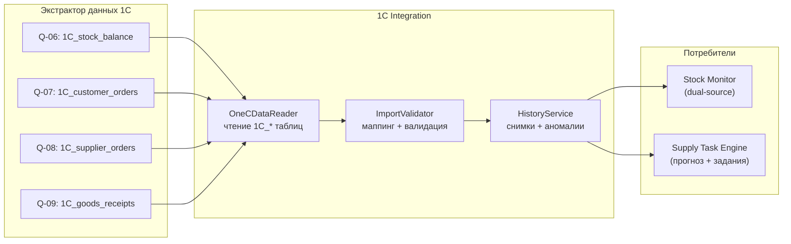
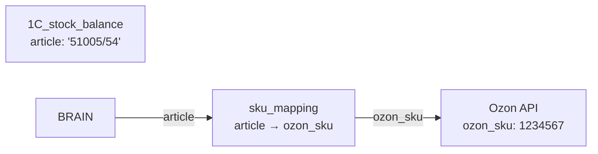

**Проект:** Интеллектуальная система управления логистикой маркетплейсов  
**Модуль:** Logistic / 1С Integration  
**Версия:** 3.0  
**Дата:** Февраль 2026  
**Заменяет:** Раздел 5 v2.0 (файловый обмен XLSX/XML)

---

## 5.1 Назначение

### Описание

1С Integration — компонент модуля Logistic, отвечающий за:

- Чтение данных из PostgreSQL-таблиц `1C_*`, наполняемых Экстрактором данных 1С
- Маппинг артикулов 1С → offer_id Ozon → ozon_sku
- Валидацию и обнаружение аномалий в остатках
- Ведение истории остатков (`logistic_stock_history`) для трендов и аналитики
- Экспорт наряд-заданий в формат, совместимый с 1С

### Роль в системе



### Отличие от v2.0

| Параметр | v2.0 (файловый обмен) | v3.0 (PostgreSQL) |
|----------|----------------------|-------------------|
| Источник | XLSX/XML файлы через SFTP | Таблицы `1C_*` в PostgreSQL |
| Доставка данных | FileScanner → FileImportAdapter | Прямое чтение SQL |
| Компоненты | FileScanner, FileImportAdapter, ImportService | OneCDataReader, ImportValidator, HistoryService |
| Парсинг | openpyxl, lxml | Не требуется |
| Мониторинг | Сканирование директории | Проверка `loaded_at` в `1C_*` |
| Архивирование | Перемещение файлов в YYYY-MM/ | Не требуется |
| История остатков | warehouse_stocks_history | logistic_stock_history |

<Warning>
Компоненты `FileScanner`, `FileImportAdapter`, SFTP/сетевая папка и форматы XLSX/XML удалены. Данные поступают через Экстрактор данных 1С напрямую в PostgreSQL. Подробнее — [1Cexport: Реестр запросов](/1cexport/adolf_1cexport_2_query_registry).
</Warning>

---

## 5.2 Источники данных (1C_* таблицы)

Все таблицы наполняются Экстрактором данных 1С ежедневно. Подробные спецификации — в [Реестре запросов 1Cexport](/1cexport/adolf_1cexport_2_query_registry).

| Таблица | Запрос | Расписание | Назначение в Logistic |
|---------|:------:|:----------:|----------------------|
| `1C_stock_balance` | Q-06 | 06:00 ежедневно | Остатки на внутреннем складе (основной источник для Stock Monitor) |
| `1C_customer_orders` | Q-07 | 06:15 ежедневно | Незакрытые заказы клиентов → прогноз спроса |
| `1C_supplier_orders` | Q-08 | 06:30 ежедневно | Открытые заказы поставщикам → товар в пути |
| `1C_goods_receipts` | Q-09 | 06:45 ежедневно | Поступления за 7 дней → скорость пополнения |

### Ключевые поля для маппинга

Поле `article` во всех таблицах `1C_*` соответствует `offer_id` в Ozon. Маппинг `article → ozon_sku` выполняется через таблицу `sku_mapping`.



---

## 5.3 OneCDataReader

Компонент чтения данных из `1C_*` таблиц. Заменяет `FileScanner` + `FileImportAdapter`.

```python
from dataclasses import dataclass
from datetime import datetime, timedelta
from typing import Optional
import structlog

logger = structlog.get_logger("logistic.1c_reader")


@dataclass
class OneCStockRow:
    """Строка остатка из 1C_stock_balance."""
    article: str
    nomenclature: str
    warehouse: str
    quantity: int
    balance_date: datetime
    loaded_at: datetime


@dataclass
class OneCReadResult:
    """Результат чтения 1C_* таблицы."""
    rows: list
    table_name: str
    loaded_at: datetime | None
    row_count: int
    is_fresh: bool           # loaded_at < порога свежести


class OneCDataReader:
    """Чтение данных из 1C_* таблиц PostgreSQL."""

    # Порог свежести: если loaded_at старше — алерт
    FRESHNESS_THRESHOLD_HOURS = 26

    def __init__(self, db):
        self.db = db

    async def read_stock_balance(
        self, warehouse: str | None = None
    ) -> OneCReadResult:
        """
        Чтение остатков из 1C_stock_balance.
        Основной источник для Stock Monitor (dual-source).
        """
        query = "SELECT * FROM 1C_stock_balance"
        params = {}
        if warehouse:
            query += " WHERE warehouse = :warehouse"
            params["warehouse"] = warehouse

        rows = await self.db.fetch_all(query, params)
        loaded_at = await self._get_loaded_at("1C_stock_balance")

        stock_rows = [
            OneCStockRow(
                article=r["article"],
                nomenclature=r["nomenclature"],
                warehouse=r["warehouse"],
                quantity=int(r["quantity"]),
                balance_date=r["balance_date"],
                loaded_at=r["loaded_at"]
            )
            for r in rows
        ]

        is_fresh = self._check_freshness(loaded_at)
        if not is_fresh:
            logger.warning(
                "1c_data_stale",
                table="1C_stock_balance",
                loaded_at=str(loaded_at),
                threshold_hours=self.FRESHNESS_THRESHOLD_HOURS
            )

        return OneCReadResult(
            rows=stock_rows,
            table_name="1C_stock_balance",
            loaded_at=loaded_at,
            row_count=len(stock_rows),
            is_fresh=is_fresh
        )

    async def read_customer_orders(self) -> OneCReadResult:
        """Чтение незакрытых заказов клиентов (Q-07)."""
        rows = await self.db.fetch_all(
            "SELECT * FROM 1C_customer_orders"
        )
        loaded_at = await self._get_loaded_at("1C_customer_orders")
        return OneCReadResult(
            rows=rows,
            table_name="1C_customer_orders",
            loaded_at=loaded_at,
            row_count=len(rows),
            is_fresh=self._check_freshness(loaded_at)
        )

    async def read_supplier_orders(self) -> OneCReadResult:
        """Чтение открытых заказов поставщикам (Q-08)."""
        rows = await self.db.fetch_all(
            "SELECT * FROM 1C_supplier_orders"
        )
        loaded_at = await self._get_loaded_at("1C_supplier_orders")
        return OneCReadResult(
            rows=rows,
            table_name="1C_supplier_orders",
            loaded_at=loaded_at,
            row_count=len(rows),
            is_fresh=self._check_freshness(loaded_at)
        )

    async def read_goods_receipts(
        self, days_back: int = 7
    ) -> OneCReadResult:
        """Чтение поступлений товаров за период (Q-09)."""
        rows = await self.db.fetch_all(
            "SELECT * FROM 1C_goods_receipts "
            "WHERE document_date >= :since",
            {"since": datetime.now() - timedelta(days=days_back)}
        )
        loaded_at = await self._get_loaded_at("1C_goods_receipts")
        return OneCReadResult(
            rows=rows,
            table_name="1C_goods_receipts",
            loaded_at=loaded_at,
            row_count=len(rows),
            is_fresh=self._check_freshness(loaded_at)
        )

    async def _get_loaded_at(self, table: str) -> datetime | None:
        """Получить время последней загрузки из 1C_* таблицы."""
        row = await self.db.fetch_one(
            f"SELECT MAX(loaded_at) as last FROM {table}"
        )
        return row["last"] if row else None

    def _check_freshness(self, loaded_at: datetime | None) -> bool:
        if loaded_at is None:
            return False
        delta = datetime.now() - loaded_at
        return delta.total_seconds() < self.FRESHNESS_THRESHOLD_HOURS * 3600
```

---

## 5.4 ImportValidator

Валидация и маппинг артикулов. Сохранён из v2.0, адаптирован для чтения из `1C_*`.

```python
@dataclass
class ValidatedStock:
    """Провалидированный остаток с маппингом."""
    article: str
    ozon_sku: int | None
    product_name: str
    warehouse_stock: int
    brand_id: str
    balance_date: datetime


class ImportValidator:
    """Валидация данных из 1C_* и маппинг артикулов."""

    ANOMALY_THRESHOLD_PCT = 50.0

    def __init__(self, mapping_repo, history_repo):
        self.mapping = mapping_repo
        self.history = history_repo

    async def validate_stocks(
        self, 1c_result: OneCReadResult
    ) -> tuple[list[ValidatedStock], list[str]]:
        """
        Валидация остатков из 1C_stock_balance.

        Returns:
            (validated, unmapped_articles)
        """
        known_articles = await self.mapping.get_all_articles()

        validated = []
        unmapped = []

        for row in 1c_result.rows:
            if row.article not in known_articles:
                unmapped.append(row.article)
                continue

            mapping = await self.mapping.get_by_article(row.article)
            validated.append(ValidatedStock(
                article=row.article,
                ozon_sku=mapping.ozon_sku if mapping else None,
                product_name=row.nomenclature,
                warehouse_stock=row.quantity,
                brand_id=self._detect_brand(row.article),
                balance_date=row.balance_date
            ))

        if unmapped:
            logger.warning(
                "unmapped_articles",
                count=len(unmapped),
                sample=unmapped[:10]
            )

        return validated, unmapped

    async def detect_anomalies(
        self, validated: list[ValidatedStock]
    ) -> list[dict]:
        """Обнаружение аномальных изменений остатков."""
        anomalies = []

        for stock in validated:
            prev = await self.history.get_previous_quantity(
                stock.article
            )
            if prev is None or prev == 0:
                continue

            change_pct = abs(stock.warehouse_stock - prev) / prev * 100
            if change_pct >= self.ANOMALY_THRESHOLD_PCT:
                anomalies.append({
                    "article": stock.article,
                    "previous": prev,
                    "current": stock.warehouse_stock,
                    "change_pct": round(change_pct, 1)
                })

        return anomalies

    @staticmethod
    def _detect_brand(article: str) -> str:
        return "ohana_kids" if article.startswith("K") else "ohana_market"
```

---

## 5.5 HistoryService

Сохранение снимков остатков в `logistic_stock_history` и обработка результатов валидации.

```python
class HistoryService:
    """Управление историей остатков и синхронизацией."""

    def __init__(
        self,
        1c_reader: OneCDataReader,
        validator: ImportValidator,
        history_repo,
        stock_repo,
        alert_service
    ):
        self.reader = 1c_reader
        self.validator = validator
        self.history_repo = history_repo
        self.stock_repo = stock_repo
        self.alerts = alert_service

    async def sync_stocks(self) -> dict:
        """
        Основной цикл синхронизации:
        1. Чтение 1C_stock_balance
        2. Валидация + маппинг
        3. Снимок в logistic_stock_history
        4. Обнаружение аномалий
        5. Upsert в warehouse_stocks
        6. Алерты

        Вызывается Celery-задачей после 06:00 ежедневно.
        """
        # 1. Чтение
        1c_result = await self.reader.read_stock_balance()

        if not 1c_result.is_fresh:
            await self.alerts.create_alert(
                type="DATA_STALE",
                severity="HIGH",
                message=(
                    f"1C_stock_balance: loaded_at="
                    f"{1c_result.loaded_at}, "
                    f"порог={OneCDataReader.FRESHNESS_THRESHOLD_HOURS}ч"
                )
            )
            return {"status": "stale", "loaded_at": str(1c_result.loaded_at)}

        # 2. Валидация
        validated, unmapped = await self.validator.validate_stocks(
            1c_result
        )

        if not validated:
            return {"status": "empty", "unmapped": len(unmapped)}

        # 3. Снимок истории (до upsert)
        await self.history_repo.save_snapshot(
            stocks=validated,
            loaded_at=1c_result.loaded_at
        )

        # 4. Аномалии
        anomalies = await self.validator.detect_anomalies(validated)

        # 5. Upsert текущих остатков
        await self.stock_repo.upsert_warehouse_stocks(validated)

        # 6. Алерты
        if anomalies:
            await self.alerts.create_alert(
                type="STOCK_ANOMALY",
                severity="MEDIUM",
                message=f"{len(anomalies)} аномалий (Δ > 50%)",
                details={"anomalies": anomalies[:20]}
            )

        if len(unmapped) > 10:
            await self.alerts.create_alert(
                type="UNMAPPED_ARTICLES",
                severity="MEDIUM",
                message=f"{len(unmapped)} артикулов без маппинга",
                details={"articles": unmapped[:20]}
            )

        return {
            "status": "success",
            "validated": len(validated),
            "unmapped": len(unmapped),
            "anomalies": len(anomalies),
            "loaded_at": str(1c_result.loaded_at)
        }
```

---

## 5.6 Модель данных

### logistic_stock_history

Таблица истории остатков для обнаружения аномалий и трендов.

```sql
CREATE TABLE logistic_stock_history (
    id BIGSERIAL PRIMARY KEY,
    article VARCHAR(100) NOT NULL,
    warehouse_stock INTEGER NOT NULL,
    brand_id VARCHAR(50) NOT NULL,
    balance_date DATE NOT NULL,
    1c_loaded_at TIMESTAMP WITH TIME ZONE,
    snapshot_at TIMESTAMP WITH TIME ZONE DEFAULT CURRENT_TIMESTAMP
);

CREATE INDEX idx_lsh_article_date
    ON logistic_stock_history(article, snapshot_at DESC);
CREATE INDEX idx_lsh_snapshot
    ON logistic_stock_history(snapshot_at);

COMMENT ON TABLE logistic_stock_history
    IS 'История остатков внутреннего склада (снимки из 1C_stock_balance)';
```

### HistoryRepository

```python
class StockHistoryRepository:
    """Репозиторий истории остатков."""

    async def save_snapshot(
        self, stocks: list[ValidatedStock], loaded_at: datetime
    ) -> int:
        """Сохранить снимок текущих остатков."""
        query = """
            INSERT INTO logistic_stock_history
            (article, warehouse_stock, brand_id, balance_date, 1c_loaded_at)
            VALUES (:article, :stock, :brand, :date, :loaded)
        """
        for s in stocks:
            await self.db.execute(query, {
                "article": s.article,
                "stock": s.warehouse_stock,
                "brand": s.brand_id,
                "date": s.balance_date,
                "loaded": loaded_at
            })
        return len(stocks)

    async def get_previous_quantity(self, article: str) -> int | None:
        """Остаток из предыдущего снимка (для аномалий)."""
        row = await self.db.fetch_one(
            """
            SELECT warehouse_stock FROM logistic_stock_history
            WHERE article = :article
            ORDER BY snapshot_at DESC
            OFFSET 1 LIMIT 1
            """,
            {"article": article}
        )
        return row["warehouse_stock"] if row else None

    async def get_history(
        self, article: str, days: int = 30
    ) -> list[dict]:
        """История остатков артикула за N дней."""
        return await self.db.fetch_all(
            """
            SELECT balance_date, warehouse_stock, snapshot_at
            FROM logistic_stock_history
            WHERE article = :article
              AND snapshot_at >= NOW() - INTERVAL ':days days'
            ORDER BY snapshot_at
            """,
            {"article": article, "days": days}
        )

    async def cleanup(self, keep_days: int = 90) -> int:
        """Удаление старых снимков."""
        result = await self.db.execute(
            """
            DELETE FROM logistic_stock_history
            WHERE snapshot_at < NOW() - INTERVAL ':days days'
            """,
            {"days": keep_days}
        )
        return result.rowcount
```

### SKU Mapping

Без изменений относительно v2.0. Описание — в [Разделе 5 v2.0, пункт 5.5](/logistic/adolf_logistic_5_1c_integration#55-модель-данных). Таблица `sku_mapping` и `SKUMappingRepository` сохраняются.

---

## 5.7 Экспорт для 1С

Модуль экспорта наряд-заданий без изменений. Описание и код `ExportService` — в [Разделе 5 v2.0, пункт 5.6](/logistic/adolf_logistic_5_1c_integration#56-экспорт-для-1с).

---

## 5.8 API Endpoints

```python
router = APIRouter(prefix="/logistic/1c", tags=["1C Integration"])


@router.get("/stocks")
async def get_warehouse_stocks(
    brand_id: str | None = Query(None),
    reader: OneCDataReader = Depends(get_1c_reader),
    validator: ImportValidator = Depends(get_validator),
    current_user: User = Depends(get_current_user)
) -> dict:
    """Текущие остатки из 1C_stock_balance с маппингом."""
    result = await reader.read_stock_balance()
    validated, unmapped = await validator.validate_stocks(result)
    if brand_id:
        validated = [v for v in validated if v.brand_id == brand_id]
    return {
        "stocks": validated,
        "unmapped_count": len(unmapped),
        "loaded_at": str(result.loaded_at),
        "is_fresh": result.is_fresh
    }


@router.get("/stocks/{article}")
async def get_article_stock(
    article: str,
    reader: OneCDataReader = Depends(get_1c_reader)
) -> dict:
    """Остаток конкретного артикула."""
    row = await reader.db.fetch_one(
        "SELECT * FROM 1C_stock_balance WHERE article = :article",
        {"article": article}
    )
    return {"article": article, "stock": row if row else None}


@router.get("/stocks/{article}/history")
async def get_stock_history(
    article: str,
    days: int = Query(30, le=365),
    history_repo: StockHistoryRepository = Depends(get_history_repo)
) -> list[dict]:
    """История остатков артикула."""
    return await history_repo.get_history(article, days)


@router.get("/customer-orders")
async def get_customer_orders(
    reader: OneCDataReader = Depends(get_1c_reader)
) -> OneCReadResult:
    """Незакрытые заказы клиентов из 1C_customer_orders."""
    return await reader.read_customer_orders()


@router.get("/supplier-orders")
async def get_supplier_orders(
    reader: OneCDataReader = Depends(get_1c_reader)
) -> OneCReadResult:
    """Открытые заказы поставщикам из 1C_supplier_orders."""
    return await reader.read_supplier_orders()


@router.get("/goods-receipts")
async def get_goods_receipts(
    days: int = Query(7, le=30),
    reader: OneCDataReader = Depends(get_1c_reader)
) -> OneCReadResult:
    """Поступления товаров за период."""
    return await reader.read_goods_receipts(days_back=days)


@router.get("/freshness")
async def check_data_freshness(
    reader: OneCDataReader = Depends(get_1c_reader)
) -> dict:
    """Проверка свежести всех 1C_* таблиц Logistic."""
    tables = [
        "1C_stock_balance",
        "1C_customer_orders",
        "1C_supplier_orders",
        "1C_goods_receipts"
    ]
    result = {}
    for table in tables:
        loaded_at = await reader._get_loaded_at(table)
        result[table] = {
            "loaded_at": str(loaded_at) if loaded_at else None,
            "is_fresh": reader._check_freshness(loaded_at)
        }
    return result


@router.post("/sync")
async def trigger_sync(
    service: HistoryService = Depends(get_history_service),
    current_user: User = Depends(get_current_user)
) -> dict:
    """Ручной запуск синхронизации остатков."""
    return await service.sync_stocks()


@router.get("/mapping")
async def get_sku_mapping(
    brand_id: str | None = Query(None),
    limit: int = Query(100, le=1000),
    mapping_repo: SKUMappingRepository = Depends(get_mapping_repo)
) -> list:
    """Таблица маппинга артикулов."""
    return await mapping_repo.get_all(brand_id=brand_id, limit=limit)


@router.post("/mapping/sync-ozon")
async def sync_mapping_from_ozon(
    ozon_adapter = Depends(get_ozon_adapter),
    mapping_repo: SKUMappingRepository = Depends(get_mapping_repo)
) -> dict:
    """Синхронизация маппинга из каталога Ozon."""
    products = await ozon_adapter.get_product_list()
    count = await mapping_repo.sync_from_ozon(products)
    return {"synced": count}


@router.get("/export/supply-tasks")
async def export_supply_tasks(
    date: datetime | None = Query(None),
    status: str | None = Query(None),
    export_service: ExportService = Depends(get_export_service)
) -> FileResponse:
    """Экспорт наряд-заданий в XLSX для 1С."""
    file_path = await export_service.export_supply_tasks_xlsx(date, status)
    return FileResponse(
        path=str(file_path),
        filename=file_path.name,
        media_type="application/vnd.openxmlformats-officedocument.spreadsheetml.sheet"
    )
```

---

## 5.9 Celery Tasks

### Расписание

```python
CELERY_BEAT_SCHEDULE = {
    # Синхронизация остатков (после загрузки Экстрактором в 06:00)
    "sync-brain-stocks": {
        "task": "logistic.tasks.sync_1c_stocks",
        "schedule": crontab(hour=6, minute=30),
    },
    # Проверка свежести 1C_* таблиц
    "check-brain-freshness": {
        "task": "logistic.tasks.check_1c_freshness",
        "schedule": crontab(hour=8, minute=0),
    },
    # Синхронизация маппинга из Ozon (еженедельно)
    "sync-sku-mapping-weekly": {
        "task": "logistic.tasks.sync_sku_mapping",
        "schedule": crontab(hour=2, minute=0, day_of_week=1),
    },
    # Очистка истории (ежемесячно)
    "cleanup-stock-history": {
        "task": "logistic.tasks.cleanup_stock_history",
        "schedule": crontab(hour=3, minute=0, day_of_month=1),
    },
}
```

### Задачи

```python
@shared_task(bind=True, max_retries=2, default_retry_delay=300)
def sync_1c_stocks(self):
    """Синхронизация остатков из 1C_stock_balance."""
    import asyncio
    service = get_history_service()
    return asyncio.run(service.sync_stocks())


@shared_task
def check_1c_freshness():
    """
    Проверка свежести данных в 1C_* таблицах.
    Алерт если loaded_at старше 26 часов.
    """
    import asyncio

    async def _check():
        reader = get_1c_reader()
        alerts = get_alert_service()
        tables = [
            "1C_stock_balance",
            "1C_customer_orders",
            "1C_supplier_orders",
            "1C_goods_receipts"
        ]
        stale = []
        for table in tables:
            loaded_at = await reader._get_loaded_at(table)
            if not reader._check_freshness(loaded_at):
                stale.append(table)

        if stale:
            await alerts.create_alert(
                type="DATA_STALE",
                severity="HIGH",
                message=f"Устаревшие данные: {', '.join(stale)}"
            )
        return {"stale": stale}

    return asyncio.run(_check())


@shared_task
def sync_sku_mapping():
    """Синхронизация маппинга артикулов из Ozon."""
    import asyncio

    async def _sync():
        adapter = get_ozon_adapter()
        repo = get_mapping_repo()
        products = await adapter.get_product_list()
        return await repo.sync_from_ozon(products)

    count = asyncio.run(_sync())
    return {"synced_count": count}


@shared_task
def cleanup_stock_history():
    """Очистка истории остатков старше 90 дней."""
    import asyncio
    repo = get_history_repo()
    deleted = asyncio.run(repo.cleanup(keep_days=90))
    return {"deleted": deleted}
```

---

## 5.10 Алерты

| Тип | Severity | Триггер | Описание |
|-----|----------|---------|----------|
| `DATA_STALE` | HIGH | `loaded_at` > 26 часов | Экстрактор не обновил 1C_* |
| `STOCK_ANOMALY` | MEDIUM | Изменение остатка > 50% | Аномальное изменение остатков |
| `UNMAPPED_ARTICLES` | MEDIUM | > 10 артикулов без маппинга | Нужна синхронизация с Ozon |
| `SYNC_SUCCESS` | LOW | Успешная синхронизация | N строк обработано |

---

## 5.11 Промпт для Claude Code

```
Реализуй 1С Integration v3.0 для модуля Logistic согласно
adolf_logistic_5_1c_integration.md (v3.0)

Контекст: файловый обмен (XLSX/XML) заменён на чтение из
PostgreSQL-таблиц 1C_*, наполняемых Экстрактором данных 1С.

Требования:
1. OneCDataReader: чтение из 1C_stock_balance (Q-06),
   1C_customer_orders (Q-07), 1C_supplier_orders (Q-08),
   1C_goods_receipts (Q-09). Проверка свежести loaded_at
   (порог 26 часов).
2. ImportValidator: маппинг article → offer_id → ozon_sku через
   таблицу sku_mapping. Обнаружение аномалий (Δ > 50%).
3. HistoryService: sync_stocks() — чтение → валидация →
   снимок в logistic_stock_history → аномалии → upsert →
   алерты.
4. StockHistoryRepository: save_snapshot(), get_previous_quantity(),
   get_history(), cleanup(90 дней).
5. API: GET /stocks, /stocks/{article}, /stocks/{article}/history,
   /customer-orders, /supplier-orders, /goods-receipts,
   /freshness, /mapping. POST /sync, /mapping/sync-ozon.
   GET /export/supply-tasks.
6. Celery: sync_1c_stocks 06:30, check_1c_freshness 08:00,
   sync_sku_mapping еженедельно (пн), cleanup ежемесячно.
7. Алерты: DATA_STALE, STOCK_ANOMALY, UNMAPPED_ARTICLES.

Удалено: FileScanner, FileImportAdapter, SFTP, XLSX/XML парсинг.
Сохранено: SKUMappingRepository, ExportService из v2.0.

Зависимости: OzonLogisticAdapter (раздел 2), AlertService,
SupplyTaskRepository (раздел 4), structlog.
```

---

**Документ подготовлен:** Февраль 2026  
**Версия:** 3.0  
**Статус:** Черновик  
**Заменяет:** Раздел 5 v2.0 (файловый обмен XLSX/XML)
