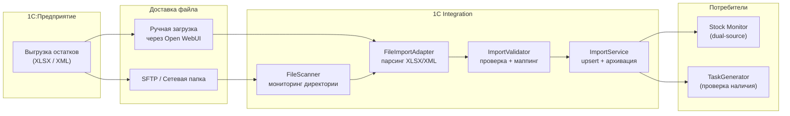
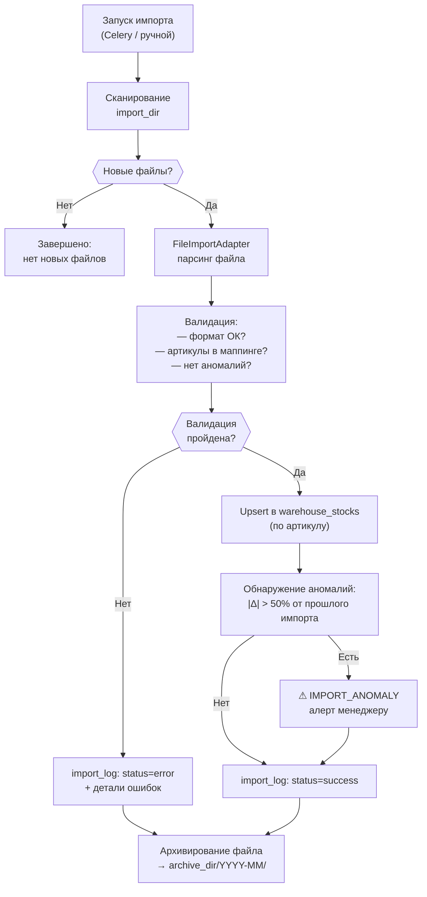

# ADOLF LOGISTIC — Раздел 5: 1С Integration

**Проект:** Интеллектуальная система управления логистикой маркетплейсов  
**Модуль:** Logistic / 1С Integration  
**Версия:** 2.0  
**Дата:** Февраль 2026  
**Заменяет:** adolf_logistic_5_recommendation_engine_v1_0.md

---

## 5.1 Назначение

### Описание

1С Integration — компонент модуля Logistic, отвечающий за:
- Импорт остатков внутреннего склада из 1С (файловый обмен XLSX/XML)
- Маппинг артикулов 1С ↔ Ozon offer_id ↔ ozon_sku
- Валидацию и нормализацию импортируемых данных
- Отслеживание истории импортов и обнаружение аномалий
- Экспорт наряд-заданий в формат, совместимый с 1С
- Архивирование обработанных файлов

### Роль в системе



### Отличие от Recommendation Engine v1.0

| Параметр | v1.0 (Recommendation Engine) | v2.0 (1С Integration) |
|----------|-----------------------------|-----------------------|
| Задача | Расчёт распределения поставок по складам WB | Импорт/экспорт данных между ADOLF и 1С |
| Вход | Спрос по регионам + коэфф. приёмки WB | Файлы XLSX/XML из 1С |
| Выход | Рекомендация по распределению | Актуальные остатки внутреннего склада |
| Маркетплейс | Wildberries | Не зависит (внутренний склад) |
| Статус | Удалён | Новый компонент |

> **Примечание:** Логика расчёта распределения перенесена в Supply Task Engine (раздел 4). 1С Integration — чисто интеграционный модуль.

---

## 5.2 Формат файла 1С

### Ожидаемая структура XLSX

| Колонка | Тип | Обязательное | Описание |
|---------|-----|:---:|----------|
| Артикул | string | ✅ | Внутренний артикул товара (= offer_id в Ozon) |
| Наименование | string | ✅ | Название товара |
| Остаток | int | ✅ | Количество на складе (шт) |
| Единица | string | — | Единица измерения (по умолчанию «шт») |
| Штрихкод | string | — | EAN-13 (для дополнительного маппинга) |

### Ожидаемая структура XML

```xml
<?xml version="1.0" encoding="UTF-8"?>
<ОстаткиСклада Дата="2026-02-06" Склад="Основной">
  <Товар>
    <Артикул>51005/54</Артикул>
    <Наименование>Платье миди зелёное</Наименование>
    <Остаток>340</Остаток>
    <Единица>шт</Единица>
  </Товар>
  <Товар>
    <Артикул>K-20115</Артикул>
    <Наименование>Комбинезон детский</Наименование>
    <Остаток>120</Остаток>
    <Единица>шт</Единица>
  </Товар>
</ОстаткиСклада>
```

### Конфигурация

```python
@dataclass
class ImportConfig:
    """Конфигурация импорта 1С."""
    
    # Директория для сканирования
    import_dir: str = "/data/1c-import"
    
    # Директория для архива
    archive_dir: str = "/data/1c-archive"
    
    # Допустимые форматы
    allowed_extensions: list[str] = field(
        default_factory=lambda: [".xlsx", ".xml"]
    )
    
    # XLSX: номера колонок (0-based) или названия
    xlsx_article_col: int | str = 0      # "Артикул"
    xlsx_name_col: int | str = 1         # "Наименование"
    xlsx_quantity_col: int | str = 2     # "Остаток"
    xlsx_barcode_col: int | str | None = 4  # "Штрихкод" (опционально)
    xlsx_header_row: int = 0             # строка заголовков
    
    # Валидация
    max_quantity: int = 100_000          # максимально допустимый остаток
    min_rows: int = 1                    # минимум строк для валидного файла
    max_rows: int = 50_000              # максимум строк
    
    # Аномалии
    anomaly_threshold_pct: float = 50.0  # % изменения → предупреждение
```

---

## 5.3 FileImportAdapter

### Парсинг файлов

```python
import structlog
from pathlib import Path
from dataclasses import dataclass
from datetime import datetime

logger = structlog.get_logger("logistic.1c_import")


@dataclass
class ParsedStockRow:
    """Одна строка импортированных данных."""
    article: str
    product_name: str
    quantity: int
    unit: str = "шт"
    barcode: str | None = None
    row_number: int = 0


@dataclass
class ParseResult:
    """Результат парсинга файла."""
    rows: list[ParsedStockRow]
    file_name: str
    file_format: str         # "xlsx" | "xml"
    file_date: datetime | None  # дата из файла (если указана)
    parse_errors: list[str]
    total_rows: int
    valid_rows: int


class FileImportAdapter:
    """Адаптер для парсинга файлов 1С (XLSX/XML)."""
    
    def __init__(self, config: ImportConfig):
        self.config = config
    
    def parse(self, file_path: str | Path) -> ParseResult:
        """
        Парсинг файла. Автоматическое определение формата.
        
        Raises:
            UnsupportedFormatError: неподдерживаемый формат
            EmptyFileError: файл пуст
        """
        path = Path(file_path)
        ext = path.suffix.lower()
        
        if ext == ".xlsx":
            return self._parse_xlsx(path)
        elif ext == ".xml":
            return self._parse_xml(path)
        else:
            raise UnsupportedFormatError(
                f"Формат {ext} не поддерживается. "
                f"Допустимые: {self.config.allowed_extensions}"
            )
    
    def _parse_xlsx(self, path: Path) -> ParseResult:
        """Парсинг XLSX через openpyxl."""
        from openpyxl import load_workbook
        
        wb = load_workbook(path, read_only=True, data_only=True)
        ws = wb.active
        
        rows: list[ParsedStockRow] = []
        errors: list[str] = []
        total = 0
        
        for i, row in enumerate(ws.iter_rows(
            min_row=self.config.xlsx_header_row + 2,  # skip header
            values_only=True
        )):
            total += 1
            row_num = i + self.config.xlsx_header_row + 2
            
            try:
                article = self._clean_string(row[self._col_idx("article")])
                name = self._clean_string(row[self._col_idx("name")])
                qty = self._parse_quantity(row[self._col_idx("quantity")])
                barcode = self._safe_get(row, self._col_idx("barcode"))
                
                if not article:
                    errors.append(f"Строка {row_num}: пустой артикул")
                    continue
                
                if qty < 0:
                    errors.append(f"Строка {row_num}: отрицательный остаток ({qty})")
                    continue
                
                if qty > self.config.max_quantity:
                    errors.append(
                        f"Строка {row_num}: остаток {qty} > max ({self.config.max_quantity})"
                    )
                    continue
                
                rows.append(ParsedStockRow(
                    article=article,
                    product_name=name or "",
                    quantity=qty,
                    barcode=str(barcode) if barcode else None,
                    row_number=row_num
                ))
                
            except Exception as e:
                errors.append(f"Строка {row_num}: {str(e)}")
        
        wb.close()
        
        return ParseResult(
            rows=rows,
            file_name=path.name,
            file_format="xlsx",
            file_date=None,
            parse_errors=errors,
            total_rows=total,
            valid_rows=len(rows)
        )
    
    def _parse_xml(self, path: Path) -> ParseResult:
        """Парсинг XML через lxml."""
        from lxml import etree
        
        tree = etree.parse(str(path))
        root = tree.getroot()
        
        # Получаем дату из атрибута корневого элемента
        file_date = None
        date_str = root.get("Дата") or root.get("date")
        if date_str:
            try:
                file_date = datetime.strptime(date_str, "%Y-%m-%d")
            except ValueError:
                pass
        
        rows: list[ParsedStockRow] = []
        errors: list[str] = []
        total = 0
        
        for i, item in enumerate(root.findall(".//Товар")):
            total += 1
            row_num = i + 1
            
            try:
                article = self._clean_string(
                    item.findtext("Артикул") or item.findtext("Article")
                )
                name = self._clean_string(
                    item.findtext("Наименование") or item.findtext("Name")
                )
                qty_text = item.findtext("Остаток") or item.findtext("Quantity")
                qty = self._parse_quantity(qty_text)
                
                if not article:
                    errors.append(f"Товар #{row_num}: пустой артикул")
                    continue
                
                rows.append(ParsedStockRow(
                    article=article,
                    product_name=name or "",
                    quantity=qty,
                    row_number=row_num
                ))
                
            except Exception as e:
                errors.append(f"Товар #{row_num}: {str(e)}")
        
        return ParseResult(
            rows=rows,
            file_name=path.name,
            file_format="xml",
            file_date=file_date,
            parse_errors=errors,
            total_rows=total,
            valid_rows=len(rows)
        )
    
    def _clean_string(self, value) -> str | None:
        if value is None:
            return None
        return str(value).strip()
    
    def _parse_quantity(self, value) -> int:
        if value is None:
            return 0
        return int(float(str(value).replace(",", ".").strip()))
    
    def _col_idx(self, field: str) -> int:
        mapping = {
            "article": self.config.xlsx_article_col,
            "name": self.config.xlsx_name_col,
            "quantity": self.config.xlsx_quantity_col,
            "barcode": self.config.xlsx_barcode_col,
        }
        col = mapping.get(field)
        if col is None:
            return -1
        if isinstance(col, int):
            return col
        return col  # имя колонки — lookup по заголовку
    
    def _safe_get(self, row: tuple, idx: int):
        if idx < 0 or idx >= len(row):
            return None
        return row[idx]
```

---

## 5.4 ImportService

### Основной сервис



### Реализация

```python
class ImportService:
    """Сервис импорта данных из 1С."""
    
    def __init__(
        self,
        adapter: FileImportAdapter,
        import_repo: ImportRepository,
        mapping_repo: SKUMappingRepository,
        alert_service: AlertService,
        config: ImportConfig
    ):
        self.adapter = adapter
        self.import_repo = import_repo
        self.mapping = mapping_repo
        self.alert_service = alert_service
        self.config = config
    
    async def scan_and_import(self) -> list[ImportResult]:
        """
        Сканирование директории и импорт новых файлов.
        Celery task: по расписанию (1-2 раза в день).
        """
        import_dir = Path(self.config.import_dir)
        if not import_dir.exists():
            logger.warning("import_dir_not_found", path=str(import_dir))
            return []
        
        results = []
        
        for file_path in sorted(import_dir.iterdir()):
            if file_path.suffix.lower() not in self.config.allowed_extensions:
                continue
            if file_path.name.startswith("."):
                continue
            
            # Проверяем, не обработан ли уже
            if await self.import_repo.is_file_processed(file_path.name):
                continue
            
            result = await self.import_file(file_path)
            results.append(result)
        
        return results
    
    async def import_file(
        self, file_path: str | Path
    ) -> ImportResult:
        """
        Импорт одного файла.
        
        Может вызываться:
        - Автоматически (scan_and_import)
        - Вручную (через API / Open WebUI)
        """
        path = Path(file_path)
        import_id = f"imp_{datetime.now().strftime('%Y%m%d_%H%M%S')}_{path.stem}"
        
        logger.info("file_import_started", file=path.name, import_id=import_id)
        
        try:
            # 1. Парсинг
            parsed = self.adapter.parse(path)
            
            if not parsed.rows:
                return await self._log_failure(
                    import_id, path.name, "Файл не содержит валидных строк",
                    parsed.parse_errors
                )
            
            # 2. Маппинг артикулов
            mapped_rows, unmapped = await self._map_articles(parsed.rows)
            
            # 3. Обнаружение аномалий
            anomalies = await self._detect_anomalies(mapped_rows)
            
            # 4. Upsert в БД
            await self.import_repo.upsert_warehouse_stocks(
                import_id=import_id,
                stocks=[
                    WarehouseStockRecord(
                        article=row.article,
                        product_name=row.product_name,
                        warehouse_stock=row.quantity,
                        import_id=import_id,
                        brand_id=self._detect_brand(row.article)
                    )
                    for row in mapped_rows
                ]
            )
            
            # 5. Логирование
            import_log = ImportLog(
                import_id=import_id,
                file_name=path.name,
                file_format=parsed.file_format,
                status="success",
                total_rows=parsed.total_rows,
                valid_rows=parsed.valid_rows,
                unmapped_count=len(unmapped),
                anomaly_count=len(anomalies),
                parse_errors=parsed.parse_errors,
                unmapped_articles=unmapped,
                imported_at=datetime.now()
            )
            await self.import_repo.save_log(import_log)
            
            # 6. Алерты
            if anomalies:
                await self._alert_anomalies(import_id, anomalies)
            if unmapped:
                logger.warning(
                    "unmapped_articles",
                    count=len(unmapped),
                    articles=unmapped[:10]
                )
            
            # 7. Архивирование
            self._archive_file(path)
            
            logger.info(
                "file_import_completed",
                import_id=import_id,
                valid=parsed.valid_rows,
                unmapped=len(unmapped),
                anomalies=len(anomalies)
            )
            
            return ImportResult(
                import_id=import_id,
                success=True,
                valid_rows=parsed.valid_rows,
                unmapped=unmapped,
                anomalies=anomalies
            )
            
        except Exception as e:
            logger.error("file_import_failed", file=path.name, error=str(e))
            return await self._log_failure(import_id, path.name, str(e))
    
    async def _map_articles(
        self, rows: list[ParsedStockRow]
    ) -> tuple[list[ParsedStockRow], list[str]]:
        """Проверка артикулов по маппингу SKU."""
        known_articles = await self.mapping.get_all_articles()
        
        mapped = []
        unmapped = []
        
        for row in rows:
            if row.article in known_articles:
                mapped.append(row)
            else:
                unmapped.append(row.article)
        
        return mapped, unmapped
    
    async def _detect_anomalies(
        self, rows: list[ParsedStockRow]
    ) -> list[dict]:
        """Обнаружение аномальных изменений остатков."""
        anomalies = []
        threshold = self.config.anomaly_threshold_pct
        
        for row in rows:
            prev = await self.import_repo.get_previous_stock(row.article)
            if prev is None:
                continue
            
            if prev == 0:
                if row.quantity > 0:
                    continue  # нормально: было 0, стало > 0
            else:
                change_pct = abs(row.quantity - prev) / prev * 100
                if change_pct >= threshold:
                    anomalies.append({
                        "article": row.article,
                        "previous": prev,
                        "current": row.quantity,
                        "change_pct": round(change_pct, 1)
                    })
        
        return anomalies
    
    def _archive_file(self, path: Path) -> None:
        """Перемещение файла в архив."""
        archive_dir = Path(self.config.archive_dir)
        month_dir = archive_dir / datetime.now().strftime("%Y-%m")
        month_dir.mkdir(parents=True, exist_ok=True)
        
        timestamp = datetime.now().strftime("%H%M%S")
        archive_name = f"{timestamp}_{path.name}"
        path.rename(month_dir / archive_name)
    
    async def _log_failure(
        self, import_id: str, file_name: str, error: str,
        parse_errors: list[str] | None = None
    ) -> ImportResult:
        log = ImportLog(
            import_id=import_id,
            file_name=file_name,
            file_format="unknown",
            status="error",
            total_rows=0, valid_rows=0,
            unmapped_count=0, anomaly_count=0,
            parse_errors=parse_errors or [error],
            imported_at=datetime.now()
        )
        await self.import_repo.save_log(log)
        return ImportResult(import_id=import_id, success=False, error=error)
    
    async def _alert_anomalies(
        self, import_id: str, anomalies: list[dict]
    ) -> None:
        await self.alert_service.create_alert(StockAlert(
            id=uuid4(),
            type=AlertType.IMPORT_ANOMALY,
            severity=AlertSeverity.MEDIUM,
            article="IMPORT",
            ozon_sku=None,
            cluster_name="WAREHOUSE",
            message=f"Импорт {import_id}: {len(anomalies)} аномалий "
                    f"(изменение > {self.config.anomaly_threshold_pct}%)",
            details={"import_id": import_id, "anomalies": anomalies[:20]},
            brand_id="all",
            created_at=datetime.now()
        ))
    
    def _detect_brand(self, article: str) -> str:
        return "ohana_kids" if article.startswith("K") else "ohana_market"
```

---

## 5.5 Модель данных

### Записи импорта

```python
@dataclass
class WarehouseStockRecord:
    """Запись остатка на внутреннем складе."""
    article: str
    product_name: str
    warehouse_stock: int
    import_id: str
    brand_id: str
    updated_at: datetime = field(default_factory=datetime.now)


@dataclass
class ImportLog:
    """Лог импорта файла."""
    import_id: str
    file_name: str
    file_format: str           # xlsx / xml
    status: str                # success / error
    total_rows: int
    valid_rows: int
    unmapped_count: int
    anomaly_count: int
    parse_errors: list[str]
    unmapped_articles: list[str] = field(default_factory=list)
    imported_at: datetime = field(default_factory=datetime.now)


@dataclass
class ImportResult:
    """Результат операции импорта."""
    import_id: str
    success: bool
    valid_rows: int = 0
    unmapped: list[str] = field(default_factory=list)
    anomalies: list[dict] = field(default_factory=list)
    error: str | None = None
```

### SKU Mapping

```python
@dataclass
class SKUMapping:
    """Маппинг артикулов между системами."""
    article: str          # артикул 1С (= offer_id Ozon)
    ozon_sku: int | None  # SKU Ozon (числовой)
    product_name: str
    brand_id: str
    is_active: bool = True
    updated_at: datetime = field(default_factory=datetime.now)


class SKUMappingRepository:
    """Репозиторий маппинга артикулов."""
    
    async def get_all_articles(self) -> set[str]:
        """Все известные артикулы."""
        query = "SELECT article FROM sku_mapping WHERE is_active = true"
        rows = await self.db.fetch_all(query)
        return {row["article"] for row in rows}
    
    async def get_by_article(self, article: str) -> SKUMapping | None:
        query = "SELECT * FROM sku_mapping WHERE article = :article"
        return await self.db.fetch_one(query, {"article": article})
    
    async def get_by_ozon_sku(self, ozon_sku: int) -> SKUMapping | None:
        query = "SELECT * FROM sku_mapping WHERE ozon_sku = :sku"
        return await self.db.fetch_one(query, {"sku": ozon_sku})
    
    async def upsert(self, mapping: SKUMapping) -> None:
        """Создать или обновить маппинг."""
        query = """
            INSERT INTO sku_mapping (article, ozon_sku, product_name, brand_id, is_active, updated_at)
            VALUES (:article, :ozon_sku, :name, :brand_id, :is_active, NOW())
            ON CONFLICT (article) DO UPDATE SET
                ozon_sku = EXCLUDED.ozon_sku,
                product_name = EXCLUDED.product_name,
                is_active = EXCLUDED.is_active,
                updated_at = NOW()
        """
        await self.db.execute(query, {
            "article": mapping.article,
            "ozon_sku": mapping.ozon_sku,
            "name": mapping.product_name,
            "brand_id": mapping.brand_id,
            "is_active": mapping.is_active
        })
    
    async def sync_from_ozon(self, ozon_products: list[dict]) -> int:
        """
        Синхронизация маппинга из каталога Ozon.
        Вызывается при первой настройке и периодически.
        """
        count = 0
        for product in ozon_products:
            await self.upsert(SKUMapping(
                article=product["offer_id"],
                ozon_sku=product["sku"],
                product_name=product["name"],
                brand_id="ohana_kids" if product["offer_id"].startswith("K") else "ohana_market",
                is_active=product.get("is_visible", True)
            ))
            count += 1
        return count
```

---

## 5.6 Экспорт для 1С

### Генерация файлов наряд-заданий

```python
class ExportService:
    """Экспорт данных из ADOLF для 1С."""
    
    def __init__(
        self,
        task_repo: SupplyTaskRepository,
        config: ImportConfig
    ):
        self.task_repo = task_repo
        self.export_dir = Path(config.import_dir).parent / "1c-export"
        self.export_dir.mkdir(parents=True, exist_ok=True)
    
    async def export_supply_tasks_xlsx(
        self,
        date: datetime | None = None,
        status: str | None = None
    ) -> Path:
        """
        Экспорт наряд-заданий в XLSX для 1С.
        
        Формирует файл, который кладовщик может
        использовать для сборки отгрузки.
        """
        from openpyxl import Workbook
        from openpyxl.styles import Font, Alignment, PatternFill
        
        tasks = await self.task_repo.get_tasks(
            date=date or datetime.now(),
            status=status
        )
        
        wb = Workbook()
        ws = wb.active
        ws.title = "Наряд-задания"
        
        # Заголовки
        headers = [
            "№ задания", "Артикул", "Наименование",
            "Количество (шт)", "Кластер Ozon", "Приоритет",
            "Статус", "Дней до обнуления", "FBO остаток"
        ]
        
        header_font = Font(bold=True)
        for col, header in enumerate(headers, 1):
            cell = ws.cell(row=1, column=col, value=header)
            cell.font = header_font
        
        # Данные
        priority_fill = {
            "urgent": PatternFill(fgColor="FFCCCC", fill_type="solid"),
            "planned": PatternFill(fgColor="FFFFCC", fill_type="solid"),
        }
        
        for i, task in enumerate(tasks, 2):
            ws.cell(row=i, column=1, value=task.task_number)
            ws.cell(row=i, column=2, value=task.article)
            ws.cell(row=i, column=3, value=task.product_name)
            ws.cell(row=i, column=4, value=task.quantity)
            ws.cell(row=i, column=5, value=task.cluster_name)
            ws.cell(row=i, column=6, value=task.priority.value)
            ws.cell(row=i, column=7, value=task.status.value)
            ws.cell(row=i, column=8, value=task.days_to_zero)
            ws.cell(row=i, column=9, value=task.fbo_stock)
            
            # Цветовая маркировка приоритета
            fill = priority_fill.get(task.priority.value)
            if fill:
                for col in range(1, len(headers) + 1):
                    ws.cell(row=i, column=col).fill = fill
        
        # Автоширина
        for col in ws.columns:
            max_len = max(len(str(cell.value or "")) for cell in col)
            ws.column_dimensions[col[0].column_letter].width = min(max_len + 2, 40)
        
        # Сохранение
        date_str = (date or datetime.now()).strftime("%Y-%m-%d")
        file_name = f"supply_tasks_{date_str}.xlsx"
        file_path = self.export_dir / file_name
        wb.save(str(file_path))
        
        return file_path
```

---

## 5.7 ImportRepository

### Методы репозитория

```python
class ImportRepository:
    """Репозиторий для работы с данными импорта 1С."""
    
    async def upsert_warehouse_stocks(
        self, import_id: str, stocks: list[WarehouseStockRecord]
    ) -> int:
        """Upsert остатков. Возвращает количество обработанных."""
        query = """
            INSERT INTO warehouse_stocks (article, product_name, warehouse_stock, import_id, brand_id, updated_at)
            VALUES (:article, :product_name, :warehouse_stock, :import_id, :brand_id, NOW())
            ON CONFLICT (article) DO UPDATE SET
                product_name = EXCLUDED.product_name,
                warehouse_stock = EXCLUDED.warehouse_stock,
                import_id = EXCLUDED.import_id,
                updated_at = NOW()
        """
        for stock in stocks:
            await self.db.execute(query, asdict(stock))
        return len(stocks)
    
    async def get_latest_stocks(
        self, brand_id: str | None = None
    ) -> list[WarehouseStockRecord]:
        """Текущие остатки на складе."""
        query = "SELECT * FROM warehouse_stocks"
        params = {}
        if brand_id:
            query += " WHERE brand_id = :brand_id"
            params["brand_id"] = brand_id
        return await self.db.fetch_all(query, params)
    
    async def get_latest_stock(self, article: str) -> int | None:
        """Остаток одного артикула."""
        query = "SELECT warehouse_stock FROM warehouse_stocks WHERE article = :article"
        row = await self.db.fetch_one(query, {"article": article})
        return row["warehouse_stock"] if row else None
    
    async def get_previous_stock(self, article: str) -> int | None:
        """Остаток из предыдущего импорта (для обнаружения аномалий)."""
        query = """
            SELECT warehouse_stock FROM warehouse_stocks_history
            WHERE article = :article
            ORDER BY imported_at DESC LIMIT 1
        """
        row = await self.db.fetch_one(query, {"article": article})
        return row["warehouse_stock"] if row else None
    
    async def get_last_import_date(self) -> datetime | None:
        query = "SELECT MAX(imported_at) as last FROM import_logs WHERE status = 'success'"
        row = await self.db.fetch_one(query)
        return row["last"] if row else None
    
    async def is_file_processed(self, file_name: str) -> bool:
        query = "SELECT 1 FROM import_logs WHERE file_name = :name AND status = 'success'"
        row = await self.db.fetch_one(query, {"name": file_name})
        return row is not None
    
    async def save_log(self, log: ImportLog) -> None:
        query = """
            INSERT INTO import_logs 
            (import_id, file_name, file_format, status, total_rows, valid_rows,
             unmapped_count, anomaly_count, parse_errors, unmapped_articles, imported_at)
            VALUES (:import_id, :file_name, :file_format, :status, :total_rows, :valid_rows,
                    :unmapped_count, :anomaly_count, :parse_errors, :unmapped_articles, :imported_at)
        """
        await self.db.execute(query, {
            **asdict(log),
            "parse_errors": json.dumps(log.parse_errors),
            "unmapped_articles": json.dumps(log.unmapped_articles)
        })
    
    async def get_import_history(
        self, limit: int = 20
    ) -> list[ImportLog]:
        query = "SELECT * FROM import_logs ORDER BY imported_at DESC LIMIT :limit"
        return await self.db.fetch_all(query, {"limit": limit})
```

---

## 5.8 API Endpoints

### REST API

```python
router = APIRouter(prefix="/logistic/import", tags=["1C Import"])


@router.post("/upload")
async def upload_file(
    file: UploadFile,
    service: ImportService = Depends(get_import_service),
    current_user: User = Depends(get_current_user)
) -> ImportResult:
    """
    Ручная загрузка файла 1С (XLSX/XML).
    Доступно: Manager+.
    """
    # Сохраняем во временный файл
    temp_path = Path(f"/tmp/1c_upload_{file.filename}")
    with open(temp_path, "wb") as f:
        content = await file.read()
        f.write(content)
    
    try:
        return await service.import_file(temp_path)
    finally:
        temp_path.unlink(missing_ok=True)


@router.post("/trigger-scan")
async def trigger_scan(
    service: ImportService = Depends(get_import_service),
    current_user: User = Depends(get_current_user)
) -> list[ImportResult]:
    """Ручной запуск сканирования директории."""
    return await service.scan_and_import()


@router.get("/history")
async def get_import_history(
    limit: int = Query(20, le=100),
    repo: ImportRepository = Depends(get_import_repo)
) -> list[ImportLog]:
    """История импортов."""
    return await repo.get_import_history(limit=limit)


@router.get("/stocks")
async def get_warehouse_stocks(
    brand_id: str | None = Query(None),
    repo: ImportRepository = Depends(get_import_repo),
    current_user: User = Depends(get_current_user)
) -> list[WarehouseStockRecord]:
    """Текущие остатки на складе 1С."""
    return await repo.get_latest_stocks(
        brand_id=brand_id or current_user.brand_id
    )


@router.get("/stocks/{article}")
async def get_article_stock(
    article: str,
    repo: ImportRepository = Depends(get_import_repo)
) -> dict:
    """Остаток конкретного артикула."""
    stock = await repo.get_latest_stock(article)
    return {"article": article, "warehouse_stock": stock}


@router.get("/mapping")
async def get_sku_mapping(
    brand_id: str | None = Query(None),
    limit: int = Query(100, le=1000),
    mapping_repo: SKUMappingRepository = Depends(get_mapping_repo)
) -> list[SKUMapping]:
    """Таблица маппинга артикулов."""
    return await mapping_repo.get_all(brand_id=brand_id, limit=limit)


@router.post("/mapping/sync-ozon")
async def sync_mapping_from_ozon(
    ozon_adapter: OzonLogisticAdapter = Depends(get_ozon_adapter),
    mapping_repo: SKUMappingRepository = Depends(get_mapping_repo),
    current_user: User = Depends(get_current_user)
) -> dict:
    """Синхронизация маппинга из каталога Ozon."""
    products = await ozon_adapter.get_product_list()
    count = await mapping_repo.sync_from_ozon(products)
    return {"synced": count}


@router.get("/export/supply-tasks")
async def export_supply_tasks(
    date: datetime | None = Query(None),
    status: str | None = Query(None),
    export_service: ExportService = Depends(get_export_service)
) -> FileResponse:
    """Экспорт наряд-заданий в XLSX для 1С."""
    from fastapi.responses import FileResponse
    
    file_path = await export_service.export_supply_tasks_xlsx(date, status)
    return FileResponse(
        path=str(file_path),
        filename=file_path.name,
        media_type="application/vnd.openxmlformats-officedocument.spreadsheetml.sheet"
    )
```

---

## 5.9 Celery Tasks

### Периодические задачи

```python
CELERY_BEAT_SCHEDULE = {
    "scan-1c-import-morning": {
        "task": "logistic.tasks.scan_1c_import",
        "schedule": crontab(hour=6, minute=30),
    },
    "scan-1c-import-evening": {
        "task": "logistic.tasks.scan_1c_import",
        "schedule": crontab(hour=15, minute=0),
    },
    "sync-sku-mapping-weekly": {
        "task": "logistic.tasks.sync_sku_mapping",
        "schedule": crontab(hour=2, minute=0, day_of_week=1),  # пн 02:00
    },
}


@shared_task(bind=True, max_retries=2, default_retry_delay=300)
def scan_1c_import(self):
    """Сканирование директории и импорт файлов 1С."""
    import asyncio
    
    async def _scan():
        service = get_import_service()
        return await service.scan_and_import()
    
    results = asyncio.run(_scan())
    
    return {
        "files_processed": len(results),
        "successful": sum(1 for r in results if r.success),
        "failed": sum(1 for r in results if not r.success)
    }


@shared_task
def sync_sku_mapping():
    """Синхронизация маппинга артикулов из Ozon."""
    import asyncio
    
    async def _sync():
        adapter = get_ozon_adapter()
        repo = get_mapping_repo()
        products = await adapter.get_product_list()
        return await repo.sync_from_ozon(products)
    
    count = asyncio.run(_sync())
    return {"synced_count": count}
```

---

## 5.10 Алерты

| Тип | Severity | Триггер | Описание |
|-----|----------|---------|----------|
| `IMPORT_SUCCESS` | LOW | Успешный импорт | N строк импортировано |
| `IMPORT_ERROR` | HIGH | Ошибка парсинга/валидации | Файл не обработан |
| `IMPORT_ANOMALY` | MEDIUM | Изменение > 50% | Аномальное изменение остатков |
| `UNMAPPED_ARTICLES` | MEDIUM | > 10 артикулов без маппинга | Нужна синхронизация с Ozon |

---

## 5.11 Промпт для Claude Code

```
Реализуй 1С Integration для модуля Logistic согласно 
adolf_logistic_5_1c_integration_v2_0.md

Требования:
1. FileImportAdapter: парсинг XLSX (openpyxl) и XML (lxml), 
   автоопределение формата, валидация строк
2. ImportService: scan_and_import() — сканирование директории, 
   парсинг, маппинг артикулов, обнаружение аномалий (Δ > 50%), 
   upsert, архивирование в YYYY-MM/
3. SKUMappingRepository: маппинг article ↔ ozon_sku, 
   sync_from_ozon() для первоначального заполнения
4. ExportService: export_supply_tasks_xlsx() — наряд-задания в XLSX
5. ImportRepository: upsert_warehouse_stocks, get_latest_stock, 
   import_logs, is_file_processed
6. API: POST /upload, POST /trigger-scan, GET /history, GET /stocks, 
   GET /mapping, POST /mapping/sync-ozon, GET /export/supply-tasks
7. Celery: импорт 06:30 + 15:00, sync маппинга еженедельно (пн)
8. Алерты: IMPORT_ERROR, IMPORT_ANOMALY, UNMAPPED_ARTICLES

Зависимости: openpyxl, lxml, OzonLogisticAdapter (раздел 2),
AlertService, SupplyTaskRepository (раздел 4)
```

---

**Документ подготовлен:** Февраль 2026  
**Версия:** 2.0  
**Статус:** Черновик  
**Заменяет:** adolf_logistic_5_recommendation_engine_v1_0.md
