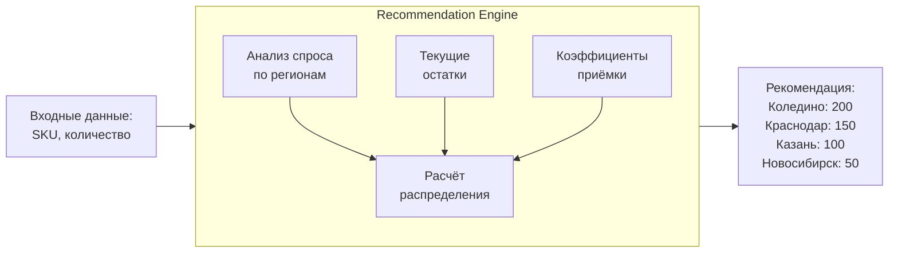
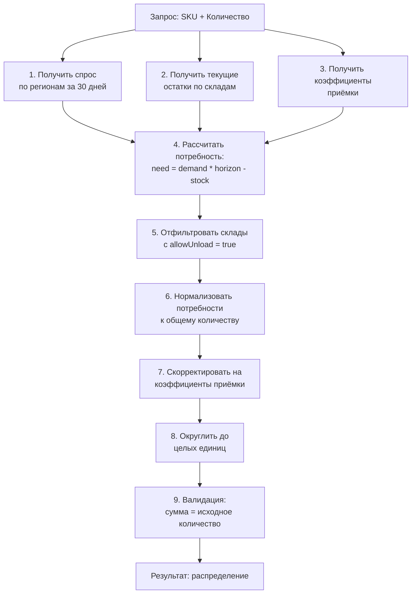

# ADOLF LOGISTIC — Раздел 5: Recommendation Engine

**Проект:** Интеллектуальная система управления логистикой маркетплейсов  
**Модуль:** Logistic / Recommendation Engine  
**Версия:** 1.0  
**Дата:** Январь 2026

---

## 5.1 Назначение

### Описание

Recommendation Engine — компонент модуля Logistic, отвечающий за:
- Расчёт оптимального распределения поставок по складам
- Прогнозирование спроса по регионам
- Формирование рекомендаций с учётом коэффициентов приёмки
- Анализ эффективности прошлых поставок

### Ключевая задача



---

## 5.2 Алгоритм распределения

### Логика расчёта



### Формула расчёта

```
Для каждого склада W:

1. Demand[W] = sum(sales за 30 дней в регионах, обслуживаемых W) / 30

2. Need[W] = max(0, Demand[W] * Horizon_days - Stock[W])

3. Need_normalized[W] = Need[W] / sum(Need) * Total_quantity

4. Adjusted[W] = Need_normalized[W] * (1 - Coef_penalty[W])

5. Final[W] = round(Adjusted[W] / sum(Adjusted) * Total_quantity)
```

где:
- `Horizon_days` — горизонт прогноза (по умолчанию 14 дней)
- `Coef_penalty[W]` — штраф за платную приёмку (0-0.3)

---

## 5.3 Модель данных

### Входные данные

```python
@dataclass
class DistributionRequest:
    """Запрос на расчёт распределения."""
    sku: str
    size: Optional[str]
    total_quantity: int
    horizon_days: int = 14
    consider_acceptance_coef: bool = True
    priority_warehouses: Optional[list[str]] = None


@dataclass
class RegionalDemand:
    """Спрос по региону."""
    region_name: str
    oblast_okrug_name: str
    sales_count: int
    sales_per_day: float
    optimal_warehouse: str


@dataclass
class WarehouseStock:
    """Остаток на складе."""
    warehouse_name: str
    warehouse_id: int
    current_quantity: int
    in_way_to_client: int


@dataclass
class AcceptanceCoefficient:
    """Коэффициент приёмки."""
    warehouse_name: str
    warehouse_id: int
    date: datetime
    coefficient: float
    allow_unload: bool
    storage_coef: float
    delivery_coef: float
```

### Выходные данные

```python
@dataclass
class WarehouseRecommendation:
    """Рекомендация для одного склада."""
    warehouse_name: str
    warehouse_id: int
    recommended_quantity: int
    
    # Аналитика
    current_stock: int
    regional_demand_per_day: float
    days_of_stock_after: float
    
    # Коэффициенты
    acceptance_coefficient: float
    acceptance_cost: float
    
    # Статус
    allow_unload: bool
    is_priority: bool


@dataclass
class DistributionRecommendation:
    """Полная рекомендация по распределению."""
    sku: str
    size: Optional[str]
    total_quantity: int
    
    warehouses: list[WarehouseRecommendation]
    
    # Метрики
    total_acceptance_cost: float
    expected_cross_dock_rate: float
    coverage_days: float
    
    # Рекомендации
    summary: str
    warnings: list[str]
    
    created_at: datetime = field(default_factory=datetime.now)
```

---

## 5.4 Сервис Demand Forecaster

### Прогнозирование спроса

```python
class DemandForecaster:
    """Прогнозирование спроса по регионам."""
    
    def __init__(
        self,
        sales_repo: SalesRepository,
        config: ForecastConfig
    ):
        self.sales_repo = sales_repo
        self.config = config
    
    async def forecast_by_region(
        self,
        sku: str,
        size: Optional[str] = None,
        days: int = 30
    ) -> list[RegionalDemand]:
        """
        Прогноз спроса в разрезе регионов.
        
        Args:
            sku: Артикул
            size: Размер (опционально)
            days: Период для анализа
            
        Returns:
            Список RegionalDemand по каждому региону
        """
        date_from = datetime.now() - timedelta(days=days)
        
        # Получаем продажи с группировкой по регионам
        regional_sales = await self.sales_repo.get_sales_by_region(
            sku=sku,
            size=size,
            date_from=date_from
        )
        
        results = []
        for region, sales_data in regional_sales.items():
            sales_per_day = sales_data["count"] / days
            
            # Определяем оптимальный склад для региона
            optimal_warehouse = self._get_optimal_warehouse(
                sales_data["region_name"],
                sales_data["okrug_name"]
            )
            
            results.append(RegionalDemand(
                region_name=sales_data["region_name"],
                oblast_okrug_name=sales_data["okrug_name"],
                sales_count=sales_data["count"],
                sales_per_day=sales_per_day,
                optimal_warehouse=optimal_warehouse
            ))
        
        return results
    
    async def forecast_by_warehouse(
        self,
        sku: str,
        size: Optional[str] = None,
        days: int = 30
    ) -> dict[str, float]:
        """
        Прогноз спроса в разрезе складов.
        
        Агрегирует региональный спрос по обслуживающим складам.
        """
        regional_demand = await self.forecast_by_region(sku, size, days)
        
        warehouse_demand: dict[str, float] = {}
        
        for demand in regional_demand:
            wh = demand.optimal_warehouse
            if wh not in warehouse_demand:
                warehouse_demand[wh] = 0
            warehouse_demand[wh] += demand.sales_per_day
        
        return warehouse_demand
    
    def _get_optimal_warehouse(
        self,
        region_name: str,
        okrug_name: str
    ) -> str:
        """Определение оптимального склада для региона."""
        mapping = REGION_WAREHOUSE_MATRIX.get(region_name)
        
        if mapping and mapping.optimal_warehouses:
            return mapping.optimal_warehouses[0]
        
        return DEFAULT_BY_OKRUG.get(okrug_name, ["Коледино"])[0]
```

---

## 5.5 Сервис Distribution Calculator

### Расчёт распределения

```python
class DistributionCalculator:
    """Калькулятор распределения поставок."""
    
    def __init__(
        self,
        demand_forecaster: DemandForecaster,
        stock_service: StockService,
        acceptance_service: AcceptanceService,
        config: DistributionConfig
    ):
        self.demand_forecaster = demand_forecaster
        self.stock_service = stock_service
        self.acceptance_service = acceptance_service
        self.config = config
    
    async def calculate(
        self,
        request: DistributionRequest
    ) -> DistributionRecommendation:
        """
        Расчёт оптимального распределения.
        
        Args:
            request: Параметры запроса
            
        Returns:
            Рекомендация по распределению
        """
        # 1. Получаем спрос по складам
        warehouse_demand = await self.demand_forecaster.forecast_by_warehouse(
            sku=request.sku,
            size=request.size
        )
        
        # 2. Получаем текущие остатки
        current_stocks = await self.stock_service.get_stocks_by_sku(
            sku=request.sku,
            size=request.size
        )
        stocks_by_wh = {s.warehouse_name: s.current_quantity for s in current_stocks}
        
        # 3. Получаем коэффициенты приёмки
        acceptance = await self.acceptance_service.get_coefficients()
        acceptance_by_wh = {a.warehouse_name: a for a in acceptance}
        
        # 4. Фильтруем склады
        available_warehouses = self._filter_warehouses(
            warehouse_demand.keys(),
            acceptance_by_wh,
            request.priority_warehouses
        )
        
        if not available_warehouses:
            return self._empty_recommendation(request, "Нет доступных складов")
        
        # 5. Рассчитываем потребности
        needs = self._calculate_needs(
            warehouse_demand,
            stocks_by_wh,
            available_warehouses,
            request.horizon_days
        )
        
        # 6. Нормализуем и корректируем
        distribution = self._calculate_distribution(
            needs,
            acceptance_by_wh,
            request.total_quantity,
            request.consider_acceptance_coef
        )
        
        # 7. Формируем рекомендации
        recommendations = []
        total_acceptance_cost = 0
        
        for wh_name, qty in distribution.items():
            if qty <= 0:
                continue
            
            stock = stocks_by_wh.get(wh_name, 0)
            demand = warehouse_demand.get(wh_name, 0)
            coef = acceptance_by_wh.get(wh_name)
            
            acceptance_cost = self._calculate_acceptance_cost(
                qty, coef.coefficient if coef else 0
            )
            total_acceptance_cost += acceptance_cost
            
            days_after = (stock + qty) / demand if demand > 0 else float('inf')
            
            recommendations.append(WarehouseRecommendation(
                warehouse_name=wh_name,
                warehouse_id=coef.warehouse_id if coef else 0,
                recommended_quantity=qty,
                current_stock=stock,
                regional_demand_per_day=demand,
                days_of_stock_after=days_after,
                acceptance_coefficient=coef.coefficient if coef else 0,
                acceptance_cost=acceptance_cost,
                allow_unload=coef.allow_unload if coef else True,
                is_priority=wh_name in (request.priority_warehouses or [])
            ))
        
        # 8. Расчёт метрик
        expected_cross_dock = self._estimate_cross_dock_rate(
            recommendations, warehouse_demand
        )
        
        avg_coverage = self._calculate_coverage(recommendations)
        
        # 9. Формируем summary и warnings
        summary, warnings = self._generate_summary(
            recommendations,
            expected_cross_dock,
            total_acceptance_cost
        )
        
        return DistributionRecommendation(
            sku=request.sku,
            size=request.size,
            total_quantity=request.total_quantity,
            warehouses=sorted(
                recommendations,
                key=lambda r: r.recommended_quantity,
                reverse=True
            ),
            total_acceptance_cost=total_acceptance_cost,
            expected_cross_dock_rate=expected_cross_dock,
            coverage_days=avg_coverage,
            summary=summary,
            warnings=warnings
        )
    
    def _filter_warehouses(
        self,
        demanded_warehouses: list[str],
        acceptance: dict[str, AcceptanceCoefficient],
        priority: Optional[list[str]]
    ) -> list[str]:
        """Фильтрация доступных складов."""
        available = []
        
        for wh in demanded_warehouses:
            coef = acceptance.get(wh)
            
            # Проверяем разрешение на выгрузку
            if coef and not coef.allow_unload:
                continue
            
            available.append(wh)
        
        # Добавляем приоритетные, если они отсутствуют
        if priority:
            for wh in priority:
                if wh not in available:
                    coef = acceptance.get(wh)
                    if coef and coef.allow_unload:
                        available.append(wh)
        
        return available
    
    def _calculate_needs(
        self,
        demand: dict[str, float],
        stocks: dict[str, int],
        warehouses: list[str],
        horizon_days: int
    ) -> dict[str, float]:
        """Расчёт потребностей по складам."""
        needs = {}
        
        for wh in warehouses:
            wh_demand = demand.get(wh, 0)
            wh_stock = stocks.get(wh, 0)
            
            # Потребность = прогноз - текущий остаток
            expected_demand = wh_demand * horizon_days
            need = max(0, expected_demand - wh_stock)
            
            needs[wh] = need
        
        return needs
    
    def _calculate_distribution(
        self,
        needs: dict[str, float],
        acceptance: dict[str, AcceptanceCoefficient],
        total_quantity: int,
        consider_coef: bool
    ) -> dict[str, int]:
        """Расчёт финального распределения."""
        total_need = sum(needs.values())
        
        if total_need == 0:
            # Равномерное распределение
            warehouses = list(needs.keys())
            per_wh = total_quantity // len(warehouses)
            remainder = total_quantity % len(warehouses)
            
            distribution = {wh: per_wh for wh in warehouses}
            # Распределяем остаток
            for i, wh in enumerate(warehouses):
                if i < remainder:
                    distribution[wh] += 1
            
            return distribution
        
        # Нормализуем потребности
        normalized = {
            wh: need / total_need * total_quantity
            for wh, need in needs.items()
        }
        
        # Корректируем на коэффициенты приёмки
        if consider_coef:
            adjusted = {}
            for wh, qty in normalized.items():
                coef = acceptance.get(wh)
                penalty = 0
                
                if coef and coef.coefficient > 0:
                    # Штраф за платную приёмку (до 30%)
                    penalty = min(0.3, coef.coefficient * 0.1)
                
                adjusted[wh] = qty * (1 - penalty)
            
            # Перенормализуем
            total_adjusted = sum(adjusted.values())
            if total_adjusted > 0:
                normalized = {
                    wh: qty / total_adjusted * total_quantity
                    for wh, qty in adjusted.items()
                }
        
        # Округляем
        distribution = {}
        allocated = 0
        
        items = sorted(
            normalized.items(),
            key=lambda x: x[1] - int(x[1]),
            reverse=True
        )
        
        for wh, qty in items:
            rounded = int(qty)
            distribution[wh] = rounded
            allocated += rounded
        
        # Распределяем остаток
        remainder = total_quantity - allocated
        for wh, _ in items:
            if remainder <= 0:
                break
            distribution[wh] += 1
            remainder -= 1
        
        return distribution
    
    def _calculate_acceptance_cost(
        self,
        quantity: int,
        coefficient: float
    ) -> float:
        """Расчёт стоимости приёмки."""
        if coefficient <= 0:
            return 0
        
        base_rate = self.config.acceptance_base_rate  # ~50 ₽/единица
        return quantity * base_rate * coefficient
    
    def _estimate_cross_dock_rate(
        self,
        recommendations: list[WarehouseRecommendation],
        demand: dict[str, float]
    ) -> float:
        """Оценка ожидаемого уровня кросс-докинга."""
        total_demand = sum(demand.values())
        if total_demand == 0:
            return 0
        
        covered_demand = 0
        for rec in recommendations:
            if rec.days_of_stock_after >= self.config.min_coverage_days:
                covered_demand += demand.get(rec.warehouse_name, 0)
        
        coverage_rate = covered_demand / total_demand
        
        # Кросс-докинг = 1 - coverage
        return max(0, (1 - coverage_rate) * 100)
    
    def _calculate_coverage(
        self,
        recommendations: list[WarehouseRecommendation]
    ) -> float:
        """Расчёт среднего покрытия в днях."""
        if not recommendations:
            return 0
        
        coverages = [
            r.days_of_stock_after 
            for r in recommendations 
            if r.days_of_stock_after < float('inf')
        ]
        
        return sum(coverages) / len(coverages) if coverages else 0
    
    def _generate_summary(
        self,
        recommendations: list[WarehouseRecommendation],
        cross_dock_rate: float,
        acceptance_cost: float
    ) -> tuple[str, list[str]]:
        """Генерация текстового summary и warnings."""
        warnings = []
        
        # Проверяем склады с низким покрытием
        for rec in recommendations:
            if 0 < rec.days_of_stock_after < 7:
                warnings.append(
                    f"⚠️ {rec.warehouse_name}: покрытие только {rec.days_of_stock_after:.0f} дней"
                )
        
        # Проверяем дорогую приёмку
        if acceptance_cost > 1000:
            warnings.append(
                f"⚠️ Высокая стоимость приёмки: {acceptance_cost:.0f} ₽"
            )
        
        # Проверяем кросс-докинг
        if cross_dock_rate > 5:
            warnings.append(
                f"⚠️ Ожидаемый кросс-докинг: {cross_dock_rate:.1f}%"
            )
        
        # Summary
        if cross_dock_rate < 3 and not warnings:
            summary = "✅ Оптимальное распределение. Ожидаемый кросс-докинг < 3%."
        elif cross_dock_rate < 5:
            summary = "🟡 Хорошее распределение с незначительными рисками."
        else:
            summary = "⚠️ Рекомендуется пересмотреть распределение для снижения кросс-докинга."
        
        return summary, warnings
```

---

## 5.6 Анализ истории поставок

### Сервис Supply History

```python
@dataclass
class SupplyRecord:
    """Запись о поставке."""
    supply_id: str
    supply_date: datetime
    warehouse_name: str
    warehouse_id: int
    sku: str
    size: Optional[str]
    quantity: int
    acceptance_coefficient: float
    acceptance_cost: float
    brand_id: str


@dataclass
class SupplyEfficiency:
    """Эффективность поставки."""
    supply_id: str
    supply_date: datetime
    warehouse_name: str
    quantity_supplied: int
    
    # Метрики эффективности
    days_until_low_stock: Optional[int]  # дней до критического уровня
    cross_dock_events_after: int  # кросс-докингов после поставки
    avg_daily_sales: float  # средние продажи после поставки
    
    # Оценка
    efficiency_score: float  # 0-100
    verdict: str


class SupplyHistoryService:
    """Сервис анализа истории поставок."""
    
    def __init__(
        self,
        supply_repo: SupplyRepository,
        stock_repo: StockRepository,
        cross_dock_repo: CrossDockRepository,
        sales_repo: SalesRepository
    ):
        self.supply_repo = supply_repo
        self.stock_repo = stock_repo
        self.cross_dock_repo = cross_dock_repo
        self.sales_repo = sales_repo
    
    async def get_supply_history(
        self,
        sku: Optional[str] = None,
        date_from: Optional[datetime] = None,
        date_to: Optional[datetime] = None,
        warehouse_name: Optional[str] = None,
        brand_id: Optional[str] = None,
        limit: int = 100
    ) -> list[SupplyRecord]:
        """Получение истории поставок."""
        return await self.supply_repo.get_supplies(
            sku=sku,
            date_from=date_from,
            date_to=date_to,
            warehouse_name=warehouse_name,
            brand_id=brand_id,
            limit=limit
        )
    
    async def analyze_supply_efficiency(
        self,
        supply_id: str
    ) -> SupplyEfficiency:
        """Анализ эффективности конкретной поставки."""
        supply = await self.supply_repo.get_by_id(supply_id)
        
        if not supply:
            raise ValueError(f"Supply {supply_id} not found")
        
        # Период анализа: от даты поставки до сейчас или до следующей поставки
        next_supply = await self.supply_repo.get_next_supply(
            sku=supply.sku,
            size=supply.size,
            warehouse_name=supply.warehouse_name,
            after_date=supply.supply_date
        )
        
        period_end = next_supply.supply_date if next_supply else datetime.now()
        period_days = (period_end - supply.supply_date).days
        
        if period_days == 0:
            period_days = 1
        
        # Получаем продажи за период
        sales = await self.sales_repo.get_sales_count(
            sku=supply.sku,
            size=supply.size,
            warehouse_name=supply.warehouse_name,
            date_from=supply.supply_date,
            date_to=period_end
        )
        
        avg_daily_sales = sales / period_days
        
        # Получаем кросс-докинги после поставки
        cross_docks = await self.cross_dock_repo.count_events(
            sku=supply.sku,
            size=supply.size,
            date_from=supply.supply_date,
            date_to=period_end
        )
        
        # Определяем дни до критического уровня
        days_until_low = await self._calculate_days_until_low(
            supply, avg_daily_sales
        )
        
        # Расчёт оценки эффективности
        score, verdict = self._calculate_efficiency_score(
            supply.quantity,
            sales,
            cross_docks,
            period_days,
            days_until_low
        )
        
        return SupplyEfficiency(
            supply_id=supply_id,
            supply_date=supply.supply_date,
            warehouse_name=supply.warehouse_name,
            quantity_supplied=supply.quantity,
            days_until_low_stock=days_until_low,
            cross_dock_events_after=cross_docks,
            avg_daily_sales=avg_daily_sales,
            efficiency_score=score,
            verdict=verdict
        )
    
    async def get_warehouse_efficiency_summary(
        self,
        days: int = 90
    ) -> dict[str, dict]:
        """Сводка эффективности по складам."""
        date_from = datetime.now() - timedelta(days=days)
        
        supplies = await self.supply_repo.get_supplies(date_from=date_from)
        
        warehouse_stats: dict[str, dict] = {}
        
        for supply in supplies:
            wh = supply.warehouse_name
            if wh not in warehouse_stats:
                warehouse_stats[wh] = {
                    "total_supplies": 0,
                    "total_quantity": 0,
                    "total_acceptance_cost": 0,
                    "avg_efficiency": 0,
                    "efficiencies": []
                }
            
            warehouse_stats[wh]["total_supplies"] += 1
            warehouse_stats[wh]["total_quantity"] += supply.quantity
            warehouse_stats[wh]["total_acceptance_cost"] += supply.acceptance_cost
            
            # Анализируем эффективность
            efficiency = await self.analyze_supply_efficiency(supply.supply_id)
            warehouse_stats[wh]["efficiencies"].append(efficiency.efficiency_score)
        
        # Рассчитываем средние
        for wh, stats in warehouse_stats.items():
            if stats["efficiencies"]:
                stats["avg_efficiency"] = sum(stats["efficiencies"]) / len(stats["efficiencies"])
            del stats["efficiencies"]
        
        return warehouse_stats
    
    def _calculate_efficiency_score(
        self,
        quantity: int,
        sales: int,
        cross_docks: int,
        period_days: int,
        days_until_low: Optional[int]
    ) -> tuple[float, str]:
        """Расчёт оценки эффективности."""
        score = 100.0
        
        # Штраф за кросс-докинг
        cross_dock_rate = cross_docks / sales * 100 if sales > 0 else 0
        score -= min(30, cross_dock_rate * 3)
        
        # Штраф за быстрое обнуление
        if days_until_low is not None:
            if days_until_low < 7:
                score -= 20
            elif days_until_low < 14:
                score -= 10
        
        # Штраф за избыточный запас
        sell_through = sales / quantity if quantity > 0 else 0
        if sell_through < 0.3 and period_days > 30:
            score -= 15  # Продали менее 30% за месяц
        
        # Определяем verdict
        if score >= 80:
            verdict = "Отлично: поставка оптимальна"
        elif score >= 60:
            verdict = "Хорошо: незначительные отклонения"
        elif score >= 40:
            verdict = "Удовлетворительно: есть проблемы"
        else:
            verdict = "Плохо: требуется пересмотр стратегии"
        
        return max(0, score), verdict
    
    async def _calculate_days_until_low(
        self,
        supply: SupplyRecord,
        avg_daily_sales: float
    ) -> Optional[int]:
        """Расчёт дней до критического уровня после поставки."""
        if avg_daily_sales <= 0:
            return None
        
        # Получаем конфигурацию порогов
        critical_threshold = 10  # TODO: из конфига
        
        days_until_low = (supply.quantity - critical_threshold) / avg_daily_sales
        
        return int(max(0, days_until_low))
```

---

## 5.7 API Endpoints

### REST API

```python
router = APIRouter(prefix="/logistic/recommendations", tags=["Logistic Recommendations"])


@router.post("/distribution")
async def calculate_distribution(
    request: DistributionRequest,
    calculator: DistributionCalculator = Depends(get_calculator),
    current_user: User = Depends(get_current_user)
) -> DistributionRecommendation:
    """
    Расчёт оптимального распределения поставки.
    
    Возвращает рекомендацию с разбивкой по складам.
    """
    return await calculator.calculate(request)


@router.get("/demand/{sku}")
async def get_demand_forecast(
    sku: str,
    size: Optional[str] = Query(None),
    days: int = Query(30, le=90),
    forecaster: DemandForecaster = Depends(get_forecaster)
) -> dict:
    """
    Прогноз спроса по регионам.
    
    Показывает распределение спроса.
    """
    by_region = await forecaster.forecast_by_region(sku, size, days)
    by_warehouse = await forecaster.forecast_by_warehouse(sku, size, days)
    
    return {
        "sku": sku,
        "size": size,
        "period_days": days,
        "by_region": [asdict(r) for r in by_region],
        "by_warehouse": by_warehouse,
        "total_daily_demand": sum(by_warehouse.values())
    }


@router.get("/acceptance-coefficients")
async def get_acceptance_coefficients(
    acceptance_service: AcceptanceService = Depends(get_acceptance_service)
) -> list[AcceptanceCoefficient]:
    """
    Текущие коэффициенты приёмки.
    
    Показывает доступность и стоимость приёмки по складам.
    """
    return await acceptance_service.get_coefficients()


@router.get("/supply-history")
async def get_supply_history(
    sku: Optional[str] = Query(None),
    warehouse_name: Optional[str] = Query(None),
    date_from: Optional[datetime] = Query(None),
    date_to: Optional[datetime] = Query(None),
    limit: int = Query(50, le=200),
    history_service: SupplyHistoryService = Depends(get_history_service),
    current_user: User = Depends(get_current_user)
) -> list[SupplyRecord]:
    """
    История поставок.
    
    Список прошлых поставок с фильтрацией.
    """
    return await history_service.get_supply_history(
        sku=sku,
        warehouse_name=warehouse_name,
        date_from=date_from,
        date_to=date_to,
        brand_id=current_user.brand_id,
        limit=limit
    )


@router.get("/supply-efficiency/{supply_id}")
async def get_supply_efficiency(
    supply_id: str,
    history_service: SupplyHistoryService = Depends(get_history_service)
) -> SupplyEfficiency:
    """
    Анализ эффективности поставки.
    
    Детальный анализ конкретной поставки.
    """
    return await history_service.analyze_supply_efficiency(supply_id)


@router.get("/warehouse-efficiency")
async def get_warehouse_efficiency(
    days: int = Query(90, le=180),
    history_service: SupplyHistoryService = Depends(get_history_service)
) -> dict[str, dict]:
    """
    Эффективность по складам.
    
    Сравнительный анализ эффективности поставок.
    """
    return await history_service.get_warehouse_efficiency_summary(days)
```

---

## 5.8 Конфигурация

```python
@dataclass
class DistributionConfig:
    """Конфигурация расчёта распределения."""
    
    # Горизонт прогноза по умолчанию
    default_horizon_days: int = 14
    
    # Минимальное покрытие для "хорошего" распределения
    min_coverage_days: int = 7
    
    # Базовая ставка приёмки
    acceptance_base_rate: float = 50.0
    
    # Максимальный штраф за платную приёмку
    max_acceptance_penalty: float = 0.3
    
    # Минимальное количество для рекомендации склада
    min_recommendation_quantity: int = 5


@dataclass
class ForecastConfig:
    """Конфигурация прогнозирования."""
    
    # Период для анализа
    default_analysis_days: int = 30
    
    # Минимум продаж для надёжного прогноза
    min_sales_for_forecast: int = 10
    
    # Весовой коэффициент для недавних продаж
    recency_weight: float = 1.5
```

---

**Документ подготовлен:** Январь 2026  
**Версия:** 1.0  
**Статус:** Черновик
