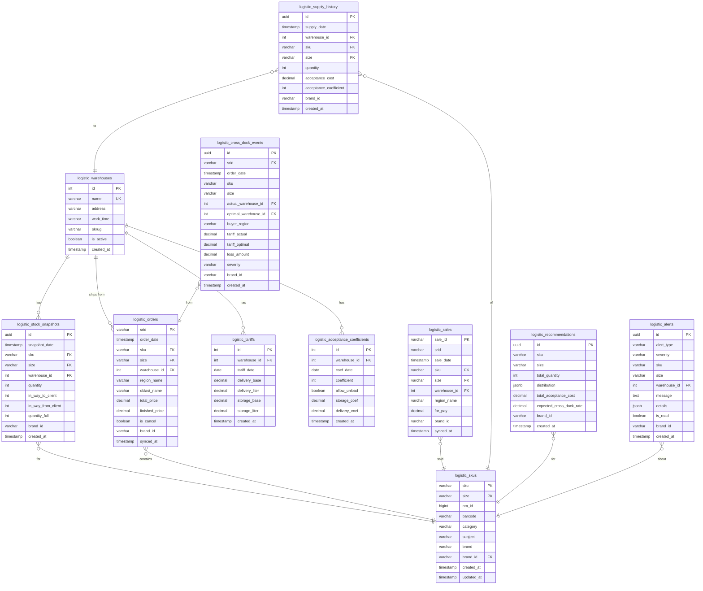

# ADOLF LOGISTIC — Раздел 6: Database

**Проект:** Интеллектуальная система управления логистикой маркетплейсов  
**Модуль:** Logistic / Database  
**Версия:** 1.0  
**Дата:** Январь 2026

---

## 6.1 Обзор схемы

### Диаграмма таблиц



---

## 6.2 Таблицы

### 6.2.1 logistic_skus

Справочник SKU (артикул + размер).

```sql
CREATE TABLE logistic_skus (
    sku VARCHAR(100) NOT NULL,
    size VARCHAR(50) NOT NULL,
    nm_id BIGINT,
    barcode VARCHAR(50),
    category VARCHAR(200),
    subject VARCHAR(200),
    brand VARCHAR(200),
    brand_id VARCHAR(50) REFERENCES core_brands(id),
    created_at TIMESTAMP WITH TIME ZONE DEFAULT NOW(),
    updated_at TIMESTAMP WITH TIME ZONE DEFAULT NOW(),
    
    PRIMARY KEY (sku, size)
);

CREATE INDEX idx_logistic_skus_nm_id ON logistic_skus(nm_id);
CREATE INDEX idx_logistic_skus_barcode ON logistic_skus(barcode);
CREATE INDEX idx_logistic_skus_brand_id ON logistic_skus(brand_id);
CREATE INDEX idx_logistic_skus_category ON logistic_skus(category);

COMMENT ON TABLE logistic_skus IS 'Справочник товаров для модуля Logistic';
COMMENT ON COLUMN logistic_skus.sku IS 'Артикул продавца (supplierArticle)';
COMMENT ON COLUMN logistic_skus.size IS 'Размер (techSize)';
COMMENT ON COLUMN logistic_skus.nm_id IS 'Номенклатура WB';
```

### 6.2.2 logistic_warehouses

Справочник складов WB.

```sql
CREATE TABLE logistic_warehouses (
    id INTEGER PRIMARY KEY,
    name VARCHAR(200) NOT NULL UNIQUE,
    address TEXT,
    work_time VARCHAR(50),
    okrug VARCHAR(100),
    is_active BOOLEAN DEFAULT TRUE,
    is_transit_active BOOLEAN DEFAULT FALSE,
    created_at TIMESTAMP WITH TIME ZONE DEFAULT NOW()
);

CREATE INDEX idx_logistic_warehouses_name ON logistic_warehouses(name);
CREATE INDEX idx_logistic_warehouses_okrug ON logistic_warehouses(okrug);

COMMENT ON TABLE logistic_warehouses IS 'Справочник складов Wildberries';
COMMENT ON COLUMN logistic_warehouses.okrug IS 'Федеральный округ расположения склада';
```

**Начальные данные:**

```sql
INSERT INTO logistic_warehouses (id, name, okrug, is_active) VALUES
    (507, 'Коледино', 'Центральный федеральный округ', true),
    (686, 'Подольск', 'Центральный федеральный округ', true),
    (1193, 'Электросталь', 'Центральный федеральный округ', true),
    (301, 'Санкт-Петербург', 'Северо-Западный федеральный округ', true),
    (1733, 'Краснодар', 'Южный федеральный округ', true),
    (2737, 'Казань', 'Приволжский федеральный округ', true),
    (130744, 'Екатеринбург', 'Уральский федеральный округ', true),
    (117501, 'Новосибирск', 'Сибирский федеральный округ', true),
    (204939, 'Хабаровск', 'Дальневосточный федеральный округ', true);
```

### 6.2.3 logistic_stock_snapshots

Снимки остатков по складам.

```sql
CREATE TABLE logistic_stock_snapshots (
    id UUID PRIMARY KEY DEFAULT gen_random_uuid(),
    snapshot_date TIMESTAMP WITH TIME ZONE NOT NULL,
    sku VARCHAR(100) NOT NULL,
    size VARCHAR(50) NOT NULL,
    warehouse_id INTEGER REFERENCES logistic_warehouses(id),
    quantity INTEGER NOT NULL DEFAULT 0,
    in_way_to_client INTEGER DEFAULT 0,
    in_way_from_client INTEGER DEFAULT 0,
    quantity_full INTEGER DEFAULT 0,
    brand_id VARCHAR(50),
    created_at TIMESTAMP WITH TIME ZONE DEFAULT NOW(),
    
    FOREIGN KEY (sku, size) REFERENCES logistic_skus(sku, size)
);

-- Партиционирование по дате (опционально для v2.0)
-- CREATE TABLE logistic_stock_snapshots ... PARTITION BY RANGE (snapshot_date);

CREATE INDEX idx_logistic_stock_snapshots_date 
    ON logistic_stock_snapshots(snapshot_date DESC);
CREATE INDEX idx_logistic_stock_snapshots_sku_size 
    ON logistic_stock_snapshots(sku, size);
CREATE INDEX idx_logistic_stock_snapshots_warehouse 
    ON logistic_stock_snapshots(warehouse_id);
CREATE INDEX idx_logistic_stock_snapshots_brand 
    ON logistic_stock_snapshots(brand_id);
CREATE INDEX idx_logistic_stock_snapshots_quantity 
    ON logistic_stock_snapshots(quantity) WHERE quantity < 30;

COMMENT ON TABLE logistic_stock_snapshots IS 'Снимки остатков товаров по складам';
COMMENT ON COLUMN logistic_stock_snapshots.snapshot_date IS 'Дата и время снимка';
COMMENT ON COLUMN logistic_stock_snapshots.quantity IS 'Доступный остаток';
COMMENT ON COLUMN logistic_stock_snapshots.quantity_full IS 'Полный остаток (вкл. в пути)';
```

### 6.2.4 logistic_orders

Заказы с информацией для анализа логистики.

```sql
CREATE TABLE logistic_orders (
    srid VARCHAR(100) PRIMARY KEY,
    order_date TIMESTAMP WITH TIME ZONE NOT NULL,
    sku VARCHAR(100) NOT NULL,
    size VARCHAR(50) NOT NULL,
    warehouse_id INTEGER REFERENCES logistic_warehouses(id),
    warehouse_type VARCHAR(50),
    region_name VARCHAR(200),
    oblast_name VARCHAR(200),
    country_name VARCHAR(100) DEFAULT 'Россия',
    total_price DECIMAL(12, 2),
    discount_percent INTEGER,
    finished_price DECIMAL(12, 2),
    is_cancel BOOLEAN DEFAULT FALSE,
    cancel_date TIMESTAMP WITH TIME ZONE,
    brand_id VARCHAR(50),
    synced_at TIMESTAMP WITH TIME ZONE DEFAULT NOW(),
    
    FOREIGN KEY (sku, size) REFERENCES logistic_skus(sku, size)
);

CREATE INDEX idx_logistic_orders_date ON logistic_orders(order_date DESC);
CREATE INDEX idx_logistic_orders_sku_size ON logistic_orders(sku, size);
CREATE INDEX idx_logistic_orders_warehouse ON logistic_orders(warehouse_id);
CREATE INDEX idx_logistic_orders_region ON logistic_orders(region_name);
CREATE INDEX idx_logistic_orders_oblast ON logistic_orders(oblast_name);
CREATE INDEX idx_logistic_orders_brand ON logistic_orders(brand_id);
CREATE INDEX idx_logistic_orders_synced ON logistic_orders(synced_at DESC);

COMMENT ON TABLE logistic_orders IS 'Заказы для анализа логистики';
COMMENT ON COLUMN logistic_orders.srid IS 'Уникальный идентификатор заказа WB';
COMMENT ON COLUMN logistic_orders.region_name IS 'Регион покупателя';
COMMENT ON COLUMN logistic_orders.oblast_name IS 'Федеральный округ покупателя';
```

### 6.2.5 logistic_cross_dock_events

События кросс-докинга.

```sql
CREATE TABLE logistic_cross_dock_events (
    id UUID PRIMARY KEY DEFAULT gen_random_uuid(),
    srid VARCHAR(100) REFERENCES logistic_orders(srid),
    order_date TIMESTAMP WITH TIME ZONE NOT NULL,
    sku VARCHAR(100) NOT NULL,
    size VARCHAR(50) NOT NULL,
    actual_warehouse_id INTEGER REFERENCES logistic_warehouses(id),
    optimal_warehouse_id INTEGER REFERENCES logistic_warehouses(id),
    buyer_region VARCHAR(200),
    buyer_okrug VARCHAR(200),
    tariff_actual DECIMAL(10, 2),
    tariff_optimal DECIMAL(10, 2),
    loss_amount DECIMAL(10, 2),
    severity VARCHAR(20) CHECK (severity IN ('low', 'medium', 'high')),
    brand_id VARCHAR(50),
    created_at TIMESTAMP WITH TIME ZONE DEFAULT NOW()
);

CREATE INDEX idx_logistic_cross_dock_date ON logistic_cross_dock_events(order_date DESC);
CREATE INDEX idx_logistic_cross_dock_sku ON logistic_cross_dock_events(sku, size);
CREATE INDEX idx_logistic_cross_dock_actual_wh ON logistic_cross_dock_events(actual_warehouse_id);
CREATE INDEX idx_logistic_cross_dock_brand ON logistic_cross_dock_events(brand_id);
CREATE INDEX idx_logistic_cross_dock_severity ON logistic_cross_dock_events(severity);

COMMENT ON TABLE logistic_cross_dock_events IS 'События кросс-докинга';
COMMENT ON COLUMN logistic_cross_dock_events.loss_amount IS 'Сумма убытка (tariff_actual - tariff_optimal)';
COMMENT ON COLUMN logistic_cross_dock_events.severity IS 'Серьёзность: low/medium/high';
```

### 6.2.6 logistic_sales

Продажи для анализа спроса.

```sql
CREATE TABLE logistic_sales (
    sale_id VARCHAR(100) PRIMARY KEY,
    srid VARCHAR(100),
    sale_date TIMESTAMP WITH TIME ZONE NOT NULL,
    sku VARCHAR(100) NOT NULL,
    size VARCHAR(50) NOT NULL,
    warehouse_id INTEGER REFERENCES logistic_warehouses(id),
    region_name VARCHAR(200),
    oblast_name VARCHAR(200),
    for_pay DECIMAL(12, 2),
    brand_id VARCHAR(50),
    synced_at TIMESTAMP WITH TIME ZONE DEFAULT NOW(),
    
    FOREIGN KEY (sku, size) REFERENCES logistic_skus(sku, size)
);

CREATE INDEX idx_logistic_sales_date ON logistic_sales(sale_date DESC);
CREATE INDEX idx_logistic_sales_sku_size ON logistic_sales(sku, size);
CREATE INDEX idx_logistic_sales_warehouse ON logistic_sales(warehouse_id);
CREATE INDEX idx_logistic_sales_region ON logistic_sales(region_name);
CREATE INDEX idx_logistic_sales_brand ON logistic_sales(brand_id);

COMMENT ON TABLE logistic_sales IS 'Продажи для анализа спроса';
```

### 6.2.7 logistic_tariffs

Тарифы логистики по складам.

```sql
CREATE TABLE logistic_tariffs (
    id SERIAL PRIMARY KEY,
    warehouse_id INTEGER REFERENCES logistic_warehouses(id),
    tariff_date DATE NOT NULL,
    delivery_base DECIMAL(10, 2),
    delivery_liter DECIMAL(10, 2),
    storage_base DECIMAL(10, 4),
    storage_liter DECIMAL(10, 4),
    delivery_coef DECIMAL(5, 2),
    created_at TIMESTAMP WITH TIME ZONE DEFAULT NOW(),
    
    UNIQUE (warehouse_id, tariff_date)
);

CREATE INDEX idx_logistic_tariffs_date ON logistic_tariffs(tariff_date DESC);
CREATE INDEX idx_logistic_tariffs_warehouse ON logistic_tariffs(warehouse_id);

COMMENT ON TABLE logistic_tariffs IS 'Тарифы логистики по складам';
COMMENT ON COLUMN logistic_tariffs.delivery_base IS 'Базовая стоимость доставки (₽)';
COMMENT ON COLUMN logistic_tariffs.delivery_liter IS 'Стоимость за доп. литр (₽)';
```

### 6.2.8 logistic_acceptance_coefficients

Коэффициенты приёмки складов.

```sql
CREATE TABLE logistic_acceptance_coefficients (
    id SERIAL PRIMARY KEY,
    warehouse_id INTEGER REFERENCES logistic_warehouses(id),
    coef_date DATE NOT NULL,
    coefficient INTEGER NOT NULL,
    allow_unload BOOLEAN DEFAULT FALSE,
    storage_coef DECIMAL(5, 2),
    delivery_coef DECIMAL(5, 2),
    created_at TIMESTAMP WITH TIME ZONE DEFAULT NOW(),
    
    UNIQUE (warehouse_id, coef_date)
);

CREATE INDEX idx_logistic_acceptance_date ON logistic_acceptance_coefficients(coef_date DESC);
CREATE INDEX idx_logistic_acceptance_warehouse ON logistic_acceptance_coefficients(warehouse_id);
CREATE INDEX idx_logistic_acceptance_allow ON logistic_acceptance_coefficients(allow_unload);

COMMENT ON TABLE logistic_acceptance_coefficients IS 'Коэффициенты приёмки складов';
COMMENT ON COLUMN logistic_acceptance_coefficients.coefficient IS '-1: закрыто, 0: бесплатно, 1+: платно';
```

### 6.2.9 logistic_supply_history

История поставок.

```sql
CREATE TABLE logistic_supply_history (
    id UUID PRIMARY KEY DEFAULT gen_random_uuid(),
    supply_date TIMESTAMP WITH TIME ZONE NOT NULL,
    warehouse_id INTEGER REFERENCES logistic_warehouses(id),
    sku VARCHAR(100) NOT NULL,
    size VARCHAR(50) NOT NULL,
    quantity INTEGER NOT NULL,
    acceptance_coefficient INTEGER DEFAULT 0,
    acceptance_cost DECIMAL(12, 2) DEFAULT 0,
    brand_id VARCHAR(50),
    notes TEXT,
    created_at TIMESTAMP WITH TIME ZONE DEFAULT NOW(),
    
    FOREIGN KEY (sku, size) REFERENCES logistic_skus(sku, size)
);

CREATE INDEX idx_logistic_supply_date ON logistic_supply_history(supply_date DESC);
CREATE INDEX idx_logistic_supply_sku ON logistic_supply_history(sku, size);
CREATE INDEX idx_logistic_supply_warehouse ON logistic_supply_history(warehouse_id);
CREATE INDEX idx_logistic_supply_brand ON logistic_supply_history(brand_id);

COMMENT ON TABLE logistic_supply_history IS 'История поставок на склады WB';
```

### 6.2.10 logistic_recommendations

Сохранённые рекомендации.

```sql
CREATE TABLE logistic_recommendations (
    id UUID PRIMARY KEY DEFAULT gen_random_uuid(),
    sku VARCHAR(100) NOT NULL,
    size VARCHAR(50),
    total_quantity INTEGER NOT NULL,
    distribution JSONB NOT NULL,
    total_acceptance_cost DECIMAL(12, 2),
    expected_cross_dock_rate DECIMAL(5, 2),
    coverage_days DECIMAL(5, 1),
    summary TEXT,
    warnings JSONB,
    brand_id VARCHAR(50),
    created_by VARCHAR(100),
    created_at TIMESTAMP WITH TIME ZONE DEFAULT NOW()
);

CREATE INDEX idx_logistic_recommendations_sku ON logistic_recommendations(sku, size);
CREATE INDEX idx_logistic_recommendations_date ON logistic_recommendations(created_at DESC);
CREATE INDEX idx_logistic_recommendations_brand ON logistic_recommendations(brand_id);

COMMENT ON TABLE logistic_recommendations IS 'История рекомендаций по распределению';
COMMENT ON COLUMN logistic_recommendations.distribution IS 'JSON: {warehouse_name: quantity, ...}';
```

**Пример distribution:**

```json
{
  "warehouses": [
    {
      "warehouse_name": "Коледино",
      "warehouse_id": 507,
      "quantity": 200,
      "current_stock": 45,
      "demand_per_day": 8.5,
      "days_after": 28.8,
      "acceptance_cost": 0
    },
    {
      "warehouse_name": "Краснодар",
      "warehouse_id": 1733,
      "quantity": 120,
      "current_stock": 12,
      "demand_per_day": 4.2,
      "days_after": 31.4,
      "acceptance_cost": 6000
    }
  ]
}
```

### 6.2.11 logistic_alerts

Алерты модуля.

```sql
CREATE TABLE logistic_alerts (
    id UUID PRIMARY KEY DEFAULT gen_random_uuid(),
    alert_type VARCHAR(50) NOT NULL,
    severity VARCHAR(20) NOT NULL CHECK (severity IN ('low', 'medium', 'high')),
    sku VARCHAR(100),
    size VARCHAR(50),
    warehouse_id INTEGER REFERENCES logistic_warehouses(id),
    message TEXT NOT NULL,
    details JSONB,
    is_read BOOLEAN DEFAULT FALSE,
    read_at TIMESTAMP WITH TIME ZONE,
    read_by VARCHAR(100),
    brand_id VARCHAR(50),
    created_at TIMESTAMP WITH TIME ZONE DEFAULT NOW()
);

CREATE INDEX idx_logistic_alerts_type ON logistic_alerts(alert_type);
CREATE INDEX idx_logistic_alerts_severity ON logistic_alerts(severity);
CREATE INDEX idx_logistic_alerts_sku ON logistic_alerts(sku, size);
CREATE INDEX idx_logistic_alerts_unread ON logistic_alerts(is_read) WHERE is_read = FALSE;
CREATE INDEX idx_logistic_alerts_brand ON logistic_alerts(brand_id);
CREATE INDEX idx_logistic_alerts_date ON logistic_alerts(created_at DESC);

COMMENT ON TABLE logistic_alerts IS 'Алерты модуля Logistic';
COMMENT ON COLUMN logistic_alerts.alert_type IS 'critical_stock, low_stock, cross_dock, forecast_zero';
```

---

## 6.3 Представления (Views)

### 6.3.1 Текущие остатки

```sql
CREATE OR REPLACE VIEW logistic_current_stocks AS
SELECT DISTINCT ON (ss.sku, ss.size, ss.warehouse_id)
    ss.sku,
    ss.size,
    w.id AS warehouse_id,
    w.name AS warehouse_name,
    ss.quantity,
    ss.quantity_full,
    ss.in_way_to_client,
    ss.in_way_from_client,
    ss.brand_id,
    ss.snapshot_date
FROM logistic_stock_snapshots ss
JOIN logistic_warehouses w ON ss.warehouse_id = w.id
ORDER BY ss.sku, ss.size, ss.warehouse_id, ss.snapshot_date DESC;

COMMENT ON VIEW logistic_current_stocks IS 'Текущие остатки (последний снимок)';
```

### 6.3.2 Сводка кросс-докинга

```sql
CREATE OR REPLACE VIEW logistic_cross_dock_summary AS
SELECT 
    DATE_TRUNC('day', order_date) AS day,
    brand_id,
    COUNT(*) AS cross_dock_count,
    SUM(loss_amount) AS total_loss,
    AVG(loss_amount) AS avg_loss,
    COUNT(*) FILTER (WHERE severity = 'high') AS high_severity_count
FROM logistic_cross_dock_events
GROUP BY DATE_TRUNC('day', order_date), brand_id;

COMMENT ON VIEW logistic_cross_dock_summary IS 'Ежедневная сводка кросс-докинга';
```

### 6.3.3 Velocity по SKU

```sql
CREATE OR REPLACE VIEW logistic_sku_velocity AS
SELECT 
    sku,
    size,
    warehouse_id,
    brand_id,
    COUNT(*) AS sales_30d,
    COUNT(*) / 30.0 AS velocity_per_day,
    COUNT(*) / 4.3 AS velocity_per_week
FROM logistic_sales
WHERE sale_date >= NOW() - INTERVAL '30 days'
GROUP BY sku, size, warehouse_id, brand_id;

COMMENT ON VIEW logistic_sku_velocity IS 'Скорость продаж за 30 дней';
```

### 6.3.4 Критические остатки

```sql
CREATE OR REPLACE VIEW logistic_critical_stocks AS
SELECT 
    cs.sku,
    cs.size,
    cs.warehouse_name,
    cs.quantity,
    cs.brand_id,
    v.velocity_per_day,
    CASE 
        WHEN v.velocity_per_day > 0 
        THEN cs.quantity / v.velocity_per_day 
        ELSE NULL 
    END AS days_until_zero
FROM logistic_current_stocks cs
LEFT JOIN logistic_sku_velocity v 
    ON cs.sku = v.sku 
    AND cs.size = v.size 
    AND cs.warehouse_id = v.warehouse_id
WHERE cs.quantity < 30;

COMMENT ON VIEW logistic_critical_stocks IS 'Товары с низким остатком';
```

---

## 6.4 Функции

### 6.4.1 Upsert SKU

```sql
CREATE OR REPLACE FUNCTION logistic_upsert_sku(
    p_sku VARCHAR,
    p_size VARCHAR,
    p_nm_id BIGINT,
    p_barcode VARCHAR,
    p_category VARCHAR,
    p_subject VARCHAR,
    p_brand VARCHAR,
    p_brand_id VARCHAR
) RETURNS VOID AS $$
BEGIN
    INSERT INTO logistic_skus (sku, size, nm_id, barcode, category, subject, brand, brand_id)
    VALUES (p_sku, p_size, p_nm_id, p_barcode, p_category, p_subject, p_brand, p_brand_id)
    ON CONFLICT (sku, size) DO UPDATE SET
        nm_id = EXCLUDED.nm_id,
        barcode = EXCLUDED.barcode,
        category = EXCLUDED.category,
        subject = EXCLUDED.subject,
        brand = EXCLUDED.brand,
        brand_id = EXCLUDED.brand_id,
        updated_at = NOW();
END;
$$ LANGUAGE plpgsql;
```

### 6.4.2 Расчёт потерь от кросс-докинга

```sql
CREATE OR REPLACE FUNCTION logistic_calculate_cross_dock_loss(
    p_date_from TIMESTAMP,
    p_date_to TIMESTAMP,
    p_brand_id VARCHAR DEFAULT NULL
) RETURNS TABLE (
    total_orders BIGINT,
    cross_dock_orders BIGINT,
    cross_dock_percent DECIMAL,
    total_loss DECIMAL
) AS $$
BEGIN
    RETURN QUERY
    SELECT 
        (SELECT COUNT(*) FROM logistic_orders o 
         WHERE o.order_date BETWEEN p_date_from AND p_date_to
         AND (p_brand_id IS NULL OR o.brand_id = p_brand_id))::BIGINT AS total_orders,
        COUNT(*)::BIGINT AS cross_dock_orders,
        ROUND(COUNT(*) * 100.0 / NULLIF(
            (SELECT COUNT(*) FROM logistic_orders o 
             WHERE o.order_date BETWEEN p_date_from AND p_date_to
             AND (p_brand_id IS NULL OR o.brand_id = p_brand_id)), 0
        ), 2) AS cross_dock_percent,
        COALESCE(SUM(loss_amount), 0) AS total_loss
    FROM logistic_cross_dock_events
    WHERE order_date BETWEEN p_date_from AND p_date_to
    AND (p_brand_id IS NULL OR brand_id = p_brand_id);
END;
$$ LANGUAGE plpgsql;
```

### 6.4.3 Очистка старых данных

```sql
CREATE OR REPLACE FUNCTION logistic_cleanup_old_data(
    p_days_to_keep INTEGER DEFAULT 90
) RETURNS TABLE (
    snapshots_deleted BIGINT,
    orders_deleted BIGINT,
    sales_deleted BIGINT
) AS $$
DECLARE
    v_cutoff TIMESTAMP := NOW() - (p_days_to_keep || ' days')::INTERVAL;
    v_snapshots BIGINT;
    v_orders BIGINT;
    v_sales BIGINT;
BEGIN
    -- Удаляем старые снимки
    WITH deleted AS (
        DELETE FROM logistic_stock_snapshots
        WHERE snapshot_date < v_cutoff
        RETURNING id
    )
    SELECT COUNT(*) INTO v_snapshots FROM deleted;
    
    -- Удаляем старые заказы (без связанных cross_dock_events)
    WITH deleted AS (
        DELETE FROM logistic_orders o
        WHERE o.order_date < v_cutoff
        AND NOT EXISTS (
            SELECT 1 FROM logistic_cross_dock_events e WHERE e.srid = o.srid
        )
        RETURNING srid
    )
    SELECT COUNT(*) INTO v_orders FROM deleted;
    
    -- Удаляем старые продажи
    WITH deleted AS (
        DELETE FROM logistic_sales
        WHERE sale_date < v_cutoff
        RETURNING sale_id
    )
    SELECT COUNT(*) INTO v_sales FROM deleted;
    
    RETURN QUERY SELECT v_snapshots, v_orders, v_sales;
END;
$$ LANGUAGE plpgsql;
```

---

## 6.5 Индексы и оптимизация

### Составные индексы для частых запросов

```sql
-- Остатки по SKU и складу
CREATE INDEX idx_logistic_stocks_sku_wh_date 
    ON logistic_stock_snapshots(sku, size, warehouse_id, snapshot_date DESC);

-- Заказы по дате и региону
CREATE INDEX idx_logistic_orders_date_region 
    ON logistic_orders(order_date DESC, region_name);

-- Кросс-докинг по SKU и дате
CREATE INDEX idx_logistic_cross_dock_sku_date 
    ON logistic_cross_dock_events(sku, size, order_date DESC);

-- Продажи для velocity
CREATE INDEX idx_logistic_sales_sku_wh_date 
    ON logistic_sales(sku, size, warehouse_id, sale_date DESC);
```

### Частичные индексы

```sql
-- Только непрочитанные алерты
CREATE INDEX idx_logistic_alerts_unread_high 
    ON logistic_alerts(created_at DESC) 
    WHERE is_read = FALSE AND severity = 'high';

-- Только активные склады
CREATE INDEX idx_logistic_warehouses_active 
    ON logistic_warehouses(name) 
    WHERE is_active = TRUE;
```

---

## 6.6 Миграции

### Начальная миграция

```sql
-- migrations/001_create_logistic_schema.sql

BEGIN;

-- Создание таблиц
CREATE TABLE IF NOT EXISTS logistic_skus (...);
CREATE TABLE IF NOT EXISTS logistic_warehouses (...);
CREATE TABLE IF NOT EXISTS logistic_stock_snapshots (...);
-- ... остальные таблицы

-- Начальные данные
INSERT INTO logistic_warehouses (id, name, okrug, is_active) VALUES
    (507, 'Коледино', 'Центральный федеральный округ', true)
    -- ...
ON CONFLICT (id) DO NOTHING;

COMMIT;
```

### Rollback

```sql
-- migrations/001_create_logistic_schema_down.sql

BEGIN;

DROP TABLE IF EXISTS logistic_alerts CASCADE;
DROP TABLE IF EXISTS logistic_recommendations CASCADE;
DROP TABLE IF EXISTS logistic_supply_history CASCADE;
DROP TABLE IF EXISTS logistic_acceptance_coefficients CASCADE;
DROP TABLE IF EXISTS logistic_tariffs CASCADE;
DROP TABLE IF EXISTS logistic_sales CASCADE;
DROP TABLE IF EXISTS logistic_cross_dock_events CASCADE;
DROP TABLE IF EXISTS logistic_orders CASCADE;
DROP TABLE IF EXISTS logistic_stock_snapshots CASCADE;
DROP TABLE IF EXISTS logistic_warehouses CASCADE;
DROP TABLE IF EXISTS logistic_skus CASCADE;

DROP VIEW IF EXISTS logistic_current_stocks;
DROP VIEW IF EXISTS logistic_cross_dock_summary;
DROP VIEW IF EXISTS logistic_sku_velocity;
DROP VIEW IF EXISTS logistic_critical_stocks;

DROP FUNCTION IF EXISTS logistic_upsert_sku;
DROP FUNCTION IF EXISTS logistic_calculate_cross_dock_loss;
DROP FUNCTION IF EXISTS logistic_cleanup_old_data;

COMMIT;
```

---

## 6.7 Размер данных (оценка)

| Таблица | Записей/месяц | Размер/месяц |
|---------|---------------|--------------|
| stock_snapshots | ~1.5M (1000 SKU × 20 WH × 48 snapshots) | ~200 MB |
| orders | ~50K | ~15 MB |
| sales | ~40K | ~12 MB |
| cross_dock_events | ~2-5K | ~1 MB |
| tariffs | ~600 (20 WH × 30 days) | < 1 MB |
| alerts | ~500 | < 1 MB |

**Рекомендация:** Архивация данных старше 90 дней.

---

**Документ подготовлен:** Январь 2026  
**Версия:** 1.0  
**Статус:** Черновик
