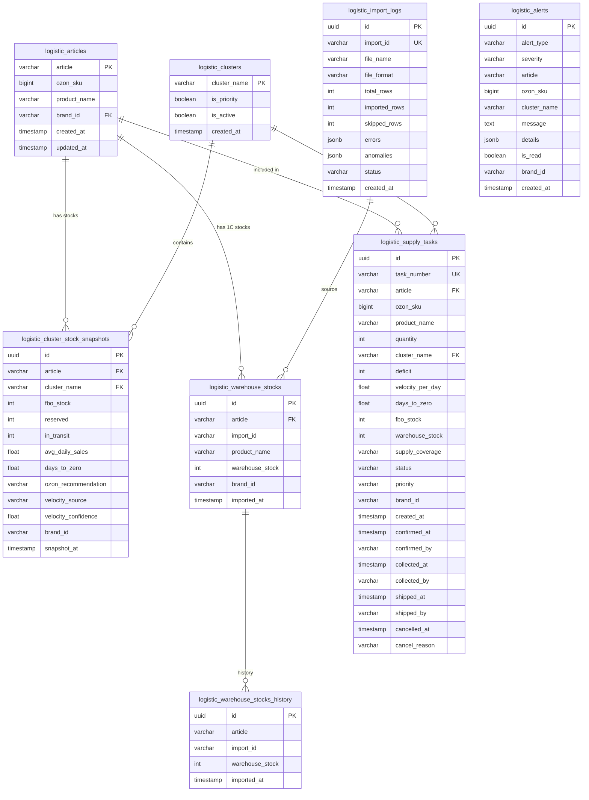

# ADOLF LOGISTIC — Раздел 6: Database

**Проект:** Интеллектуальная система управления логистикой маркетплейсов  
**Модуль:** Logistic / Database  
**Версия:** 2.0  
**Дата:** Февраль 2026  
**Заменяет:** adolf_logistic_6_database_v1_0.md

---

## 6.1 Обзор схемы

### Ключевые изменения v1.0 → v2.0

| Аспект | v1.0 (Wildberries) | v2.0 (Ozon + 1С) |
|--------|-------------------|-------------------|
| Склады | `logistic_warehouses` (id, WB) | `logistic_clusters` (name, Ozon FBO) |
| Остатки | `logistic_stock_snapshots` (qty по складу) | `logistic_cluster_stock_snapshots` (FBO + velocity + in_transit) |
| Заказы | `logistic_orders` + `logistic_sales` | Убраны (данные из Ozon Analytics API) |
| Кросс-докинг | `logistic_cross_dock_events` | Убран (проактивная модель вместо реактивной) |
| Тарифы/коэфф. | `logistic_tariffs`, `logistic_acceptance_coefficients` | Убраны (нерелевантны для Ozon FBO) |
| 1С склад | — | `logistic_warehouse_stocks` + `logistic_warehouse_stocks_history` |
| Наряд-задания | — | `logistic_supply_tasks` |
| Импорт 1С | — | `logistic_import_logs` |
| Рекомендации | `logistic_recommendations` (JSON) | Убраны (заменены supply_tasks) |

### Диаграмма таблиц



---

## 6.2 Таблицы

### 6.2.1 logistic_articles

Справочник артикулов (маппинг 1С ↔ Ozon).

```sql
CREATE TABLE logistic_articles (
    article VARCHAR(100) PRIMARY KEY,
    ozon_sku BIGINT,
    product_name VARCHAR(500),
    brand_id VARCHAR(50) REFERENCES core_brands(id),
    created_at TIMESTAMP WITH TIME ZONE DEFAULT NOW(),
    updated_at TIMESTAMP WITH TIME ZONE DEFAULT NOW()
);

CREATE INDEX idx_logistic_articles_ozon_sku ON logistic_articles(ozon_sku);
CREATE INDEX idx_logistic_articles_brand ON logistic_articles(brand_id);

COMMENT ON TABLE logistic_articles IS 'Справочник артикулов: article (1С) = offer_id (Ozon)';
COMMENT ON COLUMN logistic_articles.article IS 'Артикул продавца = offer_id в Ozon';
COMMENT ON COLUMN logistic_articles.ozon_sku IS 'SKU Ozon (числовой)';
```

### 6.2.2 logistic_clusters

Справочник кластеров Ozon FBO (31 кластер).

```sql
CREATE TABLE logistic_clusters (
    cluster_name VARCHAR(200) PRIMARY KEY,
    is_priority BOOLEAN DEFAULT FALSE,
    is_active BOOLEAN DEFAULT TRUE,
    created_at TIMESTAMP WITH TIME ZONE DEFAULT NOW()
);

CREATE INDEX idx_logistic_clusters_priority 
    ON logistic_clusters(is_priority) WHERE is_priority = TRUE;

COMMENT ON TABLE logistic_clusters IS 'Кластеры Ozon FBO (31 шт)';
COMMENT ON COLUMN logistic_clusters.is_priority IS 'Приоритетный кластер для мониторинга';
```

**Начальные данные (приоритетные кластеры):**

```sql
INSERT INTO logistic_clusters (cluster_name, is_priority) VALUES
    ('Москва, МО и Дальние регионы', true),
    ('Дальний Восток', true),
    ('Урал и Западная Сибирь', true),
    ('Юг', true),
    ('Поволжье', true)
ON CONFLICT (cluster_name) DO UPDATE SET is_priority = EXCLUDED.is_priority;
```

### 6.2.3 logistic_cluster_stock_snapshots

Снимки остатков FBO по кластерам (источник: Ozon API).

```sql
CREATE TABLE logistic_cluster_stock_snapshots (
    id UUID PRIMARY KEY DEFAULT gen_random_uuid(),
    article VARCHAR(100) NOT NULL REFERENCES logistic_articles(article),
    ozon_sku BIGINT,
    product_name VARCHAR(500),
    cluster_name VARCHAR(200) NOT NULL REFERENCES logistic_clusters(cluster_name),
    
    -- Остатки Ozon FBO
    fbo_stock INTEGER NOT NULL DEFAULT 0,
    reserved INTEGER DEFAULT 0,
    in_transit INTEGER DEFAULT 0,
    
    -- Аналитика
    avg_daily_sales FLOAT,
    days_to_zero FLOAT,
    ozon_recommendation VARCHAR(100),
    
    -- Velocity метаданные
    velocity_source VARCHAR(20) CHECK (velocity_source IN ('ozon', 'calculated', 'none')),
    velocity_confidence VARCHAR(10) CHECK (velocity_confidence IN ('high', 'medium', 'low', 'none')),
    
    brand_id VARCHAR(50),
    snapshot_at TIMESTAMP WITH TIME ZONE NOT NULL DEFAULT NOW()
);

CREATE INDEX idx_cluster_stocks_article 
    ON logistic_cluster_stock_snapshots(article);
CREATE INDEX idx_cluster_stocks_cluster 
    ON logistic_cluster_stock_snapshots(cluster_name);
CREATE INDEX idx_cluster_stocks_snapshot 
    ON logistic_cluster_stock_snapshots(snapshot_at DESC);
CREATE INDEX idx_cluster_stocks_article_cluster_date 
    ON logistic_cluster_stock_snapshots(article, cluster_name, snapshot_at DESC);
CREATE INDEX idx_cluster_stocks_brand 
    ON logistic_cluster_stock_snapshots(brand_id);
CREATE INDEX idx_cluster_stocks_low 
    ON logistic_cluster_stock_snapshots(days_to_zero) 
    WHERE days_to_zero IS NOT NULL AND days_to_zero < 7;

COMMENT ON TABLE logistic_cluster_stock_snapshots IS 'Снимки остатков FBO по кластерам Ozon (каждые 30 мин)';
COMMENT ON COLUMN logistic_cluster_stock_snapshots.avg_daily_sales IS 'Средние продажи в день (Ozon или WMA)';
COMMENT ON COLUMN logistic_cluster_stock_snapshots.ozon_recommendation IS 'Рекомендация Ozon (Срочно поставить и т.д.)';
COMMENT ON COLUMN logistic_cluster_stock_snapshots.velocity_source IS 'Источник velocity: ozon / calculated / none';
```

### 6.2.4 logistic_warehouse_stocks

Текущие остатки внутреннего склада (источник: 1С файловый импорт).

```sql
CREATE TABLE logistic_warehouse_stocks (
    id UUID PRIMARY KEY DEFAULT gen_random_uuid(),
    article VARCHAR(100) NOT NULL UNIQUE,
    import_id VARCHAR(200) NOT NULL,
    product_name VARCHAR(500),
    warehouse_stock INTEGER NOT NULL DEFAULT 0,
    brand_id VARCHAR(50),
    imported_at TIMESTAMP WITH TIME ZONE NOT NULL DEFAULT NOW()
);

CREATE INDEX idx_warehouse_stocks_article ON logistic_warehouse_stocks(article);
CREATE INDEX idx_warehouse_stocks_brand ON logistic_warehouse_stocks(brand_id);
CREATE INDEX idx_warehouse_stocks_import ON logistic_warehouse_stocks(import_id);

COMMENT ON TABLE logistic_warehouse_stocks IS 'Текущие остатки внутреннего склада (1С). Upsert по article.';
COMMENT ON COLUMN logistic_warehouse_stocks.import_id IS 'ID импорта: imp_YYYYMMDD_HHMM_filename';
```

### 6.2.5 logistic_warehouse_stocks_history

История остатков 1С (для детекции аномалий).

```sql
CREATE TABLE logistic_warehouse_stocks_history (
    id UUID PRIMARY KEY DEFAULT gen_random_uuid(),
    article VARCHAR(100) NOT NULL,
    import_id VARCHAR(200) NOT NULL,
    warehouse_stock INTEGER NOT NULL,
    imported_at TIMESTAMP WITH TIME ZONE NOT NULL
);

CREATE INDEX idx_wh_history_article ON logistic_warehouse_stocks_history(article);
CREATE INDEX idx_wh_history_import ON logistic_warehouse_stocks_history(import_id);
CREATE INDEX idx_wh_history_date ON logistic_warehouse_stocks_history(imported_at DESC);

COMMENT ON TABLE logistic_warehouse_stocks_history IS 'История остатков 1С для детекции аномалий';
```

**Триггер для автоматического ведения истории:**

```sql
CREATE OR REPLACE FUNCTION logistic_warehouse_stocks_history_trigger()
RETURNS TRIGGER AS $$
BEGIN
    INSERT INTO logistic_warehouse_stocks_history 
        (article, import_id, warehouse_stock, imported_at)
    VALUES 
        (OLD.article, OLD.import_id, OLD.warehouse_stock, OLD.imported_at);
    RETURN NEW;
END;
$$ LANGUAGE plpgsql;

CREATE TRIGGER trg_warehouse_stocks_history
    BEFORE UPDATE ON logistic_warehouse_stocks
    FOR EACH ROW
    EXECUTE FUNCTION logistic_warehouse_stocks_history_trigger();
```

### 6.2.6 logistic_supply_tasks

Наряд-задания на отгрузку FBO.

```sql
CREATE TABLE logistic_supply_tasks (
    id UUID PRIMARY KEY DEFAULT gen_random_uuid(),
    task_number VARCHAR(50) NOT NULL UNIQUE,
    
    -- Что отгрузить
    article VARCHAR(100) NOT NULL REFERENCES logistic_articles(article),
    ozon_sku BIGINT,
    product_name VARCHAR(500),
    quantity INTEGER NOT NULL CHECK (quantity > 0),
    
    -- Куда
    cluster_name VARCHAR(200) NOT NULL REFERENCES logistic_clusters(cluster_name),
    
    -- Аналитика на момент создания
    deficit INTEGER NOT NULL DEFAULT 0,
    velocity_per_day FLOAT,
    days_to_zero FLOAT,
    fbo_stock INTEGER DEFAULT 0,
    warehouse_stock INTEGER DEFAULT 0,
    supply_coverage VARCHAR(20) CHECK (supply_coverage IN ('full', 'partial')),
    
    -- Workflow
    status VARCHAR(20) NOT NULL DEFAULT 'new' 
        CHECK (status IN ('new', 'confirmed', 'collected', 'shipped', 'cancelled')),
    priority VARCHAR(20) NOT NULL DEFAULT 'recommended'
        CHECK (priority IN ('urgent', 'planned', 'recommended')),
    brand_id VARCHAR(50),
    
    -- Timestamps
    created_at TIMESTAMP WITH TIME ZONE NOT NULL DEFAULT NOW(),
    confirmed_at TIMESTAMP WITH TIME ZONE,
    confirmed_by VARCHAR(100),
    collected_at TIMESTAMP WITH TIME ZONE,
    collected_by VARCHAR(100),
    shipped_at TIMESTAMP WITH TIME ZONE,
    shipped_by VARCHAR(100),
    cancelled_at TIMESTAMP WITH TIME ZONE,
    cancel_reason TEXT
);

CREATE INDEX idx_supply_tasks_status ON logistic_supply_tasks(status);
CREATE INDEX idx_supply_tasks_priority ON logistic_supply_tasks(priority);
CREATE INDEX idx_supply_tasks_article ON logistic_supply_tasks(article);
CREATE INDEX idx_supply_tasks_cluster ON logistic_supply_tasks(cluster_name);
CREATE INDEX idx_supply_tasks_brand ON logistic_supply_tasks(brand_id);
CREATE INDEX idx_supply_tasks_created ON logistic_supply_tasks(created_at DESC);
CREATE INDEX idx_supply_tasks_active 
    ON logistic_supply_tasks(article, quantity) 
    WHERE status IN ('new', 'confirmed', 'collected');
CREATE INDEX idx_supply_tasks_expired 
    ON logistic_supply_tasks(created_at) 
    WHERE status = 'new';

COMMENT ON TABLE logistic_supply_tasks IS 'Наряд-задания на отгрузку FBO';
COMMENT ON COLUMN logistic_supply_tasks.task_number IS 'Формат: LG-YYYY-MM-DD-NNN';
COMMENT ON COLUMN logistic_supply_tasks.supply_coverage IS 'full: весь дефицит, partial: частично (недостаточно на складе)';
```

### 6.2.7 logistic_import_logs

Журнал импортов 1С.

```sql
CREATE TABLE logistic_import_logs (
    id UUID PRIMARY KEY DEFAULT gen_random_uuid(),
    import_id VARCHAR(200) NOT NULL UNIQUE,
    file_name VARCHAR(500) NOT NULL,
    file_format VARCHAR(10) NOT NULL CHECK (file_format IN ('xlsx', 'xml')),
    total_rows INTEGER NOT NULL DEFAULT 0,
    imported_rows INTEGER NOT NULL DEFAULT 0,
    skipped_rows INTEGER NOT NULL DEFAULT 0,
    errors JSONB DEFAULT '[]'::jsonb,
    anomalies JSONB DEFAULT '[]'::jsonb,
    status VARCHAR(20) NOT NULL CHECK (status IN ('success', 'partial', 'failed')),
    created_at TIMESTAMP WITH TIME ZONE NOT NULL DEFAULT NOW()
);

CREATE INDEX idx_import_logs_status ON logistic_import_logs(status);
CREATE INDEX idx_import_logs_date ON logistic_import_logs(created_at DESC);

COMMENT ON TABLE logistic_import_logs IS 'Журнал файловых импортов из 1С';
```

### 6.2.8 logistic_alerts

Алерты модуля (обновлены типы для v2.0).

```sql
CREATE TABLE logistic_alerts (
    id UUID PRIMARY KEY DEFAULT gen_random_uuid(),
    alert_type VARCHAR(50) NOT NULL,
    severity VARCHAR(20) NOT NULL CHECK (severity IN ('low', 'medium', 'high')),
    article VARCHAR(100),
    ozon_sku BIGINT,
    cluster_name VARCHAR(200),
    message TEXT NOT NULL,
    details JSONB,
    is_read BOOLEAN DEFAULT FALSE,
    read_at TIMESTAMP WITH TIME ZONE,
    read_by VARCHAR(100),
    brand_id VARCHAR(50),
    created_at TIMESTAMP WITH TIME ZONE NOT NULL DEFAULT NOW()
);

CREATE INDEX idx_alerts_type ON logistic_alerts(alert_type);
CREATE INDEX idx_alerts_severity ON logistic_alerts(severity);
CREATE INDEX idx_alerts_article ON logistic_alerts(article);
CREATE INDEX idx_alerts_cluster ON logistic_alerts(cluster_name);
CREATE INDEX idx_alerts_unread ON logistic_alerts(created_at DESC) WHERE is_read = FALSE;
CREATE INDEX idx_alerts_unread_high 
    ON logistic_alerts(created_at DESC) 
    WHERE is_read = FALSE AND severity = 'high';
CREATE INDEX idx_alerts_brand ON logistic_alerts(brand_id);
CREATE INDEX idx_alerts_date ON logistic_alerts(created_at DESC);

COMMENT ON TABLE logistic_alerts IS 'Алерты модуля Logistic v2.0';
COMMENT ON COLUMN logistic_alerts.alert_type IS 
    'URGENT_STOCK, LOW_STOCK, OUT_OF_STOCK, OZON_URGENT, '
    'STOCK_RECOVERED, WAREHOUSE_LOW, TASKS_GENERATED, '
    'TASK_OVERDUE, PARTIAL_SUPPLY';
```

---

## 6.3 Представления (Views)

### 6.3.1 Текущие остатки FBO по кластерам

```sql
CREATE OR REPLACE VIEW logistic_current_cluster_stocks AS
SELECT DISTINCT ON (article, cluster_name)
    css.article,
    css.ozon_sku,
    css.product_name,
    css.cluster_name,
    c.is_priority,
    css.fbo_stock,
    css.reserved,
    css.in_transit,
    css.avg_daily_sales,
    css.days_to_zero,
    css.ozon_recommendation,
    css.velocity_source,
    css.velocity_confidence,
    css.brand_id,
    css.snapshot_at
FROM logistic_cluster_stock_snapshots css
JOIN logistic_clusters c ON css.cluster_name = c.cluster_name
ORDER BY css.article, css.cluster_name, css.snapshot_at DESC;

COMMENT ON VIEW logistic_current_cluster_stocks IS 'Текущие остатки FBO (последний снимок по каждому article × cluster)';
```

### 6.3.2 Объединённая сводка: FBO + 1С

```sql
CREATE OR REPLACE VIEW logistic_combined_stocks AS
SELECT
    a.article,
    a.ozon_sku,
    a.product_name,
    a.brand_id,
    -- Ozon FBO (суммарно по всем кластерам)
    COALESCE(SUM(cs.fbo_stock), 0) AS total_fbo_stock,
    COALESCE(SUM(cs.in_transit), 0) AS total_in_transit,
    COUNT(DISTINCT cs.cluster_name) AS clusters_present,
    -- 1С склад
    COALESCE(ws.warehouse_stock, 0) AS warehouse_stock,
    ws.imported_at AS warehouse_updated_at,
    -- Резерв (активные задания)
    COALESCE(st.reserved_qty, 0) AS reserved_by_tasks,
    COALESCE(ws.warehouse_stock, 0) - COALESCE(st.reserved_qty, 0) AS available_warehouse
FROM logistic_articles a
LEFT JOIN logistic_current_cluster_stocks cs ON a.article = cs.article
LEFT JOIN logistic_warehouse_stocks ws ON a.article = ws.article
LEFT JOIN (
    SELECT article, SUM(quantity) AS reserved_qty
    FROM logistic_supply_tasks
    WHERE status IN ('new', 'confirmed', 'collected')
    GROUP BY article
) st ON a.article = st.article
GROUP BY a.article, a.ozon_sku, a.product_name, a.brand_id,
         ws.warehouse_stock, ws.imported_at, st.reserved_qty;

COMMENT ON VIEW logistic_combined_stocks IS 'Объединённая сводка: FBO (все кластеры) + склад 1С + резерв заданий';
```

### 6.3.3 Критические остатки FBO

```sql
CREATE OR REPLACE VIEW logistic_urgent_stocks AS
SELECT
    css.article,
    css.ozon_sku,
    css.product_name,
    css.cluster_name,
    c.is_priority,
    css.fbo_stock,
    css.days_to_zero,
    css.avg_daily_sales,
    css.ozon_recommendation,
    css.brand_id,
    CASE
        WHEN css.fbo_stock = 0 THEN 'out_of_stock'
        WHEN css.days_to_zero < 3 THEN 'urgent'
        WHEN css.days_to_zero < 7 THEN 'soon'
        ELSE 'normal'
    END AS stock_status
FROM logistic_current_cluster_stocks css
JOIN logistic_clusters c ON css.cluster_name = c.cluster_name
WHERE css.fbo_stock = 0
   OR (css.days_to_zero IS NOT NULL AND css.days_to_zero < 7);

COMMENT ON VIEW logistic_urgent_stocks IS 'SKU с критическими остатками (< 7 дней или out_of_stock)';
```

### 6.3.4 Сводка наряд-заданий за день

```sql
CREATE OR REPLACE VIEW logistic_daily_tasks_summary AS
SELECT
    DATE(created_at) AS task_date,
    brand_id,
    COUNT(*) AS total_tasks,
    SUM(quantity) AS total_quantity,
    COUNT(*) FILTER (WHERE status = 'new') AS new_count,
    COUNT(*) FILTER (WHERE status = 'confirmed') AS confirmed_count,
    COUNT(*) FILTER (WHERE status = 'collected') AS collected_count,
    COUNT(*) FILTER (WHERE status = 'shipped') AS shipped_count,
    COUNT(*) FILTER (WHERE status = 'cancelled') AS cancelled_count,
    COUNT(*) FILTER (WHERE priority = 'urgent') AS urgent_count,
    COUNT(*) FILTER (WHERE priority = 'planned') AS planned_count,
    COUNT(*) FILTER (WHERE priority = 'recommended') AS recommended_count
FROM logistic_supply_tasks
GROUP BY DATE(created_at), brand_id;

COMMENT ON VIEW logistic_daily_tasks_summary IS 'Ежедневная сводка наряд-заданий';
```

---

## 6.4 Функции

### 6.4.1 Upsert артикула

```sql
CREATE OR REPLACE FUNCTION logistic_upsert_article(
    p_article VARCHAR,
    p_ozon_sku BIGINT,
    p_product_name VARCHAR,
    p_brand_id VARCHAR
) RETURNS VOID AS $$
BEGIN
    INSERT INTO logistic_articles (article, ozon_sku, product_name, brand_id)
    VALUES (p_article, p_ozon_sku, p_product_name, p_brand_id)
    ON CONFLICT (article) DO UPDATE SET
        ozon_sku = EXCLUDED.ozon_sku,
        product_name = EXCLUDED.product_name,
        brand_id = EXCLUDED.brand_id,
        updated_at = NOW();
END;
$$ LANGUAGE plpgsql;
```

### 6.4.2 Зарезервированное количество по артикулу

```sql
CREATE OR REPLACE FUNCTION logistic_get_reserved(
    p_article VARCHAR
) RETURNS INTEGER AS $$
BEGIN
    RETURN COALESCE(
        (SELECT SUM(quantity) 
         FROM logistic_supply_tasks 
         WHERE article = p_article 
         AND status IN ('new', 'confirmed', 'collected')),
        0
    );
END;
$$ LANGUAGE plpgsql;
```

### 6.4.3 Очистка старых данных

```sql
CREATE OR REPLACE FUNCTION logistic_cleanup_old_data(
    p_days_to_keep INTEGER DEFAULT 90
) RETURNS TABLE (
    snapshots_deleted BIGINT,
    history_deleted BIGINT,
    alerts_deleted BIGINT,
    tasks_deleted BIGINT
) AS $$
DECLARE
    v_cutoff TIMESTAMP := NOW() - (p_days_to_keep || ' days')::INTERVAL;
    v_snapshots BIGINT;
    v_history BIGINT;
    v_alerts BIGINT;
    v_tasks BIGINT;
BEGIN
    -- Снимки FBO
    WITH deleted AS (
        DELETE FROM logistic_cluster_stock_snapshots
        WHERE snapshot_at < v_cutoff
        RETURNING id
    )
    SELECT COUNT(*) INTO v_snapshots FROM deleted;
    
    -- История 1С
    WITH deleted AS (
        DELETE FROM logistic_warehouse_stocks_history
        WHERE imported_at < v_cutoff
        RETURNING id
    )
    SELECT COUNT(*) INTO v_history FROM deleted;
    
    -- Прочитанные алерты
    WITH deleted AS (
        DELETE FROM logistic_alerts
        WHERE created_at < v_cutoff AND is_read = TRUE
        RETURNING id
    )
    SELECT COUNT(*) INTO v_alerts FROM deleted;
    
    -- Завершённые/отменённые задания
    WITH deleted AS (
        DELETE FROM logistic_supply_tasks
        WHERE created_at < v_cutoff 
        AND status IN ('shipped', 'cancelled')
        RETURNING id
    )
    SELECT COUNT(*) INTO v_tasks FROM deleted;
    
    RETURN QUERY SELECT v_snapshots, v_history, v_alerts, v_tasks;
END;
$$ LANGUAGE plpgsql;
```

---

## 6.5 Индексы и оптимизация

### Составные индексы для частых запросов

```sql
-- Последний снимок по article × cluster (для VIEW logistic_current_cluster_stocks)
CREATE INDEX idx_cluster_stocks_latest 
    ON logistic_cluster_stock_snapshots(article, cluster_name, snapshot_at DESC);

-- Активные задания для расчёта резерва
CREATE INDEX idx_supply_tasks_reserved 
    ON logistic_supply_tasks(article, quantity) 
    WHERE status IN ('new', 'confirmed', 'collected');

-- Незакрытые задания для автоотмены
CREATE INDEX idx_supply_tasks_auto_cancel 
    ON logistic_supply_tasks(created_at) 
    WHERE status = 'new';

-- История 1С для аномалий
CREATE INDEX idx_wh_history_latest 
    ON logistic_warehouse_stocks_history(import_id, article);
```

### Партиционирование (рекомендация)

```sql
-- Для cluster_stock_snapshots при росте > 10M записей
-- Партиционирование по месяцам
CREATE TABLE logistic_cluster_stock_snapshots (
    ...
) PARTITION BY RANGE (snapshot_at);

CREATE TABLE logistic_cluster_stock_snapshots_2026_02 
    PARTITION OF logistic_cluster_stock_snapshots
    FOR VALUES FROM ('2026-02-01') TO ('2026-03-01');
```

---

## 6.6 Миграции

### Миграция v1.0 → v2.0

```sql
-- migrations/002_logistic_v2_ozon.sql

BEGIN;

-- === Новые таблицы ===

CREATE TABLE IF NOT EXISTS logistic_articles (...);
CREATE TABLE IF NOT EXISTS logistic_clusters (...);
CREATE TABLE IF NOT EXISTS logistic_cluster_stock_snapshots (...);
CREATE TABLE IF NOT EXISTS logistic_warehouse_stocks (...);
CREATE TABLE IF NOT EXISTS logistic_warehouse_stocks_history (...);
CREATE TABLE IF NOT EXISTS logistic_supply_tasks (...);
CREATE TABLE IF NOT EXISTS logistic_import_logs (...);

-- Обновление logistic_alerts (добавление полей)
ALTER TABLE logistic_alerts ADD COLUMN IF NOT EXISTS ozon_sku BIGINT;
ALTER TABLE logistic_alerts ADD COLUMN IF NOT EXISTS cluster_name VARCHAR(200);
-- Удаление FK на warehouse
ALTER TABLE logistic_alerts DROP CONSTRAINT IF EXISTS logistic_alerts_warehouse_id_fkey;
ALTER TABLE logistic_alerts DROP COLUMN IF EXISTS warehouse_id;
ALTER TABLE logistic_alerts DROP COLUMN IF EXISTS sku;
ALTER TABLE logistic_alerts DROP COLUMN IF EXISTS size;

-- Начальные данные кластеров
INSERT INTO logistic_clusters (cluster_name, is_priority) VALUES
    ('Москва, МО и Дальние регионы', true),
    ('Дальний Восток', true),
    ('Урал и Западная Сибирь', true),
    ('Юг', true),
    ('Поволжье', true)
ON CONFLICT DO NOTHING;

-- Триггер истории
CREATE OR REPLACE FUNCTION logistic_warehouse_stocks_history_trigger() ...;
CREATE TRIGGER trg_warehouse_stocks_history ...;

-- Функции
CREATE OR REPLACE FUNCTION logistic_upsert_article(...) ...;
CREATE OR REPLACE FUNCTION logistic_get_reserved(...) ...;
CREATE OR REPLACE FUNCTION logistic_cleanup_old_data(...) ...;

-- Views
CREATE OR REPLACE VIEW logistic_current_cluster_stocks AS ...;
CREATE OR REPLACE VIEW logistic_combined_stocks AS ...;
CREATE OR REPLACE VIEW logistic_urgent_stocks AS ...;
CREATE OR REPLACE VIEW logistic_daily_tasks_summary AS ...;

COMMIT;
```

### Удаление таблиц v1.0 (опционально)

```sql
-- migrations/003_drop_logistic_v1_tables.sql
-- Выполнять ТОЛЬКО после полного перехода на v2.0

BEGIN;

DROP TABLE IF EXISTS logistic_cross_dock_events CASCADE;
DROP TABLE IF EXISTS logistic_orders CASCADE;
DROP TABLE IF EXISTS logistic_sales CASCADE;
DROP TABLE IF EXISTS logistic_tariffs CASCADE;
DROP TABLE IF EXISTS logistic_acceptance_coefficients CASCADE;
DROP TABLE IF EXISTS logistic_supply_history CASCADE;
DROP TABLE IF EXISTS logistic_recommendations CASCADE;
DROP TABLE IF EXISTS logistic_stock_snapshots CASCADE;
DROP TABLE IF EXISTS logistic_warehouses CASCADE;
DROP TABLE IF EXISTS logistic_skus CASCADE;

DROP VIEW IF EXISTS logistic_current_stocks;
DROP VIEW IF EXISTS logistic_cross_dock_summary;
DROP VIEW IF EXISTS logistic_sku_velocity;
DROP VIEW IF EXISTS logistic_critical_stocks;

DROP FUNCTION IF EXISTS logistic_upsert_sku;
DROP FUNCTION IF EXISTS logistic_calculate_cross_dock_loss;

COMMIT;
```

### Rollback v2.0

```sql
-- migrations/002_logistic_v2_ozon_down.sql

BEGIN;

DROP VIEW IF EXISTS logistic_daily_tasks_summary;
DROP VIEW IF EXISTS logistic_urgent_stocks;
DROP VIEW IF EXISTS logistic_combined_stocks;
DROP VIEW IF EXISTS logistic_current_cluster_stocks;

DROP FUNCTION IF EXISTS logistic_cleanup_old_data;
DROP FUNCTION IF EXISTS logistic_get_reserved;
DROP FUNCTION IF EXISTS logistic_upsert_article;
DROP FUNCTION IF EXISTS logistic_warehouse_stocks_history_trigger;

DROP TABLE IF EXISTS logistic_import_logs CASCADE;
DROP TABLE IF EXISTS logistic_supply_tasks CASCADE;
DROP TABLE IF EXISTS logistic_warehouse_stocks_history CASCADE;
DROP TABLE IF EXISTS logistic_warehouse_stocks CASCADE;
DROP TABLE IF EXISTS logistic_cluster_stock_snapshots CASCADE;
DROP TABLE IF EXISTS logistic_clusters CASCADE;
DROP TABLE IF EXISTS logistic_articles CASCADE;

COMMIT;
```

---

## 6.7 Размер данных (оценка)

| Таблица | Записей/месяц | Размер/месяц | Примечание |
|---------|---------------|--------------|------------|
| `cluster_stock_snapshots` | ~3.5M (2400 SKU × 31 cluster × 48/day) | ~500 MB | Основной объём, партиционировать |
| `warehouse_stocks` | ~2400 (текущее состояние) | < 1 MB | Upsert, не растёт |
| `warehouse_stocks_history` | ~144K (2400 × 60 imports) | ~20 MB | Очищать > 90 дней |
| `supply_tasks` | ~600 (20/day × 30) | < 1 MB | Архивировать shipped/cancelled |
| `import_logs` | ~60 | < 1 MB | — |
| `alerts` | ~1000 | < 1 MB | Очищать прочитанные > 90 дней |

**Рекомендация:** Очистка `logistic_cleanup_old_data(90)` ежедневно через Celery.

---

## 6.8 Промпт для Claude Code

```
Создай миграции БД для модуля Logistic v2.0 согласно
adolf_logistic_6_database_v2_0.md

Требования:
1. Миграция 002: создание новых таблиц (articles, clusters, 
   cluster_stock_snapshots, warehouse_stocks, warehouse_stocks_history,
   supply_tasks, import_logs), обновление alerts
2. Триггер: автозапись в warehouse_stocks_history при UPDATE
3. Views: current_cluster_stocks, combined_stocks, urgent_stocks,
   daily_tasks_summary
4. Функции: upsert_article, get_reserved, cleanup_old_data
5. Начальные данные: 5 приоритетных кластеров
6. Rollback миграция для отката
7. Опциональная миграция 003: удаление таблиц v1.0

Формат: SQL файлы в /migrations/
```

---

**Документ подготовлен:** Февраль 2026  
**Версия:** 2.0  
**Статус:** Черновик  
**Заменяет:** adolf_logistic_6_database_v1_0.md
