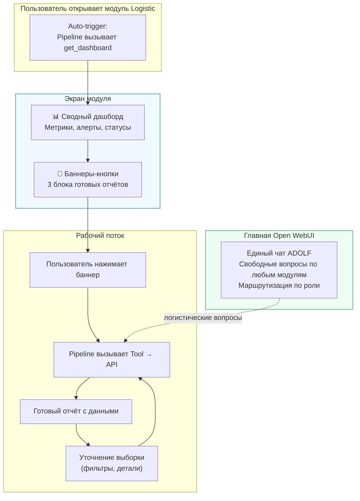
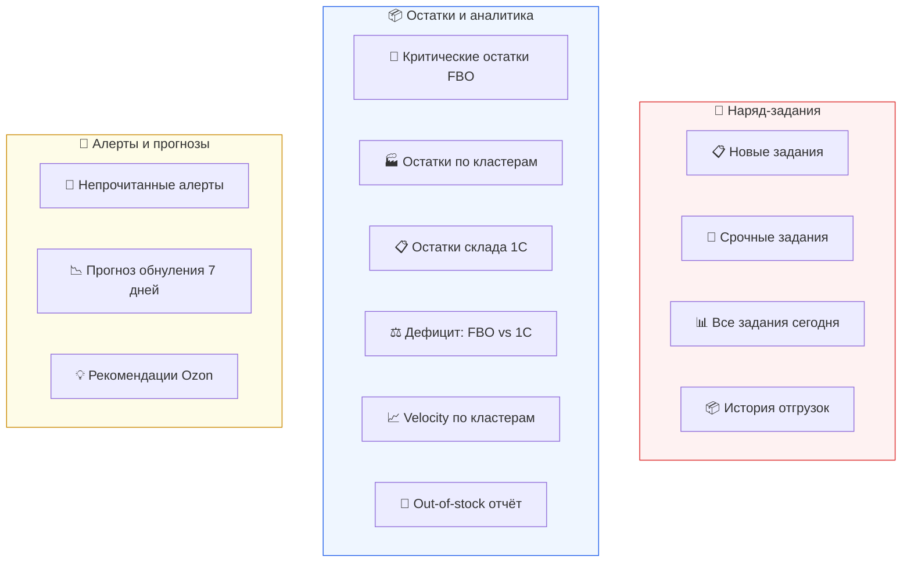
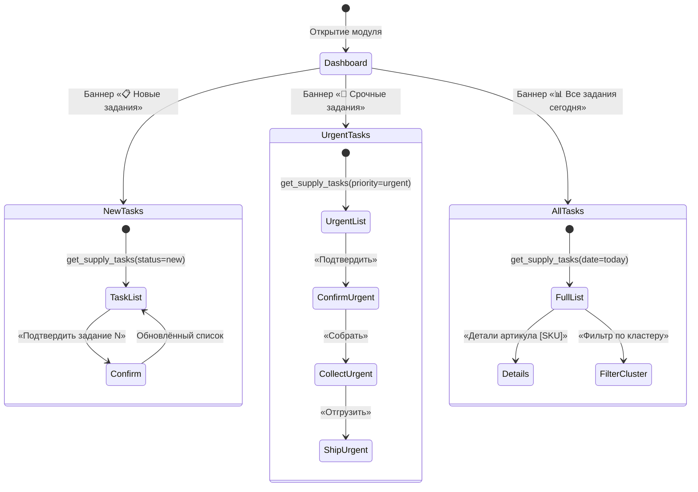

**Модуль:** Logistic  
**Компонент:** Open WebUI Integration  
**Версия:** 2.1  
**Дата:** Февраль 2026  
**Заменяет:** adolf_logistic_7_open_webui v2.0

---

## 7.1 Назначение

### Описание

Интеграция модуля Logistic с Open WebUI реализует **dashboard-first** подход: при открытии модуля пользователь видит сводный дашборд и набор баннеров-кнопок с готовыми аналитическими отчётами. Взаимодействие происходит через выбор предготовых ответов с возможностью уточнения выборки.

Свободные вопросы к AI (в том числе по логистике) задаются через **единый чат ADOLF** на главной странице Open WebUI. Единый чат маршрутизирует запросы к нужным модулям в зависимости от контекста и роли пользователя.

### Концепция



### Изменения v2.0 → v2.1

| Аспект | v2.0 | v2.1 |
|--------|------|------|
| Парадигма | Чат-интерфейс с текстовым вводом | Dashboard-first с баннерами |
| Начальный экран | Пустой чат + подсказки | Автоматический дашборд |
| Навигация | Текстовые запросы пользователя | Кнопки предготовых отчётов |
| Наряд-задания | Через текстовые команды | Выделенный блок с workflow-кнопками |
| AI-чат | В том же модуле | Единый чат ADOLF (главная страница) |
| Tools | 8 | 13 (+ аналитические отчёты) |

---

## 7.2 Архитектура экрана

### Структура отображения

При открытии модуля Logistic пользователь видит три зоны:

**Зона 1 — Дашборд** (верхняя часть): автоматически загружаемая сводка с ключевыми метриками. Формируется tool `get_dashboard` без участия пользователя.

**Зона 2 — Баннеры** (средняя часть): три блока кнопок с предготовыми отчётами. Реализуются через `prompt_suggestions` Pipeline. При нажатии — текст подставляется как сообщение и автоматически отправляется.

**Зона 3 — Результат** (нижняя часть): область отображения выбранного отчёта. После получения отчёта появляются кнопки уточнения (drill-down).

### Блоки баннеров



### Маппинг баннеров → Tools → API

| Баннер | Prompt (скрытый текст) | Tool | API Endpoint |
|--------|----------------------|------|-------------|
| 📋 Новые задания | `Покажи новые наряд-задания` | `get_supply_tasks` | `GET /supply-tasks/?status=new` |
| 🔴 Срочные задания | `Покажи срочные наряд-задания` | `get_supply_tasks` | `GET /supply-tasks/?priority=urgent` |
| 📊 Все задания сегодня | `Покажи все задания на сегодня` | `get_supply_tasks` | `GET /supply-tasks/?date=today` |
| 📦 История отгрузок | `Покажи историю отгрузок за неделю` | `get_shipment_history` | `GET /supply-tasks/?status=shipped` |
| 🔴 Критические остатки | `Покажи критические остатки FBO` | `get_urgent_stocks` | `GET /stocks/urgent` |
| 🏭 Остатки по кластерам | `Покажи остатки по кластерам` | `get_cluster_stocks` | `GET /stocks/summary` |
| 📋 Остатки склада 1С | `Покажи остатки внутреннего склада` | `get_warehouse_stocks` | `GET /import/stocks` |
| ⚖️ Дефицит: FBO vs 1С | `Покажи отчёт дефицита FBO против склада` | `get_deficit_report` | `GET /stocks/urgent` + `GET /import/stocks` |
| 📈 Velocity по кластерам | `Покажи velocity продаж по кластерам` | `get_velocity_report` | `GET /stocks/summary` (velocity) |
| 🚫 Out-of-stock | `Покажи out-of-stock артикулы` | `get_oos_report` | `GET /stocks/urgent` (fbo=0) |
| 🔔 Непрочитанные алерты | `Покажи непрочитанные алерты` | `get_alerts` | `GET /alerts?is_read=false` |
| 📉 Прогноз обнуления | `Покажи прогноз обнуления на 7 дней` | `get_forecast_report` | `GET /stocks/urgent` + forecast |
| 💡 Рекомендации Ozon | `Покажи рекомендации Ozon по поставкам` | `get_ozon_recommendations` | `GET /stocks/summary` (ozon_recommendation) |

---

## 7.3 UI-компоненты (shadcn/ui)

### Модуль Logistic в дизайн-системе

| Параметр | Значение |
|----------|----------|
| Иконка Lucide | `Truck` |
| Import | `import \{ Truck \} from 'lucide-react'` |
| Цвет модуля | `--module-logistic: oklch(0.705 0.152 162)` (Teal) |
| Light | `--module-logistic-light: oklch(0.95 0.03 162)` |
| Foreground | `--module-logistic-foreground: oklch(0.985 0 0)` |

### Компоненты по зонам экрана

#### Зона 1 — Дашборд (auto-trigger)

| UI-элемент | shadcn/ui компонент | Применение |
|------------|---------------------|------------|
| Контейнер дашборда | [Card](https://ui.shadcn.com/docs/components/card) | `Card` + `CardHeader` + `CardContent` для каждой секции |
| Метрики задний | [Badge](https://ui.shadcn.com/docs/components/badge) | `Badge variant="destructive"` для Urgent, `variant="secondary"` для остальных |
| Таблица метрик | [Table](https://ui.shadcn.com/docs/components/table) | Компактная таблица в `CardContent` |
| Блок алертов | [Alert](https://ui.shadcn.com/docs/components/alert) | `Alert variant="destructive"` для high-severity |
| Индикаторы загрузки | [Skeleton](https://ui.shadcn.com/docs/components/skeleton) | Пока данные загружаются из API |
| Пустое состояние | [Empty](https://ui.shadcn.com/docs/components/empty) | Если данные недоступны |

```tsx
// Пример: секция дашборда
<Card>
  <CardHeader>
    <div className="flex items-center gap-2">
      <Truck className="h-5 w-5 text-module-logistic" />
      <CardTitle>Наряд-задания (сегодня)</CardTitle>
      <Badge variant="destructive">3 urgent</Badge>
    </div>
  </CardHeader>
  <CardContent>
    <Table>
      <TableBody>
        <TableRow>
          <TableCell className="text-muted-foreground">Всего</TableCell>
          <TableCell className="font-semibold">20</TableCell>
        </TableRow>
        {/* ... */}
      </TableBody>
    </Table>
  </CardContent>
</Card>
```

#### Зона 2 — Баннеры (prompt_suggestions)

| UI-элемент | shadcn/ui компонент | Применение |
|------------|---------------------|------------|
| Контейнер блока | [Card](https://ui.shadcn.com/docs/components/card) | Группировка баннеров по блокам |
| Заголовок блока | [Typography](https://ui.shadcn.com/docs/components/typography) | `h3` с иконкой Lucide |
| Кнопка-баннер | [Button](https://ui.shadcn.com/docs/components/button) | `Button variant="outline"` с иконкой и описанием |
| Группа кнопок | [Button Group](https://ui.shadcn.com/docs/components/button-group) | Горизонтальная группировка внутри блока |
| Тултип описания | [Tooltip](https://ui.shadcn.com/docs/components/tooltip) | Подробное описание при hover |

```tsx
// Пример: блок баннеров «Наряд-задания»
<Card>
  <CardHeader>
    <CardTitle className="flex items-center gap-2">
      <ClipboardList className="h-5 w-5" />
      Наряд-задания
    </CardTitle>
  </CardHeader>
  <CardContent className="grid grid-cols-2 gap-2">
    <Tooltip>
      <TooltipTrigger asChild>
        <Button variant="outline" className="justify-start gap-2 h-auto py-3">
          <ClipboardCheck className="h-4 w-4" />
          <div className="text-left">
            <div className="font-medium">Новые задания</div>
            <div className="text-xs text-muted-foreground">Ожидают подтверждения</div>
          </div>
        </Button>
      </TooltipTrigger>
      <TooltipContent>Наряд-задания со статусом «Новый»</TooltipContent>
    </Tooltip>
    {/* ... остальные баннеры */}
  </CardContent>
</Card>
```

#### Зона 3 — Отчёты и наряд-задания

| UI-элемент | shadcn/ui компонент | Применение |
|------------|---------------------|------------|
| Таблица данных | [Data Table](https://ui.shadcn.com/docs/components/data-table) | Список заданий, остатки по кластерам, прогнозы |
| Статус задания | [Badge](https://ui.shadcn.com/docs/components/badge) | `new` → outline, `confirmed` → secondary, `shipped` → default |
| Приоритет | [Badge](https://ui.shadcn.com/docs/components/badge) | `urgent` → destructive, `planned` → warning, `recommended` → success |
| Кнопки workflow | [Button](https://ui.shadcn.com/docs/components/button) | `Подтвердить`, `Собрать`, `Отгрузить` — в строке таблицы |
| Подтверждение действия | [Alert Dialog](https://ui.shadcn.com/docs/components/alert-dialog) | Перед отменой задания (`cancel`) |
| Drill-down навигация | [Button](https://ui.shadcn.com/docs/components/button) `variant="link"` | Ссылки под отчётом |
| Фильтры | [Select](https://ui.shadcn.com/docs/components/select) + [Date Picker](https://ui.shadcn.com/docs/components/date-picker) | Фильтр по кластеру, статусу, дате |
| Пагинация | [Pagination](https://ui.shadcn.com/docs/components/pagination) | При > 30 записей |
| Уведомления | [Toast](https://ui.shadcn.com/docs/components/toast) | Результат действий (подтверждение, отгрузка) |
| Графики velocity | [Chart](https://ui.shadcn.com/docs/components/chart) | Bar chart velocity по кластерам |
| Прогресс отгрузки | [Progress](https://ui.shadcn.com/docs/components/progress) | Прогресс задания: new → confirmed → collected → shipped |
| Детали артикула | [Sheet](https://ui.shadcn.com/docs/components/sheet) | Слайдер с полной информацией по артикулу |

### Маппинг Badge variants → статусы

| Сущность | Значение | Badge variant | Цвет |
|----------|----------|---------------|------|
| Приоритет | urgent | `destructive` | `--destructive` |
| Приоритет | planned | `default` (custom) | `--warning` |
| Приоритет | recommended | `secondary` | `--success` |
| Статус задания | new | `outline` | `--border` |
| Статус задания | confirmed | `secondary` | `--secondary` |
| Статус задания | collected | `default` (custom) | `--info` |
| Статус задания | shipped | `default` | `--success` |
| Статус задания | cancelled | `destructive` | `--destructive` |
| Остатки | urgent (&lt; 3 дн.) | `destructive` | `--destructive` |
| Остатки | soon (&lt; 7 дн.) | `default` (custom) | `--warning` |
| Остатки | enough | `secondary` | `--success` |
| Остатки | out_of_stock | `destructive` | `--destructive` |
| Покрытие | full | `secondary` | `--success` |
| Покрытие | partial | `default` (custom) | `--warning` |
| Покрытие | none | `destructive` | `--destructive` |

### Lucide-иконки модуля

| Контекст | Иконка | Lucide Name |
|----------|--------|-------------|
| Модуль Logistic | 🚛 | `Truck` |
| Наряд-задания | 📋 | `ClipboardList` |
| Новое задание | ✏️ | `ClipboardCheck` |
| Подтверждено | ✅ | `CheckCircle` |
| Собрано | 📦 | `Package` |
| Отгружено | 🚛 | `TruckIcon` |
| Отменено | ❌ | `XCircle` |
| Остатки FBO | 📦 | `Warehouse` |
| Склад 1С | 🏭 | `Factory` |
| Кластер | 📍 | `MapPin` |
| Алерт | 🔔 | `Bell` |
| Urgent | 🔴 | `AlertTriangle` |
| Velocity | 📈 | `TrendingUp` |
| Прогноз | 📉 | `TrendingDown` |
| Рекомендации Ozon | 💡 | `Lightbulb` |
| Фильтр | 🔍 | `Filter` |
| Экспорт | 📥 | `Download` |

### Пример: строка таблицы наряд-задания

```tsx
<TableRow>
  <TableCell className="font-mono text-sm">LG-2026-02-14-001</TableCell>
  <TableCell>51005/54</TableCell>
  <TableCell>Дальний Восток</TableCell>
  <TableCell className="text-right">32 шт</TableCell>
  <TableCell>
    <Badge variant="destructive" className="gap-1">
      <AlertTriangle className="h-3 w-3" />
      urgent
    </Badge>
  </TableCell>
  <TableCell>
    <Badge variant="outline">new</Badge>
  </TableCell>
  <TableCell>
    <Button size="sm" variant="default" className="gap-1">
      <CheckCircle className="h-3 w-3" />
      Подтвердить
    </Button>
  </TableCell>
</TableRow>
```

### Пример: Progress workflow

```tsx
// Прогресс задания: 4 шага
<div className="flex items-center gap-2">
  <div className="flex items-center gap-1 text-sm">
    <ClipboardCheck className="h-4 w-4 text-muted-foreground" />
    <span className="text-muted-foreground">new</span>
  </div>
  <Separator className="flex-1" />
  <div className="flex items-center gap-1 text-sm">
    <CheckCircle className="h-4 w-4 text-primary" />
    <span className="font-medium">confirmed</span>
  </div>
  <Separator className="flex-1" />
  <div className="flex items-center gap-1 text-sm text-muted-foreground">
    <Package className="h-4 w-4" />
    <span>collected</span>
  </div>
  <Separator className="flex-1" />
  <div className="flex items-center gap-1 text-sm text-muted-foreground">
    <Truck className="h-4 w-4" />
    <span>shipped</span>
  </div>
</div>
```

### Пример: Alert Dialog отмены задания

```tsx
<AlertDialog>
  <AlertDialogTrigger asChild>
    <Button variant="destructive" size="sm">
      <XCircle className="h-3 w-3 mr-1" />
      Отменить
    </Button>
  </AlertDialogTrigger>
  <AlertDialogContent>
    <AlertDialogHeader>
      <AlertDialogTitle>Отменить задание LG-2026-02-14-001?</AlertDialogTitle>
      <AlertDialogDescription>
        Артикул 51005/54, кластер Дальний Восток, 32 шт.
        Укажите причину отмены.
      </AlertDialogDescription>
    </AlertDialogHeader>
    <Textarea placeholder="Причина отмены (обязательно)" />
    <AlertDialogFooter>
      <AlertDialogCancel>Назад</AlertDialogCancel>
      <AlertDialogAction variant="destructive">Отменить задание</AlertDialogAction>
    </AlertDialogFooter>
  </AlertDialogContent>
</AlertDialog>
```

---

## 7.4 Pipeline

### Конфигурация

```python
# open_webui/pipeline.py
"""
title: Adolf Logistic Pipeline
author: ADOLF Team
version: 2.1
description: Dashboard-first Pipeline для управления логистикой Ozon FBO
"""

from typing import List, Optional
from pydantic import BaseModel


class Pipeline:
    class Valves(BaseModel):
        LOGISTIC_API_URL: str = "http://localhost:8000"
        ENABLE_ALERTS: bool = True
        ENABLE_SUPPLY_TASKS: bool = True
        DEFAULT_BRAND: str = "ohana_market"
        AUTO_DASHBOARD: bool = True

    def __init__(self):
        self.name = "Adolf Logistic"
        self.valves = self.Valves()

    async def on_startup(self):
        pass

    async def on_shutdown(self):
        pass

    def pipe(
        self,
        user_message: str,
        model_id: str,
        messages: List[dict],
        body: dict
    ) -> str:
        system_prompt = self._build_system_prompt(body)

        if messages and messages[0].get("role") != "system":
            messages.insert(0, {
                "role": "system",
                "content": system_prompt
            })

        # Auto-trigger: первое сообщение — вызов дашборда
        if self.valves.AUTO_DASHBOARD and len(messages) <= 2:
            body["tool_ids"] = ["get_dashboard"]

        return body

    def _build_system_prompt(self, body: dict) -> str:
        user = body.get("user", {})
        brand_id = user.get("brand_id", self.valves.DEFAULT_BRAND)

        return f"""Ты — AI-ассистент модуля Logistic системы ADOLF.
Маркетплейс: Ozon (31 кластер FBO).
Режим работы: dashboard-first.

## Правила отображения:
1. При первом обращении — вызови get_dashboard и покажи сводку
2. При нажатии баннера — вызови соответствующий Tool
3. Форматируй ответы таблицами с emoji-статусами
4. После каждого отчёта предлагай кнопки уточнения (drill-down)
5. При критических остатках — выделяй 🔴 и предлагай действия
6. Наряд-задания — показывай кнопки workflow (подтвердить/собрать/отгрузить)

## Контекст пользователя:
- Бренд: {brand_id}
- Роль: {user.get('role', 'manager')}

## Доступные Tools (13):
### Дашборд
- get_dashboard — сводный дашборд (Ozon + 1С + задания + алерты)

### Наряд-задания
- get_supply_tasks — список заданий с фильтрами
- update_task_status — подтвердить / собрать / отгрузить / отменить
- get_shipment_history — история отгруженных заданий

### Остатки и аналитика
- get_cluster_stocks — остатки FBO по кластерам
- get_article_details — детали артикула по всем кластерам + 1С
- get_warehouse_stocks — остатки склада 1С + статус импорта
- get_urgent_stocks — критические остатки (< 7 дней)
- get_deficit_report — сравнение FBO-потребности vs наличие 1С
- get_velocity_report — скорость продаж по кластерам
- get_oos_report — артикулы с нулевым остатком FBO

### Алерты и прогнозы
- get_alerts — непрочитанные алерты
- get_forecast_report — прогноз обнуления по кластерам
- get_ozon_recommendations — рекомендации Ozon по поставкам

## Формат drill-down:
После каждого отчёта предлагай уточняющие действия в формате:
«Выберите действие: [Детали по артикулу] [Фильтр по кластеру] [Сформировать задание]»
"""
```

### Prompt Suggestions (баннеры)

```python
    # Конфигурация prompt_suggestions для Open WebUI
    PROMPT_SUGGESTIONS = [
        # Блок: Наряд-задания
        {
            "title": "📋 Новые задания",
            "description": "Наряд-задания со статусом «Новый», ожидающие подтверждения",
            "prompt": "Покажи новые наряд-задания"
        },
        {
            "title": "🔴 Срочные задания",
            "description": "Задания с приоритетом urgent — требуют немедленной отгрузки",
            "prompt": "Покажи срочные наряд-задания"
        },
        {
            "title": "📊 Все задания сегодня",
            "description": "Полный список заданий на сегодня по всем статусам",
            "prompt": "Покажи все задания на сегодня"
        },
        {
            "title": "📦 История отгрузок",
            "description": "Отгруженные задания за последнюю неделю",
            "prompt": "Покажи историю отгрузок за неделю"
        },

        # Блок: Остатки и аналитика
        {
            "title": "🔴 Критические остатки FBO",
            "description": "SKU с остатком менее 7 дней до обнуления",
            "prompt": "Покажи критические остатки FBO"
        },
        {
            "title": "🏭 Остатки по кластерам",
            "description": "Сводка FBO-остатков по 31 кластеру Ozon",
            "prompt": "Покажи остатки по кластерам"
        },
        {
            "title": "📋 Остатки склада 1С",
            "description": "Текущие остатки внутреннего склада из последнего импорта 1С",
            "prompt": "Покажи остатки внутреннего склада"
        },
        {
            "title": "⚖️ Дефицит: FBO vs 1С",
            "description": "Сравнение потребности FBO с наличием на складе 1С",
            "prompt": "Покажи отчёт дефицита FBO против склада"
        },
        {
            "title": "📈 Velocity по кластерам",
            "description": "Скорость продаж (шт/день) по кластерам и артикулам",
            "prompt": "Покажи velocity продаж по кластерам"
        },
        {
            "title": "🚫 Out-of-stock отчёт",
            "description": "Артикулы с нулевым остатком FBO на одном или более кластерах",
            "prompt": "Покажи out-of-stock артикулы"
        },

        # Блок: Алерты и прогнозы
        {
            "title": "🔔 Непрочитанные алерты",
            "description": "Активные алерты, требующие внимания",
            "prompt": "Покажи непрочитанные алерты"
        },
        {
            "title": "📉 Прогноз обнуления 7 дней",
            "description": "SKU, которые обнулятся в ближайшие 7 дней по кластерам",
            "prompt": "Покажи прогноз обнуления на 7 дней"
        },
        {
            "title": "💡 Рекомендации Ozon",
            "description": "Рекомендации Ozon Seller API по срочности поставок",
            "prompt": "Покажи рекомендации Ozon по поставкам"
        }
    ]
```

---

## 7.5 Tools

### 7.5.1 get_dashboard (auto-trigger)

```python
# open_webui/tools.py
"""
title: Logistic Tools
author: ADOLF Team
version: 2.1
"""

import httpx
from typing import Optional
from datetime import datetime, date


class Tools:
    def __init__(self):
        self.api_url = "http://localhost:8000"

    async def get_dashboard(
        self,
        __user__: dict = {}
    ) -> str:
        """
        Сводный дашборд логистики. Вызывается автоматически
        при открытии модуля.

        :return: Ключевые метрики + статус наряд-заданий + алерты
        """
        headers = {"X-User-Id": __user__.get("id", "")}

        async with httpx.AsyncClient() as client:
            stocks_resp = await client.get(
                f"{self.api_url}/logistic/stocks/summary",
                headers=headers
            )
            tasks_resp = await client.get(
                f"{self.api_url}/logistic/supply-tasks/summary",
                headers=headers
            )
            alerts_resp = await client.get(
                f"{self.api_url}/logistic/alerts",
                params={"is_read": False, "limit": 5},
                headers=headers
            )

        stocks = stocks_resp.json()
        tasks = tasks_resp.json()
        alerts = alerts_resp.json()

        result = "📊 **Дашборд Logistic**\n\n"

        # --- Секция: Наряд-задания (приоритет) ---
        result += "### 🚛 Наряд-задания (сегодня)\n\n"
        by_status = tasks.get("by_status", {})
        by_priority = tasks.get("by_priority", {})

        result += "| Метрика | Значение |\n"
        result += "|---------|----------|\n"
        result += f"| Всего заданий | **{tasks.get('total', 0)}** |\n"
        result += f"| 📋 Новых | {by_status.get('new', 0)} |\n"
        result += f"| ✅ Подтверждённых | {by_status.get('confirmed', 0)} |\n"
        result += f"| 📦 Собранных | {by_status.get('collected', 0)} |\n"
        result += f"| 🚛 Отгруженных | {by_status.get('shipped', 0)} |\n"
        result += f"| 🔴 Urgent | **{by_priority.get('urgent', 0)}** |\n\n"

        # --- Секция: Остатки FBO ---
        result += "### 📦 Ozon FBO (кластеры)\n\n"
        result += "| Метрика | Значение |\n"
        result += "|---------|----------|\n"
        result += f"| Артикулов отслеживается | {stocks.get('total_articles', 0)} |\n"
        result += f"| 🔴 Urgent (< 3 дн.) | **{stocks.get('urgent_count', 0)}** |\n"
        result += f"| 🟡 Soon (< 7 дн.) | {stocks.get('soon_count', 0)} |\n"
        result += f"| 🚫 Out of stock | **{stocks.get('out_of_stock_count', 0)}** |\n"
        result += f"| ✅ Enough | {stocks.get('enough_count', 0)} |\n\n"

        # --- Секция: Склад 1С ---
        result += "### 🏭 Внутренний склад (1С)\n\n"
        result += f"- Последний импорт: {stocks.get('last_import', 'нет данных')}\n"
        result += f"- Артикулов на складе: {stocks.get('warehouse_articles', 0)}\n\n"

        # --- Секция: Алерты ---
        alert_items = alerts.get("items", [])
        if alert_items:
            result += f"### 🔔 Алерты ({len(alert_items)} непрочитанных)\n\n"
            for a in alert_items[:5]:
                emoji = {"high": "🔴", "medium": "🟡", "low": "🟢"}.get(
                    a["severity"], ""
                )
                result += f"- {emoji} {a['message']}\n"
        else:
            result += "### ✅ Нет активных алертов\n"

        result += "\n---\n"
        result += "_Выберите отчёт из баннеров ниже для детализации._"

        return result
```

### 7.5.2 get_supply_tasks

```python
    async def get_supply_tasks(
        self,
        status: Optional[str] = None,
        priority: Optional[str] = None,
        date_filter: Optional[str] = "today",
        __user__: dict = {}
    ) -> str:
        """
        Список наряд-заданий с фильтрами.

        :param status: Фильтр: new, confirmed, collected, shipped, cancelled
        :param priority: Фильтр: urgent, planned, recommended
        :param date_filter: Период: today, week, all
        :return: Таблица наряд-заданий с кнопками действий
        """
        params = {}
        if status:
            params["status"] = status
        if priority:
            params["priority"] = priority
        if date_filter == "today":
            params["date"] = date.today().isoformat()

        headers = {"X-User-Id": __user__.get("id", "")}

        async with httpx.AsyncClient() as client:
            response = await client.get(
                f"{self.api_url}/logistic/supply-tasks/",
                params=params,
                headers=headers
            )
            tasks = response.json()

        if not tasks:
            filter_desc = []
            if status:
                filter_desc.append(f"статус={status}")
            if priority:
                filter_desc.append(f"приоритет={priority}")
            desc = ", ".join(filter_desc) if filter_desc else "текущие фильтры"
            return f"📋 Наряд-заданий не найдено ({desc})."

        # Заголовок
        title_parts = ["📋 **Наряд-задания"]
        if priority == "urgent":
            title_parts[0] = "🔴 **Срочные наряд-задания"
        if status == "new":
            title_parts.append(" (новые)")
        title_parts.append("**\n\n")
        result = "".join(title_parts)

        # Таблица
        result += "| # | Артикул | Кластер | Кол-во | Приоритет | Статус | Действие |\n"
        result += "|---|---------|---------|--------|-----------|--------|----------|\n"

        priority_icons = {"urgent": "🔴", "planned": "🟡", "recommended": "🟢"}
        status_icons = {
            "new": "📋 new",
            "confirmed": "✅ confirmed",
            "collected": "📦 collected",
            "shipped": "🚛 shipped",
            "cancelled": "❌ cancelled"
        }
        action_hints = {
            "new": "→ Подтвердить",
            "confirmed": "→ Собрать",
            "collected": "→ Отгрузить",
            "shipped": "—",
            "cancelled": "—"
        }

        for t in tasks[:30]:
            p_icon = priority_icons.get(t.get("priority", ""), "")
            s_icon = status_icons.get(t.get("status", ""), t.get("status", ""))
            action = action_hints.get(t.get("status", ""), "")
            result += (
                f"| {t.get('task_number', '')} "
                f"| {t.get('article', '')} "
                f"| {t.get('cluster_name', '')} "
                f"| {t.get('quantity', 0)} шт "
                f"| {p_icon} {t.get('priority', '')} "
                f"| {s_icon} "
                f"| {action} |\n"
            )

        if len(tasks) > 30:
            result += f"\n_Показано 30 из {len(tasks)}_\n"

        # Сводка
        urgent_count = sum(1 for t in tasks if t.get("priority") == "urgent")
        new_count = sum(1 for t in tasks if t.get("status") == "new")
        total_qty = sum(t.get("quantity", 0) for t in tasks)

        result += f"\n**Итого:** {len(tasks)} заданий, {total_qty} шт"
        if urgent_count > 0:
            result += f" | 🔴 Urgent: {urgent_count}"
        if new_count > 0:
            result += f" | Ожидают подтверждения: {new_count}"

        # Drill-down
        result += "\n\n---\n"
        result += "**Действия:** "
        result += "`Подтвердить задание [номер]` · "
        result += "`Детали артикула [SKU]` · "
        result += "`Фильтр по кластеру [название]`"

        return result
```

### 7.5.3 update_task_status

```python
    async def update_task_status(
        self,
        task_id: str,
        action: str,
        reason: Optional[str] = None,
        __user__: dict = {}
    ) -> str:
        """
        Обновить статус наряд-задания.

        :param task_id: UUID или номер задания (LG-YYYY-MM-DD-NNN)
        :param action: confirm, collected, shipped, cancel
        :param reason: Причина отмены (обязательно для cancel)
        :return: Результат + следующее доступное действие
        """
        endpoint = {
            "confirm": "confirm",
            "collected": "collected",
            "shipped": "shipped",
            "cancel": "cancel"
        }.get(action)

        if not endpoint:
            return (
                f"❌ Неизвестное действие: {action}. "
                "Допустимо: confirm, collected, shipped, cancel"
            )

        url = f"{self.api_url}/logistic/supply-tasks/{task_id}/{endpoint}"
        params = {}
        if action == "cancel" and reason:
            params["reason"] = reason

        async with httpx.AsyncClient() as client:
            response = await client.patch(
                url,
                params=params,
                headers={"X-User-Id": __user__.get("id", "")}
            )

        if response.status_code == 200:
            task = response.json()
            labels = {
                "confirm": ("✅ Подтверждено", "→ Следующий шаг: **Собрать**"),
                "collected": ("📦 Товар собран", "→ Следующий шаг: **Отгрузить**"),
                "shipped": ("🚛 Отгружено", "✅ Задание завершено"),
                "cancel": ("❌ Отменено", "")
            }
            label, next_step = labels.get(action, ("✅", ""))

            result = f"{label} — задание **{task.get('task_number', task_id)}**\n\n"
            result += "| Параметр | Значение |\n"
            result += "|----------|----------|\n"
            result += f"| Артикул | {task.get('article')} |\n"
            result += f"| Кластер | {task.get('cluster_name')} |\n"
            result += f"| Количество | {task.get('quantity')} шт |\n"
            result += f"| Статус | {task.get('status')} |\n"

            if next_step:
                result += f"\n{next_step}"

            return result
        else:
            error = response.json().get("detail", "Неизвестная ошибка")
            return f"❌ Ошибка: {error}"
```

### 7.5.4 get_shipment_history

```python
    async def get_shipment_history(
        self,
        days: int = 7,
        __user__: dict = {}
    ) -> str:
        """
        История отгруженных заданий.

        :param days: Период в днях (по умолчанию 7)
        :return: Таблица отгрузок + статистика по кластерам
        """
        from datetime import timedelta

        params = {
            "status": "shipped",
            "date_from": (date.today() - timedelta(days=days)).isoformat()
        }
        headers = {"X-User-Id": __user__.get("id", "")}

        async with httpx.AsyncClient() as client:
            response = await client.get(
                f"{self.api_url}/logistic/supply-tasks/",
                params=params,
                headers=headers
            )
            tasks = response.json()

        if not tasks:
            return f"📦 Отгрузок за последние {days} дней не найдено."

        result = f"📦 **История отгрузок ({days} дней)**\n\n"

        result += "| Дата | # | Артикул | Кластер | Кол-во |\n"
        result += "|------|---|---------|---------|--------|\n"

        total_qty = 0
        by_cluster = {}
        for t in tasks[:30]:
            shipped_date = t.get("shipped_at", t.get("updated_at", ""))[:10]
            cluster = t.get("cluster_name", "")
            qty = t.get("quantity", 0)

            result += (
                f"| {shipped_date} "
                f"| {t.get('task_number', '')} "
                f"| {t.get('article', '')} "
                f"| {cluster} "
                f"| {qty} шт |\n"
            )

            total_qty += qty
            by_cluster[cluster] = by_cluster.get(cluster, 0) + qty

        result += f"\n**Итого:** {len(tasks)} отгрузок, {total_qty} шт\n\n"

        result += "**По кластерам:**\n\n"
        result += "| Кластер | Отгружено |\n"
        result += "|---------|----------|\n"
        for cluster, qty in sorted(by_cluster.items(), key=lambda x: -x[1]):
            result += f"| {cluster} | {qty} шт |\n"

        return result
```

### 7.5.5 – 7.5.8 Tools из v2.0

Реализации `get_cluster_stocks`, `get_article_details`, `get_warehouse_stocks` и `get_urgent_stocks` перенесены из v2.0 без изменений. Код доступен в истории версий репозитория.

### 7.5.9 get_deficit_report (новый)

```python
    async def get_deficit_report(
        self,
        __user__: dict = {}
    ) -> str:
        """
        Сравнение потребности FBO (дефицит по кластерам)
        с наличием на внутреннем складе 1С.

        :return: Таблица артикулов с дефицитом и покрытием
        """
        headers = {"X-User-Id": __user__.get("id", "")}

        async with httpx.AsyncClient() as client:
            urgent_resp = await client.get(
                f"{self.api_url}/logistic/stocks/urgent",
                headers=headers
            )
            warehouse_resp = await client.get(
                f"{self.api_url}/logistic/import/stocks",
                headers=headers
            )

        urgent_items = urgent_resp.json()
        warehouse_items = warehouse_resp.json()

        if not urgent_items:
            return "✅ Нет дефицитных позиций на FBO."

        # Индекс остатков 1С
        wh_index = {}
        for w in warehouse_items:
            wh_index[w.get("article", "")] = w.get("quantity", 0)

        result = "⚖️ **Дефицит: FBO vs Склад 1С**\n\n"

        result += "| Артикул | Кластер | FBO | Дней до 0 | Дефицит | Склад 1С | Покрытие |\n"
        result += "|---------|---------|-----|-----------|---------|----------|----------|\n"

        full_count = 0
        partial_count = 0
        none_count = 0

        for item in urgent_items[:40]:
            article = item.get("article", "")
            deficit = item.get("deficit", 0)
            wh_stock = wh_index.get(article, 0)

            if deficit <= 0:
                continue

            if wh_stock >= deficit:
                coverage = "🟢 full"
                full_count += 1
            elif wh_stock > 0:
                coverage = "🟡 partial"
                partial_count += 1
            else:
                coverage = "🔴 none"
                none_count += 1

            result += (
                f"| {article} "
                f"| {item.get('cluster_name', '')} "
                f"| {item.get('fbo_stock', 0)} "
                f"| {item.get('days_to_zero', '—')} "
                f"| {deficit} шт "
                f"| {wh_stock} шт "
                f"| {coverage} |\n"
            )

        result += f"\n**Покрытие:** 🟢 full: {full_count}"
        result += f" · 🟡 partial: {partial_count}"
        result += f" · 🔴 none (нужна закупка): {none_count}"

        result += "\n\n---\n"
        result += "**Действия:** "
        result += "`Детали артикула [SKU]` · "
        result += "`Показать только без покрытия`"

        return result
```

### 7.5.10 get_velocity_report (новый)

```python
    async def get_velocity_report(
        self,
        __user__: dict = {}
    ) -> str:
        """
        Скорость продаж (velocity) по кластерам.
        ТОП артикулов по avg_daily_sales.

        :return: Таблица velocity по кластерам и артикулам
        """
        headers = {"X-User-Id": __user__.get("id", "")}

        async with httpx.AsyncClient() as client:
            response = await client.get(
                f"{self.api_url}/logistic/stocks/summary",
                headers=headers
            )
            data = response.json()

        clusters = data.get("clusters", [])
        if not clusters:
            return "📈 Данные о velocity недоступны."

        result = "📈 **Velocity продаж по кластерам**\n\n"

        result += "| Кластер | Артикулов | Ср. velocity | Макс velocity | ТОП артикул |\n"
        result += "|---------|-----------|-------------|---------------|-------------|\n"

        for c in sorted(clusters, key=lambda x: -x.get("avg_velocity", 0)):
            result += (
                f"| {c.get('cluster_name', '')} "
                f"| {c.get('article_count', 0)} "
                f"| {c.get('avg_velocity', 0):.1f} шт/день "
                f"| {c.get('max_velocity', 0):.1f} шт/день "
                f"| {c.get('top_article', '—')} |\n"
            )

        result += "\n---\n"
        result += "**Действия:** "
        result += "`Детали кластера [название]` · "
        result += "`ТОП-10 по velocity`"

        return result
```

### 7.5.11 get_oos_report (новый)

```python
    async def get_oos_report(
        self,
        __user__: dict = {}
    ) -> str:
        """
        Out-of-stock отчёт: артикулы с нулевым остатком FBO.

        :return: Таблица OOS-артикулов по кластерам
        """
        headers = {"X-User-Id": __user__.get("id", "")}

        async with httpx.AsyncClient() as client:
            response = await client.get(
                f"{self.api_url}/logistic/stocks/urgent",
                headers=headers
            )
            items = response.json()

        oos_items = [i for i in items if i.get("fbo_stock", 0) == 0]

        if not oos_items:
            return "✅ Нет артикулов с нулевым остатком FBO."

        result = f"🚫 **Out-of-stock: {len(oos_items)} позиций**\n\n"

        result += "| Артикул | Кластер | Velocity | Задание | Склад 1С |\n"
        result += "|---------|---------|----------|---------|----------|\n"

        for item in oos_items[:30]:
            has_task = "✅ есть" if item.get("has_supply_task") else "❌ нет"
            result += (
                f"| {item.get('article', '')} "
                f"| {item.get('cluster_name', '')} "
                f"| {item.get('avg_daily_sales', 0):.1f} шт/д "
                f"| {has_task} "
                f"| {item.get('warehouse_stock', '?')} шт |\n"
            )

        if len(oos_items) > 30:
            result += f"\n_Показано 30 из {len(oos_items)}_\n"

        result += "\n---\n"
        result += "**Действия:** "
        result += "`Сформировать задания для OOS` · "
        result += "`Детали артикула [SKU]`"

        return result
```

### 7.5.12 get_forecast_report (новый)

```python
    async def get_forecast_report(
        self,
        days: int = 7,
        __user__: dict = {}
    ) -> str:
        """
        Прогноз обнуления остатков FBO в ближайшие N дней.

        :param days: Горизонт прогноза (по умолчанию 7)
        :return: Таблица SKU с прогнозируемым обнулением
        """
        headers = {"X-User-Id": __user__.get("id", "")}

        async with httpx.AsyncClient() as client:
            response = await client.get(
                f"{self.api_url}/logistic/stocks/urgent",
                headers=headers
            )
            items = response.json()

        forecast_items = [
            i for i in items
            if 0 < i.get("days_to_zero", 999) <= days
        ]

        if not forecast_items:
            return (
                f"✅ Нет артикулов с прогнозом обнуления "
                f"в ближайшие {days} дней."
            )

        forecast_items.sort(key=lambda x: x.get("days_to_zero", 999))

        result = (
            f"📉 **Прогноз обнуления ({days} дней): "
            f"{len(forecast_items)} позиций**\n\n"
        )

        result += "| Артикул | Кластер | FBO | Velocity | Дней до 0 | Приоритет |\n"
        result += "|---------|---------|-----|----------|-----------|----------|\n"

        for item in forecast_items[:30]:
            d2z = item.get("days_to_zero", 0)
            if d2z < 3:
                priority = "🔴 urgent"
            elif d2z < 7:
                priority = "🟡 soon"
            else:
                priority = "🟢 ok"

            result += (
                f"| {item.get('article', '')} "
                f"| {item.get('cluster_name', '')} "
                f"| {item.get('fbo_stock', 0)} шт "
                f"| {item.get('avg_daily_sales', 0):.1f} шт/д "
                f"| {d2z:.1f} "
                f"| {priority} |\n"
            )

        result += "\n---\n"
        result += "**Действия:** "
        result += "`Сформировать задания` · "
        result += "`Изменить горизонт [N дней]` · "
        result += "`Детали артикула [SKU]`"

        return result
```

### 7.5.13 get_ozon_recommendations (новый)

```python
    async def get_ozon_recommendations(
        self,
        __user__: dict = {}
    ) -> str:
        """
        Рекомендации Ozon Seller API по поставкам.
        Группировка по типу рекомендации.

        :return: Таблица рекомендаций Ozon
        """
        headers = {"X-User-Id": __user__.get("id", "")}

        async with httpx.AsyncClient() as client:
            response = await client.get(
                f"{self.api_url}/logistic/stocks/summary",
                headers=headers
            )
            data = response.json()

        items = data.get("items_with_recommendations", [])
        if not items:
            return "💡 Рекомендации Ozon отсутствуют или данные не загружены."

        # Группировка по типу рекомендации
        groups = {}
        for item in items:
            rec = item.get("ozon_recommendation", "unknown")
            if rec not in groups:
                groups[rec] = []
            groups[rec].append(item)

        rec_icons = {
            "urgent": "🔴 Срочно поставить",
            "soon": "🟡 Скоро поставить",
            "enough": "🟢 Пока хватает",
            "skip": "⚪ Не поставлять"
        }

        result = "💡 **Рекомендации Ozon по поставкам**\n\n"

        for rec_type in ["urgent", "soon", "enough", "skip"]:
            group = groups.get(rec_type, [])
            if not group:
                continue

            label = rec_icons.get(rec_type, rec_type)
            result += f"#### {label} ({len(group)} позиций)\n\n"

            if rec_type in ("urgent", "soon"):
                result += "| Артикул | Кластер | FBO | Дней до 0 |\n"
                result += "|---------|---------|-----|-----------|\n"
                for item in group[:15]:
                    result += (
                        f"| {item.get('article', '')} "
                        f"| {item.get('cluster_name', '')} "
                        f"| {item.get('fbo_stock', 0)} "
                        f"| {item.get('days_to_zero', '—')} |\n"
                    )
                if len(group) > 15:
                    result += f"\n_Показано 15 из {len(group)}_\n"
            else:
                result += f"Позиций: {len(group)}\n"

            result += "\n"

        return result
```

### 7.5.14 get_alerts

Реализация без изменений — перенесена из v2.0.

---

## 7.6 Интерфейс наряд-заданий

### Workflow управления заданиями

Наряд-задания — основной рабочий инструмент менеджера. Интерфейс обеспечивает полный цикл управления через последовательные действия.



### Сценарий: полный цикл задания

```
[Auto-trigger при открытии модуля]

🤖 📊 **Дашборд Logistic**

### 🚛 Наряд-задания (сегодня)

| Метрика | Значение |
|---------|----------|
| Всего заданий | **20** |
| 📋 Новых | 8 |
| ✅ Подтверждённых | 5 |
| 📦 Собранных | 3 |
| 🚛 Отгруженных | 4 |
| 🔴 Urgent | **3** |

[... остальные секции дашборда ...]

_Выберите отчёт из баннеров ниже для детализации._
```

```
[Пользователь нажимает баннер «🔴 Срочные задания»]

🤖 🔴 **Срочные наряд-задания**

| # | Артикул | Кластер | Кол-во | Приоритет | Статус | Действие |
|---|---------|---------|--------|-----------|--------|----------|
| LG-2026-02-14-001 | 51005/54 | Дальний Восток | 32 шт | 🔴 urgent | 📋 new | → Подтвердить |
| LG-2026-02-14-002 | 51005/54 | Юг | 51 шт | 🔴 urgent | 📋 new | → Подтвердить |
| LG-2026-02-14-003 | K2001/10 | Москва, МО | 28 шт | 🔴 urgent | ✅ confirmed | → Собрать |

**Итого:** 3 заданий, 111 шт | 🔴 Urgent: 3 | Ожидают подтверждения: 2

---
**Действия:** `Подтвердить задание [номер]` · `Детали артикула [SKU]` · `Фильтр по кластеру [название]`
```

```
[Пользователь: «Подтверди задание LG-2026-02-14-001»]

🤖 ✅ Подтверждено — задание **LG-2026-02-14-001**

| Параметр | Значение |
|----------|----------|
| Артикул | 51005/54 |
| Кластер | Дальний Восток |
| Количество | 32 шт |
| Статус | confirmed |

→ Следующий шаг: **Собрать**
```

```
[Пользователь: «Собрать»]

🤖 📦 Товар собран — задание **LG-2026-02-14-001**

| Параметр | Значение |
|----------|----------|
| Артикул | 51005/54 |
| Кластер | Дальний Восток |
| Количество | 32 шт |
| Статус | collected |

→ Следующий шаг: **Отгрузить**
```

```
[Пользователь: «Отгрузить»]

🤖 🚛 Отгружено — задание **LG-2026-02-14-001**

| Параметр | Значение |
|----------|----------|
| Артикул | 51005/54 |
| Кластер | Дальний Восток |
| Количество | 32 шт |
| Статус | shipped |

✅ Задание завершено
```

---

## 7.7 Drill-down (уточнение выборки)

### Принцип

После каждого отчёта Pipeline предлагает контекстные действия. Пользователь выбирает уточнение — Pipeline вызывает соответствующий Tool с параметрами из контекста.

### Карта drill-down

| Исходный отчёт | Действия drill-down | Tool |
|----------------|---------------------|------|
| Дашборд | → Новые задания, → Критические остатки, → Алерты | `get_supply_tasks`, `get_urgent_stocks`, `get_alerts` |
| Наряд-задания | → Подтвердить N, → Детали артикула, → Фильтр по кластеру | `update_task_status`, `get_article_details`, `get_supply_tasks` |
| Критические остатки | → Детали артикула, → Сформировать задание | `get_article_details`, `get_supply_tasks` |
| Остатки по кластерам | → Детали кластера, → Urgent на кластере | `get_cluster_stocks`, `get_urgent_stocks` |
| Дефицит FBO vs 1С | → Детали артикула, → Только без покрытия | `get_article_details`, `get_deficit_report` |
| Out-of-stock | → Сформировать задания, → Детали артикула | `get_supply_tasks`, `get_article_details` |
| Прогноз обнуления | → Сформировать задания, → Изменить горизонт | `get_supply_tasks`, `get_forecast_report` |

---

## 7.8 Маппинг Tools → API Endpoints

| Tool | HTTP | Endpoint | Раздел |
|------|------|----------|--------|
| `get_dashboard` | GET | `/stocks/summary` + `/supply-tasks/summary` + `/alerts` | 3, 4 |
| `get_supply_tasks` | GET | `/supply-tasks/` | 4 |
| `update_task_status` | PATCH | `/supply-tasks/\{id\}/\{action\}` | 4 |
| `get_shipment_history` | GET | `/supply-tasks/?status=shipped` | 4 |
| `get_cluster_stocks` | GET | `/stocks/by-cluster/\{name\}` или `/stocks/summary` | 3 |
| `get_article_details` | GET | `/stocks/by-article/\{article\}` + `/import/stocks/\{article\}` | 3, 5 |
| `get_warehouse_stocks` | GET | `/import/stocks` + `/import/history` | 5 |
| `get_urgent_stocks` | GET | `/stocks/urgent` | 3 |
| `get_deficit_report` | GET | `/stocks/urgent` + `/import/stocks` | 3, 5 |
| `get_velocity_report` | GET | `/stocks/summary` (velocity data) | 3 |
| `get_oos_report` | GET | `/stocks/urgent` (fbo=0 filter) | 3 |
| `get_forecast_report` | GET | `/stocks/urgent` (days_to_zero filter) | 3 |
| `get_ozon_recommendations` | GET | `/stocks/summary` (ozon_recommendation) | 3 |
| `get_alerts` | GET | `/alerts` | — |

---

## 7.9 Регистрация в Open WebUI

### Pipeline

1. Admin → Pipelines → Add Pipeline
2. Upload `pipeline.py`
3. Настроить Valves:
   - `LOGISTIC_API_URL`: URL API-сервера
   - `ENABLE_ALERTS`: true
   - `ENABLE_SUPPLY_TASKS`: true
   - `DEFAULT_BRAND`: ohana_market
   - `AUTO_DASHBOARD`: true

### Tools

1. Admin → Tools → Add Tool
2. Upload `tools.py` (13 tools)
3. Связать с Pipeline «Adolf Logistic»

### Prompt Suggestions

1. В настройках Pipeline → `prompt_suggestions`
2. Загрузить JSON-массив из раздела 7.4 (13 баннеров)
3. Проверить группировку: наряд-задания → остатки → алерты

---

## 7.10 Промпт для Claude Code

```
Реализуй Open WebUI интеграцию для Logistic v2.1 согласно
adolf_logistic_7_open_webui.md

Ключевое изменение: dashboard-first подход.
- При открытии модуля автоматически вызывается get_dashboard
- Строка ввода скрыта — пользователь взаимодействует через баннеры
- 13 prompt_suggestions сгруппированы по 3 блокам

Требования:
1. Pipeline: auto-trigger get_dashboard при первом сообщении,
   системный промпт с правилами dashboard-first + drill-down
2. Tools (13 штук):
   - get_dashboard: auto-trigger, сводка FBO + 1С + задания + алерты
   - get_supply_tasks: список заданий с фильтрами status/priority/date
   - update_task_status: confirm/collected/shipped/cancel + next step hint
   - get_shipment_history: история отгрузок за N дней + группировка
   - get_cluster_stocks: остатки по кластерам (из v2.0)
   - get_article_details: детали по артикулу (из v2.0)
   - get_warehouse_stocks: остатки 1С (из v2.0)
   - get_urgent_stocks: критические остатки (из v2.0)
   - get_deficit_report: FBO-дефицит vs наличие 1С, покрытие full/partial/none
   - get_velocity_report: velocity по кластерам, ТОП артикулов
   - get_oos_report: артикулы с FBO=0, наличие заданий
   - get_forecast_report: прогноз обнуления N дней, приоритизация
   - get_ozon_recommendations: рекомендации Ozon, группировка по типу
   - get_alerts: непрочитанные алерты (из v2.0)
3. Формат: markdown-таблицы + emoji + drill-down подсказки
4. Prompt suggestions: 13 баннеров (4 + 6 + 3)
5. Endpoints из разделов 3 (stocks), 4 (supply-tasks), 5 (import)

Зависимости: httpx, pydantic
Файлы: pipeline.py, tools.py
```

---

## 7.11 Связанные документы

| Документ | Описание |
|----------|----------|
| [Stock Monitor](/logistic/adolf_logistic_3_stock_monitor) | API остатков FBO |
| [Supply Task Engine](/logistic/adolf_logistic_4_supply_task_engine) | API наряд-заданий |
| [1С Integration](/logistic/adolf_logistic_5_1c_integration) | API импорта 1С |
| [Core: Open WebUI](/core/adolf_core_1_1_open_webui_overview) | Базовая документация |
| [Core: Pipelines](/core/adolf_core_1_2_open_webui_pipelines) | Pipelines |
| [Core: Tools](/core/adolf_core_1_3_open_webui_tools) | Tools |

---

**Документ подготовлен:** Февраль 2026  
**Версия:** 2.1  
**Статус:** Черновик  
**Заменяет:** adolf_logistic_7_open_webui v2.0
