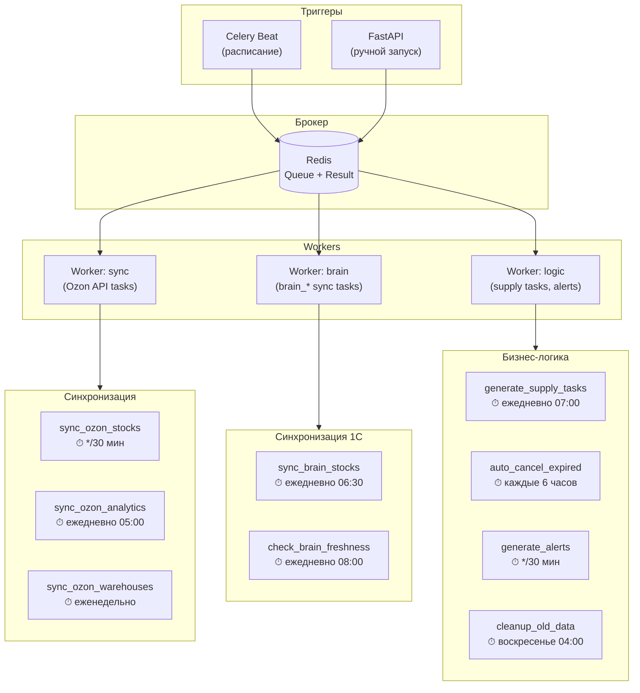
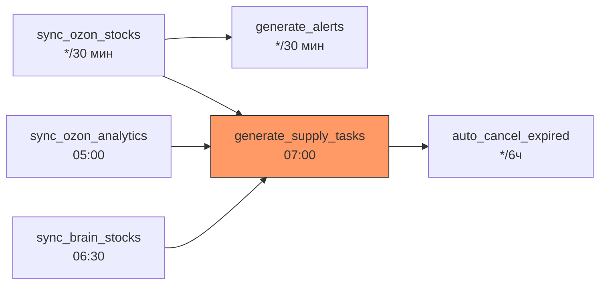

**Модуль:** Logistic  
**Компонент:** Celery Background Tasks  
**Версия:** 2.1  
**Дата:** Февраль 2026  
**Заменяет:** Раздел 8 v2.0

---

## 8.1 Назначение

Celery обеспечивает выполнение фоновых задач модуля Logistic:

- Периодическая синхронизация остатков FBO с Ozon Seller API
- Синхронизация остатков внутреннего склада из `brain_stock_balance`
- Проверка свежести данных в `brain_*` таблицах
- Ежедневная генерация наряд-заданий на отгрузку
- Автоотмена просроченных заданий
- Генерация алертов и очистка устаревших данных

### Изменения v1.0 → v2.0

| v1.0 (Wildberries) | v2.0 (Ozon + 1С) |
|---------------------|-------------------|
| `sync_stocks` (WB API) | `sync_ozon_stocks` (Ozon FBO clusters) |
| `sync_orders` (WB API) | Убрана (данные из Ozon Analytics) |
| `sync_tariffs` (WB API) | Убрана (нерелевантна для FBO) |
| `analyze_cross_docking` | Убрана (проактивная модель) |
| `generate_forecasts` | `generate_supply_tasks` (наряд-задания) |
| `cleanup_old_data` | `cleanup_old_data` (обновлённые таблицы) |
| — | `sync_ozon_analytics` (продажи Ozon) |
| — | `sync_ozon_warehouses` (кластеры) |
| — | `sync_brain_stocks` (чтение brain_stock_balance) |
| — | `check_brain_freshness` (мониторинг loaded_at) |
| — | `auto_cancel_expired` (автоотмена заданий) |
| — | `generate_alerts` (алерты по остаткам) |
| — | `cleanup_stock_history` (очистка истории остатков) |

---

## 8.2 Архитектура



---

## 8.3 Конфигурация

### celery_config.py

```python
from celery import Celery
from celery.schedules import crontab

app = Celery(
    "logistic",
    broker="redis://localhost:6379/0",
    backend="redis://localhost:6379/1",
)

app.conf.update(
    # Сериализация
    task_serializer="json",
    accept_content=["json"],
    result_serializer="json",
    
    # Таймауты
    task_time_limit=300,       # 5 минут макс
    task_soft_time_limit=240,
    
    # Retry
    task_acks_late=True,
    task_reject_on_worker_lost=True,
    
    # Очереди
    task_default_queue="logistic",
    task_queues={
        "logistic.sync": {
            "exchange": "logistic",
            "routing_key": "logistic.sync",
        },
        "logistic.brain": {
            "exchange": "logistic",
            "routing_key": "logistic.brain",
        },
        "logistic.logic": {
            "exchange": "logistic",
            "routing_key": "logistic.logic",
        },
    },
    
    # Маршрутизация
    task_routes={
        "logistic.tasks.sync_ozon_*": {"queue": "logistic.sync"},
        "logistic.tasks.sync_brain_*": {"queue": "logistic.brain"},
        "logistic.tasks.check_brain_*": {"queue": "logistic.brain"},
        "logistic.tasks.cleanup_stock_*": {"queue": "logistic.brain"},
        "logistic.tasks.generate_*": {"queue": "logistic.logic"},
        "logistic.tasks.auto_cancel_*": {"queue": "logistic.logic"},
        "logistic.tasks.cleanup_old_*": {"queue": "logistic.logic"},
    },
    
    # Расписание
    beat_schedule={
        # === Синхронизация Ozon ===
        "sync-ozon-stocks": {
            "task": "logistic.tasks.sync_ozon_stocks",
            "schedule": crontab(minute="*/30"),
        },
        "sync-ozon-analytics": {
            "task": "logistic.tasks.sync_ozon_analytics",
            "schedule": crontab(hour=5, minute=0),
        },
        "sync-ozon-warehouses": {
            "task": "logistic.tasks.sync_ozon_warehouses",
            "schedule": crontab(hour=2, minute=0, day_of_week=1),
        },
        
        # === Синхронизация 1С (brain_* таблицы) ===
        "sync-brain-stocks": {
            "task": "logistic.tasks.sync_brain_stocks",
            "schedule": crontab(hour=6, minute=30),
        },
        "check-brain-freshness": {
            "task": "logistic.tasks.check_brain_freshness",
            "schedule": crontab(hour=8, minute=0),
        },
        "cleanup-stock-history": {
            "task": "logistic.tasks.cleanup_stock_history",
            "schedule": crontab(hour=3, minute=0, day_of_month=1),
        },
        
        # === Бизнес-логика ===
        "generate-supply-tasks": {
            "task": "logistic.tasks.generate_supply_tasks",
            "schedule": crontab(hour=7, minute=0),
        },
        "auto-cancel-expired": {
            "task": "logistic.tasks.auto_cancel_expired",
            "schedule": crontab(minute=0, hour="*/6"),
        },
        "generate-alerts": {
            "task": "logistic.tasks.generate_alerts",
            "schedule": crontab(minute="*/30"),
        },
        
        # === Обслуживание ===
        "cleanup-old-data": {
            "task": "logistic.tasks.cleanup_old_data",
            "schedule": crontab(hour=4, minute=0, day_of_week=0),
        },
    },
)
```

---

## 8.4 Задачи

### 8.4.1 sync_ozon_stocks

```python
# tasks/sync_ozon_stocks.py
import structlog
from celery import shared_task

logger = structlog.get_logger("logistic.tasks")


@shared_task(
    name="logistic.tasks.sync_ozon_stocks",
    bind=True,
    max_retries=3,
    default_retry_delay=120,
    autoretry_for=(OzonAPIError,),
)
def sync_ozon_stocks(self, brand_id: str = "all"):
    """
    Синхронизация остатков FBO с Ozon Seller API.
    
    Расписание: каждые 30 минут
    Источник: POST /v1/analytics/stock_on_warehouses
    Результат: cluster_stock_snapshots + Redis cache
    """
    import asyncio
    
    async def _sync():
        stock_service = get_stock_service()
        brands = resolve_brands(brand_id)
        results = {}
        
        for brand in brands:
            adapter = get_ozon_adapter(brand)
            
            # Получаем остатки FBO по кластерам
            raw_stocks = await adapter.get_stock_on_warehouses()
            
            # Обогащаем velocity из analytics
            enriched = await stock_service.enrich_with_velocity(
                raw_stocks, brand
            )
            
            # Сохраняем снимки в БД
            count = await stock_service.save_cluster_snapshots(
                enriched, brand
            )
            
            # Обновляем Redis cache
            await stock_service.update_cache(enriched, brand)
            
            results[brand] = {
                "snapshots_saved": count,
                "clusters": len(set(s.cluster_name for s in enriched)),
                "articles": len(set(s.article for s in enriched)),
            }
        
        return results
    
    result = asyncio.run(_sync())
    
    logger.info(
        "sync_ozon_stocks_completed",
        results=result
    )
    
    return {"status": "success", "results": result}
```

### 8.4.2 sync_ozon_analytics

```python
# tasks/sync_ozon_analytics.py
@shared_task(
    name="logistic.tasks.sync_ozon_analytics",
    bind=True,
    max_retries=2,
    default_retry_delay=600,
)
def sync_ozon_analytics(self, brand_id: str = "all"):
    """
    Синхронизация аналитики продаж с Ozon.
    
    Расписание: ежедневно 05:00
    Источник: POST /v1/analytics/data (metrics: ordered_units)
    Результат: обновление avg_daily_sales в снимках, 
               данные для DemandForecaster
    """
    import asyncio
    
    async def _sync():
        analytics_service = get_analytics_service()
        brands = resolve_brands(brand_id)
        results = {}
        
        for brand in brands:
            adapter = get_ozon_adapter(brand)
            
            # Продажи за 28 дней по SKU
            sales_data = await adapter.get_analytics_data(
                metrics=["ordered_units"],
                dimensions=["sku"],
                date_from=date.today() - timedelta(days=28),
                date_to=date.today() - timedelta(days=1),
            )
            
            count = await analytics_service.save_sales_analytics(
                sales_data, brand
            )
            
            results[brand] = {"records_saved": count}
        
        return results
    
    result = asyncio.run(_sync())
    
    logger.info("sync_ozon_analytics_completed", results=result)
    return {"status": "success", "results": result}
```

### 8.4.3 sync_ozon_warehouses

```python
# tasks/sync_ozon_warehouses.py
@shared_task(
    name="logistic.tasks.sync_ozon_warehouses",
    bind=True,
    max_retries=2,
)
def sync_ozon_warehouses(self):
    """
    Синхронизация списка кластеров FBO с Ozon.
    
    Расписание: еженедельно (понедельник 02:00)
    Источник: POST /v1/warehouse/list
    Результат: обновление logistic_clusters
    """
    import asyncio
    
    async def _sync():
        warehouse_service = get_warehouse_service()
        
        for brand in ["ohana_market", "ohana_kids"]:
            adapter = get_ozon_adapter(brand)
            warehouses = await adapter.get_warehouses_list()
            count = await warehouse_service.sync_clusters(warehouses)
        
        return {"clusters_synced": count}
    
    result = asyncio.run(_sync())
    
    logger.info("sync_ozon_warehouses_completed", results=result)
    return {"status": "success", "results": result}
```

### 8.4.4 sync_brain_stocks

```python
# tasks/sync_brain_stocks.py
@shared_task(
    name="logistic.tasks.sync_brain_stocks",
    bind=True,
    max_retries=2,
    default_retry_delay=300,
)
def sync_brain_stocks(self):
    """
    Синхронизация остатков из brain_stock_balance.
    
    Расписание: 06:30 (после загрузки Экстрактором в 06:00)
    Источник: PostgreSQL brain_stock_balance (Q-06)
    Результат: warehouse_stocks + logistic_stock_history
    
    Подробности: adolf_logistic_5_1c_integration.md (v3.0)
    """
    import asyncio
    
    async def _sync():
        service = get_history_service()
        return await service.sync_stocks()
    
    result = asyncio.run(_sync())
    
    logger.info(
        "sync_brain_stocks_completed",
        status=result["status"],
        validated=result.get("validated", 0),
        anomalies=result.get("anomalies", 0)
    )
    
    return result
```

### 8.4.4a check_brain_freshness

```python
# tasks/check_brain_freshness.py
@shared_task(name="logistic.tasks.check_brain_freshness")
def check_brain_freshness():
    """
    Проверка свежести данных в brain_* таблицах.
    Алерт если loaded_at старше 26 часов.
    
    Расписание: 08:00 ежедневно
    """
    import asyncio
    
    async def _check():
        reader = get_brain_reader()
        alerts = get_alert_service()
        tables = [
            "brain_stock_balance",
            "brain_customer_orders",
            "brain_supplier_orders",
            "brain_goods_receipts"
        ]
        stale = []
        for table in tables:
            loaded_at = await reader._get_loaded_at(table)
            if not reader._check_freshness(loaded_at):
                stale.append(table)
        
        if stale:
            await alerts.create_alert(
                type="DATA_STALE",
                severity="HIGH",
                message=f"Устаревшие данные: {', '.join(stale)}"
            )
        return {"stale": stale, "all_fresh": len(stale) == 0}
    
    result = asyncio.run(_check())
    logger.info("check_brain_freshness_completed", **result)
    return result
```

### 8.4.5 generate_supply_tasks

```python
# tasks/generate_supply_tasks.py
@shared_task(
    name="logistic.tasks.generate_supply_tasks",
    bind=True,
    max_retries=1,
)
def generate_supply_tasks(self, brand_id: str = "all"):
    """
    Ежедневная генерация наряд-заданий на отгрузку FBO.
    
    Расписание: ежедневно 07:00
    Логика: deficit = target_stock - fbo_stock - in_transit
    Результат: supply_tasks + алерты TASKS_GENERATED / WAREHOUSE_LOW
    
    Подробности: adolf_logistic_4_supply_task_engine_v2_0.md
    """
    import asyncio
    
    async def _generate():
        task_gen = get_task_generator()
        supply_svc = get_supply_task_service()
        alert_svc = get_alert_service()
        brands = resolve_brands(brand_id)
        
        total_batch = {
            "total_tasks": 0,
            "total_quantity": 0,
            "urgent": 0,
            "planned": 0,
            "recommended": 0,
            "purchase_required": 0,
        }
        
        for brand in brands:
            # Расчёт дефицитов
            deficits = await task_gen.calculate_all_deficits(brand)
            
            # Генерация заданий
            tasks = await task_gen.generate_tasks(deficits, brand)
            
            # Сохранение
            saved = await supply_svc.batch_create(tasks)
            
            total_batch["total_tasks"] += len(saved)
            total_batch["total_quantity"] += sum(t.quantity for t in saved)
            total_batch["urgent"] += sum(
                1 for t in saved if t.priority == "urgent"
            )
            total_batch["planned"] += sum(
                1 for t in saved if t.priority == "planned"
            )
            total_batch["recommended"] += sum(
                1 for t in saved if t.priority == "recommended"
            )
            
            # Алерты WAREHOUSE_LOW
            purchase_needed = [
                d for d in deficits if d.coverage == "none"
            ]
            total_batch["purchase_required"] += len(purchase_needed)
            
            for item in purchase_needed:
                await alert_svc.create_alert(
                    alert_type="WAREHOUSE_LOW",
                    severity="high",
                    article=item.article,
                    message=(
                        f"Товар {item.article} отсутствует на складе 1С. "
                        f"Дефицит FBO: {item.deficit} шт. "
                        f"Требуется закупка."
                    ),
                    brand_id=brand
                )
            
            # Алерт TASKS_GENERATED
            await alert_svc.create_alert(
                alert_type="TASKS_GENERATED",
                severity="low",
                message=(
                    f"Сформировано {len(saved)} заданий "
                    f"({sum(1 for t in saved if t.priority == 'urgent')} urgent)"
                ),
                brand_id=brand
            )
        
        return total_batch
    
    result = asyncio.run(_generate())
    
    logger.info(
        "generate_supply_tasks_completed",
        **result
    )
    
    return {"status": "success", **result}
```

### 8.4.6 auto_cancel_expired

```python
# tasks/auto_cancel_expired.py
@shared_task(
    name="logistic.tasks.auto_cancel_expired",
)
def auto_cancel_expired(max_age_hours: int = 48):
    """
    Автоотмена неподтверждённых заданий старше 48 часов.
    
    Расписание: каждые 6 часов
    Отменяет: status='new' AND created_at < NOW() - 48h
    Результат: supply_tasks → status='cancelled' + алерт TASK_OVERDUE
    """
    import asyncio
    
    async def _cancel():
        supply_svc = get_supply_task_service()
        alert_svc = get_alert_service()
        
        cancelled = await supply_svc.auto_cancel_expired(max_age_hours)
        
        for task in cancelled:
            await alert_svc.create_alert(
                alert_type="TASK_OVERDUE",
                severity="medium",
                article=task.article,
                cluster_name=task.cluster_name,
                message=(
                    f"Задание {task.task_number} автоотменено "
                    f"(не подтверждено > {max_age_hours}ч)"
                ),
                brand_id=task.brand_id
            )
        
        return {"cancelled_count": len(cancelled)}
    
    result = asyncio.run(_cancel())
    
    if result["cancelled_count"] > 0:
        logger.warning(
            "auto_cancel_expired_completed",
            **result
        )
    
    return {"status": "success", **result}
```

### 8.4.7 generate_alerts

```python
# tasks/generate_alerts.py
@shared_task(
    name="logistic.tasks.generate_alerts",
)
def generate_alerts(brand_id: str = "all"):
    """
    Генерация алертов по текущим остаткам FBO.
    
    Расписание: каждые 30 минут (после sync_ozon_stocks)
    Типы: URGENT_STOCK, LOW_STOCK, OUT_OF_STOCK, 
          OZON_URGENT, STOCK_RECOVERED
    
    Подробности: adolf_logistic_3_stock_monitor_v2_0.md
    """
    import asyncio
    
    async def _generate():
        stock_monitor = get_stock_monitor()
        brands = resolve_brands(brand_id)
        total = 0
        
        for brand in brands:
            alerts = await stock_monitor.check_and_generate_alerts(brand)
            total += len(alerts)
        
        return {"alerts_generated": total}
    
    result = asyncio.run(_generate())
    
    if result["alerts_generated"] > 0:
        logger.info("generate_alerts_completed", **result)
    
    return {"status": "success", **result}
```

### 8.4.8 cleanup_old_data

```python
# tasks/cleanup.py
@shared_task(
    name="logistic.tasks.cleanup_old_data",
)
def cleanup_old_data(retention_days: int = 90):
    """
    Очистка устаревших данных.
    
    Расписание: еженедельно (воскресенье 04:00)
    Удаляет: снимки FBO, историю 1С, прочитанные алерты,
             завершённые/отменённые задания старше retention_days.
    
    Использует: logistic_cleanup_old_data(90) — SQL функция
    """
    import asyncio
    
    async def _cleanup():
        db = get_db_session()
        result = await db.fetch_one(
            "SELECT * FROM logistic_cleanup_old_data(:days)",
            {"days": retention_days}
        )
        return dict(result)
    
    result = asyncio.run(_cleanup())
    
    logger.info(
        "cleanup_old_data_completed",
        retention_days=retention_days,
        **result
    )
    
    return {"status": "success", **result}
```

### 8.4.9 cleanup_stock_history

```python
# tasks/cleanup_stock_history.py
@shared_task(
    name="logistic.tasks.cleanup_stock_history",
)
def cleanup_stock_history(keep_days: int = 90):
    """
    Очистка истории остатков старше 90 дней.
    
    Расписание: ежемесячно (1-е число, 03:00)
    Таблица: logistic_stock_history
    
    Подробности: adolf_logistic_5_1c_integration.md (v3.0)
    """
    import asyncio
    
    async def _cleanup():
        repo = get_history_repo()
        return await repo.cleanup(keep_days=keep_days)
    
    deleted = asyncio.run(_cleanup())
    
    if deleted > 0:
        logger.info(
            "cleanup_stock_history_completed",
            deleted_rows=deleted
        )
    
    return {"status": "success", "deleted_rows": deleted}
```

---

## 8.5 Расписание задач

```mermaid
gantt
    title Расписание Celery Tasks (сутки)
    dateFormat HH:mm
    axisFormat %H:%M
    
    section Ozon Sync
    sync_ozon_warehouses (пн)  :milestone, 02:00, 0d
    sync_ozon_analytics        :milestone, 05:00, 0d
    sync_ozon_stocks           :crit, 00:00, 24h
    
    section 1С (brain_*)
    sync_brain_stocks          :milestone, 06:30, 0d
    check_brain_freshness      :milestone, 08:00, 0d
    
    section Business Logic
    generate_supply_tasks      :milestone, 07:00, 0d
    auto_cancel_expired        :00:00, 24h
    generate_alerts            :00:00, 24h
    
    section Maintenance
    cleanup_old_data (вс)      :milestone, 04:00, 0d
```



### Сводная таблица

| Задача | Cron | Очередь | Retry | Описание |
|--------|------|---------|-------|----------|
| `sync_ozon_stocks` | `*/30 * * * *` | sync | 3 × 120с | Остатки FBO по кластерам |
| `sync_ozon_analytics` | `0 5 * * *` | sync | 2 × 600с | Продажи за 28 дней |
| `sync_ozon_warehouses` | `0 2 * * 1` | sync | 2 | Список кластеров |
| `sync_brain_stocks` | `30 6 * * *` | brain | 2 × 300с | Синхронизация из brain_stock_balance |
| `check_brain_freshness` | `0 8 * * *` | brain | — | Проверка свежести brain_* |
| `cleanup_stock_history` | `0 3 1 * *` | brain | — | Очистка истории > 90 дней |
| `generate_supply_tasks` | `0 7 * * *` | logic | 1 | Наряд-задания |
| `auto_cancel_expired` | `0 */6 * * *` | logic | — | Автоотмена NEW > 48ч |
| `generate_alerts` | `*/30 * * * *` | logic | — | Алерты по остаткам |
| `cleanup_old_data` | `0 4 * * 0` | logic | — | Очистка БД > 90 дней |

### Порядок выполнения (daily timeline)

```
02:00  sync_ozon_warehouses (понедельник)
03:00  cleanup_stock_history (1-е число месяца)
04:00  cleanup_old_data (воскресенье)
05:00  sync_ozon_analytics
06:00  ← Экстрактор данных 1С загружает brain_stock_balance
06:30  sync_brain_stocks ← чтение brain_* → валидация → history → upsert
07:00  generate_supply_tasks ← зависит от свежих данных stocks + brain_*
08:00  check_brain_freshness ← алерт если loaded_at > 26ч
*/30   sync_ozon_stocks → generate_alerts (цепочка)
*/6h   auto_cancel_expired
```

---

## 8.6 Зависимости между задачами



Критическая цепочка для `generate_supply_tasks` (07:00):
1. `sync_ozon_stocks` — свежие остатки FBO (последний за 06:30)
2. `sync_ozon_analytics` — velocity из Ozon (05:00)
3. `sync_brain_stocks` — остатки внутреннего склада из brain_stock_balance (06:30)

---

## 8.7 Мониторинг

### Prometheus метрики

```python
from prometheus_client import Counter, Histogram, Gauge

# Счётчики
task_runs = Counter(
    "logistic_celery_task_runs_total",
    "Total task runs",
    ["task_name", "status"]
)

# Время выполнения
task_duration = Histogram(
    "logistic_celery_task_duration_seconds",
    "Task execution time",
    ["task_name"],
    buckets=[1, 5, 10, 30, 60, 120, 300]
)

# Активные задачи
active_tasks = Gauge(
    "logistic_celery_active_tasks",
    "Currently running tasks",
    ["task_name"]
)

# Специфические метрики
supply_tasks_generated = Counter(
    "logistic_supply_tasks_generated_total",
    "Supply tasks generated by priority",
    ["priority"]
)

ozon_api_calls = Counter(
    "logistic_ozon_api_calls_total",
    "Ozon API calls by endpoint",
    ["endpoint", "status"]
)

brain_sync_records = Counter(
    "logistic_brain_sync_records_total",
    "brain_stock_balance sync records",
    ["status"]  # validated / unmapped / anomaly
)

brain_freshness = Gauge(
    "logistic_brain_freshness_hours",
    "Hours since last brain_* table update",
    ["table"]
)
```

### Flower

```bash
celery -A logistic.celery_config flower --port=5555
```

---

## 8.8 Запуск

### Workers

```bash
# Sync worker (Ozon API)
celery -A logistic.celery_config worker \
    -Q logistic.sync -c 2 \
    --loglevel=INFO -n sync@%h

# Brain worker (brain_* sync)
celery -A logistic.celery_config worker \
    -Q logistic.brain -c 1 \
    --loglevel=INFO -n brain@%h

# Logic worker (supply tasks, alerts)
celery -A logistic.celery_config worker \
    -Q logistic.logic -c 2 \
    --loglevel=INFO -n logic@%h
```

### Beat

```bash
celery -A logistic.celery_config beat --loglevel=INFO
```

### Docker Compose

```yaml
services:
  logistic-worker-sync:
    build: .
    command: >
      celery -A logistic.celery_config worker 
      -Q logistic.sync -c 2 -n sync@%h
    environment:
      - CELERY_BROKER_URL=redis://redis:6379/0
      - LOGISTIC_OZON_CLIENT_ID=${OZON_CLIENT_ID}
      - LOGISTIC_OZON_API_KEY=${OZON_API_KEY}
    depends_on:
      - redis
      - postgres
  
  logistic-worker-brain:
    build: .
    command: >
      celery -A logistic.celery_config worker 
      -Q logistic.brain -c 1 -n brain@%h
    depends_on:
      - redis
      - postgres
  
  logistic-worker-logic:
    build: .
    command: >
      celery -A logistic.celery_config worker 
      -Q logistic.logic -c 2 -n logic@%h
    depends_on:
      - redis
      - postgres
  
  logistic-beat:
    build: .
    command: celery -A logistic.celery_config beat
    environment:
      - CELERY_BROKER_URL=redis://redis:6379/0
    depends_on:
      - redis

volumes:
  import_data:
    driver: local
```

---

## 8.9 Ручной запуск

### Через API

```python
router = APIRouter(prefix="/logistic/tasks", tags=["Logistic Tasks"])

ALLOWED_TASKS = {
    "sync_ozon_stocks": sync_ozon_stocks,
    "sync_ozon_analytics": sync_ozon_analytics,
    "sync_ozon_warehouses": sync_ozon_warehouses,
    "sync_brain_stocks": sync_brain_stocks,
    "check_brain_freshness": check_brain_freshness,
    "generate_supply_tasks": generate_supply_tasks,
    "auto_cancel_expired": auto_cancel_expired,
    "generate_alerts": generate_alerts,
    "cleanup_old_data": cleanup_old_data,
}


@router.post("/{task_name}/run")
async def run_task(
    task_name: str,
    user=Depends(require_role(["admin", "director"]))
) -> dict:
    """Ручной запуск Celery задачи."""
    if task_name not in ALLOWED_TASKS:
        raise HTTPException(404, f"Task '{task_name}' not found")
    
    result = ALLOWED_TASKS[task_name].delay()
    return {"task_id": result.id, "task_name": task_name, "status": "queued"}


@router.get("/{task_id}/status")
async def get_task_status(task_id: str) -> dict:
    """Статус выполнения задачи."""
    from celery.result import AsyncResult
    result = AsyncResult(task_id)
    return {
        "task_id": task_id,
        "status": result.status,
        "result": result.result if result.ready() else None
    }
```

---

## 8.10 Промпт для Claude Code

```
Реализуй Celery tasks для модуля Logistic v2.1 согласно
adolf_logistic_8_celery.md

Требования:
1. Конфигурация: 3 очереди (sync, brain, logic), маршрутизация
2. Задачи (10 штук):
   - sync_ozon_stocks (*/30 мин, retry 3×120с)
   - sync_ozon_analytics (05:00, retry 2×600с)
   - sync_ozon_warehouses (пн 02:00)
   - sync_brain_stocks (06:30, retry 2×300с)
   - check_brain_freshness (08:00, алерт если loaded_at > 26ч)
   - generate_supply_tasks (07:00)
   - auto_cancel_expired (*/6ч, отмена NEW > 48ч)
   - generate_alerts (*/30 мин, после sync_stocks)
   - cleanup_old_data (вс 04:00, SQL функция)
   - cleanup_stock_history (1-е число, 03:00, > 90 дней)
3. Docker Compose: 3 workers + beat
4. API: ручной запуск + статус задачи
5. Метрики: Prometheus counters/histograms

Зависимости: celery, redis, structlog, prometheus_client,
HistoryService + BrainDataReader (из раздела 5 v3.0)
```

---

## 8.11 Связанные документы

| Документ | Описание |
|----------|----------|
| [1. Architecture](adolf_logistic_1_architecture_v2_0.md) | Архитектура, потоки данных |
| [2. Ozon Integration](adolf_logistic_2_ozon_integration_v2_0.md) | Ozon API endpoints |
| [3. Stock Monitor](adolf_logistic_3_stock_monitor_v2_0.md) | Алерты по остаткам |
| [4. Supply Task Engine](adolf_logistic_4_supply_task_engine_v2_0.md) | Генерация заданий |
| [5. 1С Integration](/logistic/adolf_logistic_5_1c_integration) | brain_* синхронизация |
| [6. Database](/logistic/adolf_logistic_6_database) | Таблицы, функция cleanup |

---

**Документ подготовлен:** Февраль 2026  
**Версия:** 2.1  
**Статус:** Черновик  
**Заменяет:** Раздел 8 v2.0

