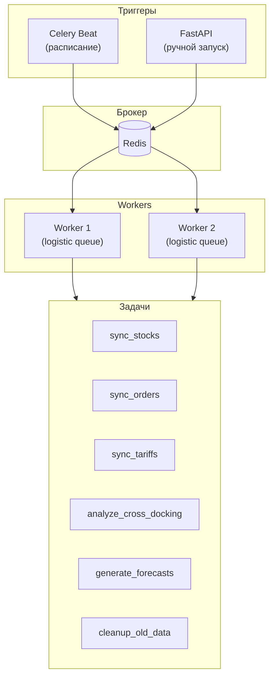

# ADOLF LOGISTIC — Раздел 8: Celery Tasks

**Модуль:** Logistic  
**Компонент:** Celery Background Tasks  
**Версия:** 1.0  
**Дата:** Январь 2026

---

## 8.1 Назначение

Celery обеспечивает выполнение фоновых задач модуля Logistic:

- Периодическая синхронизация данных с WB API
- Расчёт аналитики и прогнозов
- Генерация алертов
- Очистка устаревших данных

---

## 8.2 Архитектура



---

## 8.3 Конфигурация

### celery_config.py

```python
# celery_config.py
from celery import Celery
from celery.schedules import crontab

app = Celery(
    "logistic",
    broker="redis://localhost:6379/0",
    backend="redis://localhost:6379/1",
)

app.conf.update(
    # Сериализация
    task_serializer="json",
    accept_content=["json"],
    result_serializer="json",
    
    # Таймауты
    task_time_limit=300,  # 5 минут макс
    task_soft_time_limit=240,
    
    # Retry
    task_acks_late=True,
    task_reject_on_worker_lost=True,
    
    # Очереди
    task_default_queue="logistic",
    task_queues={
        "logistic": {
            "exchange": "logistic",
            "routing_key": "logistic",
        },
        "logistic_priority": {
            "exchange": "logistic",
            "routing_key": "logistic.priority",
        },
    },
    
    # Расписание
    beat_schedule={
        # Синхронизация остатков - каждые 30 минут
        "sync-stocks": {
            "task": "logistic.tasks.sync_stocks",
            "schedule": crontab(minute="*/30"),
            "options": {"queue": "logistic"},
        },
        
        # Синхронизация заказов - каждые 30 минут
        "sync-orders": {
            "task": "logistic.tasks.sync_orders",
            "schedule": crontab(minute="15,45"),
            "options": {"queue": "logistic"},
        },
        
        # Синхронизация тарифов - раз в день
        "sync-tariffs": {
            "task": "logistic.tasks.sync_tariffs",
            "schedule": crontab(hour=6, minute=0),
            "options": {"queue": "logistic"},
        },
        
        # Анализ кросс-докинга - каждый час
        "analyze-cross-docking": {
            "task": "logistic.tasks.analyze_cross_docking",
            "schedule": crontab(minute=0),
            "options": {"queue": "logistic"},
        },
        
        # Прогнозы - раз в день
        "generate-forecasts": {
            "task": "logistic.tasks.generate_forecasts",
            "schedule": crontab(hour=3, minute=0),
            "options": {"queue": "logistic"},
        },
        
        # Очистка старых данных - раз в неделю
        "cleanup-old-data": {
            "task": "logistic.tasks.cleanup_old_data",
            "schedule": crontab(hour=4, minute=0, day_of_week=0),
            "options": {"queue": "logistic"},
        },
    },
)
```

---

## 8.4 Задачи

### sync_stocks

```python
# tasks/sync_stocks.py
from celery import shared_task
from datetime import datetime
import logging

from services.stock_monitor import StockMonitorService
from core.database import get_db_session

logger = logging.getLogger(__name__)

@shared_task(
    name="logistic.tasks.sync_stocks",
    bind=True,
    max_retries=3,
    default_retry_delay=60,
    autoretry_for=(Exception,),
)
def sync_stocks(self, brand_id: str = "all"):
    """
    Синхронизация остатков с WB API
    
    Расписание: каждые 30 минут
    Rate limit WB: 1 req/min — учитывается в адаптере
    """
    logger.info(f"Starting sync_stocks for brand: {brand_id}")
    
    try:
        with get_db_session() as session:
            service = StockMonitorService(session)
            
            brands = ["ohana_market", "ohana_kids"] if brand_id == "all" else [brand_id]
            
            results = {}
            for brand in brands:
                count = service.sync_stocks(brand)
                results[brand] = count
                logger.info(f"Synced {count} stocks for {brand}")
            
            return {
                "status": "success",
                "timestamp": datetime.utcnow().isoformat(),
                "results": results,
            }
            
    except Exception as exc:
        logger.error(f"sync_stocks failed: {exc}")
        raise self.retry(exc=exc)
```

### sync_orders

```python
# tasks/sync_orders.py
@shared_task(
    name="logistic.tasks.sync_orders",
    bind=True,
    max_retries=3,
    default_retry_delay=60,
)
def sync_orders(self, brand_id: str = "all"):
    """
    Синхронизация заказов с WB API
    
    Расписание: каждые 30 минут (offset от stocks)
    Инкрементальная загрузка по last_sync_date
    """
    logger.info(f"Starting sync_orders for brand: {brand_id}")
    
    try:
        with get_db_session() as session:
            service = OrderAnalyzerService(session)
            
            brands = ["ohana_market", "ohana_kids"] if brand_id == "all" else [brand_id]
            
            results = {}
            for brand in brands:
                count = service.sync_orders(brand)
                results[brand] = count
            
            return {
                "status": "success",
                "timestamp": datetime.utcnow().isoformat(),
                "results": results,
            }
            
    except Exception as exc:
        logger.error(f"sync_orders failed: {exc}")
        raise self.retry(exc=exc)
```

### sync_tariffs

```python
# tasks/sync_tariffs.py
@shared_task(
    name="logistic.tasks.sync_tariffs",
    bind=True,
    max_retries=3,
)
def sync_tariffs(self):
    """
    Синхронизация тарифов логистики
    
    Расписание: ежедневно в 06:00
    Включает: тарифы доставки, коэффициенты приёмки
    """
    logger.info("Starting sync_tariffs")
    
    try:
        with get_db_session() as session:
            service = TariffService(session)
            
            # Тарифы доставки
            tariffs_count = service.sync_delivery_tariffs()
            
            # Коэффициенты приёмки
            acceptance_count = service.sync_acceptance_coefficients()
            
            return {
                "status": "success",
                "tariffs_synced": tariffs_count,
                "acceptance_synced": acceptance_count,
            }
            
    except Exception as exc:
        logger.error(f"sync_tariffs failed: {exc}")
        raise self.retry(exc=exc)
```

### analyze_cross_docking

```python
# tasks/analyze_cross_docking.py
@shared_task(
    name="logistic.tasks.analyze_cross_docking",
    bind=True,
)
def analyze_cross_docking(self, brand_id: str = "all"):
    """
    Анализ кросс-докинга в заказах
    
    Расписание: каждый час
    Выявляет заказы с отправкой с неоптимального склада
    """
    logger.info(f"Starting analyze_cross_docking for brand: {brand_id}")
    
    try:
        with get_db_session() as session:
            service = OrderAnalyzerService(session)
            
            brands = ["ohana_market", "ohana_kids"] if brand_id == "all" else [brand_id]
            
            results = {}
            for brand in brands:
                analysis = service.analyze_cross_docking(brand)
                results[brand] = {
                    "orders_analyzed": analysis.total_orders,
                    "cross_docking_found": analysis.cross_docking_count,
                    "extra_costs": analysis.extra_costs,
                }
                
                # Генерация алертов при превышении порога
                if analysis.cross_docking_rate > 0.05:  # > 5%
                    service.create_cross_docking_alert(brand, analysis)
            
            return {
                "status": "success",
                "results": results,
            }
            
    except Exception as exc:
        logger.error(f"analyze_cross_docking failed: {exc}")
        raise
```

### generate_forecasts

```python
# tasks/generate_forecasts.py
@shared_task(
    name="logistic.tasks.generate_forecasts",
    bind=True,
)
def generate_forecasts(self, brand_id: str = "all"):
    """
    Генерация прогнозов спроса
    
    Расписание: ежедневно в 03:00
    Используется для рекомендаций по поставкам
    """
    logger.info(f"Starting generate_forecasts for brand: {brand_id}")
    
    try:
        with get_db_session() as session:
            service = DemandForecastService(session)
            
            brands = ["ohana_market", "ohana_kids"] if brand_id == "all" else [brand_id]
            
            results = {}
            for brand in brands:
                forecasts = service.generate_forecasts(brand)
                results[brand] = {
                    "sku_forecasted": len(forecasts),
                }
            
            return {
                "status": "success",
                "results": results,
            }
            
    except Exception as exc:
        logger.error(f"generate_forecasts failed: {exc}")
        raise
```

### cleanup_old_data

```python
# tasks/cleanup.py
@shared_task(
    name="logistic.tasks.cleanup_old_data",
    bind=True,
)
def cleanup_old_data(self, retention_days: int = 90):
    """
    Очистка устаревших данных
    
    Расписание: еженедельно (воскресенье 04:00)
    Удаляет данные старше retention_days
    """
    logger.info(f"Starting cleanup_old_data, retention: {retention_days} days")
    
    try:
        with get_db_session() as session:
            # Stock snapshots
            stocks_deleted = session.execute(
                "DELETE FROM logistic_stock_snapshots "
                "WHERE snapshot_date < NOW() - INTERVAL :days DAY",
                {"days": retention_days}
            ).rowcount
            
            # Acknowledged alerts
            alerts_deleted = session.execute(
                "DELETE FROM logistic_alerts "
                "WHERE acknowledged_at IS NOT NULL "
                "AND acknowledged_at < NOW() - INTERVAL :days DAY",
                {"days": retention_days}
            ).rowcount
            
            session.commit()
            
            return {
                "status": "success",
                "stocks_deleted": stocks_deleted,
                "alerts_deleted": alerts_deleted,
            }
            
    except Exception as exc:
        logger.error(f"cleanup_old_data failed: {exc}")
        raise
```

---

## 8.5 Расписание задач

| Задача | Расписание | Описание |
|--------|------------|----------|
| sync_stocks | */30 * * * * | Каждые 30 мин |
| sync_orders | 15,45 * * * * | Каждые 30 мин (offset) |
| sync_tariffs | 0 6 * * * | Ежедневно 06:00 |
| analyze_cross_docking | 0 * * * * | Каждый час |
| generate_forecasts | 0 3 * * * | Ежедневно 03:00 |
| cleanup_old_data | 0 4 * * 0 | Воскресенье 04:00 |

---

## 8.6 Мониторинг

### Prometheus метрики

```python
# tasks/metrics.py
from prometheus_client import Counter, Histogram, Gauge

# Счётчики выполнения
task_runs = Counter(
    "logistic_celery_task_runs_total",
    "Total task runs",
    ["task_name", "status"]
)

# Время выполнения
task_duration = Histogram(
    "logistic_celery_task_duration_seconds",
    "Task execution time",
    ["task_name"]
)

# Активные задачи
active_tasks = Gauge(
    "logistic_celery_active_tasks",
    "Currently running tasks",
    ["task_name"]
)
```

### Flower

Мониторинг через Flower:

```bash
celery -A logistic flower --port=5555
```

---

## 8.7 Запуск

### Worker

```bash
celery -A logistic.celery_config worker \
    -Q logistic,logistic_priority \
    -c 2 \
    --loglevel=INFO
```

### Beat

```bash
celery -A logistic.celery_config beat \
    --loglevel=INFO
```

### Docker Compose

```yaml
logistic-worker:
  build: .
  command: celery -A logistic.celery_config worker -Q logistic -c 2
  environment:
    - CELERY_BROKER_URL=redis://redis:6379/0
  depends_on:
    - redis
    - postgres

logistic-beat:
  build: .
  command: celery -A logistic.celery_config beat
  environment:
    - CELERY_BROKER_URL=redis://redis:6379/0
  depends_on:
    - redis
```

---

## 8.8 Ручной запуск

### Через API

```python
# api/tasks.py
@router.post("/logistic/tasks/{task_name}/run")
async def run_task(
    task_name: str,
    user = Depends(require_role(["admin"]))
):
    """Ручной запуск задачи"""
    tasks = {
        "sync_stocks": sync_stocks,
        "sync_orders": sync_orders,
        "sync_tariffs": sync_tariffs,
        "analyze_cross_docking": analyze_cross_docking,
    }
    
    if task_name not in tasks:
        raise HTTPException(404, "Task not found")
    
    result = tasks[task_name].delay()
    
    return {"task_id": result.id, "status": "queued"}
```

---

## 8.9 Связанные документы

| Документ | Описание |
|----------|----------|
| [1. Architecture](adolf_logistic_1_architecture_v1_0.md) | Архитектура |
| [2. WB Integration](adolf_logistic_2_wb_integration_v1_0.md) | API WB |
| [3. Stock Monitor](adolf_logistic_3_stock_monitor_v1_0.md) | Остатки |
| [4. Order Analyzer](adolf_logistic_4_order_analyzer_v1_0.md) | Заказы |
| [6. Database](adolf_logistic_6_database_v1_0.md) | Схема БД |

---

**Версия:** 1.0  
**Дата:** Январь 2026  
**Статус:** Готов
