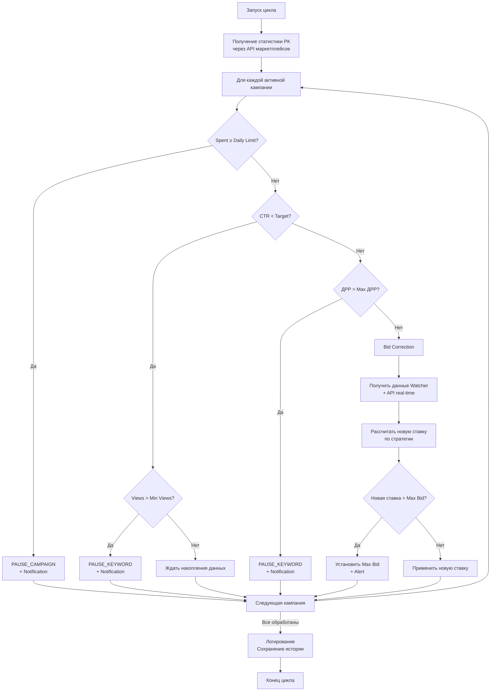

# ADOLF MARKETING — Раздел 0: Введение

**Проект:** Автоматическое управление рекламными кампаниями  
**Модуль:** Marketing (Биддер)  
**Версия:** 1.0  
**Дата:** Январь 2026

---

## Назначение документа

Данный документ является введением в модуль ADOLF MARKETING и содержит:
- Общее описание модуля
- Бизнес-цели и метрики
- Структуру документации
- Краткий обзор функциональности

---

## Что такое ADOLF MARKETING

ADOLF MARKETING — функциональный модуль системы ADOLF, обеспечивающий автоматизированное управление рекламными кампаниями на маркетплейсах. Модуль реализует полный цикл управления: создание кампаний, корректировка ставок, контроль бюджетов и автоматическая пауза неэффективных ключей.

### Поддерживаемые платформы и типы рекламы

| Платформа | Типы рекламы | API |
|-----------|--------------|-----|
| **Wildberries** | Аукцион (поиск), Автоматическая кампания, Каталог | Promotion API |
| **Ozon** | Трафареты, Продвижение в поиске, Брендовая полка | Performance API |
| **Яндекс.Маркет** | Буст продаж, Рекомендации товаров | Bidding API |

### Основные возможности v1.0

| Функция | Описание |
|---------|----------|
| Управление кампаниями | Создание, редактирование, пауза, архивирование РК |
| Управление ключами | Добавление, удаление, корректировка ставок |
| Стратегии биддинга | 4 стратегии автоматической корректировки ставок |
| Safety Logic | Автоматическая пауза неэффективных ключей/кампаний |
| Budget Control | Контроль дневных и общих бюджетов |
| Bid Correction | Корректировка ставок на основе данных Watcher и API |
| Мониторинг | Сбор статистики CTR, CPC, CPO, ДРР в реальном времени |
| Аналитика | Отчёты и AI-рекомендации по оптимизации |

---

## Бизнес-цели

| Цель | Описание | Метрика успеха |
|------|----------|----------------|
| Оптимизация расходов | Снижение неэффективных трат на рекламу | Снижение ДРР на 15% |
| Автоматизация рутины | Исключение ручной корректировки ставок | 90% операций без участия человека |
| Скорость реакции | Быстрая реакция на изменения конкурентов | Корректировка ставок каждые 15 минут |
| Контроль бюджетов | Предотвращение перерасхода | 0% превышения дневных лимитов |
| Повышение эффективности | Рост конверсии рекламных кампаний | Рост CTR на 20% |

---

## Ключевые принципы

| Принцип | Описание |
|---------|----------|
| **Automation First** | Максимальная автоматизация рутинных операций |
| **Safety by Default** | Автоматические ограничители предотвращают перерасход |
| **Data-Driven** | Решения на основе данных Watcher и статистики API |
| **Human-in-the-Loop** | Критичные изменения (выше лимитов) требуют подтверждения |
| **Graceful Degradation** | Сбой одного маркетплейса не влияет на другие |

---

## Стратегии биддинга

| Стратегия | Описание | Применение |
|-----------|----------|------------|
| **Удержание позиции** | Поддержание заданной позиции в выдаче | Ключевые товары, стабильный спрос |
| **Минимальная цена** | Минимальная ставка для попадания в рекламный блок | Экономия бюджета, тестирование |
| **Агрессивный рост** | Максимизация показов в рамках бюджета | Новые товары, акции, сезон |
| **ROI-оптимизация** | Ставка на основе целевого ДРР | Оптимизация рентабельности |

### Параметры стратегий

| Параметр | Описание | Диапазон |
|----------|----------|----------|
| Target Position | Целевая позиция в выдаче | 1–50 |
| Max Bid | Максимальная допустимая ставка | 1–10 000 ₽ |
| Bid Step | Шаг корректировки ставки | 0.1–100 ₽ |
| Target ДРР | Целевая доля рекламных расходов | 1–50% |
| Target CTR | Целевой CTR для Safety Logic | 0.5–10% |
| Min Views | Минимум показов для принятия решения | 100–10 000 |

---

## Safety Logic

Автоматические правила защиты от неэффективных расходов:

| Условие | Параметры | Действие |
|---------|-----------|----------|
| Низкий CTR | CTR < Target CTR AND Views > Min Views | Пауза ключа |
| Превышение дневного бюджета | Spent ≥ Daily Limit | Пауза кампании |
| Превышение ДРР | ДРР > Max ДРР | Пауза ключа/кампании |
| Нулевые конверсии | Views > Min Views AND Orders = 0 | Пауза ключа |
| Превышение Max Bid | Рекомендуемая ставка > Max Bid | Не повышать, алерт |

---

## Алгоритм работы (каждые 15 минут)

---

## Структура документации

| Раздел | Содержание |
|--------|------------|
| **0. Введение** | Общий обзор (этот документ) |
| **1. Архитектура** | Компоненты, зависимости, интеграции |
| **2. Marketplace Adapters** | API WB, Ozon, YM — эндпоинты, лимиты |
| **3. AI Pipeline** | Стратегии биддинга, Safety Logic, Bid Correction |
| **4. Open WebUI** | Pipeline, Tools, интерактивные элементы |
| **5. Database** | Схема БД: кампании, ключи, ставки, история |
| **6. Сценарии** | Пользовательские сценарии по ролям |
| **7. Celery** | Фоновые задачи, расписание, мониторинг |

---

## Роли и доступ

| Роль | Описание | Доступ |
|------|----------|--------|
| Staff | Рядовые сотрудники | ❌ Нет доступа |
| Manager | Менеджер по маркетплейсам | Свой бренд: просмотр, базовые действия |
| Senior | Старший менеджер | Все бренды: управление ставками, лимитами |
| Director | Директор | Все бренды + отчёты, аналитика |
| Administrator | Администратор | Полный доступ + настройки системы |

### Матрица доступа

| Функция | Manager | Senior | Director | Admin |
|---------|:-------:|:------:|:--------:|:-----:|
| Просмотр статистики РК | ✅ | ✅ | ✅ | ✅ |
| Просмотр ставок | ✅ | ✅ | ✅ | ✅ |
| Создание кампании | ✅ | ✅ | ✅ | ✅ |
| Пауза/возобновление РК | ✅ | ✅ | ✅ | ✅ |
| Изменение ставок (в пределах лимита) | ✅ | ✅ | ✅ | ✅ |
| Изменение Max Bid | ❌ | ✅ | ✅ | ✅ |
| Изменение Daily Limit | ❌ | ✅ | ✅ | ✅ |
| Изменение стратегии | ❌ | ✅ | ✅ | ✅ |
| Просмотр сводных отчётов | ❌ | ✅ | ✅ | ✅ |
| AI-рекомендации | ❌ | ✅ | ✅ | ✅ |
| Настройки Safety Logic | ❌ | ❌ | ❌ | ✅ |
| Настройки API | ❌ | ❌ | ❌ | ✅ |

---

## Технологический стек

| Компонент | Технология |
|-----------|------------|
| Backend | FastAPI (Python 3.11) |
| Database | PostgreSQL 15 |
| Queue | Redis + Celery |
| AI (аналитика) | Claude Opus 4.5 |
| AI (рутина) | GPT-5 mini |
| Interface | Open WebUI |
| Container | Docker |

---

## Зависимости от ADOLF Core

| Компонент Core | Использование |
|----------------|---------------|
| Middleware | Авторизация, роутинг, фильтрация по бренду |
| PostgreSQL | Хранение данных: кампании, ставки, история |
| Celery | Фоновые задачи: сбор статистики, корректировка |
| Redis | Очередь задач, кэширование |
| Notifications | Алерты о событиях (бюджет, пауза, ошибки) |

---

## Зависимости от других модулей

| Модуль | Использование | Обязательность |
|--------|---------------|----------------|
| Watcher | Данные о ставках конкурентов, позициях | Обязательно |
| CFO | Данные о марже для ROI-оптимизации | Опционально (v2.0) |

---

## Уведомления

| Событие | Уровень | Получатели |
|---------|---------|------------|
| Кампания приостановлена (бюджет) | warning | Manager (по бренду), Senior |
| Ключ приостановлен (низкий CTR) | info | Manager (по бренду) |
| Ключ приостановлен (высокий ДРР) | warning | Manager (по бренду), Senior |
| Рекомендуемая ставка > Max Bid | warning | Manager (по бренду), Senior |
| Ошибка API маркетплейса | critical | Administrator |
| Дневной бюджет израсходован на 80% | info | Manager (по бренду) |
| Аномальный рост расходов (>50% от среднего) | warning | Senior, Director |

---

## Метрики и отчётность

### Метрики в реальном времени

| Метрика | Описание |
|---------|----------|
| Spent | Расход по кампаниям (день/неделя/месяц) |
| CTR | Click-Through Rate |
| CPC | Cost Per Click |
| CPO | Cost Per Order |
| ДРР | Доля рекламных расходов |
| Views | Количество показов |
| Clicks | Количество кликов |
| Orders | Количество заказов |

### Периодические отчёты

| Отчёт | Периодичность | Получатели |
|-------|---------------|------------|
| Эффективность РК | Ежедневно | Manager, Senior |
| Сводка по расходам | Еженедельно | Senior, Director |
| ТОП эффективных / неэффективных ключей | Еженедельно | Senior |
| Динамика ДРР по брендам | Еженедельно | Director |

### AI-инсайты (Claude Opus 4.5)

| Тип | Описание |
|-----|----------|
| Рекомендации по оптимизации | Анализ неэффективных кампаний, предложения |
| Выявление аномалий | Обнаружение нетипичных паттернов расходов |
| Прогноз расходов | Предиктивная оценка бюджета на период |

---

## Хранение данных

| Тип данных | Срок хранения | После истечения |
|------------|---------------|-----------------|
| История изменений ставок | 90 дней | Агрегация до дневных |
| Дневная статистика кампаний | 1 год | Агрегация до месячных |
| Месячная статистика | Бессрочно | — |
| Логи действий пользователей | 1 год | Удаление |
| Логи ошибок API | 30 дней | Удаление |

---

## Лимиты API маркетплейсов

> **Примечание:** Указаны ориентировочные значения. Требуется уточнение по актуальной документации API.

| Маркетплейс | Ограничение | Стратегия обхода |
|-------------|-------------|------------------|
| Wildberries | ~100 запросов/мин | Очередь с приоритетами |
| Ozon | ~60 запросов/мин | Очередь с приоритетами |
| Яндекс.Маркет | ~30 запросов/мин | Очередь с приоритетами |

### Стратегии работы с API

| Ситуация | Стратегия |
|----------|-----------|
| Rate limit (429) | Exponential backoff |
| Server error (5xx) | Retry через 30 сек (до 3 попыток) |
| Client error (4xx) | Логирование, пропуск операции |
| Timeout | Retry с увеличенным timeout |

---

## Функционал v2.0 (планы)

| Функция | Описание |
|---------|----------|
| Автовозобновление | Автоматическое возобновление приостановленных ключей |
| A/B тестирование | Сравнение эффективности стратегий |
| Сезонные корректировки | Учёт сезонности в ставках |
| Интеграция с CFO | ROI-оптимизация на основе реальной маржи |
| Расширенные стратегии | Дополнительные алгоритмы биддинга |
| Конкурентный анализ | Детальный анализ стратегий конкурентов |
| Push-уведомления | Мгновенные уведомления на мобильные |

---

## Быстрый старт

### Для Manager

1. Откройте Open WebUI
2. Выберите Pipeline `@Adolf_Marketing`
3. Напишите: «Покажи мои рекламные кампании»
4. Используйте кнопки для просмотра статистики
5. Создайте кампанию: «Создай кампанию для артикула OM-12345»

### Для Senior

1. Откройте Open WebUI
2. Выберите Pipeline `@Adolf_Marketing`
3. Напишите: «Сводка по рекламе за неделю»
4. Проанализируйте ДРР по брендам
5. Настройте стратегии: «Установи стратегию ROI для кампании X»

### Для Administrator

1. Настройте API-ключи маркетплейсов в environment variables
2. Проверьте работу Celery Beat: `celery -A app beat`
3. Проверьте работу Workers: `celery -A app worker`
4. Настройте параметры Safety Logic
5. Проверьте интеграцию с Watcher

---

## Контакты

| Вопрос | Ответственный |
|--------|---------------|
| Техническая поддержка | Administrator |
| Бизнес-процессы | Director |
| Документация | Senior |

---

**Документ подготовлен:** Январь 2026  
**Версия:** 1.0  
**Статус:** Черновик
