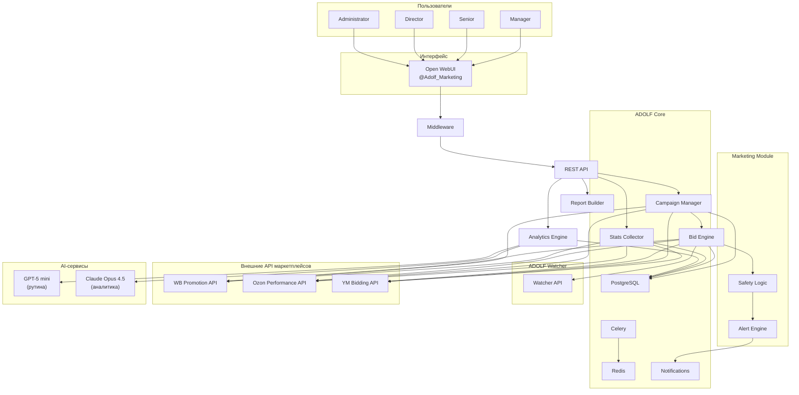
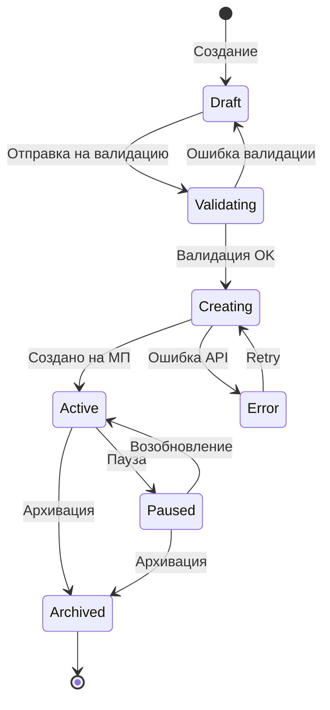
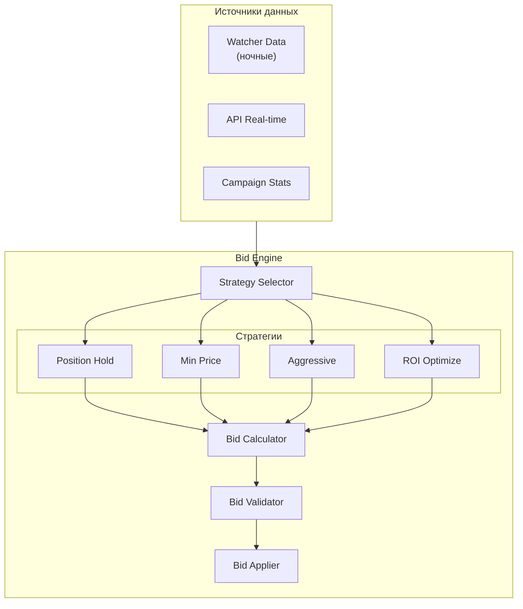
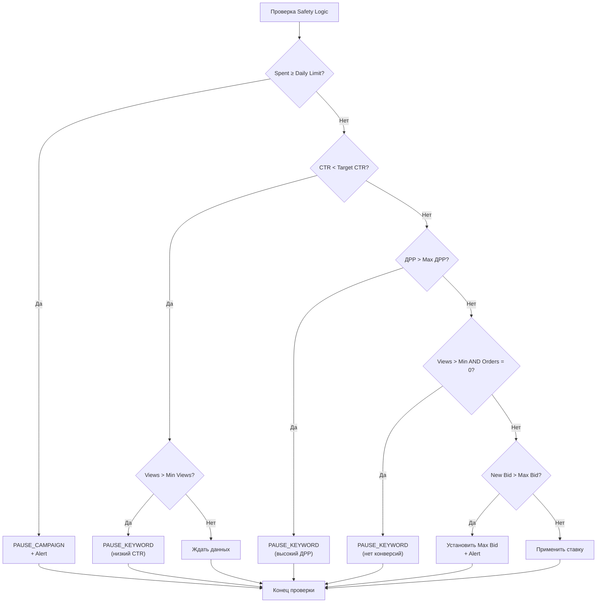
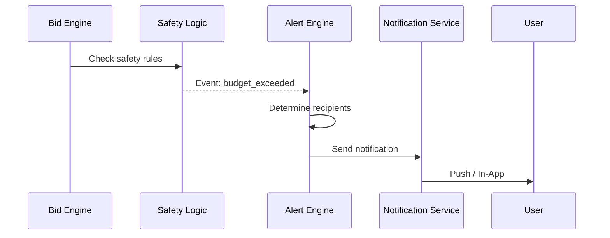
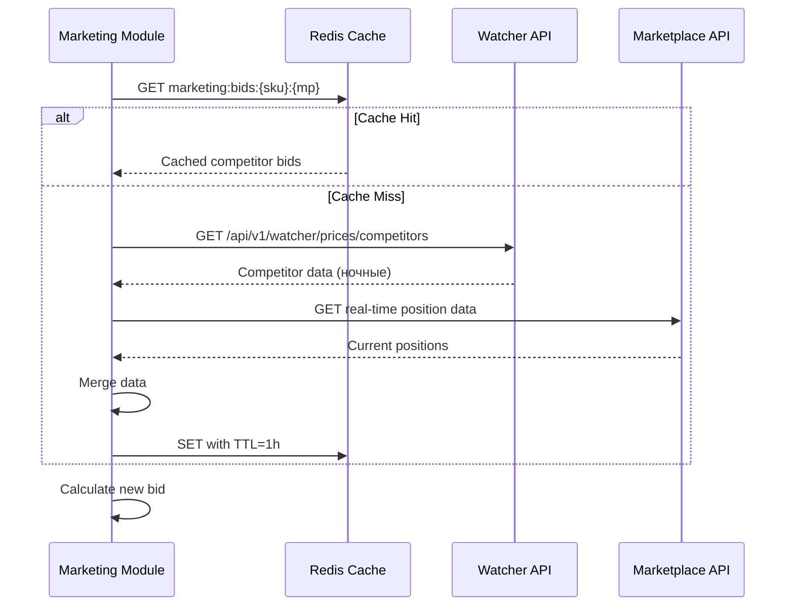
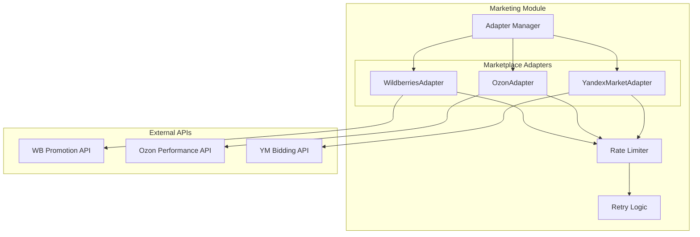

**Проект:** Автоматическое управление рекламными кампаниями  
**Модуль:** Marketing / Architecture  
**Версия:** 1.0  
**Дата:** Январь 2026

---

## 1.1 Обзор архитектуры

### Принципы проектирования

| Принцип | Описание |
|---------|----------|
| Periodic Execution | Цикл обработки каждые 15 минут |
| Strategy Pattern | Подключаемые стратегии биддинга |
| Hybrid Data | Данные Watcher + real-time API |
| Safety First | Автоматические ограничители расходов |
| Graceful Degradation | Сбой одного МП не влияет на другие |
| Audit Trail | Логирование всех изменений ставок |

### Общая схема



---

## 1.2 Компоненты модуля

### 1.2.1 REST API

**Назначение:** Точка входа для запросов из Open WebUI и внешних систем.

**Базовый путь:** `/api/v1/marketing`

**Группы endpoints:**

| Группа | Путь | Описание |
|--------|------|----------|
| Campaigns | `/campaigns` | CRUD рекламных кампаний |
| Keywords | `/keywords` | Управление ключевыми словами |
| Bids | `/bids` | Управление ставками |
| Stats | `/stats` | Статистика и метрики |
| Reports | `/reports` | Отчёты |
| Settings | `/settings` | Настройки модуля |

### 1.2.2 Campaign Manager

**Назначение:** Управление жизненным циклом рекламных кампаний.

**Функции:**

| Функция | Описание |
|---------|----------|
| Create | Создание кампании через API маркетплейса |
| Update | Изменение параметров кампании |
| Pause | Приостановка кампании |
| Resume | Возобновление кампании |
| Archive | Архивирование кампании |
| Sync | Синхронизация состояния с маркетплейсом |

**Workflow создания кампании:**



### 1.2.3 Bid Engine

**Назначение:** Расчёт и применение ставок согласно выбранной стратегии.

**Компоненты:**



**Стратегии биддинга:**

| Стратегия | Алгоритм | Параметры |
|-----------|----------|-----------|
| Position Hold | `new_bid = competitor_bid[target_pos] + bid_step` | target_position, bid_step |
| Min Price | `new_bid = min_bid_for_placement` | — |
| Aggressive | `new_bid = max(budget_allows, competitor_top + bid_step)` | daily_limit, bid_step |
| ROI Optimize | `new_bid = (avg_order_value × target_margin) / conversion_rate` | target_drr |

### 1.2.4 Safety Logic

**Назначение:** Защита от неэффективных расходов.

**Правила:**



**Параметры Safety Logic:**

| Параметр | Значение по умолчанию | Настраиваемый |
|----------|----------------------|---------------|
| Target CTR | 3% | ✅ (Admin) |
| Min Views | 1000 | ✅ (Admin) |
| Max ДРР | 15% | ✅ (Admin) |
| Budget Alert Threshold | 80% | ✅ (Admin) |

### 1.2.5 Stats Collector

**Назначение:** Сбор статистики рекламных кампаний с маркетплейсов.

**Собираемые метрики:**

| Метрика | Описание | Источник |
|---------|----------|----------|
| Views | Количество показов | API МП |
| Clicks | Количество кликов | API МП |
| CTR | Click-Through Rate | Расчёт |
| Spent | Расход | API МП |
| CPC | Cost Per Click | Расчёт |
| Orders | Количество заказов | API МП |
| CPO | Cost Per Order | Расчёт |
| Revenue | Выручка с рекламы | API МП |
| ДРР | Доля рекламных расходов | Расчёт |

**Периодичность сбора:**

| Тип данных | Периодичность |
|------------|---------------|
| Текущая статистика | Каждые 15 минут |
| Детальная статистика по ключам | Каждый час |
| Исторические данные | Ежедневно (ночью) |

### 1.2.6 Analytics Engine

**Назначение:** Анализ эффективности и генерация рекомендаций.

**Функции:**

| Функция | AI-модель | Описание |
|---------|-----------|----------|
| Trend Analysis | GPT-5 mini | Выявление трендов в статистике |
| Anomaly Detection | GPT-5 mini | Обнаружение аномалий расходов |
| Recommendations | Claude Opus 4.5 | Рекомендации по оптимизации |
| Forecasting | Claude Opus 4.5 | Прогноз расходов и эффективности |

### 1.2.7 Report Builder

**Назначение:** Формирование отчётов по рекламным кампаниям.

**Типы отчётов:**

| Отчёт | Периодичность | Формат |
|-------|---------------|--------|
| Daily Performance | Ежедневно | JSON / Markdown |
| Weekly Summary | Еженедельно | JSON / Markdown / Excel |
| Top Keywords | Еженедельно | JSON / Markdown |
| ДРР Dynamics | Еженедельно | JSON / Chart |
| AI Insights | По запросу | Markdown |

### 1.2.8 Alert Engine

**Назначение:** Генерация и отправка уведомлений о событиях.

**Интеграция с Notifications:**



---

## 1.3 Зависимости от ADOLF Core

### 1.3.1 Middleware

**Расширение Middleware:**

```
middleware/
├── routes/
│   └── marketing.py           # API endpoints
├── models/
│   └── marketing.py           # SQLAlchemy models
└── services/
    └── marketing/            
        ├── __init__.py
        ├── campaign_service.py
        ├── bid_service.py
        ├── stats_service.py
        └── analytics_service.py
```

**Функции Middleware для Marketing:**

| Функция | Описание |
|---------|----------|
| Авторизация | Проверка роли (Manager+) |
| Фильтрация по бренду | brand_id injection |
| Проксирование | Маршрутизация `/api/v1/marketing/*` |
| Аудит | Логирование всех действий |
| Rate Limiting | Защита от превышения лимитов API МП |

### 1.3.2 Celery Workers

**Задачи Marketing:**

| Задача | Очередь | Периодичность | Описание |
|--------|---------|---------------|----------|
| `marketing.collect_stats` | default | */15 минут | Сбор статистики РК |
| `marketing.run_bid_cycle` | default | */15 минут :07 | Цикл корректировки ставок |
| `marketing.check_budgets` | critical | */15 минут :03 | Проверка бюджетов |
| `marketing.sync_campaigns` | default | */30 минут | Синхронизация состояния РК |
| `marketing.generate_daily_report` | default | 08:00 ежедневно | Ежедневный отчёт |
| `marketing.generate_weekly_report` | default | Пн 09:00 | Еженедельный отчёт |
| `marketing.cleanup_old_stats` | heavy | 03:00 ежедневно | Агрегация старой статистики |
| `marketing.ai_analysis` | heavy | 07:00 ежедневно | AI-анализ и рекомендации |

**Смещение задач (offset):**

Для равномерной нагрузки задачи запускаются со смещением:
- `:00` — collect_stats (WB)
- `:03` — check_budgets
- `:05` — collect_stats (Ozon)
- `:07` — run_bid_cycle
- `:10` — collect_stats (YM)

### 1.3.3 PostgreSQL

**Новые таблицы:**

| Таблица | Назначение |
|---------|------------|
| `marketing_campaigns` | Рекламные кампании |
| `marketing_keywords` | Ключевые слова |
| `marketing_bids` | Текущие ставки |
| `marketing_bid_history` | История изменений ставок |
| `marketing_stats` | Статистика (детальная) |
| `marketing_stats_daily` | Агрегированная дневная статистика |
| `marketing_stats_monthly` | Агрегированная месячная статистика |
| `marketing_alerts` | История алертов |
| `marketing_settings` | Настройки модуля |
| `marketing_strategies` | Конфигурации стратегий |

**Используемые таблицы Core:**

| Таблица | Использование |
|---------|---------------|
| `users` | Роль, brand_id для фильтрации |
| `audit_log` | Запись действий пользователей |
| `notifications` | Создание уведомлений |
| `settings` | Глобальные настройки |

### 1.3.4 Redis

**Использование:**

| Применение | Ключ | TTL | Описание |
|------------|------|-----|----------|
| Celery Broker | — | — | Очередь задач |
| Rate Limiting | `marketing:rate:{mp}:{endpoint}` | 60s | Контроль частоты запросов к API МП |
| Cache Stats | `marketing:stats:{campaign_id}` | 15m | Кэш текущей статистики |
| Lock | `marketing:lock:bid_cycle` | 5m | Предотвращение параллельных циклов |
| Competitor Bids | `marketing:bids:{sku}:{mp}` | 1h | Кэш ставок конкурентов |

### 1.3.5 Notifications

**События Marketing:**

| Событие | event_type | Уровень | Получатели |
|---------|------------|---------|------------|
| Кампания приостановлена (бюджет) | `marketing.campaign_paused_budget` | warning | Manager, Senior |
| Ключ приостановлен (CTR) | `marketing.keyword_paused_ctr` | info | Manager |
| Ключ приостановлен (ДРР) | `marketing.keyword_paused_drr` | warning | Manager, Senior |
| Ставка ограничена Max Bid | `marketing.bid_capped` | warning | Manager, Senior |
| Ошибка API МП | `marketing.api_error` | critical | Administrator |
| Бюджет 80% | `marketing.budget_warning` | info | Manager |
| Аномальный рост расходов | `marketing.spending_anomaly` | warning | Senior, Director |
| Дневной отчёт готов | `marketing.daily_report_ready` | info | Manager, Senior |
| Еженедельный отчёт готов | `marketing.weekly_report_ready` | info | Senior, Director |

---

## 1.4 Интеграция с ADOLF Watcher

### 1.4.1 Получение данных о конкурентах



### 1.4.2 API Watcher для Marketing

| Endpoint | Метод | Описание |
|----------|-------|----------|
| `/api/v1/watcher/prices/competitors` | GET | Цены и ставки конкурентов |
| `/api/v1/watcher/positions/{sku}` | GET | Позиции SKU в выдаче |

**Параметры запроса:**

| Параметр | Тип | Описание |
|----------|-----|----------|
| `sku` | string | Артикул товара |
| `marketplace` | string | wb / ozon / ym |
| `include_bids` | bool | Включить данные о ставках |

**Пример ответа:**

```json
{
  "sku": "OM-12345",
  "marketplace": "wildberries",
  "competitors": [
    {
      "seller": "Fashion Store",
      "position": 1,
      "price": 2599,
      "estimated_bid": 150
    },
    {
      "seller": "Style Shop", 
      "position": 2,
      "price": 2499,
      "estimated_bid": 120
    }
  ],
  "our_position": 5,
  "our_price": 2450,
  "data_freshness": "2026-01-15T03:00:00Z"
}
```

---

## 1.5 Интеграция с маркетплейсами

### 1.5.1 Общая схема адаптеров



### 1.5.2 Унифицированный интерфейс адаптера

```python
from abc import ABC, abstractmethod
from typing import List, Optional
from dataclasses import dataclass

@dataclass
class Campaign:
    id: str
    external_id: str
    marketplace: str
    name: str
    status: str  # active, paused, archived
    campaign_type: str
    daily_budget: float
    total_budget: Optional[float]
    start_date: datetime
    end_date: Optional[datetime]
    brand_id: str

@dataclass
class Keyword:
    id: str
    campaign_id: str
    keyword: str
    match_type: str  # exact, phrase, broad
    status: str
    current_bid: float
    
@dataclass
class CampaignStats:
    campaign_id: str
    date: date
    views: int
    clicks: int
    ctr: float
    spent: float
    cpc: float
    orders: int
    revenue: float
    drr: float

class MarketplaceAdapter(ABC):
    """Базовый класс адаптера маркетплейса."""
    
    @abstractmethod
    async def get_campaigns(self, brand_id: str) -> List[Campaign]:
        """Получить список кампаний."""
        pass
    
    @abstractmethod
    async def create_campaign(self, campaign: Campaign) -> str:
        """Создать кампанию, вернуть external_id."""
        pass
    
    @abstractmethod
    async def update_campaign(self, campaign: Campaign) -> bool:
        """Обновить кампанию."""
        pass
    
    @abstractmethod
    async def pause_campaign(self, external_id: str) -> bool:
        """Приостановить кампанию."""
        pass
    
    @abstractmethod
    async def resume_campaign(self, external_id: str) -> bool:
        """Возобновить кампанию."""
        pass
    
    @abstractmethod
    async def get_keywords(self, campaign_id: str) -> List[Keyword]:
        """Получить ключевые слова кампании."""
        pass
    
    @abstractmethod
    async def add_keywords(self, campaign_id: str, keywords: List[Keyword]) -> bool:
        """Добавить ключевые слова."""
        pass
    
    @abstractmethod
    async def update_bid(self, keyword_id: str, new_bid: float) -> bool:
        """Обновить ставку."""
        pass
    
    @abstractmethod
    async def pause_keyword(self, keyword_id: str) -> bool:
        """Приостановить ключевое слово."""
        pass
    
    @abstractmethod
    async def get_stats(
        self, 
        campaign_id: str, 
        date_from: date, 
        date_to: date
    ) -> List[CampaignStats]:
        """Получить статистику кампании."""
        pass
    
    @abstractmethod
    async def get_realtime_position(self, sku: str, keyword: str) -> Optional[int]:
        """Получить текущую позицию (real-time)."""
        pass
```

### 1.5.3 Rate Limiting

**Конфигурация лимитов:**

| Маркетплейс | Requests/min | Strategy |
|-------------|--------------|----------|
| Wildberries | 100 | Token Bucket |
| Ozon | 60 | Token Bucket |
| Яндекс.Маркет | 30 | Token Bucket |

> **Примечание:** Указаны ориентировочные значения. Требуется уточнение по актуальной документации API.

**Реализация:**

```python
import asyncio
from datetime import datetime, timedelta

class RateLimiter:
    """Token Bucket Rate Limiter."""
    
    def __init__(self, rate: int, per: int = 60):
        self.rate = rate  # tokens per period
        self.per = per    # period in seconds
        self.tokens = rate
        self.last_update = datetime.now()
        self._lock = asyncio.Lock()
    
    async def acquire(self):
        """Acquire a token, wait if necessary."""
        async with self._lock:
            now = datetime.now()
            elapsed = (now - self.last_update).total_seconds()
            
            # Replenish tokens
            self.tokens = min(
                self.rate,
                self.tokens + elapsed * (self.rate / self.per)
            )
            self.last_update = now
            
            if self.tokens < 1:
                wait_time = (1 - self.tokens) * (self.per / self.rate)
                await asyncio.sleep(wait_time)
                self.tokens = 0
            else:
                self.tokens -= 1
```

### 1.5.4 Retry Logic

**Стратегия повторных попыток:**

| Код ошибки | Действие | Max Retries | Backoff |
|------------|----------|-------------|---------|
| 429 (Rate Limit) | Exponential backoff | 5 | 2^n × 10s |
| 500-503 (Server) | Retry | 3 | 30s fixed |
| 400 (Bad Request) | Log, skip | 0 | — |
| 401/403 (Auth) | Alert, stop | 0 | — |
| Timeout | Retry | 3 | 15s fixed |

```python
import asyncio
from functools import wraps

def with_retry(max_retries: int = 3, backoff_base: float = 2.0):
    """Декоратор для retry с exponential backoff."""
    
    def decorator(func):
        @wraps(func)
        async def wrapper(*args, **kwargs):
            last_exception = None
            
            for attempt in range(max_retries + 1):
                try:
                    return await func(*args, **kwargs)
                except RateLimitError:
                    wait = (backoff_base ** attempt) * 10
                    await asyncio.sleep(wait)
                    last_exception = e
                except ServerError:
                    await asyncio.sleep(30)
                    last_exception = e
                except (AuthError, BadRequestError):
                    raise  # Don't retry
                    
            raise last_exception
        return wrapper
    return decorator
```

---

## 1.6 Структура файлов модуля

```
middleware/
├── routes/
│   └── marketing.py               # FastAPI routes
├── models/
│   └── marketing.py               # SQLAlchemy models
├── schemas/
│   └── marketing.py               # Pydantic schemas
└── services/
    └── marketing/
        ├── __init__.py
        ├── campaign_service.py    # Campaign CRUD
        ├── bid_service.py         # Bid Engine
        ├── stats_service.py       # Stats Collector
        ├── analytics_service.py   # Analytics Engine
        ├── safety_service.py      # Safety Logic
        ├── report_service.py      # Report Builder
        └── adapters/
            ├── __init__.py
            ├── base.py            # Abstract adapter
            ├── wildberries.py     # WB adapter
            ├── ozon.py            # Ozon adapter
            └── yandex_market.py   # YM adapter

tasks/
└── marketing_tasks.py             # Celery tasks

pipelines/
└── marketing_pipeline.py          # Open WebUI Pipeline

tools/
├── marketing_campaigns.py         # Campaign management tool
├── marketing_stats.py             # Stats tool
├── marketing_bids.py              # Bid management tool
└── marketing_reports.py           # Reports tool
```

---

## 1.7 Конфигурация модуля

### 1.7.1 Environment Variables

| Переменная | Описание | Пример |
|------------|----------|--------|
| `WB_PROMO_API_KEY` | API-ключ WB Promotion | `xxx...` |
| `OZON_PERF_CLIENT_ID` | Client ID Ozon Performance | `123456` |
| `OZON_PERF_API_KEY` | API-ключ Ozon Performance | `xxx...` |
| `YM_OAUTH_TOKEN` | OAuth-токен Яндекс.Маркет | `xxx...` |
| `YM_CAMPAIGN_ID` | ID кампании Яндекс.Маркет | `789012` |
| `MARKETING_BID_CYCLE_INTERVAL` | Интервал цикла (минуты) | `15` |
| `MARKETING_DEFAULT_MAX_BID` | Max Bid по умолчанию | `500` |
| `MARKETING_DEFAULT_TARGET_CTR` | Target CTR по умолчанию | `3.0` |
| `MARKETING_DEFAULT_MAX_DRR` | Max ДРР по умолчанию | `15.0` |

### 1.7.2 Настройки в БД (marketing_settings)

| Ключ | Тип | Описание |
|------|-----|----------|
| `default_strategy` | string | Стратегия по умолчанию |
| `target_ctr` | float | Целевой CTR |
| `min_views_threshold` | int | Минимум показов |
| `max_drr` | float | Максимальный ДРР |
| `budget_alert_threshold` | float | Порог алерта бюджета (%) |
| `rate_limits` | json | Лимиты API по маркетплейсам |

---

## 1.8 Мониторинг и метрики

### 1.8.1 Health Checks

| Проверка | Интервал | Критичность |
|----------|----------|-------------|
| WB API доступность | 5 мин | High |
| Ozon API доступность | 5 мин | High |
| YM API доступность | 5 мин | High |
| Watcher API доступность | 5 мин | Medium |
| Celery workers | 1 мин | High |
| Redis | 1 мин | High |

### 1.8.2 Prometheus Metrics

| Метрика | Тип | Описание |
|---------|-----|----------|
| `marketing_bid_changes_total` | Counter | Количество изменений ставок |
| `marketing_api_requests_total` | Counter | Запросы к API МП |
| `marketing_api_errors_total` | Counter | Ошибки API МП |
| `marketing_bid_cycle_duration_seconds` | Histogram | Длительность цикла |
| `marketing_active_campaigns` | Gauge | Активные кампании |
| `marketing_daily_spend` | Gauge | Дневной расход |

---

## 1.9 Безопасность

### 1.9.1 Хранение credentials

| Секрет | Хранение | Доступ |
|--------|----------|--------|
| API-ключи МП | Environment variables | Только Celery workers |
| OAuth токены | Environment variables | Только Celery workers |
| Session tokens | Redis (encrypted) | TTL 1 час |

### 1.9.2 Аудит действий

Все действия логируются в `audit_log`:

| Действие | Данные |
|----------|--------|
| Создание кампании | campaign_id, user_id, params |
| Изменение ставки | keyword_id, old_bid, new_bid, reason |
| Пауза кампании | campaign_id, reason (manual/auto) |
| Изменение настроек | setting_key, old_value, new_value |

---

**Документ подготовлен:** Январь 2026  
**Версия:** 1.0  
**Статус:** Черновик
