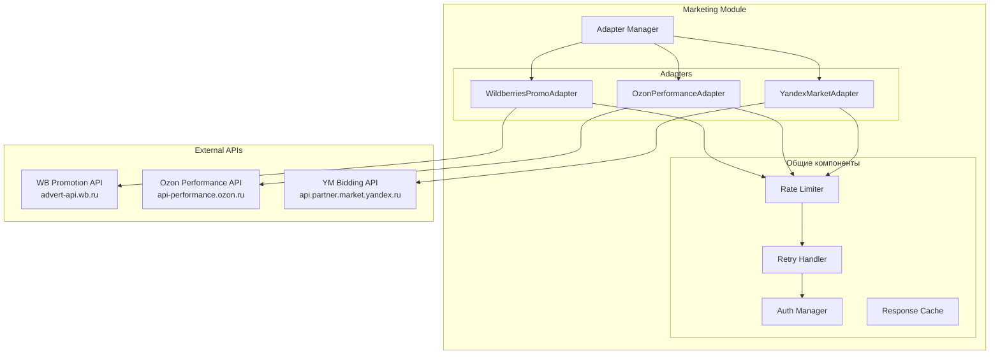

**Проект:** Автоматическое управление рекламными кампаниями  
**Модуль:** Marketing / Marketplace Adapters  
**Версия:** 1.0  
**Дата:** Январь 2026

---

## 2.1 Обзор

### Назначение

Marketplace Adapters — компоненты модуля Marketing, обеспечивающие взаимодействие с рекламными API маркетплейсов. Каждый адаптер реализует унифицированный интерфейс и инкапсулирует специфику работы с конкретным API.

### Поддерживаемые маркетплейсы

| Маркетплейс | API | Типы рекламы |
|-------------|-----|--------------|
| Wildberries | Promotion API | Аукцион, Автоматическая, Каталог |
| Ozon | Performance API | Трафареты, Поиск, Брендовая полка |
| Яндекс.Маркет | Bidding API | Буст продаж, Рекомендации |

### Архитектура адаптеров



---

## 2.2 Унифицированный интерфейс

### 2.2.1 Базовый класс адаптера

```python
# services/marketing/adapters/base.py

from abc import ABC, abstractmethod
from typing import List, Optional, Dict, Any
from dataclasses import dataclass
from datetime import date, datetime
from enum import Enum


class CampaignType(Enum):
    """Типы рекламных кампаний."""
    # Wildberries
    WB_AUCTION = "wb_auction"           # Аукцион (поиск)
    WB_AUTO = "wb_auto"                 # Автоматическая
    WB_CATALOG = "wb_catalog"           # Каталог
    
    # Ozon
    OZON_TRAFARETS = "ozon_trafarets"   # Трафареты
    OZON_SEARCH = "ozon_search"         # Продвижение в поиске
    OZON_BRAND_SHELF = "ozon_brand"     # Брендовая полка
    
    # Яндекс.Маркет
    YM_BOOST = "ym_boost"               # Буст продаж
    YM_RECOMMENDATIONS = "ym_reco"      # Рекомендации


class CampaignStatus(Enum):
    """Статусы кампании."""
    DRAFT = "draft"
    ACTIVE = "active"
    PAUSED = "paused"
    ARCHIVED = "archived"
    ERROR = "error"


class KeywordStatus(Enum):
    """Статусы ключевого слова."""
    ACTIVE = "active"
    PAUSED = "paused"
    REJECTED = "rejected"


class MatchType(Enum):
    """Типы соответствия ключевых слов."""
    EXACT = "exact"
    PHRASE = "phrase"
    BROAD = "broad"


@dataclass
class Campaign:
    """Унифицированная модель рекламной кампании."""
    id: Optional[str] = None           # Внутренний ID
    external_id: Optional[str] = None  # ID на маркетплейсе
    marketplace: str = ""              # wb, ozon, ym
    campaign_type: CampaignType = None
    name: str = ""
    status: CampaignStatus = CampaignStatus.DRAFT
    
    # Бюджеты
    daily_budget: float = 0.0
    total_budget: Optional[float] = None
    spent_today: float = 0.0
    spent_total: float = 0.0
    
    # Даты
    start_date: Optional[date] = None
    end_date: Optional[date] = None
    created_at: Optional[datetime] = None
    updated_at: Optional[datetime] = None
    
    # Бренд и SKU
    brand_id: str = ""
    sku_list: List[str] = None
    
    # Настройки стратегии
    strategy: Optional[str] = None
    target_position: Optional[int] = None
    max_bid: Optional[float] = None
    bid_step: Optional[float] = None
    target_drr: Optional[float] = None
    
    # Дополнительные параметры (специфичные для МП)
    extra: Dict[str, Any] = None


@dataclass
class Keyword:
    """Унифицированная модель ключевого слова."""
    id: Optional[str] = None
    external_id: Optional[str] = None
    campaign_id: str = ""
    keyword: str = ""
    match_type: MatchType = MatchType.PHRASE
    status: KeywordStatus = KeywordStatus.ACTIVE
    
    # Ставки
    current_bid: float = 0.0
    recommended_bid: Optional[float] = None
    min_bid: Optional[float] = None
    max_bid: Optional[float] = None
    
    # Статистика (последняя)
    views: int = 0
    clicks: int = 0
    ctr: float = 0.0
    orders: int = 0
    spent: float = 0.0
    
    # Мета
    created_at: Optional[datetime] = None
    updated_at: Optional[datetime] = None


@dataclass
class CampaignStats:
    """Статистика рекламной кампании."""
    campaign_id: str
    date: date
    
    # Основные метрики
    views: int = 0
    clicks: int = 0
    ctr: float = 0.0
    spent: float = 0.0
    cpc: float = 0.0
    
    # Конверсии
    orders: int = 0
    revenue: float = 0.0
    cpo: float = 0.0
    drr: float = 0.0
    
    # Позиции (средние)
    avg_position: Optional[float] = None


@dataclass 
class KeywordStats:
    """Статистика ключевого слова."""
    keyword_id: str
    campaign_id: str
    date: date
    
    views: int = 0
    clicks: int = 0
    ctr: float = 0.0
    spent: float = 0.0
    cpc: float = 0.0
    orders: int = 0
    revenue: float = 0.0
    position: Optional[int] = None


@dataclass
class BidUpdate:
    """Результат обновления ставки."""
    keyword_id: str
    old_bid: float
    new_bid: float
    success: bool
    error: Optional[str] = None


class MarketplacePromoAdapter(ABC):
    """Базовый класс адаптера рекламного API маркетплейса."""
    
    marketplace: str = ""
    
    # === Кампании ===
    
    @abstractmethod
    async def get_campaigns(
        self, 
        brand_id: Optional[str] = None,
        status: Optional[CampaignStatus] = None
    ) -> List[Campaign]:
        """Получить список кампаний."""
        pass
    
    @abstractmethod
    async def get_campaign(self, external_id: str) -> Optional[Campaign]:
        """Получить кампанию по ID."""
        pass
    
    @abstractmethod
    async def create_campaign(self, campaign: Campaign) -> Campaign:
        """Создать кампанию."""
        pass
    
    @abstractmethod
    async def update_campaign(self, campaign: Campaign) -> bool:
        """Обновить кампанию."""
        pass
    
    @abstractmethod
    async def pause_campaign(self, external_id: str) -> bool:
        """Приостановить кампанию."""
        pass
    
    @abstractmethod
    async def resume_campaign(self, external_id: str) -> bool:
        """Возобновить кампанию."""
        pass
    
    @abstractmethod
    async def archive_campaign(self, external_id: str) -> bool:
        """Архивировать кампанию."""
        pass
    
    # === Ключевые слова ===
    
    @abstractmethod
    async def get_keywords(self, campaign_external_id: str) -> List[Keyword]:
        """Получить ключевые слова кампании."""
        pass
    
    @abstractmethod
    async def add_keywords(
        self, 
        campaign_external_id: str, 
        keywords: List[Keyword]
    ) -> List[Keyword]:
        """Добавить ключевые слова."""
        pass
    
    @abstractmethod
    async def remove_keywords(
        self, 
        campaign_external_id: str, 
        keyword_ids: List[str]
    ) -> bool:
        """Удалить ключевые слова."""
        pass
    
    @abstractmethod
    async def pause_keyword(self, keyword_external_id: str) -> bool:
        """Приостановить ключевое слово."""
        pass
    
    @abstractmethod
    async def resume_keyword(self, keyword_external_id: str) -> bool:
        """Возобновить ключевое слово."""
        pass
    
    # === Ставки ===
    
    @abstractmethod
    async def update_bid(
        self, 
        keyword_external_id: str, 
        new_bid: float
    ) -> BidUpdate:
        """Обновить ставку для ключевого слова."""
        pass
    
    @abstractmethod
    async def update_bids_batch(
        self, 
        updates: Dict[str, float]
    ) -> List[BidUpdate]:
        """Пакетное обновление ставок."""
        pass
    
    @abstractmethod
    async def get_recommended_bids(
        self, 
        keyword_ids: List[str]
    ) -> Dict[str, float]:
        """Получить рекомендуемые ставки."""
        pass
    
    # === Статистика ===
    
    @abstractmethod
    async def get_campaign_stats(
        self,
        campaign_external_id: str,
        date_from: date,
        date_to: date
    ) -> List[CampaignStats]:
        """Получить статистику кампании."""
        pass
    
    @abstractmethod
    async def get_keywords_stats(
        self,
        campaign_external_id: str,
        date_from: date,
        date_to: date
    ) -> List[KeywordStats]:
        """Получить статистику по ключевым словам."""
        pass
    
    # === Позиции (real-time) ===
    
    @abstractmethod
    async def get_current_position(
        self, 
        sku: str, 
        keyword: str
    ) -> Optional[int]:
        """Получить текущую позицию товара по ключевому слову."""
        pass
    
    # === Вспомогательные ===
    
    @abstractmethod
    async def validate_campaign(self, campaign: Campaign) -> List[str]:
        """Валидация кампании перед созданием. Возвращает список ошибок."""
        pass
    
    @abstractmethod
    async def get_available_campaign_types(self) -> List[CampaignType]:
        """Получить доступные типы кампаний."""
        pass
```

### 2.2.2 Adapter Manager

```python
# services/marketing/adapters/manager.py

from typing import Dict, Optional
from .base import MarketplacePromoAdapter
from .wildberries import WildberriesPromoAdapter
from .ozon import OzonPerformanceAdapter
from .yandex_market import YandexMarketAdapter


class AdapterManager:
    """Менеджер адаптеров маркетплейсов."""
    
    def __init__(self):
        self._adapters: Dict[str, MarketplacePromoAdapter] = {}
        self._initialize_adapters()
    
    def _initialize_adapters(self):
        """Инициализация адаптеров."""
        self._adapters = {
            "wb": WildberriesPromoAdapter(),
            "ozon": OzonPerformanceAdapter(),
            "ym": YandexMarketAdapter(),
        }
    
    def get_adapter(self, marketplace: str) -> Optional[MarketplacePromoAdapter]:
        """Получить адаптер по коду маркетплейса."""
        return self._adapters.get(marketplace)
    
    def get_all_adapters(self) -> Dict[str, MarketplacePromoAdapter]:
        """Получить все адаптеры."""
        return self._adapters
    
    async def health_check(self) -> Dict[str, bool]:
        """Проверка доступности API всех маркетплейсов."""
        results = {}
        for mp, adapter in self._adapters.items():
            try:
                # Простой запрос для проверки
                await adapter.get_campaigns(status=None)
                results[mp] = True
            except Exception:
                results[mp] = False
        return results
```

---

## 2.3 Wildberries Promotion API

### 2.3.1 Общая информация

| Параметр | Значение |
|----------|----------|
| Base URL | `https://advert-api.wb.ru` |
| Авторизация | Header `Authorization: {API_KEY}` |
| Формат | JSON |
| Rate Limit | ~100 req/min (уточнить по документации) |

### 2.3.2 Типы рекламных кампаний

| Тип | type в API | Описание |
|-----|-----------|----------|
| Аукцион | 8 | Поисковая реклама (ставки за ключи) |
| Автоматическая | 9 | Автоматическое продвижение |
| Каталог | 6 | Реклама в каталоге категорий |

### 2.3.3 Endpoints

#### Управление кампаниями

| Endpoint | Метод | Описание |
|----------|-------|----------|
| `/adv/v1/promotion/count` | GET | Количество кампаний по статусам |
| `/adv/v1/promotion/adverts` | POST | Список кампаний (с фильтрами) |
| `/adv/v1/promotion/advert` | GET | Детали кампании |
| `/adv/v1/promotion/create` | POST | Создание кампании |
| `/adv/v1/promotion/update` | PUT | Обновление кампании |
| `/adv/v1/promotion/start` | POST | Запуск кампании |
| `/adv/v1/promotion/pause` | POST | Пауза кампании |

#### Ключевые слова (для Аукциона)

| Endpoint | Метод | Описание |
|----------|-------|----------|
| `/adv/v1/search/keywords` | GET | Список ключевых слов |
| `/adv/v1/search/set-keyword` | POST | Добавить/изменить ключ |
| `/adv/v1/search/delete-keyword` | POST | Удалить ключ |
| `/adv/v1/search/set-keyword-bid` | POST | Установить ставку |

#### Статистика

| Endpoint | Метод | Описание |
|----------|-------|----------|
| `/adv/v2/fullstat` | GET | Полная статистика кампании |
| `/adv/v2/stat/words` | GET | Статистика по ключевым словам |
| `/adv/v2/stat/dates` | GET | Статистика по дням |

#### Ставки

| Endpoint | Метод | Описание |
|----------|-------|----------|
| `/adv/v1/search/bid` | GET | Текущие ставки |
| `/adv/v1/search/set-bid` | POST | Установить ставку |

### 2.3.4 Примеры запросов

**Получение списка кампаний:**

```http
POST /adv/v1/promotion/adverts HTTP/1.1
Host: advert-api.wb.ru
Authorization: {API_KEY}
Content-Type: application/json

{
  "status": [9],
  "type": [8],
  "limit": 100,
  "offset": 0
}
```

**Ответ:**

```json
{
  "adverts": [
    {
      "advertId": 12345678,
      "type": 8,
      "status": 9,
      "dailyBudget": 5000,
      "name": "Платья летние",
      "createTime": "2026-01-10T10:00:00Z",
      "changeTime": "2026-01-15T14:30:00Z",
      "startTime": "2026-01-10T10:00:00Z",
      "endTime": null,
      "params": [
        {
          "intervals": [...],
          "nms": [123456, 234567],
          "subjectId": 1000
        }
      ]
    }
  ],
  "total": 15
}
```

**Установка ставки:**

```http
POST /adv/v1/search/set-bid HTTP/1.1
Host: advert-api.wb.ru
Authorization: {API_KEY}
Content-Type: application/json

{
  "advertId": 12345678,
  "keyword": "летнее платье",
  "bid": 150
}
```

### 2.3.5 Маппинг полей

| WB API | Унифицированная модель |
|--------|------------------------|
| `advertId` | `external_id` |
| `type` | `campaign_type` (маппинг через Enum) |
| `status` | `status` (маппинг: 9=active, 11=paused, etc.) |
| `dailyBudget` | `daily_budget` |
| `name` | `name` |
| `createTime` | `created_at` |
| `params[].nms` | `sku_list` |

### 2.3.6 Реализация адаптера

```python
# services/marketing/adapters/wildberries.py

import httpx
from typing import List, Optional, Dict
from datetime import date, datetime
from .base import (
    MarketplacePromoAdapter, Campaign, Keyword, CampaignStats,
    KeywordStats, BidUpdate, CampaignType, CampaignStatus,
    KeywordStatus, MatchType
)
from core.config import settings
from core.rate_limiter import RateLimiter


class WildberriesPromoAdapter(MarketplacePromoAdapter):
    """Адаптер Wildberries Promotion API."""
    
    marketplace = "wb"
    BASE_URL = "https://advert-api.wb.ru"
    
    # Маппинг типов кампаний
    TYPE_MAP = {
        8: CampaignType.WB_AUCTION,
        9: CampaignType.WB_AUTO,
        6: CampaignType.WB_CATALOG,
    }
    TYPE_MAP_REVERSE = {v: k for k, v in TYPE_MAP.items()}
    
    # Маппинг статусов
    STATUS_MAP = {
        4: CampaignStatus.DRAFT,      # Готова к запуску
        7: CampaignStatus.ARCHIVED,   # Завершена
        9: CampaignStatus.ACTIVE,     # Активна
        11: CampaignStatus.PAUSED,    # Приостановлена
    }
    STATUS_MAP_REVERSE = {v: k for k, v in STATUS_MAP.items()}
    
    def __init__(self):
        self.api_key = settings.WB_PROMO_API_KEY
        self.rate_limiter = RateLimiter(rate=100, per=60)
        self.client = httpx.AsyncClient(
            base_url=self.BASE_URL,
            headers={"Authorization": self.api_key},
            timeout=30.0
        )
    
    async def _request(
        self, 
        method: str, 
        endpoint: str, 
        **kwargs
    ) -> Dict:
        """Выполнить запрос с rate limiting."""
        await self.rate_limiter.acquire()
        
        response = await self.client.request(method, endpoint, **kwargs)
        response.raise_for_status()
        
        return response.json() if response.content else {}
    
    # === Кампании ===
    
    async def get_campaigns(
        self,
        brand_id: Optional[str] = None,
        status: Optional[CampaignStatus] = None
    ) -> List[Campaign]:
        """Получить список кампаний."""
        
        payload = {
            "limit": 100,
            "offset": 0
        }
        
        if status:
            wb_status = self.STATUS_MAP_REVERSE.get(status)
            if wb_status:
                payload["status"] = [wb_status]
        
        data = await self._request("POST", "/adv/v1/promotion/adverts", json=payload)
        
        campaigns = []
        for adv in data.get("adverts", []):
            campaign = self._parse_campaign(adv)
            # Фильтрация по бренду (на стороне клиента, если нужно)
            if brand_id is None or campaign.brand_id == brand_id:
                campaigns.append(campaign)
        
        return campaigns
    
    async def get_campaign(self, external_id: str) -> Optional[Campaign]:
        """Получить кампанию по ID."""
        try:
            data = await self._request(
                "GET", 
                "/adv/v1/promotion/advert",
                params={"id": external_id}
            )
            return self._parse_campaign(data) if data else None
        except httpx.HTTPStatusError as e:
            if e.response.status_code == 404:
                return None
            raise
    
    async def create_campaign(self, campaign: Campaign) -> Campaign:
        """Создать кампанию."""
        
        # Валидация
        errors = await self.validate_campaign(campaign)
        if errors:
            raise ValueError(f"Validation failed: {errors}")
        
        wb_type = self.TYPE_MAP_REVERSE.get(campaign.campaign_type)
        
        payload = {
            "type": wb_type,
            "name": campaign.name,
            "dailyBudget": int(campaign.daily_budget),
            "nms": [int(sku) for sku in campaign.sku_list],
        }
        
        if campaign.end_date:
            payload["endTime"] = campaign.end_date.isoformat()
        
        data = await self._request("POST", "/adv/v1/promotion/create", json=payload)
        
        campaign.external_id = str(data.get("advertId"))
        campaign.status = CampaignStatus.DRAFT
        campaign.created_at = datetime.utcnow()
        
        return campaign
    
    async def update_campaign(self, campaign: Campaign) -> bool:
        """Обновить кампанию."""
        
        payload = {
            "advertId": int(campaign.external_id),
            "name": campaign.name,
            "dailyBudget": int(campaign.daily_budget),
        }
        
        await self._request("PUT", "/adv/v1/promotion/update", json=payload)
        return True
    
    async def pause_campaign(self, external_id: str) -> bool:
        """Приостановить кампанию."""
        await self._request(
            "POST",
            "/adv/v1/promotion/pause",
            json={"advertId": int(external_id)}
        )
        return True
    
    async def resume_campaign(self, external_id: str) -> bool:
        """Возобновить кампанию."""
        await self._request(
            "POST",
            "/adv/v1/promotion/start",
            json={"advertId": int(external_id)}
        )
        return True
    
    async def archive_campaign(self, external_id: str) -> bool:
        """Архивировать кампанию (для WB - пауза + удаление)."""
        # WB не имеет явного архивирования
        return await self.pause_campaign(external_id)
    
    # === Ключевые слова ===
    
    async def get_keywords(self, campaign_external_id: str) -> List[Keyword]:
        """Получить ключевые слова кампании."""
        
        data = await self._request(
            "GET",
            "/adv/v1/search/keywords",
            params={"advertId": campaign_external_id}
        )
        
        keywords = []
        for kw in data.get("keywords", []):
            keywords.append(Keyword(
                external_id=kw.get("id"),
                campaign_id=campaign_external_id,
                keyword=kw.get("keyword", ""),
                match_type=MatchType.PHRASE,  # WB не различает типы
                status=KeywordStatus.ACTIVE if kw.get("status") == 1 else KeywordStatus.PAUSED,
                current_bid=float(kw.get("bid", 0)),
                views=kw.get("views", 0),
                clicks=kw.get("clicks", 0),
                ctr=kw.get("ctr", 0.0),
            ))
        
        return keywords
    
    async def add_keywords(
        self,
        campaign_external_id: str,
        keywords: List[Keyword]
    ) -> List[Keyword]:
        """Добавить ключевые слова."""
        
        for kw in keywords:
            await self._request(
                "POST",
                "/adv/v1/search/set-keyword",
                json={
                    "advertId": int(campaign_external_id),
                    "keyword": kw.keyword,
                    "bid": int(kw.current_bid) if kw.current_bid else 50
                }
            )
            kw.campaign_id = campaign_external_id
        
        return keywords
    
    async def remove_keywords(
        self,
        campaign_external_id: str,
        keyword_ids: List[str]
    ) -> bool:
        """Удалить ключевые слова."""
        
        for kw_id in keyword_ids:
            await self._request(
                "POST",
                "/adv/v1/search/delete-keyword",
                json={
                    "advertId": int(campaign_external_id),
                    "keywordId": int(kw_id)
                }
            )
        
        return True
    
    async def pause_keyword(self, keyword_external_id: str) -> bool:
        """Приостановить ключевое слово."""
        # WB: установить ставку 0 = пауза
        await self._request(
            "POST",
            "/adv/v1/search/set-keyword-bid",
            json={"keywordId": int(keyword_external_id), "bid": 0}
        )
        return True
    
    async def resume_keyword(self, keyword_external_id: str) -> bool:
        """Возобновить ключевое слово (требуется новая ставка)."""
        # Нужна ставка для возобновления
        raise NotImplementedError("Use update_bid to resume keyword")
    
    # === Ставки ===
    
    async def update_bid(
        self,
        keyword_external_id: str,
        new_bid: float
    ) -> BidUpdate:
        """Обновить ставку."""
        
        # Получить текущую ставку для логирования
        old_bid = 0.0  # TODO: получить из кэша или API
        
        try:
            await self._request(
                "POST",
                "/adv/v1/search/set-bid",
                json={
                    "keywordId": int(keyword_external_id),
                    "bid": int(new_bid)
                }
            )
            return BidUpdate(
                keyword_id=keyword_external_id,
                old_bid=old_bid,
                new_bid=new_bid,
                success=True
            )
        except Exception as e:
            return BidUpdate(
                keyword_id=keyword_external_id,
                old_bid=old_bid,
                new_bid=new_bid,
                success=False,
                error=str(e)
            )
    
    async def update_bids_batch(
        self,
        updates: Dict[str, float]
    ) -> List[BidUpdate]:
        """Пакетное обновление ставок."""
        results = []
        for keyword_id, new_bid in updates.items():
            result = await self.update_bid(keyword_id, new_bid)
            results.append(result)
        return results
    
    async def get_recommended_bids(
        self,
        keyword_ids: List[str]
    ) -> Dict[str, float]:
        """Получить рекомендуемые ставки."""
        # WB не предоставляет рекомендации напрямую
        # Используем данные Watcher
        return {}
    
    # === Статистика ===
    
    async def get_campaign_stats(
        self,
        campaign_external_id: str,
        date_from: date,
        date_to: date
    ) -> List[CampaignStats]:
        """Получить статистику кампании."""
        
        data = await self._request(
            "GET",
            "/adv/v2/stat/dates",
            params={
                "advertId": campaign_external_id,
                "dateFrom": date_from.isoformat(),
                "dateTo": date_to.isoformat()
            }
        )
        
        stats = []
        for day in data.get("dates", []):
            stats.append(CampaignStats(
                campaign_id=campaign_external_id,
                date=date.fromisoformat(day["date"]),
                views=day.get("views", 0),
                clicks=day.get("clicks", 0),
                ctr=day.get("ctr", 0.0),
                spent=float(day.get("sum", 0)),
                cpc=float(day.get("cpc", 0)),
                orders=day.get("orders", 0),
                revenue=float(day.get("orderSum", 0)),
                cpo=float(day.get("cpo", 0)),
                drr=float(day.get("drr", 0)),
            ))
        
        return stats
    
    async def get_keywords_stats(
        self,
        campaign_external_id: str,
        date_from: date,
        date_to: date
    ) -> List[KeywordStats]:
        """Получить статистику по ключевым словам."""
        
        data = await self._request(
            "GET",
            "/adv/v2/stat/words",
            params={
                "advertId": campaign_external_id,
                "dateFrom": date_from.isoformat(),
                "dateTo": date_to.isoformat()
            }
        )
        
        stats = []
        for kw in data.get("keywords", []):
            stats.append(KeywordStats(
                keyword_id=str(kw.get("keywordId")),
                campaign_id=campaign_external_id,
                date=date_to,  # Агрегированные данные
                views=kw.get("views", 0),
                clicks=kw.get("clicks", 0),
                ctr=kw.get("ctr", 0.0),
                spent=float(kw.get("sum", 0)),
                orders=kw.get("orders", 0),
            ))
        
        return stats
    
    async def get_current_position(
        self,
        sku: str,
        keyword: str
    ) -> Optional[int]:
        """Получить текущую позицию (через внутренний API или Watcher)."""
        # Требует парсинга или Watcher
        return None
    
    # === Вспомогательные ===
    
    async def validate_campaign(self, campaign: Campaign) -> List[str]:
        """Валидация кампании."""
        errors = []
        
        if not campaign.name:
            errors.append("Name is required")
        
        if campaign.daily_budget < 100:
            errors.append("Daily budget must be at least 100 RUB")
        
        if not campaign.sku_list:
            errors.append("At least one SKU is required")
        
        if campaign.campaign_type not in self.TYPE_MAP_REVERSE:
            errors.append(f"Invalid campaign type for WB: {campaign.campaign_type}")
        
        return errors
    
    async def get_available_campaign_types(self) -> List[CampaignType]:
        """Доступные типы кампаний."""
        return [
            CampaignType.WB_AUCTION,
            CampaignType.WB_AUTO,
            CampaignType.WB_CATALOG,
        ]
    
    def _parse_campaign(self, data: Dict) -> Campaign:
        """Парсинг кампании из ответа API."""
        
        wb_type = data.get("type", 8)
        wb_status = data.get("status", 4)
        
        # Извлечение SKU из params
        sku_list = []
        for param in data.get("params", []):
            sku_list.extend([str(nm) for nm in param.get("nms", [])])
        
        return Campaign(
            external_id=str(data.get("advertId")),
            marketplace="wb",
            campaign_type=self.TYPE_MAP.get(wb_type, CampaignType.WB_AUCTION),
            name=data.get("name", ""),
            status=self.STATUS_MAP.get(wb_status, CampaignStatus.DRAFT),
            daily_budget=float(data.get("dailyBudget", 0)),
            spent_today=float(data.get("todaySum", 0)),
            created_at=datetime.fromisoformat(data["createTime"].replace("Z", "+00:00")) if data.get("createTime") else None,
            updated_at=datetime.fromisoformat(data["changeTime"].replace("Z", "+00:00")) if data.get("changeTime") else None,
            sku_list=sku_list,
        )
    
    async def close(self):
        """Закрыть соединение."""
        await self.client.aclose()
```

---

## 2.4 Ozon Performance API

### 2.4.1 Общая информация

| Параметр | Значение |
|----------|----------|
| Base URL | `https://api-performance.ozon.ru` |
| Авторизация | Header `Authorization: Bearer {ACCESS_TOKEN}` |
| Формат | JSON |
| Rate Limit | ~60 req/min (уточнить по документации) |
| OAuth | Требуется получение access_token через client_id/client_secret |

### 2.4.2 Авторизация (OAuth 2.0)

```http
POST /api/client/token HTTP/1.1
Host: api-performance.ozon.ru
Content-Type: application/json

{
  "client_id": "{CLIENT_ID}",
  "client_secret": "{CLIENT_SECRET}",
  "grant_type": "client_credentials"
}
```

**Ответ:**

```json
{
  "access_token": "eyJhbGciOiJ...",
  "token_type": "Bearer",
  "expires_in": 1800
}
```

### 2.4.3 Типы рекламных кампаний

| Тип | Код API | Описание |
|-----|---------|----------|
| Трафареты | `SKU` | Реклама товаров в карточках |
| Продвижение в поиске | `SEARCH_PROMO` | Поисковая реклама |
| Брендовая полка | `BRAND_SHELF` | Брендовая реклама |

### 2.4.4 Endpoints

#### Управление кампаниями

| Endpoint | Метод | Описание |
|----------|-------|----------|
| `/api/client/campaign` | GET | Список кампаний |
| `/api/client/campaign/{id}` | GET | Детали кампании |
| `/api/client/campaign` | POST | Создание кампании |
| `/api/client/campaign/{id}` | PUT | Обновление кампании |
| `/api/client/campaign/{id}/activate` | POST | Активация |
| `/api/client/campaign/{id}/deactivate` | POST | Деактивация |

#### Группы товаров и ставки

| Endpoint | Метод | Описание |
|----------|-------|----------|
| `/api/client/campaign/{id}/products` | GET | Товары кампании |
| `/api/client/campaign/{id}/products` | POST | Добавить товары |
| `/api/client/campaign/{id}/products/delete` | POST | Удалить товары |
| `/api/client/campaign/{id}/bid` | PUT | Установить ставку |
| `/api/client/campaign/{id}/bids` | POST | Пакетные ставки |

#### Статистика

| Endpoint | Метод | Описание |
|----------|-------|----------|
| `/api/client/statistics` | POST | Статистика кампаний |
| `/api/client/statistics/daily` | POST | Статистика по дням |
| `/api/client/statistics/products` | POST | Статистика по товарам |

### 2.4.5 Примеры запросов

**Получение списка кампаний:**

```http
GET /api/client/campaign HTTP/1.1
Host: api-performance.ozon.ru
Authorization: Bearer {ACCESS_TOKEN}
```

**Ответ:**

```json
{
  "list": [
    {
      "id": "campaign-uuid-123",
      "title": "Летняя коллекция",
      "state": "CAMPAIGN_STATE_RUNNING",
      "advObjectType": "SKU",
      "dailyBudget": 5000.00,
      "budget": 100000.00,
      "fromDate": "2026-01-10",
      "toDate": "2026-02-10",
      "createdAt": "2026-01-09T15:00:00Z",
      "updatedAt": "2026-01-15T12:00:00Z"
    }
  ],
  "total": 10
}
```

**Установка ставки:**

```http
PUT /api/client/campaign/{campaign_id}/bid HTTP/1.1
Host: api-performance.ozon.ru
Authorization: Bearer {ACCESS_TOKEN}
Content-Type: application/json

{
  "sku": 123456789,
  "bid": 150.00
}
```

### 2.4.6 Маппинг полей

| Ozon API | Унифицированная модель |
|----------|------------------------|
| `id` | `external_id` |
| `advObjectType` | `campaign_type` |
| `state` | `status` |
| `dailyBudget` | `daily_budget` |
| `budget` | `total_budget` |
| `title` | `name` |

### 2.4.7 Реализация адаптера (скелет)

```python
# services/marketing/adapters/ozon.py

import httpx
from typing import List, Optional, Dict
from datetime import date, datetime
from .base import (
    MarketplacePromoAdapter, Campaign, Keyword, CampaignStats,
    CampaignType, CampaignStatus
)
from core.config import settings


class OzonPerformanceAdapter(MarketplacePromoAdapter):
    """Адаптер Ozon Performance API."""
    
    marketplace = "ozon"
    BASE_URL = "https://api-performance.ozon.ru"
    
    TYPE_MAP = {
        "SKU": CampaignType.OZON_TRAFARETS,
        "SEARCH_PROMO": CampaignType.OZON_SEARCH,
        "BRAND_SHELF": CampaignType.OZON_BRAND_SHELF,
    }
    
    STATUS_MAP = {
        "CAMPAIGN_STATE_RUNNING": CampaignStatus.ACTIVE,
        "CAMPAIGN_STATE_STOPPED": CampaignStatus.PAUSED,
        "CAMPAIGN_STATE_INACTIVE": CampaignStatus.DRAFT,
        "CAMPAIGN_STATE_ARCHIVED": CampaignStatus.ARCHIVED,
    }
    
    def __init__(self):
        self.client_id = settings.OZON_PERF_CLIENT_ID
        self.client_secret = settings.OZON_PERF_API_KEY
        self._access_token: Optional[str] = None
        self._token_expires: Optional[datetime] = None
        self.client = httpx.AsyncClient(
            base_url=self.BASE_URL,
            timeout=30.0
        )
    
    async def _ensure_token(self):
        """Обеспечить валидность access_token."""
        if self._access_token and self._token_expires and datetime.utcnow() < self._token_expires:
            return
        
        response = await self.client.post(
            "/api/client/token",
            json={
                "client_id": self.client_id,
                "client_secret": self.client_secret,
                "grant_type": "client_credentials"
            }
        )
        response.raise_for_status()
        data = response.json()
        
        self._access_token = data["access_token"]
        self._token_expires = datetime.utcnow() + timedelta(seconds=data["expires_in"] - 60)
    
    async def _request(self, method: str, endpoint: str, **kwargs) -> Dict:
        """Выполнить запрос с авторизацией."""
        await self._ensure_token()
        
        headers = kwargs.pop("headers", {})
        headers["Authorization"] = f"Bearer {self._access_token}"
        
        response = await self.client.request(
            method, endpoint, headers=headers, **kwargs
        )
        response.raise_for_status()
        
        return response.json() if response.content else {}
    
    async def get_campaigns(
        self,
        brand_id: Optional[str] = None,
        status: Optional[CampaignStatus] = None
    ) -> List[Campaign]:
        """Получить список кампаний."""
        data = await self._request("GET", "/api/client/campaign")
        
        campaigns = []
        for item in data.get("list", []):
            campaign = self._parse_campaign(item)
            if status is None or campaign.status == status:
                campaigns.append(campaign)
        
        return campaigns
    
    # ... остальные методы аналогичны WB адаптеру
    
    async def get_available_campaign_types(self) -> List[CampaignType]:
        return [
            CampaignType.OZON_TRAFARETS,
            CampaignType.OZON_SEARCH,
            CampaignType.OZON_BRAND_SHELF,
        ]
```

---

## 2.5 Яндекс.Маркет Bidding API

### 2.5.1 Общая информация

| Параметр | Значение |
|----------|----------|
| Base URL | `https://api.partner.market.yandex.ru` |
| Авторизация | Header `Authorization: Bearer {OAUTH_TOKEN}` |
| Формат | JSON |
| Rate Limit | ~30 req/min (уточнить по документации) |

### 2.5.2 Типы рекламных кампаний

| Тип | Описание |
|-----|----------|
| Буст продаж | Продвижение товаров в поиске |
| Рекомендации | Размещение в блоках рекомендаций |

### 2.5.3 Endpoints

#### Ставки продвижения

| Endpoint | Метод | Описание |
|----------|-------|----------|
| `/businesses/{businessId}/bids/info` | POST | Информация о ставках |
| `/businesses/{businessId}/bids` | PUT | Установить ставки |
| `/businesses/{businessId}/bids/recommendations` | POST | Рекомендации по ставкам |

#### Статистика

| Endpoint | Метод | Описание |
|----------|-------|----------|
| `/campaigns/{campaignId}/stats/skus` | POST | Статистика по SKU |

### 2.5.4 Примеры запросов

**Получение информации о ставках:**

```http
POST /businesses/{businessId}/bids/info HTTP/1.1
Host: api.partner.market.yandex.ru
Authorization: Bearer {OAUTH_TOKEN}
Content-Type: application/json

{
  "skus": ["SKU-001", "SKU-002"]
}
```

**Ответ:**

```json
{
  "result": {
    "bids": [
      {
        "sku": "SKU-001",
        "bid": 100,
        "status": "PUBLISHED"
      }
    ]
  }
}
```

**Установка ставок:**

```http
PUT /businesses/{businessId}/bids HTTP/1.1
Host: api.partner.market.yandex.ru
Authorization: Bearer {OAUTH_TOKEN}
Content-Type: application/json

{
  "bids": [
    {
      "sku": "SKU-001",
      "bid": 150
    }
  ]
}
```

### 2.5.5 Реализация адаптера (скелет)

```python
# services/marketing/adapters/yandex_market.py

import httpx
from typing import List, Optional, Dict
from datetime import date
from .base import (
    MarketplacePromoAdapter, Campaign, Keyword, CampaignStats,
    CampaignType, CampaignStatus
)
from core.config import settings


class YandexMarketAdapter(MarketplacePromoAdapter):
    """Адаптер Яндекс.Маркет Bidding API."""
    
    marketplace = "ym"
    BASE_URL = "https://api.partner.market.yandex.ru"
    
    def __init__(self):
        self.oauth_token = settings.YM_OAUTH_TOKEN
        self.campaign_id = settings.YM_CAMPAIGN_ID
        self.business_id = settings.YM_BUSINESS_ID
        self.client = httpx.AsyncClient(
            base_url=self.BASE_URL,
            headers={"Authorization": f"Bearer {self.oauth_token}"},
            timeout=30.0
        )
    
    async def _request(self, method: str, endpoint: str, **kwargs) -> Dict:
        """Выполнить запрос."""
        response = await self.client.request(method, endpoint, **kwargs)
        response.raise_for_status()
        return response.json() if response.content else {}
    
    # YM не имеет концепции "кампаний" в том же смысле
    # Работа идёт напрямую со ставками по SKU
    
    async def get_campaigns(
        self,
        brand_id: Optional[str] = None,
        status: Optional[CampaignStatus] = None
    ) -> List[Campaign]:
        """Получить виртуальные 'кампании' (группы SKU)."""
        # YM: создаём виртуальную кампанию для всех SKU
        return [Campaign(
            external_id=f"ym_{self.business_id}",
            marketplace="ym",
            campaign_type=CampaignType.YM_BOOST,
            name="Буст продаж",
            status=CampaignStatus.ACTIVE,
        )]
    
    async def update_bid(
        self,
        keyword_external_id: str,  # Для YM это SKU
        new_bid: float
    ) -> BidUpdate:
        """Обновить ставку для SKU."""
        
        try:
            await self._request(
                "PUT",
                f"/businesses/{self.business_id}/bids",
                json={
                    "bids": [
                        {"sku": keyword_external_id, "bid": int(new_bid)}
                    ]
                }
            )
            return BidUpdate(
                keyword_id=keyword_external_id,
                old_bid=0.0,
                new_bid=new_bid,
                success=True
            )
        except Exception as e:
            return BidUpdate(
                keyword_id=keyword_external_id,
                old_bid=0.0,
                new_bid=new_bid,
                success=False,
                error=str(e)
            )
    
    async def get_recommended_bids(
        self,
        keyword_ids: List[str]  # SKUs
    ) -> Dict[str, float]:
        """Получить рекомендуемые ставки."""
        
        data = await self._request(
            "POST",
            f"/businesses/{self.business_id}/bids/recommendations",
            json={"skus": keyword_ids}
        )
        
        result = {}
        for item in data.get("result", {}).get("recommendations", []):
            result[item["sku"]] = float(item.get("bid", 0))
        
        return result
    
    async def get_available_campaign_types(self) -> List[CampaignType]:
        return [
            CampaignType.YM_BOOST,
            CampaignType.YM_RECOMMENDATIONS,
        ]
```

---

## 2.6 Rate Limiter

### 2.6.1 Реализация

```python
# core/rate_limiter.py

import asyncio
from datetime import datetime
from typing import Dict


class RateLimiter:
    """Token Bucket Rate Limiter."""
    
    def __init__(self, rate: int, per: int = 60):
        """
        Args:
            rate: Количество токенов за период
            per: Период в секундах
        """
        self.rate = rate
        self.per = per
        self.tokens = float(rate)
        self.last_update = datetime.now()
        self._lock = asyncio.Lock()
    
    async def acquire(self, tokens: int = 1):
        """Получить токен(ы), подождать если необходимо."""
        async with self._lock:
            now = datetime.now()
            elapsed = (now - self.last_update).total_seconds()
            
            # Пополнение токенов
            self.tokens = min(
                self.rate,
                self.tokens + elapsed * (self.rate / self.per)
            )
            self.last_update = now
            
            if self.tokens < tokens:
                # Ждём пополнения
                wait_time = (tokens - self.tokens) * (self.per / self.rate)
                await asyncio.sleep(wait_time)
                self.tokens = 0
            else:
                self.tokens -= tokens


class MultiRateLimiter:
    """Rate Limiter для нескольких маркетплейсов."""
    
    def __init__(self, config: Dict[str, Dict[str, int]]):
        """
        Args:
            config: {"wb": {"rate": 100, "per": 60}, ...}
        """
        self.limiters = {
            mp: RateLimiter(**params)
            for mp, params in config.items()
        }
    
    async def acquire(self, marketplace: str, tokens: int = 1):
        """Получить токен для маркетплейса."""
        limiter = self.limiters.get(marketplace)
        if limiter:
            await limiter.acquire(tokens)


# Глобальный инстанс
rate_limiters = MultiRateLimiter({
    "wb": {"rate": 100, "per": 60},
    "ozon": {"rate": 60, "per": 60},
    "ym": {"rate": 30, "per": 60},
})
```

---

## 2.7 Retry Handler

### 2.7.1 Реализация

```python
# core/retry_handler.py

import asyncio
import logging
from functools import wraps
from typing import Type, Tuple, Callable
import httpx


logger = logging.getLogger(__name__)


class RetryConfig:
    """Конфигурация retry."""
    
    def __init__(
        self,
        max_retries: int = 3,
        backoff_base: float = 2.0,
        backoff_max: float = 60.0,
        retryable_statuses: Tuple[int, ...] = (429, 500, 502, 503, 504),
        retryable_exceptions: Tuple[Type[Exception], ...] = (
            httpx.TimeoutException,
            httpx.ConnectError,
        )
    ):
        self.max_retries = max_retries
        self.backoff_base = backoff_base
        self.backoff_max = backoff_max
        self.retryable_statuses = retryable_statuses
        self.retryable_exceptions = retryable_exceptions


def with_retry(config: RetryConfig = None):
    """Декоратор для retry с exponential backoff."""
    
    if config is None:
        config = RetryConfig()
    
    def decorator(func: Callable):
        @wraps(func)
        async def wrapper(*args, **kwargs):
            last_exception = None
            
            for attempt in range(config.max_retries + 1):
                try:
                    return await func(*args, **kwargs)
                    
                except httpx.HTTPStatusError as e:
                    if e.response.status_code not in config.retryable_statuses:
                        raise
                    
                    last_exception = e
                    
                    if e.response.status_code == 429:
                        # Rate limit: exponential backoff
                        wait = min(
                            config.backoff_base ** attempt * 10,
                            config.backoff_max
                        )
                    else:
                        # Server error: fixed backoff
                        wait = 30
                    
                    logger.warning(
                        f"Retry {attempt + 1}/{config.max_retries} for {func.__name__}, "
                        f"status {e.response.status_code}, waiting {wait}s"
                    )
                    
                    if attempt < config.max_retries:
                        await asyncio.sleep(wait)
                    
                except config.retryable_exceptions as e:
                    last_exception = e
                    wait = min(
                        config.backoff_base ** attempt * 5,
                        config.backoff_max
                    )
                    
                    logger.warning(
                        f"Retry {attempt + 1}/{config.max_retries} for {func.__name__}, "
                        f"exception {type(e).__name__}, waiting {wait}s"
                    )
                    
                    if attempt < config.max_retries:
                        await asyncio.sleep(wait)
            
            raise last_exception
        
        return wrapper
    return decorator
```

---

## 2.8 Credentials Manager

### 2.8.1 Конфигурация

```python
# core/credentials.py

import os
from dataclasses import dataclass
from datetime import datetime
from typing import Optional


@dataclass
class WBPromoCredentials:
    """Credentials Wildberries Promotion API."""
    api_key: str
    expires_at: Optional[datetime] = None


@dataclass  
class OzonPerformanceCredentials:
    """Credentials Ozon Performance API."""
    client_id: str
    client_secret: str


@dataclass
class YMCredentials:
    """Credentials Яндекс.Маркет."""
    oauth_token: str
    business_id: str
    campaign_id: str


class CredentialsManager:
    """Менеджер credentials для маркетплейсов."""
    
    @staticmethod
    def get_wb() -> WBPromoCredentials:
        expires_str = os.getenv("WB_PROMO_API_KEY_EXPIRES")
        expires_at = datetime.fromisoformat(expires_str) if expires_str else None
        
        return WBPromoCredentials(
            api_key=os.environ["WB_PROMO_API_KEY"],
            expires_at=expires_at
        )
    
    @staticmethod
    def get_ozon() -> OzonPerformanceCredentials:
        return OzonPerformanceCredentials(
            client_id=os.environ["OZON_PERF_CLIENT_ID"],
            client_secret=os.environ["OZON_PERF_API_KEY"]
        )
    
    @staticmethod
    def get_ym() -> YMCredentials:
        return YMCredentials(
            oauth_token=os.environ["YM_OAUTH_TOKEN"],
            business_id=os.environ["YM_BUSINESS_ID"],
            campaign_id=os.environ["YM_CAMPAIGN_ID"]
        )
    
    @staticmethod
    def validate_all() -> dict:
        """Проверить наличие всех credentials."""
        results = {}
        
        try:
            CredentialsManager.get_wb()
            results["wb"] = True
        except KeyError:
            results["wb"] = False
        
        try:
            CredentialsManager.get_ozon()
            results["ozon"] = True
        except KeyError:
            results["ozon"] = False
        
        try:
            CredentialsManager.get_ym()
            results["ym"] = True
        except KeyError:
            results["ym"] = False
        
        return results
```

---

## 2.9 Обработка ошибок

### 2.9.1 Иерархия исключений

```python
# core/exceptions.py

class MarketingError(Exception):
    """Базовое исключение модуля Marketing."""
    pass


class AdapterError(MarketingError):
    """Ошибка адаптера маркетплейса."""
    
    def __init__(self, marketplace: str, message: str, original: Exception = None):
        self.marketplace = marketplace
        self.original = original
        super().__init__(f"[{marketplace}] {message}")


class RateLimitError(AdapterError):
    """Превышен rate limit."""
    pass


class AuthenticationError(AdapterError):
    """Ошибка аутентификации."""
    pass


class ValidationError(AdapterError):
    """Ошибка валидации."""
    pass


class CampaignNotFoundError(AdapterError):
    """Кампания не найдена."""
    pass


class InsufficientBudgetError(AdapterError):
    """Недостаточный бюджет."""
    pass
```

### 2.9.2 Обработка в адаптере

```python
async def _handle_response_error(self, response: httpx.Response):
    """Обработка ошибок ответа."""
    
    if response.status_code == 401:
        raise AuthenticationError(
            self.marketplace,
            "Invalid or expired API key"
        )
    
    if response.status_code == 429:
        raise RateLimitError(
            self.marketplace,
            "Rate limit exceeded"
        )
    
    if response.status_code == 404:
        raise CampaignNotFoundError(
            self.marketplace,
            "Campaign not found"
        )
    
    if response.status_code >= 400:
        error_data = response.json() if response.content else {}
        raise AdapterError(
            self.marketplace,
            f"API error {response.status_code}: {error_data}"
        )
```

---

## 2.10 Тестирование адаптеров

### 2.10.1 Unit-тесты

```python
# tests/test_adapters.py

import pytest
from unittest.mock import AsyncMock, patch
from services.marketing.adapters.wildberries import WildberriesPromoAdapter
from services.marketing.adapters.base import Campaign, CampaignType


@pytest.fixture
def wb_adapter():
    return WildberriesPromoAdapter()


@pytest.mark.asyncio
async def test_get_campaigns(wb_adapter):
    """Тест получения списка кампаний."""
    
    mock_response = {
        "adverts": [
            {
                "advertId": 12345,
                "type": 8,
                "status": 9,
                "name": "Test Campaign",
                "dailyBudget": 5000,
            }
        ],
        "total": 1
    }
    
    with patch.object(wb_adapter, '_request', return_value=mock_response):
        campaigns = await wb_adapter.get_campaigns()
        
        assert len(campaigns) == 1
        assert campaigns[0].external_id == "12345"
        assert campaigns[0].campaign_type == CampaignType.WB_AUCTION


@pytest.mark.asyncio
async def test_update_bid(wb_adapter):
    """Тест обновления ставки."""
    
    with patch.object(wb_adapter, '_request', return_value={}):
        result = await wb_adapter.update_bid("123", 150.0)
        
        assert result.success is True
        assert result.new_bid == 150.0
```

---

**Документ подготовлен:** Январь 2026  
**Версия:** 1.0  
**Статус:** Черновик

> **Примечание:** API endpoints и параметры указаны на основе публичной документации. Перед реализацией необходимо уточнить актуальную спецификацию API каждого маркетплейса.
