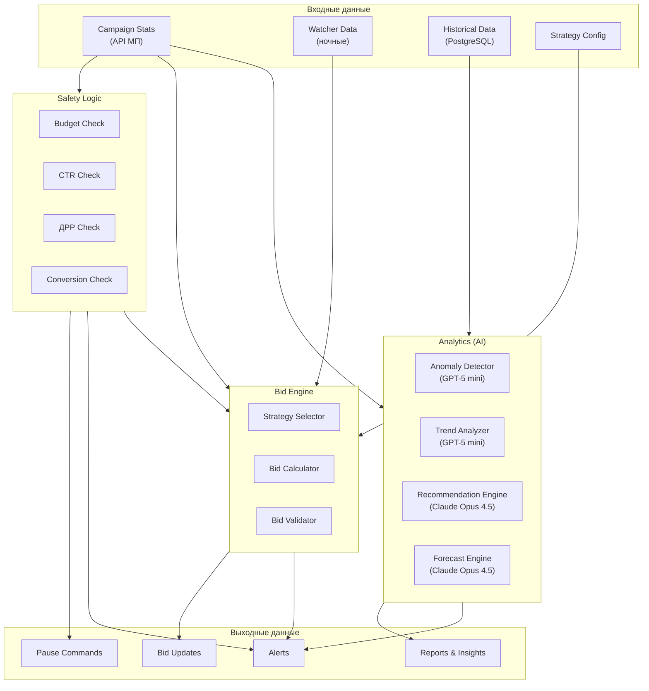
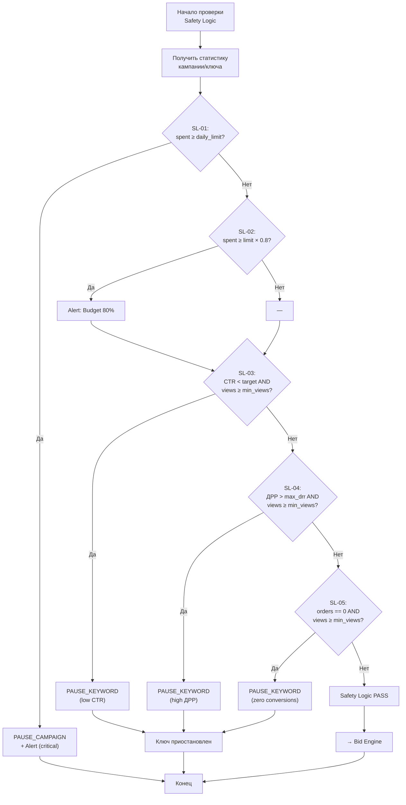
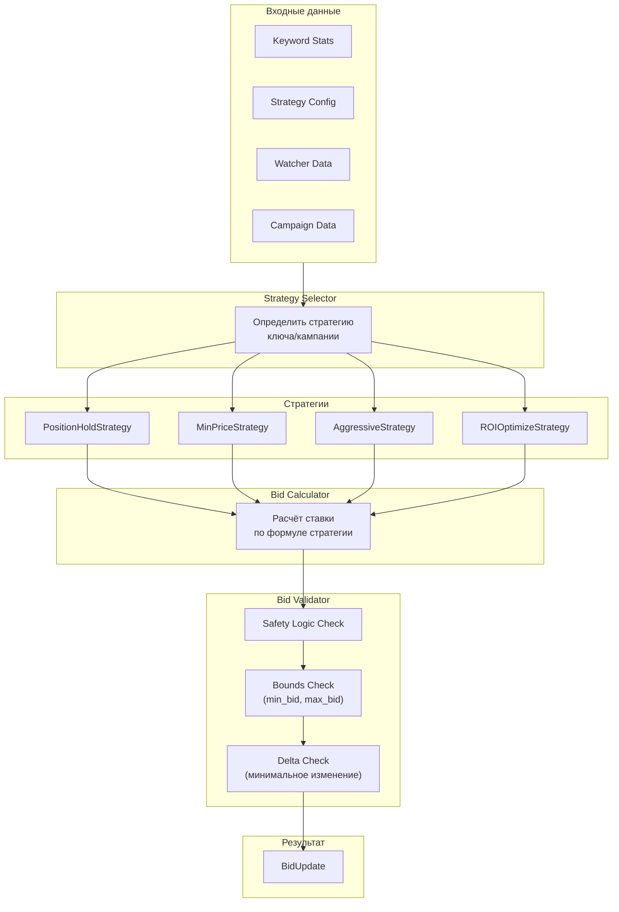
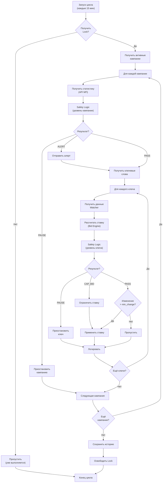
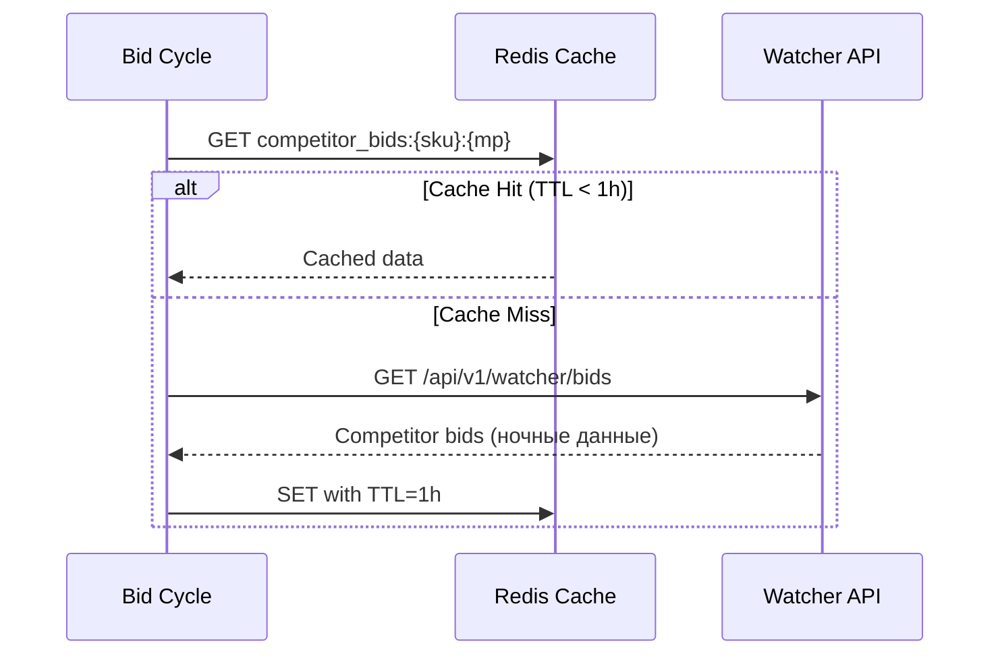

**Проект:** Автоматическое управление рекламными кампаниями  
**Модуль:** Marketing / AI Pipeline  
**Версия:** 1.0  
**Дата:** Январь 2026

---

## 3.1 Обзор

### Назначение

AI Pipeline модуля Marketing обеспечивает автоматизированное принятие решений по управлению ставками и контролю эффективности рекламных кампаний.

### Компоненты AI Pipeline

| Компонент | Описание | AI-модель |
|-----------|----------|-----------|
| Safety Logic | Защита от неэффективных расходов | — (rule-based) |
| Bid Engine | Расчёт ставок по стратегиям | — (алгоритмы) |
| Anomaly Detector | Выявление аномалий расходов | GPT-5 mini |
| Trend Analyzer | Анализ трендов эффективности | GPT-5 mini |
| Recommendation Engine | Рекомендации по оптимизации | Claude Opus 4.5 |
| Forecast Engine | Прогнозирование расходов | Claude Opus 4.5 |

### Архитектура AI Pipeline



---

## 3.2 Safety Logic

### 3.2.1 Назначение

Safety Logic — система правил, защищающая от неэффективных рекламных расходов. Работает без AI, на основе детерминированных условий.

### 3.2.2 Правила Safety Logic

| ID | Правило | Условие | Действие | Уровень |
|----|---------|---------|----------|---------|
| SL-01 | Budget Exceeded | `spent >= daily_limit` | PAUSE_CAMPAIGN | critical |
| SL-02 | Budget Warning | `spent >= daily_limit × 0.8` | ALERT | warning |
| SL-03 | Low CTR | `ctr < target_ctr AND views >= min_views` | PAUSE_KEYWORD | warning |
| SL-04 | High ДРР | `drr > max_drr AND views >= min_views` | PAUSE_KEYWORD | warning |
| SL-05 | Zero Conversions | `orders == 0 AND views >= min_views` | PAUSE_KEYWORD | info |
| SL-06 | Max Bid Exceeded | `calculated_bid > max_bid` | CAP_BID, ALERT | warning |
| SL-07 | Spending Anomaly | `today_spent > avg_spent × 1.5` | ALERT | warning |

### 3.2.3 Параметры Safety Logic

| Параметр | Описание | Default | Диапазон | Настраивает |
|----------|----------|---------|----------|-------------|
| `target_ctr` | Целевой CTR | 3.0% | 0.5–10% | Admin |
| `min_views` | Мин. показов для решения | 1000 | 100–10000 | Admin |
| `max_drr` | Макс. ДРР | 15% | 5–50% | Admin |
| `budget_alert_threshold` | Порог алерта бюджета | 80% | 50–95% | Admin |
| `spending_anomaly_threshold` | Порог аномалии расходов | 150% | 120–200% | Admin |

### 3.2.4 Алгоритм проверки Safety Logic



### 3.2.5 Реализация Safety Logic

```python
# services/marketing/safety_logic.py

from dataclasses import dataclass
from typing import List, Optional, Tuple
from enum import Enum
from datetime import datetime


class SafetyAction(Enum):
    """Действия Safety Logic."""
    PASS = "pass"
    PAUSE_CAMPAIGN = "pause_campaign"
    PAUSE_KEYWORD = "pause_keyword"
    CAP_BID = "cap_bid"
    ALERT = "alert"


class SafetyReason(Enum):
    """Причины срабатывания Safety Logic."""
    BUDGET_EXCEEDED = "budget_exceeded"
    BUDGET_WARNING = "budget_warning"
    LOW_CTR = "low_ctr"
    HIGH_DRR = "high_drr"
    ZERO_CONVERSIONS = "zero_conversions"
    MAX_BID_EXCEEDED = "max_bid_exceeded"
    SPENDING_ANOMALY = "spending_anomaly"


@dataclass
class SafetyConfig:
    """Конфигурация Safety Logic."""
    target_ctr: float = 3.0           # %
    min_views: int = 1000
    max_drr: float = 15.0             # %
    budget_alert_threshold: float = 0.8
    spending_anomaly_threshold: float = 1.5


@dataclass
class SafetyCheckResult:
    """Результат проверки Safety Logic."""
    action: SafetyAction
    reason: Optional[SafetyReason] = None
    message: Optional[str] = None
    severity: str = "info"  # info, warning, critical
    calculated_bid: Optional[float] = None
    capped_bid: Optional[float] = None


@dataclass
class KeywordStats:
    """Статистика ключевого слова."""
    keyword_id: str
    campaign_id: str
    views: int
    clicks: int
    ctr: float
    spent: float
    orders: int
    revenue: float
    drr: float
    current_bid: float


@dataclass
class CampaignStats:
    """Статистика кампании."""
    campaign_id: str
    daily_limit: float
    spent_today: float
    avg_daily_spent: float  # За последние 7 дней


class SafetyLogic:
    """Система защиты от неэффективных расходов."""
    
    def __init__(self, config: SafetyConfig = None):
        self.config = config or SafetyConfig()
    
    def check_campaign(self, stats: CampaignStats) -> SafetyCheckResult:
        """Проверка кампании на уровне бюджета."""
        
        # SL-01: Budget Exceeded
        if stats.spent_today >= stats.daily_limit:
            return SafetyCheckResult(
                action=SafetyAction.PAUSE_CAMPAIGN,
                reason=SafetyReason.BUDGET_EXCEEDED,
                message=f"Дневной бюджет исчерпан: {stats.spent_today:.2f} ₽ / {stats.daily_limit:.2f} ₽",
                severity="critical"
            )
        
        # SL-02: Budget Warning
        if stats.spent_today >= stats.daily_limit * self.config.budget_alert_threshold:
            return SafetyCheckResult(
                action=SafetyAction.ALERT,
                reason=SafetyReason.BUDGET_WARNING,
                message=f"Бюджет на {int(stats.spent_today / stats.daily_limit * 100)}%",
                severity="warning"
            )
        
        # SL-07: Spending Anomaly
        if stats.avg_daily_spent > 0:
            if stats.spent_today > stats.avg_daily_spent * self.config.spending_anomaly_threshold:
                return SafetyCheckResult(
                    action=SafetyAction.ALERT,
                    reason=SafetyReason.SPENDING_ANOMALY,
                    message=f"Аномальный рост расходов: {stats.spent_today:.2f} ₽ vs avg {stats.avg_daily_spent:.2f} ₽",
                    severity="warning"
                )
        
        return SafetyCheckResult(action=SafetyAction.PASS)
    
    def check_keyword(
        self, 
        stats: KeywordStats,
        max_bid: float,
        calculated_bid: Optional[float] = None
    ) -> SafetyCheckResult:
        """Проверка ключевого слова."""
        
        # Проверяем только если достаточно данных
        has_enough_data = stats.views >= self.config.min_views
        
        # SL-03: Low CTR
        if has_enough_data and stats.ctr < self.config.target_ctr:
            return SafetyCheckResult(
                action=SafetyAction.PAUSE_KEYWORD,
                reason=SafetyReason.LOW_CTR,
                message=f"Низкий CTR: {stats.ctr:.2f}% < {self.config.target_ctr}%",
                severity="warning"
            )
        
        # SL-04: High ДРР
        if has_enough_data and stats.drr > self.config.max_drr:
            return SafetyCheckResult(
                action=SafetyAction.PAUSE_KEYWORD,
                reason=SafetyReason.HIGH_DRR,
                message=f"Высокий ДРР: {stats.drr:.2f}% > {self.config.max_drr}%",
                severity="warning"
            )
        
        # SL-05: Zero Conversions
        if has_enough_data and stats.orders == 0:
            return SafetyCheckResult(
                action=SafetyAction.PAUSE_KEYWORD,
                reason=SafetyReason.ZERO_CONVERSIONS,
                message=f"Нет конверсий при {stats.views} показах",
                severity="info"
            )
        
        # SL-06: Max Bid Exceeded
        if calculated_bid is not None and calculated_bid > max_bid:
            return SafetyCheckResult(
                action=SafetyAction.CAP_BID,
                reason=SafetyReason.MAX_BID_EXCEEDED,
                message=f"Ставка ограничена: {calculated_bid:.2f} → {max_bid:.2f} ₽",
                severity="warning",
                calculated_bid=calculated_bid,
                capped_bid=max_bid
            )
        
        return SafetyCheckResult(action=SafetyAction.PASS)
    
    def check_all(
        self,
        campaign_stats: CampaignStats,
        keyword_stats: List[KeywordStats],
        max_bids: dict,  # keyword_id -> max_bid
        calculated_bids: dict = None  # keyword_id -> calculated_bid
    ) -> Tuple[SafetyCheckResult, dict]:
        """
        Полная проверка кампании и всех ключей.
        
        Returns:
            (campaign_result, {keyword_id: result})
        """
        calculated_bids = calculated_bids or {}
        
        # Проверка кампании
        campaign_result = self.check_campaign(campaign_stats)
        
        # Если кампания должна быть приостановлена, не проверяем ключи
        if campaign_result.action == SafetyAction.PAUSE_CAMPAIGN:
            return campaign_result, {}
        
        # Проверка ключей
        keyword_results = {}
        for kw_stats in keyword_stats:
            max_bid = max_bids.get(kw_stats.keyword_id, float('inf'))
            calc_bid = calculated_bids.get(kw_stats.keyword_id)
            
            keyword_results[kw_stats.keyword_id] = self.check_keyword(
                kw_stats, max_bid, calc_bid
            )
        
        return campaign_result, keyword_results
```

---

## 3.3 Bid Engine

### 3.3.1 Назначение

Bid Engine — компонент расчёта ставок на основе выбранной стратегии, данных о конкурентах и текущей статистики.

### 3.3.2 Стратегии биддинга

| Стратегия | Код | Описание | Применение |
|-----------|-----|----------|------------|
| Удержание позиции | `POSITION_HOLD` | Держать заданную позицию | Ключевые товары |
| Минимальная цена | `MIN_PRICE` | Минимум для попадания в блок | Экономия бюджета |
| Агрессивный рост | `AGGRESSIVE` | Максимизация показов | Новые товары, акции |
| ROI-оптимизация | `ROI_OPTIMIZE` | На основе целевого ДРР | Оптимизация прибыли |

### 3.3.3 Формулы расчёта ставок

#### Position Hold (Удержание позиции)

```
new_bid = competitor_bid[target_position] + bid_step
```

**Входные данные:**
- `competitor_bid[n]` — ставка конкурента на позиции n (из Watcher)
- `target_position` — целевая позиция (1–50)
- `bid_step` — шаг повышения ставки (default: 1 ₽)

**Пример:**
```
target_position = 5
competitor_bid[5] = 120 ₽
bid_step = 1 ₽
→ new_bid = 121 ₽
```

#### Min Price (Минимальная цена)

```
new_bid = min_bid_for_placement
```

**Входные данные:**
- `min_bid_for_placement` — минимальная ставка для попадания в рекламный блок (из API МП)

#### Aggressive (Агрессивный рост)

```
remaining_budget = daily_limit - spent_today
hours_remaining = 24 - current_hour
hourly_budget = remaining_budget / hours_remaining

max_affordable_bid = hourly_budget / expected_clicks_per_hour
new_bid = min(max_affordable_bid, competitor_top_bid + bid_step)
```

**Входные данные:**
- `daily_limit` — дневной бюджет
- `spent_today` — потрачено сегодня
- `competitor_top_bid` — ставка лидера (из Watcher)
- `expected_clicks_per_hour` — ожидаемое количество кликов (из истории)

#### ROI Optimize (ROI-оптимизация)

```
max_cpc = (avg_order_value × (1 - target_drr/100)) / conversion_rate × 100

new_bid = min(max_cpc, competitor_bid[target_position] + bid_step)
```

**Входные данные:**
- `avg_order_value` — средний чек
- `target_drr` — целевой ДРР (%)
- `conversion_rate` — конверсия из клика в заказ (%)

**Пример:**
```
avg_order_value = 2500 ₽
target_drr = 10%
conversion_rate = 2%

max_cpc = (2500 × 0.9) / 0.02 = 112 500 / 100 = 112.5 ₽
→ new_bid = min(112.5, competitor_bid + 1)
```

### 3.3.4 Архитектура Bid Engine



### 3.3.5 Реализация Bid Engine

```python
# services/marketing/bid_engine.py

from abc import ABC, abstractmethod
from dataclasses import dataclass
from typing import Optional, Dict, List
from enum import Enum
from datetime import datetime


class BiddingStrategy(Enum):
    """Стратегии биддинга."""
    POSITION_HOLD = "position_hold"
    MIN_PRICE = "min_price"
    AGGRESSIVE = "aggressive"
    ROI_OPTIMIZE = "roi_optimize"


@dataclass
class StrategyConfig:
    """Конфигурация стратегии."""
    strategy: BiddingStrategy
    target_position: int = 5
    bid_step: float = 1.0
    target_drr: float = 15.0
    max_bid: float = 500.0
    min_bid: float = 1.0
    min_bid_change: float = 1.0  # Минимальное изменение для применения


@dataclass
class CompetitorData:
    """Данные о конкурентах (из Watcher)."""
    position_bids: Dict[int, float]  # position -> bid
    top_bid: float
    min_placement_bid: float


@dataclass
class KeywordData:
    """Данные ключевого слова для расчёта."""
    keyword_id: str
    current_bid: float
    views: int
    clicks: int
    orders: int
    spent: float
    revenue: float
    avg_order_value: float
    conversion_rate: float  # %


@dataclass
class CampaignContext:
    """Контекст кампании."""
    campaign_id: str
    daily_limit: float
    spent_today: float
    current_hour: int


@dataclass
class BidCalculation:
    """Результат расчёта ставки."""
    keyword_id: str
    old_bid: float
    new_bid: float
    strategy: BiddingStrategy
    reason: str
    should_apply: bool  # False если изменение слишком мало


class BiddingStrategyBase(ABC):
    """Базовый класс стратегии биддинга."""
    
    @abstractmethod
    def calculate(
        self,
        keyword: KeywordData,
        config: StrategyConfig,
        competitor: CompetitorData,
        context: CampaignContext
    ) -> float:
        """Рассчитать новую ставку."""
        pass


class PositionHoldStrategy(BiddingStrategyBase):
    """Стратегия удержания позиции."""
    
    def calculate(
        self,
        keyword: KeywordData,
        config: StrategyConfig,
        competitor: CompetitorData,
        context: CampaignContext
    ) -> float:
        # Ставка конкурента на целевой позиции
        target_bid = competitor.position_bids.get(
            config.target_position,
            competitor.min_placement_bid
        )
        
        # Новая ставка = ставка конкурента + шаг
        new_bid = target_bid + config.bid_step
        
        return new_bid


class MinPriceStrategy(BiddingStrategyBase):
    """Стратегия минимальной цены."""
    
    def calculate(
        self,
        keyword: KeywordData,
        config: StrategyConfig,
        competitor: CompetitorData,
        context: CampaignContext
    ) -> float:
        return competitor.min_placement_bid


class AggressiveStrategy(BiddingStrategyBase):
    """Агрессивная стратегия роста."""
    
    def calculate(
        self,
        keyword: KeywordData,
        config: StrategyConfig,
        competitor: CompetitorData,
        context: CampaignContext
    ) -> float:
        # Остаток бюджета
        remaining_budget = context.daily_limit - context.spent_today
        if remaining_budget <= 0:
            return config.min_bid
        
        # Часов до конца дня
        hours_remaining = max(1, 24 - context.current_hour)
        hourly_budget = remaining_budget / hours_remaining
        
        # Ожидаемые клики (из истории)
        expected_clicks = max(1, keyword.clicks / max(1, context.current_hour))
        
        # Максимальная ставка по бюджету
        max_affordable = hourly_budget / expected_clicks
        
        # Ставка = мин(по бюджету, топ конкурента + шаг)
        new_bid = min(max_affordable, competitor.top_bid + config.bid_step)
        
        return new_bid


class ROIOptimizeStrategy(BiddingStrategyBase):
    """Стратегия оптимизации ROI."""
    
    def calculate(
        self,
        keyword: KeywordData,
        config: StrategyConfig,
        competitor: CompetitorData,
        context: CampaignContext
    ) -> float:
        # Конверсия
        conversion_rate = keyword.conversion_rate
        if conversion_rate <= 0:
            # Если нет данных о конверсии, используем conservative estimate
            conversion_rate = 1.0
        
        # Средний чек
        avg_order_value = keyword.avg_order_value
        if avg_order_value <= 0:
            avg_order_value = keyword.revenue / max(1, keyword.orders)
        
        # Максимальный CPC для целевого ДРР
        # ДРР = spent / revenue = (clicks × cpc) / (orders × avg_order_value)
        # ДРР = (clicks × cpc) / (clicks × conversion_rate × avg_order_value)
        # ДРР = cpc / (conversion_rate × avg_order_value)
        # cpc = ДРР × conversion_rate × avg_order_value
        
        target_drr_decimal = config.target_drr / 100
        max_cpc = target_drr_decimal * (conversion_rate / 100) * avg_order_value
        
        # Ставка = мин(по ROI, позиция конкурента + шаг)
        target_bid = competitor.position_bids.get(
            config.target_position,
            competitor.min_placement_bid
        )
        
        new_bid = min(max_cpc, target_bid + config.bid_step)
        
        return new_bid


class BidEngine:
    """Движок расчёта ставок."""
    
    STRATEGIES = {
        BiddingStrategy.POSITION_HOLD: PositionHoldStrategy(),
        BiddingStrategy.MIN_PRICE: MinPriceStrategy(),
        BiddingStrategy.AGGRESSIVE: AggressiveStrategy(),
        BiddingStrategy.ROI_OPTIMIZE: ROIOptimizeStrategy(),
    }
    
    def calculate_bid(
        self,
        keyword: KeywordData,
        config: StrategyConfig,
        competitor: CompetitorData,
        context: CampaignContext
    ) -> BidCalculation:
        """Рассчитать ставку для ключевого слова."""
        
        # Выбор стратегии
        strategy = self.STRATEGIES[config.strategy]
        
        # Расчёт ставки
        raw_bid = strategy.calculate(keyword, config, competitor, context)
        
        # Валидация границ
        validated_bid = max(config.min_bid, min(config.max_bid, raw_bid))
        
        # Проверка минимального изменения
        bid_change = abs(validated_bid - keyword.current_bid)
        should_apply = bid_change >= config.min_bid_change
        
        # Формирование причины
        if validated_bid > raw_bid:
            reason = f"Ограничено min_bid ({config.min_bid})"
        elif validated_bid < raw_bid:
            reason = f"Ограничено max_bid ({config.max_bid})"
        else:
            reason = f"Стратегия {config.strategy.value}"
        
        return BidCalculation(
            keyword_id=keyword.keyword_id,
            old_bid=keyword.current_bid,
            new_bid=validated_bid,
            strategy=config.strategy,
            reason=reason,
            should_apply=should_apply
        )
    
    def calculate_batch(
        self,
        keywords: List[KeywordData],
        configs: Dict[str, StrategyConfig],  # keyword_id -> config
        competitors: Dict[str, CompetitorData],  # keyword_id -> data
        context: CampaignContext
    ) -> List[BidCalculation]:
        """Пакетный расчёт ставок."""
        
        results = []
        for keyword in keywords:
            config = configs.get(keyword.keyword_id)
            competitor = competitors.get(keyword.keyword_id)
            
            if not config or not competitor:
                continue
            
            result = self.calculate_bid(keyword, config, competitor, context)
            results.append(result)
        
        return results
```

---

## 3.4 Bid Correction Cycle

### 3.4.1 Общий алгоритм цикла



### 3.4.2 Реализация цикла

```python
# services/marketing/bid_cycle.py

import asyncio
import logging
from datetime import datetime
from typing import List

from .safety_logic import SafetyLogic, SafetyAction, CampaignStats, KeywordStats
from .bid_engine import BidEngine, BidCalculation
from .adapters.manager import AdapterManager
from core.redis_lock import RedisLock
from core.notifications import NotificationService


logger = logging.getLogger(__name__)


class BidCorrectionCycle:
    """Цикл корректировки ставок."""
    
    LOCK_KEY = "marketing:bid_cycle:lock"
    LOCK_TTL = 300  # 5 минут
    
    def __init__(
        self,
        adapter_manager: AdapterManager,
        safety_logic: SafetyLogic,
        bid_engine: BidEngine,
        watcher_client,
        db_session,
        notification_service: NotificationService,
        redis_client
    ):
        self.adapters = adapter_manager
        self.safety = safety_logic
        self.bid_engine = bid_engine
        self.watcher = watcher_client
        self.db = db_session
        self.notifications = notification_service
        self.redis = redis_client
    
    async def run(self):
        """Запуск цикла корректировки."""
        
        # Попытка получить lock
        lock = RedisLock(self.redis, self.LOCK_KEY, self.LOCK_TTL)
        
        if not await lock.acquire():
            logger.warning("Bid cycle already running, skipping")
            return
        
        try:
            await self._execute_cycle()
        finally:
            await lock.release()
    
    async def _execute_cycle(self):
        """Выполнение цикла."""
        
        cycle_start = datetime.utcnow()
        logger.info(f"Starting bid correction cycle at {cycle_start}")
        
        stats = {
            "campaigns_processed": 0,
            "keywords_processed": 0,
            "bids_updated": 0,
            "keywords_paused": 0,
            "campaigns_paused": 0,
            "alerts_sent": 0,
            "errors": 0
        }
        
        # Обработка каждого маркетплейса
        for mp_code, adapter in self.adapters.get_all_adapters().items():
            try:
                await self._process_marketplace(mp_code, adapter, stats)
            except Exception as e:
                logger.error(f"Error processing {mp_code}: {e}")
                stats["errors"] += 1
        
        # Сохранение статистики цикла
        await self._save_cycle_stats(cycle_start, stats)
        
        logger.info(f"Bid cycle completed: {stats}")
    
    async def _process_marketplace(self, mp_code: str, adapter, stats: dict):
        """Обработка маркетплейса."""
        
        # Получить активные кампании
        campaigns = await adapter.get_campaigns(status="active")
        
        for campaign in campaigns:
            try:
                await self._process_campaign(mp_code, adapter, campaign, stats)
                stats["campaigns_processed"] += 1
            except Exception as e:
                logger.error(f"Error processing campaign {campaign.external_id}: {e}")
                stats["errors"] += 1
    
    async def _process_campaign(self, mp_code: str, adapter, campaign, stats: dict):
        """Обработка кампании."""
        
        # Получить статистику кампании
        campaign_stats = await self._get_campaign_stats(adapter, campaign)
        
        # Safety Logic на уровне кампании
        camp_result = self.safety.check_campaign(campaign_stats)
        
        if camp_result.action == SafetyAction.PAUSE_CAMPAIGN:
            await adapter.pause_campaign(campaign.external_id)
            await self._send_alert(
                campaign.brand_id,
                "campaign_paused",
                camp_result.message,
                camp_result.severity
            )
            stats["campaigns_paused"] += 1
            stats["alerts_sent"] += 1
            return
        
        if camp_result.action == SafetyAction.ALERT:
            await self._send_alert(
                campaign.brand_id,
                "budget_warning",
                camp_result.message,
                camp_result.severity
            )
            stats["alerts_sent"] += 1
        
        # Обработка ключевых слов
        keywords = await adapter.get_keywords(campaign.external_id)
        
        for keyword in keywords:
            try:
                await self._process_keyword(
                    mp_code, adapter, campaign, keyword, stats
                )
                stats["keywords_processed"] += 1
            except Exception as e:
                logger.error(f"Error processing keyword {keyword.external_id}: {e}")
                stats["errors"] += 1
    
    async def _process_keyword(
        self, 
        mp_code: str, 
        adapter, 
        campaign, 
        keyword, 
        stats: dict
    ):
        """Обработка ключевого слова."""
        
        # Получить данные Watcher
        watcher_data = await self.watcher.get_competitor_bids(
            sku=keyword.sku if hasattr(keyword, 'sku') else None,
            keyword=keyword.keyword,
            marketplace=mp_code
        )
        
        # Получить конфигурацию стратегии
        strategy_config = await self._get_strategy_config(campaign, keyword)
        
        # Расчёт ставки
        keyword_data = self._to_keyword_data(keyword)
        competitor_data = self._to_competitor_data(watcher_data)
        context = self._to_campaign_context(campaign)
        
        bid_calc = self.bid_engine.calculate_bid(
            keyword_data, strategy_config, competitor_data, context
        )
        
        # Safety Logic на уровне ключа
        kw_stats = self._to_keyword_stats(keyword, campaign.external_id)
        safety_result = self.safety.check_keyword(
            kw_stats, 
            strategy_config.max_bid,
            bid_calc.new_bid
        )
        
        # Применение результата
        if safety_result.action == SafetyAction.PAUSE_KEYWORD:
            await adapter.pause_keyword(keyword.external_id)
            await self._log_bid_change(keyword, None, "paused", safety_result.reason)
            stats["keywords_paused"] += 1
            return
        
        if safety_result.action == SafetyAction.CAP_BID:
            bid_calc.new_bid = safety_result.capped_bid
            await self._send_alert(
                campaign.brand_id,
                "bid_capped",
                safety_result.message,
                safety_result.severity
            )
            stats["alerts_sent"] += 1
        
        # Применение ставки
        if bid_calc.should_apply:
            result = await adapter.update_bid(keyword.external_id, bid_calc.new_bid)
            if result.success:
                await self._log_bid_change(
                    keyword, 
                    bid_calc.new_bid, 
                    "updated",
                    bid_calc.reason
                )
                stats["bids_updated"] += 1
            else:
                logger.error(f"Failed to update bid: {result.error}")
                stats["errors"] += 1
```

---

## 3.5 Analytics Engine

### 3.5.1 Назначение

Analytics Engine использует AI для выявления паттернов, аномалий и генерации рекомендаций по оптимизации рекламных кампаний.

### 3.5.2 Компоненты

| Компонент | AI-модель | Назначение |
|-----------|-----------|------------|
| Anomaly Detector | GPT-5 mini | Выявление аномальных паттернов расходов |
| Trend Analyzer | GPT-5 mini | Анализ трендов эффективности |
| Recommendation Engine | Claude Opus 4.5 | Рекомендации по оптимизации |
| Forecast Engine | Claude Opus 4.5 | Прогнозирование расходов |

### 3.5.3 Anomaly Detector

**Типы аномалий:**

| Тип | Описание | Порог |
|-----|----------|-------|
| `spending_spike` | Резкий рост расходов | >150% от среднего |
| `ctr_drop` | Падение CTR | <50% от среднего |
| `drr_spike` | Рост ДРР | >200% от целевого |
| `conversion_drop` | Падение конверсии | <50% от среднего |
| `position_loss` | Потеря позиций | Падение >5 позиций |

**Промпт для детекции (GPT-5 mini):**

```python
ANOMALY_DETECTION_PROMPT = """
Проанализируй статистику рекламной кампании и выяви аномалии.

## Текущие данные (сегодня)
- Расход: {spent_today} ₽
- CTR: {ctr_today}%
- ДРР: {drr_today}%
- Заказы: {orders_today}
- Средняя позиция: {avg_position_today}

## Средние за 7 дней
- Расход: {avg_spent_7d} ₽
- CTR: {avg_ctr_7d}%
- ДРР: {avg_drr_7d}%
- Заказы: {avg_orders_7d}
- Средняя позиция: {avg_position_7d}

## Целевые показатели
- Target CTR: {target_ctr}%
- Max ДРР: {max_drr}%

Ответь в JSON-формате:
{{
  "anomalies": [
    {{
      "type": "spending_spike|ctr_drop|drr_spike|conversion_drop|position_loss",
      "severity": "info|warning|critical",
      "description": "Краткое описание",
      "recommendation": "Рекомендация по действию"
    }}
  ],
  "overall_status": "normal|attention|critical"
}}
"""
```

### 3.5.4 Recommendation Engine

**Типы рекомендаций:**

| Тип | Описание | Приоритет |
|-----|----------|-----------|
| `pause_ineffective` | Приостановить неэффективные ключи | High |
| `increase_budget` | Увеличить бюджет эффективной кампании | Medium |
| `decrease_budget` | Снизить бюджет неэффективной | Medium |
| `change_strategy` | Сменить стратегию биддинга | Low |
| `add_keywords` | Добавить ключевые слова | Low |
| `remove_keywords` | Удалить неэффективные ключи | Medium |

**Промпт для рекомендаций (Claude Opus 4.5):**

```python
RECOMMENDATION_PROMPT = """
Ты — эксперт по оптимизации рекламных кампаний на маркетплейсах.

## Данные кампании "{campaign_name}"
- Маркетплейс: {marketplace}
- Тип: {campaign_type}
- Период: последние 7 дней

## Статистика
| Метрика | Значение | Цель | Статус |
|---------|----------|------|--------|
| Расход | {spent} ₽ | {budget} ₽ | {budget_status} |
| CTR | {ctr}% | {target_ctr}% | {ctr_status} |
| ДРР | {drr}% | {max_drr}% | {drr_status} |
| Заказы | {orders} | — | — |
| Выручка | {revenue} ₽ | — | — |

## Топ-5 ключевых слов по эффективности
{top_keywords_table}

## Топ-5 неэффективных ключей
{bottom_keywords_table}

## Выявленные аномалии
{anomalies_list}

Сформируй рекомендации по оптимизации кампании. 
Для каждой рекомендации укажи:
1. Действие (конкретное)
2. Ожидаемый эффект
3. Приоритет (high/medium/low)
4. Риски

Максимум 5 рекомендаций, отсортированных по приоритету.
"""
```

### 3.5.5 Forecast Engine

**Прогнозируемые метрики:**

| Метрика | Горизонт | Метод |
|---------|----------|-------|
| Расход (день) | 1 день | Экстраполяция |
| Расход (неделя) | 7 дней | Trend + seasonality |
| ДРР (неделя) | 7 дней | AI-прогноз |
| ROI (месяц) | 30 дней | AI-прогноз |

---

## 3.6 Интеграция с Watcher

### 3.6.1 Получение данных о конкурентах



### 3.6.2 Формат данных Watcher

```json
{
  "sku": "OM-12345",
  "marketplace": "wildberries",
  "keyword": "летнее платье",
  "positions": [
    {"position": 1, "seller": "Fashion Store", "bid_estimate": 180},
    {"position": 2, "seller": "Style Shop", "bid_estimate": 150},
    {"position": 3, "seller": "Trend Market", "bid_estimate": 130},
    {"position": 4, "seller": "Other", "bid_estimate": 110},
    {"position": 5, "seller": "Our Store", "bid_estimate": 100}
  ],
  "min_placement_bid": 50,
  "data_freshness": "2026-01-15T03:00:00Z"
}
```

---

## 3.7 Логирование и история

### 3.7.1 Структура логов

| Событие | Уровень | Данные |
|---------|---------|--------|
| Bid Updated | INFO | keyword_id, old_bid, new_bid, strategy, reason |
| Bid Skipped | DEBUG | keyword_id, reason |
| Keyword Paused | WARNING | keyword_id, reason, stats |
| Campaign Paused | WARNING | campaign_id, reason |
| Safety Alert | WARNING | campaign_id, alert_type, message |
| Cycle Complete | INFO | stats summary |
| Error | ERROR | error details, stack trace |

### 3.7.2 История изменений ставок

```sql
-- Таблица marketing_bid_history
INSERT INTO marketing_bid_history (
    keyword_id,
    campaign_id,
    marketplace,
    old_bid,
    new_bid,
    strategy,
    reason,
    safety_action,
    stats_snapshot,
    created_at
) VALUES (
    :keyword_id,
    :campaign_id,
    :marketplace,
    :old_bid,
    :new_bid,
    :strategy,
    :reason,
    :safety_action,
    :stats_snapshot::jsonb,
    NOW()
);
```

---

## 3.8 Метрики и мониторинг

### 3.8.1 Prometheus Metrics

```python
# Метрики цикла
bid_cycle_duration = Histogram(
    'marketing_bid_cycle_duration_seconds',
    'Duration of bid correction cycle'
)

bid_updates_total = Counter(
    'marketing_bid_updates_total',
    'Total bid updates',
    ['marketplace', 'strategy', 'result']
)

safety_actions_total = Counter(
    'marketing_safety_actions_total',
    'Safety actions triggered',
    ['action', 'reason']
)

# Метрики эффективности
current_drr = Gauge(
    'marketing_current_drr',
    'Current ДРР',
    ['marketplace', 'campaign_id']
)

current_ctr = Gauge(
    'marketing_current_ctr',
    'Current CTR',
    ['marketplace', 'campaign_id']
)
```

### 3.8.2 Алерты

| Алерт | Условие | Severity |
|-------|---------|----------|
| BidCycleStuck | Cycle duration > 10 min | critical |
| HighErrorRate | Errors > 10% of operations | warning |
| SafetyTriggerSpike | Safety actions > 50% of keywords | warning |
| APIRateLimitHit | 429 errors > 5/min | warning |

---

## 3.9 Конфигурация AI Pipeline

### 3.9.1 Environment Variables

| Переменная | Описание | Default |
|------------|----------|---------|
| `MARKETING_BID_CYCLE_INTERVAL` | Интервал цикла (мин) | 15 |
| `MARKETING_SAFETY_TARGET_CTR` | Target CTR (%) | 3.0 |
| `MARKETING_SAFETY_MIN_VIEWS` | Min Views | 1000 |
| `MARKETING_SAFETY_MAX_DRR` | Max ДРР (%) | 15.0 |
| `MARKETING_DEFAULT_MAX_BID` | Max Bid по умолчанию | 500 |
| `MARKETING_DEFAULT_BID_STEP` | Шаг ставки | 1.0 |
| `MARKETING_ANALYTICS_ENABLED` | Включить аналитику | true |

### 3.9.2 Настройки в БД

```json
{
  "safety_logic": {
    "target_ctr": 3.0,
    "min_views": 1000,
    "max_drr": 15.0,
    "budget_alert_threshold": 0.8,
    "spending_anomaly_threshold": 1.5
  },
  "bid_engine": {
    "default_strategy": "position_hold",
    "default_target_position": 5,
    "default_bid_step": 1.0,
    "min_bid_change": 1.0
  },
  "analytics": {
    "anomaly_detection_enabled": true,
    "recommendation_enabled": true,
    "forecast_enabled": true
  }
}
```

---

**Документ подготовлен:** Январь 2026  
**Версия:** 1.0  
**Статус:** Черновик
