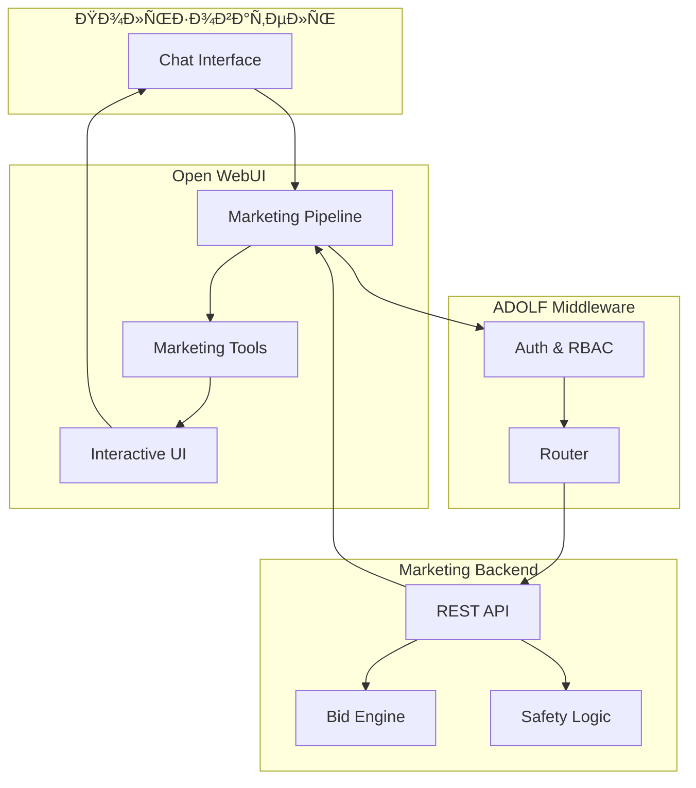

**Проект:** Автоматическое управление рекламными кампаниями  
**Модуль:** Marketing / Open WebUI  
**Версия:** 1.0  
**Дата:** Январь 2026

---

## 4.1 Обзор

### Назначение

Раздел описывает интеграцию модуля Marketing с Open WebUI:

- **Pipeline** `@Adolf_Marketing` — агент управления рекламой
- **Tools** — Function Calling для операций с кампаниями и ставками
- **Interactive UI** — кнопки, карточки, графики в чате

### Компоненты интеграции

| Компонент | Назначение |
|-----------|------------|
| Pipeline | Обработка запросов, маршрутизация, форматирование |
| Tools | Функции для Function Calling |
| Valves | Настройки Pipeline |
| Buttons | Кнопки быстрых действий |
| Cards | Карточки кампаний и ключей |
| Charts | Графики статистики |

### Архитектура интеграции



---

## 4.2 Pipeline: @Adolf_Marketing

### 4.2.1 Конфигурация

```python
# pipelines/adolf_marketing.py
"""
title: Adolf Marketing Pipeline
author: Adolf Team
version: 1.0.0
description: Управление рекламными кампаниями на маркетплейсах
"""

from typing import List, Generator, Optional
from pydantic import BaseModel, Field
import requests
import json


class Pipeline:
    """Pipeline для управления рекламными кампаниями."""
    
    class Valves(BaseModel):
        """Настройки Pipeline."""
        MIDDLEWARE_URL: str = Field(
            default="http://middleware:8000",
            description="URL Middleware API"
        )
        MIDDLEWARE_API_KEY: str = Field(
            default="",
            description="API ключ Middleware"
        )
        DEFAULT_MODEL: str = Field(
            default="gpt-5-mini",
            description="Модель для рутинных запросов"
        )
        ANALYTICS_MODEL: str = Field(
            default="claude-opus-4-5",
            description="Модель для аналитики"
        )
        ENABLE_REALTIME_STATS: bool = Field(
            default=True,
            description="Загружать статистику в реальном времени"
        )
        DEFAULT_STATS_PERIOD: int = Field(
            default=7,
            description="Период статистики по умолчанию (дни)"
        )
    
    def __init__(self):
        self.name = "Adolf Marketing"
        self.valves = self.Valves()
    
    async def on_startup(self):
        """Инициализация при запуске."""
        print(f"[{self.name}] Pipeline started")
    
    async def on_shutdown(self):
        """Очистка при остановке."""
        print(f"[{self.name}] Pipeline stopped")
    
    def inlet(self, body: dict, __user__: dict) -> dict:
        """
        Preprocessing — проверка доступа и добавление контекста.
        """
        user_role = __user__.get("role", "staff")
        user_brand = __user__.get("valves", {}).get("brand_id", "all")
        
        # Проверка доступа (Staff не имеет доступа)
        if user_role == "staff":
            body["messages"].append({
                "role": "system",
                "content": "У вас нет доступа к модулю Marketing. Обратитесь к руководителю."
            })
            return body
        
        # Добавление системного контекста
        system_context = self._build_system_context(user_role, user_brand)
        
        messages = body.get("messages", [])
        if messages and messages[0].get("role") != "system":
            messages.insert(0, {"role": "system", "content": system_context})
        
        # Загрузка summary для контекста (если включено)
        if self.valves.ENABLE_REALTIME_STATS:
            summary = self._fetch_campaigns_summary(__user__)
            if summary:
                messages.insert(1, {
                    "role": "system", 
                    "content": f"Текущая сводка по рекламе:\n{summary}"
                })
        
        body["messages"] = messages
        return body
    
    def pipe(
        self,
        body: dict,
        __user__: dict,
        __event_emitter__: callable = None
    ) -> Generator:
        """Основная обработка запросов."""
        
        user_id = __user__.get("id")
        user_role = __user__.get("role", "staff")
        user_brand = __user__.get("valves", {}).get("brand_id", "all")
        
        # Определение модели
        model = self._select_model(body.get("messages", []))
        
        # Запрос к Middleware
        response = requests.post(
            f"{self.valves.MIDDLEWARE_URL}/v1/chat/completions",
            headers={
                "Authorization": f"Bearer {self.valves.MIDDLEWARE_API_KEY}",
                "X-User-ID": str(user_id),
                "X-User-Role": user_role,
                "X-User-Brand": user_brand,
                "X-Module": "marketing"
            },
            json={
                "model": model,
                "messages": body.get("messages", []),
                "stream": True,
                "tools": self._get_tools_for_role(user_role)
            },
            stream=True
        )
        
        # Streaming response
        for line in response.iter_lines():
            if line:
                yield line.decode("utf-8")
    
    def outlet(self, body: dict, __user__: dict) -> dict:
        """
        Postprocessing — добавление кнопок и форматирование.
        """
        user_role = __user__.get("role", "staff")
        
        # Добавление кнопок по умолчанию
        if "buttons" not in body:
            body["buttons"] = self._get_default_buttons(user_role)
        
        return body
    
    def _build_system_context(self, role: str, brand: str) -> str:
        """Формирование системного контекста."""
        
        context = """Ты — Adolf Marketing, AI-ассистент для управления рекламными кампаниями на маркетплейсах.

Твои возможности:
- Просмотр и управление рекламными кампаниями (WB, Ozon, YM)
- Просмотр статистики: CTR, CPC, CPO, ДРР
- Управление ставками и бюджетами
- Анализ эффективности и рекомендации
- Настройка стратегий биддинга

Правила:
- Отвечай на русском языке
- Используй инструменты (tools) для получения данных
- Показывай данные в структурированном виде
- При изменении ставок всегда показывай текущее и новое значение
- Предупреждай о рисках при агрессивных настройках
"""
        
        # Добавление ограничений по роли
        if role == "manager":
            context += f"""
Ограничения для роли Manager:
- Доступ только к бренду: {brand}
- Изменение ставок только в пределах установленных лимитов
- Нет доступа к изменению Max Bid, Daily Limit, стратегий
"""
        elif role == "senior":
            context += """
Права для роли Senior:
- Доступ ко всем брендам
- Изменение Max Bid, Daily Limit, стратегий
- Просмотр сводных отчётов
- AI-рекомендации
"""
        elif role in ("director", "administrator"):
            context += """
Полный доступ:
- Все операции без ограничений
- Настройки Safety Logic (только Admin)
- Системные настройки (только Admin)
"""
        
        return context
    
    def _select_model(self, messages: List[dict]) -> str:
        """Выбор модели на основе запроса."""
        
        last_message = messages[-1].get("content", "").lower() if messages else ""
        
        # Аналитические запросы → Claude Opus 4.5
        analytics_keywords = [
            "анализ", "рекомендац", "оптимиз", "прогноз", 
            "почему", "что делать", "инсайт", "trend"
        ]
        
        if any(kw in last_message for kw in analytics_keywords):
            return self.valves.ANALYTICS_MODEL
        
        return self.valves.DEFAULT_MODEL
    
    def _fetch_campaigns_summary(self, user: dict) -> Optional[str]:
        """Получение краткой сводки по кампаниям."""
        
        try:
            response = requests.get(
                f"{self.valves.MIDDLEWARE_URL}/api/v1/marketing/summary",
                headers={
                    "Authorization": f"Bearer {self.valves.MIDDLEWARE_API_KEY}",
                    "X-User-ID": str(user.get("id")),
                    "X-User-Role": user.get("role"),
                    "X-User-Brand": user.get("valves", {}).get("brand_id", "all")
                },
                params={"period_days": self.valves.DEFAULT_STATS_PERIOD},
                timeout=5
            )
            
            if response.status_code != 200:
                return None
            
            data = response.json()
            
            summary = f"""
Активных кампаний: {data.get('active_campaigns', 0)}
Расход за {self.valves.DEFAULT_STATS_PERIOD} дней: {data.get('total_spent', 0):,.0f} ₽
Средний ДРР: {data.get('avg_drr', 0):.1f}%
Ключей приостановлено: {data.get('paused_keywords', 0)}
Алертов: {data.get('pending_alerts', 0)}
"""
            return summary
            
        except Exception:
            return None
    
    def _get_tools_for_role(self, role: str) -> List[dict]:
        """Получение списка инструментов по роли."""
        
        # Базовые tools для Manager+
        base_tools = [
            {
                "type": "function",
                "function": {
                    "name": "marketing_campaigns_list",
                    "description": "Список рекламных кампаний",
                    "parameters": {
                        "type": "object",
                        "properties": {
                            "marketplace": {
                                "type": "string",
                                "enum": ["wb", "ozon", "ym", "all"],
                                "description": "Маркетплейс"
                            },
                            "status": {
                                "type": "string",
                                "enum": ["active", "paused", "all"],
                                "description": "Статус кампании"
                            }
                        }
                    }
                }
            },
            {
                "type": "function",
                "function": {
                    "name": "marketing_campaign_stats",
                    "description": "Статистика кампании",
                    "parameters": {
                        "type": "object",
                        "properties": {
                            "campaign_id": {
                                "type": "string",
                                "description": "ID кампании"
                            },
                            "period_days": {
                                "type": "integer",
                                "description": "Период в днях",
                                "default": 7
                            }
                        },
                        "required": ["campaign_id"]
                    }
                }
            },
            {
                "type": "function",
                "function": {
                    "name": "marketing_keywords_list",
                    "description": "Список ключевых слов кампании",
                    "parameters": {
                        "type": "object",
                        "properties": {
                            "campaign_id": {
                                "type": "string",
                                "description": "ID кампании"
                            },
                            "status": {
                                "type": "string",
                                "enum": ["active", "paused", "all"],
                                "description": "Статус ключей"
                            }
                        },
                        "required": ["campaign_id"]
                    }
                }
            },
            {
                "type": "function",
                "function": {
                    "name": "marketing_update_bid",
                    "description": "Изменить ставку ключевого слова",
                    "parameters": {
                        "type": "object",
                        "properties": {
                            "keyword_id": {
                                "type": "string",
                                "description": "ID ключевого слова"
                            },
                            "new_bid": {
                                "type": "number",
                                "description": "Новая ставка в рублях"
                            }
                        },
                        "required": ["keyword_id", "new_bid"]
                    }
                }
            },
            {
                "type": "function",
                "function": {
                    "name": "marketing_pause_keyword",
                    "description": "Приостановить ключевое слово",
                    "parameters": {
                        "type": "object",
                        "properties": {
                            "keyword_id": {
                                "type": "string",
                                "description": "ID ключевого слова"
                            }
                        },
                        "required": ["keyword_id"]
                    }
                }
            },
            {
                "type": "function",
                "function": {
                    "name": "marketing_resume_keyword",
                    "description": "Возобновить ключевое слово",
                    "parameters": {
                        "type": "object",
                        "properties": {
                            "keyword_id": {
                                "type": "string",
                                "description": "ID ключевого слова"
                            }
                        },
                        "required": ["keyword_id"]
                    }
                }
            },
            {
                "type": "function",
                "function": {
                    "name": "marketing_alerts_list",
                    "description": "Список алертов",
                    "parameters": {
                        "type": "object",
                        "properties": {
                            "status": {
                                "type": "string",
                                "enum": ["unread", "all"],
                                "description": "Статус алертов"
                            }
                        }
                    }
                }
            }
        ]
        
        # Расширенные tools для Senior+
        senior_tools = [
            {
                "type": "function",
                "function": {
                    "name": "marketing_update_strategy",
                    "description": "Изменить стратегию биддинга",
                    "parameters": {
                        "type": "object",
                        "properties": {
                            "campaign_id": {
                                "type": "string",
                                "description": "ID кампании"
                            },
                            "strategy": {
                                "type": "string",
                                "enum": ["position_hold", "min_price", "aggressive", "roi_optimize"],
                                "description": "Стратегия"
                            },
                            "target_position": {
                                "type": "integer",
                                "description": "Целевая позиция (для position_hold)"
                            },
                            "target_drr": {
                                "type": "number",
                                "description": "Целевой ДРР % (для roi_optimize)"
                            }
                        },
                        "required": ["campaign_id", "strategy"]
                    }
                }
            },
            {
                "type": "function",
                "function": {
                    "name": "marketing_update_limits",
                    "description": "Изменить лимиты кампании",
                    "parameters": {
                        "type": "object",
                        "properties": {
                            "campaign_id": {
                                "type": "string",
                                "description": "ID кампании"
                            },
                            "max_bid": {
                                "type": "number",
                                "description": "Максимальная ставка"
                            },
                            "daily_limit": {
                                "type": "number",
                                "description": "Дневной бюджет"
                            }
                        },
                        "required": ["campaign_id"]
                    }
                }
            },
            {
                "type": "function",
                "function": {
                    "name": "marketing_summary_report",
                    "description": "Сводный отчёт по рекламе",
                    "parameters": {
                        "type": "object",
                        "properties": {
                            "period_days": {
                                "type": "integer",
                                "description": "Период в днях",
                                "default": 7
                            },
                            "group_by": {
                                "type": "string",
                                "enum": ["marketplace", "brand", "campaign"],
                                "description": "Группировка"
                            }
                        }
                    }
                }
            },
            {
                "type": "function",
                "function": {
                    "name": "marketing_ai_recommendations",
                    "description": "AI-рекомендации по оптимизации",
                    "parameters": {
                        "type": "object",
                        "properties": {
                            "campaign_id": {
                                "type": "string",
                                "description": "ID кампании (опционально)"
                            }
                        }
                    }
                }
            }
        ]
        
        # Admin tools
        admin_tools = [
            {
                "type": "function",
                "function": {
                    "name": "marketing_safety_settings",
                    "description": "Настройки Safety Logic",
                    "parameters": {
                        "type": "object",
                        "properties": {
                            "action": {
                                "type": "string",
                                "enum": ["get", "update"],
                                "description": "Действие"
                            },
                            "settings": {
                                "type": "object",
                                "description": "Новые настройки (для update)"
                            }
                        },
                        "required": ["action"]
                    }
                }
            }
        ]
        
        tools = base_tools.copy()
        
        if role in ("senior", "director", "administrator"):
            tools.extend(senior_tools)
        
        if role == "administrator":
            tools.extend(admin_tools)
        
        return tools
    
    def _get_default_buttons(self, role: str) -> List[dict]:
        """Кнопки по умолчанию для роли."""
        
        buttons = [
            {
                "label": "📊 Мои кампании",
                "action": "marketing_campaigns_list",
                "params": {"status": "active"}
            },
            {
                "label": "🔔 Алерты",
                "action": "marketing_alerts_list",
                "params": {"status": "unread"}
            }
        ]
        
        if role in ("senior", "director", "administrator"):
            buttons.extend([
                {
                    "label": "📈 Сводный отчёт",
                    "action": "marketing_summary_report",
                    "params": {"period_days": 7}
                },
                {
                    "label": "💡 AI-рекомендации",
                    "action": "marketing_ai_recommendations",
                    "params": {}
                }
            ])
        
        return buttons
```

---

## 4.3 Marketing Tools

### 4.3.1 Список Tools

| Tool | Описание | Роли |
|------|----------|------|
| `marketing_campaigns_list` | Список кампаний | Manager+ |
| `marketing_campaign_stats` | Статистика кампании | Manager+ |
| `marketing_keywords_list` | Ключевые слова кампании | Manager+ |
| `marketing_update_bid` | Изменение ставки | Manager+ |
| `marketing_pause_keyword` | Пауза ключа | Manager+ |
| `marketing_resume_keyword` | Возобновление ключа | Manager+ |
| `marketing_alerts_list` | Список алертов | Manager+ |
| `marketing_pause_campaign` | Пауза кампании | Manager+ |
| `marketing_resume_campaign` | Возобновление кампании | Manager+ |
| `marketing_update_strategy` | Изменение стратегии | Senior+ |
| `marketing_update_limits` | Изменение лимитов | Senior+ |
| `marketing_summary_report` | Сводный отчёт | Senior+ |
| `marketing_ai_recommendations` | AI-рекомендации | Senior+ |
| `marketing_safety_settings` | Настройки Safety Logic | Admin |

### 4.3.2 Tool: marketing_campaigns_list

```python
# tools/marketing_campaigns.py
"""
title: Marketing Campaigns Tools
author: Adolf Team
version: 1.0.0
"""

from typing import Callable, Any, Optional, List
from pydantic import BaseModel, Field
import requests


class Valves(BaseModel):
    MIDDLEWARE_URL: str = Field(default="http://middleware:8000")
    MIDDLEWARE_API_KEY: str = Field(default="")


class Tools:
    """Инструменты для работы с рекламными кампаниями."""
    
    def __init__(self):
        self.valves = Valves()
    
    def marketing_campaigns_list(
        self,
        marketplace: str = "all",
        status: str = "active",
        __user__: dict = {},
        __event_emitter__: Callable[[dict], Any] = None
    ) -> str:
        """
        Получение списка рекламных кампаний.
        
        Args:
            marketplace: Маркетплейс (wb, ozon, ym, all)
            status: Статус кампаний (active, paused, all)
        """
        if __event_emitter__:
            __event_emitter__({
                "type": "status",
                "data": {"description": "Загрузка кампаний...", "done": False}
            })
        
        try:
            params = {"status": status}
            if marketplace != "all":
                params["marketplace"] = marketplace
            
            response = requests.get(
                f"{self.valves.MIDDLEWARE_URL}/api/v1/marketing/campaigns",
                headers=self._get_headers(__user__),
                params=params
            )
            
            campaigns = response.json()
            
            if __event_emitter__:
                __event_emitter__({
                    "type": "status",
                    "data": {"description": f"Найдено {len(campaigns)} кампаний", "done": True}
                })
            
            if not campaigns:
                return "Нет рекламных кампаний по заданным критериям."
            
            return self._format_campaigns_list(campaigns)
            
        except Exception as e:
            return f"Ошибка при загрузке кампаний: {str(e)}"
    
    def marketing_campaign_stats(
        self,
        campaign_id: str,
        period_days: int = 7,
        __user__: dict = {},
        __event_emitter__: Callable[[dict], Any] = None
    ) -> str:
        """
        Получение статистики кампании.
        
        Args:
            campaign_id: ID кампании
            period_days: Период в днях
        """
        if __event_emitter__:
            __event_emitter__({
                "type": "status",
                "data": {"description": f"Загрузка статистики за {period_days} дней...", "done": False}
            })
        
        try:
            response = requests.get(
                f"{self.valves.MIDDLEWARE_URL}/api/v1/marketing/campaigns/{campaign_id}/stats",
                headers=self._get_headers(__user__),
                params={"period_days": period_days}
            )
            
            if response.status_code == 404:
                return f"Кампания {campaign_id} не найдена."
            
            data = response.json()
            
            if __event_emitter__:
                __event_emitter__({
                    "type": "status",
                    "data": {"description": "Статистика загружена", "done": True}
                })
            
            return self._format_campaign_stats(data)
            
        except Exception as e:
            return f"Ошибка: {str(e)}"
    
    def marketing_pause_campaign(
        self,
        campaign_id: str,
        __user__: dict = {},
        __event_emitter__: Callable[[dict], Any] = None
    ) -> str:
        """
        Приостановить кампанию.
        
        Args:
            campaign_id: ID кампании
        """
        if __event_emitter__:
            __event_emitter__({
                "type": "status",
                "data": {"description": "Приостановка кампании...", "done": False}
            })
        
        try:
            response = requests.post(
                f"{self.valves.MIDDLEWARE_URL}/api/v1/marketing/campaigns/{campaign_id}/pause",
                headers=self._get_headers(__user__)
            )
            
            if response.status_code == 200:
                if __event_emitter__:
                    __event_emitter__({
                        "type": "status",
                        "data": {"description": "✅ Кампания приостановлена", "done": True}
                    })
                return f"✅ Кампания **{campaign_id}** приостановлена."
            else:
                error = response.json().get("detail", "Неизвестная ошибка")
                return f"❌ Ошибка: {error}"
                
        except Exception as e:
            return f"❌ Ошибка: {str(e)}"
    
    def marketing_resume_campaign(
        self,
        campaign_id: str,
        __user__: dict = {},
        __event_emitter__: Callable[[dict], Any] = None
    ) -> str:
        """
        Возобновить кампанию.
        
        Args:
            campaign_id: ID кампании
        """
        if __event_emitter__:
            __event_emitter__({
                "type": "status",
                "data": {"description": "Возобновление кампании...", "done": False}
            })
        
        try:
            response = requests.post(
                f"{self.valves.MIDDLEWARE_URL}/api/v1/marketing/campaigns/{campaign_id}/resume",
                headers=self._get_headers(__user__)
            )
            
            if response.status_code == 200:
                if __event_emitter__:
                    __event_emitter__({
                        "type": "status",
                        "data": {"description": "✅ Кампания возобновлена", "done": True}
                    })
                return f"✅ Кампания **{campaign_id}** возобновлена."
            else:
                error = response.json().get("detail", "Неизвестная ошибка")
                return f"❌ Ошибка: {error}"
                
        except Exception as e:
            return f"❌ Ошибка: {str(e)}"
    
    def _get_headers(self, user: dict) -> dict:
        """Формирование заголовков запроса."""
        return {
            "Authorization": f"Bearer {self.valves.MIDDLEWARE_API_KEY}",
            "X-User-ID": str(user.get("id")),
            "X-User-Role": user.get("role", "staff"),
            "X-User-Brand": user.get("valves", {}).get("brand_id", "all")
        }
    
    def _format_campaigns_list(self, campaigns: List[dict]) -> str:
        """Форматирование списка кампаний."""
        
        output = "**📊 Рекламные кампании:**\n\n"
        
        # Группировка по маркетплейсам
        by_mp = {}
        for c in campaigns:
            mp = c.get("marketplace", "unknown")
            if mp not in by_mp:
                by_mp[mp] = []
            by_mp[mp].append(c)
        
        mp_icons = {"wb": "🟣", "ozon": "🔵", "ym": "🟡"}
        status_icons = {"active": "🟢", "paused": "⏸️", "error": "🔴"}
        
        for mp, mp_campaigns in by_mp.items():
            output += f"\n### {mp_icons.get(mp, '⚪')} {mp.upper()}\n\n"
            
            for c in mp_campaigns:
                status_icon = status_icons.get(c.get("status"), "❓")
                
                output += f"---\n"
                output += f"{status_icon} **{c.get('name', 'Без названия')}**\n"
                output += f"ID: `{c.get('id')}` | Тип: {c.get('campaign_type')}\n"
                output += f"Бюджет: {c.get('daily_limit', 0):,.0f} ₽/день | "
                output += f"Max Bid: {c.get('max_bid', 0):,.0f} ₽\n"
                
                stats = c.get("today_stats", {})
                output += f"Сегодня: {stats.get('spent', 0):,.0f} ₽ | "
                output += f"CTR: {stats.get('ctr', 0):.2f}% | "
                output += f"ДРР: {stats.get('drr', 0):.1f}%\n"
                
                output += f"\n`[Статистика: marketing_campaign_stats(\"{c.get('id')}\")]`\n"
        
        return output
    
    def _format_campaign_stats(self, data: dict) -> str:
        """Форматирование статистики кампании."""
        
        campaign = data.get("campaign", {})
        stats = data.get("stats", {})
        keywords = data.get("top_keywords", [])
        
        output = f"**📈 Статистика кампании: {campaign.get('name')}**\n\n"
        output += f"Маркетплейс: {campaign.get('marketplace', '').upper()}\n"
        output += f"Статус: {campaign.get('status')}\n"
        output += f"Стратегия: {campaign.get('strategy')}\n\n"
        
        output += "### Метрики за период\n\n"
        output += f"| Метрика | Значение |\n"
        output += f"|---------|----------|\n"
        output += f"| Показы | {stats.get('views', 0):,} |\n"
        output += f"| Клики | {stats.get('clicks', 0):,} |\n"
        output += f"| CTR | {stats.get('ctr', 0):.2f}% |\n"
        output += f"| Расход | {stats.get('spent', 0):,.0f} ₽ |\n"
        output += f"| CPC | {stats.get('cpc', 0):.2f} ₽ |\n"
        output += f"| Заказы | {stats.get('orders', 0):,} |\n"
        output += f"| Выручка | {stats.get('revenue', 0):,.0f} ₽ |\n"
        output += f"| CPO | {stats.get('cpo', 0):.0f} ₽ |\n"
        output += f"| ДРР | {stats.get('drr', 0):.1f}% |\n\n"
        
        if keywords:
            output += "### Топ-5 ключевых слов\n\n"
            output += "| Ключ | Ставка | CTR | ДРР |\n"
            output += "|------|--------|-----|-----|\n"
            
            for kw in keywords[:5]:
                output += f"| {kw.get('keyword', '')[:20]} | "
                output += f"{kw.get('current_bid', 0):.0f} ₽ | "
                output += f"{kw.get('ctr', 0):.2f}% | "
                output += f"{kw.get('drr', 0):.1f}% |\n"
        
        return output
```

### 4.3.3 Tool: marketing_keywords

```python
# tools/marketing_keywords.py
"""
title: Marketing Keywords Tools
author: Adolf Team
version: 1.0.0
"""

from typing import Callable, Any, Optional, List
from pydantic import BaseModel, Field
import requests


class Valves(BaseModel):
    MIDDLEWARE_URL: str = Field(default="http://middleware:8000")
    MIDDLEWARE_API_KEY: str = Field(default="")


class Tools:
    """Инструменты для работы с ключевыми словами."""
    
    def __init__(self):
        self.valves = Valves()
    
    def marketing_keywords_list(
        self,
        campaign_id: str,
        status: str = "all",
        __user__: dict = {},
        __event_emitter__: Callable[[dict], Any] = None
    ) -> str:
        """
        Получение списка ключевых слов кампании.
        
        Args:
            campaign_id: ID кампании
            status: Статус ключей (active, paused, all)
        """
        if __event_emitter__:
            __event_emitter__({
                "type": "status",
                "data": {"description": "Загрузка ключевых слов...", "done": False}
            })
        
        try:
            response = requests.get(
                f"{self.valves.MIDDLEWARE_URL}/api/v1/marketing/campaigns/{campaign_id}/keywords",
                headers=self._get_headers(__user__),
                params={"status": status}
            )
            
            keywords = response.json()
            
            if __event_emitter__:
                __event_emitter__({
                    "type": "status",
                    "data": {"description": f"Найдено {len(keywords)} ключей", "done": True}
                })
            
            if not keywords:
                return "Нет ключевых слов в кампании."
            
            return self._format_keywords_list(keywords, campaign_id)
            
        except Exception as e:
            return f"Ошибка: {str(e)}"
    
    def marketing_update_bid(
        self,
        keyword_id: str,
        new_bid: float,
        __user__: dict = {},
        __event_emitter__: Callable[[dict], Any] = None
    ) -> str:
        """
        Изменить ставку ключевого слова.
        
        Args:
            keyword_id: ID ключевого слова
            new_bid: Новая ставка в рублях
        """
        if __event_emitter__:
            __event_emitter__({
                "type": "status",
                "data": {"description": f"Обновление ставки на {new_bid} ₽...", "done": False}
            })
        
        try:
            response = requests.put(
                f"{self.valves.MIDDLEWARE_URL}/api/v1/marketing/keywords/{keyword_id}/bid",
                headers=self._get_headers(__user__),
                json={"new_bid": new_bid}
            )
            
            if response.status_code == 200:
                data = response.json()
                old_bid = data.get("old_bid", 0)
                
                if __event_emitter__:
                    __event_emitter__({
                        "type": "status",
                        "data": {"description": "✅ Ставка обновлена", "done": True}
                    })
                
                diff = new_bid - old_bid
                diff_sign = "+" if diff > 0 else ""
                
                return f"✅ Ставка изменена: **{old_bid:.0f} ₽** → **{new_bid:.0f} ₽** ({diff_sign}{diff:.0f} ₽)"
            
            elif response.status_code == 400:
                error = response.json()
                if error.get("code") == "BID_EXCEEDS_MAX":
                    return f"❌ Ставка {new_bid} ₽ превышает максимум ({error.get('max_bid')} ₽)"
                return f"❌ Ошибка: {error.get('detail')}"
            
            elif response.status_code == 403:
                return "❌ Нет прав на изменение ставки"
            
            else:
                return f"❌ Ошибка: {response.json().get('detail', 'Неизвестная ошибка')}"
                
        except Exception as e:
            return f"❌ Ошибка: {str(e)}"
    
    def marketing_pause_keyword(
        self,
        keyword_id: str,
        __user__: dict = {},
        __event_emitter__: Callable[[dict], Any] = None
    ) -> str:
        """
        Приостановить ключевое слово.
        
        Args:
            keyword_id: ID ключевого слова
        """
        if __event_emitter__:
            __event_emitter__({
                "type": "status",
                "data": {"description": "Приостановка ключа...", "done": False}
            })
        
        try:
            response = requests.post(
                f"{self.valves.MIDDLEWARE_URL}/api/v1/marketing/keywords/{keyword_id}/pause",
                headers=self._get_headers(__user__)
            )
            
            if response.status_code == 200:
                if __event_emitter__:
                    __event_emitter__({
                        "type": "status",
                        "data": {"description": "✅ Ключ приостановлен", "done": True}
                    })
                return f"✅ Ключевое слово **{keyword_id}** приостановлено."
            else:
                return f"❌ Ошибка: {response.json().get('detail')}"
                
        except Exception as e:
            return f"❌ Ошибка: {str(e)}"
    
    def marketing_resume_keyword(
        self,
        keyword_id: str,
        __user__: dict = {},
        __event_emitter__: Callable[[dict], Any] = None
    ) -> str:
        """
        Возобновить ключевое слово.
        
        Args:
            keyword_id: ID ключевого слова
        """
        if __event_emitter__:
            __event_emitter__({
                "type": "status",
                "data": {"description": "Возобновление ключа...", "done": False}
            })
        
        try:
            response = requests.post(
                f"{self.valves.MIDDLEWARE_URL}/api/v1/marketing/keywords/{keyword_id}/resume",
                headers=self._get_headers(__user__)
            )
            
            if response.status_code == 200:
                if __event_emitter__:
                    __event_emitter__({
                        "type": "status",
                        "data": {"description": "✅ Ключ возобновлён", "done": True}
                    })
                return f"✅ Ключевое слово **{keyword_id}** возобновлено."
            else:
                return f"❌ Ошибка: {response.json().get('detail')}"
                
        except Exception as e:
            return f"❌ Ошибка: {str(e)}"
    
    def _get_headers(self, user: dict) -> dict:
        return {
            "Authorization": f"Bearer {self.valves.MIDDLEWARE_API_KEY}",
            "X-User-ID": str(user.get("id")),
            "X-User-Role": user.get("role", "staff"),
            "X-User-Brand": user.get("valves", {}).get("brand_id", "all")
        }
    
    def _format_keywords_list(self, keywords: List[dict], campaign_id: str) -> str:
        """Форматирование списка ключевых слов."""
        
        output = f"**🔑 Ключевые слова кампании {campaign_id}:**\n\n"
        
        status_icons = {"active": "🟢", "paused": "⏸️", "rejected": "🔴"}
        
        output += "| Статус | Ключ | Ставка | CTR | ДРР | Действия |\n"
        output += "|--------|------|--------|-----|-----|----------|\n"
        
        for kw in keywords:
            status = kw.get("status", "unknown")
            icon = status_icons.get(status, "❓")
            keyword_text = kw.get("keyword", "")[:25]
            
            output += f"| {icon} | {keyword_text} | "
            output += f"{kw.get('current_bid', 0):.0f} ₽ | "
            output += f"{kw.get('ctr', 0):.2f}% | "
            output += f"{kw.get('drr', 0):.1f}% | "
            
            if status == "active":
                output += f"⏸️ `pause` "
            else:
                output += f"▶️ `resume` "
            
            output += "|\n"
        
        output += "\n_Для изменения ставки: `marketing_update_bid(\"keyword_id\", новая_ставка)`_"
        
        return output
```

### 4.3.4 Tool: marketing_analytics

```python
# tools/marketing_analytics.py
"""
title: Marketing Analytics Tools
author: Adolf Team
version: 1.0.0
"""

from typing import Callable, Any, Optional
from pydantic import BaseModel, Field
import requests


class Valves(BaseModel):
    MIDDLEWARE_URL: str = Field(default="http://middleware:8000")
    MIDDLEWARE_API_KEY: str = Field(default="")


class Tools:
    """Аналитические инструменты Marketing."""
    
    def __init__(self):
        self.valves = Valves()
    
    def marketing_summary_report(
        self,
        period_days: int = 7,
        group_by: str = "marketplace",
        __user__: dict = {},
        __event_emitter__: Callable[[dict], Any] = None
    ) -> str:
        """
        Сводный отчёт по рекламе.
        
        Args:
            period_days: Период в днях (7, 14, 30)
            group_by: Группировка (marketplace, brand, campaign)
        """
        user_role = __user__.get("role", "staff")
        
        if user_role not in ("senior", "director", "administrator"):
            return "❌ Сводные отчёты доступны только для Senior, Director, Administrator."
        
        if __event_emitter__:
            __event_emitter__({
                "type": "status",
                "data": {"description": f"Формирование отчёта за {period_days} дней...", "done": False}
            })
        
        try:
            response = requests.get(
                f"{self.valves.MIDDLEWARE_URL}/api/v1/marketing/reports/summary",
                headers=self._get_headers(__user__),
                params={"period_days": period_days, "group_by": group_by}
            )
            
            data = response.json()
            
            if __event_emitter__:
                __event_emitter__({
                    "type": "status",
                    "data": {"description": "Отчёт сформирован", "done": True}
                })
            
            return self._format_summary_report(data, period_days, group_by)
            
        except Exception as e:
            return f"Ошибка: {str(e)}"
    
    def marketing_ai_recommendations(
        self,
        campaign_id: Optional[str] = None,
        __user__: dict = {},
        __event_emitter__: Callable[[dict], Any] = None
    ) -> str:
        """
        AI-рекомендации по оптимизации рекламы.
        
        Args:
            campaign_id: ID кампании (опционально, если не указан — общие рекомендации)
        """
        user_role = __user__.get("role", "staff")
        
        if user_role not in ("senior", "director", "administrator"):
            return "❌ AI-рекомендации доступны только для Senior, Director, Administrator."
        
        if __event_emitter__:
            __event_emitter__({
                "type": "status",
                "data": {"description": "Анализ данных...", "done": False}
            })
        
        try:
            params = {}
            if campaign_id:
                params["campaign_id"] = campaign_id
            
            response = requests.get(
                f"{self.valves.MIDDLEWARE_URL}/api/v1/marketing/ai/recommendations",
                headers=self._get_headers(__user__),
                params=params
            )
            
            data = response.json()
            
            if __event_emitter__:
                __event_emitter__({
                    "type": "status",
                    "data": {"description": "Анализ завершён", "done": True}
                })
            
            return self._format_ai_recommendations(data)
            
        except Exception as e:
            return f"Ошибка: {str(e)}"
    
    def marketing_alerts_list(
        self,
        status: str = "unread",
        __user__: dict = {},
        __event_emitter__: Callable[[dict], Any] = None
    ) -> str:
        """
        Список алертов Marketing.
        
        Args:
            status: Статус (unread, all)
        """
        if __event_emitter__:
            __event_emitter__({
                "type": "status",
                "data": {"description": "Загрузка алертов...", "done": False}
            })
        
        try:
            response = requests.get(
                f"{self.valves.MIDDLEWARE_URL}/api/v1/marketing/alerts",
                headers=self._get_headers(__user__),
                params={"status": status}
            )
            
            alerts = response.json()
            
            if __event_emitter__:
                __event_emitter__({
                    "type": "status",
                    "data": {"description": f"Найдено {len(alerts)} алертов", "done": True}
                })
            
            if not alerts:
                return "✅ Нет активных алертов."
            
            return self._format_alerts_list(alerts)
            
        except Exception as e:
            return f"Ошибка: {str(e)}"
    
    def _get_headers(self, user: dict) -> dict:
        return {
            "Authorization": f"Bearer {self.valves.MIDDLEWARE_API_KEY}",
            "X-User-ID": str(user.get("id")),
            "X-User-Role": user.get("role", "staff"),
            "X-User-Brand": user.get("valves", {}).get("brand_id", "all")
        }
    
    def _format_summary_report(self, data: dict, period: int, group_by: str) -> str:
        """Форматирование сводного отчёта."""
        
        output = f"**📊 Сводный отчёт по рекламе ({period} дней)**\n\n"
        
        totals = data.get("totals", {})
        output += f"### Общие показатели\n\n"
        output += f"| Метрика | Значение |\n"
        output += f"|---------|----------|\n"
        output += f"| Активных кампаний | {totals.get('active_campaigns', 0)} |\n"
        output += f"| Общий расход | {totals.get('total_spent', 0):,.0f} ₽ |\n"
        output += f"| Средний ДРР | {totals.get('avg_drr', 0):.1f}% |\n"
        output += f"| Общий CTR | {totals.get('avg_ctr', 0):.2f}% |\n"
        output += f"| Заказы | {totals.get('total_orders', 0):,} |\n"
        output += f"| Выручка | {totals.get('total_revenue', 0):,.0f} ₽ |\n\n"
        
        # Данные по группам
        groups = data.get("groups", [])
        if groups:
            output += f"### По {group_by}\n\n"
            output += "| Группа | Расход | ДРР | CTR | Заказы |\n"
            output += "|--------|--------|-----|-----|--------|\n"
            
            for g in groups:
                output += f"| {g.get('name', '-')} | "
                output += f"{g.get('spent', 0):,.0f} ₽ | "
                output += f"{g.get('drr', 0):.1f}% | "
                output += f"{g.get('ctr', 0):.2f}% | "
                output += f"{g.get('orders', 0):,} |\n"
        
        return output
    
    def _format_ai_recommendations(self, data: dict) -> str:
        """Форматирование AI-рекомендаций."""
        
        output = "**💡 AI-рекомендации по оптимизации**\n\n"
        
        recommendations = data.get("recommendations", [])
        
        if not recommendations:
            output += "_Нет критических рекомендаций. Кампании работают эффективно._"
            return output
        
        priority_icons = {"high": "🔴", "medium": "🟡", "low": "🟢"}
        
        for i, rec in enumerate(recommendations, 1):
            priority = rec.get("priority", "low")
            icon = priority_icons.get(priority, "⚪")
            
            output += f"---\n"
            output += f"{icon} **{i}. {rec.get('title')}**\n\n"
            output += f"{rec.get('description')}\n\n"
            output += f"**Действие:** {rec.get('action')}\n"
            output += f"**Ожидаемый эффект:** {rec.get('expected_effect')}\n"
            
            if rec.get("risks"):
                output += f"**Риски:** {rec.get('risks')}\n"
            
            output += "\n"
        
        return output
    
    def _format_alerts_list(self, alerts: list) -> str:
        """Форматирование списка алертов."""
        
        output = "**🔔 Алерты Marketing**\n\n"
        
        severity_icons = {"critical": "🔴", "warning": "🟡", "info": "🔵"}
        
        for alert in alerts:
            severity = alert.get("severity", "info")
            icon = severity_icons.get(severity, "⚪")
            
            output += f"---\n"
            output += f"{icon} **{alert.get('title')}**\n"
            output += f"Кампания: {alert.get('campaign_name')} | {alert.get('marketplace', '').upper()}\n"
            output += f"{alert.get('message')}\n"
            output += f"_Время: {alert.get('created_at')}_\n\n"
        
        return output
```

---

## 4.4 Интерактивные элементы

### 4.4.1 Кнопки быстрых действий

| Кнопка | Действие | Роли |
|--------|----------|------|
| 📊 Мои кампании | `marketing_campaigns_list` | Manager+ |
| 🔔 Алерты | `marketing_alerts_list` | Manager+ |
| 📈 Сводный отчёт | `marketing_summary_report` | Senior+ |
| 💡 AI-рекомендации | `marketing_ai_recommendations` | Senior+ |

### 4.4.2 Карточка кампании

```
┌────────────────────────────────────────────┐
│ 🟢 Летняя коллекция 2026                   │
├────────────────────────────────────────────┤
│ 🟣 WB | Аукцион | ID: camp_12345           │
│                                            │
│ Бюджет: 5 000 ₽/день  |  Max Bid: 200 ₽   │
│ Стратегия: Position Hold (позиция 5)       │
│                                            │
│ Сегодня:                                   │
│ • Расход: 3 240 ₽ (64%)                    │
│ • CTR: 3.8%  |  ДРР: 12.5%                 │
│ • Заказов: 8                               │
│                                            │
│ [📊 Статистика] [🔑 Ключи] [⏸️ Пауза]      │
└────────────────────────────────────────────┘
```

### 4.4.3 Карточка ключевого слова

```
┌────────────────────────────────────────────┐
│ 🟢 летнее платье женское                   │
├────────────────────────────────────────────┤
│ Ставка: 120 ₽  |  Позиция: ~5              │
│                                            │
│ Статистика (7 дней):                       │
│ • Показы: 12 450  |  Клики: 485            │
│ • CTR: 3.9%  |  CPC: 115 ₽                 │
│ • Заказы: 12  |  ДРР: 8.2%                 │
│                                            │
│ [⬆️ +10₽] [⬇️ -10₽] [✏️ Ставка] [⏸️ Пауза] │
└────────────────────────────────────────────┘
```

### 4.4.4 Реализация кнопок

```python
# tools/marketing_buttons.py

def generate_campaign_buttons(campaign: dict, user_role: str) -> list:
    """Генерация кнопок для карточки кампании."""
    
    buttons = [
        {
            "label": "📊 Статистика",
            "action": "marketing_campaign_stats",
            "params": {"campaign_id": campaign["id"]}
        },
        {
            "label": "🔑 Ключи",
            "action": "marketing_keywords_list",
            "params": {"campaign_id": campaign["id"]}
        }
    ]
    
    if campaign["status"] == "active":
        buttons.append({
            "label": "⏸️ Пауза",
            "action": "marketing_pause_campaign",
            "params": {"campaign_id": campaign["id"]},
            "confirm": "Приостановить кампанию?"
        })
    else:
        buttons.append({
            "label": "▶️ Возобновить",
            "action": "marketing_resume_campaign",
            "params": {"campaign_id": campaign["id"]}
        })
    
    if user_role in ("senior", "director", "administrator"):
        buttons.append({
            "label": "⚙️ Настройки",
            "action": "marketing_campaign_settings",
            "params": {"campaign_id": campaign["id"]}
        })
    
    return buttons


def generate_keyword_buttons(keyword: dict, user_role: str) -> list:
    """Генерация кнопок для карточки ключевого слова."""
    
    current_bid = keyword.get("current_bid", 0)
    
    buttons = [
        {
            "label": "⬆️ +10₽",
            "action": "marketing_update_bid",
            "params": {"keyword_id": keyword["id"], "new_bid": current_bid + 10}
        },
        {
            "label": "⬇️ -10₽",
            "action": "marketing_update_bid",
            "params": {"keyword_id": keyword["id"], "new_bid": max(1, current_bid - 10)}
        },
        {
            "label": "✏️ Ставка",
            "action": "prompt",
            "prompt": f"Введите новую ставку для ключа '{keyword['keyword']}' (текущая: {current_bid} ₽):"
        }
    ]
    
    if keyword.get("status") == "active":
        buttons.append({
            "label": "⏸️",
            "action": "marketing_pause_keyword",
            "params": {"keyword_id": keyword["id"]}
        })
    else:
        buttons.append({
            "label": "▶️",
            "action": "marketing_resume_keyword",
            "params": {"keyword_id": keyword["id"]}
        })
    
    return buttons
```

---

## 4.5 Примеры диалогов

### 4.5.1 Просмотр кампаний (Manager)

```
👤 User: Покажи мои рекламные кампании

🤖 Adolf Marketing: 
**📊 Рекламные кампании:**

### 🟣 WB

---
🟢 **Летняя коллекция 2026**
ID: `camp_wb_001` | Тип: Аукцион
Бюджет: 5 000 ₽/день | Max Bid: 200 ₽
Сегодня: 3 240 ₽ | CTR: 3.8% | ДРР: 12.5%

`[Статистика: marketing_campaign_stats("camp_wb_001")]`

---
🟢 **Базовая коллекция**
ID: `camp_wb_002` | Тип: Автоматическая
Бюджет: 3 000 ₽/день | Max Bid: 150 ₽
Сегодня: 1 850 ₽ | CTR: 2.9% | ДРР: 15.2%

`[Статистика: marketing_campaign_stats("camp_wb_002")]`

[📊 Мои кампании] [🔔 Алерты]
```

### 4.5.2 Изменение ставки (Manager)

```
👤 User: Увеличь ставку на ключ "летнее платье" до 150 рублей

🤖 Adolf Marketing: 
✅ Ставка изменена: **120 ₽** → **150 ₽** (+30 ₽)

Ключевое слово: "летнее платье женское"
Кампания: Летняя коллекция 2026

⚠️ Обратите внимание: новая ставка приближается к Max Bid (200 ₽).

[⬆️ +10₽] [⬇️ -10₽] [⏸️ Пауза]
```

### 4.5.3 AI-рекомендации (Senior)

```
👤 User: Дай рекомендации по оптимизации рекламы

🤖 Adolf Marketing: 
**💡 AI-рекомендации по оптимизации**

---
🔴 **1. Высокий ДРР в кампании "Базовая коллекция"**

ДРР составляет 15.2%, что выше целевого (10%). Основной вклад вносят 3 ключевых слова с ДРР > 20%.

**Действие:** Приостановить ключи "футболка оверсайз", "худи женское", "джинсы мом" или снизить ставки на 30%.
**Ожидаемый эффект:** Снижение ДРР до 10-11%
**Риски:** Временное снижение показов на 15-20%

---
🟡 **2. Низкий CTR на позициях 8-10**

5 ключей находятся на позициях 8-10 с CTR < 2%. Увеличение ставок позволит занять позиции 4-6.

**Действие:** Увеличить ставки на 20 ₽ для ключей: "платье миди", "сарафан летний", "юбка плиссе"
**Ожидаемый эффект:** Рост CTR до 3.5-4%, рост заказов на 25%

---
🟢 **3. Эффективный ключ без роста бюджета**

Ключ "платье в горошек" показывает ДРР 5.8% при CTR 4.2%. Есть потенциал для масштабирования.

**Действие:** Увеличить Max Bid с 150 ₽ до 200 ₽ и дневной бюджет кампании.
**Ожидаемый эффект:** Рост заказов на 40% при сохранении ДРР

[📊 Сводный отчёт] [🔔 Алерты]
```

---

## 4.6 Матрица доступа Tools

| Tool | Manager | Senior | Director | Admin |
|------|:-------:|:------:|:--------:|:-----:|
| marketing_campaigns_list | ✅ | ✅ | ✅ | ✅ |
| marketing_campaign_stats | ✅ | ✅ | ✅ | ✅ |
| marketing_keywords_list | ✅ | ✅ | ✅ | ✅ |
| marketing_update_bid | ✅* | ✅ | ✅ | ✅ |
| marketing_pause_keyword | ✅ | ✅ | ✅ | ✅ |
| marketing_resume_keyword | ✅ | ✅ | ✅ | ✅ |
| marketing_pause_campaign | ✅ | ✅ | ✅ | ✅ |
| marketing_resume_campaign | ✅ | ✅ | ✅ | ✅ |
| marketing_alerts_list | ✅ | ✅ | ✅ | ✅ |
| marketing_update_strategy | ❌ | ✅ | ✅ | ✅ |
| marketing_update_limits | ❌ | ✅ | ✅ | ✅ |
| marketing_summary_report | ❌ | ✅ | ✅ | ✅ |
| marketing_ai_recommendations | ❌ | ✅ | ✅ | ✅ |
| marketing_safety_settings | ❌ | ❌ | ❌ | ✅ |

**\*** Manager может изменять ставки только в пределах установленных лимитов (max_bid).

---

## 4.7 Уведомления в UI

### 4.7.1 Типы уведомлений

| Тип | Иконка | Описание |
|-----|--------|----------|
| budget_warning | ⚠️ | Бюджет израсходован на 80% |
| campaign_paused | ⏸️ | Кампания приостановлена |
| keyword_paused | 🔴 | Ключ приостановлен (Safety Logic) |
| bid_capped | 📊 | Ставка ограничена Max Bid |
| anomaly | 🔔 | Аномалия расходов |

### 4.7.2 Формат push-уведомления

```json
{
  "title": "Marketing: Бюджет 80%",
  "body": "Кампания 'Летняя коллекция': израсходовано 4 000 из 5 000 ₽",
  "icon": "⚠️",
  "action": {
    "tool": "marketing_campaign_stats",
    "params": {"campaign_id": "camp_wb_001"}
  },
  "timestamp": "2026-01-22T14:30:00Z"
}
```

---

**Документ подготовлен:** Январь 2026  
**Версия:** 1.0  
**Статус:** Черновик
