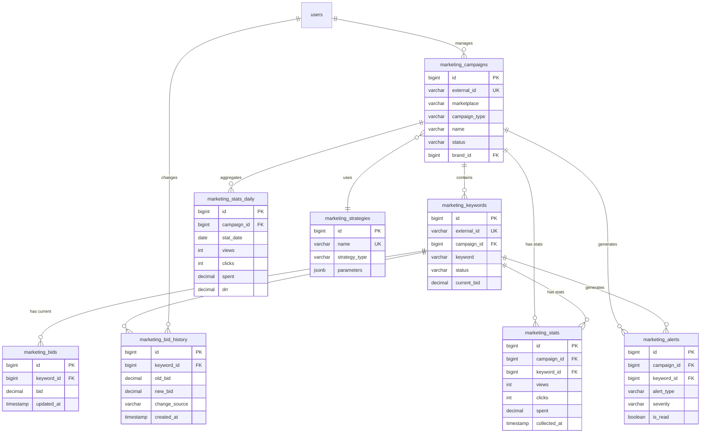

# ADOLF MARKETING — Раздел 5: Database

**Проект:** Автоматическое управление рекламными кампаниями  
**Модуль:** Marketing / Database  
**Версия:** 1.0  
**Дата:** Январь 2026

---

## 5.1 Обзор

### Назначение

Раздел описывает схему базы данных модуля Marketing: таблицы, индексы, связи, политики хранения и ретенции данных.

### Таблицы модуля

| Таблица | Описание |
|---------|----------|
| `marketing_campaigns` | Рекламные кампании |
| `marketing_keywords` | Ключевые слова |
| `marketing_bids` | Текущие ставки (snapshot) |
| `marketing_bid_history` | История изменений ставок |
| `marketing_stats` | Детальная статистика (15-минутная) |
| `marketing_stats_daily` | Агрегированная дневная статистика |
| `marketing_stats_monthly` | Агрегированная месячная статистика |
| `marketing_alerts` | Алерты Safety Logic |
| `marketing_strategies` | Конфигурации стратегий биддинга |
| `marketing_settings` | Настройки модуля |

### Используемые таблицы Core

| Таблица | Использование |
|---------|---------------|
| `users` | Роль, brand_id для фильтрации |
| `audit_log` | Запись действий пользователей |
| `notifications` | Создание уведомлений |
| `settings` | Глобальные настройки |

---

## 5.2 ER-диаграмма



---

## 5.3 Таблица marketing_campaigns

### 5.3.1 Описание

Рекламные кампании на маркетплейсах. Центральная таблица модуля.

### 5.3.2 DDL

```sql
CREATE TABLE marketing_campaigns (
    -- Первичный ключ
    id BIGSERIAL PRIMARY KEY,
    
    -- Идентификация
    external_id VARCHAR(100) NOT NULL,
    marketplace VARCHAR(20) NOT NULL,
    campaign_type VARCHAR(50) NOT NULL,
    
    -- Основные данные
    name VARCHAR(255) NOT NULL,
    status VARCHAR(30) NOT NULL DEFAULT 'draft',
    
    -- Бренд и владелец
    brand_id VARCHAR(50) NOT NULL,
    created_by_id INT REFERENCES users(id),
    
    -- Бюджеты
    daily_limit DECIMAL(15, 2) NOT NULL DEFAULT 0,
    total_budget DECIMAL(15, 2),
    spent_today DECIMAL(15, 2) NOT NULL DEFAULT 0,
    spent_total DECIMAL(15, 2) NOT NULL DEFAULT 0,
    
    -- Стратегия (FK или встроенная)
    strategy_id BIGINT REFERENCES marketing_strategies(id),
    strategy_type VARCHAR(50),
    target_position INT,
    max_bid DECIMAL(10, 2),
    bid_step DECIMAL(10, 2) DEFAULT 1.00,
    target_drr DECIMAL(5, 2),
    
    -- Даты
    start_date DATE,
    end_date DATE,
    
    -- SKU (для кампаний с привязкой к товарам)
    sku_list TEXT[],
    
    -- Дополнительные параметры маркетплейса
    extra_params JSONB DEFAULT '{}',
    
    -- Метаданные синхронизации
    last_sync_at TIMESTAMP WITH TIME ZONE,
    sync_status VARCHAR(30) DEFAULT 'pending',
    sync_error TEXT,
    
    -- Служебные поля
    created_at TIMESTAMP WITH TIME ZONE DEFAULT CURRENT_TIMESTAMP,
    updated_at TIMESTAMP WITH TIME ZONE DEFAULT CURRENT_TIMESTAMP,
    
    -- Constraints
    CONSTRAINT uq_marketing_campaigns_external 
        UNIQUE (external_id, marketplace),
    CONSTRAINT chk_marketing_campaigns_marketplace 
        CHECK (marketplace IN ('wb', 'ozon', 'ym')),
    CONSTRAINT chk_marketing_campaigns_status 
        CHECK (status IN ('draft', 'validating', 'creating', 'active', 
                          'paused', 'archived', 'error')),
    CONSTRAINT chk_marketing_campaigns_brand 
        CHECK (brand_id IN ('ohana_market', 'ohana_kids', 'shared')),
    CONSTRAINT chk_marketing_campaigns_strategy 
        CHECK (strategy_type IN ('position_hold', 'min_price', 
                                  'aggressive', 'roi_optimize') 
               OR strategy_type IS NULL),
    CONSTRAINT chk_marketing_campaigns_budget 
        CHECK (daily_limit >= 0 AND spent_today >= 0)
);

-- Комментарии
COMMENT ON TABLE marketing_campaigns IS 'Рекламные кампании на маркетплейсах';
COMMENT ON COLUMN marketing_campaigns.external_id IS 'ID кампании на маркетплейсе';
COMMENT ON COLUMN marketing_campaigns.campaign_type IS 'Тип: wb_auction, wb_auto, ozon_trafarets, ozon_search, ym_boost и др.';
COMMENT ON COLUMN marketing_campaigns.strategy_type IS 'Стратегия биддинга';
COMMENT ON COLUMN marketing_campaigns.target_position IS 'Целевая позиция (для position_hold)';
COMMENT ON COLUMN marketing_campaigns.target_drr IS 'Целевой ДРР % (для roi_optimize)';
COMMENT ON COLUMN marketing_campaigns.extra_params IS 'Специфичные параметры маркетплейса в JSON';
```

### 5.3.3 Индексы

```sql
-- Основные индексы
CREATE INDEX idx_marketing_campaigns_marketplace 
    ON marketing_campaigns(marketplace);

CREATE INDEX idx_marketing_campaigns_status 
    ON marketing_campaigns(status);

CREATE INDEX idx_marketing_campaigns_brand_id 
    ON marketing_campaigns(brand_id);

CREATE INDEX idx_marketing_campaigns_created_by 
    ON marketing_campaigns(created_by_id);

-- Составные индексы для частых запросов
CREATE INDEX idx_marketing_campaigns_active_mp 
    ON marketing_campaigns(marketplace, status) 
    WHERE status = 'active';

CREATE INDEX idx_marketing_campaigns_brand_status 
    ON marketing_campaigns(brand_id, status);

-- Индекс для синхронизации
CREATE INDEX idx_marketing_campaigns_sync 
    ON marketing_campaigns(last_sync_at, sync_status)
    WHERE sync_status != 'ok';
```

### 5.3.4 Триггер обновления

```sql
CREATE TRIGGER trigger_marketing_campaigns_updated_at
    BEFORE UPDATE ON marketing_campaigns
    FOR EACH ROW
    EXECUTE FUNCTION update_updated_at();
```

---

## 5.4 Таблица marketing_keywords

### 5.4.1 Описание

Ключевые слова рекламных кампаний. Основной объект управления ставками.

### 5.4.2 DDL

```sql
CREATE TABLE marketing_keywords (
    -- Первичный ключ
    id BIGSERIAL PRIMARY KEY,
    
    -- Связь с кампанией
    campaign_id BIGINT NOT NULL REFERENCES marketing_campaigns(id) ON DELETE CASCADE,
    
    -- Идентификация на маркетплейсе
    external_id VARCHAR(100),
    
    -- Ключевое слово
    keyword VARCHAR(255) NOT NULL,
    match_type VARCHAR(20) DEFAULT 'phrase',
    
    -- Статус
    status VARCHAR(30) NOT NULL DEFAULT 'active',
    pause_reason VARCHAR(100),
    paused_at TIMESTAMP WITH TIME ZONE,
    paused_by VARCHAR(50),  -- 'user', 'safety_logic', 'api_sync'
    
    -- Текущая ставка
    current_bid DECIMAL(10, 2) NOT NULL DEFAULT 0,
    
    -- Рекомендации от маркетплейса
    recommended_bid DECIMAL(10, 2),
    min_bid DECIMAL(10, 2),
    
    -- Лимиты (наследуются от кампании или персональные)
    max_bid_override DECIMAL(10, 2),
    
    -- Привязка к SKU (если есть)
    sku VARCHAR(100),
    
    -- Текущая позиция (из последнего сбора)
    current_position INT,
    
    -- Служебные
    created_at TIMESTAMP WITH TIME ZONE DEFAULT CURRENT_TIMESTAMP,
    updated_at TIMESTAMP WITH TIME ZONE DEFAULT CURRENT_TIMESTAMP,
    
    -- Constraints
    CONSTRAINT uq_marketing_keywords_external 
        UNIQUE (campaign_id, external_id),
    CONSTRAINT chk_marketing_keywords_status 
        CHECK (status IN ('active', 'paused', 'rejected', 'archived')),
    CONSTRAINT chk_marketing_keywords_match 
        CHECK (match_type IN ('exact', 'phrase', 'broad')),
    CONSTRAINT chk_marketing_keywords_bid 
        CHECK (current_bid >= 0)
);

-- Комментарии
COMMENT ON TABLE marketing_keywords IS 'Ключевые слова рекламных кампаний';
COMMENT ON COLUMN marketing_keywords.pause_reason IS 'Причина паузы: low_ctr, high_drr, zero_conversions, manual, budget';
COMMENT ON COLUMN marketing_keywords.paused_by IS 'Кто поставил на паузу: user, safety_logic, api_sync';
COMMENT ON COLUMN marketing_keywords.max_bid_override IS 'Персональный max_bid (если отличается от кампании)';
```

### 5.4.3 Индексы

```sql
-- Основные индексы
CREATE INDEX idx_marketing_keywords_campaign_id 
    ON marketing_keywords(campaign_id);

CREATE INDEX idx_marketing_keywords_status 
    ON marketing_keywords(status);

CREATE INDEX idx_marketing_keywords_sku 
    ON marketing_keywords(sku) 
    WHERE sku IS NOT NULL;

-- Составной индекс для активных ключей кампании
CREATE INDEX idx_marketing_keywords_campaign_active 
    ON marketing_keywords(campaign_id, status) 
    WHERE status = 'active';

-- Полнотекстовый поиск по ключевым словам
CREATE INDEX idx_marketing_keywords_keyword_trgm 
    ON marketing_keywords 
    USING gin (keyword gin_trgm_ops);

-- Индекс для приостановленных ключей (анализ Safety Logic)
CREATE INDEX idx_marketing_keywords_paused 
    ON marketing_keywords(paused_at, pause_reason) 
    WHERE status = 'paused';
```

### 5.4.4 Триггер обновления

```sql
CREATE TRIGGER trigger_marketing_keywords_updated_at
    BEFORE UPDATE ON marketing_keywords
    FOR EACH ROW
    EXECUTE FUNCTION update_updated_at();
```

---

## 5.5 Таблица marketing_bid_history

### 5.5.1 Описание

История изменений ставок. Используется для аудита и анализа эффективности.

### 5.5.2 DDL

```sql
CREATE TABLE marketing_bid_history (
    -- Первичный ключ
    id BIGSERIAL PRIMARY KEY,
    
    -- Связи
    keyword_id BIGINT NOT NULL REFERENCES marketing_keywords(id) ON DELETE CASCADE,
    campaign_id BIGINT NOT NULL REFERENCES marketing_campaigns(id) ON DELETE CASCADE,
    
    -- Маркетплейс (денормализация для быстрых запросов)
    marketplace VARCHAR(20) NOT NULL,
    
    -- Изменение ставки
    old_bid DECIMAL(10, 2) NOT NULL,
    new_bid DECIMAL(10, 2) NOT NULL,
    bid_change DECIMAL(10, 2) GENERATED ALWAYS AS (new_bid - old_bid) STORED,
    bid_change_pct DECIMAL(5, 2) GENERATED ALWAYS AS (
        CASE WHEN old_bid > 0 
             THEN ROUND((new_bid - old_bid) / old_bid * 100, 2) 
             ELSE 0 
        END
    ) STORED,
    
    -- Источник изменения
    change_source VARCHAR(50) NOT NULL,
    change_reason VARCHAR(255),
    
    -- Стратегия на момент изменения
    strategy_type VARCHAR(50),
    
    -- Данные Safety Logic (если применимо)
    safety_action VARCHAR(50),
    safety_reason VARCHAR(50),
    
    -- Статистика на момент изменения (snapshot)
    stats_snapshot JSONB,
    
    -- Кто изменил
    changed_by_id INT REFERENCES users(id),
    changed_by_type VARCHAR(30) NOT NULL DEFAULT 'system',
    
    -- Результат применения
    applied_at TIMESTAMP WITH TIME ZONE,
    apply_success BOOLEAN,
    apply_error TEXT,
    
    -- Служебные
    created_at TIMESTAMP WITH TIME ZONE DEFAULT CURRENT_TIMESTAMP,
    
    -- Constraints
    CONSTRAINT chk_marketing_bid_history_source 
        CHECK (change_source IN ('bid_cycle', 'manual', 'safety_logic', 
                                  'api_sync', 'strategy_change')),
    CONSTRAINT chk_marketing_bid_history_changed_by 
        CHECK (changed_by_type IN ('user', 'system', 'celery'))
);

-- Комментарии
COMMENT ON TABLE marketing_bid_history IS 'История изменений ставок';
COMMENT ON COLUMN marketing_bid_history.change_source IS 'Источник: bid_cycle, manual, safety_logic, api_sync, strategy_change';
COMMENT ON COLUMN marketing_bid_history.stats_snapshot IS 'Snapshot статистики на момент изменения (views, clicks, ctr, drr)';
COMMENT ON COLUMN marketing_bid_history.safety_action IS 'Действие Safety Logic: cap_bid, pause_keyword';
```

### 5.5.3 Индексы

```sql
-- Основные индексы
CREATE INDEX idx_marketing_bid_history_keyword_id 
    ON marketing_bid_history(keyword_id);

CREATE INDEX idx_marketing_bid_history_campaign_id 
    ON marketing_bid_history(campaign_id);

CREATE INDEX idx_marketing_bid_history_created_at 
    ON marketing_bid_history(created_at DESC);

CREATE INDEX idx_marketing_bid_history_marketplace 
    ON marketing_bid_history(marketplace);

-- Составной индекс для анализа истории ключа
CREATE INDEX idx_marketing_bid_history_keyword_time 
    ON marketing_bid_history(keyword_id, created_at DESC);

-- Индекс для анализа Safety Logic
CREATE INDEX idx_marketing_bid_history_safety 
    ON marketing_bid_history(safety_action, created_at DESC) 
    WHERE safety_action IS NOT NULL;

-- Индекс для анализа ручных изменений
CREATE INDEX idx_marketing_bid_history_manual 
    ON marketing_bid_history(changed_by_id, created_at DESC) 
    WHERE change_source = 'manual';
```

### 5.5.4 Партиционирование (опционально)

```sql
-- Для высоконагруженных систем — партиционирование по месяцам
CREATE TABLE marketing_bid_history_partitioned (
    LIKE marketing_bid_history INCLUDING ALL
) PARTITION BY RANGE (created_at);

-- Партиции на 6 месяцев вперёд
CREATE TABLE marketing_bid_history_2026_01 
    PARTITION OF marketing_bid_history_partitioned
    FOR VALUES FROM ('2026-01-01') TO ('2026-02-01');
    
CREATE TABLE marketing_bid_history_2026_02 
    PARTITION OF marketing_bid_history_partitioned
    FOR VALUES FROM ('2026-02-01') TO ('2026-03-01');
-- ... и т.д.
```

---

## 5.6 Таблица marketing_stats

### 5.6.1 Описание

Детальная статистика рекламных кампаний и ключей. Собирается каждые 15 минут.

### 5.6.2 DDL

```sql
CREATE TABLE marketing_stats (
    -- Первичный ключ
    id BIGSERIAL PRIMARY KEY,
    
    -- Связи
    campaign_id BIGINT NOT NULL REFERENCES marketing_campaigns(id) ON DELETE CASCADE,
    keyword_id BIGINT REFERENCES marketing_keywords(id) ON DELETE CASCADE,
    
    -- Маркетплейс (денормализация)
    marketplace VARCHAR(20) NOT NULL,
    
    -- Период
    collected_at TIMESTAMP WITH TIME ZONE NOT NULL DEFAULT CURRENT_TIMESTAMP,
    period_start TIMESTAMP WITH TIME ZONE,
    period_end TIMESTAMP WITH TIME ZONE,
    
    -- Основные метрики
    views INT NOT NULL DEFAULT 0,
    clicks INT NOT NULL DEFAULT 0,
    ctr DECIMAL(5, 2) GENERATED ALWAYS AS (
        CASE WHEN views > 0 
             THEN ROUND(clicks::NUMERIC / views * 100, 2) 
             ELSE 0 
        END
    ) STORED,
    
    -- Финансы
    spent DECIMAL(15, 2) NOT NULL DEFAULT 0,
    cpc DECIMAL(10, 2) GENERATED ALWAYS AS (
        CASE WHEN clicks > 0 
             THEN ROUND(spent / clicks, 2) 
             ELSE 0 
        END
    ) STORED,
    
    -- Конверсии
    orders INT NOT NULL DEFAULT 0,
    revenue DECIMAL(15, 2) NOT NULL DEFAULT 0,
    cpo DECIMAL(10, 2) GENERATED ALWAYS AS (
        CASE WHEN orders > 0 
             THEN ROUND(spent / orders, 2) 
             ELSE 0 
        END
    ) STORED,
    drr DECIMAL(5, 2) GENERATED ALWAYS AS (
        CASE WHEN revenue > 0 
             THEN ROUND(spent / revenue * 100, 2) 
             ELSE 0 
        END
    ) STORED,
    
    -- Позиции
    avg_position DECIMAL(5, 2),
    
    -- Сырые данные от API
    raw_data JSONB,
    
    -- Constraints
    CONSTRAINT chk_marketing_stats_values 
        CHECK (views >= 0 AND clicks >= 0 AND spent >= 0)
);

-- Комментарии
COMMENT ON TABLE marketing_stats IS 'Детальная статистика (собирается каждые 15 минут)';
COMMENT ON COLUMN marketing_stats.keyword_id IS 'NULL для статистики на уровне кампании';
COMMENT ON COLUMN marketing_stats.drr IS 'Доля рекламных расходов = spent / revenue * 100';
```

### 5.6.3 Индексы

```sql
-- Основные индексы
CREATE INDEX idx_marketing_stats_campaign_id 
    ON marketing_stats(campaign_id);

CREATE INDEX idx_marketing_stats_keyword_id 
    ON marketing_stats(keyword_id) 
    WHERE keyword_id IS NOT NULL;

CREATE INDEX idx_marketing_stats_collected_at 
    ON marketing_stats(collected_at DESC);

CREATE INDEX idx_marketing_stats_marketplace 
    ON marketing_stats(marketplace);

-- Составной индекс для запросов по периоду
CREATE INDEX idx_marketing_stats_campaign_time 
    ON marketing_stats(campaign_id, collected_at DESC);

CREATE INDEX idx_marketing_stats_keyword_time 
    ON marketing_stats(keyword_id, collected_at DESC) 
    WHERE keyword_id IS NOT NULL;

-- BRIN индекс для временных запросов (эффективен для append-only таблиц)
CREATE INDEX idx_marketing_stats_collected_at_brin 
    ON marketing_stats 
    USING brin (collected_at);
```

---

## 5.7 Таблица marketing_stats_daily

### 5.7.1 Описание

Агрегированная дневная статистика. Формируется ежедневно из marketing_stats.

### 5.7.2 DDL

```sql
CREATE TABLE marketing_stats_daily (
    -- Первичный ключ
    id BIGSERIAL PRIMARY KEY,
    
    -- Связи
    campaign_id BIGINT NOT NULL REFERENCES marketing_campaigns(id) ON DELETE CASCADE,
    keyword_id BIGINT REFERENCES marketing_keywords(id) ON DELETE CASCADE,
    
    -- Маркетплейс и бренд (денормализация для отчётов)
    marketplace VARCHAR(20) NOT NULL,
    brand_id VARCHAR(50) NOT NULL,
    
    -- Дата
    stat_date DATE NOT NULL,
    
    -- Основные метрики
    views INT NOT NULL DEFAULT 0,
    clicks INT NOT NULL DEFAULT 0,
    ctr DECIMAL(5, 2) NOT NULL DEFAULT 0,
    
    -- Финансы
    spent DECIMAL(15, 2) NOT NULL DEFAULT 0,
    cpc DECIMAL(10, 2) NOT NULL DEFAULT 0,
    
    -- Конверсии
    orders INT NOT NULL DEFAULT 0,
    revenue DECIMAL(15, 2) NOT NULL DEFAULT 0,
    cpo DECIMAL(10, 2) NOT NULL DEFAULT 0,
    drr DECIMAL(5, 2) NOT NULL DEFAULT 0,
    
    -- Позиции
    avg_position DECIMAL(5, 2),
    min_position INT,
    max_position INT,
    
    -- Ставки
    avg_bid DECIMAL(10, 2),
    min_bid DECIMAL(10, 2),
    max_bid DECIMAL(10, 2),
    
    -- Служебные
    created_at TIMESTAMP WITH TIME ZONE DEFAULT CURRENT_TIMESTAMP,
    
    -- Уникальность
    CONSTRAINT uq_marketing_stats_daily 
        UNIQUE (campaign_id, keyword_id, stat_date),
    CONSTRAINT chk_marketing_stats_daily_brand 
        CHECK (brand_id IN ('ohana_market', 'ohana_kids', 'shared'))
);

-- Комментарии
COMMENT ON TABLE marketing_stats_daily IS 'Агрегированная дневная статистика';
```

### 5.7.3 Индексы

```sql
-- Основные индексы
CREATE INDEX idx_marketing_stats_daily_campaign_id 
    ON marketing_stats_daily(campaign_id);

CREATE INDEX idx_marketing_stats_daily_stat_date 
    ON marketing_stats_daily(stat_date DESC);

CREATE INDEX idx_marketing_stats_daily_marketplace 
    ON marketing_stats_daily(marketplace);

CREATE INDEX idx_marketing_stats_daily_brand_id 
    ON marketing_stats_daily(brand_id);

-- Составные индексы для отчётов
CREATE INDEX idx_marketing_stats_daily_campaign_date 
    ON marketing_stats_daily(campaign_id, stat_date DESC);

CREATE INDEX idx_marketing_stats_daily_mp_date 
    ON marketing_stats_daily(marketplace, stat_date DESC);

CREATE INDEX idx_marketing_stats_daily_brand_date 
    ON marketing_stats_daily(brand_id, stat_date DESC);
```

---

## 5.8 Таблица marketing_stats_monthly

### 5.8.1 Описание

Агрегированная месячная статистика для долгосрочного хранения и аналитики.

### 5.8.2 DDL

```sql
CREATE TABLE marketing_stats_monthly (
    -- Первичный ключ
    id BIGSERIAL PRIMARY KEY,
    
    -- Связи
    campaign_id BIGINT NOT NULL REFERENCES marketing_campaigns(id) ON DELETE CASCADE,
    
    -- Маркетплейс и бренд
    marketplace VARCHAR(20) NOT NULL,
    brand_id VARCHAR(50) NOT NULL,
    
    -- Период
    stat_year INT NOT NULL,
    stat_month INT NOT NULL,
    
    -- Основные метрики
    views BIGINT NOT NULL DEFAULT 0,
    clicks BIGINT NOT NULL DEFAULT 0,
    avg_ctr DECIMAL(5, 2) NOT NULL DEFAULT 0,
    
    -- Финансы
    spent DECIMAL(15, 2) NOT NULL DEFAULT 0,
    avg_cpc DECIMAL(10, 2) NOT NULL DEFAULT 0,
    
    -- Конверсии
    orders INT NOT NULL DEFAULT 0,
    revenue DECIMAL(15, 2) NOT NULL DEFAULT 0,
    avg_cpo DECIMAL(10, 2) NOT NULL DEFAULT 0,
    avg_drr DECIMAL(5, 2) NOT NULL DEFAULT 0,
    
    -- Количество активных дней
    active_days INT NOT NULL DEFAULT 0,
    
    -- Служебные
    created_at TIMESTAMP WITH TIME ZONE DEFAULT CURRENT_TIMESTAMP,
    
    -- Уникальность
    CONSTRAINT uq_marketing_stats_monthly 
        UNIQUE (campaign_id, stat_year, stat_month)
);

-- Индексы
CREATE INDEX idx_marketing_stats_monthly_campaign_id 
    ON marketing_stats_monthly(campaign_id);

CREATE INDEX idx_marketing_stats_monthly_period 
    ON marketing_stats_monthly(stat_year DESC, stat_month DESC);

CREATE INDEX idx_marketing_stats_monthly_brand 
    ON marketing_stats_monthly(brand_id, stat_year DESC, stat_month DESC);
```

---

## 5.9 Таблица marketing_alerts

### 5.9.1 Описание

Алерты Safety Logic и аномалии. Интегрируется с системой уведомлений Core.

### 5.9.2 DDL

```sql
CREATE TABLE marketing_alerts (
    -- Первичный ключ
    id BIGSERIAL PRIMARY KEY,
    
    -- Связи
    campaign_id BIGINT NOT NULL REFERENCES marketing_campaigns(id) ON DELETE CASCADE,
    keyword_id BIGINT REFERENCES marketing_keywords(id) ON DELETE SET NULL,
    
    -- Маркетплейс и бренд
    marketplace VARCHAR(20) NOT NULL,
    brand_id VARCHAR(50) NOT NULL,
    
    -- Тип и серьёзность
    alert_type VARCHAR(50) NOT NULL,
    severity VARCHAR(20) NOT NULL DEFAULT 'info',
    
    -- Содержимое
    title VARCHAR(255) NOT NULL,
    message TEXT,
    details JSONB DEFAULT '{}',
    
    -- Действие (если было применено)
    action_taken VARCHAR(50),
    action_result JSONB,
    
    -- Статус
    is_read BOOLEAN NOT NULL DEFAULT FALSE,
    read_at TIMESTAMP WITH TIME ZONE,
    read_by_id INT REFERENCES users(id),
    
    -- Связь с notification
    notification_id INT,
    
    -- Служебные
    created_at TIMESTAMP WITH TIME ZONE DEFAULT CURRENT_TIMESTAMP,
    
    -- Constraints
    CONSTRAINT chk_marketing_alerts_type 
        CHECK (alert_type IN (
            'budget_exceeded', 'budget_warning',
            'low_ctr', 'high_drr', 'zero_conversions',
            'bid_capped', 'spending_anomaly', 'position_loss',
            'api_error', 'sync_error'
        )),
    CONSTRAINT chk_marketing_alerts_severity 
        CHECK (severity IN ('info', 'warning', 'critical'))
);

-- Комментарии
COMMENT ON TABLE marketing_alerts IS 'Алерты Safety Logic и аномалии';
COMMENT ON COLUMN marketing_alerts.action_taken IS 'Автоматическое действие: pause_campaign, pause_keyword, cap_bid';
COMMENT ON COLUMN marketing_alerts.notification_id IS 'Связь с таблицей notifications Core';
```

### 5.9.3 Индексы

```sql
-- Основные индексы
CREATE INDEX idx_marketing_alerts_campaign_id 
    ON marketing_alerts(campaign_id);

CREATE INDEX idx_marketing_alerts_brand_id 
    ON marketing_alerts(brand_id);

CREATE INDEX idx_marketing_alerts_is_read 
    ON marketing_alerts(is_read) 
    WHERE is_read = FALSE;

CREATE INDEX idx_marketing_alerts_created_at 
    ON marketing_alerts(created_at DESC);

CREATE INDEX idx_marketing_alerts_severity 
    ON marketing_alerts(severity, created_at DESC);

-- Составной индекс для панели алертов
CREATE INDEX idx_marketing_alerts_unread_brand 
    ON marketing_alerts(brand_id, is_read, created_at DESC) 
    WHERE is_read = FALSE;
```

---

## 5.10 Таблица marketing_strategies

### 5.10.1 Описание

Предустановленные и кастомные стратегии биддинга.

### 5.10.2 DDL

```sql
CREATE TABLE marketing_strategies (
    -- Первичный ключ
    id BIGSERIAL PRIMARY KEY,
    
    -- Идентификация
    name VARCHAR(100) NOT NULL,
    code VARCHAR(50) NOT NULL,
    
    -- Тип стратегии
    strategy_type VARCHAR(50) NOT NULL,
    
    -- Описание
    description TEXT,
    
    -- Параметры по умолчанию
    default_params JSONB NOT NULL DEFAULT '{}',
    
    -- Ограничения
    min_bid DECIMAL(10, 2),
    max_bid DECIMAL(10, 2),
    
    -- Применимость
    applicable_marketplaces TEXT[] DEFAULT ARRAY['wb', 'ozon', 'ym'],
    applicable_campaign_types TEXT[],
    
    -- Флаги
    is_system BOOLEAN NOT NULL DEFAULT FALSE,
    is_active BOOLEAN NOT NULL DEFAULT TRUE,
    
    -- Владелец (для кастомных)
    created_by_id INT REFERENCES users(id),
    brand_id VARCHAR(50),
    
    -- Служебные
    created_at TIMESTAMP WITH TIME ZONE DEFAULT CURRENT_TIMESTAMP,
    updated_at TIMESTAMP WITH TIME ZONE DEFAULT CURRENT_TIMESTAMP,
    
    -- Constraints
    CONSTRAINT uq_marketing_strategies_code 
        UNIQUE (code),
    CONSTRAINT chk_marketing_strategies_type 
        CHECK (strategy_type IN ('position_hold', 'min_price', 
                                  'aggressive', 'roi_optimize', 'custom'))
);

-- Комментарии
COMMENT ON TABLE marketing_strategies IS 'Стратегии биддинга (системные и кастомные)';
COMMENT ON COLUMN marketing_strategies.is_system IS 'TRUE для предустановленных стратегий';
COMMENT ON COLUMN marketing_strategies.default_params IS 'Параметры по умолчанию в JSON';
```

### 5.10.3 Начальные данные

```sql
INSERT INTO marketing_strategies (name, code, strategy_type, description, default_params, is_system) VALUES
(
    'Удержание позиции',
    'position_hold',
    'position_hold',
    'Поддержание заданной позиции в выдаче',
    '{"target_position": 5, "bid_step": 1.0}'::jsonb,
    TRUE
),
(
    'Минимальная цена',
    'min_price',
    'min_price',
    'Минимальная ставка для попадания в рекламный блок',
    '{}'::jsonb,
    TRUE
),
(
    'Агрессивный рост',
    'aggressive',
    'aggressive',
    'Максимизация показов в рамках бюджета',
    '{"bid_step": 5.0}'::jsonb,
    TRUE
),
(
    'ROI-оптимизация',
    'roi_optimize',
    'roi_optimize',
    'Ставка на основе целевого ДРР',
    '{"target_drr": 15.0, "target_position": 5}'::jsonb,
    TRUE
);
```

---

## 5.11 Таблица marketing_settings

### 5.11.1 Описание

Настройки модуля Marketing (Safety Logic, API, умолчания).

### 5.11.2 DDL

```sql
CREATE TABLE marketing_settings (
    -- Первичный ключ
    id SERIAL PRIMARY KEY,
    
    -- Ключ настройки
    key VARCHAR(100) NOT NULL,
    
    -- Скоуп
    scope VARCHAR(30) NOT NULL DEFAULT 'global',
    scope_id VARCHAR(100),
    
    -- Значение
    value JSONB NOT NULL,
    
    -- Мета
    description TEXT,
    
    -- Аудит
    updated_by_id INT REFERENCES users(id),
    updated_at TIMESTAMP WITH TIME ZONE DEFAULT CURRENT_TIMESTAMP,
    
    -- Constraints
    CONSTRAINT uq_marketing_settings 
        UNIQUE (key, scope, scope_id),
    CONSTRAINT chk_marketing_settings_scope 
        CHECK (scope IN ('global', 'marketplace', 'brand', 'campaign'))
);

-- Комментарии
COMMENT ON TABLE marketing_settings IS 'Настройки модуля Marketing';
COMMENT ON COLUMN marketing_settings.scope IS 'Область действия: global, marketplace, brand, campaign';
COMMENT ON COLUMN marketing_settings.scope_id IS 'ID области (mp code, brand_id, campaign_id)';
```

### 5.11.3 Начальные данные

```sql
-- Глобальные настройки Safety Logic
INSERT INTO marketing_settings (key, scope, value, description) VALUES
('safety_logic', 'global', '{
    "target_ctr": 3.0,
    "min_views": 1000,
    "max_drr": 15.0,
    "budget_alert_threshold": 0.8,
    "spending_anomaly_threshold": 1.5
}'::jsonb, 'Параметры Safety Logic');

-- Настройки Bid Engine
INSERT INTO marketing_settings (key, scope, value, description) VALUES
('bid_engine', 'global', '{
    "default_strategy": "position_hold",
    "default_target_position": 5,
    "default_bid_step": 1.0,
    "min_bid_change": 1.0,
    "cycle_interval_minutes": 15
}'::jsonb, 'Параметры Bid Engine');

-- Настройки по маркетплейсам
INSERT INTO marketing_settings (key, scope, scope_id, value, description) VALUES
('api_limits', 'marketplace', 'wb', '{
    "requests_per_minute": 100,
    "retry_delay_seconds": 30,
    "max_retries": 3
}'::jsonb, 'Лимиты API Wildberries'),
('api_limits', 'marketplace', 'ozon', '{
    "requests_per_minute": 60,
    "retry_delay_seconds": 30,
    "max_retries": 3
}'::jsonb, 'Лимиты API Ozon'),
('api_limits', 'marketplace', 'ym', '{
    "requests_per_minute": 30,
    "retry_delay_seconds": 60,
    "max_retries": 3
}'::jsonb, 'Лимиты API Яндекс.Маркет');
```

---

## 5.12 Представления (Views)

### 5.12.1 Активные кампании с текущей статистикой

```sql
CREATE OR REPLACE VIEW v_marketing_campaigns_active AS
SELECT 
    c.id,
    c.external_id,
    c.marketplace,
    c.campaign_type,
    c.name,
    c.status,
    c.brand_id,
    c.daily_limit,
    c.spent_today,
    c.max_bid,
    c.strategy_type,
    c.target_position,
    c.target_drr,
    -- Статистика за сегодня
    COALESCE(s.views, 0) as today_views,
    COALESCE(s.clicks, 0) as today_clicks,
    COALESCE(s.ctr, 0) as today_ctr,
    COALESCE(s.spent, 0) as today_spent,
    COALESCE(s.orders, 0) as today_orders,
    COALESCE(s.drr, 0) as today_drr,
    -- Количество ключей
    (SELECT COUNT(*) FROM marketing_keywords k WHERE k.campaign_id = c.id) as total_keywords,
    (SELECT COUNT(*) FROM marketing_keywords k WHERE k.campaign_id = c.id AND k.status = 'active') as active_keywords,
    -- Непрочитанные алерты
    (SELECT COUNT(*) FROM marketing_alerts a WHERE a.campaign_id = c.id AND a.is_read = FALSE) as unread_alerts
FROM marketing_campaigns c
LEFT JOIN marketing_stats_daily s 
    ON s.campaign_id = c.id 
    AND s.keyword_id IS NULL 
    AND s.stat_date = CURRENT_DATE
WHERE c.status = 'active';

COMMENT ON VIEW v_marketing_campaigns_active IS 'Активные кампании с текущей статистикой';
```

### 5.12.2 Сводка по брендам

```sql
CREATE OR REPLACE VIEW v_marketing_brand_summary AS
SELECT 
    brand_id,
    COUNT(DISTINCT c.id) as campaigns_count,
    COUNT(DISTINCT c.id) FILTER (WHERE c.status = 'active') as active_campaigns,
    SUM(c.daily_limit) as total_daily_budget,
    SUM(c.spent_today) as total_spent_today,
    -- За последние 7 дней
    COALESCE(SUM(s7.spent), 0) as spent_7d,
    COALESCE(SUM(s7.orders), 0) as orders_7d,
    COALESCE(SUM(s7.revenue), 0) as revenue_7d,
    CASE WHEN SUM(s7.revenue) > 0 
         THEN ROUND(SUM(s7.spent) / SUM(s7.revenue) * 100, 2) 
         ELSE 0 
    END as avg_drr_7d
FROM marketing_campaigns c
LEFT JOIN marketing_stats_daily s7 
    ON s7.campaign_id = c.id 
    AND s7.keyword_id IS NULL
    AND s7.stat_date >= CURRENT_DATE - INTERVAL '7 days'
WHERE c.status IN ('active', 'paused')
GROUP BY brand_id;

COMMENT ON VIEW v_marketing_brand_summary IS 'Сводка по рекламе по брендам';
```

### 5.12.3 Проблемные ключи

```sql
CREATE OR REPLACE VIEW v_marketing_problematic_keywords AS
SELECT 
    k.id,
    k.keyword,
    k.status,
    k.pause_reason,
    k.current_bid,
    c.id as campaign_id,
    c.name as campaign_name,
    c.marketplace,
    c.brand_id,
    s.views,
    s.clicks,
    s.ctr,
    s.spent,
    s.orders,
    s.drr
FROM marketing_keywords k
JOIN marketing_campaigns c ON c.id = k.campaign_id
LEFT JOIN marketing_stats_daily s 
    ON s.keyword_id = k.id 
    AND s.stat_date = CURRENT_DATE
WHERE 
    -- Приостановленные Safety Logic
    (k.status = 'paused' AND k.paused_by = 'safety_logic')
    OR
    -- Низкий CTR при достаточных показах
    (s.views > 1000 AND s.ctr < 2.0)
    OR
    -- Высокий ДРР
    (s.drr > 20.0 AND s.spent > 100)
    OR
    -- Нет конверсий при значительных расходах
    (s.spent > 500 AND s.orders = 0);

COMMENT ON VIEW v_marketing_problematic_keywords IS 'Ключи с проблемами эффективности';
```

---

## 5.13 Функции и процедуры

### 5.13.1 Агрегация дневной статистики

```sql
CREATE OR REPLACE FUNCTION fn_marketing_aggregate_daily_stats(p_date DATE)
RETURNS INT AS $$
DECLARE
    v_rows_inserted INT;
BEGIN
    INSERT INTO marketing_stats_daily (
        campaign_id, keyword_id, marketplace, brand_id, stat_date,
        views, clicks, ctr, spent, cpc, orders, revenue, cpo, drr,
        avg_position, min_position, max_position, avg_bid, min_bid, max_bid
    )
    SELECT 
        s.campaign_id,
        s.keyword_id,
        s.marketplace,
        c.brand_id,
        p_date,
        SUM(s.views),
        SUM(s.clicks),
        CASE WHEN SUM(s.views) > 0 
             THEN ROUND(SUM(s.clicks)::NUMERIC / SUM(s.views) * 100, 2) 
             ELSE 0 
        END,
        SUM(s.spent),
        CASE WHEN SUM(s.clicks) > 0 
             THEN ROUND(SUM(s.spent) / SUM(s.clicks), 2) 
             ELSE 0 
        END,
        SUM(s.orders),
        SUM(s.revenue),
        CASE WHEN SUM(s.orders) > 0 
             THEN ROUND(SUM(s.spent) / SUM(s.orders), 2) 
             ELSE 0 
        END,
        CASE WHEN SUM(s.revenue) > 0 
             THEN ROUND(SUM(s.spent) / SUM(s.revenue) * 100, 2) 
             ELSE 0 
        END,
        ROUND(AVG(s.avg_position), 2),
        MIN(s.avg_position::INT),
        MAX(s.avg_position::INT),
        ROUND(AVG(k.current_bid), 2),
        MIN(k.current_bid),
        MAX(k.current_bid)
    FROM marketing_stats s
    JOIN marketing_campaigns c ON c.id = s.campaign_id
    LEFT JOIN marketing_keywords k ON k.id = s.keyword_id
    WHERE s.collected_at::DATE = p_date
    GROUP BY s.campaign_id, s.keyword_id, s.marketplace, c.brand_id
    ON CONFLICT (campaign_id, keyword_id, stat_date) 
    DO UPDATE SET
        views = EXCLUDED.views,
        clicks = EXCLUDED.clicks,
        ctr = EXCLUDED.ctr,
        spent = EXCLUDED.spent,
        cpc = EXCLUDED.cpc,
        orders = EXCLUDED.orders,
        revenue = EXCLUDED.revenue,
        cpo = EXCLUDED.cpo,
        drr = EXCLUDED.drr,
        avg_position = EXCLUDED.avg_position;
    
    GET DIAGNOSTICS v_rows_inserted = ROW_COUNT;
    RETURN v_rows_inserted;
END;
$$ LANGUAGE plpgsql;

COMMENT ON FUNCTION fn_marketing_aggregate_daily_stats IS 'Агрегация детальной статистики в дневную';
```

### 5.13.2 Очистка старых данных

```sql
CREATE OR REPLACE FUNCTION fn_marketing_cleanup_old_data()
RETURNS TABLE (table_name TEXT, rows_deleted BIGINT) AS $$
BEGIN
    -- marketing_stats: хранить 30 дней детальных данных
    DELETE FROM marketing_stats 
    WHERE collected_at < CURRENT_TIMESTAMP - INTERVAL '30 days';
    RETURN QUERY SELECT 'marketing_stats'::TEXT, COUNT(*)::BIGINT;
    
    -- marketing_bid_history: хранить 12 месяцев
    DELETE FROM marketing_bid_history 
    WHERE created_at < CURRENT_TIMESTAMP - INTERVAL '12 months';
    RETURN QUERY SELECT 'marketing_bid_history'::TEXT, COUNT(*)::BIGINT;
    
    -- marketing_alerts: хранить 6 месяцев
    DELETE FROM marketing_alerts 
    WHERE created_at < CURRENT_TIMESTAMP - INTERVAL '6 months';
    RETURN QUERY SELECT 'marketing_alerts'::TEXT, COUNT(*)::BIGINT;
    
    -- marketing_stats_daily: хранить 24 месяца
    DELETE FROM marketing_stats_daily 
    WHERE stat_date < CURRENT_DATE - INTERVAL '24 months';
    RETURN QUERY SELECT 'marketing_stats_daily'::TEXT, COUNT(*)::BIGINT;
END;
$$ LANGUAGE plpgsql;

COMMENT ON FUNCTION fn_marketing_cleanup_old_data IS 'Очистка старых данных согласно политике ретенции';
```

---

## 5.14 Политики ретенции

| Таблица | Период хранения | Агрегация |
|---------|-----------------|-----------|
| `marketing_stats` | 30 дней | → marketing_stats_daily |
| `marketing_stats_daily` | 24 месяца | → marketing_stats_monthly |
| `marketing_stats_monthly` | Бессрочно | — |
| `marketing_bid_history` | 12 месяцев | — |
| `marketing_alerts` | 6 месяцев | — |
| `marketing_campaigns` | Бессрочно (archived) | — |
| `marketing_keywords` | Бессрочно (archived) | — |

---

## 5.15 Миграции

### 5.15.1 Структура файлов миграций

```
migrations/
└── marketing/
    ├── 001_create_marketing_strategies.sql
    ├── 002_create_marketing_campaigns.sql
    ├── 003_create_marketing_keywords.sql
    ├── 004_create_marketing_bid_history.sql
    ├── 005_create_marketing_stats.sql
    ├── 006_create_marketing_stats_daily.sql
    ├── 007_create_marketing_stats_monthly.sql
    ├── 008_create_marketing_alerts.sql
    ├── 009_create_marketing_settings.sql
    ├── 010_create_views.sql
    ├── 011_create_functions.sql
    └── 012_insert_initial_data.sql
```

---

**Документ подготовлен:** Январь 2026  
**Версия:** 1.0  
**Статус:** Черновик
