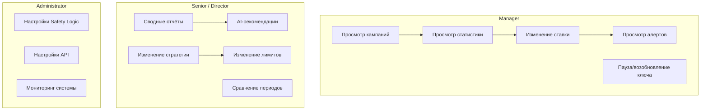
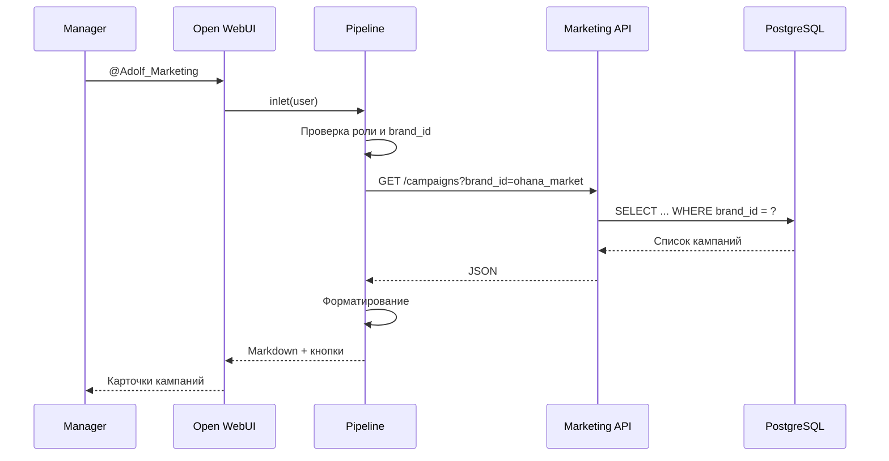
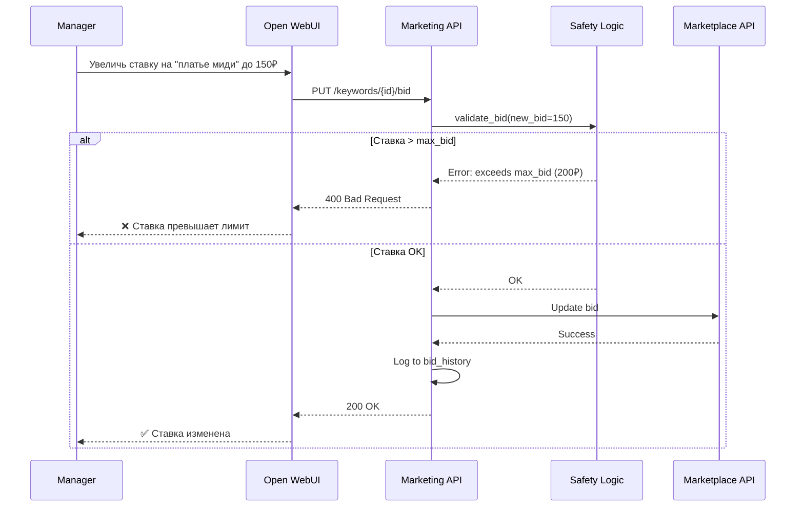
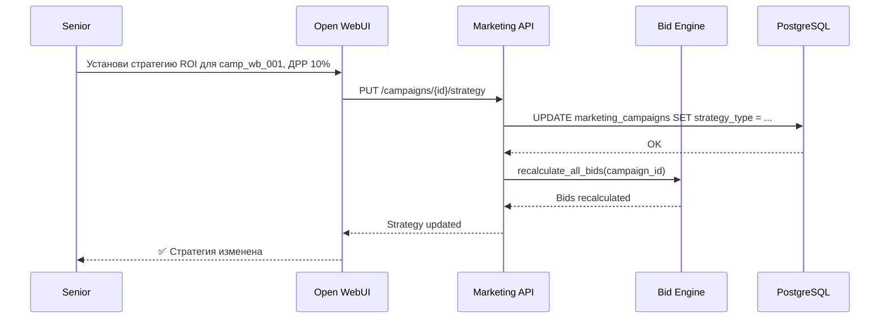
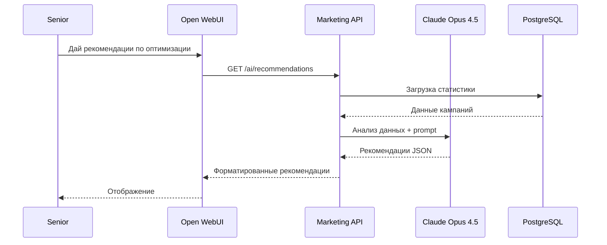
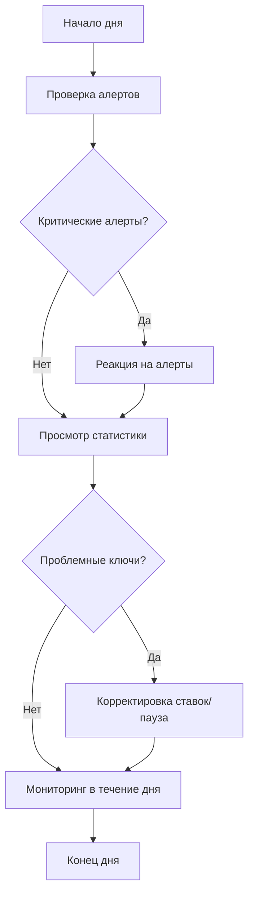
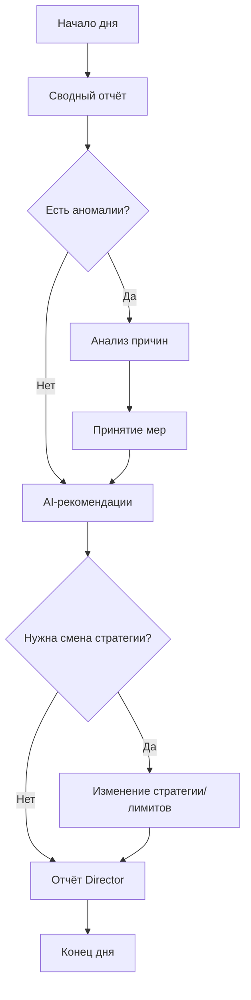

**Проект:** Автоматическое управление рекламными кампаниями  
**Модуль:** Marketing / Scenarios  
**Версия:** 1.0  
**Дата:** Январь 2026

---

## 6.1 Обзор сценариев

### Матрица сценариев по ролям

| Сценарий | Manager | Senior | Director | Admin |
|----------|:-------:|:------:|:--------:|:-----:|
| Просмотр кампаний | ✅ (brand) | ✅ | ✅ | ✅ |
| Просмотр статистики | ✅ (brand) | ✅ | ✅ | ✅ |
| Изменение ставки | ✅* | ✅ | ✅ | ✅ |
| Пауза/возобновление ключа | ✅ | ✅ | ✅ | ✅ |
| Пауза/возобновление кампании | ✅ | ✅ | ✅ | ✅ |
| Просмотр алертов | ✅ (brand) | ✅ | ✅ | ✅ |
| Изменение стратегии | ❌ | ✅ | ✅ | ✅ |
| Изменение лимитов | ❌ | ✅ | ✅ | ✅ |
| Сводные отчёты | ❌ | ✅ | ✅ | ✅ |
| AI-рекомендации | ❌ | ✅ | ✅ | ✅ |
| Настройки Safety Logic | ❌ | ❌ | ❌ | ✅ |

**\*** Manager может изменять ставки только в пределах max_bid кампании.

### Карта сценариев



---

## 6.2 Сценарии Manager

### 6.2.1 Просмотр рекламных кампаний

**Цель:** Получить обзор активных кампаний по своему бренду.

**Предусловия:**
- Пользователь авторизован с ролью Manager
- Пользователю назначен brand_id

**Диаграмма:**



**Пример диалога:**

```
Manager: Покажи мои рекламные кампании

@Adolf_Marketing: 📊 **Рекламные кампании (Охана Маркет):**

### 🟣 Wildberries

---
🟢 **Летняя коллекция 2026**
ID: `camp_wb_001` | Аукцион
Бюджет: 5 000 ₽/день | Max Bid: 200 ₽
Сегодня: 3 240 ₽ | CTR: 3.8% | ДРР: 12.5%

[📊 Статистика] [🔑 Ключи] [⏸️ Пауза]

---
🟢 **Базовая коллекция**
ID: `camp_wb_002` | Автоматическая
Бюджет: 3 000 ₽/день | Max Bid: 150 ₽
Сегодня: 1 850 ₽ | CTR: 2.9% | ДРР: 15.2%

[📊 Статистика] [🔑 Ключи] [⏸️ Пауза]

### 🔵 Ozon

---
🟢 **Трафареты Лето**
ID: `camp_oz_001` | Трафареты
Бюджет: 4 000 ₽/день | Max Bid: 180 ₽
Сегодня: 2 100 ₽ | CTR: 3.2% | ДРР: 11.8%

[📊 Статистика] [🔑 Ключи] [⏸️ Пауза]
```

**Ожидаемый результат:**
- Список кампаний только по бренду пользователя
- Кнопки для дальнейших действий
- Текущая статистика за сегодня

---

### 6.2.2 Просмотр статистики кампании

**Цель:** Детальный анализ эффективности кампании за период.

**Пример диалога:**

```
Manager: Статистика кампании camp_wb_001 за неделю

@Adolf_Marketing: 📈 **Статистика: Летняя коллекция 2026**

Маркетплейс: WB | Статус: 🟢 Active
Стратегия: Position Hold (позиция 5)

### Метрики за 7 дней

| Метрика | Значение |
|---------|----------|
| Показы | 45 230 |
| Клики | 1 718 |
| CTR | 3.80% |
| Расход | 22 540 ₽ |
| CPC | 13.12 ₽ |
| Заказы | 156 |
| Выручка | 195 000 ₽ |
| CPO | 144.49 ₽ |
| ДРР | 11.56% |

### Топ-5 ключевых слов

| Ключ | Ставка | CTR | ДРР |
|------|--------|-----|-----|
| летнее платье женское | 120 ₽ | 4.2% | 8.5% |
| платье миди | 95 ₽ | 3.8% | 10.2% |
| сарафан летний | 110 ₽ | 3.5% | 12.1% |
| платье в горошек | 85 ₽ | 4.0% | 7.8% |
| платье на лето | 100 ₽ | 3.2% | 14.5% |

[🔑 Все ключи] [📊 По дням] [⬇️ Excel]
```

---

### 6.2.3 Изменение ставки ключевого слова

**Цель:** Скорректировать ставку для улучшения позиции или экономии.

**Ограничения Manager:**
- Ставка не может превышать max_bid кампании
- Ставка не может быть ниже min_bid маркетплейса

**Диаграмма:**



**Пример диалога (успешное изменение):**

```
Manager: Увеличь ставку на "платье миди" до 120 рублей

@Adolf_Marketing: ✅ Ставка изменена: **95 ₽** → **120 ₽** (+25 ₽)

Ключевое слово: "платье миди"
Кампания: Летняя коллекция 2026

[⬆️ +10₽] [⬇️ -10₽] [📊 Статистика]
```

**Пример диалога (превышение лимита):**

```
Manager: Установи ставку 250 рублей на "платье миди"

@Adolf_Marketing: ❌ Ставка 250 ₽ превышает максимальный лимит 
кампании (200 ₽).

Для увеличения лимита обратитесь к Senior Manager.

Текущая ставка: 95 ₽
Максимально возможная: 200 ₽
```

---

### 6.2.4 Пауза и возобновление ключевого слова

**Цель:** Временно отключить неэффективный ключ.

**Пример диалога:**

```
Manager: Приостанови ключ "футболка оверсайз" в кампании camp_wb_001

@Adolf_Marketing: ⏸️ Ключевое слово приостановлено.

Ключ: "футболка оверсайз"
Кампания: Летняя коллекция 2026
Причина: ручная пауза

Статистика на момент паузы:
- Показы: 2 340
- CTR: 1.8%
- ДРР: 22.5%

[▶️ Возобновить] [📊 История]
```

```
Manager: Возобнови ключ "футболка оверсайз"

@Adolf_Marketing: ▶️ Ключевое слово возобновлено.

Ключ: "футболка оверсайз"
Текущая ставка: 85 ₽

⚠️ Обратите внимание: ключ был приостановлен из-за низкого CTR.
Рекомендую пересмотреть ставку или дождаться накопления статистики.
```

---

### 6.2.5 Просмотр алертов

**Цель:** Отслеживать важные события по своим кампаниям.

**Пример диалога:**

```
Manager: Покажи алерты

@Adolf_Marketing: 🔔 **Алерты Marketing (Охана Маркет)**

---
⚠️ **Бюджет 80%**
Кампания: Летняя коллекция 2026 | WB
Израсходовано 4 000 из 5 000 ₽ (80%)
_14:30 сегодня_

[📊 Статистика] [⏸️ Пауза]

---
🔴 **Ключ приостановлен (Safety Logic)**
Кампания: Базовая коллекция | WB
Ключ: "толстовка женская"
Причина: ДРР > 20% (было 24.5%)
_12:15 сегодня_

[▶️ Возобновить] [📊 Детали]

---
ℹ️ **Рекомендуемая ставка > Max Bid**
Кампания: Трафареты Лето | Ozon
Ключ: "платье в пол"
Рекомендуемая: 220 ₽, Max Bid: 180 ₽
_10:45 сегодня_

[📊 Детали]

Всего непрочитанных: 3
```

---

### 6.2.6 Пауза и возобновление кампании

**Цель:** Полностью остановить кампанию при необходимости.

**Пример диалога:**

```
Manager: Приостанови кампанию Базовая коллекция

@Adolf_Marketing: ⏸️ Кампания приостановлена.

Кампания: Базовая коллекция
Маркетплейс: WB
Статус: ⏸️ Paused

Статистика на момент паузы:
- Сегодня: 1 850 ₽
- CTR: 2.9%
- ДРР: 15.2%
- Активных ключей: 12

[▶️ Возобновить] [📊 История]
```

---

## 6.3 Сценарии Senior / Director

### 6.3.1 Изменение стратегии биддинга

**Цель:** Переключить кампанию на другую стратегию оптимизации.

**Доступные стратегии:**

| Стратегия | Код | Описание |
|-----------|-----|----------|
| Удержание позиции | position_hold | Поддержание заданной позиции |
| Минимальная цена | min_price | Минимальная ставка для показа |
| Агрессивный рост | aggressive | Максимизация показов |
| ROI-оптимизация | roi_optimize | Ставка на основе целевого ДРР |

**Диаграмма:**



**Пример диалога:**

```
Senior: Установи стратегию ROI для кампании Летняя коллекция, целевой ДРР 10%

@Adolf_Marketing: ✅ Стратегия изменена.

Кампания: Летняя коллекция 2026
Предыдущая стратегия: Position Hold (позиция 5)
Новая стратегия: **ROI Optimize**
Целевой ДРР: 10%

⚙️ Ставки будут пересчитаны на следующем цикле (в течение 15 минут).

Формула расчёта:
```
max_cpc = (avg_order_value × (1 - target_drr)) / conversion_rate
```

При текущих показателях (AOV: 1 250 ₽, CR: 3.4%):
max_cpc ≈ 110 ₽

[📊 Статистика] [🔄 Вернуть Position Hold]
```

---

### 6.3.2 Изменение лимитов кампании

**Цель:** Скорректировать дневной бюджет или максимальную ставку.

**Пример диалога:**

```
Senior: Увеличь дневной бюджет для Летняя коллекция до 8000 рублей

@Adolf_Marketing: ✅ Лимиты обновлены.

Кампания: Летняя коллекция 2026

| Параметр | Было | Стало |
|----------|------|-------|
| Daily Limit | 5 000 ₽ | 8 000 ₽ |
| Max Bid | 200 ₽ | 200 ₽ (без изменений) |

Расход сегодня: 3 240 ₽ (40.5% от нового лимита)

[📊 Статистика] [⚙️ Настройки]
```

```
Senior: Установи max bid 250 рублей для кампании Летняя коллекция

@Adolf_Marketing: ✅ Max Bid обновлён.

Кампания: Летняя коллекция 2026
Предыдущий Max Bid: 200 ₽
Новый Max Bid: **250 ₽**

⚠️ Внимание: 3 ключа имеют ставки близкие к предыдущему лимиту.
Они могут быть автоматически увеличены на следующем цикле.

[🔑 Показать ключи] [📊 Статистика]
```

---

### 6.3.3 Сводный отчёт по рекламе

**Цель:** Получить общую картину эффективности рекламы по всем кампаниям.

**Пример диалога:**

```
Senior: Сводка по рекламе за неделю

@Adolf_Marketing: 📊 **Сводный отчёт (7 дней)**

### Общие показатели

| Метрика | Значение |
|---------|----------|
| Активных кампаний | 8 |
| Общий расход | 156 420 ₽ |
| Средний ДРР | 12.4% |
| Общий CTR | 3.2% |
| Заказы | 842 |
| Выручка | 1 261 500 ₽ |

### По маркетплейсам

| МП | Расход | ДРР | CTR | Заказы |
|----|--------|-----|-----|--------|
| 🟣 WB | 89 200 ₽ | 11.8% | 3.5% | 512 |
| 🔵 Ozon | 52 100 ₽ | 13.2% | 2.9% | 265 |
| 🟡 YM | 15 120 ₽ | 14.1% | 2.6% | 65 |

### По брендам

| Бренд | Расход | ДРР | Заказы |
|-------|--------|-----|--------|
| Охана Маркет | 112 340 ₽ | 11.9% | 625 |
| Охана Кидс | 44 080 ₽ | 13.8% | 217 |

[📊 По кампаниям] [📈 Динамика] [⬇️ Excel]
```

---

### 6.3.4 AI-рекомендации по оптимизации

**Цель:** Получить интеллектуальный анализ и рекомендации от AI.

**Диаграмма:**



**Пример диалога:**

```
Director: Дай рекомендации по оптимизации рекламы

@Adolf_Marketing: 💡 **AI-рекомендации по оптимизации**

---
🔴 **1. Критически высокий ДРР в кампании "Базовая коллекция WB"**

ДРР составляет 18.5% при целевом 15%. Основной вклад вносят 
3 ключевых слова с ДРР > 25%:
- "худи женское" — ДРР 28.4%
- "свитшот" — ДРР 26.1%
- "джемпер" — ДРР 25.8%

**Действие:** Приостановить указанные ключи или снизить ставки на 40%.
**Ожидаемый эффект:** Снижение ДРР до 13-14%
**Риски:** Временное падение заказов на 15-20%

[⏸️ Приостановить ключи] [⬇️ Снизить ставки]

---
🟡 **2. Недоиспользован бюджет в кампании "Трафареты Ozon"**

За последние 7 дней бюджет использован в среднем на 62%.
CTR высокий (4.1%), ДРР низкий (9.2%).

**Действие:** Увеличить ставки на топовых ключах на 15-20% 
для улучшения позиций.
**Ожидаемый эффект:** Рост заказов на 25-30%
**Риски:** Минимальные, есть запас по бюджету

[⬆️ Увеличить ставки]

---
🟢 **3. Высокоэффективный ключ "платье в горошек"**

Показатели за 7 дней:
- CTR: 4.8% (выше среднего на 50%)
- ДРР: 6.2% (ниже целевого в 2 раза)
- Конверсия: 4.1%

**Действие:** Увеличить Max Bid и дневной бюджет кампании.
**Ожидаемый эффект:** Рост заказов на 40-50%
**Риски:** Низкие, показатели стабильны

[⬆️ Масштабировать]

---

**Общий потенциал оптимизации:**
- Сокращение расходов: ~12 000 ₽/неделю
- Рост заказов: ~15%
- Целевой ДРР: 11-12%
```

---

### 6.3.5 Сравнение периодов

**Цель:** Оценить динамику эффективности.

**Пример диалога:**

```
Director: Сравни показатели за эту и прошлую неделю

@Adolf_Marketing: 📊 **Сравнение периодов**

| Метрика | Прошлая неделя | Текущая неделя | Изменение |
|---------|---------------:|---------------:|----------:|
| Расход | 142 800 ₽ | 156 420 ₽ | +9.5% 📈 |
| Заказы | 768 | 842 | +9.6% 📈 |
| Выручка | 1 152 000 ₽ | 1 261 500 ₽ | +9.5% 📈 |
| ДРР | 12.4% | 12.4% | 0% ➡️ |
| CTR | 3.0% | 3.2% | +6.7% 📈 |
| CPC | 14.20 ₽ | 13.12 ₽ | -7.6% 📉 |
| CPO | 186 ₽ | 186 ₽ | 0% ➡️ |

### Анализ

✅ **Позитивные тренды:**
- Рост заказов и выручки опережает рост расходов
- CTR улучшился, качество трафика выше
- CPC снизился — лучше позиции при меньших ставках

⚠️ **Области внимания:**
- ДРР стабилен, но близок к верхней границе (15%)
- Wildberries показывает замедление роста (+5%)

[📈 Детальный график] [📊 По кампаниям]
```

---

## 6.4 Сценарии Administrator

### 6.4.1 Настройка Safety Logic

**Цель:** Изменить параметры автоматической защиты от неэффективных расходов.

**Пример диалога:**

```
Admin: Покажи настройки Safety Logic

@Adolf_Marketing: ⚙️ **Настройки Safety Logic**

### Текущие параметры

| Параметр | Значение | Описание |
|----------|----------|----------|
| target_ctr | 3.0% | Минимальный CTR |
| min_views | 1 000 | Порог показов для оценки |
| max_drr | 15.0% | Максимальный ДРР |
| budget_alert_threshold | 80% | Порог алерта бюджета |
| spending_anomaly_threshold | 150% | Порог аномалии расходов |

### Правила

| Правило | Условие | Действие |
|---------|---------|----------|
| SL-01 | spent ≥ daily_limit | PAUSE_CAMPAIGN |
| SL-02 | spent ≥ 80% daily_limit | ALERT |
| SL-03 | ctr < 3% AND views ≥ 1000 | PAUSE_KEYWORD |
| SL-04 | drr > 15% AND views ≥ 1000 | PAUSE_KEYWORD |
| SL-05 | orders = 0 AND views ≥ 1000 | PAUSE_KEYWORD |
| SL-06 | bid > max_bid | CAP_BID + ALERT |
| SL-07 | today_spent > avg × 1.5 | ALERT |

[✏️ Изменить параметры]
```

```
Admin: Установи max_drr 12%

@Adolf_Marketing: ✅ Параметр обновлён.

| Параметр | Было | Стало |
|----------|------|-------|
| max_drr | 15.0% | **12.0%** |

⚠️ Внимание: более строгий порог может привести к приостановке 
большего количества ключей. 

Текущее состояние:
- Ключей с ДРР > 12%: 24
- Из них с достаточной статистикой: 18

Эти ключи будут приостановлены на следующем цикле Safety Logic.

[↩️ Отменить] [✅ Подтвердить]
```

---

### 6.4.2 Мониторинг системы

**Цель:** Контроль работоспособности модуля Marketing.

**Пример диалога:**

```
Admin: Статус системы Marketing

@Adolf_Marketing: 🖥️ **Статус модуля Marketing**

### Сервисы

| Сервис | Статус | Последний запуск |
|--------|--------|------------------|
| Bid Cycle | 🟢 Running | 3 мин назад |
| Stats Collector (WB) | 🟢 OK | 5 мин назад |
| Stats Collector (Ozon) | 🟢 OK | 7 мин назад |
| Stats Collector (YM) | 🟡 Delayed | 12 мин назад |
| Analytics | 🟢 OK | 1 час назад |

### Последний Bid Cycle

| Метрика | Значение |
|---------|----------|
| Продолжительность | 2 мин 34 сек |
| Кампаний обработано | 8 |
| Ключей обработано | 156 |
| Ставок обновлено | 42 |
| Ключей приостановлено | 3 |
| Ошибок | 0 |

### API маркетплейсов

| МП | Статус | Rate Limit | Ошибки (24ч) |
|----|--------|------------|--------------|
| WB | 🟢 OK | 45/100 | 0 |
| Ozon | 🟢 OK | 28/60 | 2 |
| YM | 🟡 Slow | 25/30 | 5 |

### Очереди Celery

| Очередь | Задач в очереди | Workers |
|---------|-----------------|---------|
| marketing_high | 0 | 2 |
| marketing_default | 3 | 2 |
| marketing_low | 12 | 1 |

[🔄 Обновить] [📋 Логи] [⚙️ Настройки]
```

---

## 6.5 Типичный рабочий день

### 6.5.1 Manager



### 6.5.2 Senior



---

## 6.6 Чек-листы по ролям

### 6.6.1 Manager — ежедневный чек-лист

| Действие | Частота |
|----------|---------|
| Проверить алерты | Сразу при получении |
| Просмотреть статистику кампаний | 2-3 раза в день |
| Проверить приостановленные ключи | 1 раз в день |
| Оценить использование бюджета | 1 раз в день |
| Скорректировать ставки (при необходимости) | По ситуации |

### 6.6.2 Senior — еженедельный чек-лист

| Действие | Частота |
|----------|---------|
| Анализ сводного отчёта | Еженедельно (понедельник) |
| Просмотр AI-рекомендаций | 2-3 раза в неделю |
| Корректировка стратегий | По необходимости |
| Корректировка лимитов | По необходимости |
| Сравнение периодов | Еженедельно |
| Отчёт Director | Еженедельно |

### 6.6.3 Administrator — еженедельный чек-лист

| Действие | Частота |
|----------|---------|
| Мониторинг статуса системы | Ежедневно |
| Проверка логов ошибок | 2-3 раза в неделю |
| Анализ эффективности Safety Logic | Еженедельно |
| Корректировка параметров | По необходимости |
| Проверка rate limits API | Еженедельно |

---

## Приложение А: Типичные запросы по ролям

### Manager

- "Покажи мои кампании"
- "Статистика кампании X за неделю"
- "Увеличь ставку на ключ Y до Z рублей"
- "Приостанови ключ Y"
- "Покажи алерты"
- "Приостанови кампанию X"

### Senior

- "Сводка по рекламе за неделю"
- "Установи стратегию ROI для кампании X"
- "Увеличь дневной бюджет до Y рублей"
- "Дай рекомендации по оптимизации"
- "Сравни показатели за эту и прошлую неделю"

### Director

- "Общая эффективность рекламы по брендам"
- "Какие кампании самые неэффективные?"
- "Прогноз расходов на следующую неделю"
- "Выгрузи отчёт в Excel"

### Administrator

- "Покажи настройки Safety Logic"
- "Установи max_drr 12%"
- "Статус системы Marketing"
- "Покажи логи ошибок за сегодня"

---

**Документ подготовлен:** Январь 2026  
**Версия:** 1.0  
**Статус:** Черновик
