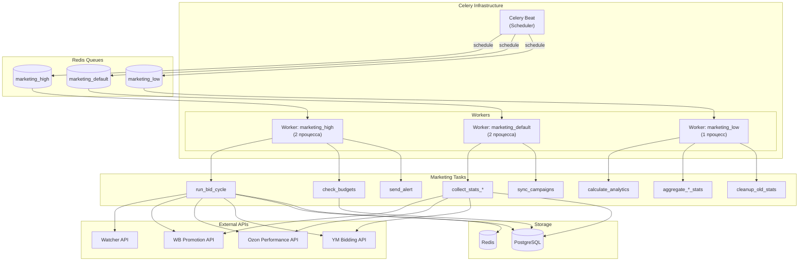

# ADOLF MARKETING — Раздел 7: Celery

**Проект:** Автоматическое управление рекламными кампаниями  
**Модуль:** Marketing / Celery  
**Версия:** 1.0  
**Дата:** Январь 2026

---

## 7.1 Обзор

### Назначение

Celery обеспечивает выполнение фоновых и периодических задач модуля Marketing:

- 15-минутный цикл корректировки ставок (Bid Cycle)
- Сбор статистики с маркетплейсов
- Проверка бюджетов и Safety Logic
- Расчёт аналитики и рекомендаций
- Агрегация статистики и очистка данных

### Реестр задач

| Задача | Тип | Очередь | Периодичность | Описание |
|--------|-----|---------|---------------|----------|
| `run_bid_cycle` | periodic | high | */15 :07 | Цикл корректировки ставок |
| `collect_stats_wb` | periodic | default | */15 :00 | Сбор статистики WB |
| `collect_stats_ozon` | periodic | default | */15 :05 | Сбор статистики Ozon |
| `collect_stats_ym` | periodic | default | */15 :10 | Сбор статистики YM |
| `check_budgets` | periodic | high | */15 :03 | Проверка бюджетов |
| `sync_campaigns` | periodic | default | */60 :00 | Синхронизация кампаний |
| `calculate_analytics` | periodic | low | 01:00 | Расчёт AI-рекомендаций |
| `aggregate_daily_stats` | periodic | low | 00:30 | Агрегация дневной статистики |
| `aggregate_monthly_stats` | periodic | low | 1-й день 02:00 | Агрегация месячной статистики |
| `cleanup_old_stats` | periodic | low | 03:00 | Очистка старых данных |
| `check_api_health` | periodic | high | */5 | Проверка доступности API |
| `apply_bid_change` | async | high | По событию | Применение изменения ставки |
| `generate_report` | async | low | По запросу | Генерация отчёта |
| `send_alert` | async | high | По событию | Отправка алерта |

### Архитектура



---

## 7.2 Конфигурация Celery

### 7.2.1 Основные настройки

```python
# app/core/celery_config.py

from celery import Celery
from celery.schedules import crontab
from kombu import Queue

from app.core.config import settings


# Создание приложения Celery
celery_app = Celery(
    "adolf_marketing",
    broker=settings.REDIS_URL,
    backend=settings.REDIS_URL,
    include=[
        "app.tasks.marketing.bid_cycle",
        "app.tasks.marketing.stats",
        "app.tasks.marketing.budgets",
        "app.tasks.marketing.sync",
        "app.tasks.marketing.analytics",
        "app.tasks.marketing.aggregation",
        "app.tasks.marketing.cleanup",
        "app.tasks.marketing.alerts",
        "app.tasks.marketing.reports",
    ]
)

# Конфигурация
celery_app.conf.update(
    # Сериализация
    task_serializer="json",
    accept_content=["json"],
    result_serializer="json",
    
    # Таймзона
    timezone="Europe/Moscow",
    enable_utc=True,
    
    # Очереди
    task_queues=(
        Queue("marketing_high", routing_key="marketing.high"),
        Queue("marketing_default", routing_key="marketing.default"),
        Queue("marketing_low", routing_key="marketing.low"),
    ),
    task_default_queue="marketing_default",
    task_default_routing_key="marketing.default",
    
    # Роутинг задач
    task_routes={
        "app.tasks.marketing.bid_cycle.*": {"queue": "marketing_high"},
        "app.tasks.marketing.budgets.*": {"queue": "marketing_high"},
        "app.tasks.marketing.alerts.*": {"queue": "marketing_high"},
        "app.tasks.marketing.stats.*": {"queue": "marketing_default"},
        "app.tasks.marketing.sync.*": {"queue": "marketing_default"},
        "app.tasks.marketing.analytics.*": {"queue": "marketing_low"},
        "app.tasks.marketing.aggregation.*": {"queue": "marketing_low"},
        "app.tasks.marketing.cleanup.*": {"queue": "marketing_low"},
        "app.tasks.marketing.reports.*": {"queue": "marketing_low"},
    },
    
    # Ретраи
    task_acks_late=True,
    task_reject_on_worker_lost=True,
    
    # Лимиты
    worker_prefetch_multiplier=2,
    worker_max_tasks_per_child=500,
    
    # Таймауты
    task_soft_time_limit=300,   # 5 минут soft limit
    task_time_limit=600,        # 10 минут hard limit
    
    # Результаты
    result_expires=3600,  # 1 час
    
    # Мониторинг
    worker_send_task_events=True,
    task_send_sent_event=True,
)
```

### 7.2.2 Beat Schedule

```python
# Расписание периодических задач
celery_app.conf.beat_schedule = {
    
    # ===== BID CYCLE (каждые 15 минут :07) =====
    "marketing-run-bid-cycle": {
        "task": "app.tasks.marketing.bid_cycle.run_bid_cycle",
        "schedule": crontab(minute="7,22,37,52"),  # :07, :22, :37, :52
        "options": {"queue": "marketing_high"}
    },
    
    # ===== STATS COLLECTION (каждые 15 минут, распределённо) =====
    
    # Wildberries: */15 :00
    "marketing-collect-stats-wb": {
        "task": "app.tasks.marketing.stats.collect_stats",
        "schedule": crontab(minute="0,15,30,45"),
        "args": ["wb"],
        "options": {"queue": "marketing_default"}
    },
    
    # Ozon: */15 :05
    "marketing-collect-stats-ozon": {
        "task": "app.tasks.marketing.stats.collect_stats",
        "schedule": crontab(minute="5,20,35,50"),
        "args": ["ozon"],
        "options": {"queue": "marketing_default"}
    },
    
    # Яндекс.Маркет: */15 :10
    "marketing-collect-stats-ym": {
        "task": "app.tasks.marketing.stats.collect_stats",
        "schedule": crontab(minute="10,25,40,55"),
        "args": ["ym"],
        "options": {"queue": "marketing_default"}
    },
    
    # ===== BUDGET CHECK (каждые 15 минут :03) =====
    "marketing-check-budgets": {
        "task": "app.tasks.marketing.budgets.check_budgets",
        "schedule": crontab(minute="3,18,33,48"),
        "options": {"queue": "marketing_high"}
    },
    
    # ===== SYNC CAMPAIGNS (каждый час :00) =====
    "marketing-sync-campaigns": {
        "task": "app.tasks.marketing.sync.sync_campaigns",
        "schedule": crontab(minute=0),
        "options": {"queue": "marketing_default"}
    },
    
    # ===== API HEALTH CHECK (каждые 5 минут) =====
    "marketing-check-api-health": {
        "task": "app.tasks.marketing.health.check_api_health",
        "schedule": crontab(minute="*/5"),
        "options": {"queue": "marketing_high"}
    },
    
    # ===== ANALYTICS (ежедневно 01:00) =====
    "marketing-calculate-analytics": {
        "task": "app.tasks.marketing.analytics.calculate_analytics",
        "schedule": crontab(hour=1, minute=0),
        "options": {"queue": "marketing_low"}
    },
    
    # ===== AGGREGATION =====
    
    # Дневная статистика (ежедневно 00:30)
    "marketing-aggregate-daily-stats": {
        "task": "app.tasks.marketing.aggregation.aggregate_daily_stats",
        "schedule": crontab(hour=0, minute=30),
        "options": {"queue": "marketing_low"}
    },
    
    # Месячная статистика (1-е число месяца 02:00)
    "marketing-aggregate-monthly-stats": {
        "task": "app.tasks.marketing.aggregation.aggregate_monthly_stats",
        "schedule": crontab(day_of_month=1, hour=2, minute=0),
        "options": {"queue": "marketing_low"}
    },
    
    # ===== CLEANUP (ежедневно 03:00) =====
    "marketing-cleanup-old-stats": {
        "task": "app.tasks.marketing.cleanup.cleanup_old_stats",
        "schedule": crontab(hour=3, minute=0),
        "options": {"queue": "marketing_low"}
    },
}
```

### 7.2.3 Визуализация расписания

```mermaid
gantt
    title Расписание задач Marketing (1 час)
    dateFormat mm
    axisFormat %M
    
    section High Priority
    run_bid_cycle :07, 3m
    check_budgets :03, 2m
    run_bid_cycle :22, 3m
    check_budgets :18, 2m
    run_bid_cycle :37, 3m
    check_budgets :33, 2m
    run_bid_cycle :52, 3m
    check_budgets :48, 2m
    
    section Default Priority
    collect_stats_wb :00, 4m
    collect_stats_ozon :05, 4m
    collect_stats_ym :10, 4m
    collect_stats_wb :15, 4m
    collect_stats_ozon :20, 4m
    collect_stats_ym :25, 4m
    collect_stats_wb :30, 4m
    collect_stats_ozon :35, 4m
    collect_stats_ym :40, 4m
    collect_stats_wb :45, 4m
    collect_stats_ozon :50, 4m
    collect_stats_ym :55, 4m
    sync_campaigns :00, 5m
```



---

## 7.3 Реализация задач

### 7.3.1 Bid Cycle — основной цикл корректировки ставок

```python
# app/tasks/marketing/bid_cycle.py

from celery import shared_task
from datetime import datetime
import logging
from typing import Dict, Any

from app.core.database import get_db_session
from app.services.marketing.bid_engine import BidEngine
from app.services.marketing.safety_logic import SafetyLogic
from app.services.marketing.adapters import get_adapter
from app.services.watcher.client import WatcherClient
from app.core.redis import get_redis, acquire_lock, release_lock


logger = logging.getLogger(__name__)


@shared_task(
    name="app.tasks.marketing.bid_cycle.run_bid_cycle",
    bind=True,
    max_retries=2,
    default_retry_delay=60,
    soft_time_limit=240,  # 4 минуты
    time_limit=300,       # 5 минут
)
def run_bid_cycle(self) -> Dict[str, Any]:
    """
    Основной цикл корректировки ставок.
    
    Выполняется каждые 15 минут:
    1. Получение активных кампаний
    2. Сбор данных (stats + Watcher)
    3. Проверка Safety Logic
    4. Расчёт новых ставок по стратегии
    5. Применение ставок через API МП
    6. Логирование изменений
    
    Returns:
        Статистика выполнения цикла
    """
    # Distributed lock — предотвращение параллельных циклов
    lock_key = "marketing:lock:bid_cycle"
    lock_acquired = acquire_lock(lock_key, timeout=300)
    
    if not lock_acquired:
        logger.warning("Bid cycle already running, skipping")
        return {"status": "skipped", "reason": "lock_not_acquired"}
    
    try:
        stats = {
            "started_at": datetime.utcnow().isoformat(),
            "campaigns_processed": 0,
            "keywords_processed": 0,
            "bids_updated": 0,
            "keywords_paused": 0,
            "campaigns_paused": 0,
            "alerts_sent": 0,
            "errors": 0,
            "marketplaces": {}
        }
        
        # Обработка по маркетплейсам
        for mp_code in ["wb", "ozon", "ym"]:
            mp_stats = _process_marketplace(mp_code)
            stats["marketplaces"][mp_code] = mp_stats
            
            stats["campaigns_processed"] += mp_stats.get("campaigns", 0)
            stats["keywords_processed"] += mp_stats.get("keywords", 0)
            stats["bids_updated"] += mp_stats.get("bids_updated", 0)
            stats["keywords_paused"] += mp_stats.get("keywords_paused", 0)
            stats["campaigns_paused"] += mp_stats.get("campaigns_paused", 0)
            stats["alerts_sent"] += mp_stats.get("alerts", 0)
            stats["errors"] += mp_stats.get("errors", 0)
        
        stats["finished_at"] = datetime.utcnow().isoformat()
        stats["status"] = "completed"
        
        # Сохранение метрик в Redis для мониторинга
        _save_cycle_metrics(stats)
        
        logger.info(f"Bid cycle completed: {stats}")
        return stats
        
    except Exception as e:
        logger.error(f"Bid cycle error: {e}")
        raise self.retry(exc=e)
        
    finally:
        release_lock(lock_key)


def _process_marketplace(mp_code: str) -> Dict[str, Any]:
    """Обработка кампаний одного маркетплейса."""
    
    mp_stats = {
        "campaigns": 0,
        "keywords": 0,
        "bids_updated": 0,
        "keywords_paused": 0,
        "campaigns_paused": 0,
        "alerts": 0,
        "errors": 0
    }
    
    try:
        adapter = get_adapter(mp_code)
        safety = SafetyLogic()
        bid_engine = BidEngine()
        watcher = WatcherClient()
        
        with get_db_session() as db:
            # Получить активные кампании маркетплейса
            campaigns = adapter.get_campaigns(status="active")
            
            for campaign in campaigns:
                try:
                    result = _process_campaign(
                        db, adapter, safety, bid_engine, watcher, campaign
                    )
                    
                    mp_stats["campaigns"] += 1
                    mp_stats["keywords"] += result.get("keywords", 0)
                    mp_stats["bids_updated"] += result.get("bids_updated", 0)
                    mp_stats["keywords_paused"] += result.get("keywords_paused", 0)
                    mp_stats["campaigns_paused"] += result.get("campaigns_paused", 0)
                    mp_stats["alerts"] += result.get("alerts", 0)
                    
                except Exception as e:
                    logger.error(f"Error processing campaign {campaign.id}: {e}")
                    mp_stats["errors"] += 1
            
            db.commit()
            
    except Exception as e:
        logger.error(f"Marketplace {mp_code} processing error: {e}")
        mp_stats["errors"] += 1
    
    return mp_stats


def _process_campaign(db, adapter, safety, bid_engine, watcher, campaign) -> Dict:
    """Обработка одной кампании."""
    
    result = {
        "keywords": 0,
        "bids_updated": 0,
        "keywords_paused": 0,
        "campaigns_paused": 0,
        "alerts": 0
    }
    
    # 1. Получить статистику кампании
    campaign_stats = adapter.get_campaign_stats(campaign.external_id)
    
    # 2. Safety Logic на уровне кампании
    camp_check = safety.check_campaign(campaign, campaign_stats)
    
    if camp_check.action == "PAUSE_CAMPAIGN":
        adapter.pause_campaign(campaign.external_id)
        _create_alert(db, campaign, None, camp_check)
        result["campaigns_paused"] = 1
        result["alerts"] = 1
        return result
    
    if camp_check.action == "ALERT":
        _create_alert(db, campaign, None, camp_check)
        result["alerts"] = 1
    
    # 3. Обработка ключевых слов
    keywords = adapter.get_keywords(campaign.external_id)
    
    for keyword in keywords:
        if keyword.status != "active":
            continue
        
        result["keywords"] += 1
        
        # Получить статистику ключа
        kw_stats = adapter.get_keyword_stats(keyword.external_id)
        
        # Safety Logic на уровне ключа
        kw_check = safety.check_keyword(keyword, kw_stats, campaign)
        
        if kw_check.action == "PAUSE_KEYWORD":
            adapter.pause_keyword(campaign.external_id, keyword.external_id)
            _update_keyword_status(db, keyword.id, "paused", kw_check.reason)
            _create_alert(db, campaign, keyword, kw_check)
            result["keywords_paused"] += 1
            result["alerts"] += 1
            continue
        
        # 4. Расчёт новой ставки
        watcher_data = watcher.get_competitor_bids(
            keyword.keyword, 
            campaign.marketplace
        )
        
        new_bid = bid_engine.calculate_bid(
            strategy=campaign.strategy_type,
            keyword=keyword,
            campaign=campaign,
            stats=kw_stats,
            watcher_data=watcher_data
        )
        
        # 5. Валидация ставки
        if new_bid > campaign.max_bid:
            new_bid = campaign.max_bid
            _create_alert(db, campaign, keyword, {
                "action": "CAP_BID",
                "reason": "bid_exceeds_max",
                "severity": "warning"
            })
            result["alerts"] += 1
        
        # 6. Применение ставки (если изменилась)
        if abs(new_bid - keyword.current_bid) >= 1.0:  # Минимальный шаг
            success = adapter.update_bid(
                campaign.external_id, 
                keyword.external_id, 
                new_bid
            )
            
            if success:
                _log_bid_change(
                    db, keyword, 
                    old_bid=keyword.current_bid, 
                    new_bid=new_bid,
                    source="bid_cycle",
                    strategy=campaign.strategy_type
                )
                result["bids_updated"] += 1
    
    return result


def _save_cycle_metrics(stats: Dict):
    """Сохранение метрик цикла в Redis."""
    redis = get_redis()
    redis.hset("marketing:last_bid_cycle", mapping={
        "started_at": stats["started_at"],
        "finished_at": stats["finished_at"],
        "status": stats["status"],
        "campaigns": stats["campaigns_processed"],
        "keywords": stats["keywords_processed"],
        "bids_updated": stats["bids_updated"],
        "errors": stats["errors"]
    })
    redis.expire("marketing:last_bid_cycle", 3600)
```

### 7.3.2 Stats Collection — сбор статистики

```python
# app/tasks/marketing/stats.py

from celery import shared_task
from datetime import datetime
import logging
from typing import Dict, Any, Literal

from app.core.database import get_db_session
from app.services.marketing.adapters import get_adapter
from app.models.marketing import MarketingStats, MarketingCampaign


logger = logging.getLogger(__name__)


@shared_task(
    name="app.tasks.marketing.stats.collect_stats",
    bind=True,
    max_retries=3,
    default_retry_delay=60,
    autoretry_for=(Exception,),
)
def collect_stats(
    self, 
    marketplace: Literal["wb", "ozon", "ym"]
) -> Dict[str, Any]:
    """
    Сбор статистики с маркетплейса.
    
    Args:
        marketplace: Код маркетплейса
    
    Returns:
        Статистика выполнения
    """
    stats = {
        "marketplace": marketplace,
        "started_at": datetime.utcnow().isoformat(),
        "campaigns_fetched": 0,
        "keywords_fetched": 0,
        "stats_saved": 0,
        "errors": 0
    }
    
    try:
        adapter = get_adapter(marketplace)
        
        with get_db_session() as db:
            # Получить активные кампании
            campaigns = db.query(MarketingCampaign).filter(
                MarketingCampaign.marketplace == marketplace,
                MarketingCampaign.status == "active"
            ).all()
            
            for campaign in campaigns:
                try:
                    # Статистика кампании
                    camp_stats = adapter.get_campaign_stats(campaign.external_id)
                    _save_campaign_stats(db, campaign, camp_stats)
                    stats["campaigns_fetched"] += 1
                    stats["stats_saved"] += 1
                    
                    # Статистика ключей
                    keywords = adapter.get_keywords(campaign.external_id)
                    for keyword in keywords:
                        kw_stats = adapter.get_keyword_stats(keyword.external_id)
                        _save_keyword_stats(db, campaign, keyword, kw_stats)
                        stats["keywords_fetched"] += 1
                        stats["stats_saved"] += 1
                    
                except Exception as e:
                    logger.error(f"Stats error for campaign {campaign.id}: {e}")
                    stats["errors"] += 1
            
            db.commit()
        
        stats["finished_at"] = datetime.utcnow().isoformat()
        stats["status"] = "completed"
        
        logger.info(f"Stats collection completed: {stats}")
        return stats
        
    except Exception as e:
        logger.error(f"Stats collection failed for {marketplace}: {e}")
        raise


def _save_campaign_stats(db, campaign, stats_data):
    """Сохранение статистики кампании."""
    stats = MarketingStats(
        campaign_id=campaign.id,
        keyword_id=None,
        marketplace=campaign.marketplace,
        collected_at=datetime.utcnow(),
        views=stats_data.views,
        clicks=stats_data.clicks,
        spent=stats_data.spent,
        orders=stats_data.orders,
        revenue=stats_data.revenue,
        avg_position=stats_data.avg_position,
        raw_data=stats_data.raw
    )
    db.add(stats)


def _save_keyword_stats(db, campaign, keyword, stats_data):
    """Сохранение статистики ключевого слова."""
    stats = MarketingStats(
        campaign_id=campaign.id,
        keyword_id=keyword.id,
        marketplace=campaign.marketplace,
        collected_at=datetime.utcnow(),
        views=stats_data.views,
        clicks=stats_data.clicks,
        spent=stats_data.spent,
        orders=stats_data.orders,
        revenue=stats_data.revenue,
        avg_position=stats_data.position,
        raw_data=stats_data.raw
    )
    db.add(stats)
```

### 7.3.3 Budget Check — проверка бюджетов

```python
# app/tasks/marketing/budgets.py

from celery import shared_task
from datetime import datetime
import logging
from typing import Dict, Any

from app.core.database import get_db_session
from app.models.marketing import MarketingCampaign, MarketingAlert
from app.services.marketing.adapters import get_adapter
from app.tasks.marketing.alerts import send_alert


logger = logging.getLogger(__name__)


@shared_task(
    name="app.tasks.marketing.budgets.check_budgets",
    bind=True,
    max_retries=2,
)
def check_budgets(self) -> Dict[str, Any]:
    """
    Проверка бюджетов всех активных кампаний.
    
    Правила:
    - spent >= daily_limit → PAUSE_CAMPAIGN
    - spent >= 80% daily_limit → ALERT (budget_warning)
    """
    stats = {
        "started_at": datetime.utcnow().isoformat(),
        "campaigns_checked": 0,
        "campaigns_paused": 0,
        "alerts_sent": 0,
        "errors": 0
    }
    
    with get_db_session() as db:
        campaigns = db.query(MarketingCampaign).filter(
            MarketingCampaign.status == "active"
        ).all()
        
        for campaign in campaigns:
            try:
                stats["campaigns_checked"] += 1
                
                # Проверка превышения бюджета
                if campaign.spent_today >= campaign.daily_limit:
                    # Пауза кампании
                    adapter = get_adapter(campaign.marketplace)
                    adapter.pause_campaign(campaign.external_id)
                    
                    campaign.status = "paused"
                    
                    # Алерт
                    send_alert.delay(
                        campaign_id=campaign.id,
                        alert_type="budget_exceeded",
                        severity="warning",
                        title=f"Кампания приостановлена: {campaign.name}",
                        message=f"Расход {campaign.spent_today}₽ достиг лимита {campaign.daily_limit}₽",
                        action_taken="pause_campaign"
                    )
                    
                    stats["campaigns_paused"] += 1
                    stats["alerts_sent"] += 1
                    
                # Предупреждение о 80%
                elif campaign.spent_today >= campaign.daily_limit * 0.8:
                    # Проверка, был ли уже алерт сегодня
                    existing = db.query(MarketingAlert).filter(
                        MarketingAlert.campaign_id == campaign.id,
                        MarketingAlert.alert_type == "budget_warning",
                        MarketingAlert.created_at >= datetime.utcnow().date()
                    ).first()
                    
                    if not existing:
                        send_alert.delay(
                            campaign_id=campaign.id,
                            alert_type="budget_warning",
                            severity="info",
                            title=f"Бюджет 80%: {campaign.name}",
                            message=f"Израсходовано {campaign.spent_today}₽ из {campaign.daily_limit}₽"
                        )
                        stats["alerts_sent"] += 1
                        
            except Exception as e:
                logger.error(f"Budget check error for campaign {campaign.id}: {e}")
                stats["errors"] += 1
        
        db.commit()
    
    stats["finished_at"] = datetime.utcnow().isoformat()
    logger.info(f"Budget check completed: {stats}")
    return stats
```

### 7.3.4 Analytics — расчёт AI-рекомендаций

```python
# app/tasks/marketing/analytics.py

from celery import shared_task
from datetime import datetime, timedelta
import logging
from typing import Dict, Any

from app.core.database import get_db_session
from app.services.marketing.analytics import AnalyticsEngine
from app.services.ai.claude import ClaudeClient


logger = logging.getLogger(__name__)


@shared_task(
    name="app.tasks.marketing.analytics.calculate_analytics",
    bind=True,
    soft_time_limit=600,   # 10 минут
    time_limit=900,        # 15 минут
)
def calculate_analytics(self) -> Dict[str, Any]:
    """
    Ежедневный расчёт AI-рекомендаций.
    
    Анализирует:
    - Аномалии расходов
    - Тренды эффективности
    - Неэффективные ключи
    - Возможности оптимизации
    
    Использует Claude Opus 4.5 для генерации рекомендаций.
    """
    stats = {
        "started_at": datetime.utcnow().isoformat(),
        "campaigns_analyzed": 0,
        "recommendations_generated": 0,
        "anomalies_detected": 0,
        "errors": 0
    }
    
    try:
        analytics = AnalyticsEngine()
        claude = ClaudeClient()
        
        with get_db_session() as db:
            # 1. Выявление аномалий
            anomalies = analytics.detect_anomalies(
                period_days=7,
                threshold=1.5
            )
            stats["anomalies_detected"] = len(anomalies)
            
            for anomaly in anomalies:
                _save_anomaly_alert(db, anomaly)
            
            # 2. Анализ трендов
            trends = analytics.analyze_trends(period_days=14)
            
            # 3. Генерация рекомендаций (Claude Opus 4.5)
            campaigns = analytics.get_active_campaigns_with_stats()
            
            for campaign in campaigns:
                try:
                    recommendations = claude.generate_recommendations(
                        campaign_data=campaign.to_dict(),
                        trends=trends.get(campaign.id),
                        anomalies=[a for a in anomalies if a.campaign_id == campaign.id]
                    )
                    
                    _save_recommendations(db, campaign.id, recommendations)
                    
                    stats["campaigns_analyzed"] += 1
                    stats["recommendations_generated"] += len(recommendations)
                    
                except Exception as e:
                    logger.error(f"Analytics error for campaign {campaign.id}: {e}")
                    stats["errors"] += 1
            
            db.commit()
        
        stats["finished_at"] = datetime.utcnow().isoformat()
        stats["status"] = "completed"
        
        logger.info(f"Analytics completed: {stats}")
        return stats
        
    except Exception as e:
        logger.error(f"Analytics calculation failed: {e}")
        raise
```

### 7.3.5 Aggregation — агрегация статистики

```python
# app/tasks/marketing/aggregation.py

from celery import shared_task
from datetime import datetime, date, timedelta
import logging
from typing import Dict, Any

from app.core.database import get_db_session
from sqlalchemy import text


logger = logging.getLogger(__name__)


@shared_task(
    name="app.tasks.marketing.aggregation.aggregate_daily_stats",
    bind=True,
)
def aggregate_daily_stats(self) -> Dict[str, Any]:
    """
    Агрегация детальной статистики в дневную.
    Выполняется ежедневно в 00:30 за предыдущий день.
    """
    yesterday = date.today() - timedelta(days=1)
    
    with get_db_session() as db:
        # Вызов функции PostgreSQL
        result = db.execute(
            text("SELECT fn_marketing_aggregate_daily_stats(:stat_date)"),
            {"stat_date": yesterday}
        )
        rows_inserted = result.scalar()
        db.commit()
    
    logger.info(f"Daily stats aggregated for {yesterday}: {rows_inserted} rows")
    return {
        "date": yesterday.isoformat(),
        "rows_inserted": rows_inserted
    }


@shared_task(
    name="app.tasks.marketing.aggregation.aggregate_monthly_stats",
    bind=True,
)
def aggregate_monthly_stats(self) -> Dict[str, Any]:
    """
    Агрегация дневной статистики в месячную.
    Выполняется 1-го числа за предыдущий месяц.
    """
    today = date.today()
    first_of_prev_month = (today.replace(day=1) - timedelta(days=1)).replace(day=1)
    last_of_prev_month = today.replace(day=1) - timedelta(days=1)
    
    with get_db_session() as db:
        result = db.execute(text("""
            INSERT INTO marketing_stats_monthly (
                campaign_id, marketplace, brand_id, stat_year, stat_month,
                views, clicks, avg_ctr, spent, avg_cpc, 
                orders, revenue, avg_cpo, avg_drr, active_days
            )
            SELECT 
                campaign_id,
                marketplace,
                brand_id,
                EXTRACT(YEAR FROM stat_date)::INT,
                EXTRACT(MONTH FROM stat_date)::INT,
                SUM(views),
                SUM(clicks),
                CASE WHEN SUM(views) > 0 
                     THEN ROUND(SUM(clicks)::NUMERIC / SUM(views) * 100, 2) 
                     ELSE 0 END,
                SUM(spent),
                CASE WHEN SUM(clicks) > 0 
                     THEN ROUND(SUM(spent) / SUM(clicks), 2) 
                     ELSE 0 END,
                SUM(orders),
                SUM(revenue),
                CASE WHEN SUM(orders) > 0 
                     THEN ROUND(SUM(spent) / SUM(orders), 2) 
                     ELSE 0 END,
                CASE WHEN SUM(revenue) > 0 
                     THEN ROUND(SUM(spent) / SUM(revenue) * 100, 2) 
                     ELSE 0 END,
                COUNT(DISTINCT stat_date)
            FROM marketing_stats_daily
            WHERE stat_date BETWEEN :start_date AND :end_date
              AND keyword_id IS NULL
            GROUP BY campaign_id, marketplace, brand_id,
                     EXTRACT(YEAR FROM stat_date), EXTRACT(MONTH FROM stat_date)
            ON CONFLICT (campaign_id, stat_year, stat_month) DO UPDATE SET
                views = EXCLUDED.views,
                clicks = EXCLUDED.clicks,
                avg_ctr = EXCLUDED.avg_ctr,
                spent = EXCLUDED.spent,
                orders = EXCLUDED.orders,
                revenue = EXCLUDED.revenue,
                active_days = EXCLUDED.active_days
        """), {
            "start_date": first_of_prev_month,
            "end_date": last_of_prev_month
        })
        
        rows = result.rowcount
        db.commit()
    
    logger.info(f"Monthly stats aggregated for {first_of_prev_month.strftime('%Y-%m')}: {rows} rows")
    return {
        "year": first_of_prev_month.year,
        "month": first_of_prev_month.month,
        "rows_inserted": rows
    }
```

### 7.3.6 Cleanup — очистка старых данных

```python
# app/tasks/marketing/cleanup.py

from celery import shared_task
from datetime import datetime
import logging
from typing import Dict, Any

from app.core.database import get_db_session
from sqlalchemy import text


logger = logging.getLogger(__name__)


@shared_task(
    name="app.tasks.marketing.cleanup.cleanup_old_stats",
    bind=True,
)
def cleanup_old_stats(self) -> Dict[str, Any]:
    """
    Очистка старых данных согласно политике ретенции.
    
    Политика:
    - marketing_stats: 30 дней
    - marketing_bid_history: 12 месяцев
    - marketing_alerts: 6 месяцев
    - marketing_stats_daily: 24 месяца
    """
    stats = {
        "started_at": datetime.utcnow().isoformat(),
        "tables_cleaned": {}
    }
    
    with get_db_session() as db:
        # marketing_stats: 30 дней
        result = db.execute(text("""
            DELETE FROM marketing_stats 
            WHERE collected_at < CURRENT_TIMESTAMP - INTERVAL '30 days'
        """))
        stats["tables_cleaned"]["marketing_stats"] = result.rowcount
        
        # marketing_bid_history: 12 месяцев
        result = db.execute(text("""
            DELETE FROM marketing_bid_history 
            WHERE created_at < CURRENT_TIMESTAMP - INTERVAL '12 months'
        """))
        stats["tables_cleaned"]["marketing_bid_history"] = result.rowcount
        
        # marketing_alerts: 6 месяцев
        result = db.execute(text("""
            DELETE FROM marketing_alerts 
            WHERE created_at < CURRENT_TIMESTAMP - INTERVAL '6 months'
        """))
        stats["tables_cleaned"]["marketing_alerts"] = result.rowcount
        
        # marketing_stats_daily: 24 месяца
        result = db.execute(text("""
            DELETE FROM marketing_stats_daily 
            WHERE stat_date < CURRENT_DATE - INTERVAL '24 months'
        """))
        stats["tables_cleaned"]["marketing_stats_daily"] = result.rowcount
        
        db.commit()
    
    stats["finished_at"] = datetime.utcnow().isoformat()
    
    total_deleted = sum(stats["tables_cleaned"].values())
    logger.info(f"Cleanup completed: {total_deleted} rows deleted")
    
    return stats
```

### 7.3.7 Alerts — отправка уведомлений

```python
# app/tasks/marketing/alerts.py

from celery import shared_task
from datetime import datetime
import logging
from typing import Dict, Any, Optional

from app.core.database import get_db_session
from app.models.marketing import MarketingAlert, MarketingCampaign
from app.models.core import Notification, User
from app.services.notification import NotificationService


logger = logging.getLogger(__name__)


@shared_task(
    name="app.tasks.marketing.alerts.send_alert",
    bind=True,
    queue="marketing_high",
)
def send_alert(
    self,
    campaign_id: int,
    alert_type: str,
    severity: str,
    title: str,
    message: str,
    keyword_id: Optional[int] = None,
    action_taken: Optional[str] = None,
    details: Optional[Dict] = None
) -> Dict[str, Any]:
    """
    Создание алерта и отправка уведомлений.
    """
    with get_db_session() as db:
        # Получить кампанию
        campaign = db.query(MarketingCampaign).get(campaign_id)
        if not campaign:
            return {"error": "Campaign not found"}
        
        # Создать запись алерта
        alert = MarketingAlert(
            campaign_id=campaign_id,
            keyword_id=keyword_id,
            marketplace=campaign.marketplace,
            brand_id=campaign.brand_id,
            alert_type=alert_type,
            severity=severity,
            title=title,
            message=message,
            details=details or {},
            action_taken=action_taken
        )
        db.add(alert)
        db.flush()
        
        # Определить получателей
        recipients = _get_alert_recipients(db, campaign, severity)
        
        # Создать уведомления
        notification_service = NotificationService()
        
        for user_id in recipients:
            notification = notification_service.create(
                user_id=user_id,
                event_type=f"marketing.{alert_type}",
                level=severity,
                title=title,
                message=message,
                data={
                    "campaign_id": campaign_id,
                    "campaign_name": campaign.name,
                    "marketplace": campaign.marketplace,
                    "alert_id": alert.id
                },
                source_module="marketing",
                source_id=str(alert.id)
            )
            alert.notification_id = notification.id
        
        db.commit()
        
        logger.info(f"Alert sent: {alert_type} for campaign {campaign_id}")
        return {
            "alert_id": alert.id,
            "recipients": len(recipients)
        }


def _get_alert_recipients(db, campaign, severity: str) -> list:
    """Определение получателей алерта."""
    
    recipients = set()
    
    # Manager кампании (по бренду)
    managers = db.query(User).filter(
        User.role == "manager",
        User.brand_id == campaign.brand_id,
        User.is_active == True
    ).all()
    
    for manager in managers:
        recipients.add(manager.id)
    
    # Senior и выше — для warning и critical
    if severity in ["warning", "critical"]:
        seniors = db.query(User).filter(
            User.role.in_(["senior", "director", "administrator"]),
            User.is_active == True
        ).all()
        
        for senior in seniors:
            recipients.add(senior.id)
    
    return list(recipients)
```

---

## 7.4 Мониторинг

### 7.4.1 Flower Dashboard

```bash
# Запуск Flower для мониторинга
celery -A app.core.celery_config flower \
    --port=5555 \
    --broker=${REDIS_URL}
```

**URL:** `http://localhost:5555`

### 7.4.2 Метрики мониторинга

| Метрика | Описание | Порог алерта |
|---------|----------|--------------|
| `bid_cycle_duration` | Длительность Bid Cycle | > 5 мин |
| `bid_cycle_errors` | Ошибки в Bid Cycle | > 0 |
| `stats_collection_lag` | Задержка сбора статистики | > 20 мин |
| `api_errors_rate` | Частота ошибок API МП | > 5% |
| `queue_length` | Размер очереди задач | > 100 |
| `worker_status` | Статус воркеров | offline |

### 7.4.3 Redis-ключи мониторинга

```python
# Структура ключей в Redis
MONITORING_KEYS = {
    # Последний Bid Cycle
    "marketing:last_bid_cycle": {
        "started_at": "ISO timestamp",
        "finished_at": "ISO timestamp",
        "status": "completed|failed",
        "campaigns": "int",
        "bids_updated": "int",
        "errors": "int"
    },
    
    # Статус API маркетплейсов
    "marketing:api_status:{mp}": {
        "status": "ok|slow|error",
        "last_check": "ISO timestamp",
        "response_time_ms": "int",
        "error_count_24h": "int"
    },
    
    # Статус воркеров
    "marketing:workers": {
        "high": "int (active workers)",
        "default": "int",
        "low": "int"
    }
}
```

### 7.4.4 Health Check Task

```python
# app/tasks/marketing/health.py

from celery import shared_task
import logging
from typing import Dict, Any

from app.core.redis import get_redis
from app.services.marketing.adapters import get_adapter


logger = logging.getLogger(__name__)


@shared_task(
    name="app.tasks.marketing.health.check_api_health",
    bind=True,
)
def check_api_health(self) -> Dict[str, Any]:
    """
    Проверка доступности API маркетплейсов.
    """
    redis = get_redis()
    results = {}
    
    for mp_code in ["wb", "ozon", "ym"]:
        try:
            adapter = get_adapter(mp_code)
            start = datetime.utcnow()
            
            # Простой запрос для проверки
            adapter.ping()
            
            response_time = (datetime.utcnow() - start).total_seconds() * 1000
            
            status = "ok" if response_time < 2000 else "slow"
            
            redis.hset(f"marketing:api_status:{mp_code}", mapping={
                "status": status,
                "last_check": datetime.utcnow().isoformat(),
                "response_time_ms": int(response_time)
            })
            
            results[mp_code] = {
                "status": status,
                "response_time_ms": int(response_time)
            }
            
        except Exception as e:
            logger.error(f"API health check failed for {mp_code}: {e}")
            
            # Инкремент счётчика ошибок
            redis.hincrby(f"marketing:api_status:{mp_code}", "error_count_24h", 1)
            redis.hset(f"marketing:api_status:{mp_code}", mapping={
                "status": "error",
                "last_check": datetime.utcnow().isoformat(),
                "last_error": str(e)
            })
            
            results[mp_code] = {
                "status": "error",
                "error": str(e)
            }
    
    return results
```

---

## 7.5 Запуск и управление

### 7.5.1 Docker Compose

```yaml
# docker-compose.yml (фрагмент)

services:
  marketing-beat:
    build: .
    command: celery -A app.core.celery_config beat --loglevel=info
    environment:
      - REDIS_URL=redis://redis:6379/0
      - DATABASE_URL=postgresql://...
    depends_on:
      - redis
      - postgres
    restart: unless-stopped

  marketing-worker-high:
    build: .
    command: >
      celery -A app.core.celery_config worker 
      --queues=marketing_high 
      --concurrency=2 
      --loglevel=info
    environment:
      - REDIS_URL=redis://redis:6379/0
      - DATABASE_URL=postgresql://...
    depends_on:
      - redis
      - postgres
    restart: unless-stopped
    deploy:
      replicas: 1

  marketing-worker-default:
    build: .
    command: >
      celery -A app.core.celery_config worker 
      --queues=marketing_default 
      --concurrency=2 
      --loglevel=info
    environment:
      - REDIS_URL=redis://redis:6379/0
      - DATABASE_URL=postgresql://...
    depends_on:
      - redis
      - postgres
    restart: unless-stopped
    deploy:
      replicas: 1

  marketing-worker-low:
    build: .
    command: >
      celery -A app.core.celery_config worker 
      --queues=marketing_low 
      --concurrency=1 
      --loglevel=info
    environment:
      - REDIS_URL=redis://redis:6379/0
      - DATABASE_URL=postgresql://...
    depends_on:
      - redis
      - postgres
    restart: unless-stopped
    deploy:
      replicas: 1

  marketing-flower:
    build: .
    command: celery -A app.core.celery_config flower --port=5555
    ports:
      - "5555:5555"
    environment:
      - REDIS_URL=redis://redis:6379/0
    depends_on:
      - redis
    restart: unless-stopped
```

### 7.5.2 Команды управления

```bash
# Запуск Beat (планировщик)
celery -A app.core.celery_config beat --loglevel=info

# Запуск Worker для high priority
celery -A app.core.celery_config worker \
    --queues=marketing_high \
    --concurrency=2 \
    --loglevel=info

# Запуск Worker для default
celery -A app.core.celery_config worker \
    --queues=marketing_default \
    --concurrency=2 \
    --loglevel=info

# Запуск Worker для low priority
celery -A app.core.celery_config worker \
    --queues=marketing_low \
    --concurrency=1 \
    --loglevel=info

# Проверка статуса
celery -A app.core.celery_config status

# Inspect active tasks
celery -A app.core.celery_config inspect active

# Purge all tasks from queue
celery -A app.core.celery_config purge -Q marketing_default
```

---

## 7.6 Обработка ошибок

### 7.6.1 Retry-стратегия

| Задача | Max Retries | Delay | Backoff |
|--------|-------------|-------|---------|
| `run_bid_cycle` | 2 | 60s | — |
| `collect_stats` | 3 | 60s | exponential |
| `check_budgets` | 2 | 30s | — |
| `send_alert` | 3 | 10s | — |
| `apply_bid_change` | 3 | 30s | exponential |

### 7.6.2 Dead Letter Queue

```python
# Обработка неудавшихся задач
@celery_app.task(bind=True)
def handle_failed_task(self, task_id, exception, traceback):
    """
    Обработчик для задач, превысивших max_retries.
    """
    logger.error(f"Task {task_id} failed permanently: {exception}")
    
    # Сохранение в БД для анализа
    with get_db_session() as db:
        db.execute(text("""
            INSERT INTO celery_failed_tasks (task_id, exception, traceback, failed_at)
            VALUES (:task_id, :exception, :traceback, NOW())
        """), {
            "task_id": task_id,
            "exception": str(exception),
            "traceback": traceback
        })
        db.commit()
    
    # Алерт администратору
    send_alert.delay(
        campaign_id=0,
        alert_type="system_error",
        severity="critical",
        title="Celery Task Failed",
        message=f"Task {task_id} failed: {exception}"
    )
```

---

## Приложение А: Контрольные точки

| Критерий | Проверка |
|----------|----------|
| Beat запущен | `celery -A app beat status` |
| Workers online | `celery -A app status` показывает все воркеры |
| Bid Cycle работает | Redis `marketing:last_bid_cycle` обновляется каждые 15 мин |
| Stats собираются | Таблица `marketing_stats` пополняется |
| Алерты отправляются | Уведомления появляются при срабатывании Safety Logic |
| Flower доступен | http://localhost:5555 открывается |
| Очереди не растут | Queue length < 50 в Flower |

---

## Приложение Б: Таблица расписания (сводная)

| Время | Задача | Очередь |
|-------|--------|---------|
| `:00` | collect_stats (WB) | default |
| `:03` | check_budgets | high |
| `:05` | collect_stats (Ozon) | default |
| `:07` | run_bid_cycle | high |
| `:10` | collect_stats (YM) | default |
| `:15` | collect_stats (WB) | default |
| `:18` | check_budgets | high |
| `:20` | collect_stats (Ozon) | default |
| `:22` | run_bid_cycle | high |
| ... | ... | ... |
| `00:00` | sync_campaigns | default |
| `00:30` | aggregate_daily_stats | low |
| `01:00` | calculate_analytics | low |
| `02:00` | aggregate_monthly_stats (1-е) | low |
| `03:00` | cleanup_old_stats | low |

---

**Документ подготовлен:** Январь 2026  
**Версия:** 1.0  
**Статус:** Черновик
