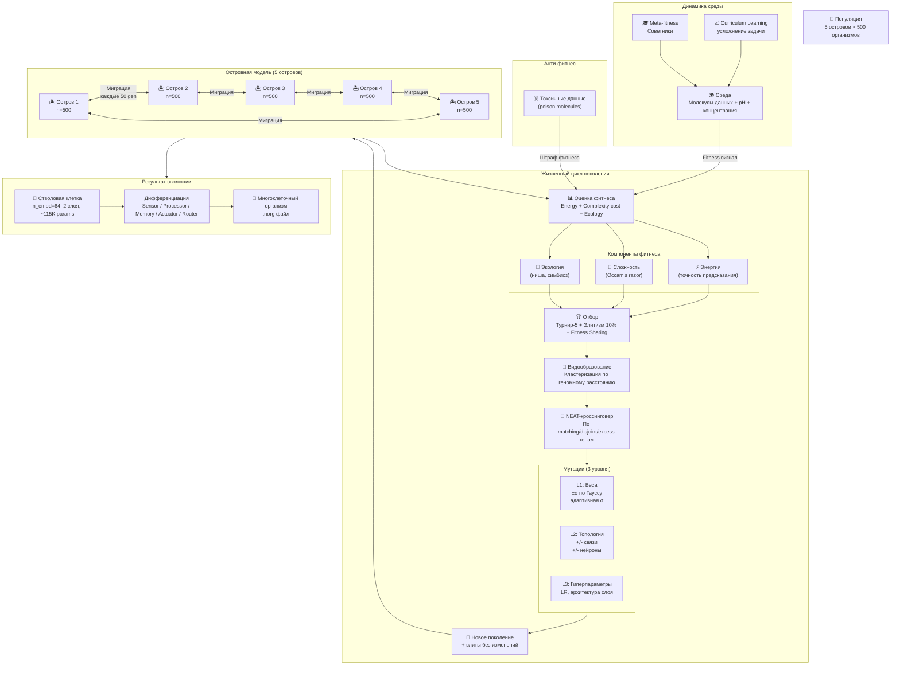

# Процесс эволюции

Описание полного цикла нейро-эволюции в системе **Neurocore** — от оценки фитнеса до формирования многоклеточных организмов.

---

## Диаграмма процесса

---

## Компоненты фитнеса

Фитнес вычисляется как взвешенная сумма трёх ортогональных метрик.

| Компонент | Описание | Принцип |
|-----------|----------|---------|
| **Energy** | Точность предсказания на текущих молекулах данных | MSE/Cross-entropy к выходу среды |
| **Complexity cost** | Штраф за избыточную сложность графа | Occam's razor: минимальный граф при равном качестве |
| **Ecology** | Контекстуальный фитнес: симбиоз, заполнение ниши | Среда оценивает вклад в экосистему |

Fitness является **свойством среды**, а не жёстко запрограммированной метрикой.

---

## Отбор

**Турнир-5** — случайная выборка 5 особей, победитель по фитнесу проходит в следующий раунд.

**Элитизм 10%** — топ-10% особей копируются без изменений, гарантируя сохранение лучших решений.

**Fitness Sharing** — нормализация фитнеса внутри видов, предотвращающая доминирование одного вида.

---

## Видообразование и кроссинговер

Видообразование выполняется кластеризацией по геномному расстоянию (топологическое + весовое). Кроссинговер по алгоритму **NEAT**:

- **Matching genes** — случайный выбор от каждого родителя
- **Disjoint genes** — наследуются от более приспособленного родителя
- **Excess genes** — наследуются от более приспособленного родителя

---

## Мутации (3 уровня)

| Уровень | Объект мутации | Механизм |
|---------|---------------|----------|
| **L1** | Веса | Гауссов шум ±σ; σ адаптивна (CMA-ES style) |
| **L2** | Топология | Добавление/удаление связей и нейронов |
| **L3** | Гиперпараметры | LR, размер слоя, архитектурные параметры блока |

Адаптивная мутабельность: σ увеличивается при стагнации фитнеса, уменьшается при стабильном росте.

---

## Островная модель

Популяция 2500 особей разделена на **5 островов по 500** для поддержания генетического разнообразия.

- Каждый остров эволюционирует независимо
- **Миграция каждые 50 поколений** — обмен лучшими особями по кольцевой топологии
- Острова могут специализироваться на разных нишах задачи

---

## Анти-фитнес

**Токсичные данные (poison molecules)** — специальные молекулы среды с негативной валентностью. Организмы, чьи предсказания «поглощают» яд, получают штраф к фитнесу. Механизм аналогичен иммунной реакции.

---

## Динамика среды

| Механизм | Описание |
|----------|----------|
| **Curriculum Learning** | Среда усложняет задачу по мере роста средней приспособленности популяции |
| **Meta-fitness (Советники)** | Внешние агенты корректируют параметры среды, задавая направление эволюции |

---

## Результат эволюции

Стволовая клетка (`n_embd=64`, 2 слоя, ~115K параметров) дифференцируется через отбор в специализированные блоки:

| Тип блока | Функция |
|-----------|---------|
| **Sensor** | Приём молекул данных из среды |
| **Processor** | Трансформация сигнала |
| **Memory** | Хранение состояния между шагами |
| **Actuator** | Выходное действие / предсказание |
| **Router** | Маршрутизация сигнала внутри организма |

Многоклеточный организм сохраняется как файл `.norg` (ZIP-архив) с версионированием каждые 100 поколений.
