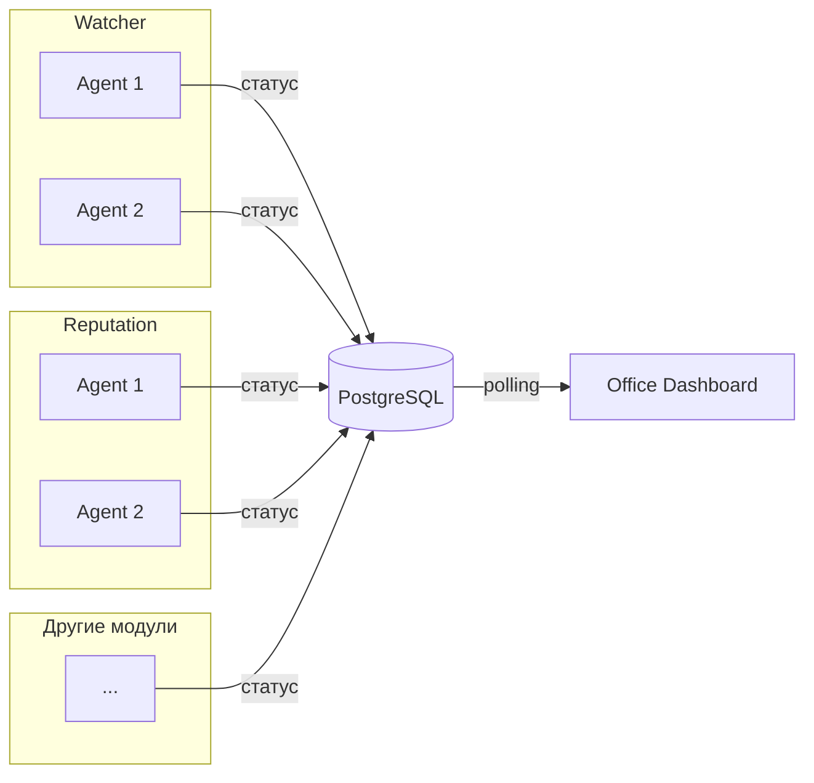

# ADOLF Office — Введение

> Версия: 1.0 (черновик)  
> Статус: MVP  
> Дата: 2025-01-24  
> Репозиторий: https://github.com/Sign25/Office

## Назначение

Модуль Office — управленческий дашборд в стилистике виртуального офиса. Каждый агент ADOLF представлен как сотрудник с визуальным отображением состояния и метрик.

## Ключевые концепции

| Термин | Описание |
|--------|----------|
| Модуль | Функциональный блок системы (Watcher, Reputation и др.) |
| Агент | Рабочий процесс внутри модуля, выполняющий конкретную задачу |
| Отдел (department) | Визуальная группа агентов одного модуля |
| Сотрудник | Аватар агента с emoji-статусом |

## Целевая аудитория

| Роль | Доступ |
|------|--------|
| Administrator | Все агенты, оба бренда |
| Director | Все агенты, только свой бренд |

## Ключевые решения MVP

- **Визуализация**: изометрический офис с отделами
- **Динамическая компоновка**: агенты появляются автоматически при регистрации в БД
- **Технология**: SVG (офис) + GIF (аватары)
- **Обновление данных**: polling каждые 30-60 сек
- **Интеграция**: Open WebUI (страница/Pipeline)
- **Взаимодействие**: только просмотр (клик → детальная карточка)
- **Экономия на ФОТ**: расчёт и отображение общей суммы экономии

## Экономия на ФОТ

Каждый агент — эквивалент реального сотрудника. При регистрации указывается:
- `salary_equivalent` — зарплата эквивалентной должности (руб/мес)
- `fte_coefficient` — коэффициент занятости (1.0 = полная ставка)

**Формула:** Экономия = Σ (salary_equivalent × fte_coefficient)

**Пример:** 8 агентов × 60 000 ₽ = 480 000 ₽/мес экономии

## Источники данных

Агенты ADOLF самостоятельно записывают свой статус в PostgreSQL. Office читает и визуализирует. Новые агенты появляются в офисе автоматически.

## Визуализация

### Структура офиса

```
┌─────────────────────────────────────────┐
│  Watcher                                │
│  ┌─────┐ ┌─────┐ ┌─────┐ ┌─────┐       │
│  │     │ │     │ │     │ │     │       │
│  └─────┘ └─────┘ └─────┘ └─────┘       │
│  ┌─────┐                                │
│  │     │                                │
│  └─────┘                                │
├─────────────────────────────────────────┤
│  Reputation                             │
│  ┌─────┐ ┌─────┐                        │
│  │     │ │     │                        │
│  └─────┘ └─────┘                        │
└─────────────────────────────────────────┘
```

- Отделы группируются по модулям
- Каждый отдел имеет подпись и цветовую зону
- Столы внутри отдела: сетка 4 в ряд с переносом

### Состояния сотрудника

| Статус | Условие | Emoji | Описание |
|--------|---------|-------|----------|
| Работает | ok + task | 💡 | Активно выполняет задачу |
| Ожидает | ok + null | ⏸️ | Готов, ждёт задачу |
| Внимание | warning | ⚠️ | Требует внимания |
| Ошибка | error | 🛑 | Произошла ошибка |
| Не в сети | offline | 💤 | Нет связи с агентом |

## Границы MVP

**Включено:**
- Динамическое обнаружение агентов
- Группировка по отделам (модулям)
- Автоматическая компоновка столов
- Детальная карточка по клику
- Разграничение доступа по брендам
- Общая сумма экономии на ФОТ

**Отложено до v2.0:**
- Навигация в модули из карточки
- Быстрые действия (перезапуск, очистка очереди)
- Кастомизация расположения
- Исторические графики метрик
- Уведомления/алерты
- Экономия по отделам и агентам

## TODO (известные ограничения MVP)

| Задача | Приоритет | Описание |
|--------|:---------:|----------|
| Обработка ошибок API | Высокий | Graceful degradation при недоступности API агентов |
| Начальное состояние | Средний | Корректное отображение при отсутствии зарегистрированных агентов |
| Пример интеграции | Средний | Документация по добавлению статуса агента из других модулей |

### Обработка ошибок API

Текущая реализация не обрабатывает сценарии:
- Timeout при запросе статуса агента
- 5xx ошибки от Office API
- Некорректный JSON в ответе

**Рекомендация:** Добавить retry с exponential backoff и fallback-состояние "unknown".

### Начальное состояние

При первом запуске системы (или после очистки БД) Office должен корректно отображать пустой офис с сообщением "Агенты не зарегистрированы".

### Пример интеграции для модулей

Каждый модуль ADOLF должен регистрировать свои агенты в Office. Минимальный пример:

```python
# При старте агента
async def register_agent():
    await office_client.put_agent(
        agent_id="watcher_night_agent",
        department="watcher",
        name="Ночной агент",
        brand="ohana_market",
        status="ok",
        salary_equivalent=60000,
        fte_coefficient=0.5
    )

# При обновлении статуса
async def update_status(task: str, metrics: dict):
    await office_client.put_agent(
        agent_id="watcher_night_agent",
        status="ok",
        task=task,
        metrics=metrics
    )
```

## Связь с модулями


