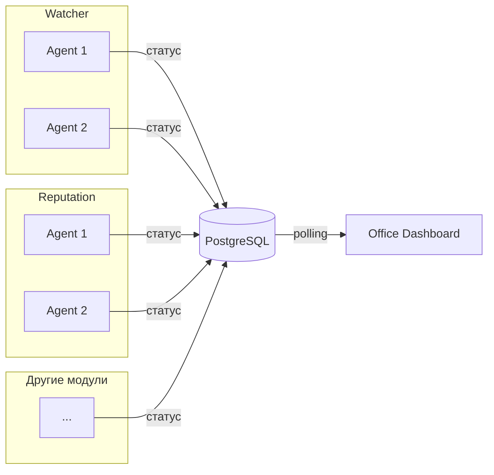

# ADOLF Office — Введение

> Версия: 1.0 (черновик)  
> Статус: MVP  
> Дата: 2025-01-24

## Назначение

Модуль Office — управленческий дашборд в стилистике виртуального офиса. Каждый агент ADOLF представлен как сотрудник с визуальным отображением состояния и метрик.

## Ключевые концепции

| Термин | Описание |
|--------|----------|
| Модуль | Функциональный блок системы (Watcher, Reputation и др.) |
| Агент | Рабочий процесс внутри модуля, выполняющий конкретную задачу |
| Отдел | Визуальная группа столов агентов одного модуля |
| Сотрудник | Аватар агента за рабочим столом |

## Целевая аудитория

| Роль | Доступ |
|------|--------|
| Administrator | Все агенты, оба бренда |
| Director | Все агенты, только свой бренд |

## Ключевые решения MVP

- **Визуализация**: изометрический офис с отделами
- **Динамическая компоновка**: агенты появляются автоматически при регистрации в БД
- **Технология**: SVG (офис) + GIF (аватары)
- **Обновление данных**: polling каждые 30-60 сек
- **Интеграция**: Open WebUI (страница/Pipeline)
- **Взаимодействие**: только просмотр (клик → детальная карточка)

## Источники данных

Агенты ADOLF самостоятельно записывают свой статус в PostgreSQL. Office читает и визуализирует. Новые агенты появляются в офисе автоматически.

## Визуализация

### Структура офиса

```
┌─────────────────────────────────────────┐
│  Watcher                                │
│  ┌─────┐ ┌─────┐ ┌─────┐ ┌─────┐       │
│  │     │ │     │ │     │ │     │       │
│  └─────┘ └─────┘ └─────┘ └─────┘       │
│  ┌─────┐                                │
│  │     │                                │
│  └─────┘                                │
├─────────────────────────────────────────┤
│  Reputation                             │
│  ┌─────┐ ┌─────┐                        │
│  │     │ │     │                        │
│  └─────┘ └─────┘                        │
└─────────────────────────────────────────┘
```

- Отделы группируются по модулям
- Каждый отдел имеет подпись и цветовую зону
- Столы внутри отдела: сетка 4 в ряд с переносом

### Состояния сотрудника

| Статус | Аватар (GIF) | Подсветка стола |
|--------|--------------|-----------------|
| ok + задача | working.gif | Зелёная |
| ok + ожидание | idle.gif | Зелёная |
| warning | tired.gif | Жёлтая |
| error | error.gif | Красная |

## Границы MVP

**Включено:**
- Динамическое обнаружение агентов
- Группировка по отделам (модулям)
- Автоматическая компоновка столов
- Детальная карточка по клику
- Разграничение доступа по брендам

**Отложено до v2.0:**
- Навигация в модули из карточки
- Быстрые действия (перезапуск, очистка очереди)
- Кастомизация расположения
- Исторические графики метрик
- Уведомления/алерты

## Связь с модулями


