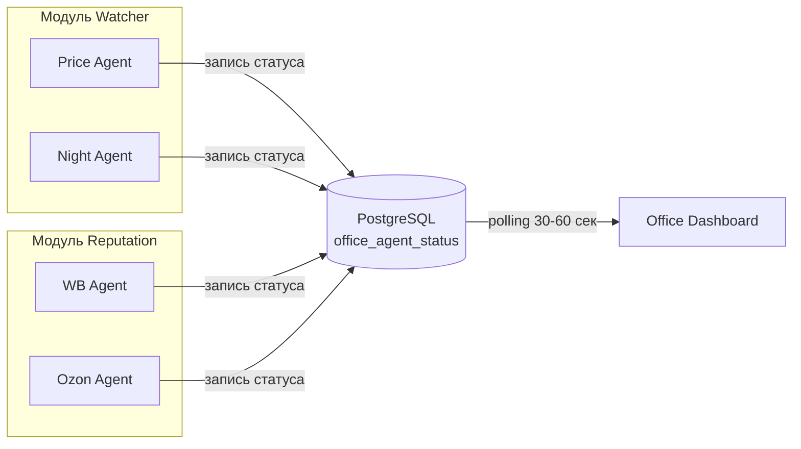
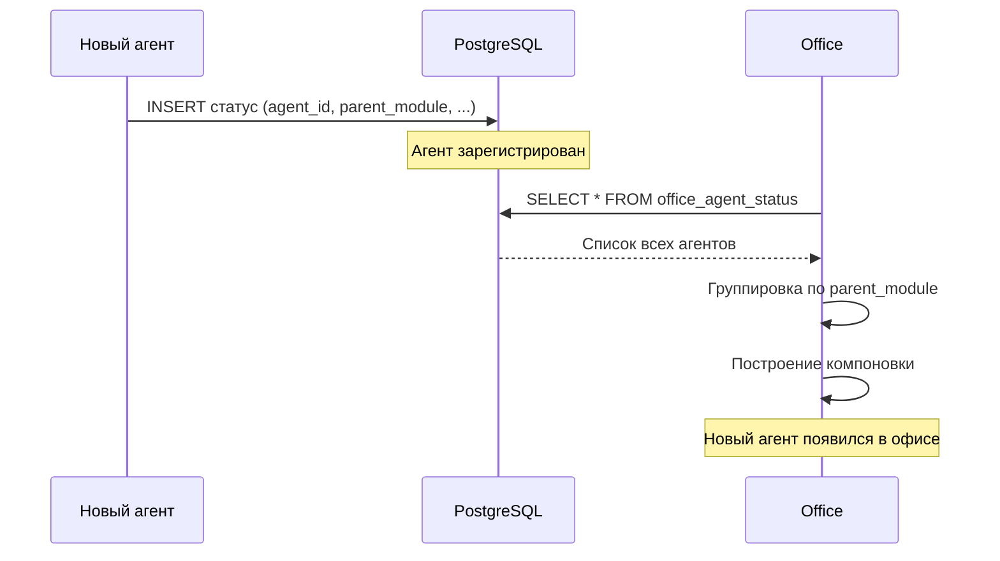
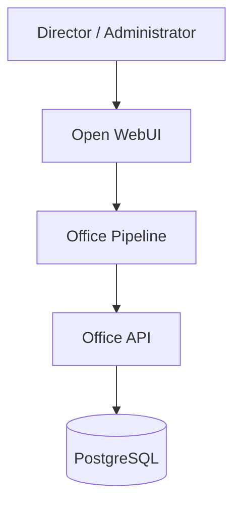

> Версия: 1.0 (черновик)  
> Статус: MVP  
> Дата: 2025-01-24

## Принцип работы

Агенты ADOLF самостоятельно записывают свой статус в PostgreSQL. Office читает данные и динамически строит визуализацию. Новые агенты появляются автоматически.



## Формат статуса агента

Каждый агент записывает:

| Поле | Тип | Описание |
|------|-----|----------|
| agent_id | string | Уникальный идентификатор агента |
| parent_module | string | Родительский модуль (watcher, reputation и др.) |
| display_name | string | Человекочитаемое название |
| brand | string | ohana_market / ohana_kids / null (общий) |
| status | enum | ok / warning / error |
| last_activity | timestamp | Время последнего действия |
| current_task | string | Текущая операция (текст) |
| metrics | jsonb | KPI агента |

### Пример записи

```json
{
  "agent_id": "watcher_night_agent",
  "parent_module": "watcher",
  "display_name": "Ночной мониторинг",
  "brand": "ohana_market",
  "status": "ok",
  "last_activity": "2025-01-24T03:15:00Z",
  "current_task": "Сканирование цен конкурентов",
  "metrics": {
    "products_scanned": 1250,
    "price_changes_found": 23
  }
}
```

## Динамическое обнаружение

1. Агент при старте записывает статус в `office_agent_status`
2. Office при polling получает все записи из таблицы
3. Группирует агентов по `parent_module` (отделы)
4. Динамически строит компоновку офиса



## Хранение данных

### Текущее состояние

Таблица `office_agent_status` — одна запись на агента, перезаписывается при каждом обновлении.

### История за сутки

Таблица `office_agent_status_history` — снимки состояния для отображения динамики. Хранение 24 часа, затем автоочистка.

## Маппинг статуса → визуализация

| status | current_task | GIF | Подсветка |
|--------|--------------|-----|-----------|
| ok | есть | working.gif | Зелёная |
| ok | пусто | idle.gif | Зелёная |
| warning | любой | tired.gif | Жёлтая |
| error | любой | error.gif | Красная |

## Компоновка офиса

### Алгоритм

1. Получить всех агентов из БД
2. Сгруппировать по `parent_module`
3. Для каждого отдела:
   - Отрисовать заголовок и цветовую зону
   - Расположить столы в сетке 4×N (4 в ряд, перенос при заполнении)
4. Отделы располагаются вертикально сверху вниз

### Порядок отделов

По алфавиту `parent_module` или порядку первого появления (настраивается).

## Интеграция с Open WebUI



### Компоненты

1. **Office Pipeline** — страница в Open WebUI, рендерит изометрический офис
2. **Office API** — FastAPI эндпоинты для получения статусов
3. **PostgreSQL** — хранение статусов и истории

## API эндпоинты (preview)

| Метод | Endpoint | Описание |
|-------|----------|----------|
| GET | /api/v1/office/agents | Все агенты (сгруппированы по модулям) |
| GET | /api/v1/office/agents/{agent_id} | Детальный статус агента |
| GET | /api/v1/office/history/{agent_id} | История за 24ч |
| PUT | /api/v1/office/agents/{agent_id} | Обновление статуса (для агентов) |

## Ответственность агентов

Каждый агент ADOLF должен:

1. При старте — записать статус с `agent_id`, `parent_module`, `display_name`
2. При начале задачи — обновить `current_task`
3. При завершении — обновить `metrics`, очистить `current_task`
4. При ошибке — установить `status: error`, описание в `current_task`
5. Периодически (heartbeat) — обновлять `last_activity`

## Границы MVP

**Включено:**
- Динамическое обнаружение агентов
- Группировка по модулям (отделы)
- Автоматическая компоновка
- История 24ч
- Разграничение по брендам

**Отложено до v2.0:**
- Мониторинг внешних сервисов
- Алерты при смене статуса
- Кастомный порядок отделов
- Агрегированная статистика
