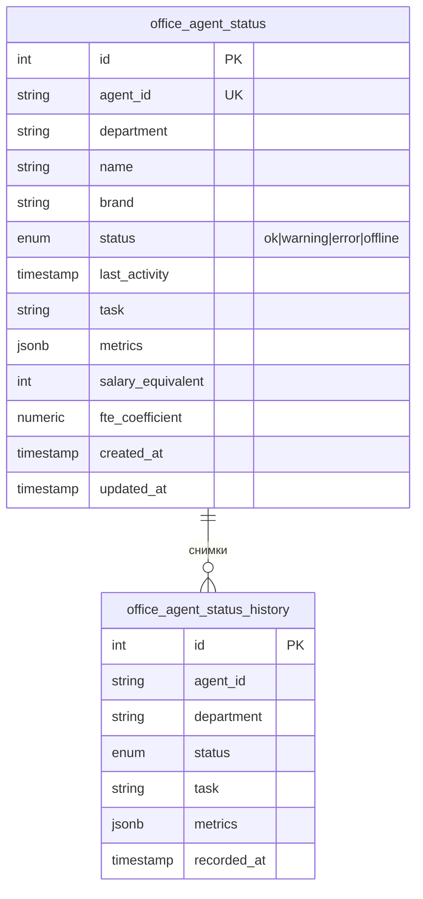

> Версия: 1.0 (черновик)  
> Статус: MVP  
> Дата: 2025-01-24

## Схема данных



## Таблицы

### office_agent_status

Текущее состояние агентов. Одна запись на агента.

```sql
CREATE TYPE agent_status_enum AS ENUM ('ok', 'warning', 'error', 'offline');

CREATE TABLE office_agent_status (
    id SERIAL PRIMARY KEY,
    agent_id VARCHAR(100) NOT NULL UNIQUE,
    department VARCHAR(50) NOT NULL,
    name VARCHAR(100) NOT NULL,
    brand VARCHAR(20),
    status agent_status_enum NOT NULL DEFAULT 'ok',
    last_activity TIMESTAMP WITH TIME ZONE,
    task VARCHAR(255),
    metrics JSONB DEFAULT '{}',
    -- Экономия на ФОТ
    salary_equivalent INTEGER DEFAULT 60000,  -- Зарплата эквивалентной должности (руб/мес)
    fte_coefficient NUMERIC(3,2) DEFAULT 1.0, -- Коэффициент занятости (1.0 = полная ставка)
    --
    created_at TIMESTAMP WITH TIME ZONE DEFAULT NOW(),
    updated_at TIMESTAMP WITH TIME ZONE DEFAULT NOW()
);

CREATE INDEX idx_agent_status_department ON office_agent_status(department);
CREATE INDEX idx_agent_status_brand ON office_agent_status(brand);
```

### office_agent_status_history

История состояний за 24 часа.

```sql
CREATE TABLE office_agent_status_history (
    id SERIAL PRIMARY KEY,
    agent_id VARCHAR(100) NOT NULL,
    department VARCHAR(50) NOT NULL,
    status agent_status_enum NOT NULL,
    task VARCHAR(255),
    metrics JSONB DEFAULT '{}',
    recorded_at TIMESTAMP WITH TIME ZONE DEFAULT NOW()
);

CREATE INDEX idx_history_agent_time 
    ON office_agent_status_history(agent_id, recorded_at DESC);

CREATE INDEX idx_history_recorded_at 
    ON office_agent_status_history(recorded_at);
```

## Значения department

| department | Описание |
|------------|----------|
| watcher | Мониторинг цен |
| reputation | Работа с отзывами |
| content_factory | Генерация контента |
| marketing | Рекламные кампании |
| scout | Анализ ниш |
| knowledge | База знаний |
| cfo | Финансовая отчётность |
| lex | Мониторинг законодательства |

## Значения brand

| brand | Описание |
|-------|----------|
| ohana_market | Охана Маркет (взрослая одежда) |
| ohana_kids | Охана Кидс (детская одежда) |
| NULL | Общие данные (не привязаны к бренду) |

## Примеры agent_id

| agent_id | department | name | salary_equivalent | fte_coefficient |
|----------|------------|------|-------------------|-----------------|
| watcher_price_monitor | watcher | Мониторинг цен | 60000 | 1.0 |
| watcher_night_agent | watcher | Ночной агент | 60000 | 0.5 |
| watcher_competitor_scan | watcher | Сканер конкурентов | 60000 | 1.0 |
| reputation_wb | reputation | WB отзывы | 60000 | 1.0 |
| reputation_ozon | reputation | Ozon отзывы | 60000 | 1.0 |
| reputation_wb_responder | reputation | Ответы WB |
| reputation_ozon_responder | reputation | Ответы Ozon |
| knowledge_rag_processor | knowledge | RAG процессор |

## Структура metrics (примеры)

### Агенты Watcher
```json
{
  "products_monitored": 230,
  "price_changes_today": 15,
  "last_scan_duration_sec": 45
}
```

### Агенты Reputation
```json
{
  "reviews_processed_today": 47,
  "avg_response_time_min": 12,
  "queue_size": 3
}
```

### Агенты Content Factory
```json
{
  "descriptions_generated_today": 25,
  "queue_size": 8,
  "avg_generation_time_sec": 30
}
```

## Автоочистка истории

Cron-задача или pg_cron для удаления записей старше 24 часов:

```sql
DELETE FROM office_agent_status_history 
WHERE recorded_at < NOW() - INTERVAL '24 hours';
```

## Запись снимков в историю

Триггер при обновлении статуса:

```sql
CREATE OR REPLACE FUNCTION save_agent_status_history()
RETURNS TRIGGER AS $$
BEGIN
    INSERT INTO office_agent_status_history 
        (agent_id, department, status, task, metrics, recorded_at)
    VALUES 
        (NEW.agent_id, NEW.department, NEW.status, NEW.task, NEW.metrics, NOW());
    RETURN NEW;
END;
$$ LANGUAGE plpgsql;

CREATE TRIGGER trg_agent_status_history
    AFTER INSERT OR UPDATE ON office_agent_status
    FOR EACH ROW
    EXECUTE FUNCTION save_agent_status_history();
```

## UPSERT для агентов

Агенты используют UPSERT для регистрации и обновления:

```sql
INSERT INTO office_agent_status 
    (agent_id, department, name, brand, status, task, metrics, 
     salary_equivalent, fte_coefficient, last_activity)
VALUES 
    ('watcher_night_agent', 'watcher', 'Ночной агент', 'ohana_market', 'ok', 'Сканирование', '{}',
     60000, 0.5, NOW())
ON CONFLICT (agent_id) 
DO UPDATE SET
    status = EXCLUDED.status,
    task = EXCLUDED.task,
    metrics = EXCLUDED.metrics,
    last_activity = EXCLUDED.last_activity,
    updated_at = NOW();
```

## Расчёт экономии

Общая экономия на ФОТ (руб/мес):

```sql
SELECT SUM(salary_equivalent * fte_coefficient) AS total_savings
FROM office_agent_status;
```

Пример: 8 агентов × 60 000 ₽ × 1.0 = 480 000 ₽/мес
