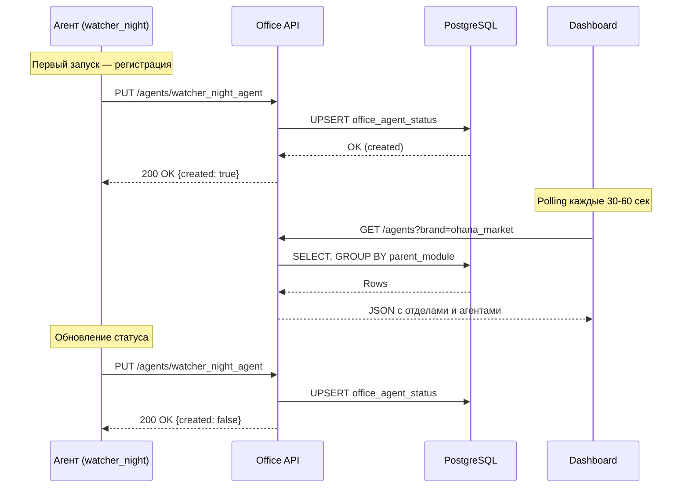

&gt; Версия: 1.0 (черновик)  
&gt; Статус: MVP  
&gt; Дата: 2025-01-24

## Обзор

Два типа эндпоинтов:
1. **Чтение** — Office Dashboard запрашивает статусы агентов
2. **Запись** — агенты обновляют свой статус

## Аутентификация

API Key в заголовке `X-API-Key`. Ключи привязаны к ролям и агентам.

## Эндпоинты чтения (для Dashboard)

### GET /api/v1/office/agents

Все агенты, сгруппированные по модулям.

**Доступ:** Administrator, Director

**Query параметры:**

| Параметр | Тип | Описание |
|----------|-----|----------|
| brand | string | Фильтр по бренду (для Director — обязателен) |

**Ответ:**

```json
{
  "departments": [
    {
      "key": "watcher",
      "name": "Watcher",
      "color": "#4A90D9",
      "agents": [
        {
          "id": "watcher_price_monitor",
          "name": "Мониторинг цен",
          "brand": "ohana_market",
          "status": "ok",
          "last_activity": "2025-01-24T14:32:15Z",
          "task": "Сканирование Wildberries",
          "metrics": {
            "products_monitored": 230,
            "price_changes_today": 15
          },
          "salary_equivalent": 60000,
          "fte_coefficient": 1.0
        },
        {
          "id": "watcher_night_agent",
          "name": "Ночной агент",
          "brand": "ohana_market",
          "status": "offline",
          "last_activity": "2025-01-24T03:15:00Z",
          "task": null,
          "metrics": {},
          "salary_equivalent": 60000,
          "fte_coefficient": 0.5
        }
      ]
    },
    {
      "key": "reputation",
      "name": "Reputation",
      "color": "#7ED321",
      "agents": [...]
    }
  ],
  "total_agents": 12,
  "total_savings": 480000,
  "updated_at": "2025-01-24T14:35:00Z"
}
```

### GET /api/v1/office/agents/\{agent_id}

Детальный статус одного агента.

**Доступ:** Administrator, Director

**Path параметры:**

| Параметр | Тип | Описание |
|----------|-----|----------|
| agent_id | string | Уникальный идентификатор агента |

**Ответ:**

```json
{
  "id": "watcher_price_monitor",
  "department": "watcher",
  "name": "Мониторинг цен",
  "brand": "ohana_market",
  "status": "ok",
  "last_activity": "2025-01-24T14:32:15Z",
  "task": "Сканирование Wildberries",
  "metrics": {
    "products_monitored": 230,
    "price_changes_today": 15
  },
  "salary_equivalent": 60000,
  "fte_coefficient": 1.0,
  "created_at": "2025-01-20T10:00:00Z",
  "updated_at": "2025-01-24T14:32:15Z"
}
```

### GET /api/v1/office/history/\{agent_id}

История статусов агента за 24 часа.

**Доступ:** Administrator, Director

**Path параметры:**

| Параметр | Тип | Описание |
|----------|-----|----------|
| agent_id | string | Уникальный идентификатор агента |

**Query параметры:**

| Параметр | Тип | Описание |
|----------|-----|----------|
| limit | int | Количество записей (default: 100) |

**Ответ:**

```json
{
  "agent_id": "watcher_price_monitor",
  "history": [
    {
      "status": "ok",
      "current_task": "Сканирование Wildberries",
      "metrics": {
        "products_monitored": 230,
        "price_changes_today": 15
      },
      "recorded_at": "2025-01-24T14:32:15Z"
    },
    {
      "status": "ok",
      "current_task": "Ожидание",
      "metrics": {
        "products_monitored": 230,
        "price_changes_today": 14
      },
      "recorded_at": "2025-01-24T14:30:00Z"
    }
  ]
}
```

## Эндпоинты записи (для агентов)

### PUT /api/v1/office/agents/\{agent_id}

Регистрация или обновление статуса агента (UPSERT).

**Доступ:** API Key агента

**Path параметры:**

| Параметр | Тип | Описание |
|----------|-----|----------|
| agent_id | string | Уникальный идентификатор агента |

**Тело запроса:**

```json
{
  "department": "watcher",
  "name": "Ночной агент",
  "brand": "ohana_market",
  "status": "ok",
  "task": "Сканирование цен конкурентов",
  "metrics": {
    "products_scanned": 1250,
    "price_changes_found": 23
  },
  "salary_equivalent": 60000,
  "fte_coefficient": 0.5
}
```

**Ответ:**

```json
{
  "success": true,
  "created": false,
  "updated_at": "2025-01-24T14:32:15Z"
}
```

При первой регистрации `created: true`.

### POST /api/v1/office/heartbeat/\{agent_id}

Обновление last_activity без изменения статуса.

**Доступ:** API Key агента

**Path параметры:**

| Параметр | Тип | Описание |
|----------|-----|----------|
| agent_id | string | Уникальный идентификатор агента |

**Ответ:**

```json
{
  "success": true,
  "last_activity": "2025-01-24T14:35:00Z"
}
```

## Коды ошибок

| Код | Описание |
|-----|----------|
| 400 | Неверные параметры запроса |
| 401 | Отсутствует или неверный API Key |
| 403 | Нет доступа (Director к чужому бренду) |
| 404 | Агент не найден |
| 500 | Внутренняя ошибка сервера |

**Формат ошибки:**

```json
{
  "error": {
    "code": "FORBIDDEN",
    "message": "Access denied to brand ohana_kids"
  }
}
```

## Диаграмма взаимодействия



## Права доступа

| Эндпоинт | Administrator | Director | Агент |
|----------|---------------|----------|-------|
| GET /agents | ✓ все | ✓ свой бренд | ✗ |
| GET /agents/\{id\} | ✓ все | ✓ свой бренд | ✗ |
| GET /history/\{id\} | ✓ все | ✓ свой бренд | ✗ |
| PUT /agents/\{id\} | ✗ | ✗ | ✓ свой agent_id |
| POST /heartbeat/\{id\} | ✗ | ✗ | ✓ свой agent_id |
