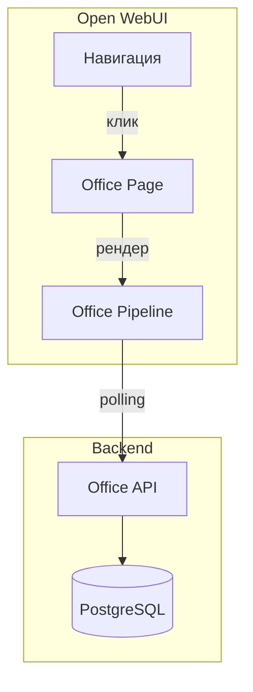

> Версия: 1.0 (черновик)  
> Статус: MVP  
> Дата: 2025-01-24

## Обзор

Office интегрируется в Open WebUI как отдельная страница с динамическим изометрическим представлением виртуального офиса.

## Архитектура интеграции



## Доступ

| Роль | Видимость в меню | Данные |
|------|------------------|--------|
| Administrator | ✓ | Все агенты, оба бренда |
| Director | ✓ | Все агенты, только свой бренд |
| Senior и ниже | ✗ | — |

## Компоненты страницы

### Макет

```
┌─────────────────────────────────────────────────────┐
│  ADOLF Office                        [Обновить] ⟳  │
│  [Все] [Охана Маркет] [Охана Кидс]                  │
├─────────────────────────────────────────────────────┤
│                                                     │
│  ┌─ WATCHER ──────────────────────────────────────┐ │
│  │  ┌─────┐ ┌─────┐ ┌─────┐                       │ │
│  │  │Agent│ │Agent│ │Agent│                       │ │
│  │  └─────┘ └─────┘ └─────┘                       │ │
│  └────────────────────────────────────────────────┘ │
│                                                     │
│  ┌─ REPUTATION ───────────────────────────────────┐ │
│  │  ┌─────┐ ┌─────┐                               │ │
│  │  │Agent│ │Agent│                               │ │
│  │  └─────┘ └─────┘                               │ │
│  └────────────────────────────────────────────────┘ │
│                                                     │
├─────────────────────────────────────────────────────┤
│  Агентов: 12    Ошибок: 0           Обновлено: 14:35│
│  💰 Экономия на ФОТ: 480 000 ₽/мес                  │
└─────────────────────────────────────────────────────┘
```

## Визуальные состояния

### Аватар сотрудника (GIF)

| Состояние | GIF-файл |
|-----------|----------|
| ok + работает | working.gif |
| ok + ожидает | idle.gif |
| warning | tired.gif |
| error | error.gif |

### Рабочее место

| Состояние | Подсветка | CSS-класс |
|-----------|-----------|-----------|
| ok | Зелёная | `.desk--ok` |
| warning | Жёлтая | `.desk--warning` |
| error | Красная | `.desk--error` |

### Индикаторы над столом

| Условие | Иконка |
|---------|--------|
| queue_size > 10 | 📋 (очередь) |
| status = error | ⚠️ (ошибка) |
| last_activity > 5 мин назад | 💤 (неактивен) |

## Детальная карточка

По клику на сотрудника открывается модальное окно:

```
┌─────────────────────────────────────┐
│  Ночной агент                   [×] │
│  Отдел: Watcher                     │
│  Бренд: Охана Маркет                │
├─────────────────────────────────────┤
│  Статус: ● Работает                 │
│                                     │
│  Текущая задача:                    │
│  Сканирование цен конкурентов       │
│                                     │
│  ─────────────────────────────────  │
│  Метрики:                           │
│                                     │
│  Товаров просканировано   1250      │
│  Изменений цен найдено    23        │
│                                     │
│  ─────────────────────────────────  │
│  Последняя активность: 03:15        │
└─────────────────────────────────────┘
```

## Pipeline

### Конфигурация

```python
class OfficePipeline:
    """
    Pipeline для отображения виртуального офиса
    """
    
    class Config:
        name = "office"
        description = "Виртуальный офис ADOLF"
        icon = "🏢"
        roles = ["administrator", "director"]
```

### Логика работы

1. При загрузке — запрос `GET /api/v1/office/agents`
2. Динамическое построение отделов и столов
3. Polling каждые 30 секунд
4. При клике на стол — показ детальной карточки
5. Обновление визуала без перезагрузки страницы

## Фильтрация по бренду

Для Director автоматически применяется фильтр по бренду из профиля пользователя.

Administrator видит переключатель:

```
[Все] [Охана Маркет] [Охана Кидс]
```

При выборе бренда:
- Агенты без привязки к бренду (brand = null) показываются всегда
- Агенты с брендом фильтруются

## Технические требования

### Динамическая компоновка

- Офис строится на основе данных API
- Отделы группируются по `parent_module`
- Столы внутри отдела: сетка 4 в ряд
- Вертикальный скролл при большом количестве агентов

### Анимации

| Элемент | Анимация | Длительность |
|---------|----------|--------------|
| GIF-аватары | Встроенная в файл | 1-2s loop |
| Переход состояния | Fade | 0.3s |
| Подсветка стола | Pulse (для warning/error) | 2s loop |

### Производительность

- SVG генерируется динамически
- CSS-анимации (не JS)
- Debounce polling при неактивной вкладке
- Кэширование GIF-аватаров
