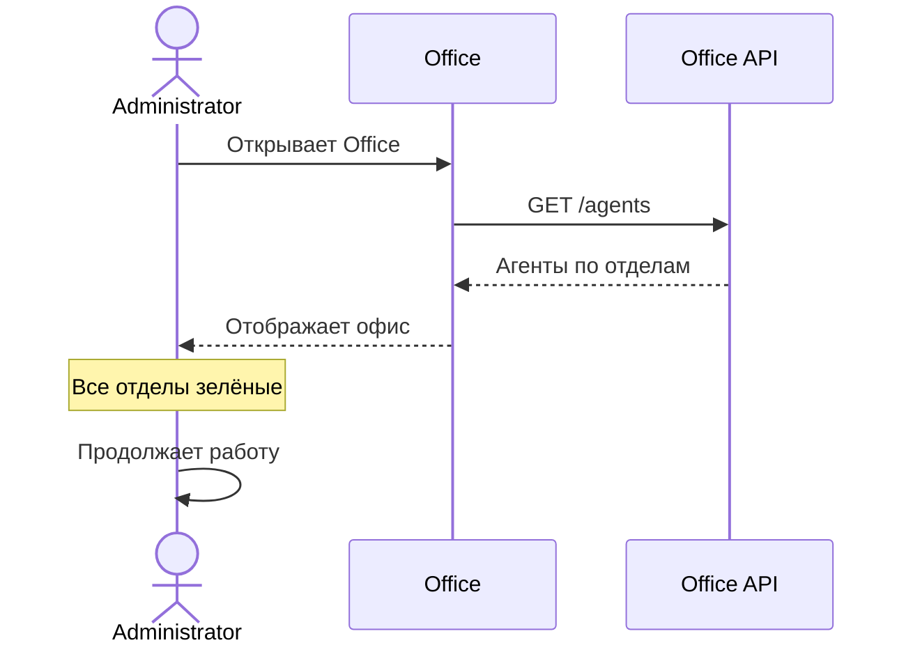
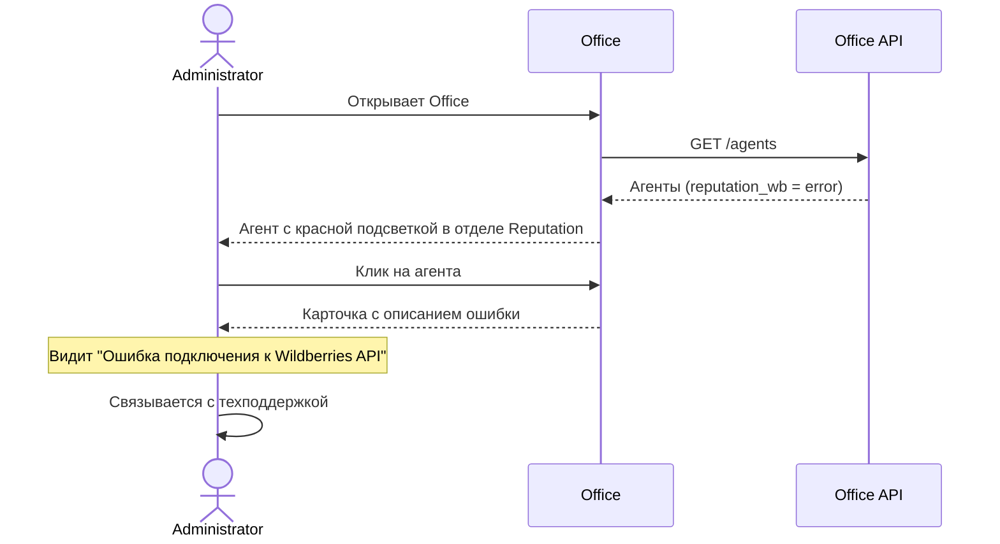
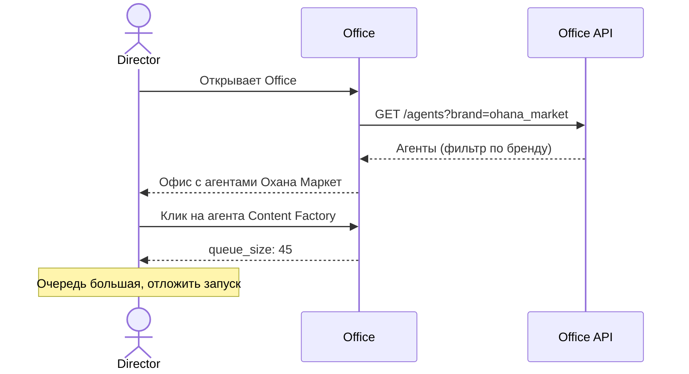
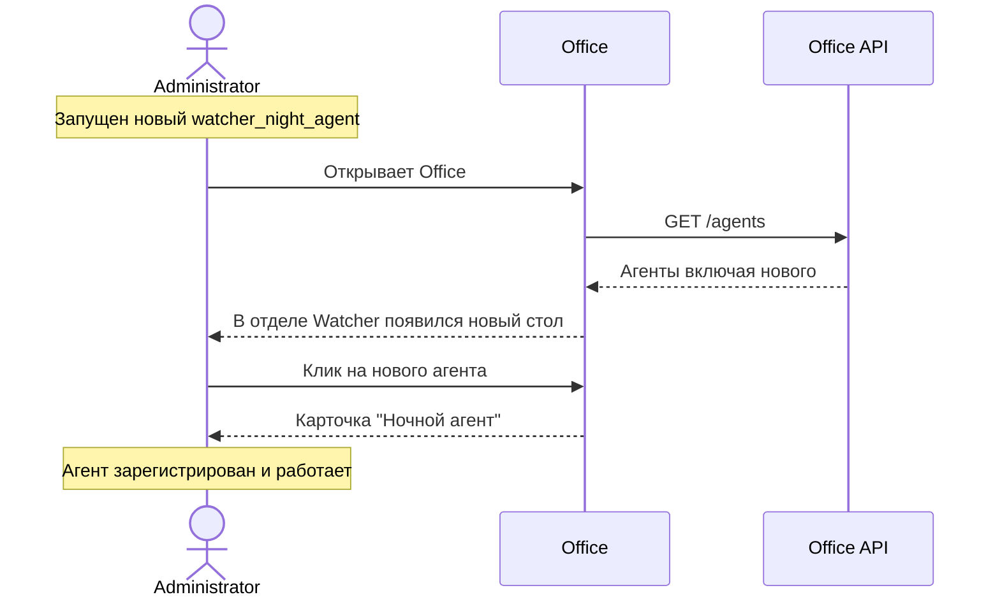

# ADOLF Office — Сценарии использования

> Версия: 1.0 (черновик)  
> Статус: MVP  
> Дата: 2025-01-24

## Обзор

Типовые сценарии работы с модулем Office для Administrator и Director.

## Сценарий 1: Утренняя проверка системы

**Роль:** Administrator

**Цель:** Убедиться, что все агенты работают нормально после ночи.

**Шаги:**
1. Administrator открывает Office из меню
2. Видит офис с отделами и агентами
3. Все подсветки зелёные — система в норме
4. Закрывает Office

---

## Сценарий 2: Обнаружение проблемы

**Роль:** Administrator

**Цель:** Выявить и диагностировать сбой агента.

**Шаги:**
1. Administrator открывает Office
2. В отделе Reputation замечает красную подсветку у агента "Ответы WB"
3. Кликает на сотрудника
4. В карточке видит: `current_task: "Ошибка: Wildberries API timeout"`
5. Принимает меры по устранению

---

## Сценарий 3: Мониторинг нагрузки

**Роль:** Director (Охана Маркет)

**Цель:** Проверить загруженность агентов перед запуском акции.

**Шаги:**
1. Director открывает Office
2. Видит только агентов по своему бренду
3. В отделе Content Factory видит иконку очереди 📋
4. Открывает карточку: `queue_size: 45`
5. Решает отложить создание новых задач

---

## Сценарий 4: Появление нового агента

**Роль:** Administrator

**Цель:** Убедиться, что новый ночной агент появился в офисе.

**Шаги:**
1. DevOps запускает нового агента
2. Administrator открывает Office
3. В отделе Watcher видит новый стол с агентом "Ночной агент"
4. Проверяет статус — агент активен

---

## Сценарий 5: Сравнение брендов

**Роль:** Administrator

**Цель:** Сравнить показатели агентов между брендами.

**Шаги:**
1. Administrator открывает Office
2. Переключает фильтр на "Охана Маркет"
3. Проверяет агентов в отделе Reputation
4. Переключает на "Охана Кидс"
5. Сравнивает показатели

---

## Сценарий 6: Проверка после деплоя

**Роль:** Administrator

**Цель:** Убедиться, что агенты работают после обновления.

**Шаги:**
1. DevOps сообщает о завершении деплоя Watcher
2. Administrator открывает Office
3. Проверяет все агенты в отделе Watcher — зелёные
4. Кликает на каждого, проверяет `last_activity`
5. Деплой успешен

---

## Сводка сценариев

| # | Сценарий | Роль | Частота |
|---|----------|------|---------|
| 1 | Утренняя проверка | Administrator | Ежедневно |
| 2 | Обнаружение проблемы | Administrator | По событию |
| 3 | Мониторинг нагрузки | Director | Перед акциями |
| 4 | Появление нового агента | Administrator | По событию |
| 5 | Сравнение брендов | Administrator | Еженедельно |
| 6 | Проверка после деплоя | Administrator | По событию |

## Ожидаемое поведение системы

| Ситуация | Отображение в Office |
|----------|---------------------|
| Агент работает | Зелёный стол, working.gif |
| Агент ожидает | Зелёный стол, idle.gif |
| Большая очередь (>10) | Иконка 📋 над столом |
| Агент не отвечает >5 мин | Иконка 💤 над столом |
| Ошибка агента | Красный стол, error.gif, ⚠️ |
| Высокая нагрузка | Жёлтый стол, tired.gif |
| Новый агент появился | Новый стол в соответствующем отделе |
