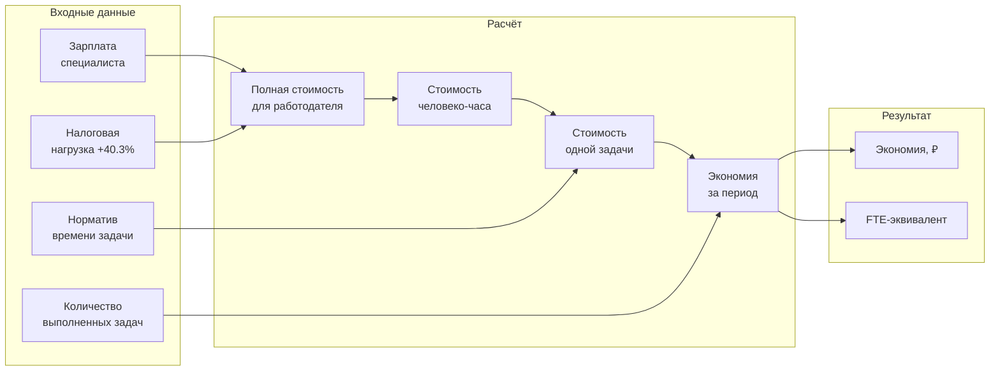
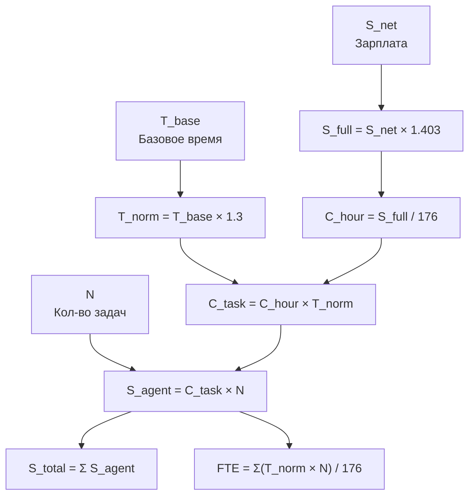
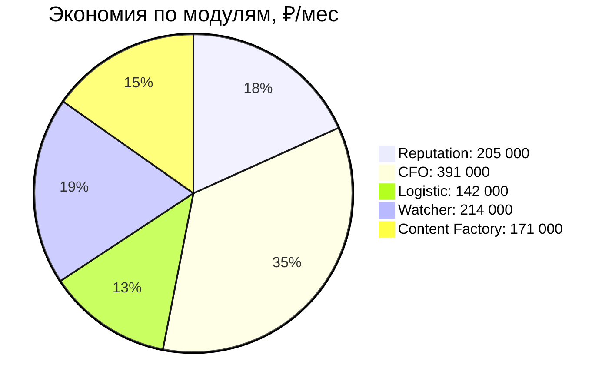
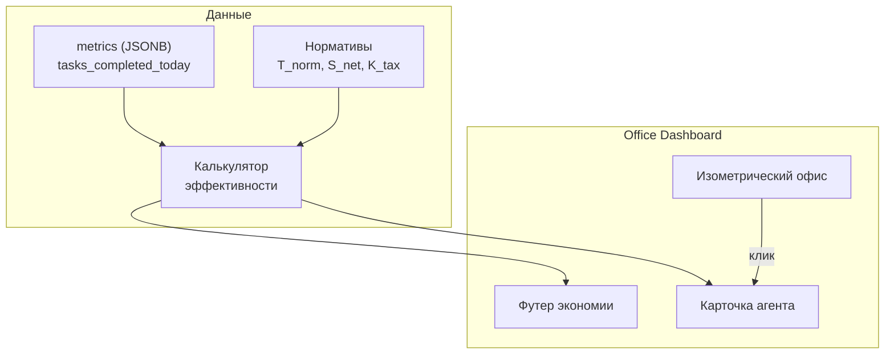

**Проект:** Визуальный дашборд AI-агентов  
**Модуль:** Office  
**Версия:** 1.2  
**Дата:** Февраль 2026  
**Заменяет:** adolf_office_9_efficiency v1.1

---

## 9.1 Назначение

Раздел описывает методику количественной оценки экономической эффективности AI-агентов ADOLF. Цель — перевести работу каждого агента в человеко-часы и показать руководителю экономию в рублях.

### Принцип расчёта

Каждая задача, выполненная AI-агентом, имеет эквивалент в виде времени, которое потратил бы на неё человек соответствующей квалификации. Зная полную стоимость часа работы специалиста для работодателя (с учётом налогов) и количество выполненных агентом задач, вычисляется экономия.



### Допущения MVP

| Параметр | Значение | Обоснование |
|----------|----------|-------------|
| Стоимость эксплуатации AI | 0 ₽ | Упрощение для MVP, инфраструктурные расходы не учитываются |
| Качество выполнения | Эквивалентно человеку | Предполагается равное качество при наличии валидации |
| Рабочий месяц | 176 часов | 22 рабочих дня × 8 часов |
| Рабочий день | 8 часов | Стандартный рабочий день |
| Коэффициент налоговой нагрузки | 1.403 (+40.3%) | Страховые взносы, НДФЛ, прочие обязательные отчисления |
| Коэффициент накладных расходов времени | 1.3 (+30%) | Переключение контекста, перерывы, коммуникации, исправление ошибок |

### Зарплата и полная стоимость для работодателя

Все зарплаты в документе указаны **без учёта налогов** (net). Полная стоимость сотрудника для работодателя включает обязательные отчисления:

| Статья | Ставка |
|--------|-------:|
| Страховые взносы (ПФР, ОМС, ФСС) | ~30% |
| Прочие обязательные отчисления | ~10.3% |
| **Итого налоговая нагрузка** | **+40.3%** |

$$
S_{full} = S_{net} \times K_{tax} = S_{net} \times 1.403
$$

| Модуль | S\_net (зарплата) | K\_tax | S\_full (полная стоимость) |
|--------|------------------:|------:|---------------------------:|
| Reputation | 50 000 ₽ | 1.403 | 70 150 ₽ |
| CFO | 200 000 ₽ | 1.403 | 280 600 ₽ |
| Logistic | 80 000 ₽ | 1.403 | 112 240 ₽ |
| Watcher | 50 000 ₽ | 1.403 | 70 150 ₽ |
| Content Factory | 50 000 ₽ | 1.403 | 70 150 ₽ |

### Нормативное время с учётом накладных расходов

Базовое время выполнения задачи (T\_base) — это «чистое» время работы. В реальности сотрудник тратит на ~30% больше из-за переключения контекста, перерывов, коммуникаций и исправления ошибок:

$$
T_{norm} = T_{base} \times 1.3
$$

---

## 9.2 Математическая модель

### 9.2.1 Стоимость человеко-часа

Базовая единица расчёта — полная стоимость одного часа работы специалиста для работодателя.

$$
C_{hour} = \frac{S_{net} \times K_{tax}}{H_{month}}
$$

| Переменная | Описание | Единица |
|------------|----------|---------|
| C\_hour | Стоимость человеко-часа (полная) | ₽/час |
| S\_net | Месячная зарплата специалиста (без налогов) | ₽ |
| K\_tax | Коэффициент налоговой нагрузки | 1.403 |
| H\_month | Рабочих часов в месяце | часов (176) |

### 9.2.2 Стоимость одной задачи

Каждый тип задачи имеет нормативное время выполнения человеком с учётом накладных расходов (+30%).

$$
C_{task} = C_{hour} \times T_{base} \times 1.3
$$

| Переменная | Описание | Единица |
|------------|----------|---------|
| C\_task | Стоимость выполнения задачи человеком | ₽ |
| T\_base | Базовое время выполнения задачи | часов |
| 1.3 | Коэффициент накладных расходов времени | безразмерная |

### 9.2.3 Экономия по агенту за период

$$
S_{agent} = \sum_{i=1}^{K} \left( C_{task_i} \times N_{i} \right)
$$

| Переменная | Описание | Единица |
|------------|----------|---------|
| S\_agent | Экономия по агенту за период | ₽ |
| K | Количество типов задач агента | шт |
| C\_task\_i | Стоимость i-го типа задачи | ₽ |
| N\_i | Количество выполненных задач i-го типа за период | шт |

### 9.2.4 FTE-эквивалент агента

Показывает, сколько полных ставок заменяет агент.

$$
FTE_{agent} = \frac{\sum_{i=1}^{K} \left( T_{norm_i} \times N_{i} \right)}{H_{month}}
$$

| Переменная | Описание | Единица |
|------------|----------|---------|
| FTE\_agent | Эквивалент полных ставок | безразмерная |
| T\_norm\_i | Нормативное время i-й задачи (с учётом ×1.3) | часов |
| H\_month | Часов в рабочем месяце | 176 |

### 9.2.5 Общая экономия по платформе

$$
S_{total} = \sum_{j=1}^{M} S_{agent_j}
$$

$$
FTE_{total} = \sum_{j=1}^{M} FTE_{agent_j}
$$

| Переменная | Описание |
|------------|----------|
| M | Общее количество агентов |
| S\_total | Совокупная экономия всех агентов, ₽/мес |
| FTE\_total | Совокупный FTE-эквивалент |

### 9.2.6 Сводная формула

Полная формула расчёта экономии по одному агенту, развёрнутая до базовых параметров:

$$
S_{agent} = \sum_{i=1}^{K} \left( \frac{S_{net} \times K_{tax}}{H_{month}} \times T_{base_i} \times 1.3 \times N_{i} \right)
$$



---

## 9.3 Нормативы по модулям

### 9.3.1 Reputation

**Зарплата специалиста (net):** 50 000 ₽/мес  
**Полная стоимость для работодателя:** 70 150 ₽/мес  
**Стоимость часа:** 399 ₽/час

| Задача | Агент | T\_base | T\_norm (×1.3) | C\_task | Описание |
|--------|-------|--------:|---------------:|--------:|----------|
| Классификация отзыва | reputation\_wb, reputation\_ozon | 5 мин | 6.5 мин (0.108 ч) | 43 ₽ | Определение тональности, категории, приоритета |
| Генерация ответа на отзыв | reputation\_wb, reputation\_ozon | 15 мин | 19.5 мин (0.325 ч) | 130 ₽ | Написание персонализированного ответа с учётом данных о товаре |
| Генерация ответа на вопрос | reputation\_wb, reputation\_ozon | 10 мин | 13 мин (0.217 ч) | 87 ₽ | Ответ на вопрос покупателя по товару |
| Публикация ответа | reputation\_wb, reputation\_ozon | 3 мин | 4 мин (0.065 ч) | 26 ₽ | Вход в ЛК маркетплейса, вставка текста, отправка |

**Полный цикл обработки одного отзыва** (классификация + генерация + публикация): 30 мин, 199 ₽.  
**Полный цикл обработки одного вопроса** (классификация + генерация + публикация): 24 мин, 156 ₽.

**Типовая нагрузка:**

| Метрика | Значение |
|---------|----------|
| Отзывов и вопросов в день | ~50 |
| Отзывов и вопросов в месяц | ~1 100 |
| Время человека на месячный объём | ~513 часов |
| FTE-эквивалент | 2.9 |
| Экономия в месяц | ~205 000 ₽ |

### 9.3.2 CFO

**Зарплата специалиста (net):** 200 000 ₽/мес  
**Полная стоимость для работодателя:** 280 600 ₽/мес  
**Стоимость часа:** 1 594 ₽/час

| Задача | Агент | T\_base | T\_norm (×1.3) | C\_task | Описание |
|--------|-------|--------:|---------------:|--------:|----------|
| Импорт данных с одного МП | cfo\_import | 45 мин | 59 мин (0.975 ч) | 1 554 ₽ | Выгрузка из ЛК, загрузка в систему, сверка |
| Расчёт дневного P&L | cfo\_report | 2 ч | 2.6 ч | 4 144 ₽ | Сведение выручки, расходов, маржи по всем SKU |
| Обработка Excel-отчёта | cfo\_import | 1 ч | 1.3 ч | 2 072 ₽ | Парсинг финансового отчёта из ЛК маркетплейса |
| ABC-анализ | cfo\_report | 4 ч | 5.2 ч | 8 289 ₽ | Классификация SKU по вкладу в прибыль |
| Формирование кастомного отчёта | cfo\_report | 3 ч | 3.9 ч | 6 217 ₽ | Подготовка отчёта по запросу руководителя |
| Детекция аномалий | cfo\_report | 1.5 ч | 1.95 ч | 3 108 ₽ | Выявление отклонений в выручке и расходах |

**Типовая нагрузка:**

| Метрика | Значение |
|---------|----------|
| Импортов данных в месяц (3 МП × 22 дня) | 66 |
| Расчётов P&L в месяц | 22 |
| Excel-отчётов в месяц | 22 |
| ABC-анализов в месяц | 4 |
| Кастомных отчётов в месяц | 8 |
| Детекций аномалий в месяц | 22 |
| Время человека на месячный объём | ~245 часов |
| FTE-эквивалент | 1.4 |
| Экономия в месяц | ~391 000 ₽ |

### 9.3.3 Logistic

**Зарплата специалиста (net):** 80 000 ₽/мес  
**Полная стоимость для работодателя:** 112 240 ₽/мес  
**Стоимость часа:** 638 ₽/час

| Задача | Агент | T\_base | T\_norm (×1.3) | C\_task | Описание |
|--------|-------|--------:|---------------:|--------:|----------|
| Мониторинг остатков по кластерам | logistic\_stock\_monitor | 3 ч | 3.9 ч | 2 488 ₽ | Проверка остатков FBO по 31 кластеру Ozon в разрезе SKU |
| Формирование наряд-задания | logistic\_supply\_planner | 1.5 ч | 1.95 ч | 1 244 ₽ | Определение что, сколько и на какой кластер отгрузить |
| Прогноз спроса по кластерам | logistic\_supply\_planner | 2 ч | 2.6 ч | 1 659 ₽ | Анализ истории продаж, расчёт прогноза на 7-14 дней |
| Выявление дисбаланса остатков | logistic\_stock\_monitor | 1 ч | 1.3 ч | 829 ₽ | Анализ перекосов распределения между кластерами |
| Расчёт убытков от межкластерной отгрузки | logistic\_stock\_monitor | 1.5 ч | 1.95 ч | 1 244 ₽ | Сведение данных об убытках за период |

**Типовая нагрузка:**

| Метрика | Значение |
|---------|----------|
| Мониторингов остатков в месяц (ежедневно) | 22 |
| Наряд-заданий в месяц | 22 |
| Прогнозов спроса в месяц | 22 |
| Выявлений дисбаланса в месяц | 22 |
| Расчётов убытков в месяц | 4 |
| Время человека на месячный объём | ~222 часа |
| FTE-эквивалент | 1.3 |
| Экономия в месяц | ~142 000 ₽ |

### 9.3.4 Watcher

**Зарплата специалиста (net):** 50 000 ₽/мес  
**Полная стоимость для работодателя:** 70 150 ₽/мес  
**Стоимость часа:** 399 ₽/час  
**Агентов:** 6 (watcher\_wb, watcher\_ozon, watcher\_ym, watcher\_dispatcher, watcher\_ai\_parser, watcher\_browser\_cloner)

**Контекст:** Ночной парсинг ~33 000 URL на 3 маркетплейсах (WB, Ozon, YM). Без Watcher компания наняла бы 3 аналитиков по ценам, каждый из которых мог бы отслеживать ~500 SKU/день вручную. AI-агенты покрывают весь объём в 33 000 URL за ночь.

| Задача | Агент | T\_base | T\_norm (×1.3) | C\_task | Описание |
|--------|-------|--------:|---------------:|--------:|----------|
| Парсинг цен по 1 МП за ночь | watcher\_wb, watcher\_ozon, watcher\_ym | 4 ч | 5.2 ч | 2 075 ₽ | Обход ~11 000 URL, сбор цен, остатков, рейтингов |
| AI-извлечение данных | watcher\_ai\_parser | 2 ч | 2.6 ч | 1 037 ₽ | Парсинг текста страниц, структурирование в таблицу |
| Распределение задач | watcher\_dispatcher | 1 ч | 1.3 ч | 519 ₽ | Формирование очередей, балансировка нагрузки между агентами |
| Подготовка браузерных профилей | watcher\_browser\_cloner | 30 мин | 39 мин (0.65 ч) | 259 ₽ | Копирование cookies, настройка профилей Chrome |
| Генерация демпинг-алерта | watcher\_dispatcher | 15 мин | 19.5 мин (0.325 ч) | 130 ₽ | Проверка порога, формирование и отправка уведомления |
| Утренний отчёт по мониторингу | watcher\_ai\_parser | 2 ч | 2.6 ч | 1 037 ₽ | Сводный анализ ценовых изменений за ночь |
| Обновление базы конкурентов | watcher\_dispatcher | 1 ч | 1.3 ч | 519 ₽ | Добавление новых SKU, верификация ссылок |

**Типовая нагрузка:**

| Метрика | Значение |
|---------|----------|
| Парсинг 3 МП (ежедневно × 3) в месяц | 66 |
| AI-извлечение данных в месяц | 22 |
| Распределение задач в месяц | 22 |
| Подготовка профилей в месяц | 22 |
| Демпинг-алертов в месяц (~5/день) | 110 |
| Утренних отчётов в месяц | 22 |
| Обновлений базы конкурентов в месяц | 22 |
| Время человека на месячный объём | ~536 часов |
| FTE-эквивалент | 3.0 |
| Экономия в месяц | ~214 000 ₽ |

### 9.3.5 Content Factory

**Зарплата специалиста (net):** 50 000 ₽/мес  
**Полная стоимость для работодателя:** 70 150 ₽/мес  
**Стоимость часа:** 399 ₽/час  
**Агентов:** 4 (content\_fetcher, content\_generator, content\_validator, content\_publisher)

**Контекст:** Генерация SEO-оптимизированного контента для карточек товаров на 3 маркетплейсах. Полный цикл создания карточки человеком — ~2 часа. AI сокращает до ~15 минут. Ассортимент ~3 000 SKU, ежемесячно обновляется ~150 карточек (новые поступления + SEO-оптимизация существующих).

| Задача | Агент | T\_base | T\_norm (×1.3) | C\_task | Описание |
|--------|-------|--------:|---------------:|--------:|----------|
| Сбор данных карточки | content\_fetcher | 15 мин | 19.5 мин (0.325 ч) | 130 ₽ | Получение текущей карточки с МП + данные из Knowledge Base |
| Генерация Title + Description | content\_generator | 45 мин | 59 мин (0.975 ч) | 389 ₽ | SEO-оптимизированное название и продающее описание |
| Генерация Attributes + SEO-тегов | content\_generator | 20 мин | 26 мин (0.433 ч) | 173 ₽ | Заполнение характеристик, подбор ключевых слов |
| Формирование ТЗ дизайнеру | content\_generator | 20 мин | 26 мин (0.433 ч) | 173 ₽ | Visual Prompting на основе контента карточки |
| Валидация контента | content\_validator | 10 мин | 13 мин (0.217 ч) | 87 ₽ | Проверка лимитов МП, запрещённых слов, бренда |
| Публикация на маркетплейс | content\_publisher | 10 мин | 13 мин (0.217 ч) | 87 ₽ | Отправка через API, проверка статуса |

**Полный цикл создания/обновления карточки** (сбор + генерация + ТЗ + валидация + публикация): 2 ч 36 мин (T\_norm), 1 039 ₽.

**Типовая нагрузка:**

| Метрика | Значение |
|---------|----------|
| Новых карточек в месяц | ~50 |
| Обновлений существующих карточек | ~100 |
| Итого генераций в месяц | ~150 |
| ТЗ дизайнеру (только для новых) | ~50 |
| Время человека на месячный объём | ~428 часов |
| FTE-эквивалент | 2.4 |
| Экономия в месяц | ~171 000 ₽ |

### 9.3.6 Сводная таблица

| Модуль | Зарплата (net) | Полная стоимость (+40.3%) | Агентов | FTE | Экономия, ₽/мес |
|--------|---------------:|--------------------------:|--------:|----:|-----------------:|
| Reputation | 50 000 | 70 150 | 2 | 2.9 | 205 000 |
| CFO | 200 000 | 280 600 | 2 | 1.4 | 391 000 |
| Logistic | 80 000 | 112 240 | 2 | 1.3 | 142 000 |
| Watcher | 50 000 | 70 150 | 6 | 3.0 | 214 000 |
| Content Factory | 50 000 | 70 150 | 4 | 2.4 | 171 000 |
| **Итого** | — | — | **16** | **11.0** | **1 123 000** |



---

## 9.4 Визуализация в Dashboard

### 9.4.1 Блок экономии на главной странице Office

Блок располагается в футере Office Dashboard и отображает агрегированные данные.

**Состав:**

| Элемент | Описание | Источник данных |
|---------|----------|-----------------|
| Общая экономия, ₽/мес | S\_total | Расчёт по формуле 9.2.5 |
| FTE-эквивалент | FTE\_total | Расчёт по формуле 9.2.4 |
| Экономия по модулям | Разбивка по department | Группировка S\_agent |
| Динамика | Тренд за последние 30 дней | История task\_count |

### 9.4.2 Карточка агента — расширение

В детальной карточке агента (по клику) добавляются поля эффективности:

| Поле | Описание |
|------|----------|
| Задач выполнено сегодня | N из `metrics.tasks_completed_today` |
| Экономия сегодня | C\_task × N |
| Экономия за месяц | Накопленная сумма |
| FTE-эквивалент | Часы работы / 176 |
| Эквивалент зарплаты | Полная стоимость специалиста для работодателя |

### 9.4.3 Формат отображения

**Футер Dashboard:**

```
💰 Экономия: 1 123 000 ₽/мес | 👥 Заменяет: 11.0 сотрудников
   Reputation: 205 000 ₽ | CFO: 391 000 ₽ | Logistic: 142 000 ₽
   Watcher: 214 000 ₽   | Content: 171 000 ₽
```

**Карточка агента (пример — watcher\_wb):**

```
📊 Эффективность
   Задач сегодня: 1 (парсинг WB)
   Экономия сегодня: 2 075 ₽
   Экономия за месяц: 45 650 ₽
   FTE: 0.6 (полная стоимость эквивалента: 70 150 ₽/мес)
```

**Карточка агента (пример — content\_generator):**

```
📊 Эффективность
   Задач сегодня: 8 (генерация контента)
   Экономия сегодня: 4 496 ₽
   Экономия за месяц: 98 912 ₽
   FTE: 1.4 (полная стоимость эквивалента: 70 150 ₽/мес)
```

### 9.4.4 Диаграмма компонентов визуализации



---

## 9.5 Примеры расчётов

### 9.5.1 Reputation: день работы

**Условия:** агент `reputation_wb` обработал за день 27 отзывов и 8 вопросов.

| Задача | Кол-во | T\_norm | C\_task | Сумма |
|--------|-------:|--------:|--------:|------:|
| Классификация отзыва | 35 | 0.108 ч | 43 ₽ | 1 505 ₽ |
| Генерация ответа на отзыв | 27 | 0.325 ч | 130 ₽ | 3 510 ₽ |
| Генерация ответа на вопрос | 8 | 0.217 ч | 87 ₽ | 696 ₽ |
| Публикация | 35 | 0.065 ч | 26 ₽ | 910 ₽ |
| **Итого** | **35** | — | — | **6 621 ₽** |

**Затрачено человеко-часов:** 35 × 0.108 + 27 × 0.325 + 8 × 0.217 + 35 × 0.065 = 16.6 ч  
**FTE за день:** 16.6 / 8 = **2.07**

### 9.5.2 CFO: рабочая неделя

**Условия:** агенты CFO отработали стандартную неделю (5 рабочих дней).

| Задача | Кол-во | C\_task | Сумма |
|--------|-------:|--------:|------:|
| Импорт данных (3 МП × 5 дней) | 15 | 1 554 ₽ | 23 310 ₽ |
| Расчёт P&L (ежедневно) | 5 | 4 144 ₽ | 20 720 ₽ |
| Обработка Excel | 5 | 2 072 ₽ | 10 360 ₽ |
| ABC-анализ (раз в неделю) | 1 | 8 289 ₽ | 8 289 ₽ |
| Кастомный отчёт | 2 | 6 217 ₽ | 12 434 ₽ |
| Детекция аномалий | 5 | 3 108 ₽ | 15 540 ₽ |
| **Итого** | **33** | — | **90 653 ₽** |

**Затрачено человеко-часов:** 15×0.975 + 5×2.6 + 5×1.3 + 1×5.2 + 2×3.9 + 5×1.95 = 56.9 ч  
**FTE за неделю:** 56.9 / 40 = **1.42**

### 9.5.3 Logistic: месяц работы

**Условия:** полный рабочий месяц (22 дня), ассортимент ~500 SKU, 31 кластер Ozon.

| Задача | Кол-во | C\_task | Сумма |
|--------|-------:|--------:|------:|
| Мониторинг остатков | 22 | 2 488 ₽ | 54 736 ₽ |
| Формирование наряд-заданий | 22 | 1 244 ₽ | 27 368 ₽ |
| Прогноз спроса | 22 | 1 659 ₽ | 36 498 ₽ |
| Выявление дисбаланса | 22 | 829 ₽ | 18 238 ₽ |
| Расчёт убытков | 4 | 1 244 ₽ | 4 976 ₽ |
| **Итого** | **92** | — | **141 816 ₽** |

**Затрачено человеко-часов:** 22×3.9 + 22×1.95 + 22×2.6 + 22×1.3 + 4×1.95 = 222 ч  
**FTE:** 222 / 176 = **1.26**

### 9.5.4 Watcher: рабочая ночь

**Условия:** 6 агентов отработали стандартную ночь (21:00–07:00), парсинг 3 маркетплейсов.

| Задача | Кол-во | C\_task | Сумма |
|--------|-------:|--------:|------:|
| Парсинг WB (~11 000 URL) | 1 | 2 075 ₽ | 2 075 ₽ |
| Парсинг Ozon (~11 000 URL) | 1 | 2 075 ₽ | 2 075 ₽ |
| Парсинг YM (~11 000 URL) | 1 | 2 075 ₽ | 2 075 ₽ |
| AI-извлечение данных | 1 | 1 037 ₽ | 1 037 ₽ |
| Распределение задач | 1 | 519 ₽ | 519 ₽ |
| Подготовка профилей | 1 | 259 ₽ | 259 ₽ |
| Демпинг-алерты (~5 шт) | 5 | 130 ₽ | 650 ₽ |
| Утренний отчёт | 1 | 1 037 ₽ | 1 037 ₽ |
| **Итого** | — | — | **9 727 ₽** |

**Затрачено человеко-часов:** 3×5.2 + 2.6 + 1.3 + 0.65 + 5×0.325 + 2.6 = 24.4 ч  
**FTE за день:** 24.4 / 8 = **3.05**

### 9.5.5 Content Factory: рабочая неделя

**Условия:** обработано 8 новых карточек и 26 обновлений (34 карточки за неделю).

| Задача | Кол-во | C\_task | Сумма |
|--------|-------:|--------:|------:|
| Сбор данных карточки | 34 | 130 ₽ | 4 420 ₽ |
| Генерация Title + Description | 34 | 389 ₽ | 13 226 ₽ |
| Генерация Attributes + SEO | 34 | 173 ₽ | 5 882 ₽ |
| ТЗ дизайнеру (новые) | 8 | 173 ₽ | 1 384 ₽ |
| Валидация | 34 | 87 ₽ | 2 958 ₽ |
| Публикация | 34 | 87 ₽ | 2 958 ₽ |
| **Итого** | **34** | — | **30 828 ₽** |

**Затрачено человеко-часов:** 34×0.325 + 34×0.975 + 34×0.433 + 8×0.433 + 34×0.217 + 34×0.217 = 77.5 ч  
**FTE за неделю:** 77.5 / 40 = **1.94**

### 9.5.6 Презентация для руководителя

Сводный отчёт за месяц по всем пяти модулям:

```
╔══════════════════════════════════════════════════════════════════════╗
║                ADOLF — Экономия на персонале                        ║
║                        Январь 2026                                  ║
╠══════════════════════════════════════════════════════════════════════╣
║                                                                      ║
║  💰 Общая экономия:              1 123 000 ₽/мес                    ║
║  👥 Заменяет сотрудников:        11.0 FTE                           ║
║  📋 Задач выполнено:             ~1 575 /мес                        ║
║  🤖 AI-агентов:                  16                                  ║
║                                                                      ║
║  ┌─────────────────┬──────────┬────────────┬──────┬─────────────┐   ║
║  │ Модуль          │ ЗП (net) │ Полная ст. │ FTE  │ Экономия    │   ║
║  ├─────────────────┼──────────┼────────────┼──────┼─────────────┤   ║
║  │ Reputation      │  50 000  │   70 150   │  2.9 │  205 000 ₽  │   ║
║  │ CFO             │ 200 000  │  280 600   │  1.4 │  391 000 ₽  │   ║
║  │ Logistic        │  80 000  │  112 240   │  1.3 │  142 000 ₽  │   ║
║  │ Watcher         │  50 000  │   70 150   │  3.0 │  214 000 ₽  │   ║
║  │ Content Factory │  50 000  │   70 150   │  2.4 │  171 000 ₽  │   ║
║  ├─────────────────┼──────────┼────────────┼──────┼─────────────┤   ║
║  │ ИТОГО           │    —     │     —      │ 11.0 │ 1 123 000 ₽ │   ║
║  └─────────────────┴──────────┴────────────┴──────┴─────────────┘   ║
║                                                                      ║
║  📈 Годовая экономия:            13 476 000 ₽                       ║
║                                                                      ║
║  * ЗП указана без налогов                                            ║
║  * Полная стоимость = ЗП × 1.403 (налоговая нагрузка +40.3%)        ║
║  * Нормативы времени включают +30% на накладные расходы               ║
║                                                                      ║
╚══════════════════════════════════════════════════════════════════════╝
```

### 9.5.7 Масштабирование

При подключении остальных модулей к методике расчёта прогнозируемая экономия увеличится:

| Модуль | Зарплата (net) | Полная стоимость | Ожидаемый FTE | Прогноз экономии |
|--------|---------------:|-----------------:|--------------:|-----------------:|
| Reputation | 50 000 ₽ | 70 150 ₽ | 2.9 | 205 000 ₽ |
| CFO | 200 000 ₽ | 280 600 ₽ | 1.4 | 391 000 ₽ |
| Logistic | 80 000 ₽ | 112 240 ₽ | 1.3 | 142 000 ₽ |
| Watcher | 50 000 ₽ | 70 150 ₽ | 3.0 | 214 000 ₽ |
| Content Factory | 50 000 ₽ | 70 150 ₽ | 2.4 | 171 000 ₽ |
| Marketing | — | — | — | TBD |
| Scout | — | — | — | TBD |
| Knowledge | — | — | — | TBD |
| Lex | — | — | — | TBD |

---

## 9.6 Источники данных для расчёта

### 9.6.1 Откуда берётся N (количество задач)

Каждый агент записывает количество выполненных задач в поле `metrics` таблицы `office_agent_status`. Для расчёта эффективности используются следующие ключи:

| Модуль | Ключ в metrics | Описание |
|--------|----------------|----------|
| Reputation | `reviews_processed_today` | Обработанных отзывов/вопросов |
| CFO | `skus_calculated` | Рассчитанных P&L по SKU |
| CFO | `files_processed` | Обработанных файлов |
| Logistic | `clusters_monitored` | Проверенных кластеров |
| Logistic | `supply_tasks_created` | Сформированных наряд-заданий |
| Watcher | `products_monitored` | URL, обработанных за ночь |
| Watcher | `price_changes_today` | Обнаруженных изменений цен |
| Content Factory | `descriptions_generated_today` | Сгенерированных карточек |
| Content Factory | `queue_size` | Карточек в очереди на генерацию |

### 9.6.2 Откуда берутся нормативы

Нормативы T\_base задаются при конфигурации агента и хранятся в конфигурации Office. В MVP нормативы статичны и определены в данном разделе документации. При масштабировании могут быть вынесены в таблицу БД.

### 9.6.3 Формула расчёта — сводный запрос

Псевдокод расчёта общей экономии за текущий месяц:

```
K_tax = 1.403
K_time = 1.3

для каждого агента:
    N = сумма tasks_completed за текущий месяц (из metrics / history)
    T_base = базовое время задачи (из конфигурации)
    S_net = зарплата эквивалентного специалиста (из конфигурации)

    C_hour = (S_net × K_tax) / 176
    T_norm = T_base × K_time
    S_agent = C_hour × T_norm × N

S_total = сумма всех S_agent
FTE_total = сумма всех (T_norm × N) / 176
```

---

**Документ подготовлен:** Февраль 2026  
**Версия:** 1.2  
**Статус:** Черновик
