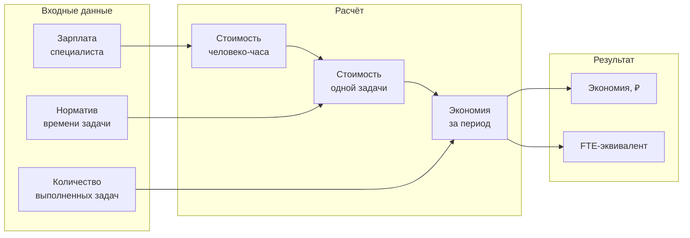
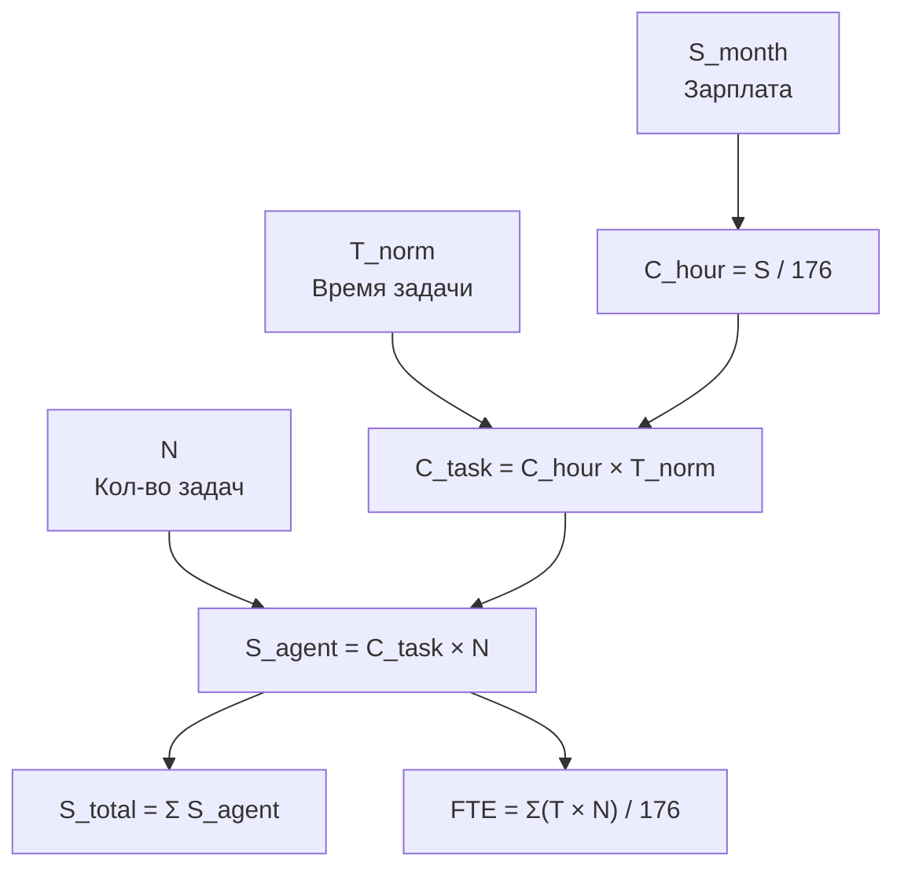
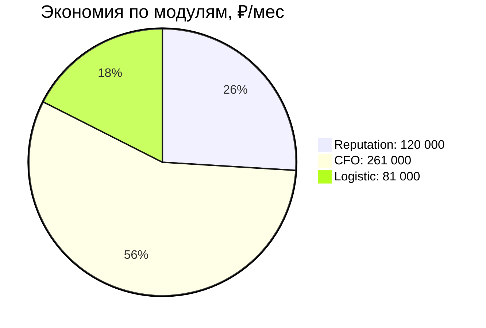
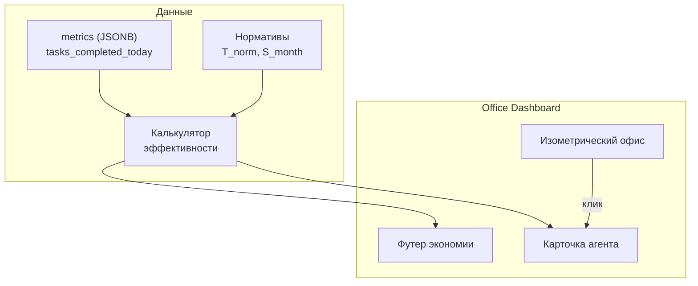

**Проект:** Визуальный дашборд AI-агентов  
**Модуль:** Office  
**Версия:** 1.0  
**Дата:** Февраль 2026

---

## 9.1 Назначение

Раздел описывает методику количественной оценки экономической эффективности AI-агентов ADOLF. Цель — перевести работу каждого агента в человеко-часы и показать руководителю экономию в рублях.

### Принцип расчёта

Каждая задача, выполненная AI-агентом, имеет эквивалент в виде времени, которое потратил бы на неё человек соответствующей квалификации. Зная стоимость часа работы специалиста и количество выполненных агентом задач, вычисляется экономия.



### Допущения MVP

| Параметр | Значение | Обоснование |
|----------|----------|-------------|
| Стоимость эксплуатации AI | 0 ₽ | Упрощение для MVP, инфраструктурные расходы не учитываются |
| Качество выполнения | Эквивалентно человеку | Предполагается равное качество при наличии валидации |
| Рабочий месяц | 176 часов | 22 рабочих дня × 8 часов |
| Рабочий день | 8 часов | Стандартный рабочий день |

---

## 9.2 Математическая модель

### 9.2.1 Стоимость человеко-часа

Базовая единица расчёта — стоимость одного часа работы специалиста, квалификация которого соответствует задачам агента.

$$
C_{hour} = \frac{S_{month}}{H_{month}}
$$

| Переменная | Описание | Единица |
|------------|----------|---------|
| C\_hour | Стоимость человеко-часа | ₽/час |
| S\_month | Месячная зарплата специалиста | ₽ |
| H\_month | Рабочих часов в месяце | часов (176) |

### 9.2.2 Стоимость одной задачи

Каждый тип задачи имеет нормативное время выполнения человеком.

$$
C_{task} = C_{hour} \times T_{norm}
$$

| Переменная | Описание | Единица |
|------------|----------|---------|
| C\_task | Стоимость выполнения задачи человеком | ₽ |
| T\_norm | Нормативное время выполнения задачи | часов |

### 9.2.3 Экономия по агенту за период

$$
S_{agent} = \sum_{i=1}^{K} \left( C_{task_i} \times N_{i} \right)
$$

| Переменная | Описание | Единица |
|------------|----------|---------|
| S\_agent | Экономия по агенту за период | ₽ |
| K | Количество типов задач агента | шт |
| C\_task\_i | Стоимость i-го типа задачи | ₽ |
| N\_i | Количество выполненных задач i-го типа за период | шт |

### 9.2.4 FTE-эквивалент агента

Показывает, сколько полных ставок заменяет агент.

$$
FTE_{agent} = \frac{\sum_{i=1}^{K} \left( T_{norm_i} \times N_{i} \right)}{H_{month}}
$$

| Переменная | Описание | Единица |
|------------|----------|---------|
| FTE\_agent | Эквивалент полных ставок | безразмерная |
| T\_norm\_i | Нормативное время i-й задачи | часов |
| H\_month | Часов в рабочем месяце | 176 |

### 9.2.5 Общая экономия по платформе

$$
S_{total} = \sum_{j=1}^{M} S_{agent_j}
$$

$$
FTE_{total} = \sum_{j=1}^{M} FTE_{agent_j}
$$

| Переменная | Описание |
|------------|----------|
| M | Общее количество агентов |
| S\_total | Совокупная экономия всех агентов, ₽/мес |
| FTE\_total | Совокупный FTE-эквивалент |

### 9.2.6 Сводная формула

Полная формула расчёта экономии по одному агенту, развёрнутая до базовых параметров:

$$
S_{agent} = \sum_{i=1}^{K} \left( \frac{S_{month}}{H_{month}} \times T_{norm_i} \times N_{i} \right)
$$



---

## 9.3 Нормативы по модулям

### 9.3.1 Reputation

**Базовая зарплата специалиста:** 50 000 ₽/мес  
**Стоимость часа:** 284 ₽/час

| Задача | Агент | T\_norm | C\_task | Описание |
|--------|-------|--------:|--------:|----------|
| Классификация отзыва | reputation\_wb, reputation\_ozon | 5 мин (0.083 ч) | 24 ₽ | Определение тональности, категории, приоритета |
| Генерация ответа на отзыв | reputation\_wb, reputation\_ozon | 15 мин (0.25 ч) | 71 ₽ | Написание персонализированного ответа с учётом данных о товаре |
| Генерация ответа на вопрос | reputation\_wb, reputation\_ozon | 10 мин (0.167 ч) | 47 ₽ | Ответ на вопрос покупателя по товару |
| Публикация ответа | reputation\_wb, reputation\_ozon | 3 мин (0.05 ч) | 14 ₽ | Вход в ЛК маркетплейса, вставка текста, отправка |

**Полный цикл обработки одного отзыва** (классификация + генерация + публикация): 23 мин, 109 ₽.

**Типовая нагрузка:**

| Метрика | Значение |
|---------|----------|
| Отзывов и вопросов в день | ~50 |
| Отзывов и вопросов в месяц | ~1 100 |
| Время человека на месячный объём | ~422 часа |
| FTE-эквивалент | 2.4 |
| Экономия в месяц | ~120 000 ₽ |

### 9.3.2 CFO

**Базовая зарплата специалиста:** 200 000 ₽/мес  
**Стоимость часа:** 1 136 ₽/час

| Задача | Агент | T\_norm | C\_task | Описание |
|--------|-------|--------:|--------:|----------|
| Импорт данных с одного МП | cfo\_import | 45 мин (0.75 ч) | 852 ₽ | Выгрузка из ЛК, загрузка в систему, сверка |
| Расчёт дневного P&L | cfo\_report | 2 ч | 2 273 ₽ | Сведение выручки, расходов, маржи по всем SKU |
| Обработка Excel-отчёта | cfo\_import | 1 ч | 1 136 ₽ | Парсинг финансового отчёта из ЛК маркетплейса |
| ABC-анализ | cfo\_report | 4 ч | 4 545 ₽ | Классификация SKU по вкладу в прибыль |
| Формирование кастомного отчёта | cfo\_report | 3 ч | 3 409 ₽ | Подготовка отчёта по запросу руководителя |
| Детекция аномалий | cfo\_report | 1.5 ч | 1 705 ₽ | Выявление отклонений в выручке и расходах |

**Типовая нагрузка:**

| Метрика | Значение |
|---------|----------|
| Импортов данных в месяц (3 МП × 22 дня) | 66 |
| Расчётов P&L в месяц | 22 |
| Excel-отчётов в месяц | 22 |
| ABC-анализов в месяц | 4 |
| Кастомных отчётов в месяц | 8 |
| Детекций аномалий в месяц | 22 |
| Время человека на месячный объём | ~230 часов |
| FTE-эквивалент | 1.3 |
| Экономия в месяц | ~261 000 ₽ |

### 9.3.3 Logistic

**Базовая зарплата специалиста:** 80 000 ₽/мес  
**Стоимость часа:** 455 ₽/час

| Задача | Агент | T\_norm | C\_task | Описание |
|--------|-------|--------:|--------:|----------|
| Мониторинг остатков по кластерам | logistic\_stock\_monitor | 3 ч | 1 364 ₽ | Проверка остатков FBO по 31 кластеру Ozon в разрезе SKU |
| Формирование наряд-задания | logistic\_supply\_planner | 1.5 ч | 682 ₽ | Определение что, сколько и на какой кластер отгрузить |
| Прогноз спроса по кластерам | logistic\_supply\_planner | 2 ч | 909 ₽ | Анализ истории продаж, расчёт прогноза на 7-14 дней |
| Выявление дисбаланса остатков | logistic\_stock\_monitor | 1 ч | 455 ₽ | Анализ перекосов распределения между кластерами |
| Расчёт убытков от межкластерной отгрузки | logistic\_stock\_monitor | 1.5 ч | 682 ₽ | Сведение данных об убытках за период |

**Типовая нагрузка:**

| Метрика | Значение |
|---------|----------|
| Мониторингов остатков в месяц (ежедневно) | 22 |
| Наряд-заданий в месяц | 22 |
| Прогнозов спроса в месяц | 22 |
| Выявлений дисбаланса в месяц | 22 |
| Расчётов убытков в месяц | 4 |
| Время человека на месячный объём | ~178 часов |
| FTE-эквивалент | 1.0 |
| Экономия в месяц | ~81 000 ₽ |

### 9.3.4 Сводная таблица

| Модуль | Зарплата эквивалента | FTE | Экономия, ₽/мес |
|--------|---------------------:|----:|-----------------:|
| Reputation | 50 000 | 2.4 | 120 000 |
| CFO | 200 000 | 1.3 | 261 000 |
| Logistic | 80 000 | 1.0 | 81 000 |
| **Итого** | — | **4.7** | **462 000** |



---

## 9.4 Визуализация в Dashboard

### 9.4.1 Блок экономии на главной странице Office

Блок располагается в футере Office Dashboard и отображает агрегированные данные.

**Состав:**

| Элемент | Описание | Источник данных |
|---------|----------|-----------------|
| Общая экономия, ₽/мес | S\_total | Расчёт по формуле 9.2.5 |
| FTE-эквивалент | FTE\_total | Расчёт по формуле 9.2.4 |
| Экономия по модулям | Разбивка по department | Группировка S\_agent |
| Динамика | Тренд за последние 30 дней | История task\_count |

### 9.4.2 Карточка агента — расширение

В детальной карточке агента (по клику) добавляются поля эффективности:

| Поле | Описание |
|------|----------|
| Задач выполнено сегодня | N из `metrics.tasks_completed_today` |
| Экономия сегодня | C\_task × N |
| Экономия за месяц | Накопленная сумма |
| FTE-эквивалент | Часы работы / 176 |
| Эквивалент зарплаты | Зарплата специалиста данной квалификации |

### 9.4.3 Формат отображения

**Футер Dashboard:**

```
💰 Экономия: 462 000 ₽/мес | 👥 Заменяет: 4.7 сотрудников
   Reputation: 120 000 ₽  |  CFO: 261 000 ₽  |  Logistic: 81 000 ₽
```

**Карточка агента (пример — reputation\_wb):**

```
📊 Эффективность
   Задач сегодня: 27
   Экономия сегодня: 2 943 ₽
   Экономия за месяц: 64 746 ₽
   FTE: 1.2 (эквивалент зарплаты: 50 000 ₽/мес)
```

### 9.4.4 Диаграмма компонентов визуализации



---

## 9.5 Примеры расчётов

### 9.5.1 Reputation: день работы

**Условия:** агент `reputation_wb` обработал за день 27 отзывов и 8 вопросов.

| Задача | Кол-во | T\_norm | C\_task | Сумма |
|--------|-------:|--------:|--------:|------:|
| Классификация отзыва | 27 | 0.083 ч | 24 ₽ | 648 ₽ |
| Генерация ответа на отзыв | 27 | 0.25 ч | 71 ₽ | 1 917 ₽ |
| Генерация ответа на вопрос | 8 | 0.167 ч | 47 ₽ | 376 ₽ |
| Публикация | 35 | 0.05 ч | 14 ₽ | 490 ₽ |
| **Итого** | **35** | — | — | **3 431 ₽** |

**Затрачено человеко-часов:** 27 × 0.383 + 8 × 0.217 + 35 × 0.05 = 13.84 ч  
**FTE за день:** 13.84 / 8 = **1.73** (один агент заменяет почти двух человек)

### 9.5.2 CFO: рабочая неделя

**Условия:** агенты CFO отработали стандартную неделю (5 рабочих дней).

| Задача | Кол-во | C\_task | Сумма |
|--------|-------:|--------:|------:|
| Импорт данных (3 МП × 5 дней) | 15 | 852 ₽ | 12 780 ₽ |
| Расчёт P&L (ежедневно) | 5 | 2 273 ₽ | 11 365 ₽ |
| Обработка Excel | 5 | 1 136 ₽ | 5 680 ₽ |
| ABC-анализ (раз в неделю) | 1 | 4 545 ₽ | 4 545 ₽ |
| Кастомный отчёт | 2 | 3 409 ₽ | 6 818 ₽ |
| Детекция аномалий | 5 | 1 705 ₽ | 8 525 ₽ |
| **Итого** | **33** | — | **49 713 ₽** |

**Затрачено человеко-часов:** 15×0.75 + 5×2 + 5×1 + 1×4 + 2×3 + 5×1.5 = 42.75 ч  
**FTE за неделю:** 42.75 / 40 = **1.07**

### 9.5.3 Logistic: месяц работы

**Условия:** полный рабочий месяц (22 дня), ассортимент ~500 SKU, 31 кластер Ozon.

| Задача | Кол-во | C\_task | Сумма |
|--------|-------:|--------:|------:|
| Мониторинг остатков | 22 | 1 364 ₽ | 30 008 ₽ |
| Формирование наряд-заданий | 22 | 682 ₽ | 15 004 ₽ |
| Прогноз спроса | 22 | 909 ₽ | 19 998 ₽ |
| Выявление дисбаланса | 22 | 455 ₽ | 10 010 ₽ |
| Расчёт убытков | 4 | 682 ₽ | 2 728 ₽ |
| **Итого** | **92** | — | **77 748 ₽** |

**Затрачено человеко-часов:** 22×3 + 22×1.5 + 22×2 + 22×1 + 4×1.5 = 171 ч  
**FTE:** 171 / 176 = **0.97**

### 9.5.4 Презентация для руководителя

Сводный отчёт за месяц по всем трём модулям:

```
╔══════════════════════════════════════════════════════════╗
║           ADOLF — Экономия на персонале                  ║
║                   Январь 2026                            ║
╠══════════════════════════════════════════════════════════╣
║                                                          ║
║  💰 Общая экономия:           462 000 ₽/мес             ║
║  👥 Заменяет сотрудников:     4.7 FTE                   ║
║  📋 Задач выполнено:          ~1 225 /мес               ║
║                                                          ║
║  ┌──────────────┬───────────┬──────┬──────────────┐     ║
║  │ Модуль       │ Зарплата  │ FTE  │ Экономия     │     ║
║  ├──────────────┼───────────┼──────┼──────────────┤     ║
║  │ Reputation   │  50 000 ₽ │  2.4 │  120 000 ₽   │     ║
║  │ CFO          │ 200 000 ₽ │  1.3 │  261 000 ₽   │     ║
║  │ Logistic     │  80 000 ₽ │  1.0 │   81 000 ₽   │     ║
║  ├──────────────┼───────────┼──────┼──────────────┤     ║
║  │ ИТОГО        │     —     │  4.7 │  462 000 ₽   │     ║
║  └──────────────┴───────────┴──────┴──────────────┘     ║
║                                                          ║
║  📈 Годовая экономия:        5 544 000 ₽               ║
║                                                          ║
╚══════════════════════════════════════════════════════════╝
```

### 9.5.5 Масштабирование

При подключении остальных модулей к методике расчёта прогнозируемая экономия увеличится:

| Модуль | Зарплата эквивалента | Ожидаемый FTE | Прогноз экономии |
|--------|---------------------:|--------------:|-----------------:|
| Reputation | 50 000 ₽ | 2.4 | 120 000 ₽ |
| CFO | 200 000 ₽ | 1.3 | 261 000 ₽ |
| Logistic | 80 000 ₽ | 1.0 | 81 000 ₽ |
| Watcher | — | — | TBD |
| Content Factory | — | — | TBD |
| Marketing | — | — | TBD |
| Scout | — | — | TBD |
| Knowledge | — | — | TBD |
| Lex | — | — | TBD |

---

## 9.6 Источники данных для расчёта

### 9.6.1 Откуда берётся N (количество задач)

Каждый агент записывает количество выполненных задач в поле `metrics` таблицы `office_agent_status`. Для расчёта эффективности используются следующие ключи:

| Модуль | Ключ в metrics | Описание |
|--------|----------------|----------|
| Reputation | `reviews_processed_today` | Обработанных отзывов/вопросов |
| CFO | `skus_calculated` | Рассчитанных P&L по SKU |
| CFO | `files_processed` | Обработанных файлов |
| Logistic | `clusters_monitored` | Проверенных кластеров |
| Logistic | `supply_tasks_created` | Сформированных наряд-заданий |

### 9.6.2 Откуда берутся нормативы

Нормативы T\_norm задаются при конфигурации агента и хранятся в конфигурации Office. В MVP нормативы статичны и определены в данном разделе документации. При масштабировании могут быть вынесены в таблицу БД.

### 9.6.3 Формула расчёта — сводный запрос

Псевдокод расчёта общей экономии за текущий месяц:

```
для каждого агента:
    N = сумма tasks_completed за текущий месяц (из metrics / history)
    T_norm = нормативное время задачи (из конфигурации)
    S_month = зарплата эквивалентного специалиста (из конфигурации)
    
    C_hour = S_month / 176
    S_agent = C_hour × T_norm × N

S_total = сумма всех S_agent
FTE_total = сумма всех (T_norm × N) / 176
```

---

**Документ подготовлен:** Февраль 2026  
**Версия:** 1.0  
**Статус:** Черновик
