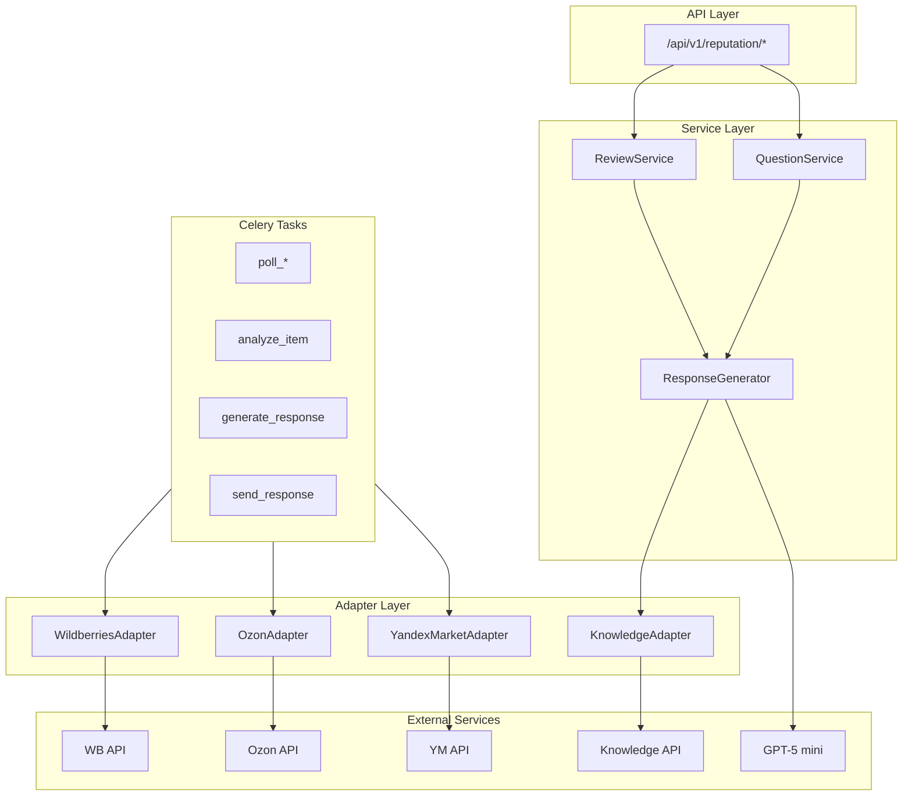
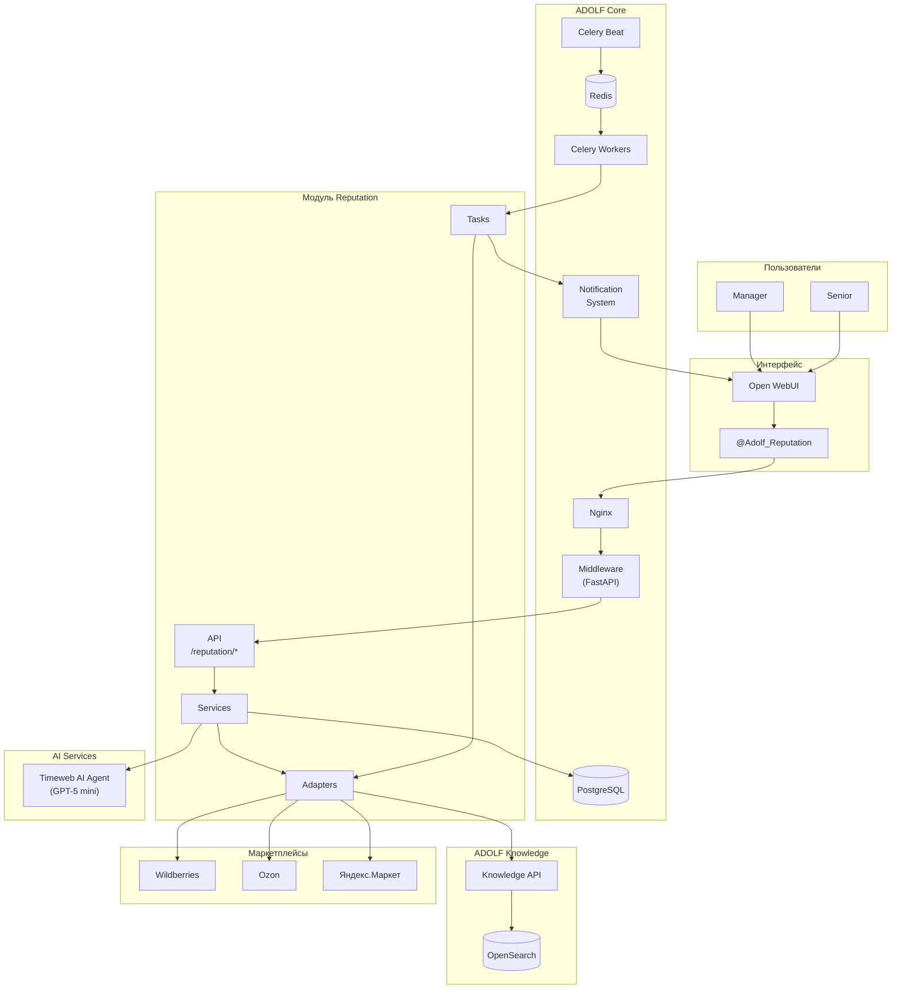
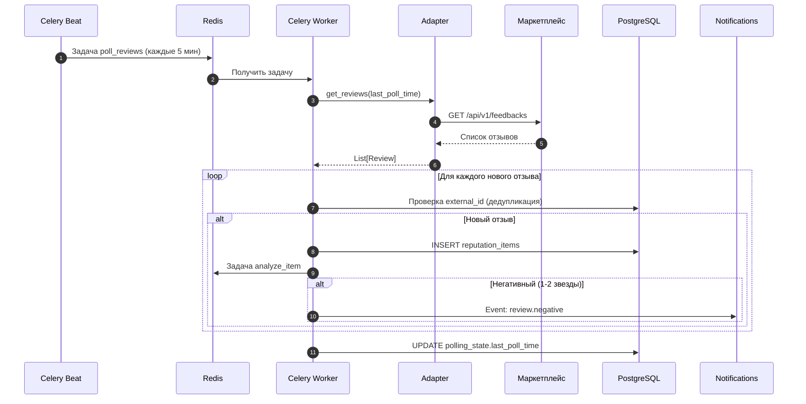
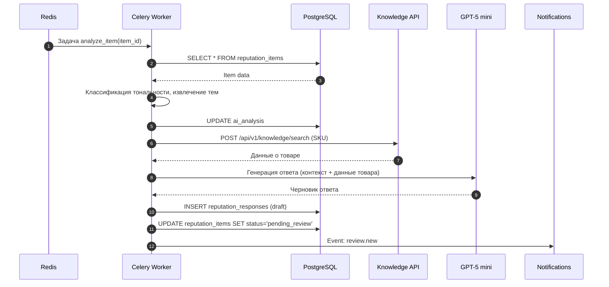
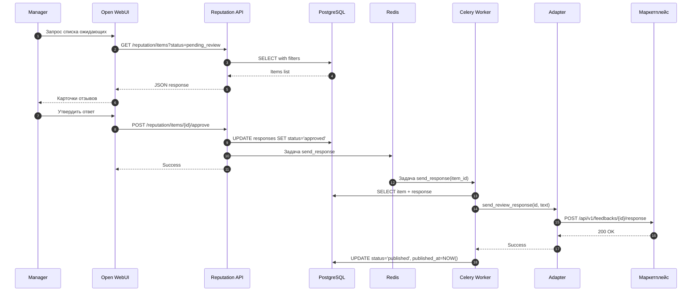
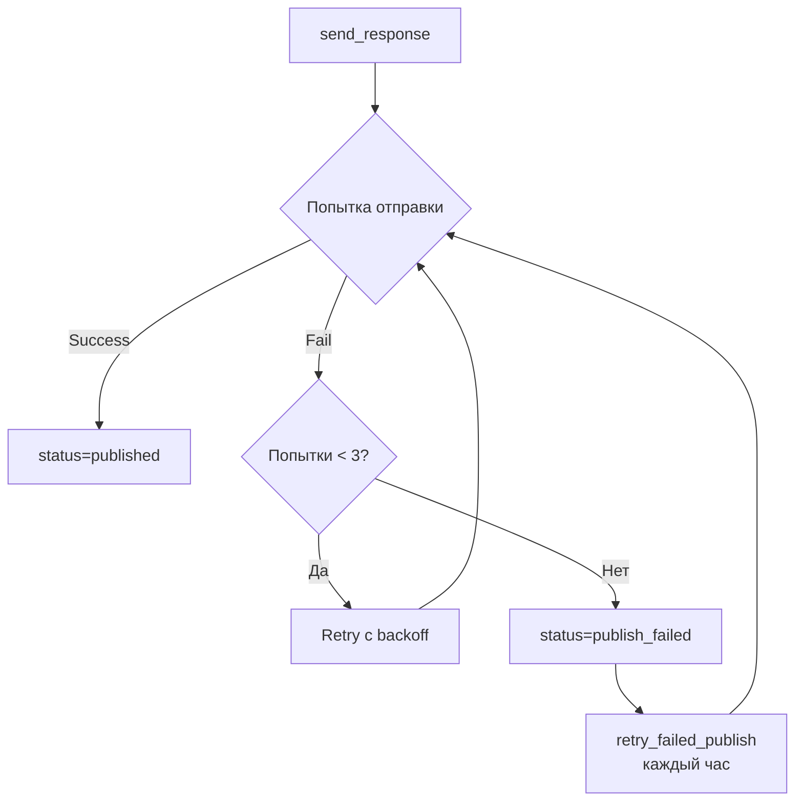

**Проект:** Интеллектуальная система управления репутацией  
**Модуль:** Reputation  
**Версия:** 2.1  
**Дата:** Январь 2026

---

## 1.1 Назначение модуля

### Цели модуля

Adolf Reputation — функциональный модуль системы Adolf, обеспечивающий автоматизированное управление репутацией на маркетплейсах Wildberries, Ozon и Яндекс.Маркет.

**Основные цели:**

| Цель | Описание | Метрика успеха |
|------|----------|----------------|
| Сокращение времени ответа | Автоматическая генерация ответов на отзывы и вопросы | Время реакции &lt; 30 минут |
| Повышение качества ответов | Персонализированные ответы на основе данных о товаре | Снижение возвратов на 15% |
| Аналитика тональности | Автоматическая классификация отзывов | 95% точность классификации |

### Задачи модуля

1. **Агрегация данных** — периодический сбор отзывов и вопросов с маркетплейсов
2. **AI-анализ** — классификация тональности, выявление тем
3. **Генерация ответов** — создание персонализированных ответов с учётом данных о товаре
4. **Валидация** — предоставление менеджеру интерфейса для утверждения/редактирования
5. **Публикация** — отправка утверждённых ответов через API маркетплейсов
6. **Аналитика** — сбор статистики по обработанным обращениям

### Целевые пользователи

| Роль | Доступ | Функции |
|------|--------|---------|
| Manager | Свой бренд | Обработка отзывов, утверждение ответов |
| Senior | Все бренды | Обработка + аналитика + настройки |
| Director | Все бренды | Полный доступ + отчётность |
| Administrator | Все бренды | Управление конфигурацией |

---

## 1.2 Границы модуля

### Входит в модуль Reputation

| Компонент | Описание |
|-----------|----------|
| Polling Service | Периодический сбор отзывов и вопросов через API маркетплейсов |
| AI Pipeline | Классификация, анализ тональности |
| Response Generator | Генерация ответов с использованием RAG (Knowledge API) |
| Marketplace Adapters | Унифицированный интерфейс к API WB, Ozon, YM |
| REST API | Endpoints для управления отзывами и вопросами |
| Open WebUI Agent | Интерфейс `@Adolf_Reputation` для менеджеров |
| Celery Tasks | Фоновые задачи polling, анализа, отправки |

### Не входит в модуль Reputation

| Компонент | Где реализовано | Тип взаимодействия |
|-----------|-----------------|-------------------|
| Авторизация пользователей | ADOLF Core (Middleware) | Используется готовая |
| База знаний о товарах | ADOLF Knowledge | API-запросы |
| Хранение пользователей | ADOLF Core (PostgreSQL) | Чтение таблицы `users` |
| Система уведомлений | ADOLF Core (Notifications) | Event Bus |
| Векторный поиск | Timeweb KB (OpenSearch) | Через Knowledge API |
| Генерация текста (LLM) | Timeweb AI Agent / OpenAI | API-вызовы |

### Функционал v2.0 (будущее)

| Компонент | Описание |
|-----------|----------|
| Vision Analyzer | Анализ фото на брак и дефекты (GPT-4o Vision) |
| Cross-Sell Engine | Рекомендации сопутствующих товаров |
| Media Downloader | Скачивание фото/видео из отзывов |

---

## 1.3 Зависимости от ADOLF Core

### 1.3.1 Middleware (FastAPI)

**Используемые возможности:**

| Возможность | Применение в Reputation |
|-------------|------------------------|
| Авторизация | Проверка `role >= manager` для доступа к функциям |
| Идентификация | Получение `user_id`, `brand_id` из заголовков |
| Роутинг | Регистрация endpoints `/api/v1/reputation/*` |
| Аудит | Логирование действий в `audit_log` |
| Webhook API | Отправка алертов через `/api/v1/webhooks/alerts` |

**Расширение Middleware:**

```
middleware/
├── routes/
│   └── reputation.py          # API endpoints
├── models/
│   └── reputation.py          # SQLAlchemy models
└── services/
    └── reputation/            
        ├── __init__.py
        ├── review_service.py
        ├── question_service.py
        └── response_generator.py
```

### 1.3.2 Celery Workers

**Задачи Reputation:**

| Задача | Очередь | Периодичность | Описание |
|--------|---------|---------------|----------|
| `reputation.poll_wb_reviews` | default | */5 :00 | Сбор отзывов Wildberries |
| `reputation.poll_wb_questions` | default | */5 :50 | Сбор вопросов Wildberries |
| `reputation.poll_ozon_reviews` | default | */5 1:40 | Сбор отзывов Ozon |
| `reputation.poll_ozon_questions` | default | */5 2:30 | Сбор вопросов Ozon |
| `reputation.poll_ym_reviews` | default | */5 3:20 | Сбор отзывов Яндекс.Маркет |
| `reputation.poll_ym_questions` | default | */5 4:10 | Сбор вопросов Яндекс.Маркет |
| `reputation.analyze_item` | default | По событию | AI-анализ отзыва/вопроса |
| `reputation.generate_response` | default | По событию | Генерация ответа |
| `reputation.send_response` | default | По событию | Публикация ответа |
| `reputation.retry_failed_publish` | default | Каждый час | Повторная отправка failed |
| `reputation.calculate_daily_analytics` | default | 01:00 | Ежедневная аналитика |
| `reputation.archive_old_items` | default | 02:00 | Архивация старых записей |

**Расширение структуры tasks:**

```
tasks/
└── reputation_tasks.py        # Реализация задач
```

### 1.3.3 PostgreSQL

**Новые таблицы:**

| Таблица | Назначение |
|---------|------------|
| `reputation_items` | Отзывы и вопросы |
| `reputation_responses` | Сгенерированные и отправленные ответы |
| `polling_state` | Состояние polling по платформам |
| `reputation_analytics` | Агрегированная статистика |

**Используемые таблицы Core:**

| Таблица | Использование |
|---------|---------------|
| `users` | Получение `role`, `brand_id` для фильтрации |
| `audit_log` | Запись действий пользователей |
| `notifications` | Создание уведомлений о новых отзывах |

### 1.3.4 Redis

**Использование:**

| Применение | Описание |
|------------|----------|
| Celery Broker | Очередь задач polling и обработки |
| Rate Limiting | Контроль частоты запросов к API маркетплейсов |
| Circuit Breaker | Состояние circuit breaker для API |

### 1.3.5 Notification System

**Типы событий для уведомлений:**

| Событие | Уровень | Получатели | Описание |
|---------|---------|------------|----------|
| `review.new` | info | Manager (по бренду) | Новый отзыв |
| `question.new` | info | Manager (по бренду) | Новый вопрос |
| `review.negative` | warning | Manager (по бренду) | Негативный отзыв (1-2 звезды) |

### 1.3.6 Environment Variables

**Credentials для API маркетплейсов:**

```bash
# Wildberries
WB_API_TOKEN=xxx
WB_API_TOKEN_EXPIRES=2026-06-01T00:00:00Z

# Ozon
OZON_CLIENT_ID=xxx
OZON_API_KEY=xxx

# Яндекс.Маркет
YM_OAUTH_TOKEN=xxx
YM_CAMPAIGN_ID=xxx
```

---

## 1.4 Компоненты модуля

### 1.4.1 Структура компонентов



### 1.4.2 API Layer

**Endpoints:**

| Method | Endpoint | Описание |
|--------|----------|----------|
| GET | `/api/v1/reputation/items` | Список отзывов и вопросов |
| GET | `/api/v1/reputation/items/{id}` | Детали отзыва/вопроса |
| POST | `/api/v1/reputation/items/{id}/approve` | Утвердить ответ |
| POST | `/api/v1/reputation/items/{id}/edit` | Редактировать и утвердить |
| POST | `/api/v1/reputation/items/{id}/skip` | Пропустить (не отвечать) |
| POST | `/api/v1/reputation/items/{id}/escalate` | Эскалация |
| POST | `/api/v1/reputation/items/{id}/regenerate` | Перегенерировать ответ |
| POST | `/api/v1/reputation/items/bulk-approve` | Массовое утверждение |
| GET | `/api/v1/reputation/stats` | Статистика по отзывам |
| GET | `/api/v1/reputation/analytics` | Расширенная аналитика |

### 1.4.3 Service Layer

**ReviewService / QuestionService:**

| Метод | Описание |
|-------|----------|
| `get_items(filters)` | Получение списка с фильтрацией |
| `get_item(id)` | Получение по ID |
| `update_status(id, status)` | Изменение статуса |
| `assign_manager(id, user_id)` | Назначение ответственного |

**ResponseGenerator:**

| Метод | Описание |
|-------|----------|
| `generate(item)` | Генерация ответа с RAG |
| `regenerate(item, instructions)` | Перегенерация с указаниями |

### 1.4.4 Adapter Layer

**Интерфейс MarketplaceAdapter (абстрактный):**

```python
class MarketplaceAdapter(ABC):
    @abstractmethod
    async def get_reviews(self, params: PollParams) -> List[Review]: ...
    
    @abstractmethod
    async def get_questions(self, params: PollParams) -> List[Question]: ...
    
    @abstractmethod
    async def send_review_response(self, review_id: str, text: str) -> bool: ...
    
    @abstractmethod
    async def send_question_response(self, question_id: str, text: str) -> bool: ...
```

### 1.4.5 Open WebUI Agent

**Агент:** `@Adolf_Reputation`

**Функции (Tools):**

| Tool | Описание |
|------|----------|
| `get_pending_items` | Получить список ожидающих обработки |
| `get_item_details` | Детали отзыва с анализом и черновиком |
| `approve_response` | Утвердить ответ |
| `edit_and_approve` | Редактировать и утвердить |
| `regenerate_response` | Перегенерировать ответ |
| `escalate` | Эскалация |
| `get_stats` | Статистика за период |
| `bulk_approve` | Массовое утверждение (5 звёзд без текста) |

---

## 1.5 Архитектурная диаграмма

### Общая схема модуля



---

## 1.6 Потоки данных

### 1.6.1 Поток 1: Сбор отзывов (Polling)



### 1.6.2 Поток 2: Обработка отзыва (AI Pipeline)



### 1.6.3 Поток 3: Утверждение и публикация



---

## 1.7 Обработка ошибок

### Единая политика

| Параметр | Значение |
|----------|----------|
| Timeout запроса | 30 секунд |
| Retry стратегия | Exponential backoff: 1с → 2с → 4с |
| Максимум попыток | 3 |
| Circuit breaker открытие | После 5 последовательных ошибок |
| Circuit breaker reset | 60 секунд |

### Обработка ошибок публикации



---

## 1.8 Масштабирование

### Горизонтальное масштабирование

| Компонент | Способ масштабирования |
|-----------|------------------------|
| Celery Workers | Увеличение количества воркеров |
| API | Репликация контейнеров за Nginx |
| PostgreSQL | Read replicas (при необходимости) |

### Рекомендации по нагрузке

| Параметр | Значение v4.0 | Предел |
|----------|---------------|--------|
| Отзывов в день | ~50 | 500 |
| Polling interval | 5 минут | 1 минута |
| Celery workers | 2 | 8 |
| API replicas | 1 | 4 |

---

## Приложение А: Контрольные точки

| Критерий | Проверка |
|----------|----------|
| Polling работает | Логи Celery показывают задачи poll_* |
| Дедупликация | Повторный polling не создаёт дубликатов |
| AI-анализ | Поле ai_analysis заполняется |
| Генерация ответов | Поле draft_text создаётся |
| Публикация | Ответы появляются на маркетплейсе |
| Уведомления | События приходят в Open WebUI |

---

## Приложение Б: Расширение в v2.0

При переходе на v2.0 планируется добавление:

| Компонент | Описание |
|-----------|----------|
| VisionAnalyzer | Анализ фото на брак (GPT-4o Vision) |
| CrossSellService | Рекомендации сопутствующих товаров |
| MediaDownloader | Скачивание и хранение фото/видео |
| response_quality_reviews | Оценка качества ответов менеджерами |

---

**Документ подготовлен:** Январь 2026  
**Версия:** 2.1  
**Статус:** Согласовано
