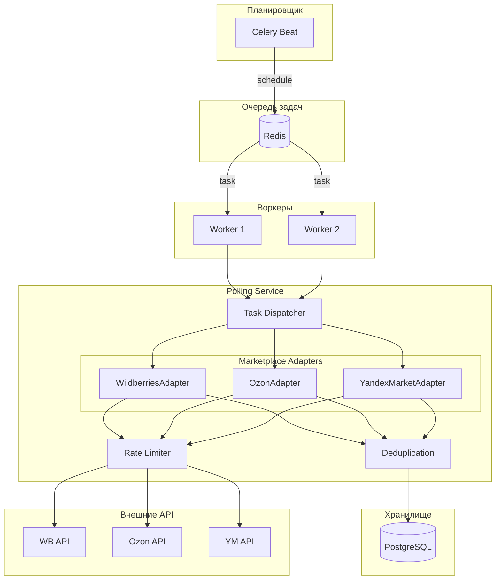
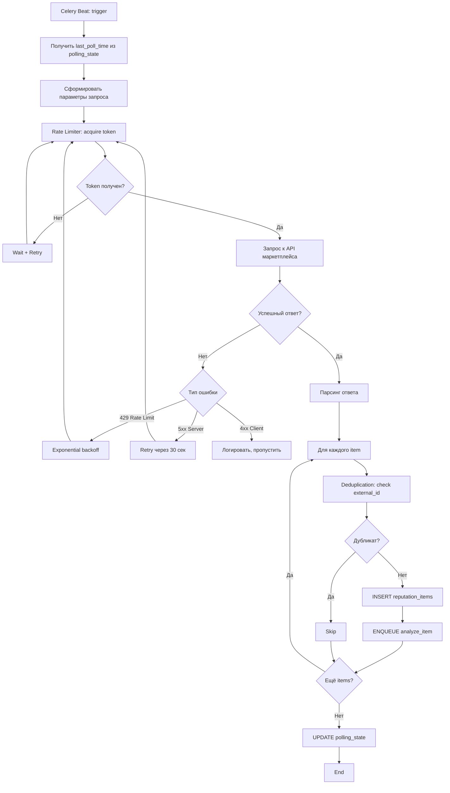

# ADOLF REPUTATION — Раздел 2: Polling Service Module

**Проект:** Интеллектуальная система управления репутацией  
**Модуль:** Reputation / Polling Service  
**Версия:** 2.1  
**Дата:** Январь 2026

---

## 2.1 Назначение и принципы

### Назначение

Polling Service — компонент модуля Reputation, отвечающий за периодический сбор отзывов и вопросов покупателей с маркетплейсов Wildberries, Ozon и Яндекс.Маркет.

### Принцип работы

**Pull-модель:** Система периодически опрашивает API маркетплейсов для получения новых данных.

| Критерий | Pull (polling) | Push (webhook) |
|----------|---------------|----------------|
| Единообразие | ✅ Одинаково для всех площадок | ❌ Не все поддерживают |
| Контроль нагрузки | ✅ Полный контроль | ❌ Зависит от источника |
| Надёжность | ✅ Retry при сбоях | ❌ Потеря при недоступности |
| Сложность | ✅ Проще реализация | ❌ Требует endpoint + верификация |

### Ключевые принципы

| Принцип | Описание |
|---------|----------|
| Идемпотентность | Повторный polling не создаёт дубликатов |
| Rate Limit Compliance | Строгое соблюдение лимитов API |
| Graceful Degradation | Сбой одной площадки не влияет на другие |
| Incremental Sync | Запрос только новых данных (с last_poll_time) |
| Distributed Schedule | Смещение задач для равномерной нагрузки |

---

## 2.2 Архитектура Polling Service

### Компоненты



### Взаимодействие компонентов

| Компонент | Ответственность | Зависимости |
|-----------|-----------------|-------------|
| Celery Beat | Запуск задач по расписанию | Redis |
| Task Dispatcher | Маршрутизация по платформам | Adapters |
| Adapters | Взаимодействие с API | Rate Limiter |
| Rate Limiter | Соблюдение лимитов | Redis |
| Deduplication | Проверка уникальности | PostgreSQL |

---

## 2.3 Celery Tasks

### Реестр задач polling

| Задача | Тип | Очередь | Смещение | Описание |
|--------|-----|---------|----------|----------|
| `reputation.poll_wb_reviews` | periodic | default | :00 | Отзывы Wildberries |
| `reputation.poll_wb_questions` | periodic | default | :50 | Вопросы Wildberries |
| `reputation.poll_ozon_reviews` | periodic | default | 1:40 | Отзывы Ozon |
| `reputation.poll_ozon_questions` | periodic | default | 2:30 | Вопросы Ozon |
| `reputation.poll_ym_reviews` | periodic | default | 3:20 | Отзывы Яндекс.Маркет |
| `reputation.poll_ym_questions` | periodic | default | 4:10 | Вопросы Яндекс.Маркет |

### Конфигурация Celery Beat

```python
from celery.schedules import crontab

# Расписание с распределённым смещением
# Интервал 5 минут, смещение ~50 секунд между задачами
beat_schedule = {
    # Wildberries Reviews: */5 :00
    "poll-wb-reviews": {
        "task": "tasks.reputation_tasks.poll_wb_reviews",
        "schedule": crontab(minute="*/5"),
        "options": {"queue": "default"}
    },
    # Wildberries Questions: */5 :50
    "poll-wb-questions": {
        "task": "tasks.reputation_tasks.poll_wb_questions",
        "schedule": crontab(minute="0,5,10,15,20,25,30,35,40,45,50,55"),
        "options": {"queue": "default", "countdown": 50}
    },
    
    # Ozon Reviews: */5 1:40
    "poll-ozon-reviews": {
        "task": "tasks.reputation_tasks.poll_ozon_reviews",
        "schedule": crontab(minute="1,6,11,16,21,26,31,36,41,46,51,56"),
        "options": {"queue": "default", "countdown": 40}
    },
    # Ozon Questions: */5 2:30
    "poll-ozon-questions": {
        "task": "tasks.reputation_tasks.poll_ozon_questions",
        "schedule": crontab(minute="2,7,12,17,22,27,32,37,42,47,52,57"),
        "options": {"queue": "default", "countdown": 30}
    },
    
    # Яндекс.Маркет Reviews: */5 3:20
    "poll-ym-reviews": {
        "task": "tasks.reputation_tasks.poll_ym_reviews",
        "schedule": crontab(minute="3,8,13,18,23,28,33,38,43,48,53,58"),
        "options": {"queue": "default", "countdown": 20}
    },
    # Яндекс.Маркет Questions: */5 4:10
    "poll-ym-questions": {
        "task": "tasks.reputation_tasks.poll_ym_questions",
        "schedule": crontab(minute="4,9,14,19,24,29,34,39,44,49,54,59"),
        "options": {"queue": "default", "countdown": 10}
    },
}
```

### Визуализация распределения

```
Минута 0:  WB Reviews  ─────────────────────────────────────────
           :00         :50
Минута 1:              ───── WB Questions ─────
                             1:40
Минута 2:                    ───── Ozon Reviews ─────
                                   2:30
Минута 3:                          ───── Ozon Questions ─────
                                         3:20
Минута 4:                                ───── YM Reviews ─────
                                               4:10
Минута 5:  WB Reviews  ────────────────────── YM Questions ─────
```

### Алгоритм задачи polling



---

## 2.4 Credentials Management

### Environment Variables

Credentials для API маркетплейсов хранятся в environment variables:

```bash
# Wildberries
WB_API_TOKEN=xxx
WB_API_TOKEN_EXPIRES=2026-06-01T00:00:00Z

# Ozon
OZON_CLIENT_ID=xxx
OZON_API_KEY=xxx

# Яндекс.Маркет
YM_OAUTH_TOKEN=xxx
YM_CAMPAIGN_ID=xxx
```

### Загрузка credentials

```python
# config/marketplace_credentials.py
import os
from dataclasses import dataclass
from datetime import datetime
from typing import Optional

@dataclass
class WBCredentials:
    api_token: str
    expires_at: Optional[datetime] = None

@dataclass
class OzonCredentials:
    client_id: str
    api_key: str

@dataclass
class YMCredentials:
    oauth_token: str
    campaign_id: str

def get_wb_credentials() -> WBCredentials:
    expires_str = os.getenv("WB_API_TOKEN_EXPIRES")
    expires_at = datetime.fromisoformat(expires_str) if expires_str else None
    return WBCredentials(
        api_token=os.environ["WB_API_TOKEN"],
        expires_at=expires_at
    )

def get_ozon_credentials() -> OzonCredentials:
    return OzonCredentials(
        client_id=os.environ["OZON_CLIENT_ID"],
        api_key=os.environ["OZON_API_KEY"]
    )

def get_ym_credentials() -> YMCredentials:
    return YMCredentials(
        oauth_token=os.environ["YM_OAUTH_TOKEN"],
        campaign_id=os.environ["YM_CAMPAIGN_ID"]
    )
```

---

## 2.5 Wildberries Adapter

### API Endpoints

| Endpoint | Метод | Назначение |
|----------|-------|------------|
| `/api/v1/feedbacks` | GET | Список отзывов |
| `/api/v1/questions` | GET | Список вопросов |

**Base URL:** `https://feedbacks-api.wildberries.ru`

### Параметры запроса

| Параметр | Тип | Обязательный | Описание |
|----------|-----|--------------|----------|
| `isAnswered` | boolean | Нет | Фильтр по наличию ответа |
| `take` | int | Да | Количество (макс. 10000) |
| `skip` | int | Да | Смещение для пагинации |
| `dateFrom` | int | Нет | Unix timestamp начала |
| `dateTo` | int | Нет | Unix timestamp конца |

### Маппинг полей WB → reputation_items

| WB поле | reputation_items поле | Преобразование |
|---------|----------------------|----------------|
| `id` | `external_id` | Прямое |
| `nmId` | `sku` | `str(nmId)` |
| `userName` | `client_name` | Прямое |
| `text` | `client_text` | Прямое |
| `productValuation` | `rating` | Прямое (1-5) |
| `createdDate` | `created_at` | ISO → datetime |
| `answer` | — | Если есть → status='published' |

### Rate Limits

| Endpoint | Лимит | Период |
|----------|-------|--------|
| `/api/v1/feedbacks` | 100 | 1 минута |
| `/api/v1/questions` | 100 | 1 минута |

---

## 2.6 Ozon Adapter

### API Endpoints

| Endpoint | Метод | Назначение |
|----------|-------|------------|
| `/v1/review/list` | POST | Список отзывов |
| `/v1/product/questions` | POST | Список вопросов |

**Base URL:** `https://api-seller.ozon.ru`

### Заголовки авторизации

```
Client-Id: {OZON_CLIENT_ID}
Api-Key: {OZON_API_KEY}
Content-Type: application/json
```

### Параметры запроса

```json
{
  "filter": {
    "interaction_status": "NEED_ANSWER",
    "published_at_from": "2026-01-01T00:00:00Z"
  },
  "last_id": "",
  "limit": 100,
  "sort_by": "PUBLISHED_AT",
  "sort_dir": "DESC"
}
```

### Rate Limits

| Endpoint | Лимит | Период |
|----------|-------|--------|
| `/v1/review/list` | 60 | 1 минута |
| `/v1/product/questions` | 60 | 1 минута |

---

## 2.7 Яндекс.Маркет Adapter

### API Endpoints

| Endpoint | Метод | Назначение |
|----------|-------|------------|
| `/campaigns/{id}/feedback/updates` | GET | Список отзывов |
| `/campaigns/{id}/offers/{id}/questions` | GET | Список вопросов |

**Base URL:** `https://api.partner.market.yandex.ru`

### Заголовки авторизации

```
Authorization: Bearer {YM_OAUTH_TOKEN}
Content-Type: application/json
```

### Rate Limits

| Endpoint | Лимит | Период |
|----------|-------|--------|
| Все endpoints | 100 | 1 минута |

---

## 2.8 Rate Limiter

### Реализация

```python
# services/rate_limiter.py
import redis
import time
from typing import Optional

class RateLimiter:
    """Token bucket rate limiter с Redis backend."""
    
    def __init__(self, redis_client: redis.Redis):
        self.redis = redis_client
    
    def acquire(
        self, 
        key: str, 
        max_tokens: int, 
        refill_rate: float,
        timeout: float = 30.0
    ) -> bool:
        """
        Попытка получить токен.
        
        Args:
            key: Уникальный ключ лимита (например, 'wb:feedbacks')
            max_tokens: Максимальное количество токенов
            refill_rate: Скорость пополнения (токенов/сек)
            timeout: Максимальное время ожидания
        
        Returns:
            True если токен получен, False если timeout
        """
        start_time = time.time()
        
        while time.time() - start_time < timeout:
            tokens = self._get_tokens(key, max_tokens, refill_rate)
            
            if tokens >= 1:
                self._consume_token(key)
                return True
            
            # Ждём пополнения
            wait_time = 1 / refill_rate
            time.sleep(min(wait_time, 1.0))
        
        return False
    
    def _get_tokens(self, key: str, max_tokens: int, refill_rate: float) -> float:
        """Получить текущее количество токенов."""
        pipe = self.redis.pipeline()
        now = time.time()
        
        # Получить последнее обновление и количество токенов
        data = self.redis.hgetall(f"ratelimit:{key}")
        
        if not data:
            # Инициализация: полный bucket
            self.redis.hset(f"ratelimit:{key}", mapping={
                "tokens": max_tokens,
                "last_update": now
            })
            return max_tokens
        
        tokens = float(data.get(b"tokens", max_tokens))
        last_update = float(data.get(b"last_update", now))
        
        # Пополнение токенов
        elapsed = now - last_update
        tokens = min(max_tokens, tokens + elapsed * refill_rate)
        
        # Обновить состояние
        self.redis.hset(f"ratelimit:{key}", mapping={
            "tokens": tokens,
            "last_update": now
        })
        
        return tokens
    
    def _consume_token(self, key: str):
        """Использовать один токен."""
        self.redis.hincrbyfloat(f"ratelimit:{key}", "tokens", -1)
```

### Конфигурация лимитов

```python
RATE_LIMITS = {
    "wb:feedbacks": {"max_tokens": 100, "refill_rate": 100/60},
    "wb:questions": {"max_tokens": 100, "refill_rate": 100/60},
    "ozon:reviews": {"max_tokens": 60, "refill_rate": 60/60},
    "ozon:questions": {"max_tokens": 60, "refill_rate": 60/60},
    "ym:feedbacks": {"max_tokens": 100, "refill_rate": 100/60},
    "ym:questions": {"max_tokens": 100, "refill_rate": 100/60},
}
```

---

## 2.9 Circuit Breaker

### Реализация

```python
# services/circuit_breaker.py
from enum import Enum
from datetime import datetime, timedelta

class CircuitState(Enum):
    CLOSED = "closed"
    OPEN = "open"
    HALF_OPEN = "half_open"

class CircuitBreaker:
    """Circuit breaker для защиты от каскадных сбоев."""
    
    def __init__(
        self,
        failure_threshold: int = 5,
        reset_timeout: int = 60,
        db_session = None
    ):
        self.failure_threshold = failure_threshold
        self.reset_timeout = reset_timeout
        self.db = db_session
    
    def get_state(self, platform: str, item_type: str) -> CircuitState:
        """Получить состояние circuit breaker."""
        state = self.db.query(PollingState).filter(
            PollingState.platform == platform,
            PollingState.item_type == item_type
        ).first()
        
        if not state:
            return CircuitState.CLOSED
        
        if state.circuit_breaker_open:
            if datetime.utcnow() > state.circuit_breaker_until:
                return CircuitState.HALF_OPEN
            return CircuitState.OPEN
        
        return CircuitState.CLOSED
    
    def record_success(self, platform: str, item_type: str):
        """Записать успешный запрос."""
        self.db.query(PollingState).filter(
            PollingState.platform == platform,
            PollingState.item_type == item_type
        ).update({
            "consecutive_errors": 0,
            "circuit_breaker_open": False,
            "circuit_breaker_until": None,
            "last_poll_status": "success"
        })
        self.db.commit()
    
    def record_failure(self, platform: str, item_type: str, error: str):
        """Записать неудачный запрос."""
        state = self.db.query(PollingState).filter(
            PollingState.platform == platform,
            PollingState.item_type == item_type
        ).first()
        
        state.consecutive_errors += 1
        state.last_poll_status = "error"
        state.last_poll_error = error
        
        if state.consecutive_errors >= self.failure_threshold:
            state.circuit_breaker_open = True
            state.circuit_breaker_until = datetime.utcnow() + timedelta(seconds=self.reset_timeout)
        
        self.db.commit()
```

---

## 2.10 Обработка ошибок

### Единая политика

| Параметр | Значение |
|----------|----------|
| Timeout запроса | 30 секунд |
| Retry стратегия | Exponential backoff: 1с → 2с → 4с |
| Максимум попыток | 3 |
| Circuit breaker открытие | После 5 последовательных ошибок |
| Circuit breaker reset | 60 секунд |

### Типы ошибок и реакция

| Код | Тип | Действие |
|-----|-----|----------|
| 200 | Success | Обработать данные |
| 400 | Bad Request | Логировать, пропустить |
| 401/403 | Auth Error | Алерт администратору |
| 404 | Not Found | Логировать, пропустить |
| 429 | Rate Limit | Exponential backoff |
| 500-599 | Server Error | Retry через 30 сек |
| Timeout | Network | Retry с backoff |

---

## 2.11 Мониторинг и метрики

### Метрики polling

| Метрика | Тип | Описание |
|---------|-----|----------|
| `reputation_polling_duration_seconds` | histogram | Время выполнения polling |
| `reputation_polling_items_fetched` | counter | Количество полученных items |
| `reputation_polling_errors_total` | counter | Количество ошибок |
| `reputation_polling_duplicates_skipped` | counter | Пропущенные дубликаты |
| `reputation_circuit_breaker_state` | gauge | Состояние circuit breaker |

### Логирование

```python
# Структура лога polling
{
    "event": "polling_completed",
    "platform": "wb",
    "item_type": "review",
    "duration_ms": 1234,
    "items_fetched": 15,
    "items_new": 10,
    "items_duplicate": 5,
    "errors": 0,
    "timestamp": "2026-01-10T14:30:00Z"
}
```

---

## Приложение А: Контрольные точки

| Критерий | Проверка |
|----------|----------|
| Celery Beat запущен | `celery -A app inspect scheduled` |
| Задачи выполняются | Логи показывают polling каждые 5 мин |
| Дедупликация работает | Повторный polling не создаёт дубликатов |
| Rate Limiter работает | Нет 429 ошибок |
| Circuit Breaker | Открывается при 5 ошибках подряд |
| polling_state обновляется | last_poll_time актуален |

---

**Документ подготовлен:** Январь 2026  
**Версия:** 2.1  
**Статус:** Согласовано
