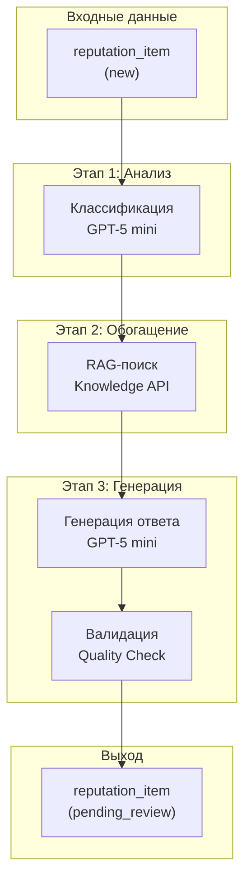
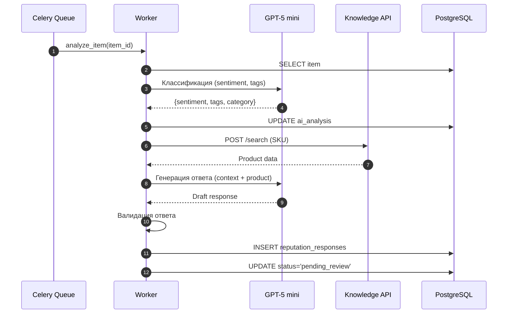

**Проект:** Интеллектуальная система управления репутацией  
**Модуль:** Reputation / AI Pipeline  
**Версия:** 2.1  
**Дата:** Январь 2026

---

## 3.1 Назначение и архитектура

### Назначение

AI Pipeline — компонент модуля Reputation, отвечающий за интеллектуальную обработку отзывов и вопросов:

| Функция | Описание | AI-модель |
|---------|----------|-----------|
| Классификация | Определение тональности, тем, категорий | GPT-5 mini |
| RAG-поиск | Получение данных о товаре | Knowledge API |
| Генерация ответа | Создание персонализированного ответа | GPT-5 mini |

### Архитектура Pipeline



### Последовательность обработки



---

## 3.2 Celery Tasks

### Реестр задач AI Pipeline

| Задача | Тип | Очередь | Описание |
|--------|-----|---------|----------|
| `reputation.analyze_item` | async | default | Полный цикл анализа |
| `reputation.classify_item` | async | default | Только классификация |
| `reputation.generate_response` | async | default | Генерация ответа |
| `reputation.regenerate_response` | async | default | Перегенерация с инструкциями |

### Task: analyze_item

```python
@shared_task(name="reputation.analyze_item", bind=True, max_retries=3)
def analyze_item(self, item_id: int):
    """Полный цикл AI-обработки отзыва/вопроса."""
    
    with get_db_session() as db:
        # 1. Загрузка данных
        item = db.query(ReputationItem).get(item_id)
        if not item or item.status != 'new':
            logger.warning(f"Item {item_id} already processed or not found")
            return
        
        item.status = 'analyzing'
        db.commit()
        
        try:
            # 2. Классификация (sentiment, tags)
            classification = classify_text(
                text=item.client_text,
                item_type=item.item_type,
                rating=item.rating
            )
            
            # 3. Сохранение анализа
            item.ai_analysis = {
                "sentiment": classification["sentiment"],
                "sentiment_score": classification["score"],
                "tags": classification["tags"],
                "category": classification["category"],
                "key_points": classification["key_points"],
                "analyzed_at": datetime.utcnow().isoformat()
            }
            db.commit()
            
            # 4. Генерация ответа
            generate_response.delay(item_id)
            
        except Exception as e:
            item.status = 'error'
            item.error_message = str(e)
            db.commit()
            raise self.retry(exc=e, countdown=60)
```

### Task: generate_response

```python
@shared_task(name="reputation.generate_response", bind=True, max_retries=3)
def generate_response(self, item_id: int, instructions: str = None):
    """Генерация ответа с использованием RAG."""
    
    with get_db_session() as db:
        item = db.query(ReputationItem).get(item_id)
        
        try:
            # 1. RAG: поиск данных о товаре
            product_context = knowledge_api.search(
                query=f"артикул {item.sku} размер состав характеристики",
                filters={"brand_id": [item.brand_id, "all"]},
                top_k=5
            )
            
            # 2. Формирование контекста
            context = build_generation_context(
                item=item,
                product_data=product_context,
                instructions=instructions
            )
            
            # 3. Генерация
            draft = gpt_generate(context)
            
            # 4. Валидация
            validation = validate_response(draft, item)
            if not validation.is_valid:
                draft = gpt_generate(context, correction=validation.issues)
            
            # 5. Сохранение
            response = ReputationResponse(
                item_id=item_id,
                draft_text=draft,
                generation_model="gpt-5-mini",
                status='draft'
            )
            db.add(response)
            
            item.status = 'pending_review'
            db.commit()
            
            # 6. Уведомление
            notify_new_item(item)
            
        except Exception as e:
            item.status = 'error'
            item.error_message = str(e)
            db.commit()
            raise self.retry(exc=e, countdown=60)
```

---

## 3.3 Классификация

### Назначение

Классификация определяет:
- Тональность (sentiment)
- Тематические теги
- Категорию проблемы
- Ключевые аспекты отзыва

### Промпт классификации

```python
CLASSIFICATION_PROMPT = """
Проанализируй отзыв покупателя на товар одежды.

Отзыв: {client_text}
Тип: {item_type}
Оценка: {rating}/5

Определи:
1. sentiment: positive / neutral / negative
2. sentiment_score: число от 0.0 до 1.0
3. tags: список тегов (размер, качество, доставка, упаковка, цена, внешний_вид)
4. category: основная категория (sizing, quality, delivery, packaging, price, appearance, other)
5. key_points: список ключевых моментов из отзыва (1-3 пункта)

Ответ в JSON:
```json
\{
    "sentiment": "...",
    "sentiment_score": 0.0,
    "tags": ["...", "..."],
    "category": "...",
    "key_points": ["...", "..."]
}
```
"""
```

### Реализация классификации

```python
async def classify_text(
    text: str,
    item_type: str,
    rating: Optional[int]
) -> dict:
    """Классификация текста отзыва/вопроса."""
    
    prompt = CLASSIFICATION_PROMPT.format(
        client_text=text,
        item_type=item_type,
        rating=rating or "нет"
    )
    
    response = await gpt_client.chat_completion(
        model="gpt-5-mini",
        messages=[
            {"role": "system", "content": "Ты эксперт по анализу отзывов."},
            {"role": "user", "content": prompt}
        ],
        temperature=0.3,
        max_tokens=500
    )
    
    result = json.loads(extract_json(response.content))
    
    # Валидация
    assert result["sentiment"] in ["positive", "neutral", "negative"]
    assert 0 <= result["sentiment_score"] <= 1
    
    return result
```

### Категории классификации

| Категория | Описание | Триггеры |
|-----------|----------|----------|
| `sizing` | Вопросы размера | "большемерит", "маломерит", "размер" |
| `quality` | Качество товара | "качество", "ткань", "швы", "материал" |
| `delivery` | Доставка | "доставка", "курьер", "сроки" |
| `packaging` | Упаковка | "упаковка", "помятый", "порванный" |
| `price` | Цена | "цена", "дорого", "скидка" |
| `appearance` | Внешний вид | "цвет", "фото", "не соответствует" |
| `other` | Прочее | Всё остальное |

---

## 3.4 RAG-поиск

### Интеграция с Knowledge API

```python
async def get_product_context(sku: str, brand_id: str) -> dict:
    """Получение контекста о товаре через Knowledge API."""
    
    response = await knowledge_api.search(
        query=f"артикул {sku} состав размерная сетка уход",
        filters={
            "brand_id": [brand_id, "all"],
            "category": ["product"]
        },
        top_k=5
    )
    
    if not response.results:
        return {"found": False, "data": {}}
    
    # Извлечение структурированных данных
    product_data = {
        "found": True,
        "sku": sku,
        "name": extract_product_name(response.results),
        "composition": extract_composition(response.results),
        "sizing": extract_sizing_info(response.results),
        "care": extract_care_instructions(response.results),
        "raw_chunks": [r.text for r in response.results[:3]]
    }
    
    return product_data
```

### Формирование контекста генерации

```python
def build_generation_context(
    item: ReputationItem,
    product_data: dict,
    instructions: Optional[str] = None
) -> str:
    """Формирование контекста для генерации ответа."""
    
    context_parts = []
    
    # Информация об отзыве
    context_parts.append(f"""
## Отзыв покупателя
- Тип: {item.item_type}
- Оценка: {item.rating or 'нет'}/5
- Тональность: {item.ai_analysis.get('sentiment', 'unknown')}
- Категория: {item.ai_analysis.get('category', 'other')}

Текст: {item.client_text}
""")
    
    # Данные о товаре
    if product_data.get("found"):
        context_parts.append(f"""
## Информация о товаре
- Артикул: {product_data['sku']}
- Название: {product_data.get('name', 'н/д')}
- Состав: {product_data.get('composition', 'н/д')}
- Размерная сетка: {product_data.get('sizing', 'н/д')}
- Уход: {product_data.get('care', 'н/д')}
""")
    
    # Дополнительные инструкции
    if instructions:
        context_parts.append(f"""
## Инструкции менеджера
{instructions}
""")
    
    return "\n".join(context_parts)
```

---

## 3.5 Генерация ответа

### Промпт генерации

```python
GENERATION_SYSTEM_PROMPT = """
Ты — менеджер по работе с клиентами интернет-магазина женской одежды.

Твоя задача — написать ответ на отзыв или вопрос покупателя.

Правила:
1. Начни с благодарности за обращение
2. Обратись к покупателю по имени, если известно
3. Отвечай по существу, используя информацию о товаре
4. Если отзыв негативный — вырази сожаление и предложи решение
5. Если позитивный — подчеркни преимущества товара
6. Заверши приглашением к новым покупкам

Стиль:
- Дружелюбный, но профессиональный
- Без канцеляризмов и формализма
- Краткий (3-5 предложений)
- Без смайликов и эмодзи

Бренд: {brand_name}
"""

GENERATION_USER_PROMPT = """
{context}

## Задача
Напиши ответ на отзыв покупателя. Используй информацию о товаре для аргументации.
"""
```

### Реализация генерации

```python
async def gpt_generate(
    context: str,
    brand_id: str,
    correction: Optional[str] = None
) -> str:
    """Генерация ответа через GPT-5 mini."""
    
    brand_name = "Охана Маркет" if brand_id == "ohana_market" else "Охана Кидс"
    
    system_prompt = GENERATION_SYSTEM_PROMPT.format(brand_name=brand_name)
    user_prompt = GENERATION_USER_PROMPT.format(context=context)
    
    if correction:
        user_prompt += f"\n\nВнимание: {correction}"
    
    response = await gpt_client.chat_completion(
        model="gpt-5-mini",
        messages=[
            {"role": "system", "content": system_prompt},
            {"role": "user", "content": user_prompt}
        ],
        temperature=0.7,
        max_tokens=500
    )
    
    return response.content.strip()
```

### Адаптация по бренду

| Бренд | Тон | Особенности |
|-------|-----|-------------|
| Охана Маркет | Стильный, модный | Акцент на тренды, образы |
| Охана Кидс | Тёплый, заботливый | Акцент на комфорт, безопасность |

---

## 3.6 Валидация ответа

### Правила валидации

| Правило | Описание | Действие при нарушении |
|---------|----------|------------------------|
| Длина | 50-500 символов | Перегенерация |
| Запрещённые слова | Конкуренты, негатив | Фильтрация |
| Имя бренда | Должно быть корректным | Замена |
| Релевантность | Ответ по теме | Перегенерация |

### Реализация валидации

```python
@dataclass
class ValidationResult:
    is_valid: bool
    issues: List[str]

def validate_response(text: str, item: ReputationItem) -> ValidationResult:
    """Валидация сгенерированного ответа."""
    
    issues = []
    
    # Проверка длины
    if len(text) < 50:
        issues.append("Ответ слишком короткий (< 50 символов)")
    elif len(text) > 500:
        issues.append("Ответ слишком длинный (> 500 символов)")
    
    # Проверка запрещённых слов
    forbidden = ["wildberries", "ozon", "lamoda", "конкурент"]
    for word in forbidden:
        if word.lower() in text.lower():
            issues.append(f"Содержит запрещённое слово: {word}")
    
    # Проверка бренда
    brand_name = "Охана Маркет" if item.brand_id == "ohana_market" else "Охана Кидс"
    wrong_brand = "Охана Кидс" if item.brand_id == "ohana_market" else "Охана Маркет"
    if wrong_brand in text:
        issues.append(f"Указан неправильный бренд: {wrong_brand}")
    
    # Проверка тона для негативных отзывов
    if item.rating and item.rating <= 2:
        if "сожалеем" not in text.lower() and "извин" not in text.lower():
            issues.append("Нет извинения в ответе на негативный отзыв")
    
    return ValidationResult(
        is_valid=len(issues) == 0,
        issues=issues
    )
```

---

## 3.7 Перегенерация

### Сценарии перегенерации

| Сценарий | Инициатор | Действие |
|----------|-----------|----------|
| Ошибка валидации | Система | Автоматическая перегенерация |
| Запрос менеджера | Менеджер | Перегенерация с инструкциями |
| Редактирование | Менеджер | Сохранение как final_text |

### API перегенерации

```python
@router.post("/items/{item_id}/regenerate")
async def regenerate_response(
    item_id: int,
    request: RegenerateRequest,
    user: User = Depends(get_current_user)
):
    """Перегенерация ответа с инструкциями."""
    
    # Проверка прав
    item = await get_item_with_access_check(item_id, user)
    
    # Инкремент счётчика
    response = item.response
    if response.regenerate_count >= 5:
        raise HTTPException(400, "Превышен лимит перегенераций (5)")
    
    response.regenerate_count += 1
    
    # Запуск перегенерации
    regenerate_response.delay(
        item_id=item_id,
        instructions=request.instructions
    )
    
    return {"status": "regenerating"}
```

---

## 3.8 Обработка ошибок

### Единая политика

| Параметр | Значение |
|----------|----------|
| Timeout запроса к GPT | 30 секунд |
| Retry стратегия | Exponential backoff: 1с → 2с → 4с |
| Максимум попыток | 3 |

### Типы ошибок

| Ошибка | Действие |
|--------|----------|
| API Timeout | Retry с backoff |
| Rate Limit | Retry через 60 сек |
| Invalid Response | Retry с другим temperature |
| JSON Parse Error | Retry с уточнённым промптом |
| Knowledge API Error | Продолжить без контекста товара |

---

## 3.9 Метрики и мониторинг

### Метрики

| Метрика | Тип | Описание |
|---------|-----|----------|
| `reputation_ai_duration_seconds` | histogram | Время обработки |
| `reputation_ai_tokens_used` | counter | Использованные токены |
| `reputation_ai_errors_total` | counter | Количество ошибок |
| `reputation_regenerations_total` | counter | Количество перегенераций |

### Логирование

```python
# Структура лога AI Pipeline
{
    "event": "ai_pipeline_completed",
    "item_id": 12345,
    "classification": {
        "sentiment": "positive",
        "category": "quality",
        "duration_ms": 450
    },
    "generation": {
        "model": "gpt-5-mini",
        "tokens_prompt": 350,
        "tokens_completion": 120,
        "duration_ms": 1200
    },
    "validation": {
        "is_valid": true,
        "issues": []
    },
    "total_duration_ms": 1850
}
```

---

## Приложение А: Контрольные точки

| Критерий | Проверка |
|----------|----------|
| Классификация работает | ai_analysis заполняется |
| RAG-поиск работает | Контекст товара извлекается |
| Генерация работает | draft_text создаётся |
| Валидация работает | Некорректные ответы отклоняются |
| Перегенерация работает | Новый текст при запросе |

---

## Приложение Б: Расширение в v2.0

При переходе на v2.0 планируется добавление:

| Компонент | Описание |
|-----------|----------|
| Vision Analyzer | Анализ фото на брак (GPT-4o Vision) |
| Cross-Sell Engine | Рекомендации сопутствующих товаров |
| `analyze_photos` task | Отдельная задача Vision-анализа |

---

**Документ подготовлен:** Январь 2026  
**Версия:** 2.1  
**Статус:** Согласовано
